# 使用 IBM SPSS 产品结合残差法实现发电机运行状态评估
IBM SPSS 应用案例

**标签:** 分析

[原文链接](https://developer.ibm.com/zh/articles/ba-lo-spss-condition-assessment/)

艾 华

发布: 2018-10-17

* * *

## 工业 4.0 概述

2010 年德国联邦政府制定的《高技术战略 2020》中提出了”工业 4.0″战略，2013 年 6 月在德国汉诺威国际工业博览会上德国联邦教研部与联邦经济技术部首次提出了“工业 4.0” 的概念。2014 年“工业 4.0” 再次成为德国汉诺威国际工业博览会的中心话题。

“工业 4.0” 的核心就是信息物联网和服务互联网与制造业的融合创新，即工业 4.0 等于“互联网+制造”。

智能工程机械是典型的“互联网 +”产品，它运用工业 4.0 的创新技术，将智能硬件、嵌入式软件，以及大数据、云计算、通信等移动互联技术有机结合的产物。

## 项目背景

风是没有公害的能源之一。而且它取之不尽，用之不竭。因地制宜地利用风力发电，非常适合，大有可为。我国风能资源丰富，加快风电项目建设，对于治理大气雾霾、调整能源结构和转变经济发展方式具有重要意义。

Amy 是一家风场的运营部门负责人，负责风场日常的运营并面向风场业主进行汇报。她发现在运营中消耗最大的是由于风机故障导致停机造成的损失。一旦风机发生故障，就会导致停机维修，停机期间所带来的维修消耗，以及停机期间内损失的发电量。

如果能了解风机实时状态，就能对状态进行分析，进行有针对性的运维工作，从而减少停机带来的损失。Amy 找到 IBM 来帮助他实现这个目标。IBM 了解到情况后，介绍了 IBM 的 SPSS 套件的作用以及如何解决 Amy 所面临的问题。

发电机是风机的关键部件，随着风电装机容量的迅猛增长，及时全面准确的监测和评估发电机的运行状态，有效避免故障及连锁故障发生，对于优化风电场的维修策略和实现大规模风力发电机组安全高效的并网具有重要的现实意义。

通过调研得知，目前针对发电机运行状态评估是通过现场收集发电机的多发故障数据，发送给风机专家进行故障原因分析，形成分析报告。该方法主要为”手工采集，经验分析”，虽然为发电机运行状态的评估提供一定地判别依据，但是分析周期长，仅凭借经验判别缺乏有效地大量地实际数据支撑。因此，在本期项目建设中，将基于大数据平台之上，建设发电机运行状态评估，以解决此类运行状态监测方法。

## 业务理解

发电机运行时数据是通过 Scada 系统采集并传输回系统。发电机评估的过程是：通过观测所有发电机的连续运行指标，分析发电机运行状态，并给出发动机运行状态评估。

通过与业务专家沟通交流，发电机的主要故障包含发电机绕组的超温故障、发电机冷却水温度故障和发电动轴承故障等，每一类故障的引发原因各不相同，例如：发电机绕组或者轴承温度达到某个温度时，会引发发电机报警或者故障停机。在发电机状态评估时，着重关注这些重要指标的表现。

## 样本数据分析

通过与风场专家沟通，确认发电机组的运行状态评估的主要输入参数。输入参数涉及发电机相关大部件的各方面的 SCADA 实时监测数据。主要围绕发电机绕组故障、发电机轴承故障、发电机冷却水泵故障以及发电机润滑泵故障具体如下。选取以下历史数据进行建模：

- 一号风机样本的故障数据，主要以发电机绕组超温故障为主，引起原因主要是发电机冷却风扇散热孔柳絮堵塞。
- 二号风机样本的故障数据，引起原因主要为发电机前后轴承的超温故障，处理方式大多数需要手动对发电机前后轴承加脂，其次为更换发电机前轴承。
- 三号风机样本的故障数据，引起故障基本都属于发现发电机冷却水压力过低造成。
- 四号风机样本的故障数据，引起故障原因为发现润滑油泵油位低于报警线，需要加油。

## 算法原理-残差模型

发电机残差模型主要思想依据实际的监测数据产生，SCADA 采集发电机监测实时数据，在描述发电机运行状态时，往往上一时刻与下一时刻之间存在显著的时间序列关系，根据实际业务，可以理解为发电机运行越稳定，其关键指标之间的变化程度越不显著，即相对平稳；如果关键指标之间的变化程度很大，关键指标呈现出锯齿状图形，说明发电机运行非稳定状态。因此，在发电机运行状态评估过程中，主要应用了发电机的残差模型。

- 首先，通过发电机指标字段的清洗，规约，聚集，标准处理，筛选出具备故障时刻明显变化的变量，通过 Z 评分变换（将原来分布变换为正态分布，即：N（μ=0,σ2=1））标准化字段来消除量纲影响。
- 其次，对于关键指标，计算相邻时刻之间的变化量（相邻时刻之间的差值或方差），将会获得一个描述上下时刻之间变化的残差矩阵，依据残差矩阵，通过残差求和的方式来描述某一时刻到下一时刻的总体变化量，即总体残差。
- 再次，依据总体残差指标符合标准正态分布（正态分布的变量之间求和获得的指标也符合正态分布，其是统计学定理），因此，依托正态分布的性质，我们可以得出，3 倍的方差之外的数据，有 99.73% 的置信概率，因此将其定义为异常数据，即严重运行状态；2 倍的方差之外的数据存在 95.45% 置信概率，定义为注意。见下图：

##### 图 1\. 残差原理图

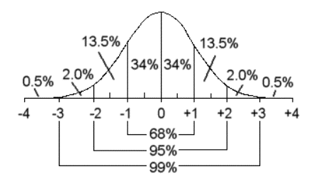

最后，通过结合实际业务定义发电机运行的四个状态。

## 数据处理

结合发电机故障风机历史数据进行发电机运行状态的数学建模。模型依据上述模型设计思路进行模型开发。通过反复训练，最终在发电机运行状态评估模型建设中按照残差模型进行模型建设，并使用决策树分类优化残差模型的状态结果。

- 首先进行数据源的读入与数据集成，将历史数据 SCADA 监测数据与故障数据相结合，标识出故障时刻。
- 其次过滤掉 NULL 占比 60% 以上的字段以及过滤字段单一值字段。
- 最后进行缺失值的填充与离群点极值点的处理。

##### 图 2\. 数据处理全流程

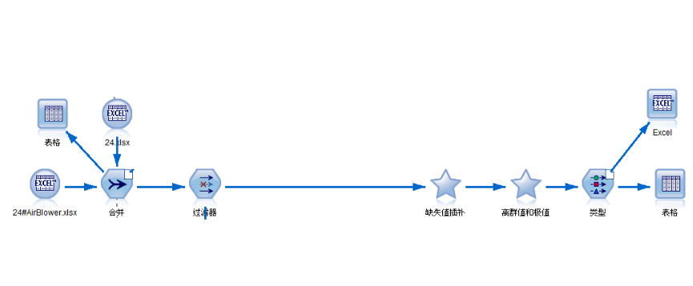

具体地数据清洗详情如下：

- 利用合并节点，通过获取的历史数据，仅仅存在监测数据，需要数据初步处理，进行故障标识。

##### 图 3\. 合并数据源

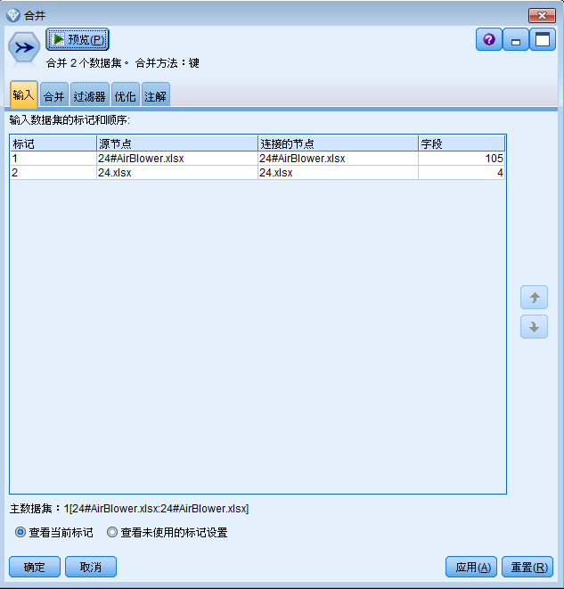

- 观察发现全部为 NULL 值的变量，对变量进行过滤。

##### 图 4\. 过滤变量

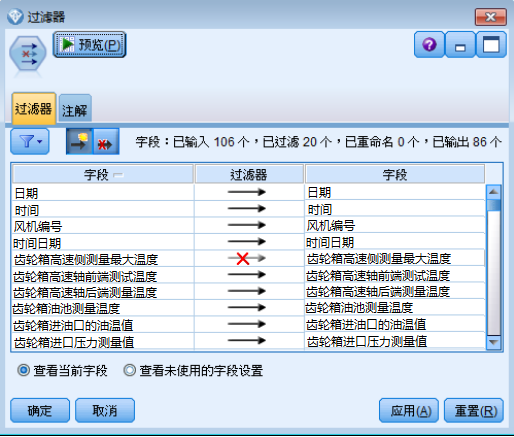

- 过滤后的数据，通过数据审核节点，进行缺失插补、离群点与极值点操作以及根据选择插补方法进行数据的预处理（点击生成按钮，就会自动生成缺失值插补与离群点和极值点两个超级节点）。

##### 图 5\. 缺失值插补

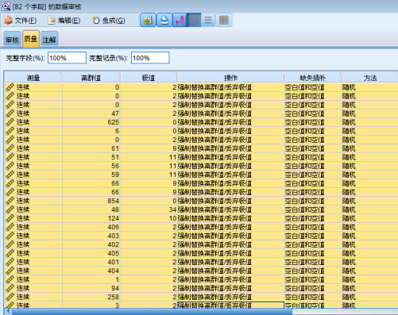

- 最后通过类型节点，实例化字段。就基本完成了数据清洗过程，这一步中主要针对原始数据进行理解，做数据的初步预处理。

##### 图 6\. 读取数据

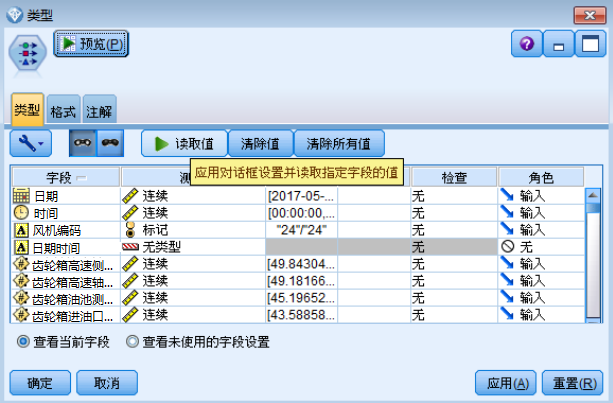

## 数据分析

在业务理解与数据清洗的基础上，原始数据已经进行了初步的处理，以满足数据的完整性，保障数据分析时数据的质量较好。

具体的分析过程主要通过图形展示，发现变量在故障发生前是否存在显著变化。对于存在显著变化的字段（或加工字段）进行重点关注；对于相关性较强的字段进行相关性去除（选择其中之一进行建模）；对于故障前后无明显变化的，进行非重要字段过滤。由于分析过程较为庞大，需要对 82 个变量进行分析观测，在此仅分析一些关键的字段：

- 针对发电机绕组测量温度 U，发电机绕组测量温度 V，发电机绕组测量温度 W，以及发电机绕组最高温度进行绘图，发现几个字段相关性很强，几乎一致，因此，为了处理相关性问题，针对七个字段进行平均处理，形成发电机绕组温度平均值。

##### 图 7\. 发电机绕组温度分析

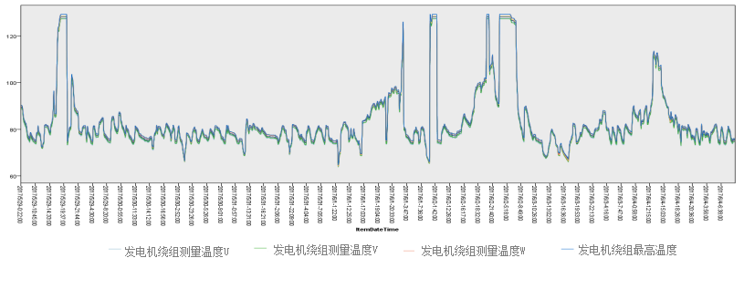

- 对于齿轮箱高速轴后端测量温度与齿轮箱高速轴前端测试温度，发现故障前，高速轴前后端温差不断增大，因此在此处需要对高速轴前后端温度进行差值处理。

##### 图 8\. 齿轮箱温度分析

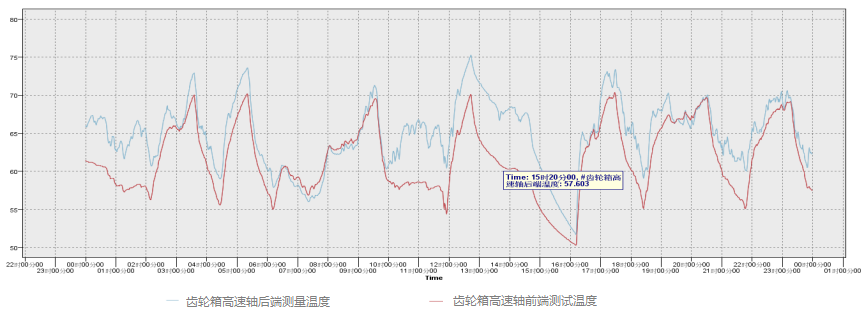

- 电网 A/B/C 电压变化，发现故障发生前，明显存在三相电压方差降低，因此对电网三相电压进行方差处理，规约变量。

##### 图 9\. 电网三相分析

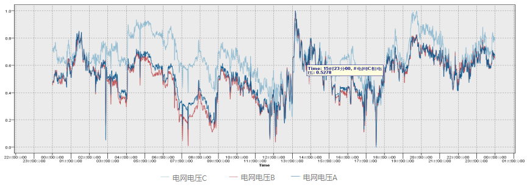

## 数据准备

通过对监测数据分析，进行数据的相关性分析以及数据精简方法。在数据准备阶段主要按照数据分析获取的数据信息，进行数据加工处理与精简。

(1) 按照数据分析结果，对电网三相电压标准差。

##### 图 10\. 电网三相数据处理

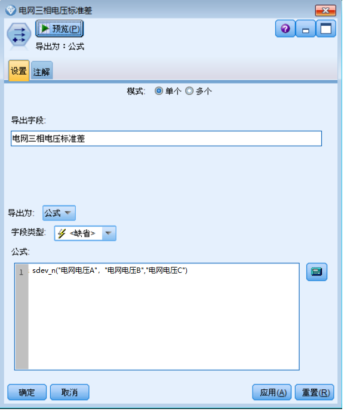

(2) 按照数据分析结果，对发电机绕组温度求均值。

##### 图 11\. 发电机绕组数据处理

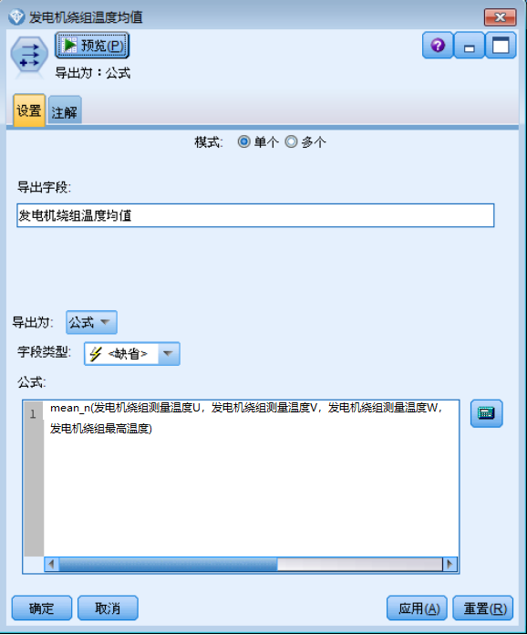

(3) 按照数据分析结果，齿轮箱高速轴前端测试温度与后端温度求差值。

##### 图 12\. 齿轮箱数据处理

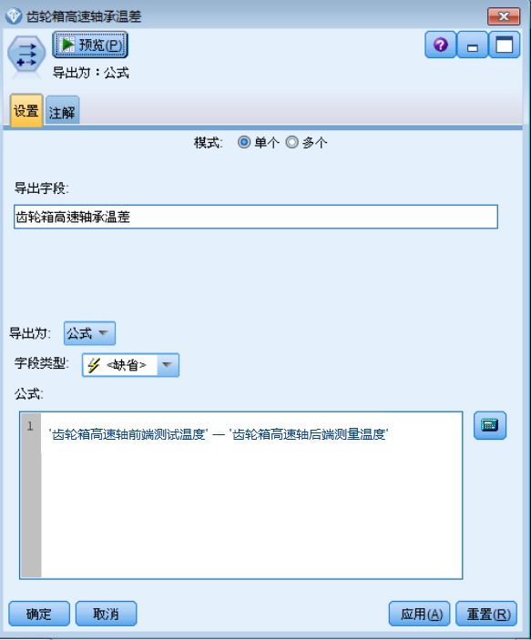

## 模型建设

首先按照残差模型思想进行模型建设，通过前面三步的准备，已经满足了模型开发前的数据需求，残差模型建设必须必须依赖于R节点进行模型建设（涉及矩阵运算）。其次因为满足残差模型建设的数据存在瑕疵，结合分类模型（C5.0）进行残差模型修正。

##### 图 13\. 模型总览

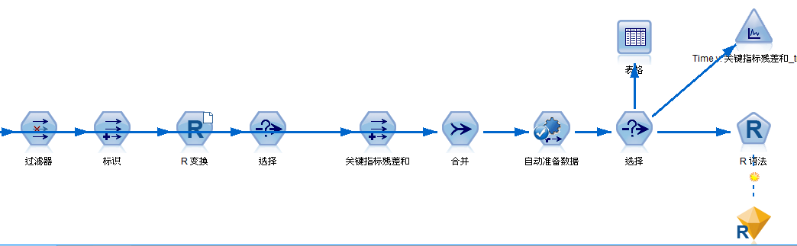

(1) 过滤掉时间等非连续变量。

##### 图 14\. 过滤非连续变量

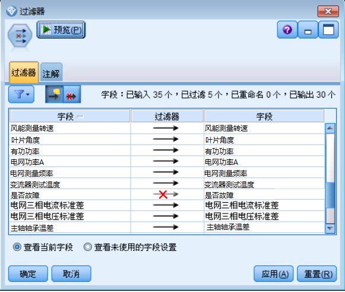

(2) 进行数据标识（现有数据全部标识为1，后做插值结果区分开来）。

##### 图 15\. 添加数据插补标示

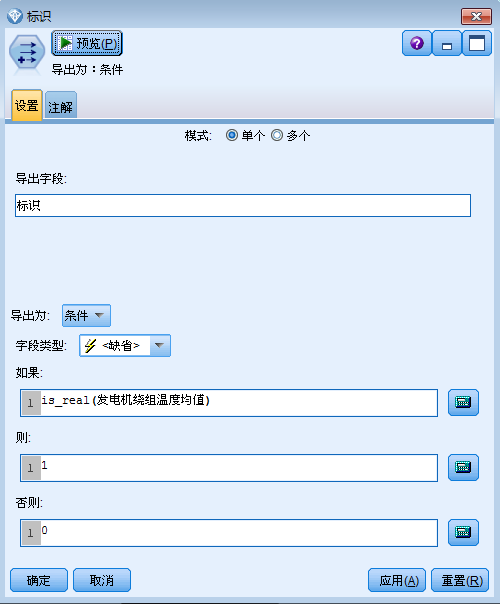

(3) 进行插值处理，借助数学矩阵运算，对相邻数据进行插值。

##### 图 16\. 缺失值插补

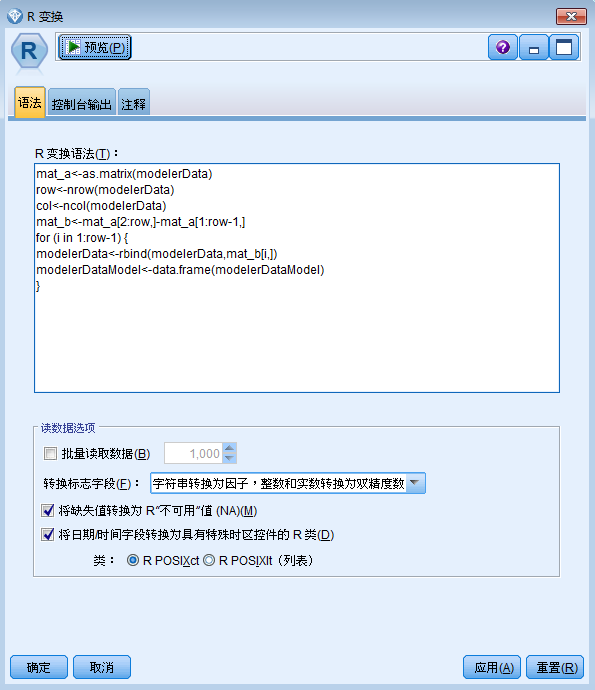

(4) 计算残差和（可以理解相邻时间节点之间的距离），形成一个描述时间序列稳定性的指标。

##### 图 17\. 计算残差和

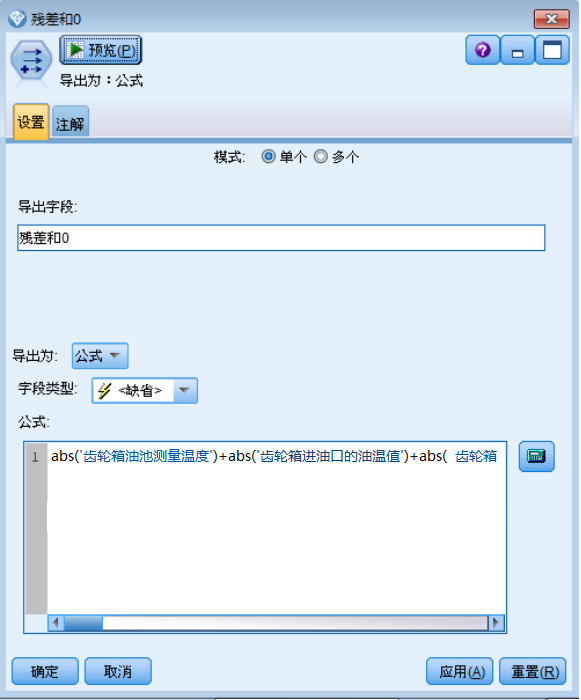

(5) 标准化残差和，形成标准正态分布，按照正态分布的性质确定运行状态。绿色线条表示 1 倍的标准差范围内，在这个范围内，数据稳定性较好，存在 68% 的置信概率；蓝色线条表示 2 倍的标准差，大约存在 95% 的置信概率落在该区域内，数据存在波动，但还算平稳；红色线条表示 3 倍的标准差，大约存在 99% 的置信概率落在该区域，数据波动较大；对于 99% 的可能性都落不到该区域的点（3 倍的标准差以外），当属于严重状态;黄色线条为故障时刻标记。

##### 图 18\. 标准化残差和

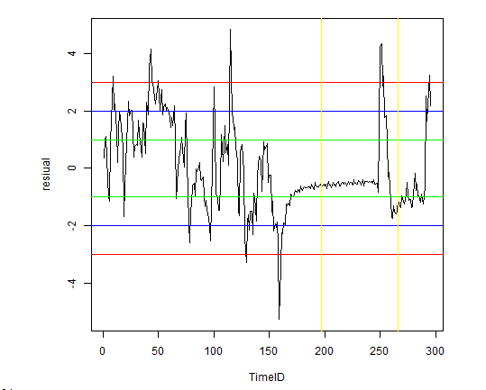

## 模型评估

模型建设完成以后，需要依据测试样本进行模型的准确性评估。分别对其他样本数据进行验证，主要验证发电机故障前运行状态情况，以此来验证模型的识别能力。样本风机验证：准确识别出故障前（橘红色为故障时刻），发电机处于严重运行状态的情况，其稳定性较差；

##### 图 19\. 风机处于严重运行状态模型验证

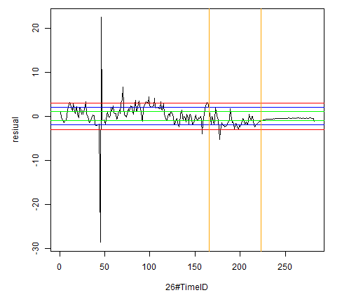

根据实际业务需求，主要是通过针对 SCADA 采集的实时监测数据，判别出发电机其运行状态。而在建模过程中，针对每个风机的发电机，模型通过残差计算，获取其运行稳定性评估，验证结果说明了模型在发电机运行评估的有效性。

## 模型部署

结合当前运行数据，主要针对发电机绕组故障、发电机轴承故障、发电机冷却水泵故障以及发电机润滑泵故障进行发电机运行状态的评估，模型建设主要依据数据理解、数据分析、数据准备、数据建模、模型评估以及模型合并部署进行建设，四大类故障都依据发电机残差模型进行建模，通过相关样本数据验证，针对发电机故障类型，完全有能力识别故障前发电机的运行状态。右击流文件进行部署：

##### 图 20\. 模型部署

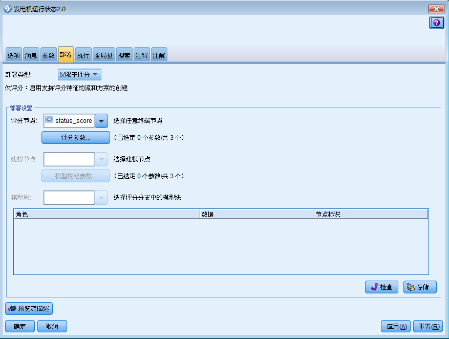

点击存储，填写存储库将模型放置到 CADS 上，在 CADS 上进行模型的流常规设置：

##### 图 21\. CADS 中模型配置

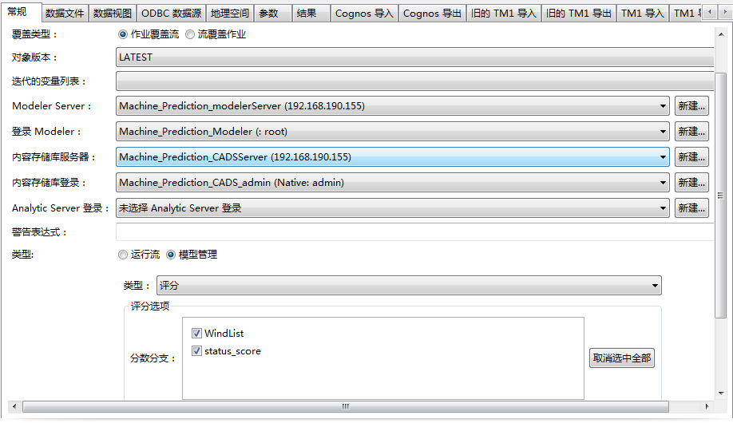

在 ODBC 数据源设置：

##### 图 22\. 数据源配置

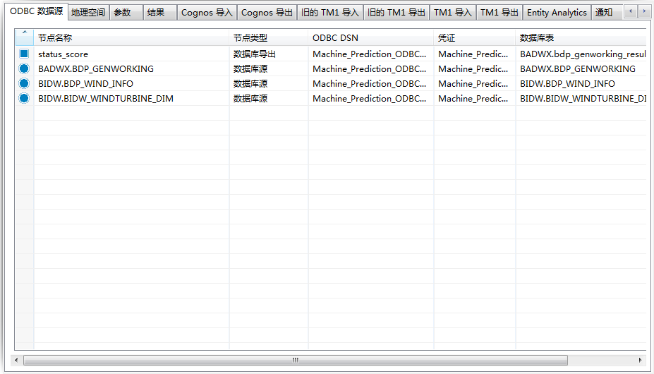

进行模型的跑批时间设置：

##### 图 23\. 模型运行时间配置

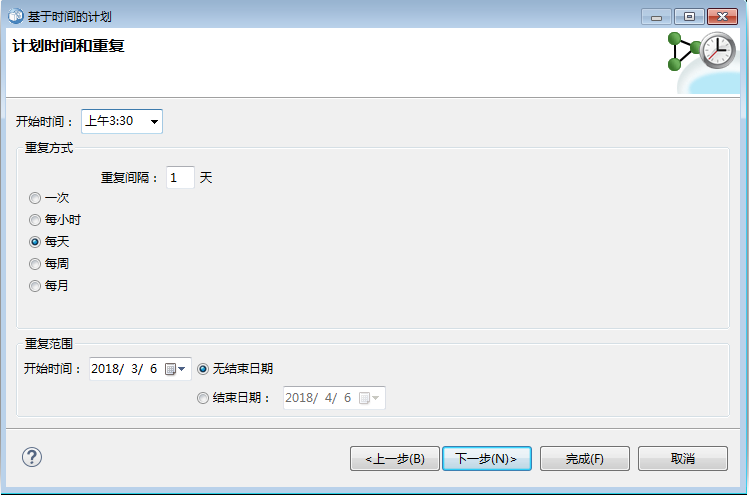

## 项目总结

本文的基于的背景是风电行业，但是无论是任何的工业场景，都可以复用整个交付流程，区别在于数据本身的特点。读者可以通过本文介绍的数据理解的办法，以不变应万变，才业务角度出发，深刻理解数据的特点并加以利用，实现场景的迁移。同时读者也可以感受到 IBM SPSS 系列产品的强大，不仅提供了易用的图形化页面，更集成了算法模型，强大的图形工具。数据科学家可以更多的专注与数据处理上，以及数据与业务的结合上。加快了模型的开发与实施。

## 参考资源

- [SPSS 产品套件风电行业齿轮箱轴承故障预测解决方案](https://developer.ibm.com/zh/technologies/analytics/)