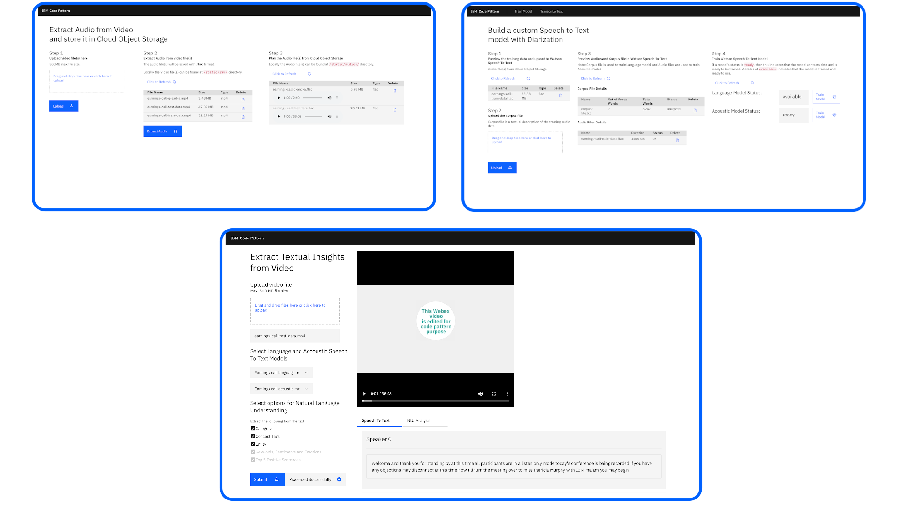
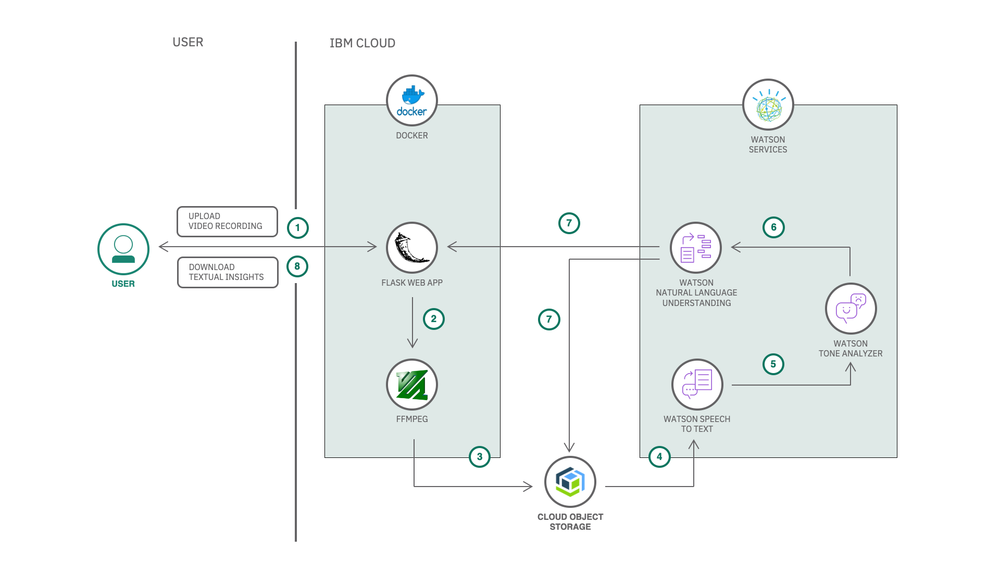
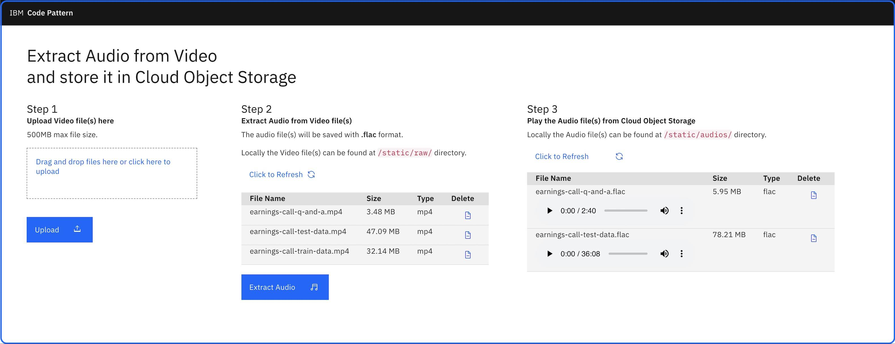
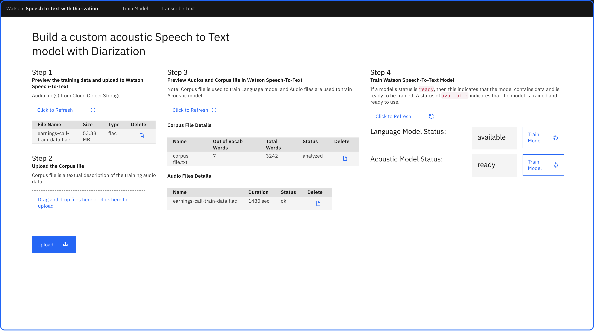
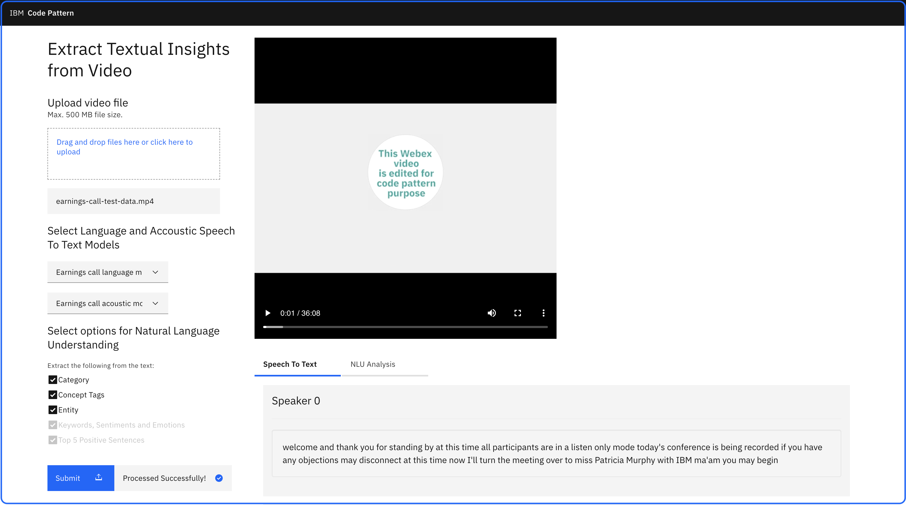

# 使用 IBM Watson 从视频中提取洞察
使用 Watson Speech to Text、Natural Language Processing 和 Tone Analyzer 服务从视频中提取有意义的洞察

**标签:** Python,Watson APIs,人工智能,对象存储,自然语言处理,语音与共情

[原文链接](https://developer.ibm.com/zh/articles/text-mining-and-analysis-from-webex-recordings/)

[Manoj Jahgirdar](https://developer.ibm.com/zh/profiles/manoj.jahgirdar), [Manjula G Hosurmath](https://developer.ibm.com/zh/profiles/mhosurma)

发布: 2020-09-16

* * *

世界卫生组织关于防控新型冠状病毒进一步传播的指导包括实施隔离。因此，受影响最严重地区的公司采取了一些预防措施来鼓励员工在家工作，并且教育机构也关闭了其场所。在家工作的员工必须了解公司的最新动态，并且能够与团队合作。此外，远程学习的学生必须了解最新的教学内容。

借助相关技术，员工可以通过虚拟会议来继续协作并参与到工作中。学校和教师可以通过虚拟教室继续与学生互动。可以录制这些会议；用户通过观看这些录制内容，也可以获益良多。为实现此目标，该解决方案解释了：

- 如何从录制的视频中提取音频
- 如何建立自定义语音转文本模型以生成音频的人声分离文本输出
- 如何使用高级自然语言处理以及 IBM® Watson™ Tone Analyzer 从文本文件中提取洞察

此解决方案演示了如何从视频（尤其是会议和课堂视频）中提取洞察。它可以提供如下洞察：类别、实体、概念、关键字、情感、情绪、排名靠前的肯定句以及词云。下图提供了此解决方案各个部分的概览。

## 架构流程

1. 用户在应用程序中上载虚拟会议或虚拟教室的录制视频文件。
2. FFmpeg 库从视频文件中提取音频。
3. 将提取的音频存储在 IBM Cloud Object Storage 中。
4. Watson Speech To Text 服务转录音频，以提供人声分离文本输出。
5. Tone Analyzer 分析文字记录，并从文字记录中选取排名靠前的肯定句。
6. Watson Natural Language Understanding 读取文字记录，识别文字记录中的关键事实，从而获取情绪和情感。
7. 然后，在应用程序中将视频中的关键事实和摘要呈现给用户，并将其存储在 IBM Cloud Object Storage 中。
8. 用户随后便可以下载文本洞察。

此解决方案中的 Code Pattern 是围绕 IBM 2019 年第 1 季度财报电话会议记录的数据而构建的。我们将分析财报电话会议的内容，并根据视频生成文本洞察。

这些 Code Pattern 说明了如何将 Speech To Text 服务与 Watson Natural Language Understanding 和 Tone Analyzer Watson 结合使用，以根据视频生成文本洞察。

### 从视频中提取音频

在 [从视频中提取音频](https://developer.ibm.com/zh/patterns/extract-audio-from-video-and-store-in-cloud-object-storage/) Code Pattern 中，您将了解以下过程的步骤：

- 创建 IBM Cloud Object Storage 存储区
- 将视频文件数据上载到该存储区
- 从视频文件中提取音频并将其存储在该存储区中
- 下载音频文件

## 使用人声分离功能构建自定义语音转文本模型

在 [使用人声分离功能构建自定义语音转文本模型](https://developer.ibm.com/zh/patterns/patterns/build-a-custom-speech-to-text-model-with-diarization-capabilities) Code Pattern 中，您将了解以下过程的步骤：

- 使用语料库文件训练自定义语言模型
- 使用存储区中的音频文件训练自定义声学模型
- 转录存储区中的音频文件，并获取人声分离文本输出
- 将文字记录存储在存储区中

## 使用高级自然语言处理和语调分析来提取有意义的洞察

在 [使用高级自然语言处理和语调分析来提取有意义的洞察](https://developer.ibm.com/zh/patterns/use-advanced-nlp-and-tone-analyser-to-extract-insights-from-text/) Code Pattern 中，您将了解以下过程的步骤：

- 从存储区中加载文字记录文件
- 选择要从文字记录中提取的实体
- 利用高级自然语言处理功能，获取包含实体、概念、类别、关键字、情感和情绪的 Natural Language Understanding 报告
- 使用 Tone Analyzer 获取前五个肯定句
- 获取基于名词、形容词和动词的词云
- 打印 Natural Language Understanding 报告

## 从视频中提取洞察

在 [从视频中提取洞察](https://developer.ibm.com/zh/patterns/extract-textual-insights-from-a-given-video/) Code Pattern 中，您将了解以下过程的步骤：

- 将任何视频文件上载到应用程序中
- 获取视频文件的人声分离文本输出
- 利用高级自然语言处理功能，获取包含实体、概念、类别、关键字、情感和情绪的 Natural Language Understanding 报告
- 使用 Tone Analyzer 获取前五个肯定句
- 获取基于名词、形容词和动词的词云
- 打印 Natural Language Understanding 报告

本文翻译自： [Extract insights from videos using IBM Watson](https://developer.ibm.com/technologies/artificial-intelligence/articles/text-mining-and-analysis-from-webex-recordings/)（2020-07-20）