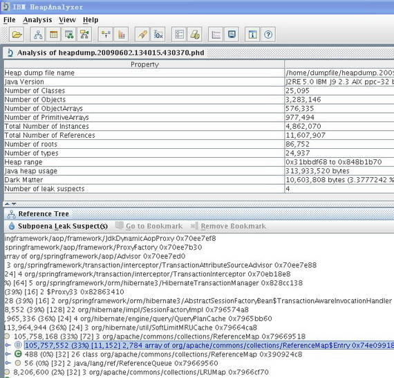
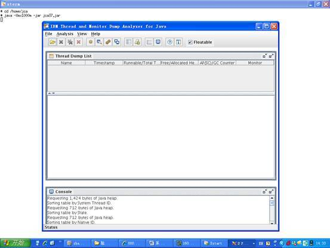
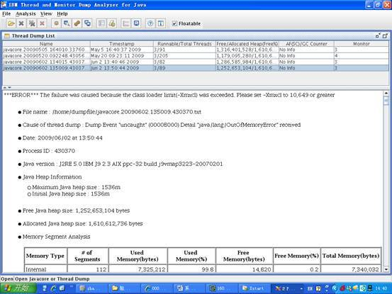
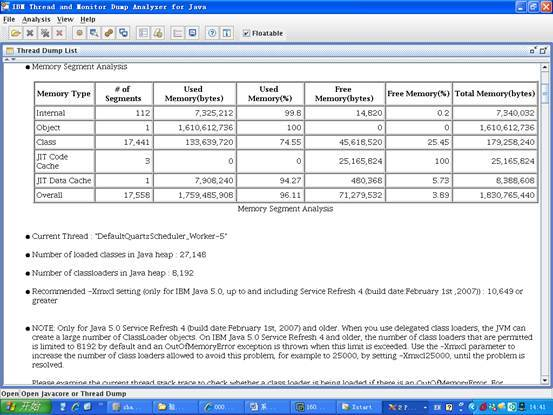
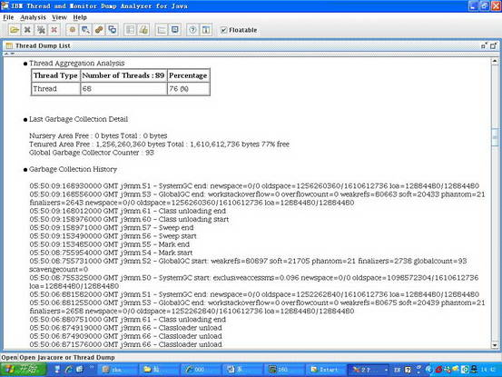
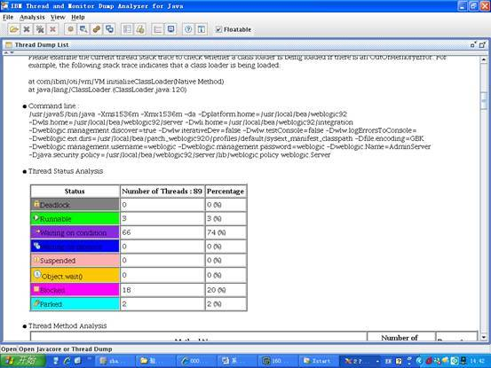

# 使用 IBM 性能分析工具解决生产环境中的性能问题
解决性能问题的最佳实践

**标签:** Java

[原文链接](https://developer.ibm.com/zh/articles/j-lo-javacore/)

张永峰

发布: 2010-04-09

* * *

## 序言

企业级应用系统软件通常有着对并发数和响应时间的要求，这就要求大量的用户能在高响应时间内完成业务操作。这两个性能指标往往决定着一个应用系统软件能否成功上线，而这也决定了一个项目最终能否验收成功，能否得到客户认同，能否继续在一个行业发展壮大下去。由此可见性能对于一个应用系统的重要性，当然这似乎也成了软件行业的不可言说的痛 —— 绝大多数的应用系统在上线之前，项目组成员都要经历一个脱胎换骨的过程。

生产环境的建立包含众多方面，如存储规划、操作系统参数调整、数据库调优、应用系统调优等等。这几方面互相影响，只有经过不断的调整优化，才能达到资源的最大利用率，满足客户对系统吞吐量和响应时间的要求。在无数次的实践经验中，很多软件专家能够达成一致的是：应用系统本身的优化是至关重要的，否则即使有再大的内存，也会被消耗殆尽，尤其是产生 OOM（Out Of Memory）的错误的时候，它会贪婪地吃掉你的内存空间，直到系统宕机。

## 内存泄露 — 难啃的骨头

产生 OOM 的原因有很多种，大体上可以简单地分为两种情况，一种就是物理内存确实有限，发生这种情况时，我们很容易找到原因，但是它一般不会发生在实际的生产环境中。因为生产环境往往有足以满足应用系统要求的配置，这在项目最初就是根据系统要求进行购置的。

另外一种引起 OOM 的原因就是应用系统本身对资源的的不恰当使用、配置，引起内存使用持续增加，最终导致 JVM Heap Memory 被耗尽，如没有正确释放 JDBC 的 Connection Pool 中的对象，使用 Cache 时没有限制 Cache 的大小等等。本文并不针对各种情况做讨论，而是以一个项目案例为背景，探索解决这类问题的方式方法，并总结一些最佳实践，供广大开发工程师借鉴参考。

## 项目背景介绍

项目背景：

1. 内网用户 500 人，需要同时在线进行业务操作（中午休息一小时，晚 6 点下班）。
2. 生产环境采用传统的主从式，未做 Cluster ，提供 HA 高可用性。
3. 服务器为 AIX P570，8U，16G，但是只有一半的资源，即 4U，8G 供新系统使用。

项目三月初上线，此前笔者与架构师曾去客户现场简单部署过一两次，主要是软件的安装，应用的部署，测一下应用是不是能够跑起来，算作是上线前的准备工作。应用上线（试运行）当天，项目组全体入住客户现场，看着用户登录数不断攀升，大家心里都没有底，高峰时候到了 440，系统开始有点反应变慢，不过还是扛下来了，最后归结为目前的资源有限，等把另一半资源划过来，就肯定没问题了。（须知增加资源，调优的工作大部分都要重新做一遍，系统级、数据库级等等，这也是后面为什么建议如果资源可用，最好一步到位的原因。）为了临时解决资源有限的问题，通过和客户协商，决定中午 12 点半和晚上 11 点通过系统调度重启一次应用服务器，这样，就达到了相隔几个小时，手动清理内存的目的。

项目在试运行阶段，仍旧有新的子应用开始投入联调，同时客户每天都会提出这样那样的需求变更，如果要的很急的话，就要随时修改，隔天修正使用。修改后没有充分的时间进行回归测试，新部署的代码难免会有这样那样的问题，遇到过几次这种情况，最后不得不在业务系统使用的时候，对应用系统进行重新启动，于是就会出现业务终止引起的数据不一致，还要对这些数据进行修正维护，加大了工作量。期间，应用在运行过程中有几次异常缓慢的情形，由于业务不能中断太久，需要迅速恢复系统投入使用，所以往往是重启一下应用服务器来释放内存。事后检查日志，才发现日志中赫然记录有 OOM 的错误，这才引起了项目经理的注意，要求架构师对该问题进行进一步研究确认。

但是几个月过去，问题依旧出现，于是通过客户和公司的协调，请来几位专家，包括操作系统专家、数据库专家，大部分的专家在巡检之后，给出的结论是：大部分需要调整的参数都已经调整过了，还是要从应用系统本身找原因，看来还是要靠我们自己来解决了。（最终的结果也证明，如此诡异隐蔽的 OOM 问题是很难一眼就能发现的，工具的作用不可忽视。）

我们通过对底层封装的框架代码，主要是 DAO 层与数据库交互的统一接口，增加了 log 处理以抓取所有执行时间超过 10 秒钟的 SQL 语句，记录到应用系统日志中备查。同时通过数据库监控辅助工具给出的建议，对所有超标的 SQL 通过建立 index，或者修正数据结构（主要是通过建立冗余字段来避免多表关联查询）来进行优化。这样过了几天后，已经基本上不存在执行时间超过 10 秒的 SQL 语句，可以说我们对应用层的优化已经达标了。

但是，宕机的问题并没有彻底解决，陆续发生了几次，通过短暂的控制台监控，发现都有线程等待的现象发生，还有两三次产生了几个 G 大小的 heapdump 文件，同时伴随有 javacore 文件产生。因为每次宕机的时候都需要紧急处理，不允许长时间监控，只能保留应用服务器日志和产生的 heapdump 文件，做进一步的研究。通过日志检查，我们发现几次宕机时都发生在相同的某两个业务点上，但是多次对处理该业务功能的代码进行检查分析，仍旧没有找到原因。看来只能寄希望于宕机产生的 heapdump 和 javacore 了，于是开始重点对 OOM 产生的这些文件进行分析。

## IBM 分析工具的使用

这里，我们简单介绍一下 heapdump 文件和 javacore 文件。heapdump 文件是一种镜像文件，是指定时刻的 Java 堆栈的快照。应用程序在发生内存泄露的错误时，往往会生成 heapdump 文件，同时伴随有 javacore 文件生成，javacore 包含 JVM 和应用程序相关的在特定时刻的一些诊断信息，如操作系统，内存，应用程序环境，线程等的信息。如本文案例中分析的下图中的 heapdump.20090602.134015.430370.phd 和 javacore.20090602.134015.430370.txt。

由于笔者之前并没有这方面的分析经验，觉得 heapdump 文件很大，就想当然拿它开刀了。首先是寻找工具，类似的工具有多种，笔者最后选择了 IBM 的 HeapAnalyzer（`http://www.alphaworks.ibm.com/tech/heapanalyzer`）。通过对 heapdump 文件的解析，HeapAnalyzer 可以分析出哪些对象占用了太多的堆栈空间，从而发现导致内存泄露或者可能引起内存泄露的对象。它的使用很简单，可以从它的 readme 文档中找到，这里我们简单举个例子如下：

```
#/usr/java50/bin/java – Xmx2000m – jar ha36.jar heapdump.20090602.134015.430370.phd

```

Show moreShow more icon

通常我们需要使用较大的 heapsize 来启动 HeapAnalyzer，因为通过 HeapAnalyzer 打开过大的 heapdump 文件时，也可能会因为 heapsize 不够而产生 OOM 的错误。开始的时候，笔者从服务器上将 heapdump 文件通过 ftp 下载下来，然后试图通过本机 window 环境进行分析。笔者使用的电脑是 2G 内存，启动 HeapAnalyzer 时指定的是 1536 M，但是几次都是到 90% 多的时候进度条就停止前进了。迫不得已同时也是为了能达到环境一致的效果，笔者将 HeapAnalyzer 上传到生产环境，直接在生产环境下打开 heapdump 文件。

##### 图 1.分析 phd 后的结果



个人感觉 HeapAnalyzer 给出的分析结果可读性不强，而且不能准确定位问题，从分析结果看大致是因为加载的对象过多，但是是哪个模块导致的问题就跟踪不到了。笔者开始寻找 HeapAnalyzer 分析结果相关的资料，试图从这个可读性不强的结果中找到蛛丝马迹，可是许久没有进展，再一次陷入了困境。

在多次研究 heapdump 文件无果的情况下，笔者开始逐渐将注意力转移到 javacore 文件上，虽然它比较小，说不定内藏玄机呢。通过多方搜寻，找到了 IBM Thread and Monitor Dump Analyzer for Java（以下简称 jca）—— A tool that allows identification of hangs, deadlocks, resource contention, and bottlenecks in Java threads。通过它自身的这段描述来看，这正是笔者所需要的好工具。

这个工具的使用和 HeapAnalyzer 一样，非常容易，同样提供了详细的 readme 文档，这里也简单举例如下：

```
#/usr/java50/bin/java -Xmx1000m -jar jca37.jar

```

Show moreShow more icon

##### 图 2\. 通过 xManager 工具登录到 AIX 服务器上打开 jca 的效果图



笔者直接在生产环境下直接通过它对产生的 javacore 文件进行分析，令人惊喜的是，其分析结果非常明了，笔者心头的疑云在对结果进行进一步分析核实后也渐渐散去。

##### 图 3\. jca 对 javacore.20090602.134015.430370.txt 的分析结果第 1 部分



从图中，我们可以清楚地看到引发错误的原因 —— The failure was caused because the class loader limit was exceeded。同时我们还能看出当前生产环境使用的 JRE 版本是：J2RE 5.0 IBM J9 2.3 AIX ppc-32 build j9vmap3223-20070201 ，这个 SR4 的版本有个问题，我们可以从分析结果图的第二部分的 NOTE 小节清楚地看到：

##### 图 4\. jca 对 javacore.20090602.134015.430370.txt 的分析结果第 2 部分



_NOTE: Only for Java 5.0 Service Refresh 4 (build date:February 1st, 2007) and older. When you use delegated class loaders, the JVM can create a large number of ClassLoader objects. On IBM Java 5.0 Service Refresh 4 and older, the number of class loaders that are permitted is limited to 8192 by default and an OutOfMemoryError exception is thrown when this limit is exceeded. Use the -Xmxcl parameter to increase the number of class loaders allowed to avoid this problem, for example to 25000, by setting -Xmxcl25000, until the problem is resolved._

原来，OOM 竟然是因为这个原因产生的。那么到底是哪里加载的对象超过了这个 8192 的限制呢？接下来笔者结合分析结果和应用系统 log 进行了进一步的分析，更加验证了 JCA 分析结果的正确性。

在分析结果中可以看到 Current Thread ，就是对应引起 OOM 的应用服务器的线程，使用该线程的名称作为关键字在我们的 log 里进行搜索，迅速定位到了业务点——这是一个定时的调度，其功能是按固定时间间隔以 DBLink 的方式从外部应用的数据库系统中抽取数据，通过应用层逻辑转换后保存到内网数据库系统中。应用层的逻辑是对所有的业务数据进行循环，对每条业务数据进行到 POJO 的一一对照转换，这意味这一条业务数据需要 10 几个 POJO 进行组合对照，也就是说，如果外网在指定的时间间隔内数据量稍大，就会加载大量的对象，使 JVM 的 class loaders 瞬间超过 8192 的限制，而产生 OOM 的错误，从而使内存不断被消耗，直至宕机。

jca 还提供了对垃圾回收和线程状态的详细分析数据，可以参考如下两图：

##### 图 5\. jca 对垃圾回收状态的分析数据



##### 图 6\. jca 对垃圾线程状态的分析数据



问题核实后，如何进行解决呢？分析结果中也给出了相应的建议，从图 4 的 Recommended 小节我们可以看到：

Recommended -Xmxcl setting (only for IBM Java 5.0, up to and including Service Refresh 4 (build date:February 1st ,2007)) : 10,649 or greater。

为了考虑到对既有旧系统不产生影响，我们没有对 JRE 进行升级，而是采用了分析结果给出的建议，在应用服务器启动后设置 -Xmxcl 参数为 25000，为验证我们的修改是不是成功解决掉了 OOM 宕机的问题，笔者取消了对应用服务器的自动重启调度，通过一段时间的监控发现，系统运行良好，一直没有再出现 OOM 而宕机的问题，问题得以最终解决。

## 结束语

1. 整体规划

    系统上线前要做好充分的准备工作，这一点很重要，上线计划可不是拍拍脑门就能想出来的，需要很多项目成员的参与。

    1. 项目实施计划书：要包括预计实施目标，双方的实施负责人（包括 backup），协调哪些资源应该找哪些人，详细的阶段性计划等等。
    2. 实施小组：指定具有实施经验的架构师，系统工程师，开发组长组成实施小组，负责生产环境的搭建及调整。成员构成上一定要包含项目组内的稳定核心人员，以保证能在特殊情况需要时做 backup。核心人员的流动会引起项目风险，尤其是在上线初期的不稳定阶段。
    3. 对可规划使用的资源一定要充分利用，这一点应包含在项目实施计划书内，尽量做到资源一步到位。因为本项目案例中，旧有系统和新系统并行运行，可用的资源在不断发生变化，期间为解决性能问题，曾尝试将资源分配向新系统倾斜，以尝试是否能解决问题，这在一定程度上也会影响实施的进度。
    4. 需要对核心的配置进行确认，如 JRE 版本，数据库版本等。如果我们在生产环境建立的初期，就把 JRE 升级到最新的版本，可能就避免了这次 6 个月宕机的煎熬。
2. 压力测试

    大部分具有并发需求的应用系统上线前，都要经过开发团队的压力测试，这样在试运行阶段才能心里有底。本项目案例中，由于工期过于紧张，加之其他因素，导致压力测试不够充分，虽然 OOM 的问题并不是因为并发数过多产生，但是这一环节是不可忽视的。

3. 攻坚团队

    一个拥有高度的执行力的团队一定是一个责任分明的团队。在应对突发、严重、紧急情况时，要有专门的攻坚团队来解决这类问题，这个团队应该包括项目组的核心开发人员，有较强的动手能力和研究能力，能够变通解决问题，思路开阔。他们的作用是至关重要的，往往可能决定项目的成败。

4. 信心很重要

    每一次攻坚内存泄露的问题都是一次探险之旅，需要有清醒的意识和头脑，更要凝结你的意志和信心，因为这是一个艰苦的过程。本文案例由发生至解决有半年之久，当笔者转向分析 javacore 文件后，迅速定位了问题，终于柳暗花明，这种喜悦是难以言表的。

5. 纸上得来终觉浅， 绝知此事要躬行。

    这一条不多说了，有所行，才有所得。