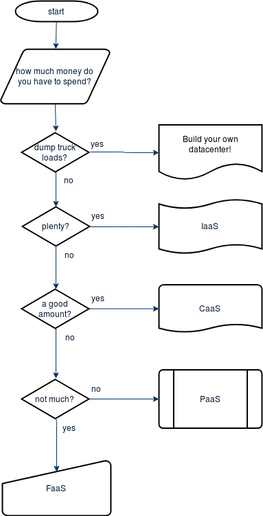
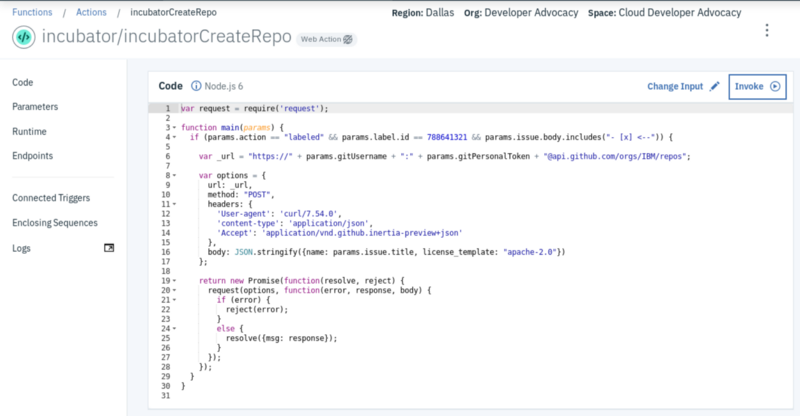
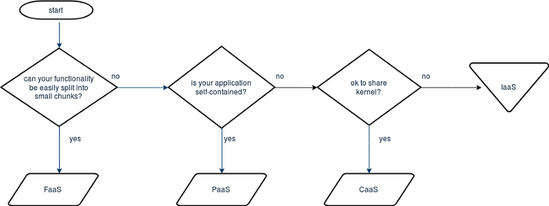
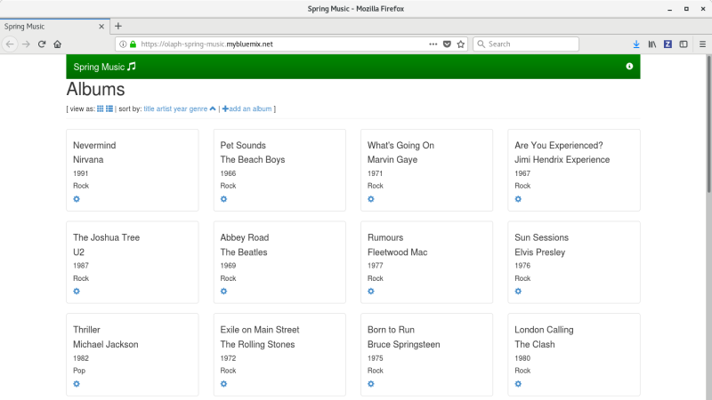
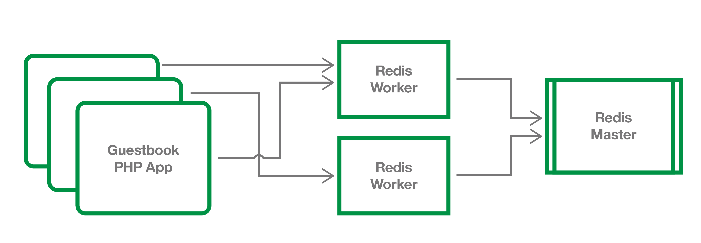

# 使用 IaaS、FaaS、PaaS 和 CaaS 的时机
或者，有多少个 aaS 首字母缩写词？

**标签:** Cloud Foundry,IBM Cloud,Serverless,云计算,基础架构,容器,平台即服务

[原文链接](https://developer.ibm.com/zh/articles/when-to-use-iaas-faas-paas-and-caas/)

[Olaph Wagoner](https://developer.ibm.com/zh/profiles/mwagone)

发布: 2020-05-11

* * *

如果您是才接触云计算，您可能会因为遇到大量的首字母缩略词而踌躇不前。现如今，几乎所有产品（甚至是 [运输](https://ridesharecentral.com/taas-what-is-it-and-what-does-it-mean-for-the-future-of-transportation)）都是 _作为服务_ (aaS) 出售的。为了弄清楚一些可用产品，我们来看看其中一些 aaS 首字母缩写词，即：基础架构即服务 ( [IaaS](https://en.wikipedia.org/wiki/Infrastructure_as_a_service))、平台即服务 ( [PaaS](https://en.wikipedia.org/wiki/Platform_as_a_service))、容器即服务 (Caas) 和无服务器（也称为功能即服务 ( [FaaS](https://en.wikipedia.org/wiki/Function_as_a_service))）。

在尝试确定哪一种产品最适合您时，您可以根据自己的预算来确定。

## 无限预算

我们来从最昂贵的解决方案开始，然后逐步展开。如果预算没有限制，那么您可能不需要这些产品。因为您可以购买自己的楼宇，在里面配备服务器机架和网络设备，再雇人来完成安装、运行和维护。您可能还需要大量的空调设备。

但这种情况很罕见。即使是预算非常充足的政府机构，也要雇用外部公司来为其运行数据中心。这是为什么呢？什么事情都自己做其实是一件相当痛苦的事，这可能就是最初引入云计算的原因。由此提出了第一个要讨论的产品：基础架构即服务 (IaaS)。

## 基础架构即服务

IaaS 与拥有自己数据中心的情况最为类似。您可以控制所需的各种机器数量、用于连接（或分离）机器的网络以及数据存储形式。您可以租用实际硬件，也可以获取具有相同性能的虚拟机。这是最昂贵的产品，但提供了最大的控制权。

因此，在确定哪一个产品最适合您时，成本不再是最主要的考量因素。成本不一定是唯一的限制条件，但可能是一个非常重要的考量因素。您可以根据工作的复杂度来做出更明智的决策。我们还可以根据所需的控制程度来考虑这个问题。

## 功能即服务

能否将您尝试要完成的工作分解为几段代码？如果可以，那么功能即服务 (FaaS) 可能是一种理想的选择。下面以我最近参与过的一个项目为例。为 GitHub 问题添加特定标签时，我想要创建一个新的存储库：

在此示例中，从 GitHub 中生成 Webhook 时将运行一项操作。该操作会检查其查找的标签是否已应用，如果已应用，则会对 GitHub 进行 API 调用以创建期望的存储库。这作为云功能非常有用，它是由易于定义的事件触发的一小段代码。在此处可以节省一大笔资金。您只需为执行少量代码所需的时间付费。如果您的代码每天只执行几次，那么时间可能只有几秒钟。

## 平台即服务

虽然 FaaS 对于拆分小任务非常有用，但如果要部署更大或更复杂的应用程序，那么它就不是理想之选。平台即服务 (PaaS) 可能更适合您。利用 IBM Cloud Foundry 等平台，您可以发布、更新和扩展应用程序，而不必担心用于运行应用程序的硬件类型。使用 PaaS 产品，您可以获得更大的控制权，例如，可指定运行应用程序所用的实例数以及允许每个实例耗用的内存量。借助 PaaS，您的应用程序会一直运行，而 FaaS 则是仅在需要时执行代码。它使用的资源更多一些，因此价格也高一些。

_前端_ 就比较适合使用 PaaS 进行部署。这是 Web 应用程序中面向用户的部分，它将连接到用户无法直接访问的其他 _后端_ 服务（例如数据存储）并使用这些服务。

GitHub 上 Cloud Foundry 存储库中最受欢迎的样本应用程序是 [spring-music](https://github.com/cloudfoundry-samples/spring-music)，这是一个 Java 应用程序，允许用户浏览和编辑音乐收藏。这对于 PaaS 中的部署非常有效，因为可以根据需要扩展应用程序，同时可以对数据存储进行单独管理（备份、增强弹性）。

在选择服务产品时，另一个重要的考量因素是您的部署是否需要保存状态。有状态的应用程序会跟踪交互及其进度，而无状态的应用程序则不会，它们是依靠任何给定请求附带的信息来保存状态。当然，更简单的做法是推送无状态代码并利用平台托管服务来处理请求历史记录。如果您期望的部署需要自行保存状态，那么可以使用容器。

## 容器即服务

容器即服务 (CaaS) 介于 PaaS 和 IaaS 产品之间，您可以在 CaaS 中指定有关运行应用程序的环境（例如，操作系统）的更多信息。顾名思义，使用 CaaS 可以部署一个或多个容器，而使用 PaaS _只能_ 部署一个应用程序。但它不是一个完整的虚拟机，因为它与其他容器共享一个内核，且具有自己的安全性。CaaS 的主要优点是能够同时部署多个相互协作的容器。在大型部署中，您可以为应用程序前端、底层数据库、搜索功能、日志存储和处理等提供单独的容器。所有这些容器可以作为一个组（称之为集群）进行管理。

下图展示了容器化应用程序的一个更简单的示例，即 Guestbook。

在 Kubernetes 文档中， [部署 Guestbook 应用程序](https://kubernetes.io/docs/tutorials/stateless-application/guestbook/) 是您的第一个练习。它由一个用于存储 Guestbook 条目的单实例 Redis 主实例、多个用于读取的复制 Redis 实例以及多个 Web 前端实例组成。如果您既要管理前端又要管理后端，并且要控制这两者之间的通信方式，那么 CaaS 产品更符合您的需求。

## 没有一种产品是“万灵丹”

其实，我用直线展示决策过程并不恰当。尤其是上述产品都不互斥。在微服务时代，完全可以将其中部分或全部产品组合在一起，以便最有效地实现所需的部署。甚至可以将容器托管 _为_ 云功能。生成的功能并不会一直运行，因此它不会是有状态的，但存在这种可能性。可能性的数量几乎与用于部署的首字母缩略词一样多。

希望您现在已弄清楚了从何处开始云之旅！

本文翻译自： [When to use IaaS, FaaS, PaaS, and CaaS](https://developer.ibm.com/depmodels/cloud/articles/when-to-use-iaas-faas-paas-and-caas)（2019-07-01）