# 使用 Istio 实现基于 Kubernetes 的微服务应用
介绍新一代微服务架构 Istio

**标签:** 云计算

[原文链接](https://developer.ibm.com/zh/articles/cl-lo-implementing-kubernetes-microservice-using-istio/)

魏 新宇

发布: 2019-01-17

* * *

## 概述

近两年，随着容器、Kubernetes 等技术的兴起，微服务被广泛提及并被大量使用。本文旨在让读者了解 Istio，通过它与 Kubernetes 相结合，大幅降低微服务的复杂度，以便让开发人员更关注于代码本身。全文将会介绍以下几个方面：

- Istio 的架构分析
- Istio 的技术实现
- 基于 Istio 的微服务实验展现

## Istio 的架构分析

### Istio 介绍

Istio 被称为 Service Mesh 架构，该开源项目由 Google 和 IBM 主导，根据 [http://stackalytics.com](http://stackalytics.com) 网站的统计，该社区代码 Commits 厂商排名如下：

##### 图 1\. Istio 各厂商代码贡献量图示

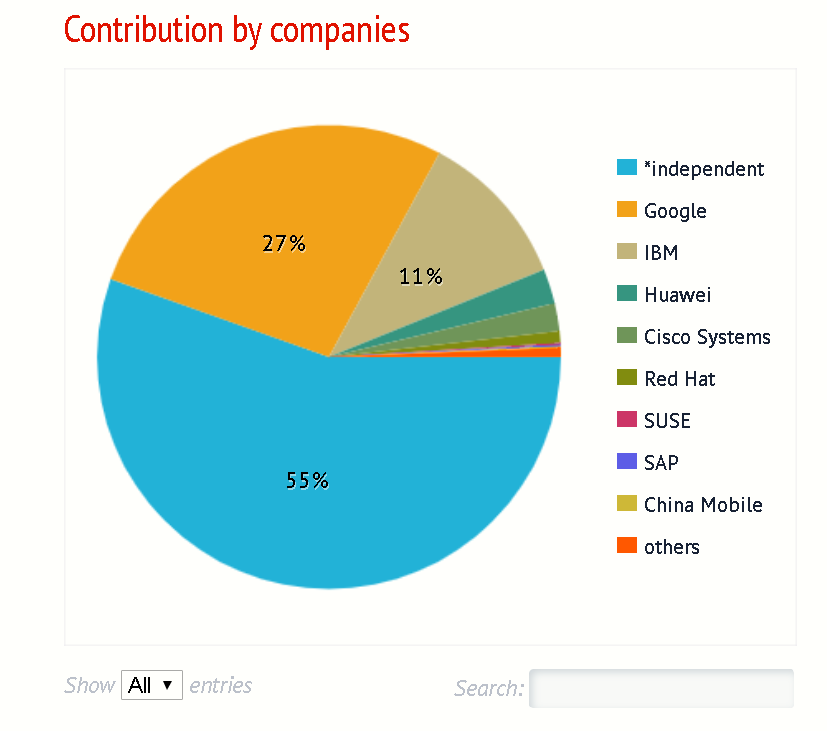

##### 图 2\. Istio 各厂商代码贡献量排名

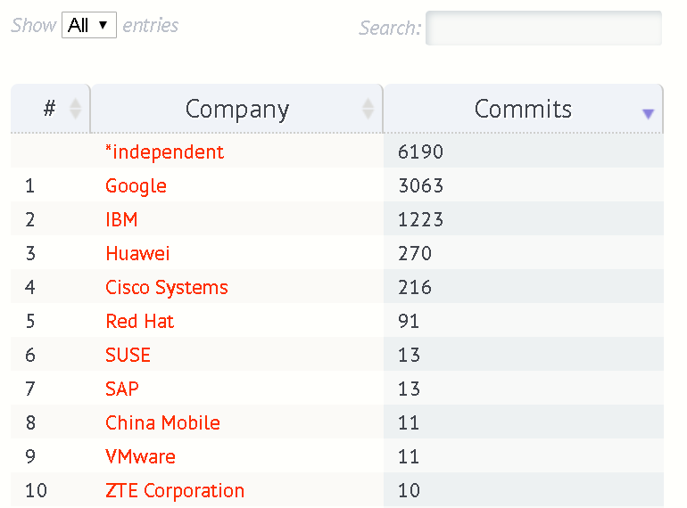

在 Github 上，Istio [项目](https://github.com/istio/istio) 受关注的程度非常高，您可进一步了解。接下来，我们详细介绍 Istio 的技术架构。

### Istio 的架构

Istio 分为两个平面：数据平面和控制平面。

**数据平面：**

数据平面由一组 sidecar 的代理（Envoy）组成。这些代理调解和控制微服务之间的所有网络通信，并且与控制平面的 Mixer 通讯，接受调度策略。

**控制平面：**

控制平面通过管理和配置 Envoy 来管理流量。此外，控制平面配置 Mixers来实施路由策略并收集检测到的监控数据。

##### 图 3\. Istio 的架构图

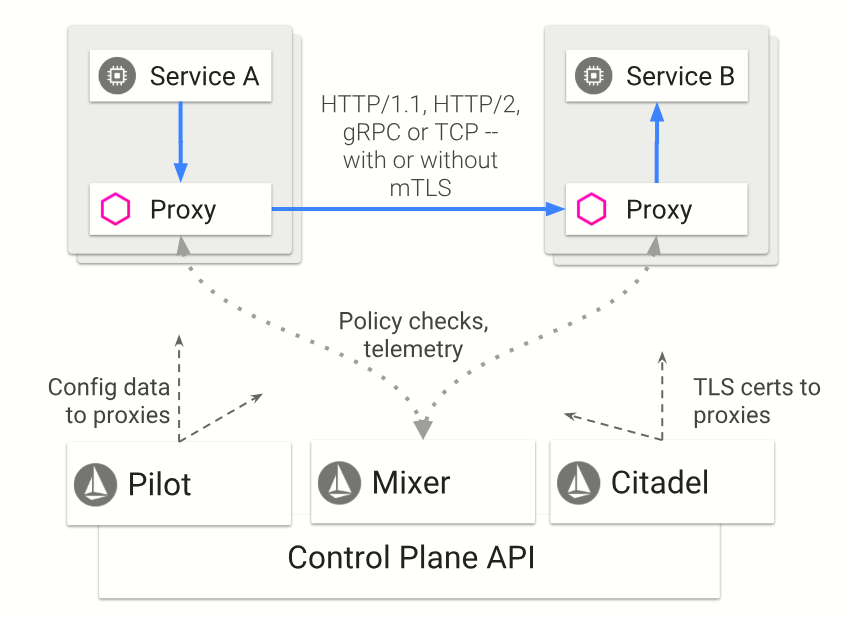

在介绍了 Istio 的两个平面以后，我们详细介绍 Istio 的各个组件。

**Envoy** 是一个用 C ++开发的高性能代理，用于管理 Service Mesh 中所有服务的所有入站和出站流量。 Istio 利用 Envoy 的许多内置功能，例如：

- 动态服务发现
- 负载均衡
- TLS 终止
- HTTP / 2 和 gRPC 代理
- 断路器
- 健康检查
- 流量分割
- 故障注入
- 监控指标

我们知道，在 Kubernetes 中集群中，pod 是最小的计算资源调度单位。一个 pod 可以包含一个或者多个容器，但通常是一个。而使用 Istio 的时候，需要在 pod 中主容器旁注入一个 sidecar，也就是上面提到的代理（Envoy）。

举一个例子，我们查看一个被注入了 Envoy 的 pod，从下图结果可以看到，这个 pod 包含两个容器：

##### 图 4\. 查看 pod 中的 Containers

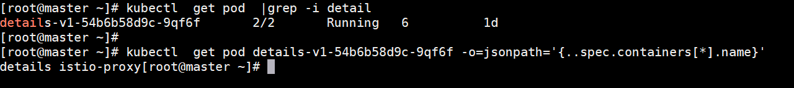

在 Istio 中，每一个 pod 中都必须要部署一个 Sidecar。

**Mixer** 是一个独立于平台的组件，负责在整个 Service Mesh 中执行访问控制和使用策略，并从 Envoy 代理和其他服务收集监控到的数据。

**Pilot** 为 Envoy 提供服务发现；为高级路由（例如，A / B 测试，金丝雀部署等）提供流量管理功能；以及异常控制，如：超时，重试，断路器等。

**Citadel** 通过内置身份和凭证管理，提供强大的服务到服务和最终用户身份验证。我们可以使用 Citadel 升级 Service Mesh 中的未加密流量。我们可以使用 Istio 的授权功能来控制谁可以访问服务。

### Istio 路由规则的实现

在 Istio 中，和路由相关的有四个概念：Virtual Services 、Destination Rules、ServiceEntry、Gateways。

[Virtual Services](https://istio.io/docs/reference/config/networking/virtual-service/) 的作用是：定义了针对 Istio 中的一个微服务的请求的路由规则。Virtual services 既可以将请求路由到一个应用的不同版本，也可以将请求路由到完全不同的应用。

在如下的示例配置中，发给微服务的请求，将会被路由到 productpage，端口号为 9080。

##### 清单 1\. Virtual Services 规则

```
route:
    - destination:
        host: productpage
        port:
          number: 9080

```

Show moreShow more icon

在下面的示例配置中，定义了熔断策略。

##### 清单 2\. Destination 规则

```
spec:
host: productpage
subsets:
  - labels:
      version: v1
    name: v1
trafficPolicy:
    connectionPool:
      http:
        http1MaxPendingRequests: 1
        maxRequestsPerConnection: 1
      tcp:
        maxConnections: 1
    tls:

```

Show moreShow more icon

ServiceEntry 用于将 Istio 外部的服务注册到 Istio 的内部服务注册表，以便 Istio 内部的服务可以访问这些外部的服务，如 Istio 外部的 Web API。

在如下的示例配置中，定义了 Istio 外部的 mongocluster 与 Istio 内部的访问规则。

##### 清单 3\. ServiceEntry 规则

```
apiVersion: networking.istio.io/v1alpha3
kind: ServiceEntry
metadata:
name: external-svc-mongocluster
spec:
hosts:
  - mymongodb.somedomain # not used
addresses:
  - 192.192.192.192/24 # VIPs
ports:
  - number: 27018
    name: mongodb
    protocol: MONGO
location: MESH_INTERNAL
resolution: STATIC
endpoints:
  - address: 2.2.2.2
  - address: 3.3.3.3

```

Show moreShow more icon

Gateway：定义了 Istio 边缘的负载均衡器。所谓边缘，就是 Istio 的入口和出口。这个负载均衡器用于接收传入或传出 Istio 的 HTTP / TCP 连接。在 Istio 中会有 ingressgateway 和 egressgateway，前者负责入口流量，后者负责出口流量。

在如下的示例配置中，定义了 Istio 的入口流量。

##### 清单 4\. Gateway 规则

```
spec:
selector:
    istio: ingressgateway
servers:
  - hosts:
    - '*'
    port:
      name: http
      number: 80
      protocol: HTTP

```

Show moreShow more icon

## Istio 的技术实现

### 基于 Kubernetes 部署的 Istio

在本文中，我们基于 Kubernetes 1.11 部署 Istio 1.04。由于篇幅有限，具体的部署步骤可以参考 [Quick Start with Kubernetes](https://istio.io/docs/setup/getting-started/) 。

查看 Kubernetes 版本：

##### 图 5\. 查看 Kubernetes 集群的版本

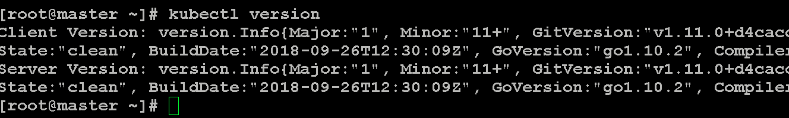

查看 Kubernetes 集群：

##### 图 6\. 查看 Kubernetes 集群的节点

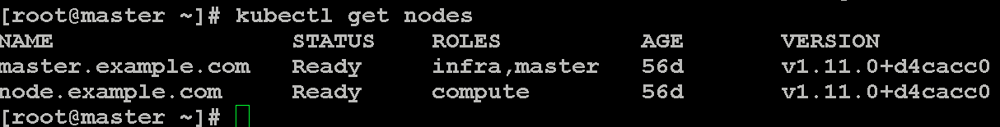

查看部署好的 Istio。

Istio 以一个项目的形式部署到 Kubernetes 集群中。我们可以看到，部署好的 pods 中，除了有 istio-citadel、istio-egressgateway、istio-ingressgateway、istio-pilot 等 Istio 本身的功能组件，还集成了微服务相关的监控工具，如：grafana、jaeger-agent、kiali、prometheus。正是这些功能丰富且强大的监控工具，帮助 Istio 实现了微服务的可视化管理。

##### 图 7\. 查看 Kubernetes 中的 Istio

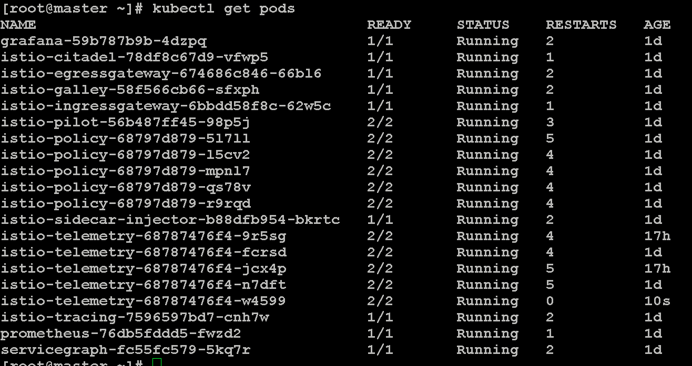

查看 istio 版本：1.0.4。

##### 图 8\. 查看 Istio 版本

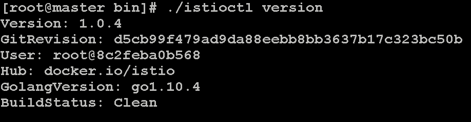

接下来，我们将会对 Isito 集成的工具进行介绍。本文最后的实验展现环节，我们将会使用这些工具进行微服务的监控和管理。

### Istio 的工具集：Grafana

Grafana 是一个非常著名的开源项目。它是一个 Web 应用，可以提供丰富的监控仪表盘。它的后端支持 graphite、 InfluxDB 或 opentsdb。

通过浏览器访问 Istio 中部署好的 Grafana。

登录 Grafana 后，首页面如下：

##### 图 9\. Grafana 首页面

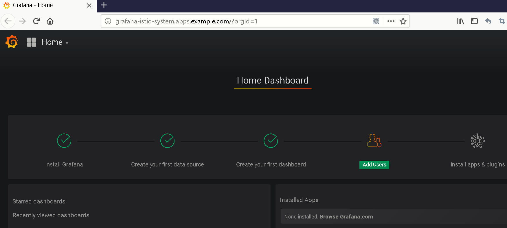

查看已有的 Dashboard：

##### 图 10\. Grafana 上的 Istio Dashboard

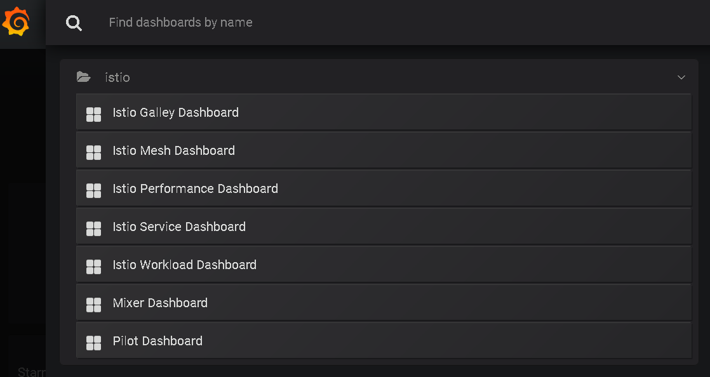

我们查看 Pilot Dashboard，可以看到丰富的资源统计。

##### 图 11\. Grafana 上的 Istio Dashboard 查看

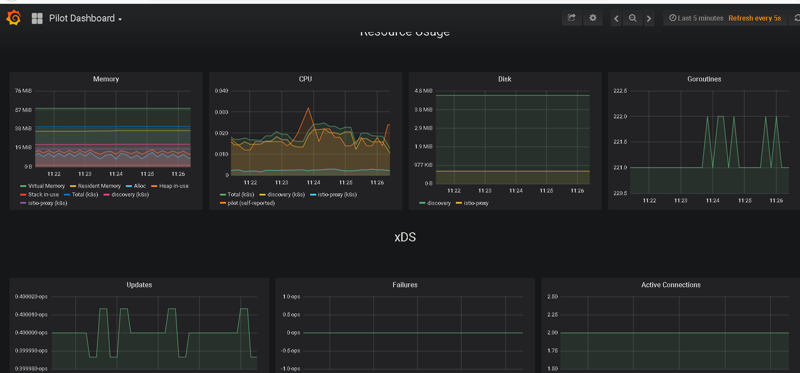

### Istio 的工具集：prometheus

prometheus 是一个开源监控系统。它具有维度数据模型；具备灵活的查询语言、高效的时间序列数据库，并提供灵活的警报方法。

在 Istio 中，prometheus 收到的数据，会被汇总到 Grafana 进行统一展现。

访问 Istio 中部署好的 prometheus：

##### 图 12\. Prometheus 的 UI

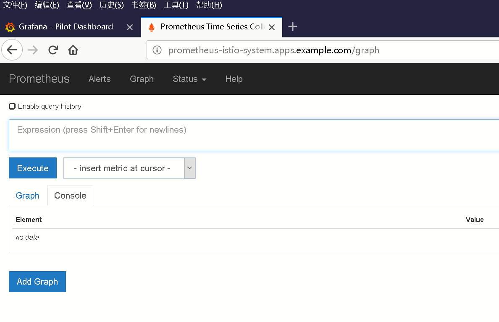

我们可以看到有多达上百个监测点：

##### 图 13\. Prometheus 的监测点

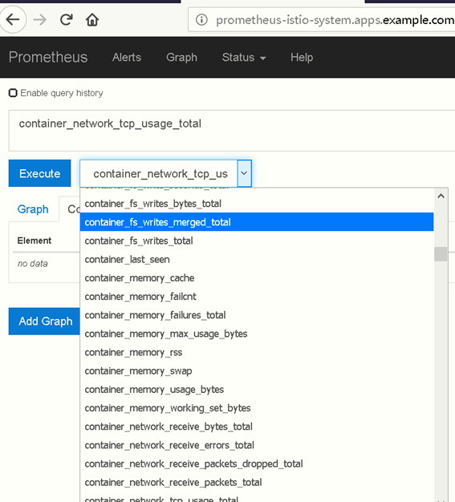

例如我们选择 Container\_memory\_cache，点击 Execute。

##### 图 14\. 执行监测点

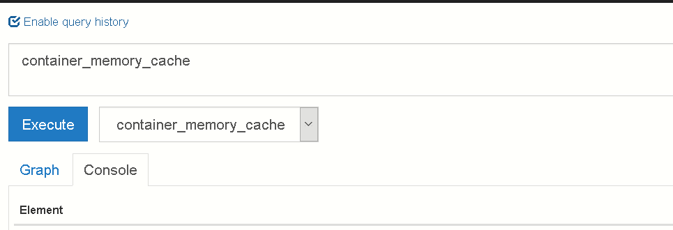

然后可以生成图形化界面展示，并且我们也可以调整时间间隔（图中是 60 分钟）。

##### 图 15\. 监控图

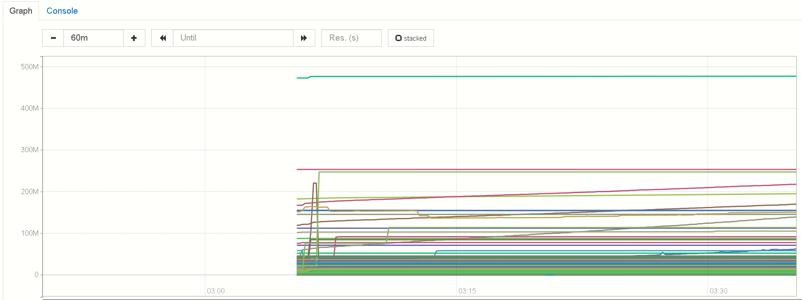

### Istio 的工具集：Kiali

Kiali 作为一个开源项目，可以为 Istio 提供可视化服务网格拓扑、断路器或请求率等功能。此外 Kiali 还包括 Jaeger Tracing，可以提供开箱即用的分布式跟踪功能。

我们看一下 Istio 中部署的 Kiali：

##### 图 16\. Kiali 的 UI 首页

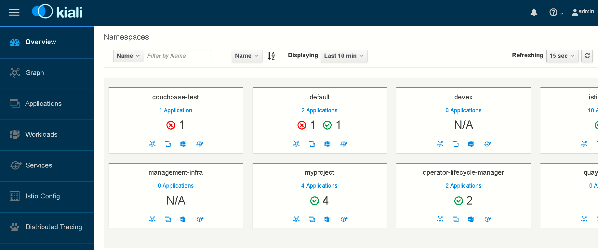

它可以查看在 Istio 上部署的微服务的拓扑结构：

##### 图 17\. Kiali 查看微服务的拓扑

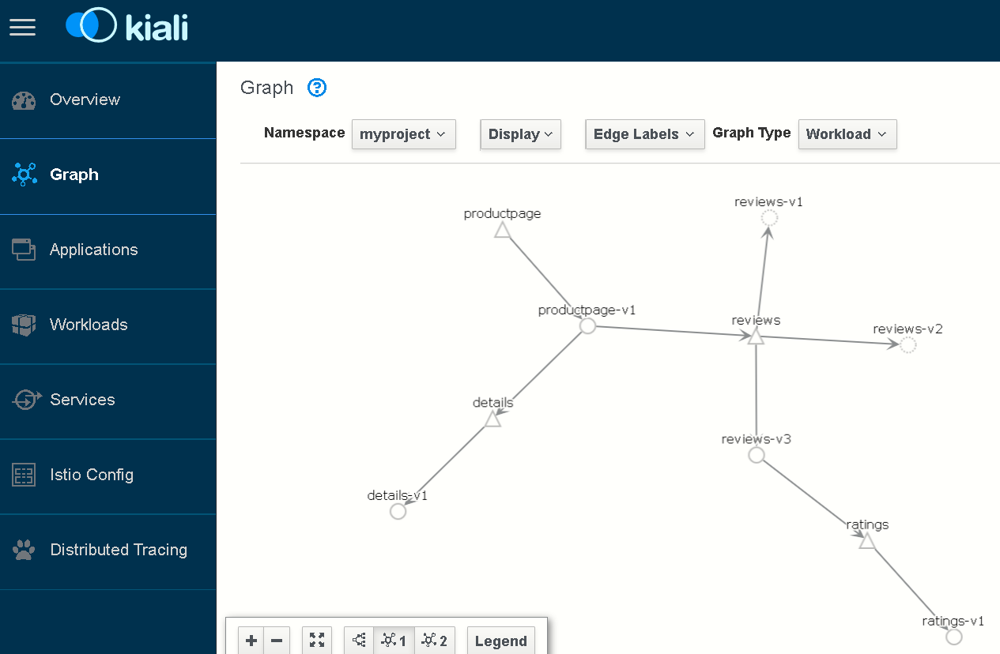

### Istio 的工具集：Jaeger

Jaeger 是一个开源项目，用于微服务的分布式跟踪。它实现的功能有：

- 分布式事务监控
- 服务调用问题根因分析
- 服务依赖性分析
- 性能/延迟优化

Jaeger 工具已经集成到 Istio 中，部署以后可以通过浏览器访问。

下图是 Jeager 追踪 productpage 这个服务在过去三个小时的所有调用：

##### 图 18\. Jaeger 查看 API 调用

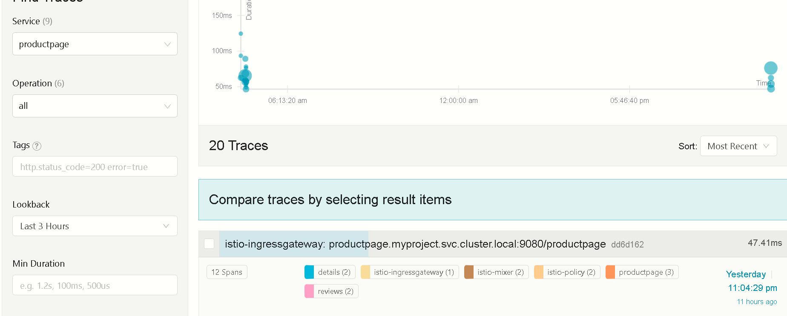

我们可以展开看详细的调用层级：

##### 图 19\. Jaeger 查看 API 详细调用

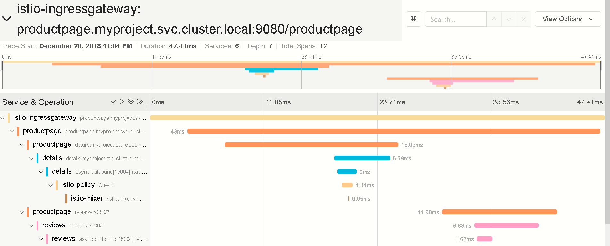

## Istio 管理微服务的实验展现

在本小节中，我们将在 Istio 上部署一个名为 bookinfo 的微服务应用。为了方便读者理解，我们先分析这个应用的源代码。然后展示 Istio 如何管理这套微服务。

### bookinfo 微服务源码分析

bookinfo 应用程序显示的有关书籍的信息，类似于在线书店的单个商品。应用页面上显示的是书籍的描述、书籍详细信息（ISBN，页数等）以及书评。

bookinfo 应用一共包含四个微服务：Productpage、Details、Reviews、Ratings。

- Productpage 使用 Python 开发，负责展示书籍的名称和书籍的简介。
- Details 使用 Ruby 开发，负责展示书籍的详细信息。
- Reviews 使用 Java 开发，负责显示书评。
- Ratings 使用 Node.js 开发,负责显示书籍的评星。

其拓扑关系见下图。

##### 图 20\. bookinfo 应用拓扑架构

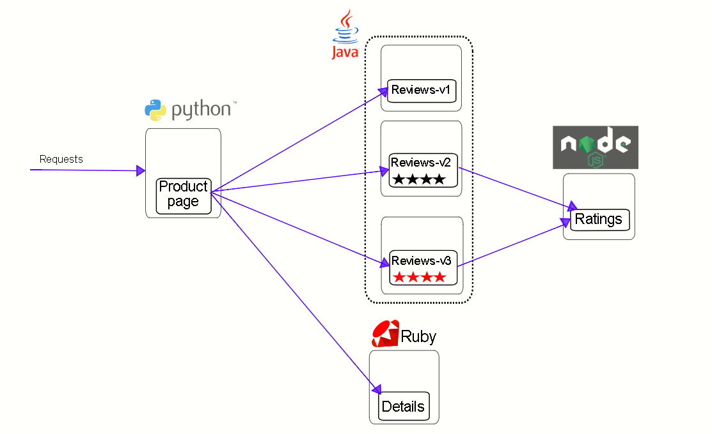

我们看一下 bookinfo 微服务部署完毕的展示效果：

##### 图 21\. bookinfo 应用页面展示效果

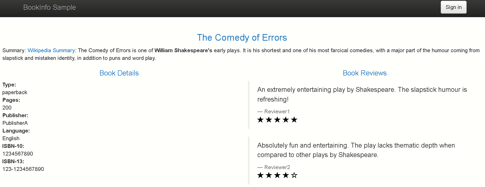

Productpage 微服务包含两部分内容：

- 书籍的名称：”The Comedy of Errors”，翻译成中文是《错误的喜剧》。
- 书籍的简介：Summary。翻译成中文是：《错误的喜剧》是威廉·莎士比亚早期剧作之一。这是他最短的、也是他最喜欢的喜剧之一，除了双关语和文字游戏之外，幽默的主要部分来自于打闹和错误的身份。

Details 微服务包含的内容是书籍的详细信息，内容如下。

##### 清单 5\. Details 微服务显示内容

```
Type:
paperback
Pages:
200
Publisher:
PublisherA
Language:
English
ISBN-10:
1234567890
ISBN-13:
123-1234567890

```

Show moreShow more icon

Reviews 微服务包含的信息是书评内容：

##### 清单 6\. 书评内容

```
An extremely entertaining play by Shakespeare. The slapstick humour is refreshing!
Absolutely fun and entertaining. The play lacks thematic depth when compared to other plays by Shakespeare.

```

Show moreShow more icon

Ratings 微服务包含的内容将展示为评星部分（下图黑框中的部分）。

##### 图 22\. 评星图


接下来，我们访问 Github 上查看 bookinfo 源码，通过源码分析，理解业务的实现逻辑。

首先查看 [productpage](https://github.com/istio/istio/tree/master/samples/bookinfo/src/productpage) 的源码（部分内容）：

##### 清单 7\. productpage 源码

```
def getProducts():
        return [
            {
                'id': 0,
                'title': 'The Comedy of Errors',
                'descriptionHtml': 'Wikipedia Summary: The Comedy of Errors is one of < b>William Shakespeare\'s< /b> early plays. It is his shortest and one of his most farcical comedies, with a major part of the humour coming from slapstick and mistaken identity, in addition to puns and word play.'
            }

```

Show moreShow more icon

我们可以很明显看出，以上代码就是 bookinfo 页面显示的书籍的名称和简介。

查看 [productpage](https://github.com/istio/istio/tree/master/samples/bookinfo/src/productpage) 的另外一部分源码。

##### 清单 8\. productpage 源码

```
details = {
"name" : "http://details{0}:9080".format(servicesDomain),
"endpoint" : "details",
"children" : []
}

ratings = {
"name" : "http://ratings{0}:9080".format(servicesDomain),
"endpoint" : "ratings",
"children" : []
}

reviews = {
"name" : "http://reviews{0}:9080".format(servicesDomain),
"endpoint" : "reviews",
"children" : [ratings]
}

productpage = {
"name" : "http://details{0}:9080".format(servicesDomain),
"endpoint" : "details",
"children" : [details, reviews]
}

service_dict = {
"productpage" : productpage,
"details" : details,
"reviews" : reviews,
}

```

Show moreShow more icon

上面代码定义了四个微服务的 name、endpoint、children。endpoint 代表这个微服务后端的 Kubernetes 集群中 service 名称、children 代表本微服务调用的 Kubernetes 集群中的微服务 service 名称。

以 productpage 举例，它的 endpoint 是 details、children 是 details 和 reviews。所以，被发送到 productpage 请求，将会调用 details、reviews 这两个服务。

接下来，查看 reviews 微服务的源码，代码使用 Java 编写的。

##### 清单 9\. reviews 服务源码

```
    private String getJsonResponse (String productId, int starsReviewer1, int starsReviewer2) {
        String result = "{";
        result += "\"id\": \"" + productId + "\",";
        result += "\"reviews\": [";

        // reviewer 1:
        result += "{";
        result += "  \"reviewer\": \"Reviewer1\",";
        result += "  \"text\": \"An extremely entertaining play by Shakespeare. The slapstick humour is refreshing!\"";
      if (ratings_enabled) {
        if (starsReviewer1 != -1) {
          result += ", \"rating\": {\"stars\": " + starsReviewer1 + ", \"color\": \"" + star_color + "\"}";
        }
        else {
          result += ", \"rating\": {\"error\": \"Ratings service is currently unavailable\"}";
        }
      }
        result += "},";

        // reviewer 2:
        result += "{";
        result += "  \"reviewer\": \"Reviewer2\",";
        result += "  \"text\": \"Absolutely fun and entertaining. The play lacks thematic depth when compared to other plays by Shakespeare.\"";
      if (ratings_enabled) {
        if (starsReviewer2 != -1) {
          result += ", \"rating\": {\"stars\": " + starsReviewer2 + ", \"color\": \"" + star_color + "\"}";
        }
        else {
          result += ", \"rating\": {\"error\": \"Ratings service is currently unavailable\"}";
        }
      }
        result += "}";

        result += "]";
        result += "}";

        return result;
    }

```

Show moreShow more icon

上面的这段代码，定义的是两个 Reviewer，以及书评的内容。书评的内容正是 bookinfo 页面展示的内容。

在上面的代码中，我们注意到有两个重要的变量 star\_color 和 ratings\_enabled。

- star\_color 表示评星的颜色（黑色和红色）。
- ratings\_enabled 表示是否启用评星。

查看 reviews 微服务的源码的另外一部分内容：

##### 清单 10\. reviews 服务源码

```
private final static String star_color = System.getenv("STAR_COLOR") == null ? "black" : System.getenv("STAR_COLOR");

```

Show moreShow more icon

上面代码显示：在应用构建时：

- 如果不指定 STAR\_COLOR 变量且 ratings\_enabled 为 true，那么评星默认为黑色。
- 如果指定 STAR\_COLOR 变量且 ratings\_enabled 为 true，那么评星颜色为传入的颜色。
- 如果不指定 ratings\_enabled 为 true，那么将不会显示评星。

那么，STAR\_COLOR 这个变量，在应用构建时，有没有传入呢？我们查看：build-services.sh

##### 清单 11\. build-services.sh 内容

```
#java build the app.
docker run --rm -v "$(pwd)":/home/gradle/project -w /home/gradle/project gradle:4.8.1 gradle clean build
pushd reviews-wlpcfg
    #plain build -- no ratings
    docker build -t "istio/examples-bookinfo-reviews-v1:${VERSION}" -t istio/examples-bookinfo-reviews-v1:latest --build-arg service_version=v1 .
    #with ratings black stars
    docker build -t "istio/examples-bookinfo-reviews-v2:${VERSION}" -t istio/examples-bookinfo-reviews-v2:latest --build-arg service_version=v2 \
       --build-arg enable_ratings=true .
    #with ratings red stars
    docker build -t "istio/examples-bookinfo-reviews-v3:${VERSION}" -t istio/examples-bookinfo-reviews-v3:latest --build-arg service_version=v3 \
       --build-arg enable_ratings=true --build-arg star_color=red .

```

Show moreShow more icon

上面代码显示，运行该脚本是，将会构建三个版本 Reviews 的 docker image：

- V1：没有评星（未指定 enable\_ratings=true）。
- V2：评星为黑色（指定 enable\_ratings=true；未指定 star\_color 的变量，代码中默认的颜色为黑色）。
- V3：评星为红色（指定 enable\_ratings=true；指定 star\_color 的变量为 red）。

在 bookinfo 的源代码中，还有两个数据库的定义 Mongodb 和 Mysql。

接下来，我们看这个应用中两个数据库的内容。

先看 Mongodb 的 script.sh，内容如下：

##### 清单 12\. Mongodb 的 script.sh

```
#!/bin/sh
    set -e
    mongoimport --host localhost --db test --collection ratings --drop --file /app/data/ratings_data.json

```

Show moreShow more icon

也就是说，Mongodb 数据库在初始化时，会将 [ratings\_data.json](https://github.com/istio/istio/blob/master/samples/bookinfo/src/mongodb/ratings_data.json) 文件中的信息导入到数据库中。

再看 [ratings\_data.json](https://github.com/istio/istio/blob/master/samples/bookinfo/src/mongodb/ratings_data.json) ：

##### 清单 13.ratings\_data.json 文件

```
{rating: 5}
{rating: 4}

```

Show moreShow more icon

也就是说，当应用部署完毕后，Mongodb 将包含五星和四星。

查看 Mysql 的初始化文件：mysqldb-init.sql

##### 清单 14\. mysqldb-init.sql 内容

```
# Initialize a mysql db with a 'test' db and be able test productpage with it.
# mysql -h 127.0.0.1 -ppassword < mysqldb-init.sql

CREATE DATABASE test;
USE test;

CREATE TABLE `ratings` (
`ReviewID` INT NOT NULL,
`Rating` INT,
PRIMARY KEY (`ReviewID`)
);
INSERT INTO ratings (ReviewID, Rating) VALUES (1, 5);
INSERT INTO ratings (ReviewID, Rating) VALUES (2, 4);

```

Show moreShow more icon

我们可以看出，上面的初始化脚本是创建一个名为 ratings 的数据库表，插入的数据效果如下：

##### 表 1\. 数据库表示意

**ReviewID****Rating****1****5****2****4**

查看 Ratings 的源代码，该代码使用 Node.JS 书写。

##### 清单 15\. Ratings 的源代码

```
* We default to using mongodb, if DB_TYPE is not set to mysql.
*/
if (process.env.SERVICE_VERSION === 'v2') {
if (process.env.DB_TYPE === 'mysql') {
    var mysql = require('mysql')
    var hostName = process.env.MYSQL_DB_HOST
    var portNumber = process.env.MYSQL_DB_PORT
    var username = process.env.MYSQL_DB_USER
    var password = process.env.MYSQL_DB_PASSWORD
} else {
    var MongoClient = require('mongodb').MongoClient
    var url = process.env.MONGO_DB_URL
}
}

dispatcher.onGet(/^\/ratings\/[0-9]*/, function (req, res) {
var productIdStr = req.url.split('/').pop()
var productId = parseInt(productIdStr)

if (Number.isNaN(productId)) {
    res.writeHead(400, {'Content-type': 'application/json'})
    res.end(JSON.stringify({error: 'please provide numeric product ID'}))
} else if (process.env.SERVICE_VERSION === 'v2') {
    var firstRating = 0
    var secondRating = 0

    if (process.env.DB_TYPE === 'mysql') {
      var connection = mysql.createConnection({
        host: hostName,
        port: portNumber,
        user: username,
        password: password,
        database: 'test'
      })

      connection.connect()
      connection.query('SELECT Rating FROM ratings', function (err, results, fields) {
        if (err) {
          res.writeHead(500, {'Content-type': 'application/json'})
          res.end(JSON.stringify({error: 'could not connect to ratings database'}))
        } else {
          if (results[0]) {
            firstRating = results[0].Rating
          }
          if (results[1]) {
            secondRating = results[1].Rating
          }
          var result = {
            id: productId,
            ratings: {
              Reviewer1: firstRating,
              Reviewer2: secondRating
            }
          }
          res.writeHead(200, {'Content-type': 'application/json'})
          res.end(JSON.stringify(result))
        }
      })

```

Show moreShow more icon

以上代码主要实现：如果不指定 DB\_TYPE 的变量，将默认使用 mongodb 数据库。

当微服务 Reviews 的版本是 V2 时，将连接数据库 Mysq 或 MogoDB（根据环境变量传入的 DB\_TYPE）。当 Reviews 的版本是 V3 时，访问 mongodb 数据库。

但从上面的数据库分析我们可以知道，无论 Reviews 连接哪个数据库，得到的数据都是第一个评论者五星、第二个评论者四星。也就是说，只要是 Reviews 的 V2 和 V3 版本，访问数据库得到的评星结果是一样的；只不过 Reviews 为 V2 时评星为黑色、Reviews 为 V3 时评星为红色。

### 微服务的部署

我们在 Kubernetes 集群中部署 bookinfo 应用。

##### 图 23\. 在 Kubernetes 集群部署 bookinfo

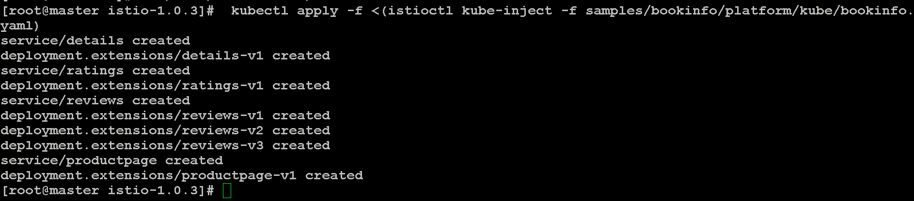

Pods 创建成功：

##### 图 24\. 查看 bookinfo 的 pod

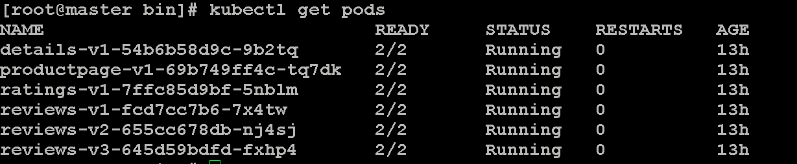

接下来，通过浏览器对 bookinfo 发起多次访问，页面呈现三种显示。

- 第一种：访问 bookinfo 时（Productpage 调用的 Review V1），页面没有评星；
- 第二种：访问 bookinfo 时（Productpage 调用的 Review V2），页面是黑色的评星；
- 第三种：访问 bookinfo 时（Productpage 调用的 Review V3），页面是红色的评星。

##### 图 25\. bookinfo 第一种展现

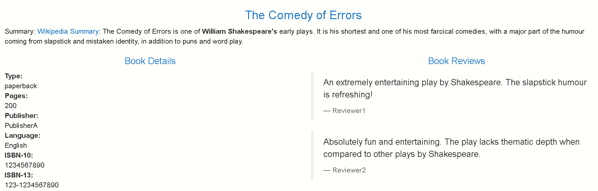

##### 图 26\. bookinfo 第二种展现

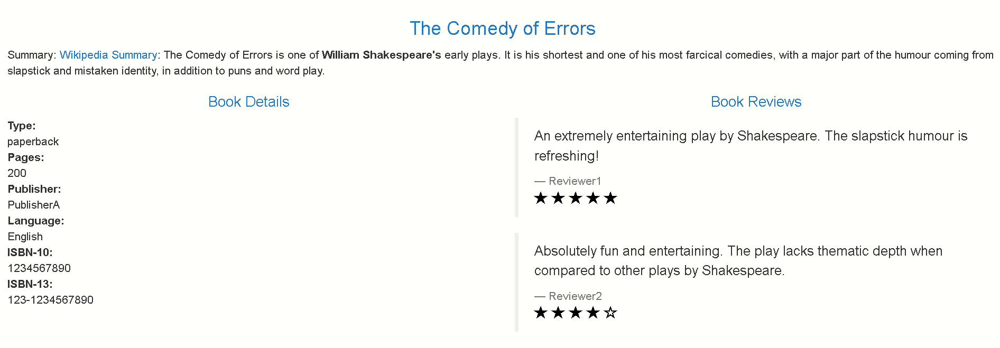

##### 图 27\. bookinfo 第三种展现

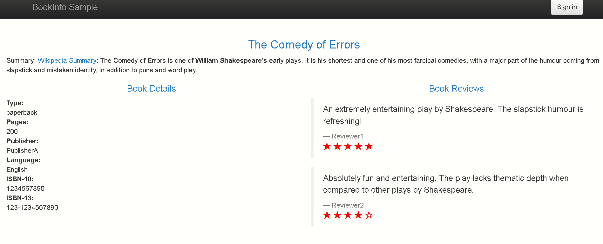

过了几秒后：Kiali 收集到之前几次对 bookinfo 的访问流量，并进行动态展示。我们可以看到，productpage 随机访问 Reviews V1、V2、V3

##### 图 28\. Kiali 展示微服务流量

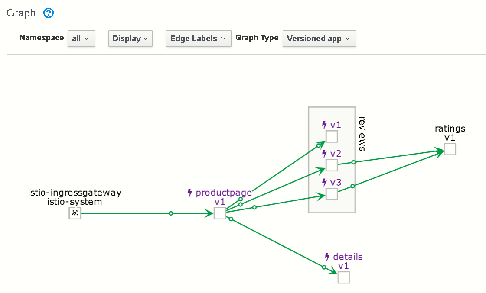

Productpage 轮询访问 Review V1 和 V2 的原因是：我们没有设置针对 Reviews 的特定策略，而 Productpage 的源码中，指定了 Product 服务调用 Reviews 服务的业务逻辑，但并未指定版本。因此，Product 服务会随机访问 Reviews 的三个版本。

##### 图 29\. 查看 virtualservice

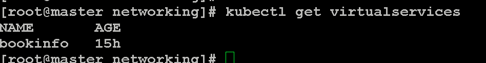

接下来，我们查看 virtualservice 的配置文件。

##### 图 30\. 查看 virtualservice 配置文件列表

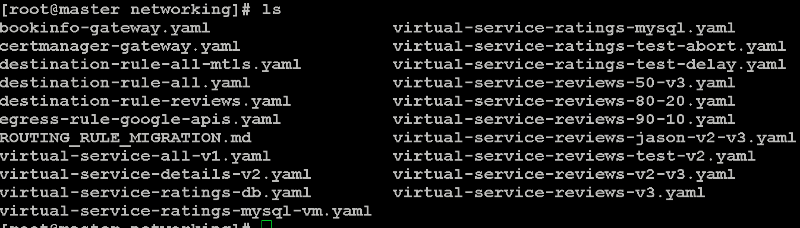

查看 virtual-service-reviews-v3.yaml 内容。该文件定义发向 Reviews 的请求，全部到 V3 版本。

##### 清单 16\. 查看 virtual-service-reviews-v3.yaml 内容

```
[root@master networking]# cat virtual-service-reviews-v3.yaml
apiVersion: networking.istio.io/v1alpha3
kind: VirtualService
metadata:
name: reviews
spec:
hosts:
    - reviews
http:
  - route:
    - destination:
        host: reviews
        subset: v3      version: v3

```

Show moreShow more icon

接下来，应用 Virtualservice 配置。

##### 图 31\. 应用配置

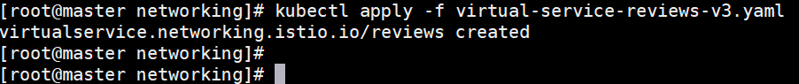

查看生效的 Virtualservice，reviews 的配置生效。

##### 图 32\. 查看生效的 virtualservice

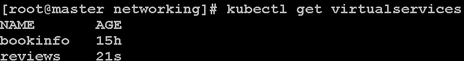

接下来，我们再次对 bookinfo 发起多次访问，可以看到，页面的评星均为红色。

##### 图 33\. 访问 bookinfo 应用

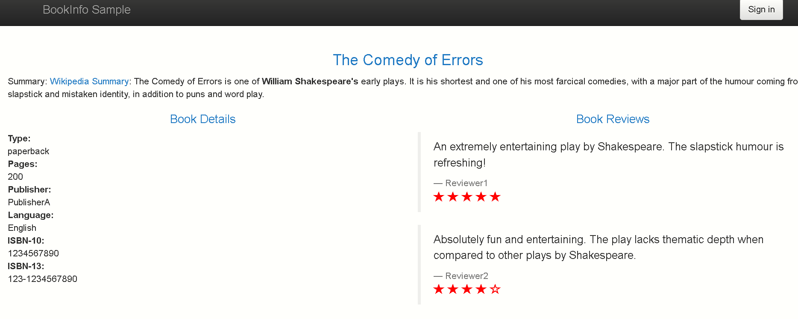

通过 Kiali 查看流量，可以看到，Productpage 的流量全部访问 Review V3。

##### 图 34\. Kiali 查看 bookinfo 应用访问流量

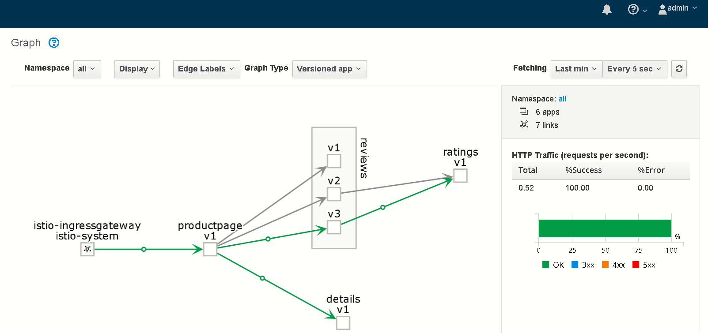

接下来，我们继续调整策略，让 Productpage 对 Reviews 的访问，以 V1 和 V2 按照 8:2 比率进行：

##### 清单 17\. 查看 virtual-service-reviews-80-20.yaml 内容

```
[root@master networking]# cat virtual-service-reviews-80-20.yaml
apiVersion: networking.istio.io/v1alpha3
kind: VirtualService
metadata:
name: reviews
spec:
hosts:
    - reviews
http:
  - route:
    - destination:
        host: reviews
        subset: v1
      weight: 80
    - destination:
        host: reviews
        subset: v2
      weight: 20

```

Show moreShow more icon

##### 图 35\. 替换之前的 Virtual Services 策略

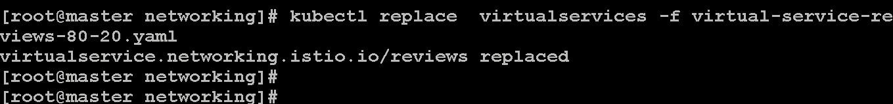

##### 图 36\. Kiali 查看 bookinfo 应用访问流量


### Istio 的限速

在了解了 Istio 微服务的路由策略后，接下来我们对微服务组件进行限速的设置。

在默认情况下，productpage 随机访问 reviews 三个版本，没有流量限制。我们编写两个配置文件，限制 productpage 到 reviews v3 的访问速度。

speedrule.yaml 限制了从 productpage 到 reviews v3 的访问速度，最多每秒一个请求。

##### 清单 18\. 查看 speedrule.yaml

```
[root@master ~]# cat speedrule.yaml
apiVersion: "config.istio.io/v1alpha2"
kind: memquota
metadata:
name: handler
namespace: myproject
spec:
quotas:
  - name: requestcount.quota.myproject
    # default rate limit is 5000qps
    maxAmount: 5000
    validDuration: 1s
    # The first matching override is applied.
    # A requestcount instance is checked against override dimensions.
    overrides:
    - dimensions:
        destination: reviews
        source: productpage
        destinationVersion: v3
      maxAmount: 1
      validDuration: 1s

recommendation_rate_limit_handler.yml 文件声明了 requestcount quota。

```

Show moreShow more icon

##### 清单 19\. 查看 recommendation\_rate\_limit\_handler.yml

```
[root@master ~]# cat recommendation_rate_limit_handler.yml
apiVersion: "config.istio.io/v1alpha2"
kind: quota
metadata:
name: requestcount
namespace: myproject
spec:
dimensions:
    source: source.labels["app"] | source.service | "unknown"
    sourceVersion: source.labels["version"] | "unknown"
    destination: destination.labels["app"] | destination.service | "unknown"
    destinationVersion: destination.labels["version"] | "unknown"
---
apiVersion: "config.istio.io/v1alpha2"
kind: rule
metadata:
name: quota
namespace: myproject
spec:
actions:
  - handler: handler.memquota
    instances:
    - requestcount.quota
---
apiVersion: config.istio.io/v1alpha2
kind: QuotaSpec
metadata:
creationTimestamp: null
name: request-count
namespace: myproject
spec:
rules:
  - quotas:
    - charge: 1
      quota: RequestCount
---
apiVersion: config.istio.io/v1alpha2
kind: QuotaSpecBinding
metadata:
creationTimestamp: null
name: request-count
namespace: myproject
spec:
quotaSpecs:
  - name: request-count
    namespace: myproject
services:
  - name: productpage
    namespace: myproject
  - name: details
    namespace: myproject
  - name: reviews
    namespace: myproject

```

Show moreShow more icon

应用两个配置：

##### 图 37\. 应用配置

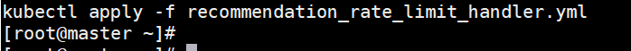

##### 图 38\. 应用配置

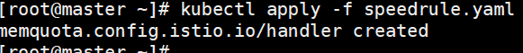

然后，对 bookinfo 发起高频度请求，访问请求频率为 10 次/秒。

##### 清单 20\. 发起高频度访问请求

```
while true; do curl http://istio-ingressgateway-istio-system.apps.example.com/productpage; sleep .1; done

```

Show moreShow more icon

通过 Kiali，可以看到：

##### 图 39\. Kiali 显示微服务流量

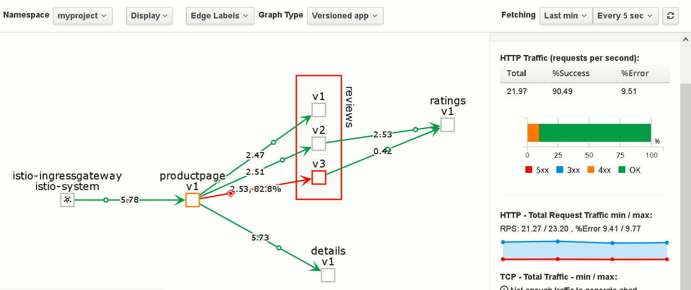

我们查看 grafana，可以看到这段时间内，reviews v3 的流量，远低于同期 reviews v1 和 v2 的流量。

##### 图 40\. Grafana 显示微服务流量统计

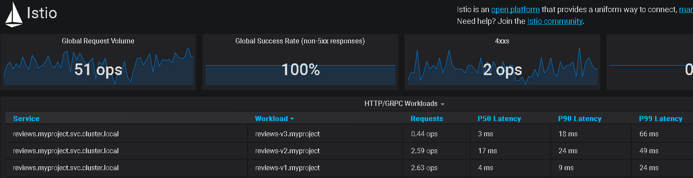

### Istio 的熔断

熔断技术，是为了避免”雪崩效应”的产生而出现的。我们都知道”雪球越滚越大”的现象。应用中的雪崩指的由于应用第一个组件的出现问题，造成调用这个组件的第二个组件有无无法调用第一个组件，无法实现业务逻辑，也出现问题；而调用第二个组件第三个组件因此也出现问题，问题迅速传播，从而造成整个应用的瘫痪，我们称之为应用的雪崩效应。

在单体应用中，多个业务的功能模块放在一个应用中，且由于各个功能模块之前是紧耦合，因此不容易出现雪崩情况。但由于微服务松耦合、各个组件调用关系复杂的特点，雪崩现象就较为容器出现。为了避免雪崩情况的发证，就需要有熔断机制，采用断路模式。熔断机制相当于为每个微服务前面加一个”保险丝”。当电流负载过大的时候（如服务访出现故障问超时，并且超过设定的重试次数），保险丝烧断，中断客户端对该应用的访问，而不影响客户客户端访问其他正常运行的组件。

Spring Cloud 中熔断的实现，需要调用 Hystrix。而 Istio 本身自带熔断的功能。下面，我们进行实现展现。

在初始情况下，未配置熔断。

##### 图 41\. 配置熔断之前正常访问应用流量

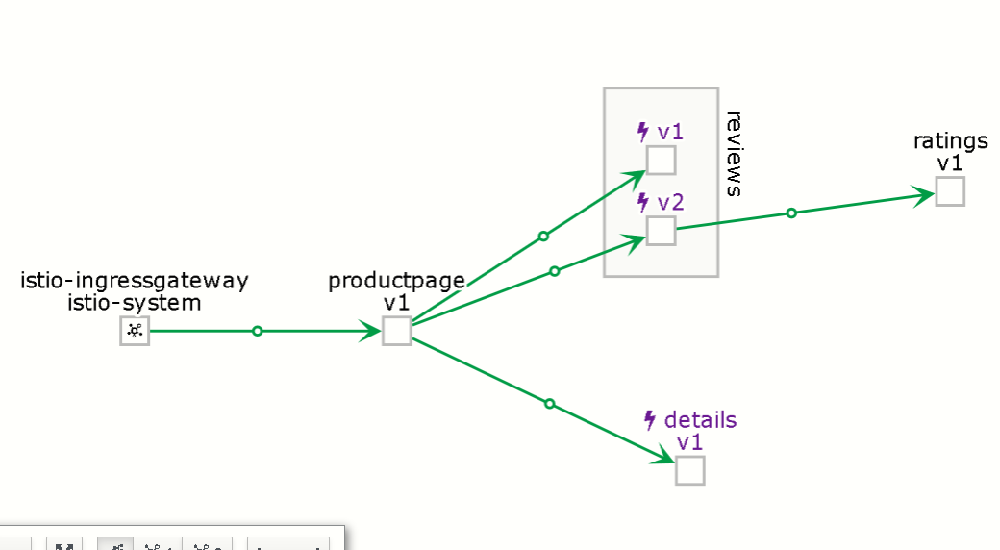

接下来，我们在 productpage 的 destination rule 中配置熔断策略（trafficPolicy）：每个链接最多的请求数量是一个；最多 pending 的 request 是一个、最多的连接数是一个。

##### 清单 21\. 在 destination rule 中配置熔断（open.yaml 配置文件部分内容）

```
spec:
host: productpage
subsets:
  - labels:
      version: v1
    name: v1
trafficPolicy:
    connectionPool:
      http:
        http1MaxPendingRequests: 1
        maxRequestsPerConnection: 1
      tcp:
        maxConnections: 1
    tls:
      mode: ISTIO_MUTUAL

```

Show moreShow more icon

接下来，我们先删除旧的配置，应用熔断的配置。

##### 图 42\. 应用新配置

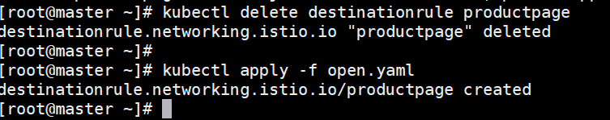

##### 图 43\. 发起大并发流量后的熔断

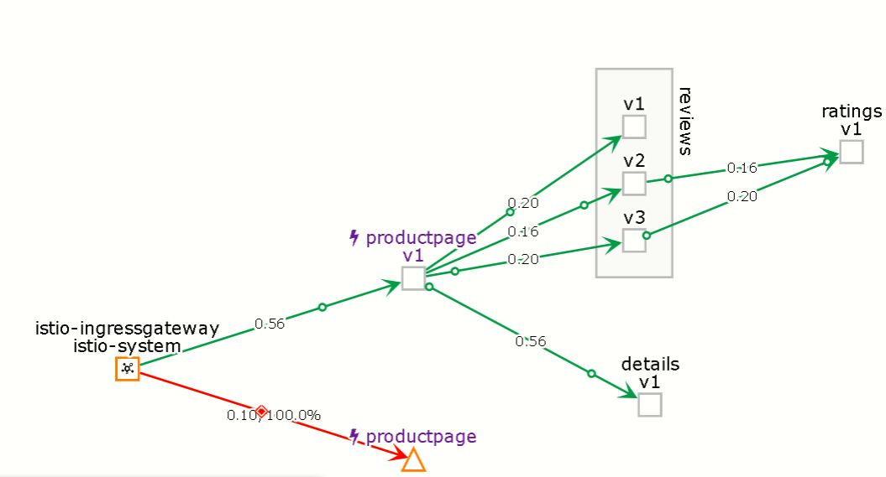

过一会，当问题熔断器打开后，业务恢复正常：

##### 图 44\. 熔断后的应用访问页面

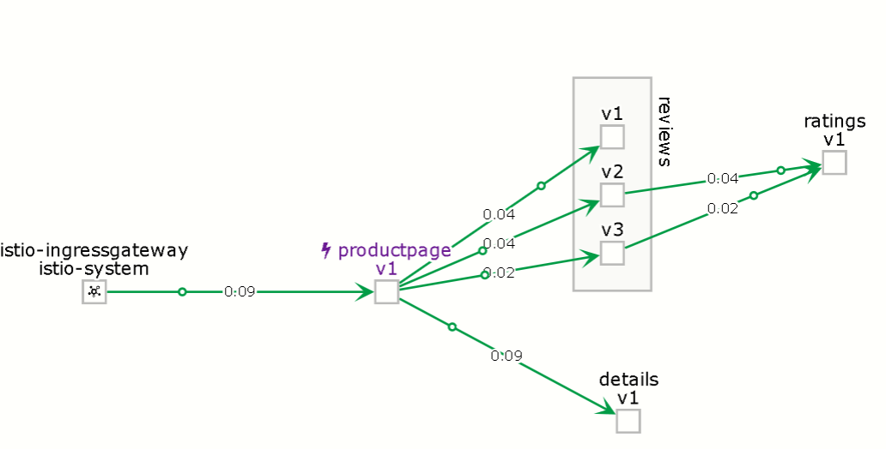

### Istio 的访问控制

Istio 中的访问控制有白名单和黑名单。白名单是允许从哪个服务到哪个服务的访问；黑名单是不允许从哪个服务到哪个服务之间的访问。两种实现的效果展现是一样的，由于篇幅游侠，本小节展示黑名单。

我们将在 details 服务上创建一个黑名单，从 productpage 发往 details 请求将会返回 403 错误码。

##### 清单 22\. 黑名单配置文件

```
[root@master ~]# cat acl-blacklist.yml
apiVersion: "config.istio.io/v1alpha2"
kind: denier
metadata:
name: denycustomerhandler
spec:
status:
    code: 7
    message: Not allowed
---
apiVersion: "config.istio.io/v1alpha2"
kind: checknothing
metadata:
name: denycustomerrequests
spec:
---
apiVersion: "config.istio.io/v1alpha2"
kind: rule
metadata:
name: denycustomer
spec:
match: destination.labels["app"] == "details" && source.labels["app"]=="productpage"
actions:
  - handler: denycustomerhandler.denier
instances: [ denycustomerrequests.checknothing ]

```

Show moreShow more icon

##### 图 45\. 应用黑名单

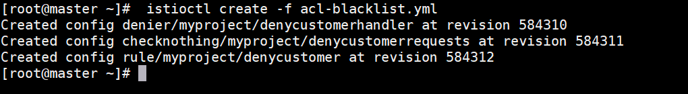

接下来，对 producepage 发起流量访问。从下图可以看到，从 productpage 到 details 之间的访问是被拒绝的。

##### 图 46\. Kali 显示应用流量访问

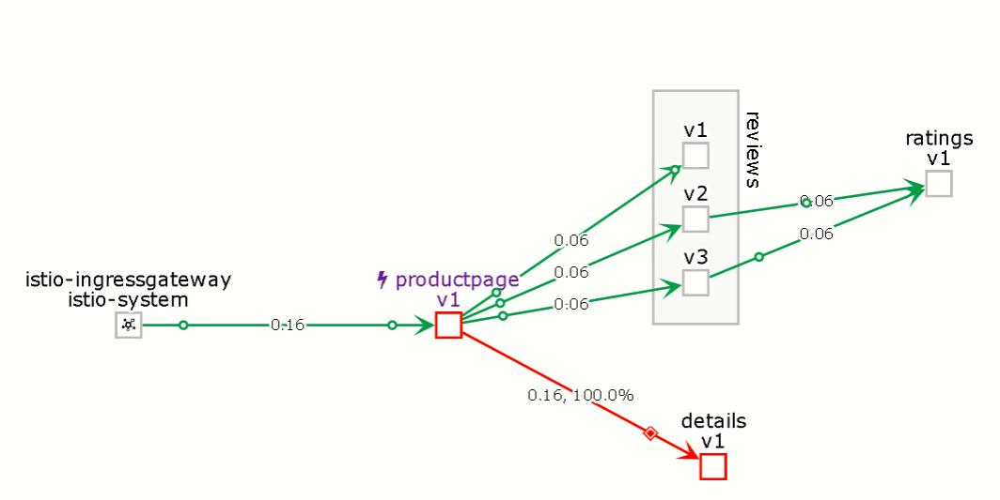

此时，通过浏览器访问 bookinfo，界面无法显示产品的详细信息，但其他微服务显示正常。

##### 图 47\. 访问 bookinfo 应用

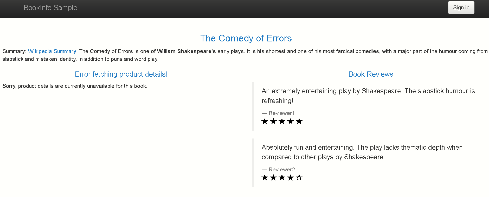

我们删除黑名单，再访问 bookinfo，对 details 微服务的访问马上正常。

##### 图 48\. 删除黑名单策略

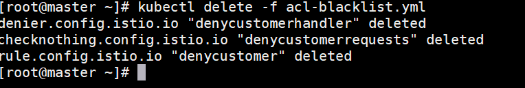

##### 图 49\. Kali 显示应用流量访问

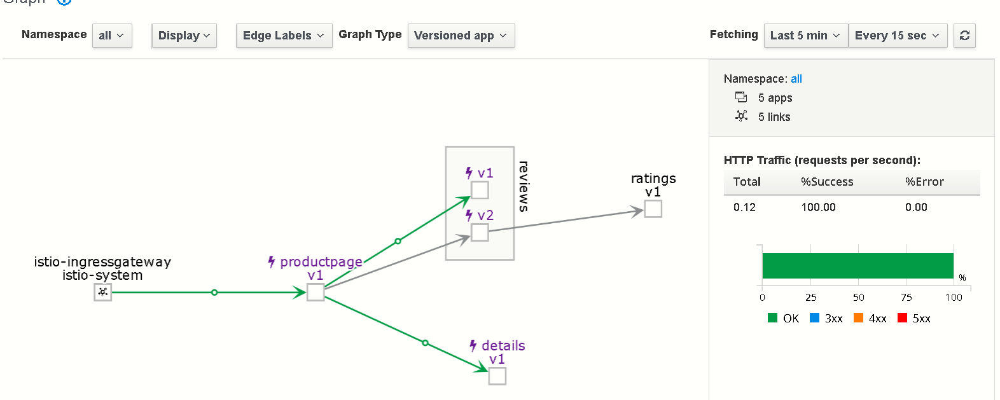

##### 图 50\. 访问 bookinfo 应用


## 结束语

通过本文，相信读者对微服务的概念和 Istio 的架构有了一定程度的理解。在微服务领域，正是由于 Istio 强大的功能、丰富的界面、可视化的监控，Istio 的使用将会越来越广泛。

## 参考资源

- [Istio 系列](https://developer.ibm.com/cn/os-academy-istio/)
- [bookinfo 应用源代码](https://github.com/istio/istio/tree/master/samples/bookinfo)