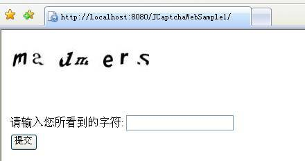
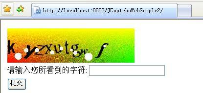
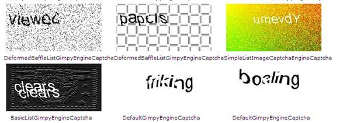
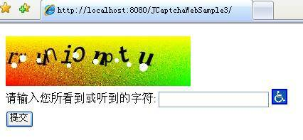

# 使用 JCaptcha 开发图形和声音验证码
学习使用 JCaptcha

**标签:** Java

[原文链接](https://developer.ibm.com/zh/articles/os-cn-jcaptcha/)

仲光庆, 程炜

发布: 2012-02-27

* * *

## JCaptcha 简介

CAPTCHA 全称 Completely Automated Public Turing Test to Tell Computers and Humans Apart，最早作为卡内基梅隆大学的一个科研项目，用于生成一个人类容易通过而计算机难以通过的测试，目前广泛应用于网络应用，用于阻止机器人发布垃圾信息。JCaptcha 即为 Java 版本的 CAPTCHA 项目，其是一个开源项目，支持生成图形和声音版的验证码，在生成声音版的验证码时，需要使用到 FreeTTS。目前，JCaptcha 官方网站显示有 2.0 版本，但二进制版只有 1.0 版可供下载，本文亦是基于 1.0 版本展开。

## 一个简单的图形验证码

JCaptcha 提供了一定的可扩展能力，用于开发人员创建出复杂的图形验证码。下面，首先利用 JCaptcha 提供的 API 来快速开发一个简单示例。本文的示例为 Web 应用，可以运行在 Tomcat 和 WebSphere 上，除了准备 Web 服务器外，我们还需要准备好 JCaptcha 运行时所必须的 Jar 包。

### 准备所需的 Jar 包

JCaptcha 项目在实现中，还引用了 commons-collections 和 commons-logging 两个开源项目，再加上 JCaptcha 本身的实现，我们共需要三个包，具体信息如下：

- jcaptcha-1.0-all.jar
- commons-logging-1.1.1.jar
- commons-collections-3.2.jar

### 创建生成图形验证码的 Servlet

在示例 1 中，我们采用 Servlet 生成验证码图片，并将这个图片写到 ServletOutputStream 中，同时将 Servlet 的 response 的类型设置为 image/jpeg。在前台页面中，我们使用 img 标签，并将 src 指向这个 Servlet，这样我们就可以在页面中显示这个生成的验证码图片。清单 1 是 Servlet 代码片段。

##### 清单 1\. 生成图形验证码代码片段

```
// set content type as jpeg
httpServletResponse.setHeader("Cache-Control", "no-store");
httpServletResponse.setHeader("Pragma", "no-cache");
httpServletResponse.setDateHeader("Expires", 0);
httpServletResponse.setContentType("image/jpeg");

// create the image using session ID
logger.fine("tring to get image captcha service");
BufferedImage bufferedImage = service
        .getImageChallengeForID(httpServletRequest.getSession(true)
            .getId());

ServletOutputStream servletOutputStream = httpServletResponse
        .getOutputStream();

// write the image to the servlet output stream
logger.fine("tring to output buffered image to servlet output stream");
ImageIO.write(bufferedImage, "jpg", servletOutputStream);

try {
servletOutputStream.flush();
} finally {
servletOutputStream.close();
}

```

Show moreShow more icon

清单 1 中的 service 对象，我们采用了一个 JCaptcha 的默认实现类 DefaultManageableImageCaptchaService，在代码中，我们需要通过获取 service 对象，根据 Session ID 来生成验证码图片。除了使用该默认实现类外，我们也可以通过实现 ImageCaptchaService 接口来生成更为复杂的验证码图片（参见示例 2）。清单 2 为获取 service 对象的示例代码，JCaptcha 建议使用单例来生成 service 对象。

##### 清单 2\. 生成 ImageCaptchaService 对象

```
public class SampleImageCaptchaService  {

private static ImageCaptchaService instance;

/**
* Get default manageable image captcha service
* @return ImageCaptchaService
*/
public static ImageCaptchaService getInstance() {
if (instance == null) {
    instance = new DefaultManageableImageCaptchaService();
}
    return instance;
}
}

```

Show moreShow more icon

示例 1 提供了 2 个简单的页面，一个用于显示图形验证码，另一个则在验证成功后显示成功信息。清单 3 为用于显示图形验证码的页面代码片段。

##### 清单 3\. 显示图形验证码页面代码片段

```
<form action="CaptchaValidationServlet" method="post">
<table>
<tr>
    <td colspan="2"></td>
</tr>
<tr>
    <td> 请输入您所看到的字符 :</td>
    <td><input type="text" name="captcha_input" value="" />
                <%=request.getAttribute("ERROR") == null ? "" :
                request.getAttribute("ERROR")%></td>
</tr>
<tr>

    <td><input type="submit" value="提交" /></td>
</tr>
</table>
</form>

```

Show moreShow more icon

除了实现图形验证码的生成和展示，我们还需要一个 Servlet 来验证用户的输入。用户输入验证的代码的核心，是使用在生成图片时所使用的 service 对象，调用 JCaptcha 的输入验证方法（本示例为 validateResponseForID 方法），来判断用户输入是否正确，清单 4 为输入验证代码片段。

##### 清单 4\. 验证用户输入

```
validated = service.validateResponseForID(
    request.getSession(true).getId(), userCaptchaResponse).booleanValue();

```

Show moreShow more icon

完成上述代码工作后，我们还需要在 Web.xml 中设置好上面创建的两个 Servlet，然后再部署到 Web 服务器上，图 1 是部署成功后的示例 1 首页。

##### 图 1\. 示例 1 的首页



至此，我们完成了第一个示例，该示例采用了 JCaptcha 提供的默认实现，下面我们将通过扩展使用 JCaptcha，来生成一个更为复杂的图形验证码。

## 使用 JCaptcha 生成复杂图形验证码

在实际项目中，我们可能需要使用更为复杂的图形验证码，比如，加入带干扰的图形背景、更多的干扰点、自定义随机字库及图形字体等等，下面将基于示例 2 介绍如何使用 JCaptcha 生成更为复杂的图形验证码。

### 自定义 ImageCaptchaService 的实现

正如介绍示例 1 时所提到的，我们可以通过实现 ImageCaptchaService 接口来创建我们自己所需要的 service 对象，清单 5 为示例 2 对接口 ImageCaptchaService 的实现，我们可以在该实现中，使用自己开发的图形验证码生成引擎（SampleListImageCaptchaEngine）来生成更为复杂的图形验证码。

##### 清单 5\. 示例 2 中 ImageCaptchaService 的实现

```
public class SampleImageCaptchaService extends
    AbstractManageableImageCaptchaService implements ImageCaptchaService {

private static SampleImageCaptchaService instance;

public static SampleImageCaptchaService getInstance() {
    if (instance == null) {
      //use customized engine
      ListImageCaptchaEngine engine = new SampleListImageCaptchaEngine();
      instance = new SampleImageCaptchaService(
        new FastHashMapCaptchaStore(), engine, 180, 100000, 75000);
    }
    return instance;
}

public SampleImageCaptchaService(CaptchaStore captchaStore,
      CaptchaEngine captchaEngine, int minGuarantedStorageDelayInSeconds,
      int maxCaptchaStoreSize, int captchaStoreLoadBeforeGarbageCollection) {
    super(captchaStore, captchaEngine, minGuarantedStorageDelayInSeconds,
        maxCaptchaStoreSize, captchaStoreLoadBeforeGarbageCollection);
}
}

```

Show moreShow more icon

### 构建生成图形验证码的 ImageCaptchaEngine

清单 5 中的 FastHashMapCaptchaStore 用于存放生成的验证码字符，FastHashMapCaptchaStore 基本可以满足绝大多数项目需求，我们通常不需要创建自己的类来实现它的功能；SampleListImageCaptchaEngine 则是扩展的核心，该类是 ImageCaptchaEngine 的一个实现，在该类中，我们可以设置随机字库、生成的字体和大小、字符数、背景图片以及干扰点等等。清单 6 为 SampleListImageCaptchaEngine 代码片段。

##### 清单 6\. SampleListImageCaptchaEngine 代码片段

```
//create text parser
TextPaster randomPaster = new DecoratedRandomTextPaster(new Integer(8),
        new Integer(10), new SingleColorGenerator(Color.BLACK),
new TextDecorator[] { new BaffleTextDecorator(new Integer(1), Color.WHITE) });
//create image captcha factory
ImageCaptchaFactory factory = new GimpyFactory(
        new RandomWordGenerator("abcdefghijklmnopqrstuvwxyz"),

    new ComposedWordToImage(new TwistedRandomFontGenerator(new Integer(34),
            new Integer(40)), new FunkyBackgroundGenerator(new Integer(
            260), new Integer(70)), randomPaster));

ImageCaptchaFactory characterFactory[] = { factory};
this.addFactories(characterFactory);

```

Show moreShow more icon

在清单 6 中，DecoratedRandomTextPaster 的第一个参数用于设置验证码最少字符数，第二个参数为最多的字符数，第三个参数 SingleColorGenerator 为字体颜色，这里为黑色，TextDecorator 为干扰设置，这里是一个字符一个干扰点，并且干扰点为白色。

在 ImageCaptchaFactory 中，第一个参数设置了随机字库，这里为英文字母，在第二个参数中，TwistedRandomFontGenerator 设置了生成的字符字体，最小 34，最大为 40，FunkyBackgroundGenerator 则用于生成干扰背景，除了设置字体大小外，还需要设置生成的图片大小，示例 2 为 260\*70 像素。图 2 为示例 2 的首页截图。

##### 图 2\. 示例 2 的首页



可以说 ImageCaptchaEngine 的不同实现，决定了图形验证码的不同样式，JCaptcha 目前提供了多种 ImageCaptchaEngine 的实现，这些实现提供了多种不同的图形验证码样式，当然，我们也可以自己实现 TextPaster 及 TextDecorator 等，进而再继承实现 ImageCaptchaEngine，从而实现自己所期望的效果。图 3 为 JCaptcha 官方网站提供的部分 ImageCaptchaEngine 的实现截图，更多样式，请参见 [官方网站](http://jcaptcha.sourceforge.net/) 。

##### 图 3\. JCaptcha 官方图形验证码示例



## 开发声音验证码

由于某些项目需要支持盲人使用，而盲人无法看到图形验证码，这时，我们就需要同时提供声音版的验证码。JCaptcha 同时支持声音版验证码，但默认实现并不支持生成的声音和图形验证码中的字符一致，这里就需要通过一定的扩展定制，才能保证声音和图形验证码的内容一致，下面首先介绍如何生成声音验证码，然后介绍如何扩展定制，才能保证声音和图形验证码的内容的一致。

### FreeTTS

JCaptcha 使用了 FreeTTS 来开发声音验证码，FreeTTS 是一个采用 Java 编写的语音合成项目，它基于 Flite 项目编写，Flite 项目是一个由卡内基梅隆大学开发的小型语音合成引擎，其又源于爱丁堡大学的 Festival 语音合成系统和卡内基梅隆大学的 FestVox 项目。本文的示例使用了 FreeTTS 1.2.2，该版本的有如下几个方面的功能：

- 一个语音合成引擎
- 支持多种声音

    - 1 个 8khz，多音位，男性美国英语发音
    - 1 个 16khz，多音位，男性美国英语发音
    - 1 个 16khz 有限声音域的男性美国英语发音
- 支持从 FestVox 导入声音（仅支持美国英语）
- 一定程度上支持从 FestVox 中导入 CMU ARCTIC 声音
- 支持 MBROLA 声音（需另外下载该功能包）

    - 1 个 16khz 女性美国英语发音
    - 2 个 16khz 男性美国英语发音
- 部分支持 JSAPI 1.0

为了使用 FreeTTS，JCaptcha 还另外提供了一个 Jar 包用于和 FreeTTS 的集成，所以在运行过程中，除了需要引入 FreeTTS 自带的 Jar 包，还需要包括 JCaptcha 提供的和 FreeTTS 集成的包，在示例 3 和 4 中，使用了如下的包：

- jcaptcha-extension-sound-freetts-1.0.jar：用于和 FreeTTS 的集成
- jcaptcha-1.0-all.jar： JCaptcha 核心包
- freetts.jar：FreeTTS 核心包
- en\_us.jar：用于 FreeTTS
- commons-logging-1.1.1.jar：用于 JCaptcha
- commons-collections-3.2.jar：用于 JCaptcha
- cmutimelex.jar：用于 FreeTTS
- cmulex.jar：用于 FreeTTS
- cmudict04.jar：用于 FreeTTS
- cmu\_us\_kal.jar：用于 FreeTTS
- cmu\_time\_awb.jar：用于 FreeTTS

### 构建生成声音的 SoundCaptchaEngine

同 ImageCaptchaEngine 一样，JCaptcha 同时提供了 SoundCaptchaEngine，所以整个声音验证码的核心是创建 SoundCaptchaEngine 的实现，当然 JCaptcha 也提供了一些默认的实现，比如 DefaultSoundCaptchaEngine 以及 SpellerSoundCaptchaEngine 等等，为了考虑能够支持生成和图形验证码相同的字符，示例 3 采用继承抽象类 ListSoundCaptchaEngine 的方式，来创建自己的实现 SampleListSoundCaptchaEngine。清单 7 为 SampleListSoundCaptchaEngine 代码片段。

##### 清单 7\. SampleListSoundCaptchaEngine 代码片段

```
public class SampleListSoundCaptchaEngine extends ListSoundCaptchaEngine {

private static String voiceName = "kevin16";

private static String voicePackage =
"com.sun.speech.freetts.en.us.cmu_us_kal.KevinVoiceDirectory";

protected void buildInitialFactories() {
    //create word generator
WordGenerator wordGenerator = new RandomWordGenerator("ABCDEFGHIJKLMNOPQRSTUVWXYZ");
//create decorator
SpellerWordDecorator decorator = new SpellerWordDecorator(", ");
//create sound factory
SoundCaptchaFactory soundFactory[] = { new SpellerSoundFactory(
        wordGenerator,
      new FreeTTSWordToSound(new FreeTTSSoundConfigurator(voiceName,
          voicePackage, 1.0f, 100, 100), 4, 10), decorator) };
    this.setFactories(soundFactory);
}
}

```

Show moreShow more icon

### 创建生成声音验证码的 Servlet

同开发图形验证码一样，这里也需要创建 SoundCaptchaService 的实现，实现方式与 ImageCaptchaService 的实现类似，示例 3 的实现类为 SampleSoundCaptchaService，这里不做叙述，读者可以参见附带的示例源代码。

和 ImageCaptchaService 的实现不同的是，这里不能采用单例的方式来获取 SoundCaptchaService 的实现，否则不能多次为同一 Session ID 生成多个声音验证码文件。另外，在用户不刷新页面，而重复点击声音验证码图标时，我们需要提供同一段声音，因此，我们可以将 SoundCaptchaService 的实现对象以及所生成的字节码流放入到 session 中，清单 7 为 SoundCaptchaServlet 代码片段。

##### 清单 8\. SoundCaptchaServlet 代码片段

```
httpServletResponse.setContentType("audio/x-wav");
SoundCaptchaService service = null;
if ( httpServletRequest.getSession().getAttribute("soundService") != null) {
service = (SoundCaptchaService) httpServletRequest
      .getSession().getAttribute("soundService");
} else {
service = new SampleSoundCaptchaService();
}
// get AudioInputStream using session
ByteArrayOutputStream byteOutputStream = new ByteArrayOutputStream();
//get from the session if already existed, otherwise, create new one
if (httpServletRequest.getSession().getAttribute("stream") == null) {
      AudioInputStream audioInputStream = service.getSoundChallengeForID(
httpServletRequest.getSession().getId(), httpServletRequest.getLocale());

      AudioSystem.write(audioInputStream, javax.sound.sampled.AudioFileFormat.Type.WAVE,
              byteOutputStream);
} else {
    byteOutputStream =
    (ByteArrayOutputStream)httpServletRequest.getSession().getAttribute("stream");
}

// output to servlet
ServletOutputStream servletOutputStream = httpServletResponse.getOutputStream();
servletOutputStream.write(byteOutputStream.toByteArray());
// save the service object to session, will use it for validation
// purpose
httpServletRequest.getSession().setAttribute("soundService", service);
httpServletRequest.getSession().setAttribute("stream", byteOutputStream);
// output to servlet response stream
try {
servletOutputStream.flush();
} finally {
servletOutputStream.close();
}

```

Show moreShow more icon

### 创建 Web 页面和验证代码

为了方便用户使用，我们需要在页面上放置一个图标，当焦点落在图标上（考虑到盲人可能使用键盘 Tab 键来切换焦点），触发 onFocus 事件来调用 JavaScript 方法显示 embed 标签，从而调用上面生成声音验证码的 Servlet。图 4 为示例 3 首页截图。

##### 图 4\. 示例 3 运行页面截图



当声音验证码图标在已经获取焦点，并朗读后，用户可能多次重复让该图标获取焦点以便多次收听，这时，JavaScript 方法会被多次触发，如果不做处理，其将多次请求 Servlet，以致生成不同的声音文件，本示例采用了前一个小节所介绍的缓存 SoundCaptchaService 对象和字节码流的方法来解决这个问题，以保证多次能收听到同一段声音。当然，也可以采用在 URL 后面加一个随机 token 的方式，来判断是否重复提交。清单 8 为示例 3 首页代码片段。

##### 示例 3 index.jsp 代码片段

```
<%

    request.getSession().removeAttribute("soundService");
      request.getSession().removeAttribute("stream");
%>
<html>
<head>
<script type="text/javascript">

function playSoundCaptcha() {
var wavURL = '<%= request.getContextPath() %>'+'/SoundCaptchaServlet';
     var embedAudioPlayer = "<EMBED SRC='" + wavURL + "' HIDDEN='true' AUTOSTART='true'  />";
var wavArea = document.getElementById("wavArea");
wavArea.innerHTML = embedAudioPlayer;

}
</script>
</head>

<form action="CaptchaValidationServlet" method="post">
<table>
<tr>
    <td colspan="2"></td>
</tr>
<tr>
    <td> 请输入您所看到的字符 :</td>
    <td><input type="text" name="captcha_input" value="" />
    <a href="#"  onFocus="playSoundCaptcha()">
</a><%=request.getAttribute("ERROR") == null ? "" :
    request  .getAttribute("ERROR")%></td>
</tr>
<tr>
    <td><input type="submit" value="提交" /></td>
</tr>
<div id="wavArea" style="display:none">
</div>
</table>
</form>

```

Show moreShow more icon

可以看到，我们采用了不在页面显示的 embed 标签来调用 Servlet 以获取声音流，然后自动播放。在每次页面刷新的时候，还需要将 Session 中的 SoundCaptchaService 的实现对象以及音频流删除，以便页面刷新时，重新生成新的声音验证码。

后台用来验证用户输入的逻辑和图形版的验证方式相似，这里不做介绍，具体参见示例源代码。需要注意的是，由于示例 3 生成的声音验证码中的字符和图形版的字符并不一致，在后台验证的逻辑中，只需要用户输入等于声音验证码或图形验证码的字符，即可认为用户输入正确。下面将介绍如何才能使声音版和图形版中的字符保持一致。

## 使声音验证码和图形验证码字符一致

JCaptcha 并没有提供很直观的方式，来保证声音验证码和图形验证码中的字符一致，这就需要我们了解 JCaptcha 的实现，并能够通过继承的方式来扩展定制 JCaptcha，从而实现声音和图形验证码字符的一致。

由于图形验证码会先于声音验证码生成，所以，我们第一步就是需要获取图形验证码所生成的字符串，然后是利用所获取的字符串来生成声音验证码。

### 获取图形验证码随机数

在以上示例中，虽然我们在实现 ImageCaptchaEngine 和 SoundCaptchaEngine 的时候，可以设置随机数生成类，比如 RandomWordGenerator 等，但是即使声音版和图形版采用同一个随机数生成对象，也不能保证会生成同一个字符，因为它们仅仅是设定一个随机字库，而字符则是每次随机生成。因而，我们并不能通过使用同样的随机数生成对象来生成同样的随机数，只能通过考虑使用图形版生成的字符来生成声音验证码，才能保持两者的一致。

在创建 ImageCaptchaEngine 的实现时，我们需要提供一个 ImageCaptchaFactory，实际上，我们可以通过使用继承实现 JCaptcha 已有 ImageCaptchaFactory 的实现，来获取生成的随机数。清单 9 是示例 4 中继承了 GimpyFactory 的代码片段。

##### 清单 9\. SampleGimpyFactory 代码片段

```
public class SampleGimpyFactory extends GimpyFactory {

......

public ImageCaptcha getImageCaptcha(Locale locale) {
        //length
        Integer wordLength = getRandomLength();

        String word = getWordGenerator().getWord(wordLength, locale);
        if (this.wordBridge != null) {
          this.wordBridge.setGeneratedWord(word);
    }
        BufferedImage image = null;
        try {
            image = getWordToImage().getImage(word);
        } catch (Throwable e) {
            throw new CaptchaException(e);
        }

        ImageCaptcha captcha =
        new SampleGimpy(CaptchaQuestionHelper.getQuestion(locale, BUNDLE_QUESTION_KEY),
                image, word);
        return captcha;
}

}

```

Show moreShow more icon

可以发现，通过使用上面的 SampleGimpyFactory 即可获取图形验证码的随机数，所以我们可以将清单 6 中的 GimpyFactory 替换为 SampleGimpyFactory。

在获取了生成的随机数后，还需考虑如何将该随机数传递给生成声音验证码的代码。考虑到我们在生成验证码时，都是基于同一个 Session ID 生成，那么我们就可以将生成的随机数放到 map 中，而 key 是 Session ID，那么，在生成验证码字符后，我们就可以用 Session ID 取出该字符串，并放到 Session 中，然后，在生成声音验证码的代码中，就可以从 Session 中获取随机数。但是，并不是所有代码都可以很方便的获取到 ID，所以，我们还需要对示例 2 的代码进行改造，以便能够根据 ID 保存随机数。清单 10 为改造后的清单 5 中的类 SampleImageCaptchaService 的代码片段。

##### 清单 10\. SampleImageCaptchaService 代码片段

```
public class SampleImageCaptchaService extends
    AbstractManageableImageCaptchaService implements ImageCaptchaService {

... ..

@Override
public BufferedImage getImageChallengeForID(String ID)
      throws CaptchaServiceException {
    BufferedImage image=  super.getImageChallengeForID(ID);
    String generatedWord = ((SampleListImageCaptchaEngine) engine).getWordBridge()
    .getGeneratedWord();
    WordMap.getWordsMap().put(ID, generatedWord);
    return image;
}

}

```

Show moreShow more icon

如清单 10 所示，我们将生成的随机数放到了一个 map 中，而 key 则是 ID，这里也就是 SessionID，然后我们就可以在 ImageCaptchaServlet 获取并将该随机数放到 Session 中，如清单 11 所示。接下来便是如何利用该字符生成声音验证码。

##### 清单 11\. ImageCaptchaServlet 代码片段

```
httpServletRequest.getSession().setAttribute(
        "generatedWord",
        WordMap.getWordsMap().get(httpServletRequest.getSession(true)
            .getId()));

```

Show moreShow more icon

### 利用指定字符生成声音验证码

为了能够使用指定的字符串生成验证码，我们需要对示例 3 中的代码做一定的修改。这里，示例 4 通过继承 SpellerSoundFactory 实现了一个扩展的 SoundCaptchaFactory，清单 12 为代码片段。

##### 清单 12\. SampleSpellerSoundFactory 代码片段

```
public class SampleSpellerSoundFactory extends SpellerSoundFactory {

private String word;
......

@Override
public SoundCaptcha getSoundCaptcha() {
    return getSoundCaptcha(Locale.getDefault());
}

@Override
public SoundCaptcha getSoundCaptcha(Locale locale) {
    String soundWord = "";
    if (this.word != null && !this.word.equals("")) {
      soundWord = this.word;
    } else {
      soundWord = this.wordGenerator.getWord(getRandomLength(), locale);
    }

    AudioInputStream sound = this.word2Sound.getSound(wordDecorator
        .decorateWord(soundWord), locale);
    SoundCaptcha soundCaptcha = new SpellerSound(getQuestion(locale),
        sound, word);
    return soundCaptcha;
}

}

```

Show moreShow more icon

根据清单 11 中的代码，如果字符串能够正确的传进来，这个 SampleSpellerSoundFactory 将可以根据该字符串生成声音验证码。

相应的，清单 7 中的 SampleListSoundCaptchaEngine 需要做如清单 13 所示的修改。

##### 清单 13\. SampleListSoundCaptchaEngine 代码

```
public class SampleListSoundCaptchaEngine extends ListSoundCaptchaEngine {

private String word;

private static String voiceName = "kevin16";

private static String voicePackage =
"com.sun.speech.freetts.en.us.cmu_us_kal.KevinVoiceDirectory";

protected void buildInitialFactories() {
    WordGenerator wordGenerator = new RandomWordGenerator("ABCDEFGHIJKLMNOPQRSTUVWXYZ");
     SpellerWordDecorator decorator = new SpellerWordDecorator(", ");
    SoundCaptchaFactory soundFactory[] = { new SampleSpellerSoundFactory(
        wordGenerator,
        new FreeTTSWordToSound(new FreeTTSSoundConfigurator(voiceName,
          voicePackage, 1.0f, 100, 100), 4, 10), decorator, word) };
    this.setFactories(soundFactory);
}

public SampleListSoundCaptchaEngine(String word) {
      this.word = word;
      buildInitialFactories();

}

}

```

Show moreShow more icon

需要注意的是，我们一定要有如清单 13 所示的带参数的够找函数，否则初始化时，该类会首先调用父类的构造函数，其父类会直接调用 buildInitialFactories 函数，而此时字符串还没有传递给父类。

接下来需要修改 SampleSoundCaptchaService，在该类中使用 SampleListSoundCaptchaEngine 并传入随机数参数。

##### 清单 14\. SampleSoundCaptchaService 代码片段

```
public class SampleSoundCaptchaService extends
    AbstractManageableSoundCaptchaService implements SoundCaptchaService {

public SampleSoundCaptchaService(String word) {
    super(new FastHashMapCaptchaStore(),
        new SampleListSoundCaptchaEngine(word), 180, 100000, 75000);
}
......

}

```

Show moreShow more icon

最后，我们只需要修改 SoundCaptchaServlet，先依据 Session ID 获取生成的随机数，然后调用清单 14 的 SampleSoundCaptchaService 生成声音验证码，如清单 15 所示。

##### 清单 15\. SoundCaptchaServlet 代码片段

```
String word = "";
if (httpServletRequest  .getSession().getAttribute("generatedWord") != null) {
word = (String)httpServletRequest.getSession().getAttribute("generatedWord");
logger.info("Get generated word from the session, word=" + word);
}
service = new SampleSoundCaptchaService(word);

```

Show moreShow more icon

至于后台验证逻辑，可以不做修改，也可以删除原先用于验证声音验证码的代码。至此，声音验证码的字符将与图形验证码的字符保持一致。

## 结束语

本文先从一个简单的示例入手，介绍了如何采用 JCaptcha 开发一个简单的图形验证码，然后介绍了如何通过扩展定制，实现更为复杂的图形验证码，接下来介绍了如何采用 JCaptcha 开发声音验证码，并在最后，介绍了如何扩展 JCaptcha 来保证图形验证码和声音验证码的内容一致。

## 下载示例代码

[SourceCode.zip](http://www.ibm.com/developerworks/cn/opensource/os-cn-jcaptcha/SourceCode.zip)