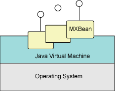
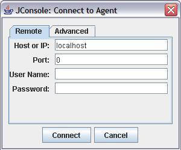
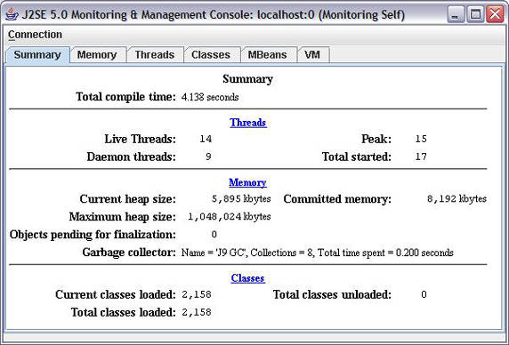
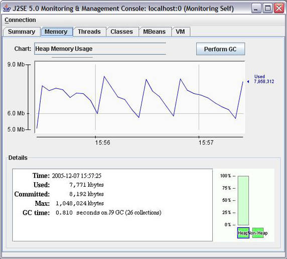
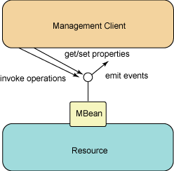
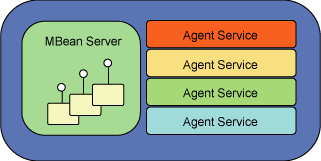

# 使用 Java 平台管理 bean
监视 Java SE 5.0 应用程序

**标签:** API 管理,Java

[原文链接](https://developer.ibm.com/zh/articles/j-mxbeans/)

May Gunn, George Harley, Caroline Gough

发布: 2006-04-28

* * *

在 Java 2 平台 5.0 版引入的众多新特性中，有一个 API 可以让 Java 应用程序和允许的工具监视和管理 Java 虚拟机（JVM）和虚拟机所在的本机操作系统。在本文中，将学习这个新的平台管理 API 的功能，这个 API 包含在 `java.lang.management` 包中。本文将让您迅速掌握在未来的 Java 平台版本中将变得更重要的一套新的强大特性。

## 监视和管理 5.0 虚拟机

Java 5.0 提供了监视和管理正在运行的虚拟机的新功能。开发人员和系统管理员能够监视 5.0 虚拟机的性能，而且对于某些属性还可以进行调优。以前有过使用 Java Management Extensions（JMX）经验的人都会熟悉执行这些活动的机制。通过 JMX 技术，一套需要控制的平台资源可以被当作简单的、定义良好的对象，对象的属性映射到给定资源的更低级特征上。

在平台管理 API 中，这些定义良好的对象叫做 _MXBean_ 。如果觉得 MXBean 听起来更像某种可能更熟悉的 MBean，那么就对了。这些 MXBean（或 _平台 MBean_ ）在效果上，就是封装了 5.0 平台内部特定部分的管理 bean。图 1 展示了 MXBean 在更大系统中的位置：

##### 图 1\. MXBean 提供了 Java 平台的管理接口



在运行着的 5.0 兼容的虚拟机中可以发现和定制许多不同种类的功能；例如，可以得到正在使用的即时编译系统的行为细节或者获得垃圾收集服务的进展情况。

任何 Java 应用程序只要获得需要的 bean 引用（使用我们本文中介绍的技术），就能利用平台 bean，然后调用适当的方法调用。在最简单的场景中，bean 客户机可以发现客户机所在的平台的信息。但是客户机还能监视完全独立的 JVM 的行为。这是有可能的，因为 MXBean 是一种 MBean，可以用 Java 5.0 可用的标准 JMX 服务远程地进行管理。

## JConsole

bean 客户机的一个示例就是与 Java SE 5.0 SDK 一起提供的 JConsole 工具。这是一个图形界面，连接到 JVM 并显示 JVM 的信息。GUI 中的选项卡与 JVM 的特定方面相关；有 Memory、Threads 和 Classes 等选项卡。JConsole 工具还提供了一个整体的 Summary 选项卡，一个VM 选项卡（提供虚拟机启动时的环境信息）和一个 MBean 选项卡（用户可以用它更详细地监视平台 MBean 的状态）。

### 运行 JConsole

在命令提示符下输入 `jconsole` 就可以启动 JConsole（假设 SDK 的 bin 目录在当前路径中）。请输入运行要监视的 JVM 的 _主机名_ ，以及侦听管理请求的 _端口号_ —— 以及其他需要的认证细节 —— 然后点击 **Connect** 。用默认值 `localhost` 和端口 `0` 点击 **Connect** ，监视的是用于运行 JConsole 自己的 JVM（因为 JConsole 是一个 Java 进程）。这称作 _自监视模式_ 。图 2 展示了 JConsole 的启动情况：

##### 图 2\. JConsole 启动



### JConsole 在工作

到 JVM 的连接建立之后，JConsole 先显示 Summary 选项卡，如图 3 所示：

##### 图 3\. JConsole 的 Summary 选项卡



从这开始，可以选择其他选项卡。例如 Memory 选项卡，如图 4 所示，展示了 JVM 中每个内存池的使用历史：

##### 图 4\. JConsole 的 Memory 选项卡



请注意面板右上角的 **Perform GC** 按钮。这是使用平台 MBean 可以在 JVM 上执行的众多操作中的一个示例。

## 工作方式

到此为止所阅读的基础内容是托管 bean 或 _MBean_ 的概念。可以把 MBean 当成资源的 _管理接口_ 的可编程表示。用更简单的术语来说，可以把它们当成围绕在受控实体周围的 Java 包装器。而用更实际的术语来说，MBean 就是 Java 类，这些类的 public 方法是根据定义良好的规则集编写的；这些规则要求把受管理的应用程序或资源的那些特征进行完整的封装。最终，资源（不论是什么以及在网络的什么位置上）的管理者为了控制的目的定位并使用对应的 MBean。

通过 API，MBean 提供以下信息，如图 5 所示：

- 资源的当前状态，通过资源的 _属性_ 提供
- 管理代理能够在资源上执行的 _操作_
- 能够发送到有兴趣的合作方的可能的 _事件通知_

##### 图 5\. MBean 客户机利用属性、操作和事件



MBean 创建好之后，需要注册到 _MBean 服务器上_ 。除了充当 MBean 的注册表，MBean 服务器还提供了让管理系统发现和利用已注册 MBean 的方式。管理已注册 MBean 的附加功能，由 JMX _代理服务_ 执行。这类服务包括：监视 MBean 的属性值，把 MBean 的改变通知给有兴趣的合作方，周期性地把 MBean 的特定信息通知给侦听器，维持 MBean 之间的关系。JMX 的代理服务通常是 MBean 本身。

MBean 服务器与必需的 JMX 代理服务的结合，被称作 _JMX 代理_ ，如图 6 所示：

##### 图 6\. JMX 代理



JMX 代理可以让它的托管资源 —— 也就是说，目前注册到它的 MBean 服务器上的 MBean 集 —— 对其他远程代理可用。

在 Java 5.0 发行之前， `javax.management` API 是 Java 平台的可选扩展，用户可以通过独立的下载获得，并通过 Java 代码把它用作管理和监视资源的手段。在这个上下文中， _资源_ 可以是应用程序、运行业务关键型应用程序的 J2EE 服务器、普通的旧式 Java 对象（POJO）、甚至于硬件实体（例如网络设备、机顶盒、电信设备，或者类似的东西）。资源如果可以从 Java 代码中引用，那么它就可以潜在地成为托管资源。

虽然在这里我们实际上只是涉及了 JMX 的表面，但对于认识 MXBean 来说，介绍的已经足够多了。关于 JMX 的设计和功能的全面讨论超出了本文的范围。要了解 JMX 在网络管理应用程序中负责的那部分功能的精彩概述，可以阅读 Sing Li 关于这一主题的系列（请参阅 参考资料 ）。

## 什么是 MXBean？如何使用它们？

既然知道了什么是 MBean，现在可以看看在 `java.lang.management` 包中定义的与它们名称类似的 MXBean。好消息是：MXBean 并没有偏离我们在讨论 MBean 时介绍的概念。这个包中的大多数类型都是符合命名规范的接口，命名规范与标准 MBean 使用的规范类似：平台资源的名称加上后缀 `MXBean` 。（对于标准的 MBean，当然使用后缀 `MBean` 。）

表 1 描述了通过 `java.lang.management` 包中提供的 MXBean 接口可以使用的平台资源：

##### 表 1\. 可以通过 MBean 管理的平台资源

平台资源对应的 MXBean可使用的数量编译`CompilationMXBean`0 或 1垃圾收集系统`GarbageCollectorMXBean`至少 1内存`MemoryMXBean`恰好是 1内存管理器`MemoryManagerMXBean`至少 1线程`ThreadMXBean`恰好是 1操作系统`OperatingSystemMXBean`恰好是 1运行时系统`RuntimeMXBean`恰好是 1类装入系统`ClassLoadingMXBean`恰好是 1内存资源`MemoryPoolMXBean`至少 1

对于每个 MXBean，客户必须编程的接口都在 Java 5.0 规范中做了严格的设置。目前客户还无法定制这样的接口，即它公开平台的任何更加可管理的属性。

在表 1 的第三列中指出的每个 MXBean 类型可能有的实例数量，严重依赖于被管理的具体的平台系统。例如，虽然 JVM 规范允许实现者选择所使用的垃圾收集算法，但是完全有理由使用任意数量的垃圾收集器，所以在任意时间内，就会有任意数量的 `GarbageCollectionMXBean` 实例在活动。请把这个与 `OperatingSystemMXBean` 对比，后者只有一个实例可用，因为管理的虚拟机显然在指定时间内只能运行在一个操作系统上。

客户机代码可以安全地把一次性的 MXBean 当成虚拟机中真正的单体。任何时间，只要引用请求的是这些一次性类型，得到的回答总是同一个实例，而不论引用请求从何而来或者在虚拟机生命周期中什么时候发生。即使多个客户机都在监视一个虚拟机的时候，也符合这种情况。

##### MBeanServerConnection

接口 `javax.management.MBeanServerConnection` 是 `javax.management.MBeanServer` 接口的超类型，如果 MBean 服务器与客户机代码运行在同一个 JVM 中（即管理客户机和 JMX 代理共同位于同一个虚拟机中），就可以用这个接口调用 MBean 服务器。因为在 `MBeanServerConnection` 和 `MBeanServer` 之间有父子关系，所以客户可以用相同的方法调用与远程或本地 MBean 服务器交互。

对 Java 客户机代码来说，MXBean 实例的行为就像任何 POJO 一样。可以直接调用对象来取得信息，不需要其他参与者。当然，这种情况需要 Java 客户机已经直接得到了对本地 bean （与管理应用程序运行在同一个虚拟机上）的引用，或者对于封装远程虚拟机的 bean 已经请求了对它的代理。在两种情况下，引用都是从平台的单体 `ManagementFactory` 获得的。

也可以通过 `javax.management.MBeanServerConnection` 访问平台 bean，但是在这种情况下，在会话中多出了额外的一级间接。在 [示例 2：通过平台服务器监视远程虚拟机](#示例-2：通过平台服务器监视远程虚拟机) 一节中将看到，在这种场景中，客户机总是请求 `MBeanServerConnection` 代表自己来定位指定的远程 bean，并进行调用。这实际还是让 JMX（前面提到过）发出对远程 MBean 的调用，而远程客户机必须与注册 MBean 的 MBean 服务器通信。

### MXBean 不是 JavaBean

为了避免混淆，应当记住：虽然把 MXBean 当成有助于监视和控制 JVM 的 MBean 完全没错，但如果把 MXBean 当成一种 JavaBean，就肯定 _不对_ 了。JavaBean 技术是 Java 平台的组件模型，它的设计目的是提供用图形化工具从可重用 Java 组件构造应用程序的能力。虽然 JavaBean 的一些特性（例如用有意义的命名规范帮助工具发现属性）在 MBean 和 MXBean 领域中都存在，但是两种技术是完全不同的，不要把它们混淆了。

### 额外的 MXBean

在本文开始时，我们提到过 `java.lang.management` 包容纳了平台管理 API。现在，我们对这句话稍做修正，因为不是所有的 MXBean 都包含在这个包中。因为 `LoggingMXBean` 与 Java 平台 的日志功能捆绑得如此紧密，所以把它放在 `java.util.logging` 包中更有意义。顾名思义，这类 MXBean 提供了运行虚拟机的日志功具的管理接口。使用对这个 bean 的引用，客户可以获得在平台上注册的所有日志程序的名称和它们彼此之间的关系。还可以获得和设置指定平台日志程序的级别。

就像 `OperatingSystemMXBean` 和 `ThreadMXBean` （另两个示例）一样， `LoggingMXBean` 在运行的虚拟机中也以单体方式存在。对它的已公开属性的任何 get 和 set，不论通过任何通信方式，最后都路由到同一个对象实例。

## 获得 MXBean

客户机代码访问 MXBean 有三种方式：通过 _工厂方法_ 、通过 _平台服务器_ 或作为 _代理_ 。

### 工厂方法

检索 MXBean 最简单的方式就是使用 `java.lang.management.ManagementFactory` 类提供的静态方法。但是，用这种方式得到的 MXBean 只能用来监视本地虚拟机。 `ManagementFactory` 类为每种 MXBean 都定义了一个检索方法。有些方法返回 MXBean 的单一实例，有些方法返回 MXBean 实例的强类型 `List` 。

在指定类型只有一个 MXBean 时，检索它的代码很简单。清单 1 展示了检索 `ThreadMXBean` 的代码：

##### 清单 1\. 检索平台惟一的 ThreadMXBean 的引用

```
ThreadMXBean threadBean = ManagementFactory.getThreadMXBean();

```

Show moreShow more icon

对于可能存在多个 MXBean 实例的那些 MXBean 类型来说，存在着工厂方法，可以在 `List` 中返回 MXBean，如清单 2 所示：

##### 清单 2\. 检索平台上所有已知的 MemoryPoolMXBean 的强类型列表

```
List<MemoryPoolMXBean> memPoolBeans = ManagementFactory.getMemoryPoolMXBeans();
for (MemoryPoolMXBean mpb : memPoolBeans) {
    System.out.println("Memory Pool: " + mpb.getName());
}

```

Show moreShow more icon

`LoggingMXBean` 是 `java.util.logging` 包的一部分，所以，要用 `LogManager` 类而不是 `ManagementFactory` 类来访问它，如清单 3 所示：

##### 清单 3\. 从 LogManager 得到 LoggingMXBean 引用

```
LoggingMXBean logBean = LogManager.getLoggingMXBean();

```

Show moreShow more icon

记住，这些方法只允许访问属于 _本地_ 虚拟机的 MXBean。如果想把客户机代码扩展到能够一同处理位于同一台机器或不同结点上的远程 JVM，那么需要使用下面介绍的两种方法中的一种。

### 通过平台服务器

组织代码，以对远程虚拟机的 MBean 服务器的连接进行调用，是一种可行的选择。要让这个选择成功，首先需要用关键的命令行选项启动远程虚拟机。这些选项设置虚拟机的相关 JMX 代理侦听请求的端口，以及起作用的安全级别。例如，以下选项启动的虚拟机，其代理会在 1234 端口上侦听，且没有安全性：

```
-Dcom.sun.management.jmxremote.port=1234
-Dcom.sun.management.jmxremote.authenticate=false
-Dcom.sun.management.jmxremote.ssl=false

```

Show moreShow more icon

本文后面的 [安全性](#安全性) 一节将介绍对虚拟机的安全访问。

有了远程代理侦听，就可以使用清单 4 中的代码段获得相关 MBean 服务器连接的引用：

##### 清单 4\. 用 JMXConnectorFactory 连接不同虚拟机的 MBean 服务器

```
try {
    // connect to a separate VM's MBeanServer, using the JMX RMI functionality
    JMXServiceURL address =
      new JMXServiceURL( "service:jmx:rmi:///jndi/rmi://localhost:1234/jmxrmi");
    JMXConnector connector = JMXConnectorFactory.connect(address);
    MBeanServerConnection mbs = connector.getMBeanServerConnection();
} catch ...

```

Show moreShow more icon

一旦检索到 `MBeanServerConnection` ，就可以使用 JMX 方法 `getAttribute()` 、 `setAttribute()` 和 `invoke()` 操作 MXBean。这将在 [示例 2：通过平台服务器监视远程虚拟机](#示例-2：通过平台服务器监视远程虚拟机) 中介绍。

### 作为代理

访问平台 bean API 的第三种方法与前面介绍的两种方法有共同之处。像以前一样，需要检索到被监视虚拟机的 JMX 代理的 `MBeanServerConnection` 。然后，通过使用 `ManagementFactory` 类的静态助手方法，客户机代码可以请求注册到远程虚拟机的 MBean 服务器上的一个指定 MXBean 的代理实例。清单 5 展示了一个示例：

##### 清单 5\. 到远程 MBean 服务器的引用能够获得远程 MXBean 的代理

```
try {
    ThreadMXBean threadBean = ManagementFactory.newPlatformMXBeanProxy
        (mbs, ManagementFactory.THREAD_MXBEAN_NAME, ThreadMXBean.class);
} catch ...

```

Show moreShow more icon

对于所有的单体 MXBean（除了 `LoggingMXBean` ），在 `ManagementFactory` 类的公共静态字段中可以得到用来进行服务器注册的完整字符串名称。例如， `ThreadMXBean` 的 `javax.management.ObjectName` 的字符串表示就保存在 `THREAD_MXBEAN_NAME` 字段中，而 `LoggingMXBean` 的注册名称则保存在 `java.util.logging.LogManager` 类的静态字段中。清单 6 展示了对 `LoggingMXBean` 代理实例的请求：

##### 清单 6\. LoggingMXBean 的字符串名称是 java.util.logging.LogManager 类的常量

```
try {
    LoggingMXBean logBean = ManagementFactory.newPlatformMXBeanProxy
        (mbs, LogManager.LOGGING_MXBEAN_NAME, LoggingMXBean.class);
} catch ...

```

Show moreShow more icon

对于可能在虚拟机中存在不止一个实例的 MXBean 类型，事情变得略微麻烦一些。在这种情况下，首先需要用 `MBeanServerConnection` 获得指定类型的全部已注册 MXBean 的名称。为了方便，每个单体 MXBean 的 `ObjectName` 的域部分保存在 `ManagementFactory` 中的公共静态字段中。一旦检索到这些名称，就能用每个名称构造独立的代理实例。清单 7 展示了一个示例：

##### 清单 7\. 为属于远程虚拟机的每个 MemoryManagerMXBean 创建代理

```
try {
        // Get the names of all the Memory Manager MXBeans in the server
        Set srvMemMgrNames = mbs.queryNames(new ObjectName(
            ManagementFactory.MEMORY_MANAGER_MXBEAN_DOMAIN_TYPE + ",*"), null);

        // Get a MXBean Proxy for each name returned
        for (Object memMgrName : srvMemMgrNames){
            // Cast Object to an ObjectName
            ObjectName memMgr = (ObjectName) memMgrName;

            // Call newPlatformMXBeanProxy with the complete object name
            // for the specific MXBean
            MemoryManagerMXBean memMgrBean =
                ManagementFactory.newPlatformMXBeanProxy(
                    mbs, memMgr.toString(), MemoryManagerMXBean.class);

            // memMgrBean is a proxy to the remote MXBean. We can use it
            // just as if it was a reference to a local MXBean.
            System.out.println("Memory Manager Name = " +
                memMgrBean.getName());
        }
} catch ...

```

Show moreShow more icon

## 使用 MXBean

`java.lang.management` 文档中列出了每个 MXBean 接口定义的操作。通过这些操作，用户可以管理和监视虚拟机。例如， `MemoryMXBean` 上的操作允许打开内存系统的详细输出、请求垃圾收集以及检索当前堆和非堆内存池使用的内存的详细信息。所以，如果关心 Java 应用程序所使用的内存数量或者希望调整堆的尺寸，可以容易地用 `java.lang.management` API 编写管理客户机，连接到应用程序并监视内存的使用情况。

类似地， `ThreadMXBean` 也提供了 Java 应用程序挂起时会有用的功能。 `findMonitorDeadlockedThreads()` 方法返回被它标识为死锁的线程的 ID。然后就可以用这些 ID 来检索线程的详细信息，包括它们的堆栈跟踪、它们的状态、它们是否在执行本机代码，等等。

这个线程信息是在 `ThreadInfo` 类的实例中提供的，这个类是 `java.lang management` 包中提供的由 MXBean 用来向用户返回数据快照的三个类的中一个 —— 其他两个是 `MemoryUsage` 和 `MemoryNotificationInfo` 类。这三个类中的每个类都是一个 _复杂的_ 数据类型，包含用于描述特定平台性质的结构化信息。

现在来看两个示例场景，演示一下上面讨论的概念如何转变成 Java 代码。

## 示例 1：通过 MXBean 或代理监视虚拟机

正如前面讨论过的，MXBean 的方法既可以直接在本地 MXBean 上调用，也可以通过代理调用。清单 8 展示了如何使用 `ThreadMXBean` 的 getter 和 setter 操作。这个示例中的 `threadBean` 变量既可以是从本机虚拟机检索的 MXBean，也可以是从远程虚拟机检索的 MXBean 的代理。一旦得到了引用，那么对于调用者来说就是透明的。

##### 清单 8\. 获取和设置 ThreadMXBean 的值

```
try {
    // Get the current thread count for the JVM
    int threadCount = threadBean.getThreadCount();
    System.out.println(" Thread Count = " + threadCount);

    // enable the thread CPU time
    threadBean.setThreadCpuTimeEnabled(true);
} catch ...

```

Show moreShow more icon

清单 8 中使用的 `setThreadCpuTimeEnabled()` 方法在 5.0 兼容的虚拟机中是可选支持的。在使用清单 9 所示的可选功能时，需要进行检查：

##### 清单 9\. 在尝试使用可选属性之前，检查是否支持可选属性

```
if (threadBean.isThreadCpuTimeSupported()) {
    threadBean.setThreadCpuTimeEnabled(true);
}

```

Show moreShow more icon

`CompilationMXBean` 类型的 `getTotalCompilationTime()` 方法也包含不必在每个 5.0 兼容虚拟机实现中都必须有的功能。就像清单 9 中的 `setThreadCpuTimeEnabled()` 一样，也有相关的方法用来检查支持是否存在。不利用这些检测方法的代码需要处理可选方法可能抛出的任何 `java.lang.UnsupportedOperationException` 。

清单 10 展示了如何访问虚拟机中运行的所有线程的信息。每个线程的信息都保存在独立的专用 `ThreadInfo` 对象中，随后可以查询这个对象。

##### 清单 10\. 获得虚拟机中运行的所有线程的名称

```
try {
    // Get the ids of all the existing threads
    long[] threadIDs = threadBean.getAllThreadIds();

    // Get the ThreadInfo object for each threadID
    ThreadInfo[] threadDataset = threadBean.getThreadInfo(threadIDs);
    for (ThreadInfo threadData : threadDataset) {
        if (threadData != null) {
            System.out.println(threadData.getThreadName());
        }
    }
} catch ...

```

Show moreShow more icon

记住，像 `ThreadInfo` 、 `MemoryUsage` 和 `MemoryNotificationInfo` 这样的复杂类型中包含的信息，仅仅是请求调用执行的时刻的系统快照。这些对象在您得到对它们的引用之后，不会动态更新。所以，如果应用程序需要 _刷新_ 被管理的虚拟机上这些方面的数据，需要再做另一个调用，得到更新的 `ThreadInfo` 或 `MemoryUsage` 对象。 `MemoryNotificationInfo` 对象在这方面略有不同，因为它们不是由管理应用程序拉动的，而是在事件通知中推动的（这点 [通知](#通知) ）。

## 示例 2：通过平台服务器监视远程虚拟机

用 `MBeanServerConnection` 访问远程 JVM 的 `ThreadMXBean` 不像清单 1 中的示例那样直接。首先，需要 `ThreadMXBean` 的一个 `javax.management.ObjectName` 实例。可以用与 MXBean 代理对象相同的名称创建这个实例，如清单 11 所示：

##### 清单 11\. 构建 ThreadMXBean 的 ObjectName

```
try {
    ObjectName srvThrdName = new ObjectName(ManagementFactory.THREAD_MXBEAN_NAME);
    ...
} catch ...

```

Show moreShow more icon

可以用 `ObjectName` 实例来标识特定的远程 `ThreadMXBean` ，以调用 `MBeanServerConnection` 的 `getAttribute()` 、 `setAttribute()` 和 `invoke()` ，如清单 12 所示：

##### 清单 12\. 将 ObjectName 用于对远程 MBean 服务器的调用

```
try {
    // Get the current thread count for the JVM
    int threadCount =
      ((Integer)mbs.getAttribute( srvThrdName, "ThreadCount")）。intValue();
    System.out.println(" Thread Count = " + threadCount);

    boolean supported =
      ((Boolean)mbs.getAttribute(srvThrdName, "ThreadCpuTimeSupported")）。booleanValue();
    if (supported) {
        mbs.setAttribute(srvThrdName,
          new Attribute("ThreadCpuTimeEnabled", Boolean.TRUE));
        ...
    }
} catch ...

```

Show moreShow more icon

清单 13 展示了通过 MBean 服务器连接来访问虚拟机中所有当前线程的信息。使用这种方法访问的 MXBean 返回复杂的数据类型，这些复杂数据类型包装在 JMX 开放类型 —— 例如 `javax.management.openmbean.CompositeData` 对象中。

为什么要把复杂数据包装在中间类型中呢？记住，MXBean 可能潜在地由实际上不是用 Java 语言编写的远程应用程序来管理，也有可能由这样的 Java 应用程序来管理，它们不能访问所有用于描述托管资源的不同性质的复杂类型。虽然可以安全地假定到平台 JMX 代理的连接的两端都能理解简单类型（例如 `boolean` 、 `long` 和 `string` ），还可以把它们映射到各自的实现语言中的对应类型，但是要假定每个可能的管理应用程序都能正确地解释 `ThreadInfo` 或 `MemoryUsage` 这样的复杂类型，那是不现实的。像 `CompositeData` 这样的开放类型可以用更基本的类型来代表复杂的（即非基本的或结构化的）数据。

如果 5.0 MXBean 的远程调用要求传递复杂类型的实例，那么对象就被转换成等价的 `CompositeData` 。虽然这可以让信息发送到尽可能广泛的客户，却也有不足之处：实际上能够解析 `ThreadInfo` 和 `MemoryUsage` 类型的接收方 Java 应用程序仍然需要从开放类型转换到复杂类型。但即便这样，也不算是太麻烦的步骤，因为 `java.lang.management` 中定义的所有支持的复杂数据类型，都有静态的方便方法做这件事。

在清单 13 中， `threadDataset` 属性包含一组 `CompositeData` 对象，这些对象直接映射到 `ThreadInfo` 对象。对于每个线程， `ThreadInfo` 的静态方法 `from()` 被用来从 `CompositeData` 构建等价的 `ThreadInfo` 对象。可以用这个对象访问每个线程的信息。

##### 清单 13\. CompositeData 类型在网络上传输复杂数据结构

```
try {
    // Get the ids of all the existing threads
    long[] threadIDs = (long[])mbs.getAttribute(srvThrdName, "AllThreadIds");

    // Get the ThreadInfo object for each threadID. To do this we need to
    // invoke the getThreadInfo method on the remote thread bean. To do
    // that we need to pass the name of the method to run together with the
    // argument and the argument type. It's pretty ugly we know.
    CompositeData[] threadDataset =
      (CompositeData[]) (mbs.invoke(srvThrdName, "getThreadInfo",
        new Object[]{threadIDs}, new String[] {"[J"}));

    // Recover the ThreadInfo object from each received CompositeData using
    // the static helper from() method and then use it to print out the
    // thread name.
    for (CompositeData threadCD : threadDataset) {
        ThreadInfo threadData = ThreadInfo.from(threadCD);
        if (threadData != null) {
            System.out.println(threadData.getThreadName());
        }
    }
} catch ...

```

Show moreShow more icon

## API 支持

如果要开发检查虚拟机线程状态的平台管理代码，那么可能会遇到一些有趣的行为，与我们在撰写本文时遇到的一样。这会对代码有影响么？这取决于应用程序使用 5.0 版 Java 平台新机制保护代码块不受并发访问影响的程度。

5.0 中的新包 `java.util.concurrent.locks` 引入了 `ReentrantLock` 类，顾名思义，可以用它构建一个可重入锁，以保护代码的关键部分。它与现有的 `synchronized` 关键字的隐式锁定机制非常类似，但是有一些额外的功能，这些功能对于微调控制显式锁会非常有用。清单 14 展示了它的使用示例：

##### 清单 14\. ReentrantLock 非常简单的使用

```
private Lock myLock = new ReentrantLock();
...
void myMethod() {
    // Acquire the lock
    myLock.lock();
    try {
        ... do work in critical section ...
    } finally {
        // Relinquish the lock
        myLock.unlock();
    }// end finally
...
}

```

Show moreShow more icon

在进入关键部分之前，调用 `ReentrantLock` 对象的 `lock()` 方法，尝试并获得锁。只有在其他线程不拥有锁的情况下才会成功，如果其他线程拥有锁，当前线程就被阻塞。在 5.0 版 Java 平台之前，可能要用清单 15 那样的代码才能编写清单 14 的功能。（当然，现在还可以这样写，因为 `synchronized` 还没过时。）

##### 清单 15\. 同步的方法

```
synchronized void myMethod() {
... do work in critical section ...
}

```

Show moreShow more icon

在这些简单的使用中，不会看到代码行为上的差异。但是，如果利用 `ThreadMXBean` 和 `ThreadInfo` 类型来检查您知道在运行的程序中会因为进入关键部分而阻塞的线程的阻塞计数，那么结果会根据使用的阻塞方法而不同。通过编写一些简单的代码，其中有两个不同的线程，试图调用同一个 `myMethod()` ，并强迫一个线程总在另一个线程之后到达，您可以自己对这个问题进行演示。这个线程显然会被阻塞，而且应当有一个恰好为 1 的阻塞计数。在 `myMethod()` 上使用 `synchronized` 关键字时，会看到与线程关联的 `ThreadInfo` 对象有一个大于 0 的阻塞计数。但是，使用新的 `ReentrantLock` 方式，会看到一个为 0 的阻塞计数。可以肯定地说，随着 `ThreadMXBean` 的虚拟机监视功能采用新的并发包，我们观察到的这种行为上的差异在未来的 Java 平台版本中会被清除。

## 通知

`MemoryMXBean` 在 MXBean 之间是惟一的，因为它能够把内存使用情况以事件的方式向客户机对象动态地发送通知。对于内存使用超过一些预设阈值的问题，即时通信的好处显而易见，因为可能是应用程序级上的问题征兆，或者表明需要对虚拟机进行进一步的调整。

`MemoryMXBean` 使用的通知模型来自 JMX MBean 规范，该规范与 Java 编程中使用的事件通知模型很相似。作为通知的广播者， `MemoryMXBean` 实现了 JMX 接口 `javax.management.NotificationBroadcaster` ，这个相对小的接口允许 bean 注册有兴趣的合作方或取消注册。然后，每个有兴趣的合作方（对象）都必须实现 `javax.management.NotificationListener` 接口。这个接口只包含一个操作，在事件发生的时候，由发出 MXBean 的事件调用。

侦听器可以在虚拟机生命周期的任何时候注册（或取消注册）到 `MemoryMXBean` 上。通知只广播到 _当前_ 已注册的合作方。

侦听器的处理器方法在被调用时，会接收到 `javax.management.Notification` 类的实例。这是 JMX 事件通知模型中的通用事件信号类型。它被设置成容纳造成它生成的事件的相当数量的信息。对于 `MemoryMXBean` ，目前有两类通知：

- 虚拟机中的内存资源（有时叫做 _内存池_ ）增长超过了预先设置的阈值。这种事件由 `MemoryNotificationInfo` 常量 `MEMORY_THRESHOLD_EXCEEDED` 表示。
- _垃圾收集之后_ 内存资源的大小超过了预先设置的阈值。这由 `MemoryNotificationInfo` 常量 `MEMORY_COLLECTION_THRESHOLD_EXCEEDED` 表示。

在处理器方法中接收到 `Notification` 对象后，注册的侦听器可以查询 `Notification` 的类型，根据 `MemoryNotificationInfo` 的两个值检查生成的字符串，从而判断出发生的事件类型。

要向侦听器传递事件的详细信息， `MemoryMXBean` 会用代表 `MemoryNotificationInfo` 对象 `javax.management.openmbean.CompositeData` 的具体实例正确地设置发出的 `Notification` 对象的用户数据（实际上，就是广播者包含任何想要的信息的方法）。就像在 [示例 2：通过平台服务器监视远程虚拟机](#示例-2：通过平台服务器监视远程虚拟机) 中解释的一样，在 JMX 开放数据类型中封装事件数据，可以让最广泛的侦听器都能理解数据。

## 安全性

到目前为止都还不错。现在是面对被甩在一边的重要问题 —— 安全性 —— 的时候了。不如果不想让谁的应用程序代码访问和修改虚拟机，该怎么办？有什么选项可用么？ 可以设置一些系统属性，来控制访问级别和虚拟机数据从 JMX 代理向管理客户机传递虚拟机数据的方式。这些属性分成两类： _口令认证_ 和 _安全套接字层（SSL）_ 。

### 使用命令行选项

为了让 5.0 兼容的虚拟机可以被监视和管理，需要用以下命令行选项设置平台 JMX 代理的端口号：

```
-Dcom.sun.management.jmxremote.port=<number>

```

Show moreShow more icon

如果不介意谁通过这个端口访问虚拟机，也可以添加以下两个选项，关闭口令认证和 SSL 加密（这两项默认都是开启的）：

```
-Dcom.sun.management.jmxremote.authenticate=false
-Dcom.sun.management.jmxremote.ssl=false

```

Show moreShow more icon

在开发 `java.lang.management` 客户机代码，而且想方便地监视另一台虚拟机时，一起使用这三个选项会很方便。在生产环境中，则需要设置口令控制或 SSL（或者两者都要设置）。

### 口令认证

在 5.0 SDK 的 jre/lib/management 目录中，可以找到一个叫做 jmxremote.password.template 的文件。这个文件定义了两个角色的用户名和口令。第一个是 _监视_ 角色，允许访问只读的管理函数；第二个是 _控制_ 角色，允许访问读写函数。取决于需要的访问级别，客户可以用 `monitorRole` 或 `controlRole` 用户名进行认证。为了确保只有认证的用户才能访问，需要做以下工作：

1. 把 jmxremote.password.template 的内容拷贝到叫做 jmxremote.password 的文件中，并取消掉文件末尾定义用户名和口令部分的注释，根据需要修改口令。
2. 修改 jmxremote.password 的许可，只让所有者能够读取和修改它。（在 UNIX 和 UNIX 类的系统上，把许可设置成 600。在 Microsoft Windows 上，请按照 “How to secure a password file on Microsoft Windows systems” 一文中的说明操作，可以在 参考资料 中找到这篇文章的链接。）
3. 在启动虚拟机时，用以下命令行选项指定要使用的口令文件的位置：


    ```
    -Dcom.sun.management.jmxremote.password.file=<file-path>

    ```


    Show moreShow more icon


从管理客户的角度来说，需要提供正确的用户名/口令组合来访问开启了认证的虚拟机。如果客户是 JConsole，这很简单：在初始的 Connection 选项卡中提供了用户名和口令字段。要编写向远程虚拟机提供认证细节的代码，需要把清单 16 所示的修改添加到清单 4 中提供的连接代码：

##### 清单 16\. 连接到要求用户认证的远程虚拟机

```
try {
    // provide a valid username and password (e.g., via program arguments)
    String user = "monitorRole";
    String pw = "password";

    // place the username and password in a string array of credentials that
    // can be used when making the connection to the remote JMX agent
    String[] credentials = new String[] { user, pw };
    // the string array of credentials is placed in a map keyed against the
    // well-defined credentials identifier string
    Map<String, String[]> props = new HashMap<String, String[]>();
    props.put("jmx.remote.credentials", credentials);
    // supply the map of credentials to the connect call
    JMXServiceURL address =
      new JMXServiceURL("service:jmx:rmi:///jndi/rmi://localhost:1234/jmxrmi");
    JMXConnector connector = JMXConnectorFactory.connect(address, props);

    // it is a trivial matter to get a reference for the MBean server
    // connection to the remote agent
    MBeanServerConnection mbs = connector.getMBeanServerConnection();
} catch ...

```

Show moreShow more icon

对要求认证的虚拟机提供错误的用户名或口令会造成 `java.lang.SecurityException` 。类似地，以 `monitorRole` 进行认证，然后想调用读写操作 —— 例如试图请求垃圾收集 —— 也会造成抛出 `SecurityException` 。

### 使用 SSL

可以用 SSL 对从平台 JMX 代理传递到监视平台管理客户的信息进行加密。传递的数据使用公钥（非对称）加密算法加密，所以只有对应私钥的持有者才能解密数据。这就防止了数据包侦听应用程序偷听通信。要使用这个特性，需要在连接的两端都配置 SSL，其中包括生成一对密钥和一个数字证书。具体细节超出了本文的范围，请阅读 Greg Travis 的精彩教程 “Using JSSE for secure socket communication” 了解更多内容（请参阅 参考资料 ）。

好消息是，一旦设置好了密钥对和证书，使用 SSL 时并不需要修改管理客户机代码。只要使用一些命令行选项，就可以开启加密。首先，想要监视或管理的 Java 应用程序必须用以下选项启动：

```
-Dcom.sun.management.jmxremote.ssl.need.client.auth=true
-Djavax.net.ssl.keyStore=<keystore-location>
-Djavax.net.ssl.trustStore=<truststore-location>
-Djavax.net.ssl.keyStoreType=<keystore-type>
-Djavax.net.ssl.keyStorePassword=<keystore-password>
-Djavax.net.ssl.trustStoreType=<truststore-type>
-Djavax.net.ssl.trustStorePassword=<truststore-password>

```

Show moreShow more icon

希望与平台通信的管理客户需要用以上选项的子集启动：可以用第一和第二行。如果客户是 JConsole，可以在启动 GUI 时，用 `-J` 命令行语法传递这些选项，该语法会把 Java 选项传递给 JVM。

同样，教程 “Using JSSE for secure socket communication” 可以提供这些单个选项的更多细节。

## 结束语

我们希望我们已经吸引您去寻找关于 Java 5.0 平台的管理 API 的更多内容。因为 Java 管理扩展的出现为 Java 企业开发人员和管理人员提供了监视和控制他们部署的标准化方式，所以对 Java 5.0 中 `java.lang.management` API 的介绍，提供了对应用程序运行的平台进行检查的机制。

不论是要监视本地运行的应用程序的线程池还是安全地检查在 intranet 上其他位置需要注意的任务关键型程序的内存使用情况，MXBean 的获得和使用都非常简单。MXBean 可以起到中心作用，让您更多地了解代码运行的环境，既可以用非侵入性的方式探查和了解不熟悉的 Java 实现的特征，也可以构建自己的检测和性能监视工具。

因为 “诊断、监视和管理” 是 Java 平台即将推出的 6.0 发行版的一个关键主题，所以这个 API 肯定会在未来的 Java 技术中承担起更重要的角色。

## 相关主题

- [java.lang.management API](https://docs.oracle.com/javase/1.5.0/docs/api/java/lang/management/package-summary.html)
- [How to Secure a Password File on Microsoft Windows systems](https://docs.oracle.com/javase/1.5.0/docs/guide/management/security-windows.html)
- [WebSphere 应用服务器信息中心](https://www.ibm.com/support/knowledgecenter/SSEQTP/mapfiles/product_welcome_was.html)