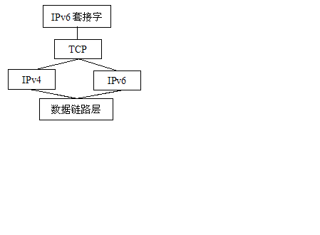
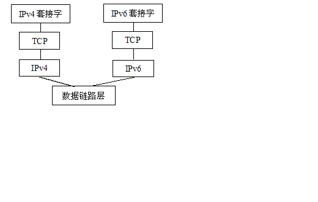

# 使用 Java 开发兼容 IPv6 的网络应用程序
如何验证并正规化 IPv6 地址的表示以及在 IPv4/IPv6 双地址环境下的网络选择和测试

**标签:** Java

[原文链接](https://developer.ibm.com/zh/articles/j-lo-ipv6dev/)

朱益盛, 杨晖, 傅啸

发布: 2010-05-31

* * *

## IPv6 背景介绍

目前我们使用的是第二代互联网 IPv4 技术，它的最大问题是网络地址资源有限，从理论上讲，可以编址 1600 万个网络、40 亿台主机。但采用 A、B、C 三类编址方式后，可用的网络地址和主机地址的数目大打折扣，以至目前的 IP 地址近乎枯竭。网络地址不足，严重地制约了全球互联网的应用和发展。

一方面是地址资源数量的限制，另一方面是随着电子技术及网络技术的发展，计算机网络将进入人们的日常生活，可能身边的每一样东西都需要连入全球因特网。在这种网络空间匮乏的环境下，IPv6 应运而生。它的产生不但解决了网络地址资源数量的问题，同时也为除电脑外的设备连入互联网在数量限制上扫清了障碍。

如果说 IPv4 实现的只是人机对话，那么 IPv6 则扩展到任意事物之间的对话，它不仅可以为人类服务，还将服务于众多硬件设备，如家用电器、传感器、远程照相机、汽车等，它将是无时不在，无处不在的深入社会每个角落的真正的宽带网，它所带来的经济效益也将非常巨大。

当然，IPv6 并非十全十美、一劳永逸，不可能解决所有问题。IPv6 只能在发展中不断完善，也不可能在一夜之间发生，过渡需要时间和成本，但从长远看，IPv6 有利于互联网的持续和长久发展。目前，国际互联网组织已经决定成立两个专门工作组，制定相应的国际标准。

## Java 对 IPv6 的支持

随着 IPv6 越来越受到业界的重视，Java 从 1.4 版开始支持 Linux 和 Solaris 平台上的 IPv6。1.5 版起又加入了 Windows 平台上的支持。相对于 C++，Java 很好得封装了 IPv4 和 IPv6 的变化部分，遗留代码都可以原生支持 IPv6，而不用随底层具体实现的变化而变化。

那么 Java 是如何来支持 IPv6 的呢？ Java 网络栈会优先检查底层系统是否支持 IPv6，以及采用的何种 IP 栈系统。如果是双栈系统，那它直接创建一个 IPv6 套接字（如图 1）。

##### 图 1\. 双栈结构



对于分隔栈系统，Java 则创建 IPv4/v6 两个套接字（如图 2）。如果是 TCP 客户端程序，一旦其中某个套接字连接成功，另一个套接字就会被关闭，这个套接字连接使用的 IP 协议类型也就此被固定下来。如果是 TCP 服务器端程序，因为无法预期客户端使用的 IP 协议，所以 IPv4/v6 两个套接字会被一直保留。对于 UDP 应用程序，无论是客户端还是服务器端程序，两个套接字都会保留来完成通信。

##### 图 2\. 分隔栈结构



## 如何验证 IPv6 地址

### IPv6 地址表示

从 IPv4 到 IPv6 最显著的变化就是网络地址的长度，IPv6 地址为 128 位长度，一般采用 32 个十六进制数，但通常写做 8 组每组 4 个十六进制的形式。例如：

2001:0db8:85a3:08d3:1319:8a2e:0370:7344 是一个合法的 IPv6 地址。如果四个数字都是零，则可以被省略。

2001:0db8:85a3:0000:1319:8a2e:0370:7344 等同于 2001:0db8:85a3::1319:8a2e:0370:7344。

遵从这些规则，如果因为省略而出现了两个以上的冒号的话，可以压缩为一个，但这种零压缩在地址中只能出现一次。因此：

```
2001:0DB8:0000:0000:0000:0000:1428:57ab
2001:0DB8:0000:0000:0000::1428:57ab
2001:0DB8:0:0:0:0:1428:57ab
2001:0DB8:0::0:1428:57ab
2001:0DB8::1428:57ab

```

Show moreShow more icon

都是合法的地址，并且他们是等价的。但 2001::25de::cade 是非法的。（因为这样会使得搞不清楚每个压缩中有几个全零的分组）。同时前导的零可以省略，因此：2001:0DB8:02de::0e13 等于 2001:DB8:2de::e13。

### IPv6 地址校验

IPv4 地址可以很容易的转化为 IPv6 格式。举例来说，如果 IPv4 的一个地址为 135.75.43.52（十六进制为 0x874B2B34），它可以被转化为 0000:0000:0000:0000:0000:0000:874B:2B34 或者：:874B:2B34。同时，还可以使用混合符号（IPv4- compatible address），则地址可以为：:135.75.43.52。

在 IPv6 的环境下开发 Java 应用，或者移植已有的 IPv4 环境下开发的 Java 应用到 IPv6 环境中来，对于 IPv6 网络地址的验证是必须的步骤，尤其是对那些提供了 UI（用户接口）的 Java 应用。

所幸的是，从 Java 1.5 开始，Sun 就增加了对 IPv6 网络地址校验的 Java 支持。程序员可以通过简单地调用方法 sun.net.util.IPAddressUtil.isIPv6LiteralAddress() 来验证一个 String 类型的输入是否是一个合法的 IPv6 网络地址。

为了更深入一步地了解 IPv6 的网络地址规范，及其验证算法，笔者参阅了一些材料，包括上文所述的方法 sun.net.util.IPAddressUtil.isIPv6LiteralAddress() 的源代码，以及目前网络上流传的一些 IPv6 网络地址的正则表达式，发现：

1. 由于 IPv6 协议所允许的网络地址格式较多，规范较宽松（例如零压缩地址，IPv4 映射地址等），所以导致了 IPv6 网络地址的格式变化很大。
2. Java 对于 IPv6 网络地址的验证是通过对输入字符的循环匹配做到的，并没有采取正则表达式的做法。其匹配过程中还依赖于其它的 Java 方法。
3. 目前网络上流传的 IPv6 网络地址验证的正则表达式通常都只能涵盖部分地址格式，而且表达式冗长难读，非常不易于理解。

基于通用性考虑，以及为了使验证方法尽量简单易读，笔者尝试将 IPv6 网络地址的格式简单分类以后，使用多个正则表达式进行验证。

这种做法兼顾了通用性（基于正则表达式，所以方便用各种不同的编程语言进行实现），以及易读性（每个独立的正则表达式相对简短）；并且根据测试，支持目前所有的 IPv6 网络地址格式类型，尚未发现例外。

以下是笔者用 Java 编写的对于 IPv6 网络地址的验证方法。此算法可被简单地用其它编程语言仿照重写。

##### 清单 1\. 验证地址

```
//IPv6 address validator matches these IPv6 formats
//::ffff:21:7.8.9.221 | 2001:0db8:85a3:08d3:1319:8a2e:0370:7344
//| ::8a2e:0:0370:7344 | 2001:0db8:85a3:08d3:1319:8a2e:100.22.44.55
//| 2001:0db8::8a2e:100.22.44.55 | ::100.22.44.55 | ffff::
//And such addresses are invalid
//::8a2e:0:0370:7344.4 | 2001:idb8::111:7.8.9.111 | 2001::100.a2.44.55
//| :2001::100.22.44.55
public static boolean isIPV6Format(String ip) {
    ip = ip.trim();

    //in many cases such as URLs, IPv6 addresses are wrapped by []
    if(ip.substring(0, 1).equals("[") && ip.substring(ip.length()-1).equals("]"))

        ip = ip.substring(1, ip.length()-1);

        return (1 < Pattern.compile(":").split(ip).length)
        //a valid IPv6 address should contains no less than 1,
        //and no more than 7 ":” as separators
            && (Pattern.compile(":").split(ip).length <= 8)

        //the address can be compressed, but "::” can appear only once
            && (Pattern.compile("::").split(ip).length <= 2)

        //if a compressed address
            && (Pattern.compile("::").split(ip).length == 2)

            //if starts with "::” – leading zeros are compressed
            ? (((ip.substring(0, 2).equals("::"))
            ? Pattern.matches("^::([\\da-f]{1,4}(:)){0,4}(([\\da-f]{1,4}(:)[\\da-f]{1,4})
        |([\\da-f]{1,4})|((\\d{1,3}.){3}\\d{1,3}))", ip)
                : Pattern.matches("^([\\da-f]{1,4}(:|::)){1,5}
        (([\\da-f]{1,4}(:|::)[\\da-f]{1,4})|([\\da-f]{1,4})
        |((\\d{1,3}.){3}\\d{1,3}))", ip)))

        //if ends with "::" - ending zeros are compressed
                : ((ip.substring(ip.length()-2).equals("::"))
                ? Pattern.matches("^([\\da-f]{1,4}(:|::)){1,7}", ip)
                : Pattern.matches("^([\\da-f]{1,4}:){6}(([\\da-f]{1,4}
        :[\\da-f]{1,4})|((\\d{1,3}.){3}\\d{1,3}))", ip));
    }}

```

Show moreShow more icon

## 如何正规化 IPv6 地址

在网络程序开发中，经常使用 IP 地址来标识一个主机，例如记录终端用户的访问记录等。由于 IPv6 具有有零压缩地址等多种表示形式，因此直接使用 IPv6 地址作为标示符，可能会带来一些问题。为了避免这些问题，在使用 IPv6 地址之前，有必要将其正规化。除了通过我们熟知的正则表达式，笔者在开发过程中发现使用一个简单的 Java API 也可以达到相同的效果。

##### 清单 2\. 正规化地址

```
InetAddress inetAddr = InetAddress.getByName(ipAddr);
ipAddr = inetAddr.getHostAddress();
System.out.println(ipAddr);

```

Show moreShow more icon

`InetAddress.getByName(String)` 方法接受的参数既可以是一个主机名，也可以是一个 IP 地址字符串。我们输入任一信息的合法 IPv6 地址，再通过 `getHostAddress()` 方法取出主机 IP 时，地址字符串 ipAddr 已经被转换为完整形式。例如输入 `2002:97b:e7aa::97b:e7aa` ，上述代码执行过后，零压缩部分将被还原，ipAddr 变为 `2002:97b:e7aa:0:0:0:97b:e7aa` 。

## 如何获取本机 IPv6 地址

有时为了能够注册 listener，开发人员需要使用本机的 IPv6 地址，这一地址不能简单得通过 InetAddress.getLocalhost() 获得。因为这样有可能获得诸如 0:0:0:0:0:0:0:1 这样的特殊地址。使用这样的地址，其他服务器将无法把通知发送到本机上，因此必须先进行过滤，选出确实可用的地址。以下代码实现了这一功能，思路是遍历网络接口的各个地址，直至找到符合要求的地址。

##### 清单 3\. 获取本机 IP 地址

```
public static String getLocalIPv6Address() throws IOException {
    InetAddress inetAddress = null;
    Enumeration<NetworkInterface> networkInterfaces = NetworkInterface
        .getNetworkInterfaces();
    outer:
    while (networkInterfaces.hasMoreElements()) {
        Enumeration<InetAddress> inetAds = networkInterfaces.nextElement()
        .getInetAddresses();
        while (inetAds.hasMoreElements()) {
            inetAddress = inetAds.nextElement();
            //Check if it's ipv6 address and reserved address
            if (inetAddress instanceof Inet6Address
                && !isReservedAddr(inetAddress)) {
                break outer;
            }
        }
    }

    String ipAddr = inetAddress.getHostAddress();
    // Filter network card No
    int index = ipAddr.indexOf('%');
    if (index > 0) {
        ipAddr = ipAddr.substring(0, index);
    }

    return ipAddr;
}

/**
* Check if it's "local address" or "link local address" or
* "loopbackaddress"
*
* @param ip address
*
* @return result
*/
private static boolean isReservedAddr(InetAddress inetAddr) {
    if (inetAddr.isAnyLocalAddress() || inetAddr.isLinkLocalAddress()
        || inetAddr.isLoopbackAddress()) {
        return true;
    }

    return false;
}

```

Show moreShow more icon

为了支持 IPv6，Java 中增加了两个 InetAddress 的子类：Inet4Address 和 Inet6Address。一般情况下这两个子类并不会被使用到，但是当我们需要分别处理不同的 IP 协议时就非常有用，在这我们根据 Inet6Address 来筛选地址。

isReservedAddr() 方法过滤了本机特殊 IP 地址，包括”LocalAddress”，”LinkLocalAddress”和”LoopbackAddress”。读者可根据自己的需要修改过滤标准。

另一个需要注意的地方是：在 windows 平台上，取得的 IPv6 地址后面可能跟了一个百分号加数字。这里的数字是本机网络适配器的编号。这个后缀并不是 IPv6 标准地址的一部分，可以去除。

## IPv4/IPv6 双环境下，网络的选择和测试

我们先看一下笔者所在的 IPv4/IPv6 开发测试环境及其配置方法。

笔者所处的 IPv4/IPv6 双环境是一个典型的”6to4”双栈网络，其中存在着一个 IPv6 到 IPv4 的映射机制，即任意一个 IPv6 地址 2002:92a:8f7a:100:a:b:c:d 在路由时会被默认映射为 IPv4 地址 a.b.c.d，所以路由表只有一套。

在此环境内，IPv4 地址与 IPv6 地址的一一对应是人工保证的。如果一台客户机使用不匹配的 IPv4 和 IPv6 双地址，或者同时使用 DHCPv4 和 DHCPv6（可能会导致 IPv4 地址和 IPv6 地址不匹配），会导致 IPv6 的路由寻址失败。

正因为如此，为了配置双地址环境，我们一般使用 DHCPv4 来自动获取 IPv4 地址，然后人工配置相对应的 IPv6 地址。

Windows 系统

- Windows 2000 及以下：不支持 IPv6
- Windows 2003 和 Windows XP：使用 Windows 自带的 netsh 命令行方式添加 IPv6 地址以及 DNS， 例如：C:>netsh interface ipv6 add address “Local Area Connection” 2002:92a:8f7a:100:10:13:1:2 和 C:>netsh interface ipv6 add dns “Local Area Connection” 2002:92a:8f7a:100:10::250
- Windows 2008 和 Windows Vista：既可以使用 Windows 网络属性页面进行配置，也可以使用类似 Windows 2003 和 Windows XP 的 netsh 命令行来配置

Linux 系统 （以下是 IPv6 的临时配置方法，即不修改配置文件，计算机重启后配置失效）

- Redhat Linux：最简单的方法是使用 ifconfig 命令行添加 IPv6 地址，例如：ifconfig eth0 inet6 add 2002:92a:8f7a:100:10:14:24:106/96。
- SUSE Linux：同上。

从实践上讲，由于 Java 的面向对象特性，以及 java.net 包对于 IP 地址的良好封装，从而使得将 Java 应用从 IPv4 环境移植到 IPv4/IPv6 双环境，或者纯 IPv6 环境变得异常简单。通常我们需要做的仅是检查代码并移除明码编写的 IPv4 地址，用主机名来替代则可。

除此以外，对于一些特殊的需求，Java 还提供了 InetAddress 的两个扩展类以供使用：Inet4Address 和 Inet6Address，其中封装了对于 IPv4 和 IPv6 的特殊属性和行为。然而由于 Java 的多态特性，使得程序员一般只需要使用父类 InetAddress，Java 虚拟机可以根据所封装的 IP 地址类型的不同，在运行时选择正确的行为逻辑。所以在多数情况下，程序员并不需要精确控制所使用的类型及其行为，一切交给 Java 虚拟机即可。

具体的新增类型及其新增方法，请具体参阅 Sun 公司的 JavaDoc。

另外，在 IPv4/IPv6 双环境中，对于使用 Java 开发的网络应用，比较值得注意的是以下两个 IPv6 相关的 Java 虚拟机系统属性。

```
java.net.preferIPv4Stack=<true|false>
java.net.preferIPv6Addresses=<true|false>

```

Show moreShow more icon

preferIPv4Stack（默认 false）表示如果存在 IPv4 和 IPv6 双栈，Java 程序是否优先使用 IPv4 套接字。默认值是优先使用 IPv6 套接字，因为 IPv6 套接字可以与对应的 IPv4 或 IPv6 主机进行对话；相反如果优先使用 IPv4，则只不能与 IPv6 主机进行通信。

preferIPv6Addresses（默认 false）表示在查询本地或远端 IP 地址时，如果存在 IPv4 和 IPv6 双地址，Java 程序是否优先返回 IPv6 地址。Java 默认返回 IPv4 地址主要是为了向后兼容，以支持旧有的 IPv4 验证逻辑，以及旧有的仅支持 IPv4 地址的服务。

## 结束语

从计算机技术的发展、因特网的规律和网络的传输速率来看，IPV4 都已经不适用了。其中最主要的问题就是 IPV4 的 32 比特的 IP 地址空间已经无法满足迅速膨胀的因特网规模，但是 IPv6 的引入为我们解决了 IP 地址近乎枯竭的问题。本文对 IPv6 地址做了一些基本的介绍，着重介绍了如何使用 Java 开发兼容 IPv6 的网络应用程序，包括如何验证 IPv6 地址，如何正规化 IPv6 地址的表示，如何获取本机 IPv6 的地址，以及在 IPv4/IPv6 双地址环境下的网络选择和测试，同时作者结合在日常工作中使用的 Java 代码片段，希望呈现给读者一个全方位的、具有较强实用性的文本介绍，也希望本文能给读者在以后使用 Java 开发 IPv6 兼容程序的过程中带来一些帮助。