# 使用 Jenkins 与 Sonar 集成对代码进行持续检测
SonarQube 代码质量分析平台的搭建与运用

**标签:** DevOps

[原文链接](https://developer.ibm.com/zh/articles/1612-qusm-jenkins/)

曲世明, 陈计云

发布: 2016-12-13

* * *

SonarQube 与 Jenkins 简介

SonarQub e 是一个开源的代码质量分析平台，便于管理代码的质量，可检查出项目代码的漏洞和潜在的逻辑问题。同时，它提供了丰富的插件，支持多种语言的检测， 如 J ava、Python、Groovy、C、C++等几十种编程语言的检测。它主要的核心价值体现在如下几个方面：

- 检查代码是否遵循编程标准：如命名规范，编写的规范等。
- 检查设计存在的潜在缺陷：SonarQube 通过插件 Findbugs、Checkstyle 等工具检测代码存在的缺陷。
- 检测代码的重复代码量：SonarQube 可 以展示项目中存在大量复制粘贴的代码。
- 检测代码中注释的程度：源码注释过多或者太少都不好，影响程序的可读可理解性。
- 检测代码中包、类之间的关系：分析类之间的关系是否合理，复杂度情况。

SonarQube 平台是由 4 个部分组成:

- SonarQube Server
- SonarQube Database
- SonarQube Plugins
- SonarQube Scanner

## SonarQube 与 SonarQube-Scanner 的安装与配置

### SonarQube

在 SonarQube 网，我们可以下载最新的 Sonar 安装包，本节以 Linux 系统为例，搭建 SonarQube 平台，解压到任意目录,如：unzip sonarqube5.6.zip。

SonarQube 自带了一个 H2 的数据库，当然为了获得更好的性能我们可以指定一个外部的数据库，在这里我们使用 MySQL 数据库。 先在 Mysql 数据库中建立一 个 Sonar 数据库，主要用于存放分析结果的数据，如 图 1 ：

##### 图 1\. 创建 MySQL 数据库

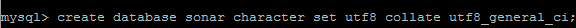

进入解压的 SonarQueb 目录，在系统路径里面配好 path，配置如下：

```
#sonar profile
export
                   SONAR_HOME=/usr/local/sonarqube-5.6.1
export
                   PATH=${SONAR_HOME}/bin:${PATH}

```

Show moreShow more icon

并修改配置文件 sonar.properties，如下：

```
# sonar.jdbc.username=root
#sonar.jdbc.password=root
#sonar.jdbc.url=jdbc:mysql://localhost:3306/sonar?
useUnicode=true&characterEncoding=
utf8&rewriteBatchedStatements=true&useConfigs=maxPerformance
#option properties
sonar.jdbc.driverClassName:com.mysql.jdbc.Driver

```

Show moreShow more icon

基本配置完成，在命令行启动 SonarQube：进入 SonarQube 安装目录，进入 bin 目录，运行 ./sonar.sh start，打开 [http://localhost:9000，如果显示](http://localhost:9000，如果显示) SonarQube 主页， 则 SonarQube 安装成功。如图 2。

###### 图 2\. SonarQube 启动页面

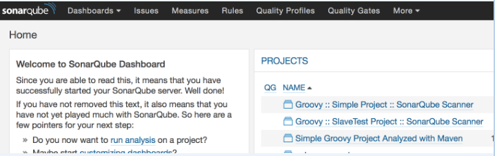

如果需要关闭 SonarQube，则执行 ./sonar.sh stop

如果需要重启 SonarQube，则执行 ./sonar.sh restart

### SonarQube Scanner

下载 Sonar-Scanner-2.6.1，解压到目录(可解压到任意目录)。修改系统路径 path，如下：

```
#sonar-scanner profile
export
                   SONAR_SCANNER_HOME=/usr/local/sonar-scanner-2.6.1
export
                   PATH=${SONAR_SCANNER_HOME}/bin:${PATH}

```

Show moreShow more icon

修改 conf 目录的配置文件 sonar-scanner.properties，具体如下：

```
sonar.jdbc.username=root
sonar.jdbc.password=root
sonar.jdbc.url=jdbc:mysql://localhost:3306/sonar?useUnicode
=true&characterEncoding=utf8&rewriteBatchedStatements=true&
useConfigs=maxPerformance
sonar.sourceEncoding=UTF-8
sonar.login=admin
sonar.password=admin

```

Show moreShow more icon

在命令行中执行 sonar-runner -h 如果显示以下内容，则安装成功。 如图 3。

##### 图 3\. Sonar-Runner

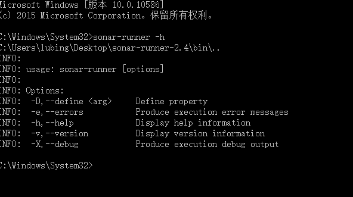

## Jenkins 与 SonarQube 集成插件的安装与配置

Jenkins 是一个支持自动化框架的服务器，我们这里不做详细介绍。Jenkins 提供了相关的插件，使得 SonarQube 可以很容易地集成。登陆 jenkins，点击”系统管理”，如图 4。

##### 图 4\. Jenkins 系统管理

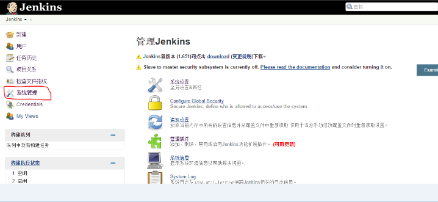

点击管理插件。

##### Jenkins 管理插件

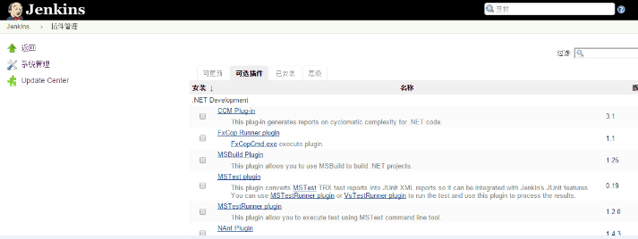

在可选插件中搜索”SonarQube”并安装它，如图 5。

##### 图 5\. Jenkins 安装 SonarQube 插件

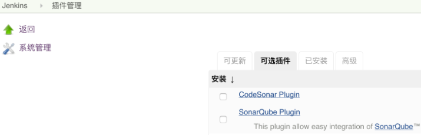

进入 Jenkins 系统管理 – 系统设置，配置 SonarQube Server 信息，如图 6。

##### 图 6\. Jenkis 配置 SonarQube Server

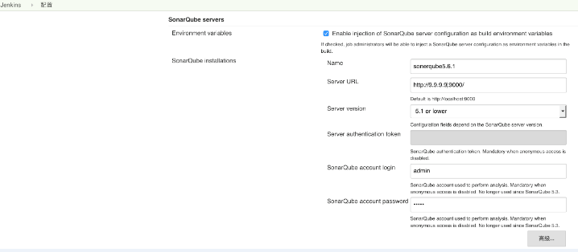

进入 Jenkins 系统管理 – Global Tool Configuration，配置 SonarQube Scanner，如图 7。

##### 图 7\. Jenkis 配置 SonarQube Scanner

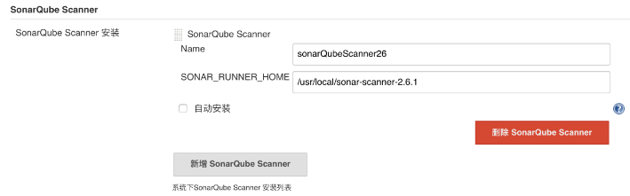

### 新建 Jenkins 项目

登陆 Jenkins 平台，点击新建，如图 8。

##### 图 8\. 新建 Jenkis 项目

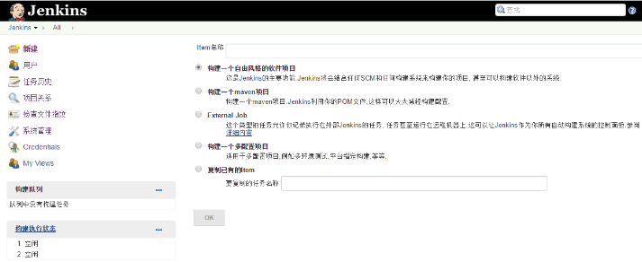

这里有两种方法使用 SonarQube Scanner 进行代码分析，第一种是使用构建后步骤，第二种是在构建的过程中增加 SonarQube Scanner 的步骤，下面我们来分别介绍这两种方法。

### 在 Jenkins 项目中使用构建后步骤进行代码分析

使用构建后步骤进行代码分析需要使用 Maven 对代码进行编译，所以需要有 Maven 的配置文件，例如 pom.xml。

为新建的 Jenkins 项目配置构建后操作步骤，在构建后步骤配置窗口中需要填入 Maven 的构建配置 xml 文件，如图 9、10。

##### 图 9\. 新建构建后操作步骤

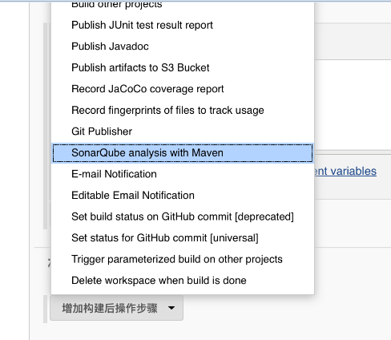

##### 图 10\. 配置构建后操作步骤

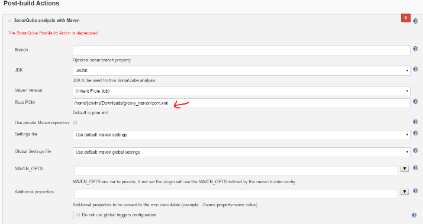

### 在 Jenkins 项目构建过程中加入 SonarScanner 进行代码分析

首先需要在新建的 Jenkins 项目的构建环境标签页中勾选”Prepare SonarQube Scanner evironment”，如图 11。

##### 图 11\. 配置构建后操作步骤

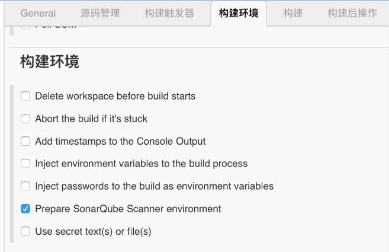

增加构建步骤 “Execute SonarQube Scanner”，如图 12。

##### 图 12\. 增加 Execute SonarQube Scanner 构建步骤

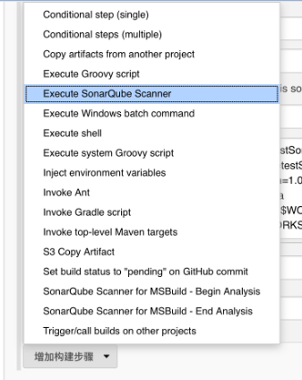

配置 SonarQube Scanner 构建步骤，在 Task to run 输入框中输入 scan，即分析代码；在 JDK 选择框中选择 SonarQube Scanner 使用的 JDK（注意这里必须是 JDK 不能是 JRE）；Path to project properties 是可选择的输入框，这里可以指定一个 sonar-project.properties 文件，如果不指定的话会使用项目默认的 properties 文件；Analysis properties 输入框，这里需要输入一些配置参数用来传递给 SonarQube，这里的参数优先级高于 sonar-project.properties 文件里面的参数，所以可以在这里来配置所有的参数以替代 sonar-project.properties 文件，下面列出了一些参数，sonar.language 指定了要分析的开发语言（特定的开发语言对应了特定的规则），sonar.sources 定义了需要分析的源代码位置（示例中的$WORKSPACE 所指示的是当前 Jenkins 项目的目录），sonar.java.binaries 定义了需要分析代码的编译后 class 文件位置；Additional arguments 输入框中可以输入一些附加的参数，示例中的-X 意思是进入 SonarQube Scanner 的 Debug 模式，这样会输出更多的日志信息；JVM Options 可以输入在执行 SonarQube Scanner 是需要的 JVM 参数。如图 13。

```
sonar.projectKey=testSonar
sonar.projectName=testSonar
sonar.projectVersion=1.0
sonar.language=java
sonar.java.binaries=$WORKSPACE/testSonar/target/test-classes/
sonar.sources=$WORKSPACE/testSonar/src

```

Show moreShow more icon

##### 图 13\. 配置 Execute SonarQube Scanner 构建步骤

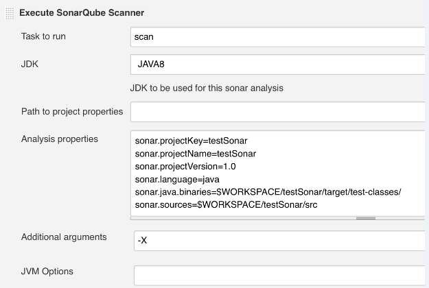

## 查看分析结果

在新建的 Jenkins 项目的构建的 Console Output 中可以得到 SonarQube 分析结果的链接，如图。

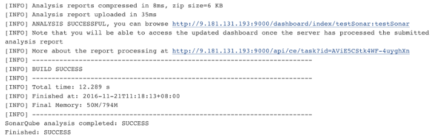

打开构建结果的链接来查看具体的分析报告，如 图 1 2。

##### 图 12\. 分析结果报告

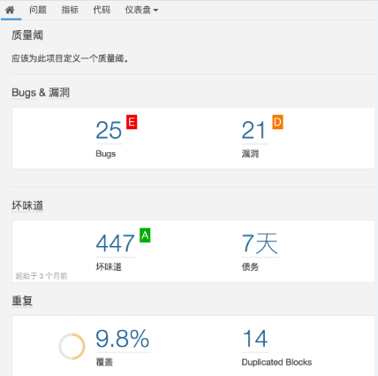

点击质量阈图标以查看具体的问题，如 图 1 3、14。

##### 图 13\. 具体问题展示

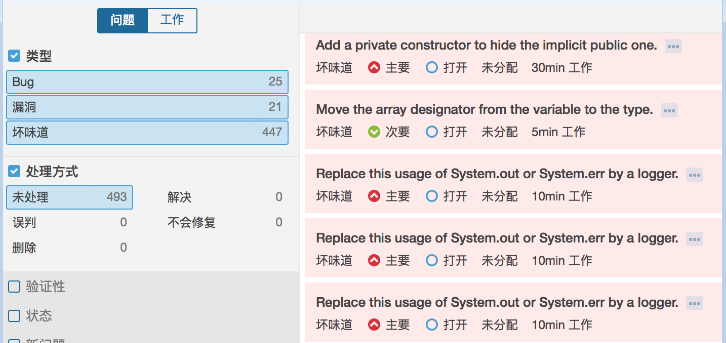

##### 图 14\. 具体问题展示

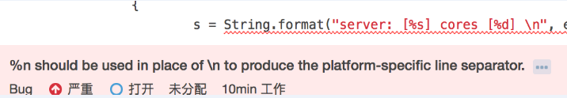

## 参考资源

- [Jenkins 官网](https://jenkins.io)
- [Sonarqube 官网](http://www.sonarqube.org)