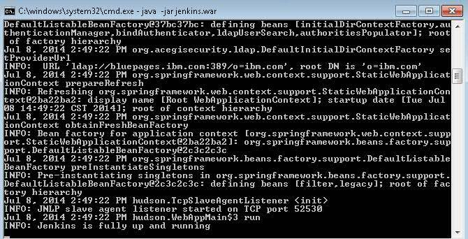
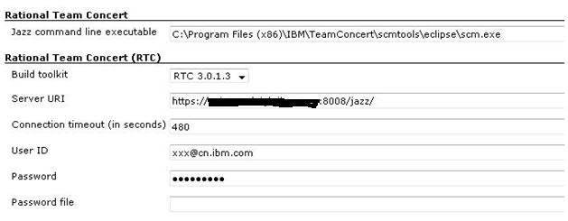
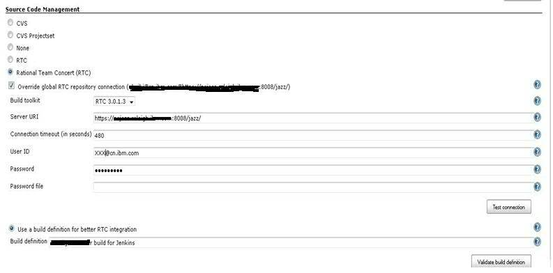
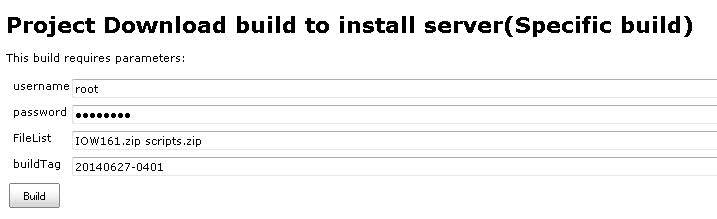
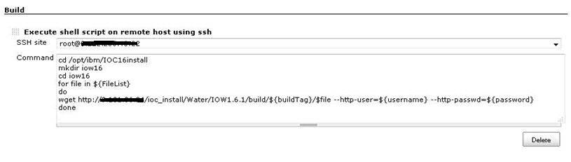
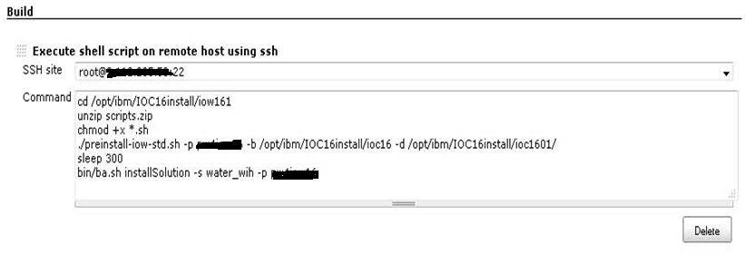
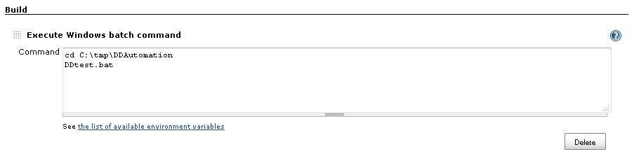

# 使用 Jenkins 实现软件开发的持续集成
用实例演示自动化持续集成的开发步骤

**标签:** Java

[原文链接](https://developer.ibm.com/zh/articles/j-lo-jenkinsintegrate/)

仇慧

发布: 2014-11-10

* * *

## 传统开发流程存在的一些问题

开发团队在日常工作中，主要是围绕着需求、编码、代码提交、打 build、分配环境、安装 build、BVT(Build Verification Test)、发现 defect、修复并提交新代码，然后重复进行打 build 到 BVT 测试的工作，在这个过程中，大部分工作的串连还是需要人工进行操作，且软件开发周期比较漫长。

对于以上存在的问题，分析起来主要有以下几个原因：

首先，传统的开发团队中需要一个专门从事 build 构建的人员，负责整个开发团队的代码集成，并打包成应用程序，再进行 BVT。这个过程非常耗时，重复性高，周期长。因为 build 构建的人员需要等待所有开发人员完成代码的交付后才可以进行这部分的工作，而在实际开发过程中，往往在代码交付前还存在一些问题，不但使得 build 构建的工作需要加班或者延期，且这样等待完成的 build 再拿到测试部门进行测试，开发人员再进行缺陷修复，再到产品交付，整个软件开发周期会耗用更多时间。

其次，每次构建 build 的过程中，虽然构建 build 本身是可以实现代码自动化的，但是在做完 build 后需要上传到一个公共的地址，再分配环境进行安装。安装完成后的 BVT，需要在每次 build 构建后反复的一次次进行，这些过程包含了太多流程重复及人工资源占用。

面对以上存在问题，我们使用 Jenkins 持续集成却可以实现整个流程的自动化，即自动构建 build，上传到指定地址，再下载安装包到指定的环境中进行安装，并进行 BVT 测试。这个流程可以设置每日定时进行，这样就可以加快整个开发过程，使得每个开发人员更好的掌握和控制开发流程。

## Jenkins 是什么？

简单的说，Jenkins 是一种基于 Java 开发的持续集成工具，前身称作Hudson，它是一个开源软件项目，提供了用于监控持续重复工作的软件平台。Jenkins 发布和运行的形式都很简单，您可以去 [Jenkins 官网](http://jenkins-ci.org) 下载安装包后，只需一个 “java -jar jenkins.war” 命令就能将其运行起来。

## Jenkins 持续集成在开发流程中的优势

持续集成开发的流程相对于传统方法有很多不同，在软件开发流程中有很多优势：

第一，快速迭代。

由于 Jenkins 集成开发开发过程中，整个流程能实现自动化，每日可以自行生成新的 build，在软件项目被分成多个子项目后，这些子项目可能是一些独立运行的小项目，也可能是互相联系的。由于每个功能可以一点点的加在 build 中，那么这样就能保证每次的新 build 可以交付新的功能，保障测试人员能一直有最新的 build 进行测试，从而使产品的缺陷能够在更早的时间里被发现，开发人员修复起来也更加容易，甚至可以在修复产品的过程中避免后续可能随之产生的问题，确保产品在整个的开发过程中更加积极、有效。同时，通过快速迭代，开发人员可以对产品的用户和市场趋势保持较强敏感度，且产品也在不断的迭代中愈加成熟，可以使用户持续保持最好体验感；

第二，适应变化。

由于持续集成开发过程中代码是每日集成生成 build, 产品功能是逐步增加的，这样使得开发人员可以积极应对软件需求的多变性。根据用户的需求可以随时增加新的功能而不会对整个项目产生过多的影响，根据用户的反馈情况及时调整开发方向，降低项目风险，保证市场竞争力。这样，通过用户的评价和反馈来更好的完善、适应市场变化而生产出的产品才是最有生命力的产品，Jenkins 持续集成开发流程，无疑给实验室的开发人员提供了不少的见解与帮助；

第三，建立团队信心和提高开发人员的创新能力。

传统的开发流程需要在项目经理的管理下，严格地按照计划进行，长期过程中，这种模式会限制开发成员的创新能力。Jenkins 集成开发可以持续不断的发现问题，测试和验证功能模块的开发程度，增强开发人员对整个开发过程的了解和信心，同时还能快速实现开发人员的创新想法，及时在用户那里得到反馈，并且还可以在迭代的过程中不断优化。这些都可以带给开发人员更多的机会尝试和信心鼓励，对于产品的最终完成起着非常重要的作用。

综上所述，这些优势给整个软件开发团队带来的好处是不可小觑的。那么如何将 Jenkins 自动化持续集成应用到开发流程的实际工作中呢？下面我们通过一个示例来演示具体的操作步骤。

## Jenkins 自动化持续集成开发的步骤

### 安装 Jenkins

关于如何下载并安装的内容在上文介绍 Jenkins 部分已经有交代过，在此不再重复阐述。然而，需要注意的是，在安装前，需要检查机器的 JRE 版本是否在 1.6 或以上，若不是，需要升级或下载新版本后才能保证 Jenkins 的正常运行。

### 启动 Jenkins

通过命令行进入安装包所在的目录，运行 “java – jar jenkins.war” 命令来启动 Jenkins。成功启动后的界面状态如下图所示。

##### 图 1\. Jenkins 成功启动

### 访问 Jenkins

访问 Jenkins 的方式分为两种：第一种是在安装 Jenkins 的机器上访问，即 master 上直接访问，使用的地址为：`http://localhost:8080`；第二种是在其它任何一台机器上远程访问，使用的地址为：`http://IP:8080`，这里的 IP 是指 Jenkins 安装所在的机器 IP 地址。在实际应用中，用户可以根据需要任意选择一种访问方式，而且，多个不同的用户可以同时访问一个共同地址互不干扰地进行自己的操作，可以说 Jenkins 提供的这种访问方式给用户带来了很大的便捷。

### 建立 Jenkins 自动化持续集成项目

建议开发部门可以选用一台固定的物理机或者虚拟机作为安装 Jenkins 的机器，机器需要有连接外网的功能，这样方便下载和更新一些需要使用的插件。

**安装插件**

一般情况下，常使用到如下这些插件：

vSphere Plugin：针对那些使用了 vSphere 虚拟化的基础设施，这个插件提供了实现”云”功能的工具。

SSH Plugin：这个插件使用 SSH 协议执行远程 shell 命令。

RTC Plugin：这个插件集成了 IBM 的 Rational Team Concert(RTC) 与 Hudson。

Team Concert Plugin：集成了 Rational Team Concert。

Multijob Plugin：这个插件是一个将多个项目连接在一起的插件。

**建立项目一：Request Build**

即从统一代码库下载最新代码，自动构建应用程序包，上传到统一的地址。

构建程序包有两种方法，一种是使用 RTC Plugin 和 Team Concert Plugin 来连接开发人员代码所在的统一代码库。我们可以创建一个 Job，选择 Job 类型是 Build a free-style software project，将 Project name 命名为 Request Build，并选择在 master 上执行这个 Job。采取这种方式的时候，需要在 Job 进行配置之前，进入 Configure System 配置系统信息，如下图所示：

##### 图 2\. 系统配置中 RTC 的信息

系统信息配置完成后，再对 Request Build Job 进行设置。Source Code Management 配置的信息如下图所示：

##### 图 3\. 项目 Request Build 中 Source Code Management 的配置

这种方式中的代码资源管理是通过开发人员使用自己的账户连接到 RTC，从 RTC 抓取最新代码到 master 上的 Jenkins 目录中，Jenkins 会创建一个 workspace 来存放这些代码。

接下来，再将抓取的代码在 master 上自动构建成应用程序包，需要使用到 build XML 文件和相关的属性信息。然后，继续在 Request Build Job 的 Build 选项中进行设置，如下图所示：

##### 图 4\. 项目 Request Build 中 Ant 相关的配置

上图中设置的 Properties 信息只是一个示例，读者需要根据 build 过程中使用的具体值来进行修改。

到这里，项目一设置完成，保存后点击 Build now 按钮就可以 kick off Build 了。至此，我们讲的都是采用第一种方式来完成项目一的任务。然而对于第二种方式，简单来说，就是将 Jenkins 代码管理的工作用命令来实现，这涉及到构建程序包的开发人员的工作内容，不是本文的重点，故而不详细叙述如何来写这样的命令，读者有兴趣可以自行研究。

由于第二种是利用已经完成的，包含着能实现代码管理和构建程序包命令的文件来实现自动下载代码和构建程序包的工作，所以先假设这个文件名为 requestBuild.bat 或者 requestBuild.sh。同样，我们在 Jenkins 上创建一个叫 Request Build 的 Job，选择在 master 上执行任务的话，本文中的 master 是 windows 机器，所以文件为 requestBuild.bat。在 Build 选项中选择 Execute Windows batch command，填入执行 requestBuild.bat 的 bat command，保存 Job 后点击 Build now 就可以进行代码下载和构建程序包的过程了。

这样项目一的任务就完成了。读到这儿您可能会有疑问，打好的安装包是怎么上传到特定的地址呢？关于这个问题，是 kick off Build 的内容，在 build XML 文件和图 4 Properties 中有设置。

**建立项目二：Download build to install server(Specific build)&Install build**

即 download Build 到需要安装的环境上，自动安装软件。

这个任务分为两个 Job 来实现，第一个 Job 命名为 Download build to install server(Specific build)，主要是从上文中提到的特定地址下载需要的文件到安装环境上。同样，这里指定这个 Job 在 master 上执行。为了提升下载过程中的灵活性，可以给 Job 设置 build with Parameters，这样在执行这个 Job 的时候能选择下载哪些内容。如下图所示：

##### 图 5\. 项目 Download build to install server(Specific build) 的参数配置

上图中设置的信息，例如，FileList 是需要下载的文件的文件名称，buildTag 是下载的 build version。这些是使用 String Parameters。Password 是使用 Password Parameters。

除了设置参数以外，Job 的内容是为了实现下载 Build 到指定的安装环境中。在 Build 选项中点击 Add build step 选择 Execute shell script on remote host using ssh，在 SSH site 中填写的机器上执行 Command 中的命令，将 build 下载到 install server 这台 Linux 机器的环境上。下图列出了如何配置的信息：

##### 图 6\. 项目 Download build to install server(Specific build) 的 Command 配置

完成配置后保存，点击 build with Parameters，填上需要下载 build 的版本和文件名，就可以将 build 下载到 install Server 这套环境上。

然后，下载完成后要进行安装的操作，这时候，需要建立第二个 Job，命名为 Install build，也是在 master 上执行这个任务。这个 Job 通过 Command 中添加安装的 shell 命令来执行自动安装的过程。如下面图 7 给出了详细的信息。

##### 图 7\. 项目 Install build 的 Command 配置

运行这个 Jenkins Job 的时候，还可以在 Job 的 Console Output 中查看运行日志，监控软件安装的状态。这样，就实现了软件安装的过程了。

在两个 Job 按顺序执行完成后，下一步需要做的是对安装好的软件进行 BVT 测试。

**建立项目三：Run BVT Automation case**

即调用批处理文件，自动进行 BVT 测试。

创建一个 Job，project name 命名为 Run BVT Automation case。本文例子中的测试机的类型是 windows 机器，于是选择 Add build step 中的 Execute Windows batch command 选项，通过在测试机器上运行 bat 命令来实现测试用例的运行。配置信息很简单，如下图所示：

##### 图 8\. 项目 Run BVT Automation case 的 Windows command 配置

在这里需要注意的是，仍然要选择执行 Job 的位置是在 master 上还是 slave 上。如果测试用例的代码不在 master 上，可以选择测试机器作为 Jenkins 的 slave 节点。在 Manage Jenkins 选项中点击 Manage nodes 来创建 slave 节点，命名为 Test\_node，创建完成后便可以在 Run BVT Automation case Job 中选择执行的地方是 Test\_node 的 slave 节点。

配置信息完成后，保存并运行 Job，Jenkins 就会通过上图中的 DDtest.bat 来运行测试用例。同理，为了追踪测试用例执行的情况，可以从 Job 的 Console Output 中查看运行日志。当然，这个任务是否能够顺利执行，还需要提前准备好测试代码。本例中的测试代码是一个独立的 Java 工程，bat 文件可以在测试机器上手工运行，进行 BVT 测试。Jenkins 只是将这个手工操作包装了一下。

在上述三个项目完成后，我们会思考怎么将这几个流程串连起来呢？

### 如何将不同的项目联系起来？

文章前面提到的 Multijob Plugin 插件就是来解决这个问题的，安装 Multijob Plugin 插件后，就可以建立 Multijob Project。这里建立一个名为 Jenkins automation for development 的项目，并选择在 master 上执行这个 project，在 project 中配置需要串连起来的 Job 名称，在运行这个 project 的时候，就会顺序地将几个不同的 Job 一个个执行起来。

### 做点锦上添花的事情

在整个 Jenkins 持续集成的自动化流程中，仍然有很多需要改进的地方，笔者也在不停探索，先列出下面几点以供参考：

- 设置 Email Notification

使用 MultiJob Project 后，Jenkins 就可以自动运行整个流程，那么如果能够在执行结束后自动给用户发一个通知的信息就再好不过了。这就需要在 Jenkins E-mail Notification 中配置，Reply-To Address 中填上收件人的邮箱，Charset 的内容为 UTF-8，并通过 Test configuration 按钮来测试是否成功发送到邮箱。

- 准备环境

在开发和测试过程中都需要准备环境，我们可以通过使用 Jenkins 的 vSphere Plugin 来实现虚拟机环境的回滚，不过，这里仍然需要在 VMware 查看 Snapshot Name。首先需要在系统配置中设置 vSphere Cloud 的信息。例如，vSphere Host、为这个 vSphere Cloud 命名、登陆的用户名、密码等。然后，再创建准备环境的 Job，在 Build 中设置 vSphere Build Step 各个选项中的值。其中，Server 信息就是刚刚 vSphere Cloud 的名称，vSphere Action 是回滚环境的话就选择 Revert to Snapshot，Snapshot Name 可以从 VMware 中获得。这些关键信息完成后，运行 Job 就可以为安装 build 和测试提供可执行的环境了。

- 参数的使用

这里的参数和平常说到的变量很类似，也有局部和全局的概念。全局的意思即在系统配置中可以设置 Global Choice Parameter，而在具体 Job 中设置的 Parameter 应用范围只在当前 Job 中。参数的种类也有很多，在这里便不再阐述，读者可以在实际使用中视情况选择。

## 结束语

Jenkins 持续集成给开发团队带来了很多便利，在这里我们只是初步的总结，为了让 Jenkins 持续集成的功能更加完善，还需要不停的实践和探索。希望通过本文的介绍让更多的软件开发人员和测试团队了解持续集成的平台所带来的好处。在当今软件产业迅速发展的趋势下，软件开发团队也正在经历着相应的发展和改变，作为程序员的我们，不仅要开发出一个个新的软件，也要利用已经存在的软件工具来提高我们的工作效率，从容应对瞬息万变的市场。