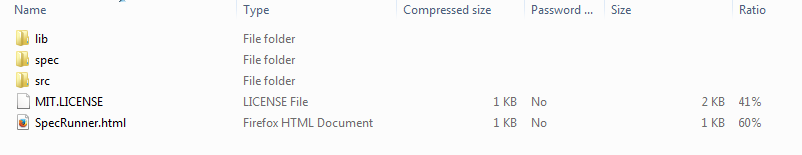
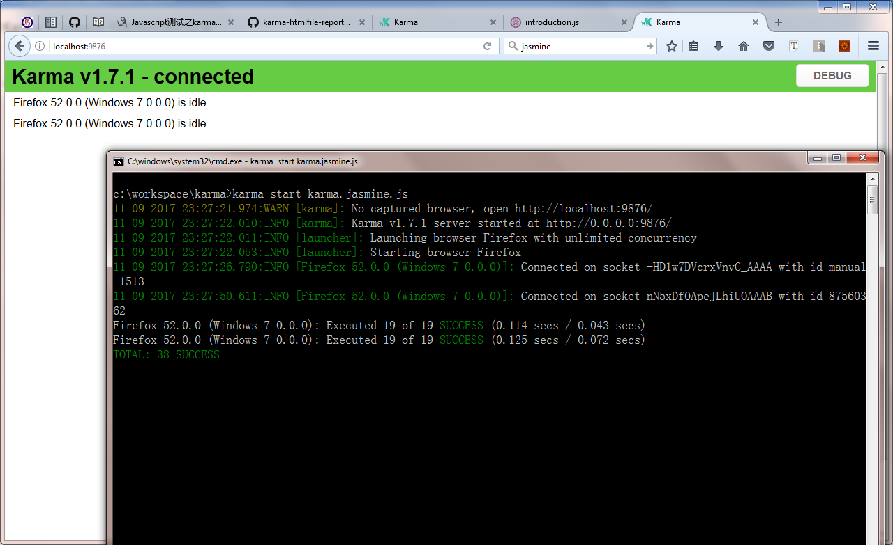

# 使用 Karma + Jasmine 构建 Web 测试环境
如何简单、快速的构建 Web 测试环境

**标签:** DevOps,Web 开发

[原文链接](https://developer.ibm.com/zh/articles/wa-lo-use-karma-jasmine-build-test-environment/)

刘刚

发布: 2017-11-07

* * *

## 简介

现在，越来越多的 Web 框架涌现了出来，令人眼花缭乱。随着浏览器的不断演化，一些前端框架开始尝试将服务器端的功能与技术在浏览器端实现，比如 AngularJS，ExtJS 这样的 MVC 框架等等。随着前端代码的复杂性越来越高，以及代码量的突然陡增，如何来保证代码的正确性？如何在 Web 端编写并运行测试用例？ Jasmine 测试框架的出现，无疑缓解了开发者们的忧虑。

然而，Web 的开发总是有它的特殊性。例如，页面往往需要运行在多种设备（桌面，移动，掌上等）之上，那么如何在这些设备上测试代码呢？Karma 测试平台，就是来提供这样的解决方案的。

作为程序员，不光要能够编写测试用例，还需要了解如何运行它们。本文围绕着上面提出的这些问题，向大家介绍这两款优秀的测试框架与运行平台。

## Jasmine 简介

### Jasmine 框架介绍

Jasmine是一个针对 JavaScript 的行为驱动开发的测试框架，不依赖于任何其他的 JavaScript 框架或者文档对象模型（DOM），最新版本改进了对 Node.js 的支持，同时还做了一些提升内部质量的工作。

##### 图 1\. Jasmine 框架


它的主要特点：

- 不依赖于任何其它的 JavaScript 框架
- 不需要 DOM
- 结构简单
- 可以运行在 Node.JS 或者 Html 中
- 基于行为驱动开发 Jasmine

项目 [Git 仓库地址](http://jasmine.github.io/)

**获取安装包**

可以在开源社区网站下载最新的 Jasmine 安装包, 目前的 Standalone 的最新版本是 2.8.0. [下载地址](https://github.com/jasmine/jasmine/releases)

也可以使用 npm 命令安装（需要先安装 Node.JS）

npm install –save-dev jasmine

**配置安装**

将下载后的.zip 文件包解压缩，如下的目录结构：

##### 图 2\. 目录结构



**目录结构**

其中 lib 文件夹中包含 Jasmine 的源代码。SpecRunner.html 是 Jasmine 的一个完整示例，用浏览器打开 SpecRunner.html，即可看到执行的结果。

### Jasmine 的基本概念

**Suites & Specs**

Suites 用来表示测试集的概念，它由很多的测试用例构成。Specs 就是组成它的具体的测试用例，每一个 Spec 就是一个测试用例，用于测试应用中的某个功能。

- Jasmine 使用全局函数 describe 来描述测试集（ Suites ）。通常来说它有 2 个参数：字符串和方法。字符串就是特定测试集（ Suite ）的名字或者标题，而方法是实现 Suite 的具体代码。

- Jasmine 使用全局函数it 来描述测试用例（Specs）。和 describe 类似，it 也有 2 个参数：字符串和方法。字符串是对特定测试用例（Spec）的描述，而方法是具体的测试代码。


**Expectations**

Jasmine 使用断言（Expectation）的方式来执行测试结果，每个 expectation 可以是 true 或者 false。如果 it 方法中的所有测试结果都是 true，则通过测试。反之，有任何一个断言是 false，则测试失败。

Expectations 由方法 expect 来定义，它的参数是一个具体的值，这个值被称为实际值。同时，在 expect 方法后需要跟某个匹配方法（Matcher），而匹配方法中的值称为期望值。

**Matchers**

每个 Matcher 的返回结果是一个布尔值，它的作用就是在实际值和期望值之间作比较。同时它负责通知 Jasmine，此次 expectation 的执行结果。Jasmine 会裁定相应的测试用例是通过还是失败。任何的 Matcher 在调用方法之前，都可以使用 not 来”装饰”，从而改变匹配结果。

**Setup and Teardown**

为了使每一个测试用例，都可以重复的执行 setup 与 teardown 代码，Jasmine 提供了全局的 beforeEach 和 afterEach 方法。beforeEach 方法会在每一个测试用例执行前运行，而 afterEach 方法在每个测试用例执行后被调用。

如果在测试用例中使用到多个相同的变量，我们可以在全局的 describe 代码块中定义这些变量，而将变量的初始化代码放在 beforeEach 方法里，并在 afterEach 方法中重置这些变量的值。

**嵌套的 describe**

Jasmine 支持 describe 嵌套。很显然，这个时候的测试集呈现树状组织结构。而 Jasmine 执行时会遍历树状结构，按顺序执行每个 beforeEach 方法，it方法，以及对应的 afterEach 方法。

**跳过测试代码块**

Suites 和 Specs 分别可以用 xdescribe 和 xit 方法来禁用。运行时，这些 Suites 和 Specs 会被跳过，也不会在结果中出现。

### 使用 Jasmine 编写测试用例

下面，我们从一个实际的需求出发，学习如何使用这些方法来编写测试用例。

在开始之前，我们需要先定义应用模型（Model），模型的作用除了定义数据结构，也定义了测试用例的范围。也可以说，这些测试用例其实就是围绕着这些模型展开的。

##### 清单 1\. Mode.js

```
function Student(id, name){
    this.id = id;
    this.name = name;
    this.age = -1;
    this.teacher = null;
}
function Teacher(id, name){
    this.id = id;
    this.name = name;
    this.age = -1;
}
function SchoolService(){
    this.getTeachers = function(){
        var teachers = [];
        for(var i=0;i<5;i++){
            var teacher = new Teacher();
            teacher.id = "01" + i;
            teacher.name = "teacher" + i;
            teachers.push(teacher);
        }
        return teachers;
    }
    this.getStudents = function(){
        var students = [];
        for(var i=0;i<10;i++){
            var student = new Student();
            student.id = "00" + i;
            student.name = "student" + i;
            var teacher = new Teacher();
            var tId = Math.ceil(i/2);
            teacher.id = "01" + tId;
            teacher.name = "teacher" + tId;
            student.teacher = teacher;
            students.push(student);
        }
        return students;
    }
    this.getTeacher = function(tId){
        var r = null;
        var teachers = this.getTeachers();
        for(var i=0;i<teachers.length;i++){
            var teacher = teachers[i];
            if(teacher.id == tId){
                r = teacher;
                break;
            }
        }
        return r;
    }
    this.getStudent = function(sId){
        var r = null;
        var students = this.getStudents();
        for(var i=0;i<students.length;i++){
            var student = students[i];
            if(student.id == sId){
                r = student;
                break;
            }
        }
        return r;
    }
    this.getStudents = function(tId){
        var r = [];
        var students = this.getStudents();
        for(var i=0;i<students.length;i++){
            var student = students[i];
            if(student.teacher && student.teacher.id == tId){
                r.push(student);
            }
        }
        return r;
    }
}

```

Show moreShow more icon

这里，我们分别定义了 Teacher 与 Student 类，以及对外提供的 SchoolService 类。不难看出 SchoolService 类就是我们需要重点测试的对象。下面，我们来编写测试用例

首先，我们需要测试 getTeachers() 方法

##### 清单 2\. 测试 getTeachers 方法

```
describe("A test suite for SchoolService", function() {
    var schoolService = new SchoolService();
    it("Spec test 1, test the getTeachers function", function() {
        var teachers = schoolService.getTeachers();
        expect(teachers).not.toBe(null);
        expect(teachers.length).toEqual(5);
    });
    it("Spec test 2: test the getStudents function", function() {
        var students = schoolService.getStudents();
        expect(students).not.toBe(null);
        expect(students.length).toEqual(10);
    });
});

```

Show moreShow more icon

接下来，使用较为复杂的 Matchers 测试 getTeacher() 方法

##### 清单 3\. 测试 getTeacher() 方法

```
describe("A test suite for SchoolService", function() {
    var schoolService = new SchoolService();
    it("Spec test 1, test the getTeachers function", function() {
        var teachers = schoolService.getTeachers();
        expect(teachers).not.toBe(null);
        expect(teachers.length).toEqual(5);
    });
    it("Spec test 2: test the getStudents function", function() {
        var students = schoolService.getStudents();
        expect(students).not.toBe(null);
        expect(students.length).toEqual(10);
    });
    it("Spec test 3: test the getTeacher function", function() {
        var teacher = schoolService.getTeacher("011");
        expect(teacher).not.toBe(null);
        expect(teacher.name).toMatch(/teacher/);
        expect(teacher.name).toMatch("teacher");
        expect(teacher.name).not.toMatch(/people/);
        var teacher6 = schoolService.getTeacher("016");
        expect(teacher6).toBe(null);
    });
});

```

Show moreShow more icon

这时，我们发现每个方法内 teachers 与 students 对象总是重复的出现。因此我们考虑使用 beforeEach / afterEach 方法来优化测试代码

##### 清单 4\. 使用 beforeEach / afterEach 方法

```
describe("A test suite for SchoolService", function() {
    var schoolService = new SchoolService();
    var teachers = [];
    var students = [];
    beforeEach(function() {
        teachers = schoolService.getTeachers();
        students = schoolService.getStudents();
    });
    it("Spec test 1, test the getTeachers function", function() {
        expect(teachers).not.toBe(null);
        expect(teachers.length).toEqual(5);
    });
    it("Spec test 2: test the getStudents function", function() {
        expect(students).not.toBe(null);
        expect(students.length).toEqual(10);
    });
    it("Spec test 3: test the getTeacher function", function() {
        var teacher = schoolService.getTeacher("011");
        expect(teacher).not.toBe(null);
        expect(teacher.name).toMatch(/teacher/);
        expect(teacher.name).toMatch("teacher");
        expect(teacher.name).not.toMatch(/people/);
        var teacher6 = schoolService.getTeacher("016");
        expect(teacher6).toBe(null);
    });
    afterEach(function() {
        teachers = [];
        students = [];
    });
});

```

Show moreShow more icon

更进一步，如果能够将测试用例中的 Teacher 部分与 Student 分开，代码的逻辑就会显得更加整齐，于是，我们想到了使用嵌套测试

##### 清单 5\. 使用嵌套测试

```
describe("A test suite for SchoolService", function() {
    //上面的代码与清单4相同
    describe("A nested test suite", function() {
        it("Spec test 4: test the getStudent function", function() {
            var student10 = schoolService.getStudent("0010");
            expect(student10).toBe(null);
            var student9 = schoolService.getStudent("009");
            var teacher = student9.teacher;
            expect(teacher).toBeDefined();
        });
        it("Spec test 5: test the getStudentsByTeacher function", function() {
            var students = schoolService.getStudentsByTeacher("014");
            expect(students).not.toBe(null);
            expect(students.length).toEqual(2);
            var idArray = [];
            idArray.push(students[0].id);
            idArray.push(students[1].id);
            expect(idArray).toContain("007", "008");
        });
    });
});

```

Show moreShow more icon

而且，一旦不再需要测试 Student 部分，我们只需要将 describe 更改成 xdescribe 即可。这个时候，Jasmine 在运行时就会忽略这部分的测试代码。（如果希望忽略 it 方法，则需要将它改成 xit）

### Jasmine 中的高级用法 – Spies

Jasmine 还为我们提供了一些其他的方法，用于函数的元数据测试，Timeout 测试，异步调用测试等等。不过，这些方法属于 Jasmine 的高级用法，本文并不打算将它们一一列举。而是将重点放在了最有特点的 Spies 上，至于其他方法大家可以参看 [Jasmine 官方网站](https://jasmine.github.io/edge/introduction) 。

Spy 用于模拟函数的调用，并且记录被调用的次数以及传递的参数，我们将这样的测试称为函数的元数据测试。例如：

##### 清单 6\. Jasmine 中的 Spies

```
describe("A test suite for Spies", function() {
    var schoolService = new SchoolService();
    var teachers = null;
    beforeEach(function() {
        spyOn(schoolService, "getTeachers");
        teachers = schoolService.getTeachers();
    });
    it("Spec test 1, tracks that the spy was called", function() {
        expect(schoolService.getTeachers).toHaveBeenCalledTimes(1);
        expect(schoolService.getTeachers).toHaveBeenCalled();
    });
    it("Spec test 2, tracks that the spy was called x times", function() {
        teachers = schoolService.getTeachers();
        expect(schoolService.getTeachers).toHaveBeenCalledTimes(2);
    });
    it("Spec test 3, tracks all the arguments of its calls", function() {
        expect(schoolService.getTeachers).toHaveBeenCalledWith() ;
    });
    it("Spec test4, stops all execution on a function", function() {
        expect(teachers).not.toBeDefined();
    });
});

```

Show moreShow more icon

##### 清单 7\. 使用 Spies 模拟返回值

```
describe("A test suite for Spies", function() {
    var schoolService = new SchoolService();
    var teachers = null;
    beforeEach(function() {
        spyOn(schoolService, "getTeachers").and.returnValue({id: "016", name: "teacher6"});;
        teachers = schoolService.getTeachers();
    });
    it("Spec test 5, when called returns the requested value", function() {
        expect(schoolService.getTeachers).toHaveBeenCalledTimes(1);
        expect(teachers).toBeDefined();
        expect(teachers.id).toEqual("016");
    });
});

```

Show moreShow more icon

Jasmine 是用 JavaScript 实现的，所以它也必须在 JavaScript 的环境中运行，最简单的环境也就是一个 Web 页面。所有的 spec 都可以在这个页面中运行，这个页面就叫做 Runner。

##### 清单 8\. 运行Jasmine

```
<!DOCTYPE html>
<html>
<head>
<meta charset="utf-8">
<title>Jasmine Spec Runner v2.8.0</title>
<link rel="shortcut icon" type="image/png"
        href="lib/jasmine-2.8.0/jasmine_favicon.png">
<link rel="stylesheet" href="lib/jasmine-2.8.0/jasmine.css">
<script src="lib/jasmine-2.8.0/jasmine.js"></script>
<script src="lib/jasmine-2.8.0/jasmine-html.js"></script>
<script src="lib/jasmine-2.8.0/boot.js"></script>
<!-- include source files here... -->
<script src="src/model.js"></script>
<!-- include spec files here... -->
<script src="spec/spec-test.js"></script>
</head>
<body>
</body>
</html>

```

Show moreShow more icon

其中 boot.js 文件，用于初始化 Jasmine 环境。

## Karma 简介

### Karma 框架介绍

Karma 是一个基于 Node.js 的 JavaScript 测试执行过程管理工具（Test Runner）。该工具可用于测试所有主流 Web 浏览器，也可以集成到 CI（Continuous integration）工具，还可以和其他代码编辑器一起使用。

Karma 会监控配置文件中所指定的每一个文件，每当文件发生改变，它都会向测试服务器发送信号，来通知所有的浏览器再次运行测试代码。此时，浏览器会重新加载源文件，并执行测试代码。其结果会传递回服务器，并以某种形式显示给开发者。

访问浏览器执行结果，可通过以下的方式

- 手工方式 – 通过浏览器，访问 URL 地址：`http://localhost:9876/`
- 自动方式 – 让 karma 来启动对应的浏览器

**安装 Karma**

第一步：安装 Node.js

安装相应版本的 Node.js，并却保 Node Package Manager(NPM) 可以正常运行（默认情况下，NPM 随 Node.js 一起安装）。

通过执行 node –version 命令，检查 Node.js 是否安装成功，以及运行 npm version 命令，察看 NPM 是否运行正常。

第二步：安装 Karma

1. 全局安装

命令 `$npm install -g karma`

安装 Karma 命令会到全局的 node\_modules 目录下，我们可以在任何位置直接运行 karma 命令。

`npm install -g karma-cli`

此命令用来安装 karma-cli，它会在当前目录下寻找 karma 的可执行文件。这样我们就可以在一个系统内运行多个版本的 Karma。

1. 本地安装

命令 $npm install karma –save-dev

安装 Karma 命令到当前 node\_modules 目录下，此时，如果需要执行 karma 命令，就需要这样 $ ./node\_modules/.bin/karma

**安装 plugins**

访问 [Karma 官网关于 plugins 部分](https://npmjs.org/browse/keyword/karma-plugin) ，这里有众多的 Karma 插件可以选择安装。下面是一些常用的插件

- karma-chrome-launcher
- karma-coverage
- karma–jasmine
- karma–firefox-launcher
- karma-ie-launcher

### Karma 的配置

**基本配置**

命令 $ karma init karma.conf.js

执行命令后，会被问到一系列的问题

- What testing framework do you want to use?
    默认情况下 Jasmine, Mocha, QUnit 都已经被安装了，这里我们可以直接使用它们的名称。如果在应用中用到了其它的测试框架，那就需要我们安装它们所对应的插件，并在配置文件中标注它们（详见 karma.conf.js 中的 plugins 项）

- Do you want to use Require.js?
    [Require.js](http://www.requirejs.org/) 是异步加载规范（AMD）的实现。常被作为基础代码库，应用在了很多的项目与框架之中，例如 Dojo, AngularJs 等、

- Do you want to capture a browser automatically?
    选择需要运行测试用例的浏览器。需要注意的就是，必须保证所对应的浏览器插件已经安装成功。

- What is the location of your source and test files?
    选择测试用例所在的目录位置。Karma 支持通配符的方式配置文件或目录，例如 `*.js, test/**/*.js` 等。如果目录或文件使用相对位置，要清楚地是，此时的路径是相对于当前运行 karma 命令时所在的目录。

- Should any of the files included by the previous patterns be excluded?
    目录中不包括的那些文件。

- Do you want Karma to watch all the files and run tests on change?
    是否需要 Karma 自动监听文件？并且文件一旦被修改，就重新运行测试用例？


最终 Karma 生成如下的配置文件（karma.conf.js），如下

##### 清单 10\. karma.conf.js

```
module.exports = function(config) {
    config.set({
        // base path, that will be used to resolve files and exclude
        basePath: '../..',
        frameworks: ['jasmine'],
        // list of files / patterns to load in the browser
        files: ['test/client/mocks.js', 'static/karma.src.js', 'test/client/*.spec.js'],
        // list of files to exclude
        exclude: [],
        // use dots reporter, as travis terminal does not support escaping sequences
        // possible values: 'dots', 'progress'
        reporters: ['progress', 'junit'],
        // will be resolved to basePath (in the same way as files/exclude patterns)
        junitReporter: {outputFile: 'test-results.xml'},
        // web server port
        port: 9876,
        // enable / disable colors in the output (reporters and logs)
        colors: true,
        // level of logging
        // possible values: config.LOG_DISABLE || config.LOG_ERROR
        //|| config.LOG_WARN || config.LOG_INFO || config.LOG_DEBUG
        logLevel: config.LOG_INFO,
        // enable / disable watching file and executing tests whenever any file changes
        autoWatch: true,
        // Start these browsers, currently available:
        // - Chrome, ChromeCanary, Firefox, Opera, Safari (only Mac), PhantomJS,
        //IE (only Windows)
        browsers: [process.env.TRAVIS ? 'Firefox' : 'Chrome'],
        // If browser does not capture in given timeout [ms], kill it
        captureTimeout: 20000,
        // Auto run tests on start (when browsers are captured) and exit
        singleRun: false,
        // report which specs are slower than 500ms
        reportSlowerThan: 500,
        // compile coffee scripts
        preprocessors: {'**/*.coffee': 'coffee'},
        plugins: [
        'karma-jasmine',
        'karma-chrome-launcher',
        'karma-firefox-launcher',
        'karma-junit-reporter'
        ]
    });
};

```

Show moreShow more icon

**配置项详解**

配置文件的作用就是让 Karma 了解项目的结构，通过 karma init 这样的命令只是生成了基本的配置文件。但还有一些配置项也是需要注意的

Karma 的配置文件支持使用 JavaScript, CoffeeScript 或者 TypeScript 语言来编写。如果没有在执行 karma 命令时指定对应的配置文件，那么它会按照下面的顺序依次去寻找并加载配置文件

- `./karma.conf.js`
- `./karma.conf.coffee`
- `./karma.conf.ts`
- `./.config/karma.conf.js`
- `./.config/karma.conf.coffee`
- `./.config/karma.conf.ts`

其实编写配置文件，与编写 Node.js 的模块并没有什么区别。

##### 清单 11\. karma.conf.js

```
module.exports = function(config) {
    config.set({
        basePath: '../..',
        frameworks: ['jasmine'],
        //...
    });
};

```

Show moreShow more icon

除了上面的这些基本的配置外，如果需要对 Karma 环境进行自定义配置，例如显示测试的覆盖率等等，还需要了解 karma 的一些配置项的详细使用方法，例如 preprocessors, plugins, browsers, files。

**Files – 文件项**

Karma 使用 minimatch 库来匹配文件。由于 minimatch 本身以方便灵活而著称，同时它的文件表达式又非常的简洁。在配置文件中，下面的这几个部分都会用到这种表达式

- exclude
- files
- preprocessors

例如

- `**/*.js`: 表示在所有的子目录内，以”js”为后缀的那些文件
- `**/!(jquery).js`: 和上面的含义相同，但不包括”jquery.js”文件
- `**/(foo|bar).js`: 表示在所有子目录内，以”foo.js”或者”bar.js”为名称的那些文件

详细的配置项可以参看 [Karma 官网关于 file 部分](http://karma-runner.github.io/1.0/config/configuration-file.html)

我们以 files 配置项为例，来详细的了解文件匹配的具体用法

**files**

使用 files 选项，用于告诉 Karma 哪些文件会被项目使用，而哪些文件含有测试用例，以及需要测试。值得注意的是，文件配置的顺序就是浏览器引用它们时的顺序。

**匹配模式**

- 所有的相对位置，都是针对 basePath 而言的.
- basePath 也可以使用相对位置定义，此时它是相对于配置文件所在的位置
- Karma 使用 globa 库来解决文件的位置问题。它支持使用 minimatch 表达式，例如 test/unit/ _\*/_.spec.js.

**匹配顺序**

- 模式的顺序决定了文件包含在浏览器中的顺序
- 如果多个文件被匹配到，文件按照按字母顺序排序
- 每个文件都包含一次。如果多个模式匹配同一个文件，则文件包含在第一个匹配到的模式中

**完整的式例**

##### 清单 12\. files

```
files: [
    // Detailed pattern to include a file. Similarly other options can be used
    {
        pattern: 'lib/angular.js',
        watched: false
    },
    // Prefer to have watched false for library files. No need to watch them for changes
    // simple pattern to load the needed testfiles
    // equal to {pattern: 'test/unit/*.spec.js',
    //watched: true, served: true, included: true}
    'test/unit/*.spec.js',
    // this file gets served but will be ignored by the watcher
    // note if html2js preprocessor is active, reference as
    //`window.__html__['compiled/index.html']`
    {
        pattern: 'compiled/index.html',
        watched: false
    },
    // this file only gets watched and is otherwise ignored
    {
        pattern: 'app/index.html',
        included: false,
        served: false
    },
    // this file will be served on demand from disk and will be ignored by the watcher
    {
        pattern: 'compiled/app.js.map',
        included: false,
        served: true,
        watched: false,
        nocache:true
    }
],

```

Show moreShow more icon

详细解释，请参看 [Karma 官网关于 included, watched, served 的解释](http://karma-runner.github.io/1.0/config/files.html)

**Browsers – 浏览器配置**

捕获浏览器的行为总是令人感到很沮丧的，无疑这样的工作会耗费大量的开发时间。然而如果使用 Karma，这一切都会变得异常简单。原因是，Karma 都帮你自动完成了！

配置浏览器，我们只需要在配置文件中正确的设置 browsers 项（例如 browsers: [‘Chrome’]），Karma 后管理这些浏览器，包括启动与关闭它们。

Karma 支持的浏览器

- Chrome and Chrome Canary
- Firefox
- Safari
- PhantomJS
- JSDOM
- Opera
- Internet Explorer
- SauceLabs
- BrowserStack
- many more

我们以 Firefox 浏览器为例，首先你需要安装相应的插件

```
# Install the launcher first with NPM:
$ npm install karma-firefox-launcher --save-dev

```

Show moreShow more icon

接下在，在配置文件中加入新支持的浏览器名称

##### 清单 13\. browsers

```
module.exports = function(config) {
    config.set({
        browsers : ['Chrome', 'Firefox']
    });
};

```

Show moreShow more icon

默认情况下，在配置文件中 browsers 项是没有被配置的（也就是说它的值是空）

当然，如果你希望使用其他的设备（如 tablet，手机等）来测试的话，只需在设备中打开对应的的浏览器，并访问 `http://<hostname>:<port>` (默认端口9876)。

另外，可以通过设置\_BIN 环境变量来替换浏览器路径。例如，在 Linux 下修改 Firefox 浏览器路径

```
# Changing the path to the Firefox binary
$ export FIREFOX_BIN=/usr/local/bin/my-firefox-build

```

Show moreShow more icon

详细解释，请参看 [Karma 官网关于浏览器选项的详细配置](http://karma-runner.github.io/1.0/config/browsers.html)

**Preprocessors 配置**

Preprocessors 定义的方法，会在文件被浏览器运行前执行（有点类似 AOP（Aspect-Oriented Programming）的概念）。

Preprocessors 的配置方法如下：

##### 清单 14\. preprocessors

```
preprocessors: {
    '**/*.coffee': ['coffee'],
    '**/*.tea': ['coffee'],
    '**/*.html': ['html2js']
},

```

Show moreShow more icon

注意：

在这里，有多个文件表达式都配置了 “coffee” 这个 processor。在 Karma 看来，processor 与表达式的关系，有点类似于数据库里的一对多的关系。也就是说，一个 processor 可以被用于多个文件表达式。而且大多数的 Preprocessors 实现，都需要按照 plugins 的形式加载。

一些经常会用到的 preprocessors，如下

- [coffee](https://github.com/karma-runner/karma-coffee-preprocessor)
- [html2js](https://github.com/karma-runner/karma-html2js-preprocessor)
- [coverage](https://github.com/karma-runner/karma-coverage)
- [ng-html2js](https://github.com/karma-runner/karma-ng-html2js-preprocessor)
- [many more](https://www.npmjs.org/browse/keyword/karma-preprocessor)

下面我们以 CoffeScript preprocessor 为例，看看如何在配置文件中使用它

首先我们需要先安装 karma-coffee-preprocessor

```
# Install it first with NPM
$ npm install karma-coffee-preprocessor --save-dev

```

Show moreShow more icon

接下来在配置文件中，我们需要这样.

##### 清单 15\. preprocessors

```
module.exports = function(config) {
    config.set({
         preprocessors: {
             '**/*.coffee': ['coffee']
         }
    });
};

```

Show moreShow more icon

一些 preprocessors 还支持配置化，例如

##### 清单 16\. Preprocessors 配置化

```
coffeePreprocessor: {
    options: {
        bare: false
    }
}

```

Show moreShow more icon

或者可以通过自定义的 preprocessor 的方式，例如

##### 清单 17\. Preprocessors 配置化

```
customPreprocessors: {
    bare_coffee: {
        base: 'coffee',
        options: {bare: true}
    }
}

```

Show moreShow more icon

**最小匹配 minimatch**

在配置 preprocessors 时用到的 key 值，是用来过滤 files 中配置的那些文件。（关于 files 的配置，前面已经介绍过了）

下面我们来详细了解一下过滤的执行步骤：

- 首先，展开文件路径。所有的文件路径都会被展开成绝对路径（依靠 basePath 的位置）。
- 接下来，将文件路径与配置的 key 值进行匹配（需要使用到 minimatch 库）。

我们以 `/my/absolute/path/to/test/unit/file.coffee` 路径为例，如果 key 值是是 `**/*.coffee` 的化，匹配就会成功，但如果 key 值是 `*.coffee`，匹配则会失败。而文件匹配失败，preprocessor 自然也就不会被执行。

执行顺序

如果一个文件只匹配到了 preprocessors 配置对象的某一个 key 值，那么 Karma 会按照文件当中所描述的顺序依次执行 preprocessors。例如

##### 清单 18\. Minimatch 执行顺序

```
preprocessors: {
    '*.js': ['a', 'b']
}

```

Show moreShow more icon

这时，karma 会先执行 “a” ，然后执行 “b”。

如果一个文件匹配到多个 key 值，Karma 会按照某种合理的顺序执行 preprocessors，例如

##### 清单 19\. Minimatch 执行顺序

```
preprocessors: {
    '*.js': ['a', 'b'],
    'a.*': ['b', 'c']
}

```

Show moreShow more icon

对于 a.js 这个文件, karma 会先执行 ‘a’，再执行 ‘b’，最后执行 ‘c’.

但如果两个列表中的配置有矛盾（也许是配置错误）， 例如:

##### 清单 20\. Minimatch 执行顺序

```
preprocessors: {
    '*.js': ['a', 'b'],
    'a.*': ['b', 'a']
}

```

Show moreShow more icon

那么，此时的 Karma 会随机的挑选一个配置顺序来执行。又比如：

##### 清单 21\. Minimatch 执行顺序

```
preprocessors: {
    '*.js': ['a', 'b', 'c'],
    'a.*': ['c', 'b', 'd']
}

```

Show moreShow more icon

可以确定的是’a’会第一个被执行，’d’会最后一个被执行，而对于’b’和 ‘c’，它们的执行顺序是随机的。

### 启动 Karma

`$ karma start karma.conf.js`

有一些配置属性还可以在执行 karma 命令时，以参数的形式进行覆盖，例如：

`karma start my.conf.js --log-level debug --single-run`

此时，Karma 会自动打开浏览器，并运行相应的测试用例，而执行结果会输出到控制台。

##### 图 3\. 图片标题示例



### Karma 中的 Reporters

在默认的情况下，Karma 会将测试的执行结果显示在控制台上。而有些时候，我们可能更希望使用其他的输出格式，将结果展示出来。或者让 Karma 帮我们做更多的事情，比如显示代码的覆盖率等等，此时，我们就需要 Karma 的报表功能。

Karma 使用 Reporters 来显示执行结果。我们以 karma-html-reporter 为例：

首先，我们需要下载 karma-html-reporter：

`npm install karma-htmlfile-reporter --save-dev`

或者，你也可以全局安装：

`npm install -g karma-htmlfile-reporter`

接下来，修改配置文件。

##### 清单 22\. karma.conf.js

```
module.exports = function(config) {
    config.set({
        ..... .....
        reporters: ['progress', 'html'],
        htmlReporter: {
            outputFile: 'test-units.html',
            // Optional
            pageTitle: 'Unit Tests',
            subPageTitle: 'A sample project description',
            groupSuites: true,
            useCompactStyle: true,
            useLegacyStyle: true
        }
    });
};

```

Show moreShow more icon

执行命令：

`karma start --reporters html 或者 karma start karma.conf.js`

在浏览器正常运行测试用例后，会在执行目录下生成 test-units.html 文件。使用浏览器打开 test-units.html 文件。

##### 图 4\. 图片标题示例


## 结束语

Karma 与 AngularJS 有着密不可分的联系，也进一步证明了其作为测试运行平台的能力。它出色的架构设计以及灵活的扩展性，也越来越引起众多 JavaScript 社区的关注。

它的特性让人印象深刻：

- 支持多种测试框架
- 多样的结果报表（Reports）展示
- 在多种浏览器上运行测试用例
- 支持多种持续集成框架
- 简单，快速而有趣

这些特性，使它区别于其他的测试框架与平台，势必会成为开发者不可或缺的工具之一。