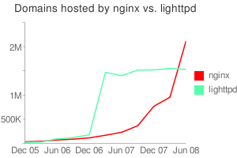

# 使用 Nginx 提升网站访问速度
在 Linux 系统上安装高性能的 HTTP 服务器 —— Nginx

**标签:** Linux,Web 开发

[原文链接](https://developer.ibm.com/zh/articles/wa-lo-nginx/)

刘柄成

发布: 2008-07-18

* * *

## Nginx 简介

**Nginx** (“engine x”) 是一个高性能的 HTTP 和 反向代理 服务器，也是一个 IMAP/POP3/SMTP 代理服务器。 Nginx 是由 Igor Sysoev 为俄罗斯访问量第二的 Rambler.ru 站点开发的，它已经在该站点运行超过两年半了。 Igor 将源代码以类 BSD 许可证的形式发布。尽管还是测试版，但是，Nginx 已经因为它的稳定性、丰富的功能集、示例配置文件和低系统资源的消耗而闻名了。

根据最新一期（08 年 6 月份）的 NetCraft 调查报告显示，已经有超过两百万的主机使用了 Nginx，这个数字超过了另外一个轻量级的 HTTP 服务器 lighttpd， 排名第四，并且发展迅速。下面是这份报告的前几名的报表：

产品网站数Apache84,309,103IIS60,987,087Google GFE10,465,178Unknown4,903,174nginx2,125,160Oversee1,953,848lighttpd1,532,952

关于这期调查报告的更详细信息请看下面链接：

[http://survey.netcraft.com/Reports/200806/](http://survey.netcraft.com/Reports/200806/)

下图是最近几个月使用 Nginx 和 lighttpd 的网站数比较



## 使用 Nginx 前必须了解的事项

1. 目前官方 Nginx 并不支持 Windows，您只能在包括 Linux、UNIX、BSD 系统下安装和使用；
2. Nginx 本身只是一个 HTTP 和反向代理服务器，它无法像 Apache 一样通过安装各种模块来支持不同的页面脚本，例如 PHP、CGI 等；
3. Nginx 支持简单的负载均衡和容错；
4. 支持作为基本 HTTP 服务器的功能，例如日志、压缩、Byte ranges、Chunked responses、SSL、虚拟主机等等，应有尽有。

## 在 Linux 下安装 Nginx

为了确保能在 Nginx 中使用正则表达式进行更灵活的配置，安装之前需要确定系统是否安装有 PCRE（Perl Compatible Regular Expressions）包。您可以到 [ftp://ftp.csx.cam.ac.uk/pub/software/programming/pcre/](ftp://ftp.csx.cam.ac.uk/pub/software/programming/pcre/) 下载最新的 PCRE 源码包，使用下面命令下载编译和安装 PCRE 包：

```
# wget ftp://ftp.csx.cam.ac.uk/pub/software/programming/pcre/pcre-7.7.tar.gz
# tar zxvf pcre-7.7.tar.gz
# cd pcre-7.7
# ./configure
# make
# make install

```

Show moreShow more icon

接下来安装 Nginx，Nginx 一般有两个版本，分别是稳定版和开发版，您可以根据您的目的来选择这两个版本的其中一个，下面是把 Nginx 安装到 /opt/nginx 目录下的详细步骤：

```
# wget http://sysoev.ru/nginx/nginx-0.6.31.tar.gz
# tar zxvf nginx-0.6.31.tar.gz
# cd nginx-0.6.31
# ./configure --with-http_stub_status_module –prefix=/opt/nginx
# make
# make install

```

Show moreShow more icon

其中参数 `--with-http_stub_status_module` 是为了启用 nginx 的 NginxStatus 功能，用来监控 Nginx 的当前状态。

安装成功后 /opt/nginx 目录下有四个子目录分别是：conf、html、logs、sbin 。其中 Nginx 的配置文件存放于 conf/nginx.conf，Nginx 只有一个程序文件位于 sbin 目录下的 nginx 文件。确保系统的 80 端口没被其他程序占用，运行 sbin/nginx 命令来启动 Nginx，打开浏览器访问此机器的 IP，如果浏览器出现 Welcome to nginx! 则表示 Nginx 已经安装并运行成功。

## 常用的 Nginx 参数和控制

### 程序运行参数

Nginx 安装后只有一个程序文件，本身并不提供各种管理程序，它是使用参数和系统信号机制对 Nginx 进程本身进行控制的。 Nginx 的参数包括有如下几个：

**-c**：：使用指定的配置文件而不是 conf 目录下的 nginx.conf 。

**-t**：测试配置文件是否正确，在运行时需要重新加载配置的时候，此命令非常重要，用来检测所修改的配置文件是否有语法错误。

**-v**：显示 nginx 版本号。

**-V**：显示 nginx 的版本号以及编译环境信息以及编译时的参数。

例如我们要测试某个配置文件是否书写正确，我们可以使用以下命令

```
sbin/nginx – t – c conf/nginx2.conf

```

Show moreShow more icon

### 通过信号对 Nginx 进行控制

Nginx 支持下表中的信号：

信号名作用描述TERM, INT快速关闭程序，中止当前正在处理的请求QUIT处理完当前请求后，关闭程序HUP重新加载配置，并开启新的工作进程，关闭就的进程，此操作不会中断请求USR1重新打开日志文件，用于切换日志，例如每天生成一个新的日志文件USR2平滑升级可执行程序WINCH从容关闭工作进程

有两种方式来通过这些信号去控制 Nginx，第一是通过 logs 目录下的 nginx.pid 查看当前运行的 Nginx 的进程 ID，通过 `kill – XXX <pid>` 来控制 Nginx，其中 XXX 就是上表中列出的信号名。如果您的系统中只有一个 Nginx 进程，那您也可以通过 `killall` 命令来完成，例如运行 `killall – s HUP nginx` 来让 Nginx 重新加载配置。

## 配置 Nginx

先来看一个实际的配置文件：

```
user  nobody;# 工作进程的属主
worker_processes  4;# 工作进程数，一般与 CPU 核数等同

#error_log  logs/error.log;
#error_log  logs/error.log  notice;
#error_log  logs/error.log  info;

#pid        logs/nginx.pid;

events {
    use epoll;#Linux 下性能最好的 event 模式
    worker_connections  2048;# 每个工作进程允许最大的同时连接数
}

http {
    include       mime.types;
    default_type  application/octet-stream;

    #log_format  main  '$remote_addr - $remote_user [$time_local] $request '
    #                  '"$status" $body_bytes_sent "$http_referer" '
    #                  '"$http_user_agent" "$http_x_forwarded_for"';

    #access_log  off;
    access_log  logs/access.log;# 日志文件名

    sendfile        on;
    #tcp_nopush     on;
    tcp_nodelay     on;

    keepalive_timeout  65;

    include      gzip.conf;

    # 集群中的所有后台服务器的配置信息
    upstream tomcats {
     server 192.168.0.11:8080 weight=10;
     server 192.168.0.11:8081 weight=10;
     server 192.168.0.12:8080 weight=10;
     server 192.168.0.12:8081 weight=10;
     server 192.168.0.13:8080 weight=10;
     server 192.168.0.13:8081 weight=10;
    }

    server {
        listen       80;#HTTP 的端口
        server_name  localhost;

        charset utf-8;

        #access_log  logs/host.access.log  main;

     location ~ ^/NginxStatus/ {
        stub_status on; #Nginx 状态监控配置
        access_log off;
     }

     location ~ ^/(WEB-INF)/ {
        deny all;
     }

     location ~ \.(htm|html|asp|php|gif|jpg|jpeg|png|bmp|ico|rar|css|js|
     zip|java|jar|txt|flv|swf|mid|doc|ppt|xls|pdf|txt|mp3|wma)$ {
             root /opt/webapp;
        expires 24h;
        }

        location / {
        proxy_pass http://tomcats;# 反向代理
        include proxy.conf;
        }

        error_page 404 /html/404.html;

        # redirect server error pages to the static page /50x.html
        #
     error_page 502 503 /html/502.html;
        error_page 500 504 /50x.html;
        location = /50x.html {
            root   html;
        }
    }
}

```

Show moreShow more icon

### Nginx 监控

上面是一个实际网站的配置实例，其中灰色文字为配置说明。上述配置中，首先我们定义了一个 location ~ ^/NginxStatus/，这样通过 `http://localhost/NginxStatus/` 就可以监控到 Nginx 的运行信息，显示的内容如下：

```
Active connections: 70
server accepts handled requests
14553819 14553819 19239266
Reading: 0 Writing: 3 Waiting: 67

```

Show moreShow more icon

NginxStatus 显示的内容意思如下：

- active connections – 当前 Nginx 正处理的活动连接数。
- server accepts handled requests — 总共处理了 14553819 个连接 , 成功创建 14553819 次握手 ( 证明中间没有失败的 ), 总共处理了 19239266 个请求 ( 平均每次握手处理了 1.3 个数据请求 )。
- reading — nginx 读取到客户端的 Header 信息数。
- writing — nginx 返回给客户端的 Header 信息数。
- waiting — 开启 keep-alive 的情况下，这个值等于 active – (reading + writing)，意思就是 Nginx 已经处理完正在等候下一次请求指令的驻留连接。

### 静态文件处理

通过正则表达式，我们可让 Nginx 识别出各种静态文件，例如 images 路径下的所有请求可以写为：

```
location ~ ^/images/ {
    root /opt/webapp/images;
}

```

Show moreShow more icon

而下面的配置则定义了几种文件类型的请求处理方式。

```
location ~ \.(htm|html|gif|jpg|jpeg|png|bmp|ico|css|js|txt)$ {
    root /opt/webapp;
    expires 24h;
}

```

Show moreShow more icon

对于例如图片、静态 HTML 文件、js 脚本文件和 css 样式文件等，我们希望 Nginx 直接处理并返回给浏览器，这样可以大大的加快网页浏览时的速度。因此对于这类文件我们需要通过 root 指令来指定文件的存放路径，同时因为这类文件并不常修改，通过 `expires` 指令来控制其在浏览器的缓存，以减少不必要的请求。 `expires` 指令可以控制 HTTP 应答中的” Expires ”和” Cache-Control ”的头标（起到控制页面缓存的作用）。您可以使用例如以下的格式来书写 Expires：

```
expires 1 January, 1970, 00:00:01 GMT;
expires 60s;
expires 30m;
expires 24h;
expires 1d;
expires max;
expires off;

```

Show moreShow more icon

### 动态页面请求处理

Nginx 本身并不支持现在流行的 JSP、ASP、PHP、PERL 等动态页面，但是它可以通过反向代理将请求发送到后端的服务器，例如 Tomcat、Apache、IIS 等来完成动态页面的请求处理。前面的配置示例中，我们首先定义了由 Nginx 直接处理的一些静态文件请求后，其他所有的请求通过 proxy\_pass 指令传送给后端的服务器（在上述例子中是 Tomcat）。最简单的 `proxy_pass` 用法如下：

```
location / {
    proxy_pass        http://localhost:8080;
    proxy_set_header  X-Real-IP  $remote_addr;
}

```

Show moreShow more icon

这里我们没有使用到集群，而是将请求直接送到运行在 8080 端口的 Tomcat 服务上来完成类似 JSP 和 Servlet 的请求处理。

当页面的访问量非常大的时候，往往需要多个应用服务器来共同承担动态页面的执行操作，这时我们就需要使用集群的架构。 Nginx 通过 `upstream` 指令来定义一个服务器的集群，最前面那个完整的例子中我们定义了一个名为 tomcats 的集群，这个集群中包括了三台服务器共 6 个 Tomcat 服务。而 proxy\_pass 指令的写法变成了：

```
location / {
    proxy_pass        http://tomcats;
    proxy_set_header  X-Real-IP  $remote_addr;
}

```

Show moreShow more icon

在 Nginx 的集群配置中，Nginx 使用最简单的平均分配规则给集群中的每个节点分配请求。一旦某个节点失效时，或者重新起效时，Nginx 都会非常及时的处理状态的变化，以保证不会影响到用户的访问。

## 结束语

尽管整个程序包只有五百多 K，但麻雀虽小、五脏俱全。 Nginx 官方提供的各种功能模块应有尽有，结合这些模块可以完整各种各样的配置要求，例如：压缩、防盗链、集群、FastCGI、流媒体服务器、Memcached 支持、URL 重写等等，更关键的是 Nginx 拥有 Apache 和其他 HTTP 服务器无法比拟的高性能。您甚至可以在不改变原有网站的架构上，通过在前端引入 Nginx 来提升网站的访问速度。

本文只是简单介绍了 Nginx 的安装以及常见的基本的配置和使用，更多关于 Nginx 的信息请阅读文章后面的参考资源。在这里要非常感谢我的朋友——陈磊（chanix@msn.com），他一直在做 Nginx 的中文 WIKI，同时也是他介绍给我这么好的一款软件。

如果您的网站是运行在 Linux 下，如果您并没有使用一些非常复杂的而且确定 Nginx 无法完成的功能，那您应该试试 Nginx。