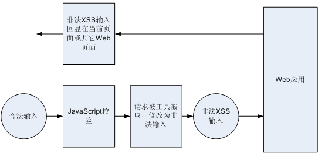
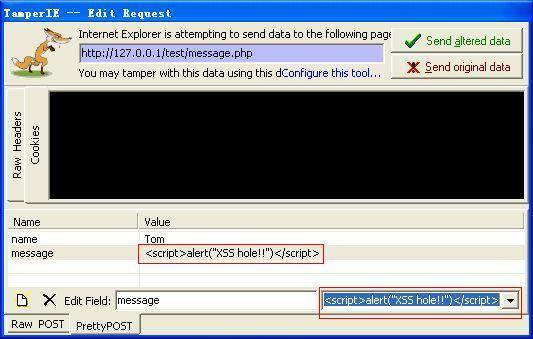

# 使用 PHP 构建的 Web 应用如何避免 XSS 攻击
协助你增加你应用的安全性

**标签:** PHP,Web 开发

[原文链接](https://developer.ibm.com/zh/articles/os-cn-php-xss/)

周婷, 刘鑫, 刘坚

发布: 2009-03-19

* * *

## 使用 PHP 构建的 Web 应用如何避免 XSS 攻击

Web 2.0 的发展为网络用户的互动提供了更多机会。用户通过在论坛发表评论，或是在博客发表留言都可能有意或无意输入一些破坏性的内容，从而造成网页不能正常显示，影响其它用户的使用。XSS 全称为 Cross Site Scripting，因为 CSS 已经用作样式表的简称，故称为 XSS。 XSS 是一种常见的网站攻击的方法。其原理是通过在网页的输入框输入一些恶意的内容，通常是 JavaScript 脚本片段，而这些恶意输入在提交之后并重新读回到客户端时，浏览器会解释执行这些恶意的脚本内容，从而影响网页的正常显示。

本文首先简单介绍开发测试人员如何对 Web 应用进行 XSS 漏洞测试，如何借助工具绕过客户端 JavaScript 校验输入恶意数据；然后针对使用 PHP 语言构建的 Web 站点，从在输出端对动态内容进行编码、以及在服务器端对输入进行检测两方面介绍如何避免恶意的 XSS 攻击。

## 对 Web 应用进行 XSS 漏洞测试

### 测试路径

对 WEB 应用进行 XSS 漏洞测试，不能仅仅局限于在 WEB 页面输入 XSS 攻击字段，然后提交。绕过 JavaScript 的检测，输入 XSS 脚本，通常被测试人员忽略。下图为 XSS 恶意输入绕过 JavaScript 检测的攻击路径。

##### 图 1\. XSS 攻击测试路径 – 绕过 JavaScript 校验



### 常见的 XSS 输入

- XSS 输入通常包含 JavaScript 脚本，如弹出恶意警告框： `<script>alert("XSS");</script>`
- XSS 输入也可能是 HTML 代码段，譬如：

    - 网页不停地刷新 `<meta http-equiv="refresh" content="0;">`
    - 嵌入其它网站的链接 `<iframe src=http://xxxx width= 25 0 height=250></iframe>`

[XSS (Cross Site Scripting) Cheat Sheet](https://portswigger.net/web-security/cross-site-scripting/cheat-sheet) 维护了一份常见的 XSS 攻击脚本列表，可用来作为检测 WEB 应用是否存在 XSS 漏洞的测试用例输入。初次接触 XSS 攻击的开发人员可能会对列表提供的一些 XSS 输入不是很理解，本文第二部分将会针对不同代码上下文的 XSS 输入作进一步的解释。

### 测试工具

很多工具可以在浏览器发送 Get/Post 请求前将其截取，攻击者可以修改请求中的数据，从而绕过 JavaScript 的检验将恶意数据注入服务器。以下是一些常用的截取 HTTP 请求的工具列表。

- [Paros proxy](http://www.parosproxy.org/)
- [Fiddler](http://www.fiddlertool.com/fiddler)
- [Burp proxy](http://www.portswigger.net/proxy/)
- [TamperIE](http://www.bayden.com/dl/TamperIESetup.exe)

笔者曾经使用 TamperIE 对 WEB 应用进行安全性测试。TamperIE 小巧易用，能够截取 IE 浏览器发送的 Get/Post 请求，甚至能绕过 SSL 加密。不过 TamperIE + IE7 工作不稳定。IE7 提供了对 IPV6 的支持，如果你并不计划测试你的 Web 应用对 IPV6 的支持，建议还是使用 TamperIE + IE6 的组合。

如图2所示: TamperIE 绕过客户端浏览器 JavaScript 的校验，在 POST 请求提交时将其截取，用户可以任意修改表单输入项 name 和 message 的值，譬如将 message 的值修改为 `"<script>alert("XSS hole!!”);</script>"` ，然后点击 ”Send altered data” 按钮，将修改后的恶意数据发送给 Web 服务器。

##### 图 2\. 使用 TamperIE 截取 Post 请求



## 在输出端对动态内容进行编码

对一个 Web 应用而言，其动态内容可能来源于用户输入、后台数据库、硬件状态改变或是网络信息等。动态内容特别是来自用户输入的动态内容很有可能包含恶意数据，从而影响网页的正常显示或是执行恶意脚本。将动态内容安全地显示在浏览器端与动态内容所处的上下文背景有关，譬如动态内容处在 HTML 正文、表单元素的属性、或是 JavaScript 代码段中。对于一个基于 PHP 语言的 Web 应用，当执行 `"echo"`、 `"print"`、 `"printf"`、 `"<?="` 等语句时表示正在处理动态内容。本节将首先介绍 PHP 提供的库函数 `htmlspecialchars()` 的用法，此函数能将 5 个 HTML 特殊字符转化为可在网页显示的 HTML 实体编码；然后将介绍一些常见背景下的 XSS 攻击输入，以及如何在输出端对动态内容进行转义、编码从而避免 XSS 攻击。

### 使用 PHP 的 htmlspecialchars() 显示 HTML 特殊字符

从上文列举的 XSS 恶意输入可以看到，这些输入中包含了一些特殊的 HTML 字符如 “<“、”>”。当传送到客户端浏览器显示时，浏览器会解释执行这些 HTML 或JavaScript 代码而不是直接显示这些字符串。< > & ” 等字符在HTML语言中有特殊含义，对于用户输入的特殊字符，如何直接显示在网页中而不是被浏览器当作特殊字符进行解析?

HTML字符实体由 & 符号、实体名字或者 # 加上实体编号、分号三部分组成。以下为 HTML 中一些特殊字符的编码。有的字符实体只有实体编号，没有对应的实体名字，譬如单引号。

##### 表 1\. 一些 HTML 特殊字符的实体编码

显示实体名字实体编号<<<>>>&&&“““‘N/A‘

PHP 提供了 `htmlspecialchars()` 函数可以将 HTML 特殊字符转化成在网页上显示的字符实体编码。这样即使用户输入了各种 HTML 标记，在读回到浏览器时，会直接显示这些 HTML 标记，而不是解释执行。 `htmlspecialchars()` 函数可以将以下五种 HTML 特殊字符转成字符实体编码：

- & 转成 &
- ” 转成 “
- < 转成 <
- > 转成 >

- ‘ 转成 ‘

当直接调用 `htmlspecialchars($str)` 时, & ” < \> 被转义。

当设置 ENT\_QUOTES 标记时, 即调用 `htmlspecialchars($str, ENT_QUOTES)` 时，单引号也被转义。

当设置 ENT\_NOQUOTES 标记时，单引号和双引号都不会被转义。即调用 `htmlspecialchars($str, ENT_NOQUOTES)` 时，只有& < \> 被转义。

### 不同背景下的动态内容的 XSS 攻击及解决方案

XSS 攻击输入与动态内容所处的代码背景相关，譬如动态内容为表单元素属性的值、位于 HTML 正文、或是 Javascript 代码段中等等。

**HTML 标记的属性为动态内容**

Web 应用中，”input”、”style”、”color” 等 HTML 标记的属性都可能为动态内容，其中”input” 标记的 “value” 属性通常为动态内容。

_例子1_

```
<form...><INPUT type=text name="msg" id="msg" size=10 maxlength=8
value="<?= $msg?>"></form>

```

Show moreShow more icon

_攻击 XSS 输入_

```
Hello"><script>evil_script()</script>

```

Show moreShow more icon

_将动态内容替换_

将 `$msg` 替换为恶意 XSS 输入:

```
<form...><INPUT type=text name="msg" id="msg" size=10 maxlength=8
value="Hello"><script>evil_script()</script>"></form>

```

Show moreShow more icon

_例子 2_

```
<form...><INPUT type=text name="msg" id="msg" size=10
maxlength=8 value=<?= $msg?>></form>

```

Show moreShow more icon

_攻击 XSS 输入_

```
Hello onmouseover=evil_script()

```

Show moreShow more icon

_将动态内容替换_

将 `$msg` 替换为恶意 XSS 输入:

```
<form...><INPUT type=text name="msg" id="msg" size=10
maxlength=8 value=Hello onmouseover=evil_script()></form>

```

Show moreShow more icon

_分析_

从例子 1 可以看到其 XSS攻击输入中包含了 HTML 特殊字符 < > “

从例子 2 可以看到其 XSS 攻击输入中没有包含上节中提到的五种 HTML 字符， 但是 “value”属性值没有使用双引号包围。

_解决方案_

调用 `htmlspecialchars($str, ENT_QUOTES)` 将以下 5 种 HTML 特殊字符 < > &’ ” 转义；同时使属性值被双引号包围。譬如：

```
<form...><INPUT type=text name="msg" id="msg" size=10
maxlength=8 value="<?= htmlspecialchars($msg, ENT_QUOTES))?>"></form>

```

Show moreShow more icon

_注意事项_

将 input 的 value 进行转义，必须考虑显示和存储数据的一致性问题，即显示在浏览器端和存储在服务器端后台的数据可能因为转义而变得不一致。譬如存储在服务器端的后台原始数据包含了以上 5 种特殊字符，但是没有转义，为了防止 XSS 攻击，在浏览器端输出时对 HTML 特殊字符进行了转义：

1. 当再度将表单提交时，存储的内容将会变成转义后的值。

2. 当使用 JavaScript 操作表单元素，需要使用到表单元素的值时，必须考虑到值可能已经被转义。


**HTML 文本为动态内容**

_例子_

```
<b> 欢迎：<?= $welcome_msg?></b>

```

Show moreShow more icon

_攻击XSS输入_

```
<script>evil_script()</script>

```

Show moreShow more icon

_将动态内容替换_

将 `$welcome_msg` 替换为恶意 XSS 输入:

```
<b>欢迎：<script>evil_script()</script></b>

```

Show moreShow more icon

_分析_

在 HTML 正文背景下，< > 字符会引入 HTML 标记，& 可能会认为字符实体编码的开始，所以需要将 < > & 转义

_解决方案_

为简洁起见，直接使用 `htmlspecialchars()` 将 5 种 HTML 特殊字符转义，如：

```
<b>欢迎：<?= htmlspecialchars($welcome_msg,, ENT_NOQUOTES)?></b>

```

Show moreShow more icon

**URL 的值为动态内容**

Script/Style/Img/ActiveX/Applet/Frameset… 等标记的 src 或 href 属性如果为动态内容，必须确保这些 URL 没有指向恶意链接。

_例子1_

```
<script src=<?= "$script_url>">

```

Show moreShow more icon

_攻击XSS输入_

```
http://evil.org/evil.js

```

Show moreShow more icon

_将动态内容替换_

将 `$script_url` 替换为恶意 XSS 输入:

```
<script src="http://evil.org/evil.js">

```

Show moreShow more icon

_例子2_

```
”>

```

Show moreShow more icon

_攻击XSS输入_

```
javascript:evil_script()

```

Show moreShow more icon

_将动态内容替换_

将 `$img_url` 替换为恶意XSS输入:

```


```

Show moreShow more icon

_分析_

一般情况下尽量不要让 URL 的值被用户控制。如果用户需要自己定义自己的风格及显示效果，也不能让用户直接控制整个 URL 的内容，而是提供预定义好的风格供用户设置、装配，然后由后台程序根据用户的选择组合成安全的 URL 输出。

**字符集编码**

浏览器需要知道字符集编码才能正确地显示网页。如果字符集编码没有显式在 content-type 或meta 中定义，浏览器会有算法猜测网页的字符集编码。譬如 `<script>alert(document.cookie)</script>` 的 UTF-7 编码为：

```
+ADw-script+AD4-alert(document.cookie)+ADw-/script+AD4-

```

Show moreShow more icon

如果 `+ADw-script+AD4-alert(document.cookie)+ADw-/script+AD4-` 作为动态内容位于网页的顶端并传送到浏览器端，IE 会认为此网页是 UTF-7 编码，从而使网页不能正常显示。

_解决方案_

显式定义网页的字符集编码，譬如

```
<meta http-equiv=content-type content="text/html; charset=UTF-8">

```

Show moreShow more icon

**动态内容为 Java S cript 事件处理函数的参数**

JavaScript 事件处理函数如 onClick/onLoad/onError/onMouseOver/ 的参数可能包含动态内容。

_例子_

```
<input type="button" value="go to" onClick='goto_url("<?= $target_url>");'>

```

Show moreShow more icon

_攻击XSS输入_

```
foo");evil_script("

```

Show moreShow more icon

_将动态内容替换_

HTML 解析器会先于 JavaScript 解析器解析网页，将 `$target_url` 替换为恶意 XSS 输入:

```
<input type="button" value="go to" onClick='goto_url("foo");evil_script("");'>

```

Show moreShow more icon

**动态内容位于 JavaScript 代码段中**

_例子_

```
<SCRIPT language="javascript1.2">
var msg='<?= $welcome_msg?> ';
//...
</SCRIPT>

```

Show moreShow more icon

_攻击XSS输入1_

```
Hello'; evil_script(); //

```

Show moreShow more icon

_将动态内容替换_

将 `$welcome_msg` 替换为恶意 XSS 输入:

```
<SCRIPT language="javascript1.2">
var msg='Hello'; evil_script(); //';
//...
</SCRIPT>

```

Show moreShow more icon

_攻击XSS输入2_

```
Hello</script><script>evil_script();</script><script>

```

Show moreShow more icon

_将动态内容替换_

将 `$welcome_msg` 替换为恶意 XSS 输入:

```
<script> var msg = 'Hello</script>
<script>evil_script();</script>
<script>' // ... // do something with msg_text </script>

```

Show moreShow more icon

_分析_

如上文所示，在 JavaScript 背景中使用动态内容需要非常谨慎。一般情况下，尽量避免或减少在 Javascript 的背景下使用动态内容，如果必须使用动态内容，在开发或代码审计时必须考虑这些动态内容可能的取值，是否会导致 XSS 攻击。

## 建立PHP库函数校验输入

Web 开发人员必须了解，仅仅在客户端使用 JavaScript 函数对非法输入进行检测过滤对于构建安全的 WEB 应用是不够的。如上文所述，攻击者可以轻易地借助工具绕过 JavaScript 校验甚至 SSL 加密输入恶意数据。在输出端对动态内容进行编码也只能起到一种双重保护的作用，更重要的应该在服务器端对输入进行校验。PHP 提供了 `strpos() 、 strstr()、 preg_match()` 等函数可用于检测非法字符和字符串；`preg_replace()` 函数可用于替换非法字符串。 [OWASP PHP Filters](http://www.owasp.org/index.php/OWASP_PHP_Filters) 开源项目提供了一些 PHP 库函数用于过滤非法输入可作为参考。一些常见的检测和过滤包括：

1. 输入是否仅仅包含合法的字符；
2. 输入如果为数字，数字是否在指定的范围；
3. 输入字符串是否超过最大长度限制；
4. 输入是否符合特殊的格式要求，譬如email 地址、IP 地址；
5. 不同的输入框在逻辑上存在的耦合和限制的关系；
6. 除去输入首尾的空格；

## 结束语

Web 应用的安全性是一个很重要、覆盖范围很广泛的主题。为了防止常见的 XSS 的攻击，Web 开发人员必须明白不能仅仅只在客户端使用 JavaScript 对输入进行检测、过滤；同时还应建立服务器端的输入校验、输出编码库函数；在服务器端检测、过滤输入；根据动态内容所处的背景将特殊字符进行编码后再传送给浏览器端显示。