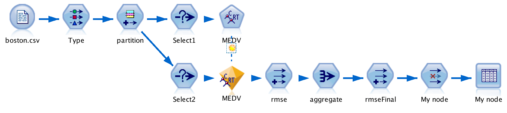
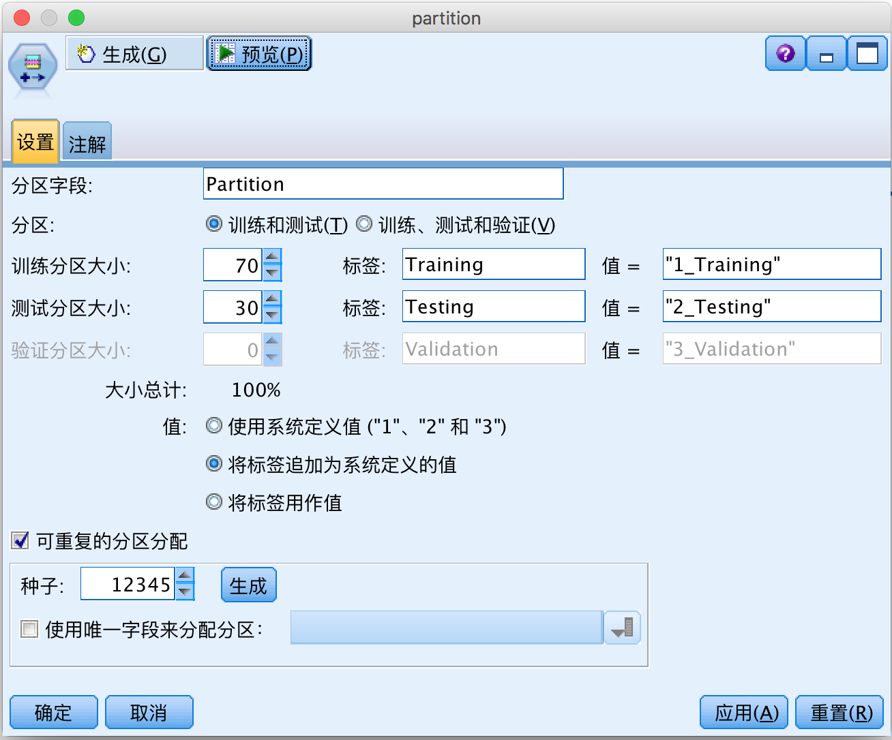
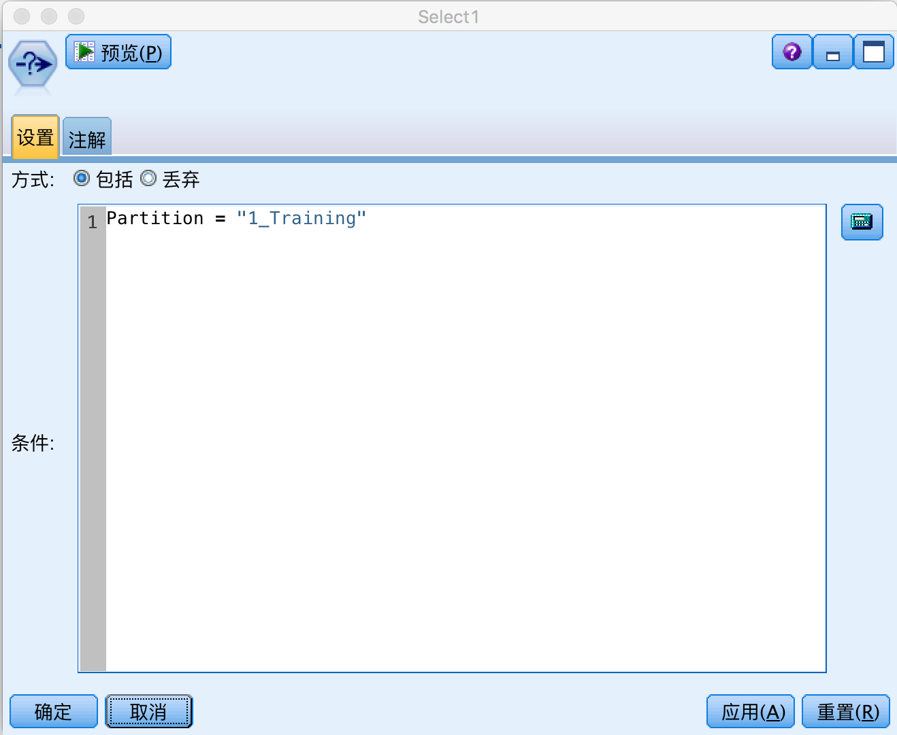
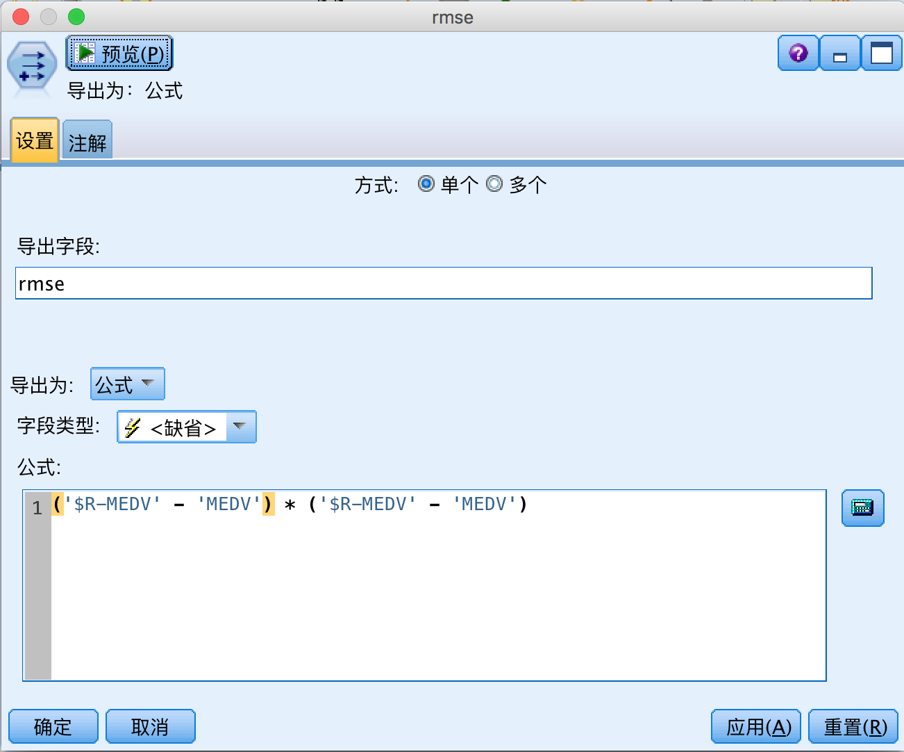
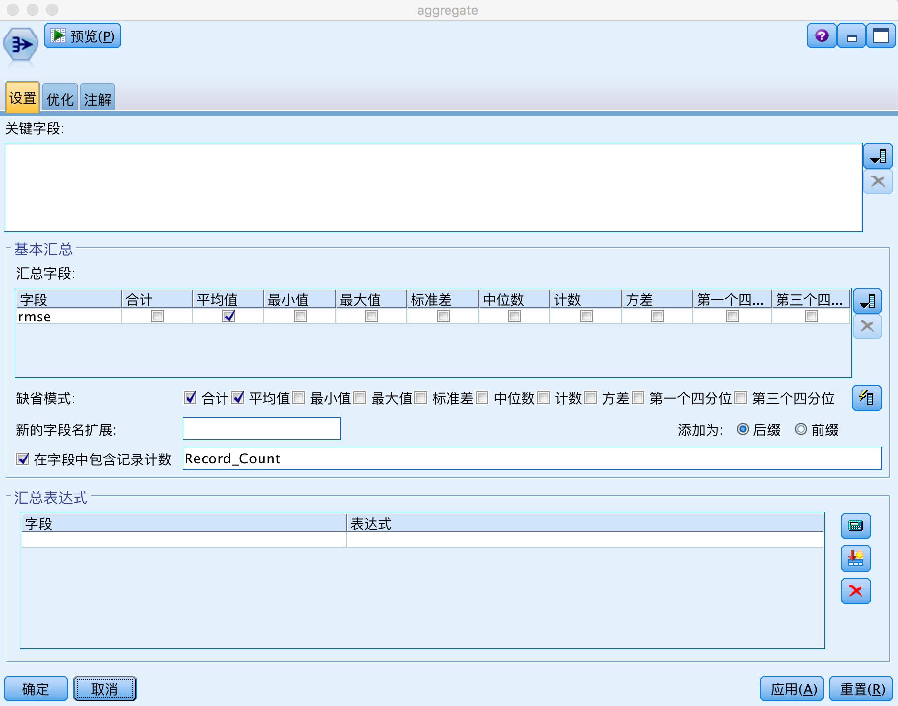
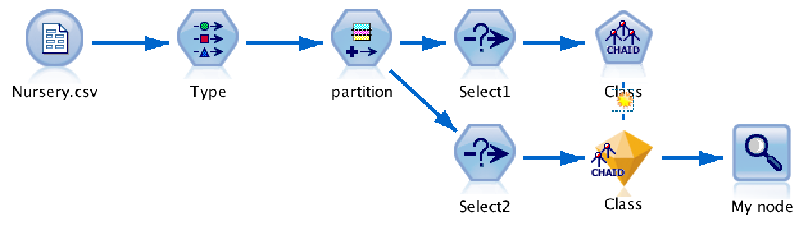

# 使用 Python 计算各种树算法在 IBM SPSS Modeler 中的预测精度
快速选择最适合你的模型

**标签:** 分析

[原文链接](https://developer.ibm.com/zh/articles/ba-lo-python-spss-modeler-accuracy/)

李 华, 葛 曦, 贺 敏

发布: 2019-02-19

* * *

## 背景简介

IBM SPSS Modeler 这款数据挖掘软件，支持对众多决策树的建模与预测分析。当用户有若干组数据，需要用树算法进行建模、分析、预测，并且要求该模型具有最高的精确度，那么应该选哪一个树算法呢？这时，我们需要进行一系列针对精确度计算的探索式测试，来寻找适合某种数据，且有最高精确度的树模型。

首先，让我们罗列出各个树算法以及确定精确度的准则。Modeler 所支持的树模型分别为：CART，CHAID，QUEST，C5.0， SRF，Tree-AS。针对预测目标变量的不同类型，树可分为分类树和回归树。 分类树与回归树的精确度分别选取统计量 [Accuracy](https://en.m.wikipedia.org/wiki/Accuracy_and_precision) 和 [RMSE](https://en.m.wikipedia.org/wiki/Root-mean-square_deviation) 作为衡量准则。

其次，我们需要确定测试的细节要求。为保证计算结果的准确性，数据要随机的分为训练数据和测试数据两部分，分别做模型建模与预测分析，根据预测值与原始值计算精确度，这个操作至少重复 5 遍，然后取平均值作为精确度的最终结果。

如果在 Modeler UI 中手工创建流（stream）来计算精确度，优点是易操作，缺点是重复性差，效率低。Modeler 支持 Python 语言脚本编写功能，一些大量重复操作且高耗时的任务，使用脚本便可轻松完成这些任务。因此在 Modeler 中用 Python Scripting 方式计算树算法的精确度，是比较优的解决方案。

## 介绍 Python Scripting in Modeler

通过 IBM SPSS Modeler 的脚本编制工具，用户可以创建脚本，这些脚本可以在 SPSS Modeler 界面上运行、处理输出对象并运行命令语法。用户使用鼠标或键盘进行的操作,借助脚本同样可以完成。SPSS Modeler 有 3 种类型的脚本：

- 流脚本，用于控制单个流的执行并将该脚本存储在流中。
- 超节点脚本，用于控制超节点的行为。
- 独立或会话脚本，可用于跨多个不同的流协调执行。

本文所使用的解决方案，用到的是流脚本。

以下将以数据 [Boston](https://archive.ics.uci.edu/ml/machine-learning-databases/housing/housing.names) ， [Nursery](https://archive.ics.uci.edu/ml/machine-learning-databases/nursery/nursery.names) 为例，分别介绍在 IBM Modeler 中如何计算回归树和分类树的精确度。

## 计算回归树预测精度

数据 Boston 的目标变量 MEDV，即根据城市犯罪率，某年份建造自住住房的比例，全额物业税税率等因变量，预测波士顿市自住住房的 [中值（Median）](https://en.wikipedia.org/wiki/Median) ，它是连续型变量，所以划分到回归树范畴。IBM Modeler 中，回归树预测精确度的流程图，如图所示。

##### 图 1\. 回归树预测精度流程图



### 数据处理

步骤 1\. 用 Modeler Var File 节点读取数据，并设置 Target 目标变量。Partition 节点将数据分割，采用随机种子机制，随机选取整体数据的 70% 做模型训练, 30% 做模型测试。这一点至关重要，目的是保证测试的公正有效，如图所示。

##### 图 2\. Partition 节点细节图



步骤 2\. 用 Modeler Select 将 Training Data 和 Testing Data 剥离开, 过滤条件分别是 Training Partition Value 和 Testing Partition Value 值。如图所示。

##### 图 3\. Select 节点细节图



##### Python 脚本清单 1：

```
//声明定义
import modeler.api
stream = modeler.script.stream() #构造 stream 对象

//数据源节点操作
sourcenode = stream.createAt("varfile", "testdata", 1, 1) #创建 var file 类型的 sourcenode 节点
#sourcenode 节点读入 filename 数据
sourcenode.setPropertyValues({"full_filename":filename,"annotation" :"test"})
sourcenode.setKeyedPropertyValue("direction", target, "Out") #将 target 设置为目标变量

//类型节点操作
typenode = stream.createAt("type", "Type", 200,1) #创建 type 节点
stream.link(sourcenode, typenode) #连接 sourcenode 节点和 type 节点

//Partition 节点操作
partitionnode = stream.createAt("partition","partition", 350,1) #创建 partition 节点 partitionnode.setPropertyValue("training_size", 70) #设置 training size 为 70    partitionnode.setPropertyValue("testing_size",30)   #设置 testing size 为 30   partitionnode.setPropertyValue("random_seed", randomeSeed) #设置随机种子    stream.link(typenode, partitionnode) #连接 type 节点与 partition 节点

//Select 节点操作
selectnode1 = stream.createAt("select","Select1", 450,1) #创建 select1 节点
selectnode2 = stream.createAt("select","Select2", 450,100) #创建 select2 节点    selectnode1.setPropertyValue("mode", "Include") #select1 节点设置输出条件    selectnode1.setPropertyValue("condition", "Partition = \"1_Training\"")  selectnode2.setPropertyValue("mode", "Include") \"")  #select2 节点设置输出条件    selectnode2.setPropertyValue("condition", "Partition = \"2_Testing
stream.link(partitionnode, selectnode1) #连接 partition 节点和 select1 节点
stream.link(partitionnode, selectnode2) #连接 partition 节点和 select2 节点

```

Show moreShow more icon

### 构建模型

Training 数据通过 Select1 节点集结，直接连接树（Tree）模型节点, 并运行当前流 stream，得到相应模型的 Nugget 节点。本例中对于树（Tree）模型的参数均采用默认值。

##### Python 脚本清单 2：

```
//模型节点操作
modelnode = stream.createAt(model, model+"Model", 550,1) #创建模型节点    stream.link(selectnode1, modelnode) #连接 select1 节点与模型节点
modelnode.run([]) #运行模型

```

Show moreShow more icon

### 预测分析

Tree Nugget 节点是对树（Tree）模型数据挖掘后的特征的呈现，Testing 数据通过 Select2 节点集结，并与 Tree Nugget 节点相连，对目标变量 MEDV 做预测分析。 统计量 RMSE 即拟合数据与原始数据对应点的误差的平方和的均值的平方根，是常用的一种衡量精确度标准。

步骤 1\. 用 Modeler Derive 节点产生新列，名为 rmse，先计算预测数据与原始数据对应点的误差的平方，即(‘$R-MEDV’ – ‘MEDV’) \* (‘$R-MEDV’ – ‘MEDV’)，如图所示。

##### 图 4\. Derive 节点细节图



步骤 2\. 连接 Modeler Aggregate 节点，并对 rmse 列求 Mean 值，这样就得到拟合数据与原始数据对应点的误差的平方和的均值，如图所示。

##### 图 5\. Aggregate 节点细节图



步骤 3\. 用 Derive 节点对其求开方，公式是 sqrt(rmse\_Mean)，这样就得到 RMSE 值。rmseFinal 节点输出 rmse\_Mean，Record\_Count 和 rmseFinal, 通过 Filter 节点去除前 2 个值，只输出 rmseFinal。并且把结果写入文本文件 csv 中。

##### Python 脚本清单 3：

```
//Nugget 节点操作
applymodelnode = stream.findByType("apply" + model +"node", None) #寻找模型 nugget 节点    stream.unlink(selectnode1, applymodelnode) #去掉连接 select1 节点与 nugget 节点   stream.link(selectnode2, applymodelnode)   #连接 select2 节点与 nugget 节点

//Derive 节点操作
derivenode = stream.createAt("derive", "Location", 650, 120) #创建 derive 节点
derivenode.setPropertyValue("new_name", "rmse") #将 derive 节点命名为 rmse
derivenode.setPropertyValue("result_type", "Formula") #设置计算公式
#('$R-target' - 'target') * ('$R-target' - 'target')
derivenode.setPropertyValue("formula_expr", "('$R-"+ target + "\'" + " - " + "\'" + target + "\') * ('$R-" + target + "\'" + " - " + "\'" + target + "\')")
stream.link(applymodelnode, derivenode) #连接模型 nugget 节点与 rmse derive 节点

//Aggregate 节点操作
aggregatenode = stream.createAt("aggregate", "aggregate", 750, 120) #创建 aggregate 节点
#集结 rmse 列的均值，名为 rmse_Mean
aggregatenode.setKeyedPropertyValue("aggregates", "rmse", ["Mean"])
stream.link(derivenode, aggregatenode)  #连接 rmse derive 节点与 aggregate 节点

derivenode2 = stream.createAt("derive", "Location", 850, 120) #创建 derive 节点
derivenode2.setPropertyValue("new_name", "rmseFinal")         #将 derive 节点命名为 rmseFinal
derivenode2.setPropertyValue("result_type", "Formula")        #选取生成规则，Formula
#设置公式表达式，对 rmse_Mean 列求开方
derivenode2.setPropertyValue("formula_expr", "sqrt(rmse_Mean)")
stream.link(aggregatenode, derivenode2) #连接 aggregate 节点与 derive 节点

//Filter 节点操作
filternode = stream.createAt("filter", "My node", 950, 120) #创建 filter 节点
filternode.setPropertyValue("default_include", True)
filternode.setKeyedPropertyValue("include", "rmse_Mean", False) #过滤 rmse_Mean 列
filternode.setKeyedPropertyValue("include", "Record_Count", False) #过滤 Record_Count 列
stream.link(derivenode2, filternode) #连接 derive 节点与 filter 节点

//Table 节点操作
tablenode = stream.createAt("table", "My node", 1050, 120) #创建 table 节点
tablenode.setPropertyValue("output_mode", "File") #设置 output 选项为 file
#设置 output 格式为 comma delimited data
tablenode.setPropertyValue("output_format", "Delimited")
tablenode.setPropertyValue("full_filename", outputname) #设置输出文件名称
stream.link(filternode, tablenode) #连接 filter 节点与 table 节点
tablenode.run([]) #运行 table 节点
stream.clear() #清空 canvas

```

Show moreShow more icon

把以上过程进行函数封装，将决策树，数据，目标变量，随机种子和输出文件名称等作为函数参数，提取出来，通过函数调用的方式，快速有效地计算各种类型树的预测精度值。考虑到测试连贯性与脚本易用性，特别地对 text 文本进行处理，python 脚本自动读取 csv 的精确度值，自动计算 5 次并且求均值，以及记录最终结果。同时脚本还对一些细节之处进行了考虑，比如环境处理，即每次运行前清空文件夹及其文件等操作。

##### Python 脚本清单 4：

```
import os
import csv

//csv 文件读取 RMSE 值
def GetRMSEValue(filename):
    csvfile=file(filename,'rb')
    reader = csv.reader(csvfile);
    for i,rows in enumerate(reader):
        if i == 1:
            row = rows
            out = ','.join(row)
            print(out)
    return out

//txt 文件读取 Accuracy 值
def GetACCValue(filename,listForCorrection):
    f = open(filename,"r")
    line = f.readline()
    while line:
        #print(line)
        line = f.readline()
        if(line.startswith('  Correct')):
            Accuracy = line.split()
            listForCorrection.append(float(Accuracy[2].rstrip('%'))/100 )
            print("GetCorrection",listForCorrection)
            break
        else :
            print("AAA")
    f.close()
    return listForCorrection

//记录模型，数据，精确度等信息
def writeResultToFile(model,data,acc,resultFileName):
    out = open(demosDir + resultFileName, 'a')
    csv_writer = csv.writer(out)
    csv_writer.writerow([str(model),str(data),str(acc)])
    out.close()

//计算均值
def averagenum(num):
    nsum = 0
    for i in range(len(num)):
        nsum += num[i]
    return nsum / len(num)

//删除文件
def Del_File(path):
    ls = os.listdir(path)
    for i in ls:
        c_path = os.path.join(path, i)
        if os.path.isdir(c_path):
            del_file(c_path)
        else:
            os.remove(c_path)

```

Show moreShow more icon

由于树 Quest 和 C5.0 本身不支持对连续型变量建模，基于数据 Boston，用 C&RT，CHAID，SRF 和 Tree-AS 分别建模，对变量 MEDV 进行预测，相应的精确度 RMSE 值分别是 4.3186，4.5872，3.7898 和 5.9128。RMSE 值越小，精确度越高，所以推荐的树模型是 SRF。

## 计算分类树预测精度

数据 Nursery 的目标变量是 Class，即根据父母的职业、家庭结构、财务状况，家庭健康状况等，预测入学申请的结果。它是分类型变量，所以划分到分类树范畴。IBM Modeler 中，分类树预测精确度的流程图，如图所示。

##### 图 6\. 分类树预测精度流程图



数据处理，构建模型方面与回归树类似，只是做预测分析时，因目标变量 Class 是分类型变量，需要计算 Accuracy，在 IBM Modeler 中，直接通过 Analysis 节点可计算得到。

##### Python 脚本清单 5：

```
//Analysis 节点操作
analysisnode = stream.createAt("analysis", "My node",650,1) #创建 analysis 节点
stream.link(applymodelnode, analysisnode) #连接 nugget 节点与 analysis 节点
analysisnode.setPropertyValue("output_mode", "File") #设置 output 选项为 file
analysisnode.setPropertyValue("output_format", "Text") #设置输出格式为 text document
analysisnode.setPropertyValue("full_filename", outputname) #设置输出文件名称
analysisnode.run([]) #运行 analysis 节点
stream.clear()

```

Show moreShow more icon

基于数据 Nursery，用 CART，CHAID，QUEST，C5.0， SRF，Tree-AS 分别建模，对变量 Class 进行预测，相应的精确度 Accuracy 值分别是 88.49%，91.23%，86.58%，97.27%，87.19% 和 92.84%。Accuracy 值越高，精确度越高，所以推荐的树模型是 C5.0。

## 总结

本文主要介绍在 IBM SPSS Modeler 中如何使用 Python 脚本，高效地计算出各种树算法的预测精确度。这是一个从实际需求出发，比较各种类型树的预测精度，帮助用户快速选择模型的解决方案。文章是对实际工作的提炼与总结。通过本文，读者对 Modeler Python 流脚本有大致的了解，并且根据步骤可以快速建立流脚本来计算回归树与分类树的预测精确度。

## 相关资源

- [IBM SPSS Modeler Python 脚本编写与自动化指南](https://www-03preprod.ibm.com/support/knowledgecenter/SS3RA7_18.2.0/modeler_mainhelp_client_ddita/clementine/scripting_container.html)
- [Decision Tree 介绍](https://en.m.wikipedia.org/wiki/Decision_tree_learning)