# 使用 Scala 语言开发 Spark 应用程序
开始 Spark 应用程序的开发之旅

**标签:** Java,分析

[原文链接](https://developer.ibm.com/zh/articles/os-cn-spark-practice1/)

王 龙

发布: 2015-07-21

* * *

## 引言

在当前这个信息时代里，大数据所蕴含的价值已经被绝大多数的企业所认知。在 IT 的世界里，往往都是需求驱动技术的发展和革新。Hadoop 在这个大背景下应运而生，它给我们提供了一个存储和处理大数据的良好的解决方案，短短的几年时间里，它已无处不在，事实上它已经成了大数据技术的代名词。然而在人们越来越多的使用 Hadoop 提供的 MapReduce 框架处理大数据的时候，却发现它存在许多天生的缺陷, 如效率低，编程模型不够灵活，只适合做离线计算等。Spark 的出现无疑让诸多大数据计算的从业者和爱好者眼前一亮，它基于内存，并且提供了更加丰富的算子使得我们可以更高效和灵活的处理大数据。本文将从实例出发，向读者介绍如何使用 Scala 语言 (Spark 框架的开发语言) 开发 Spark 应用程序并且将其运行在 Spark 集群环境里。本文假设读者已经对 Spark 基本原理和编程模型有了基本的了解，并且已经掌握了 Scala 语言开发的基础知识，那么通过阅读本文，相信您一定会对 Spark 应用程序的开发有更深入的认识。接下来，就让我们开始 Spark 应用程序的开发之旅吧。

## 关于 Spark

Spark 由加州大学伯克利分校 AMP 实验室 (Algorithms, Machines, and People Lab) 开发，可用来构建大型的、低延迟的大数据处理的应用程序。并且提供了用于机器学习 (MLlib), 流计算（Streaming）, 图计算 (GraphX) 等子模块，最新的 1.4.0 版本更是提供了与 R 语言的集成，这使得 Spark 几乎成为了多领域通吃的全能技术。Spark 对数据的存储，转换，以及计算都是基于一个叫 RDD(Resilient Distributed Dataset) 分布式内存的抽象，应用程序对需要计算的数据的操作都是通过对 RDD 的一系列转化 (Transformation) 和动作 (Action) 算子完成的，其中转化算子可以把一个 RDD 转成另一个 RDD，如 filter 算子可以通过添加过滤条件生成一个只包含符合条件的数据的新的 RDD。动作算子负责完成最终的计算，如 count 算子可以计算出整个 RDD 表示的数据集中元素的个数。关于 Spark 所支持的算子 以及使用方法请参考 [Spark 官方网站](http://spark.apache.org/docs/latest/programming-guide.html) 。本文所使用的 Spark 的发行版是 1.3.1，读者可根据需要下载相应的版本。

## 关于 Scala

Scala 语言是一门类 Java 的多范式语言，其设计初衷就是为了继承函数式编程的面向对象编程的各种特性，正如 [Scala 语言官网](http://www.scala-lang.org/) 描述的那样:Object-Oriented Meets Functional, 就是给出了一个关于 Scala 语言特性的最简单明了的概括。

Spark 框架使用 Scala 语言开发，那么使用 Scala 语言开发 Spark 应用程序就变成一件很自然的事情，虽然 Spark 提供了面向 Python,Java 等语言的编程接口，但是从各个方面来看使用 Scala 编程都是最简单最容易理解的，特别是当程序出现异常或者是需要通过学习源码来定位问题时，您会发现学习 Scala 语言来编写 Spark 应用程序是多么有意义的事情。关于 Scala 语言，如果您还没有基础，请参考

- [Scala 语言官网](http://www.scala-lang.org/)
- Twitter 提供的 [Scala 课堂](http://twitter.github.io/scala_school/zh_cn/index.html)
- [面向 Java 开发人员的 Scala 指南系列](http://www.ibm.com/developerworks/cn/java/j-scala/)

由于 Spark 1.3.1 版本使用的是 Scala 2.10.x 版本，所以本文将使用 Scala 2.10.5 版本。

## 搭建开发环境

1. 安装 Scala IDE

    搭建 Scala 语言开发环境很容易， [Scala IDE 官网](http://scala-ide.org/download/current.html) 下载合适的版本并解压就可以完成安装，本文使用的版本是 4.1.0。

2. 安装 Scala 语言包

    如果下载的 Scala IDE 自带的 Scala 语言包与 Spark 1.3.1 使用的 Scala 版本 (2.10.x) 不一致，那么就需要下载和本文所使用的 Spark 所匹配的版本，以确保实现的 Scala 程序不会因为版本问题而运行失败。

    请下载并安装 [Scala 2.10.5 版本](http://www.scala-lang.org/download/2.10.5.html)

3. 安装 JDK

    如果您的机器上没有安装 JDK，请下载并安装 1.6 版本以上的 JDK。

4. 创建并配置 Spark 工程

    打开 Scala IDE，创建一个名称为 spark-exercise 的 Scala 工程。


##### 图 1\. 创建 scala 工程


在工程目录下创建一个 lib 文件夹，并且把您的 Spark 安装包下的 spark-assembly jar 包拷贝到 lib 目录下。

##### 图 2\. Spark 开发 jar 包

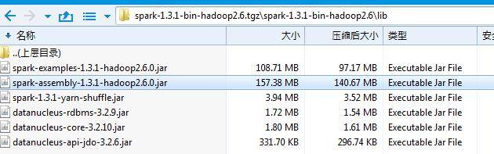

并且添加该 jar 包到工程的 classpath 并配置工程使用刚刚安装的 Scala 2.10.5 版本.，工程目录结构如下。

##### 图 3\. 添加 jar 包到 classpath

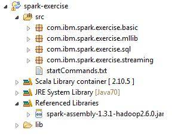

## 运行环境介绍

为了避免读者对本文案例运行环境产生困惑，本节会对本文用到的集群环境的基本情况做个简单介绍。

- 本文所有实例数据存储的环境是一个 8 个机器的 Hadoop 集群，文件系统总容量是 1.12T，NameNode 叫 hadoop036166, 服务端口是 9000。读者可以不关心具体的节点分布，因为这个不会影响到您阅读后面的文章。
- 本文运行实例程序使用的 Spark 集群是一个包含四个节点的 Standalone 模式的集群, 其中包含一个 Master 节点 (监听端口 7077) 和三个 Worker 节点，具体分布如下：

Server NameRolehadoop036166Masterhadoop036187Workerhadoop036188Workerhadoop036227Worker

- Spark 提供一个 Web UI 去查看集群信息并且监控执行结果，默认地址是:`http://<spark_master_ip>:8080` ，对于该实例提交后我们也可以到 web 页面上去查看执行结果，当然也可以通过查看日志去找到执行结果。

##### 图 4\. Spark 的 web console

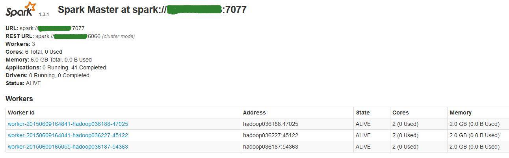

## 案例分析与编程实现

### 案例一

a. 案例描述

提起 Word Count(词频数统计)，相信大家都不陌生，就是统计一个或者多个文件中单词出现的次数。本文将此作为一个入门级案例，由浅入深的开启使用 Scala 编写 Spark 大数据处理程序的大门。

b．案例分析

对于词频数统计，用 Spark 提供的算子来实现，我们首先需要将文本文件中的每一行转化成一个个的单词, 其次是对每一个出现的单词进行记一次数，最后就是把所有相同单词的计数相加得到最终的结果。

对于第一步我们自然的想到使用 flatMap 算子把一行文本 split 成多个单词，然后对于第二步我们需要使用 map 算子把单个的单词转化成一个有计数的 Key-Value 对，即 word -> (word,1). 对于最后一步统计相同单词的出现次数，我们需要使用 reduceByKey 算子把相同单词的计数相加得到最终结果。

c. 编程实现

##### 清单 1\. SparkWordCount 类源码

```
import org.apache.spark.SparkConf
import org.apache.spark.SparkContext
import org.apache.spark.SparkContext._

object SparkWordCount {
def FILE_NAME:String = "word_count_results_";
def main(args:Array[String]) {
if (args.length < 1) {
println("Usage:SparkWordCount FileName");
System.exit(1);
}
val conf = new SparkConf().setAppName("Spark Exercise: Spark Version Word Count Program");
val sc = new SparkContext(conf);
val textFile = sc.textFile(args(0));
val wordCounts = textFile.flatMap(line => line.split(" ")).map(
                                        word => (word, 1)).reduceByKey((a, b) => a + b)
//print the results,for debug use.
//println("Word Count program running results:");
//wordCounts.collect().foreach(e => {
//val (k,v) = e
//println(k+"="+v)
//});
wordCounts.saveAsTextFile(FILE_NAME+System.currentTimeMillis());
println("Word Count program running results are successfully saved.");
}
}

```

Show moreShow more icon

d. 提交到集群执行

本实例中, 我们将统计 HDFS 文件系统中/user/fams 目录下所有 txt 文件中词频数。其中 spark-exercise.jar 是 Spark 工程打包后的 jar 包，这个 jar 包执行时会被上传到目标服务器的/home/fams 目录下。运行此实例的具体命令如下：

##### 清单 2\. SparkWordCount 类执行命令

```
./spark-submit \
--class com.ibm.spark.exercise.basic.SparkWordCount \
--master spark://hadoop036166:7077 \
--num-executors 3 \
--driver-memory 6g --executor-memory 2g \
--executor-cores 2 \
/home/fams/sparkexercise.jar \
hdfs://hadoop036166:9000/user/fams/*.txt

```

Show moreShow more icon

e. 监控执行状态

该实例把最终的结果存储在了 HDFS 上，那么如果程序运行正常我们可以在 HDFS 上找到生成的文件信息

##### 图 5\. 案例一输出结果

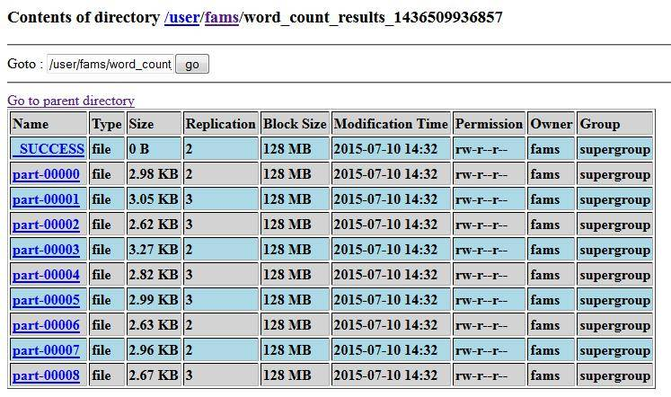

打开 Spark 集群的 Web UI, 可以看到刚才提交的 job 的执行结果。

##### 图 6\. 案例一完成状态

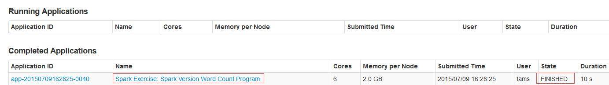

如果程序还没运行完成，那么我们可以在 Running Applications 列表里找到它。

### 案例二

a. 案例描述

该案例中，我们将假设我们需要统计一个 1000 万人口的所有人的平均年龄，当然如果您想测试 Spark 对于大数据的处理能力，您可以把人口数放的更大，比如 1 亿人口，当然这个取决于测试所用集群的存储容量。假设这些年龄信息都存储在一个文件里，并且该文件的格式如下，第一列是 ID，第二列是年龄。

##### 图 7\. 案例二测试数据格式预览

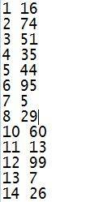

现在我们需要用 Scala 写一个生成 1000 万人口年龄数据的文件，源程序如下：

##### 清单 3\. 年龄信息文件生成类源码

```
import java.io.FileWriter
import java.io.File
import scala.util.Random

object SampleDataFileGenerator {

def main(args:Array[String]) {
val writer = new FileWriter(new File("C: \\sample_age_data.txt"),false)
val rand = new Random()
for ( i <- 1 to 10000000) {
writer.write( i + " " + rand.nextInt(100))
writer.write(System.getProperty("line.separator"))
}
writer.flush()
writer.close()
}
}

```

Show moreShow more icon

b. 案例分析

要计算平均年龄，那么首先需要对源文件对应的 RDD 进行处理，也就是将它转化成一个只包含年龄信息的 RDD，其次是计算元素个数即为总人数，然后是把所有年龄数加起来，最后平均年龄=总年龄/人数。

对于第一步我们需要使用 map 算子把源文件对应的 RDD 映射成一个新的只包含年龄数据的 RDD，很显然需要对在 map 算子的传入函数中使用 split 方法，得到数组后只取第二个元素即为年龄信息；第二步计算数据元素总数需要对于第一步映射的结果 RDD 使用 count 算子；第三步则是使用 reduce 算子对只包含年龄信息的 RDD 的所有元素用加法求和；最后使用除法计算平均年龄即可。

由于本例输出结果很简单，所以只打印在控制台即可。

c. 编程实现

##### 清单 4\. AvgAgeCalculator 类源码

```
import org.apache.spark.SparkConf
import org.apache.spark.SparkContext
object AvgAgeCalculator {
def main(args:Array[String]) {
if (args.length < 1){
println("Usage:AvgAgeCalculator datafile")
System.exit(1)
}
val conf = new SparkConf().setAppName("Spark Exercise:Average Age Calculator")
val sc = new SparkContext(conf)
val dataFile = sc.textFile(args(0), 5);
val count = dataFile.count()
val ageData = dataFile.map(line => line.split(" ")(1))
val totalAge = ageData.map(age => Integer.parseInt(
                                String.valueOf(age))).collect().reduce((a,b) => a+b)
println("Total Age:" + totalAge + ";Number of People:" + count )
val avgAge : Double = totalAge.toDouble / count.toDouble
println("Average Age is " + avgAge)
}
}

```

Show moreShow more icon

d. 提交到集群执行

要执行本实例的程序，需要将刚刚生成的年龄信息文件上传到 HDFS 上，假设您刚才已经在目标机器上执行生成年龄信息文件的 Scala 类，并且文件被生成到了/home/fams 目录下。

那么您需要运行一下 HDFS 命令把文件拷贝到 HDFS 的/user/fams 目录。

##### 清单 5\. 年龄信息文件拷贝到 HDFS 目录的命令

```
hdfs dfs –copyFromLocal /home/fams /user/fams

```

Show moreShow more icon

##### 清单 6\. AvgAgeCalculator 类的执行命令

```
./spark-submit \
 --class com.ibm.spark.exercise.basic.AvgAgeCalculator \
 --master spark://hadoop036166:7077 \
 --num-executors 3 \
 --driver-memory 6g \
 --executor-memory 2g \
 --executor-cores 2 \
/home/fams/sparkexercise.jar \
hdfs://hadoop036166:9000/user/fams/inputfiles/sample_age_data.txt

```

Show moreShow more icon

e. 监控执行状态

在控制台您可以看到如下所示信息：

##### 图 8\. 案例二输出结果

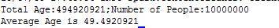

我们也可以到 Spark Web Console 去查看 Job 的执行状态

##### 图 9\. 案例二完成状态

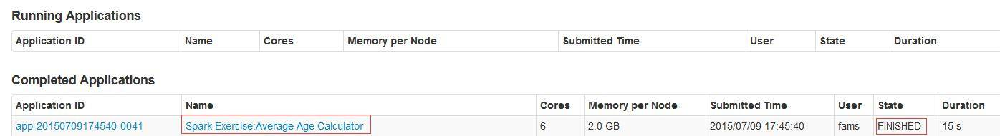

### 案例三

a. 案例描述

本案例假设我们需要对某个省的人口 (1 亿) 性别还有身高进行统计，需要计算出男女人数，男性中的最高和最低身高，以及女性中的最高和最低身高。本案例中用到的源文件有以下格式, 三列分别是 ID，性别，身高 (cm)。

##### 图 10\. 案例三测试数据格式预览

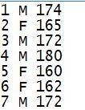

我们将用以下 Scala 程序生成这个文件，源码如下：

##### 清单 7\. 人口信息生成类源码

```
import java.io.FileWriter
import java.io.File
import scala.util.Random

object PeopleInfoFileGenerator {
def main(args:Array[String]) {
val writer = new FileWriter(new File("C:\\LOCAL_DISK_D\\sample_people_info.txt"),false)
val rand = new Random()
for ( i <- 1 to 100000000) {
var height = rand.nextInt(220)
if (height < 50) {
height = height + 50
}
var gender = getRandomGender
if (height < 100 && gender == "M")
height = height + 100
if (height < 100 && gender == "F")
height = height + 50
writer.write( i + " " + getRandomGender + " " + height)
writer.write(System.getProperty("line.separator"))
}
writer.flush()
writer.close()
println("People Information File generated successfully.")
}

def getRandomGender() :String = {
val rand = new Random()
val randNum = rand.nextInt(2) + 1
if (randNum % 2 == 0) {
"M"
} else {
"F"
}
}
}

```

Show moreShow more icon

b. 案例分析

对于这个案例，我们要分别统计男女的信息，那么很自然的想到首先需要对于男女信息从源文件的对应的 RDD 中进行分离，这样会产生两个新的 RDD，分别包含男女信息；其次是分别对男女信息对应的 RDD 的数据进行进一步映射，使其只包含身高数据，这样我们又得到两个 RDD，分别对应男性身高和女性身高；最后需要对这两个 RDD 进行排序，进而得到最高和最低的男性或女性身高。

对于第一步，也就是分离男女信息，我们需要使用 filter 算子，过滤条件就是包含”M” 的行是男性，包含”F”的行是女性；第二步我们需要使用 map 算子把男女各自的身高数据从 RDD 中分离出来；第三步我们需要使用 sortBy 算子对男女身高数据进行排序。

c. 编程实现

在实现上，有一个需要注意的点是在 RDD 转化的过程中需要把身高数据转换成整数，否则 sortBy 算子会把它视为字符串，那么排序结果就会受到影响，例如 身高数据如果是：123,110,84,72,100，那么升序排序结果将会是 100,110,123,72,84，显然这是不对的。

##### 清单 8\. PeopleInfoCalculator 类源码

```
object PeopleInfoCalculator {
def main(args:Array[String]) {
if (args.length < 1){
println("Usage:PeopleInfoCalculator datafile")
System.exit(1)
}
val conf = new SparkConf().setAppName("Spark Exercise:People Info(Gender & Height) Calculator")
val sc = new SparkContext(conf)
val dataFile = sc.textFile(args(0), 5);
val maleData = dataFile.filter(line => line.contains("M")).map(
                              line => (line.split(" ")(1) + " " + line.split(" ")(2)))
val femaleData = dataFile.filter(line => line.contains("F")).map(
                              line => (line.split(" ")(1) + " " + line.split(" ")(2)))
//for debug use
//maleData.collect().foreach { x => println(x)}
//femaleData.collect().foreach { x => println(x)}
val maleHeightData = maleData.map(line => line.split(" ")(1).toInt)
val femaleHeightData = femaleData.map(line => line.split(" ")(1).toInt)
//for debug use
//maleHeightData.collect().foreach { x => println(x)}
//femaleHeightData.collect().foreach { x => println(x)}
val lowestMale = maleHeightData.sortBy(x => x,true).first()
val lowestFemale = femaleHeightData.sortBy(x => x,true).first()
//for debug use
//maleHeightData.collect().sortBy(x => x).foreach { x => println(x)}
//femaleHeightData.collect().sortBy(x => x).foreach { x => println(x)}
val highestMale = maleHeightData.sortBy(x => x, false).first()
val highestFemale = femaleHeightData.sortBy(x => x, false).first()
println("Number of Male Peole:" + maleData.count())
println("Number of Female Peole:" + femaleData.count())
println("Lowest Male:" + lowestMale)
println("Lowest Female:" + lowestFemale)
println("Highest Male:" + highestMale)
println("Highest Female:" + highestFemale)
}
}

```

Show moreShow more icon

d. 提交到集群执行

在提交该程序到集群执行之前，我们需要将刚才生成的人口信息数据文件上传到 HDFS 集群，具体命令可以参照上文。

##### 清单 9\. PeopleInfoCalculator 类的执行命令

```
./spark-submit \
 --class com.ibm.spark.exercise.basic.PeopleInfoCalculator \
 --master spark://hadoop036166:7077 \
 --num-executors 3 \
 --driver-memory 6g \
 --executor-memory 3g \
 --executor-cores 2 \
/home/fams/sparkexercise.jar \
hdfs://hadoop036166:9000/user/fams/inputfiles/sample_people_info.txt

```

Show moreShow more icon

e. 监控执行状态

对于该实例，如程序中打印的一样，会在控制台显示如下信息：

##### 图 11\. 案例三输出结果

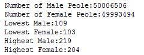

在 Spark Web Console 里可以看到具体的执行状态信息

##### 图 12\. 案例三完成状态

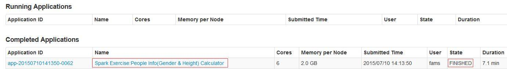

### 案例四

a. 案例描述

该案例中我们假设某搜索引擎公司要统计过去一年搜索频率最高的 K 个科技关键词或词组，为了简化问题，我们假设关键词组已经被整理到一个或者多个文本文件中，并且文档具有以下格式。

##### 图 13\. 案例四测试数据格式预览

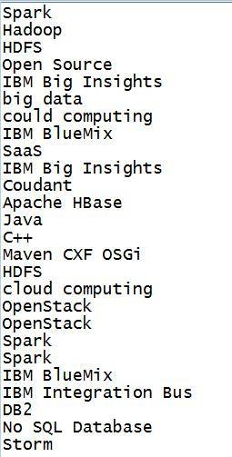

我们可以看到一个关键词或者词组可能出现多次，并且大小写格式可能不一致。

b. 案例分析

要解决这个问题，首先我们需要对每个关键词出现的次数进行计算，在这个过程中需要识别不同大小写的相同单词或者词组，如”Spark”和”spark” 需要被认定为一个单词。对于出现次数统计的过程和 word count 案例类似；其次我们需要对关键词或者词组按照出现的次数进行降序排序，在排序前需要把 RDD 数据元素从 (k,v) 转化成 (v,k)；最后取排在最前面的 K 个单词或者词组。

对于第一步，我们需要使用 map 算子对源数据对应的 RDD 数据进行全小写转化并且给词组记一次数，然后调用 reduceByKey 算子计算相同词组的出现次数；第二步我们需要对第一步产生的 RDD 的数据元素用 sortByKey 算子进行降序排序；第三步再对排好序的 RDD 数据使用 take 算子获取前 K 个数据元素。

c. 编程实现

##### 清单 10\. TopKSearchKeyWords 类源码

```
import org.apache.spark.SparkConf
import org.apache.spark.SparkContext

object TopKSearchKeyWords {
def main(args:Array[String]){
if (args.length < 2) {
println("Usage:TopKSearchKeyWords KeyWordsFile K");
System.exit(1)
}
val conf = new SparkConf().setAppName("Spark Exercise:Top K Searching Key Words")
val sc = new SparkContext(conf)
val srcData = sc.textFile(args(0))
val countedData = srcData.map(line => (line.toLowerCase(),1)).reduceByKey((a,b) => a+b)
//for debug use
//countedData.foreach(x => println(x))
val sortedData = countedData.map{ case (k,v) => (v,k) }.sortByKey(false)
val topKData = sortedData.take(args(1).toInt).map{ case (v,k) => (k,v) }
topKData.foreach(println)
}
}

```

Show moreShow more icon

d. 提交到集群执行

##### 清单 11\. TopKSearchKeyWords 类的执行命令

```
./spark-submit \
 --class com.ibm.spark.exercise.basic.TopKSearchKeyWords \
 --master spark://hadoop036166:7077 \
 --num-executors 3 \
 --driver-memory 6g \
 --executor-memory 2g \
 --executor-cores 2 \
/home/fams/sparkexercise.jar \
hdfs://hadoop036166:9000/user/fams/inputfiles/search_key_words.txt

```

Show moreShow more icon

e. 监控执行状态

如果程序成功执行，我们将在控制台看到以下信息。当然读者也可以仿照案例二和案例三那样，自己尝试使用 Scala 写一段小程序生成此案例需要的源数据文件，可以根据您的 HDFS 集群的容量，生成尽可能大的文件，用来测试本案例提供的程序。

##### 图 14\. 案例四输出结果

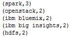

##### 图 15\. 案例四完成状态

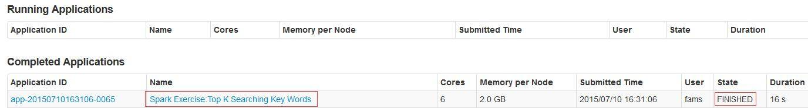

## Spark job 的执行流程简介

我们可以发现，Spark 应用程序在提交执行后，控制台会打印很多日志信息，这些信息看起来是杂乱无章的，但是却在一定程度上体现了一个被提交的 Spark job 在集群中是如何被调度执行的，那么在这一节，将会向大家介绍一个典型的 Spark job 是如何被调度执行的。

我们先来了解以下几个概念：

- **DAG**: 即 Directed Acyclic Graph，有向无环图，这是一个图论中的概念。如果一个 [有向图](http://baike.baidu.com/view/807915.htm) 无法从某个顶点出发经过若干条边回到该点，则这个图是一个有向无环图。

- **Job：** 我们知道，Spark 的计算操作是 lazy 执行的，只有当碰到一个动作 (Action) 算子时才会触发真正的计算。一个 Job 就是由动作算子而产生包含一个或多个 Stage 的计算作业。

- **Stage** ：Job 被确定后,Spark 的调度器 (DAGScheduler) 会根据该计算作业的计算步骤把作业划分成一个或者多个 Stage。Stage 又分为 ShuffleMapStage 和 ResultStage，前者以 shuffle 为输出边界，后者会直接输出结果，其边界可以是获取外部数据，也可以是以一个 ShuffleMapStage 的输出为边界。每一个 Stage 将包含一个 TaskSet。

- **TaskSet：** 代表一组相关联的没有 shuffle 依赖关系的任务组成任务集。一组任务会被一起提交到更加底层的 TaskScheduler。

- **Task** ：代表单个数据分区上的最小处理单元。分为 ShuffleMapTask 和 ResultTask。ShuffleMapTask 执行任务并把任务的输出划分到 (基于 task 的对应的数据分区) 多个 bucket(ArrayBuffer) 中,ResultTask 执行任务并把任务的输出发送给驱动程序。


Spark 的作业任务调度是复杂的，需要结合源码来进行较为详尽的分析，但是这已经超过本文的范围，所以这一节我们只是对大致的流程进行分析。

Spark 应用程序被提交后，当某个动作算子触发了计算操作时，SparkContext 会向 DAGScheduler 提交一个作业，接着 DAGScheduler 会根据 RDD 生成的依赖关系划分 Stage，并决定各个 Stage 之间的依赖关系，Stage 之间的依赖关系就形成了 DAG。Stage 的划分是以 ShuffleDependency 为依据的，也就是说当某个 RDD 的运算需要将数据进行 Shuffle 时，这个包含了 Shuffle 依赖关系的 RDD 将被用来作为输入信息，进而构建一个新的 Stage。我们可以看到用这样的方式划分 Stage，能够保证有依赖关系的数据可以以正确的顺序执行。根据每个 Stage 所依赖的 RDD 数据的 partition 的分布，会产生出与 partition 数量相等的 Task，这些 Task 根据 partition 的位置进行分布。其次对于 finalStage 或是 mapStage 会产生不同的 Task，最后所有的 Task 会封装到 TaskSet 内提交到 TaskScheduler 去执行。有兴趣的读者可以通过阅读 DAGScheduler 和 TaskScheduler 的源码获取更详细的执行流程。

## 结束语

通过本文，相信读者对如何使用 Scala 编写 Spark 应用程序处理大数据已经有了较为深入的了解。当然在处理实际问题时，情况可能比本文举得例子复杂很多，但是解决问题的基本思想是一致的。在碰到实际问题的时候，首先要对源数据结构格式等进行分析，然后确定如何去使用 Spark 提供的算子对数据进行转化，最终根据实际需求选择合适的算子操作数据并计算结果。本文并未介绍其它 Spark 模块的知识，显然这不是一篇文章所能完成的，希望以后会有机会总结更多的 Spark 应用程序开发以及性能调优方面的知识，写成文章与更多的 Spark 技术爱好者分享，一起进步。由于时间仓促并且本人知识水平有限，文章难免有未考虑周全的地方甚至是错误，希望各位朋友不吝赐教。有任何问题，都可以在文末留下您的评论，我会及时回复。