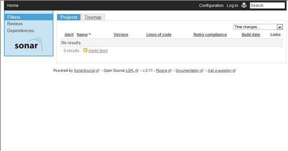
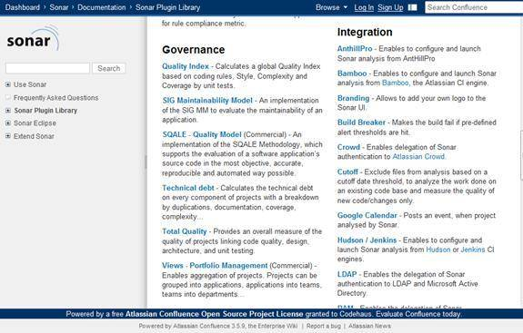
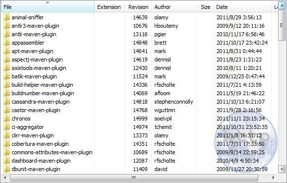
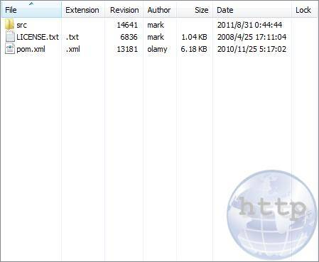
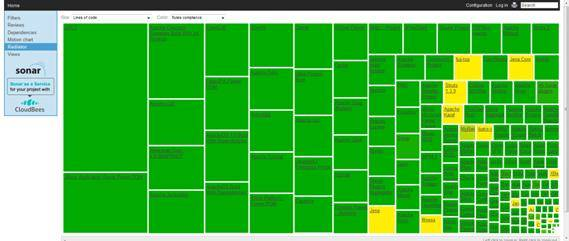
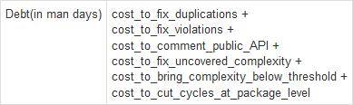
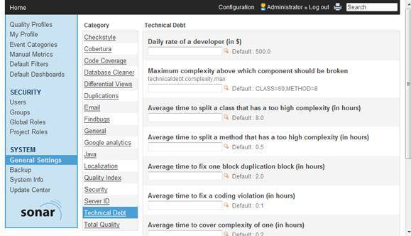
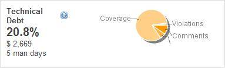
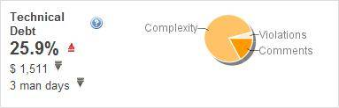

# 使用 Sonar 进行代码质量管理
Sonar 的搭建和使用以及如何在项目中使用 Maven 插件方便地进行代码质量管理

**标签:** Java,持续集成

[原文链接](https://developer.ibm.com/zh/articles/j-lo-sonar/)

滕瑞, 占宇剑

发布: 2012-04-24

* * *

## Sonar 概述

Sonar 是一个用于代码质量管理的开放平台。通过插件机制，Sonar 可以集成不同的测试工具，代码分析工具，以及持续集成工具。

与持续集成工具（例如 Hudson/Jenkins 等）不同，Sonar 并不是简单地把不同的代码检查工具结果（例如 FindBugs，PMD 等）直接显示在 Web 页面上，而是通过不同的插件对这些结果进行再加工处理，通过量化的方式度量代码质量的变化，从而可以方便地对不同规模和种类的工程进行代码质量管理。

在对其他工具的支持方面，Sonar 不仅提供了对 IDE 的支持，可以在 Eclipse 和 IntelliJ IDEA 这些工具里联机查看结果；同时 Sonar 还对大量的持续集成工具提供了接口支持，可以很方便地在持续集成中使用 Sonar。

此外，Sonar 的插件还可以对 Java 以外的其他编程语言提供支持，对国际化以及报告文档化也有良好的支持。

## Sonar 的安装

Sonar 是 Codehaus 上面的一个开源项目，使用的是 LGPL V3 软件许可。我们可以在其官方网站上下载其源代码及安装包。

其源代码需要使用分布式版本控制软件 Git 进行检出（Check Out），命令行方式如下：

`git clone git://github.com/SonarSource/sonar.git`

本文主要介绍 Sonar 的使用方法，只需要到 [Sonar 网站](https://www.sonarsource.com/) 下载最近的发行包即可，本文写作时最新的版本为 2.11。

下载 zip 包后，直接解压到任意目录，由于 Sonar 自带了 Jetty 6 的应用服务器环境，所以不需要额外的安装就可以使用，值得一提的是 Sonar 也支持部署在 Apache Tomcat 应用服务器中。

在 windows 环境中，直接启动 Soanr 的 bin 目录下 windows-x86-64\\StartSonar.bat 即可。

然后在浏览器中访问：`http://localhost:9000/`

##### 图 1\. Sonar 访问界面



这样就成功安装并启动了 Sonar，但其中没有安装插件，需要用户下载并安装自己所需要的插件。本节以 Quality Index Plugin 为例，介绍如何下载及安装 Sonar 插件。

首先访问 Sonar 主页中 Dashboard > Sonar > Documentation > Sonar Plugin Library 路径

##### 图 2\. Sonar 插件的下载



进入 Quality Index 插件，点击下载路径

##### 图 3\. Quality Index Plugin 下载


然后将下载的 sonar-quality-index-plugin-1.1.3.jar 文件放到 sonar-2.11\\extensions\\plugins 路径下。重启 Sonar，该插件就在 Sonar 的平台上运行并开始工作。

### 数据库设置

Sonar 默认使用的是 Derby 数据库，但这个数据库一般用于评估版本或者测试用途。商用及对数据库要求较高时，建议使用其他数据库。Sonar 可以支持大多数主流关系型数据库（例如 Microsoft SQL Server, MySQL, Oracle, PostgreSQL 等）

本文以 MySQL 为例说明如何更改 Sonar 的数据库设置：

1. 在 MySQL 中创建 sonar 用户


    ```
    CREATE USER sonar IDENTIFIED BY 'sonar';

    GRANT ALL PRIVILEGES ON *.* TO 'sonar'@'localhost' \
    IDENTIFIED BY 'sonar' WITH GRANT OPTION;

    ```


    Show moreShow more icon

2. 将 MySQL 的驱动文件（如 mysql-connector-java-5.1.13.jar）拷贝到 sonar-2.11\\extensions\\jdbc-driver\\mysql 目录

3. 修改 sonar-2.11\\conf\\sonar.properties 文件，用 # 注释原来 Derby 的配置项，并打开 MySQL 数据库的配置项:


    ```
    # Comment the following lines to deactivate the default embedded database.
    #sonar.jdbc.url: jdbc:derby://localhost:1527/sonar;create=true
    #sonar.jdbc.driverClassName: org.apache.derby.jdbc.ClientDriver
    #sonar.jdbc.validationQuery: values(1)

    ～～～～～～～～～～～～～～～省略部分～～～～～～～～～～～～～～～～～～

    #----- MySQL 5.x/6.x
    # Comment the embedded database and uncomment the following
    #properties to use MySQL. The validation query is optional.
    sonar.jdbc.url: \
    jdbc:mysql://localhost:3306/sonar?useUnicode=true&characterEncoding=utf8
    sonar.jdbc.driverClassName: com.mysql.jdbc.Driver
    #sonar.jdbc.validationQuery: select 1

    ```


    Show moreShow more icon

4. 重启 Sonar。


## 使用 Sonar 进行代码质量管理

为了不涉及代码的版权问题及方便读者试验，本节以开源项目 Mojo 为例，说明如何使用 Sonar 对源代码进行质量管理，在不涉及编译的情况下，本文尽量使用 Sonar 的 Nemo 演示功能。

首先，需要从 [Mojo 首页](https://www.mojohaus.org/) 上下载源代码（本文使用 TortoiseSVN 工具），如图所示，Mojo 项目包括了许多工程。

##### 图 4\. Mojo 工程文件夹



其中的每个工程都是一个 Maven 项目，如图所示：

##### 图 5\. Maven 工程文件



编译命令如下：

```
mvn clean install

```

Show moreShow more icon

编译成功后，再使用如下命令：

```
mvn sonar:sonar

```

Show moreShow more icon

Maven 插件会自动把所需数据（如单元测试结果、静态检测结果等）上传到 Sonar 服务器上，需要说明的是，关于 Sonar 的配置并不在每个工程的 pom.xml 文件里，而是在 Maven 的配置文件 settings.xml 文件里，具体配置如下：

```
<profile>
     <id>sonar</id>
     <activation>
         <activeByDefault>true</activeByDefault>
     </activation>
     <properties>
          <sonar.jdbc.url>
          jdbc:mysql://localhost:3306/sonar?useUnicode=true&characterEncoding=utf8
          </sonar.jdbc.url>
          <sonar.jdbc.driver>com.mysql.jdbc.Driver</sonar.jdbc.driver>
          <sonar.jdbc.username>sonar</sonar.jdbc.username>
          <sonar.jdbc.password>sonar</sonar.jdbc.password>
         <sonar.host.url>http://localhost:9000</sonar.host.url>
     </properties>
</profile>

```

Show moreShow more icon

将 Soanr 所需要的数据上传到 Sonar 服务器上之后，Sonar 安装的插件会对这些数据进行分析和处理，并以各种方式显示给用户，从而使用户方便地对代码质量的监测和管理。

例如 Radiator 插件可以根据项目的规模进行排序，并用不同演示显示代码质量：

##### 图 6\. Radiator 插件的显示



### Sonar 插件的配置

前面已经提到，Sonar 的主要特色是对不同工具产生的检查结果进行再加工处理，Sonar 还向用户提供了对数据进行个性化处理的方法。

本节以 Technical Debt 插件为例说明如何通过设置参数影响最后的报告结果。首先了解一下这个插件中的”技术债务”的概念，这个概念最早是在 1992 年由 Ward Cunningham 在他的论文”The WyCash Portfolio Management System”中提出的，之后被软件工程界接受并推广，《重构》的作者 Martin Fowler 也在其 [网站](https://www.martinfowler.com/bliki/TechnicalDebt.html) 上对技术债务有所介绍。其实原理可以理解为”出来混早晚要还的”，当前不规范的代码，会对以后产品修改的成本造成影响。

Soanr 的 Technical Debt 插件提供了默认的计算公式，通过对其中的权重参数进行配置，可以适应不同公司和项目对技术债务的计算。

##### 图 7\. Technical Debt 计算公式



以上的各项数据指标，可以根据自己公司和项目的不同情况进行设置，如图所示：

##### 图 8\. Sonar 配置界面



例如默认参数下同一个项目的技术债务指标如下：

##### 图 9\. 默认参数下 Technical Debt 结果



修改了参数后的结果为：

##### 图 10\. 配置参数后 Technical Debt 结果



可见将 Average time to cover complexity of one (in hours) 从 0.2 修改为 0.01 后，Coverage 的权重变小了，从而达到忽略单元测试覆盖率的作用。不同的公司和项目可以根据需要调整各自的参数，参数的调优和策略不在本文的讨论范围之内。

通过以上的示例可以看出，Sonar 使用不同类型的图表显示给用户代码质量的结果，并且这些图表不是简单地对单元测试覆盖率或者静态检测工具的结果进行显示，而是根据软件工程理论进行了二次加工后的结果，更加科学和直观。

## 结束语

Sonar 为代码的质量管理提供了一个平台，对传统的代码静态检测如 PMD、FindBugs 等工具进行整合，可以说是目前最强大的代码质量管理工具之一。