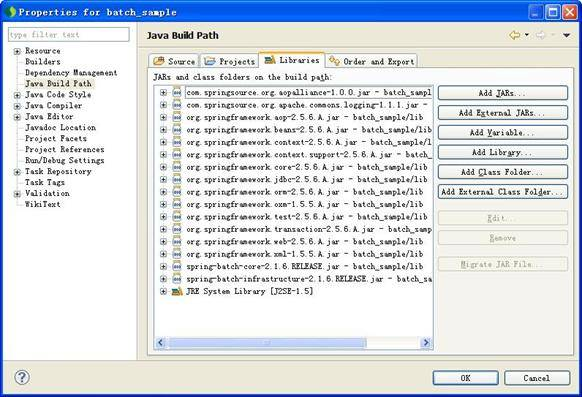

# 使用 Spring Batch 构建企业级批处理应用，第 1 部分
了解如何开发基于 Spring Batch 的批处理程序和相关核心概念

**标签:** Java

[原文链接](https://developer.ibm.com/zh/articles/j-lo-springbatch1/)

刘光瑞

发布: 2012-02-16

* * *

## 引言

### 总述

本系列文章旨在通过示例搭建以及特性介绍，详细讲述如何利用 Spring Batch 开发企业批处理应用。本系列文章共分为三部分，第一部分初步介绍了批处理以及 Spring Batch 的相关概念，同时搭建了一个简单的基于 Spring Batch 的批处理应用。第二部分介绍了 Step Flow 以及并发支持。第三部分则主要介绍了 Spring Batch 对任务监控的支持。下面让我们进入第一部分内容。

### 什么是批处理

在现代企业应用当中，面对复杂的业务以及海量的数据，除了通过庞杂的人机交互界面进行各种处理外，还有一类工作，不需要人工干预，只需要定期读入大批量数据，然后完成相应业务处理并进行归档。这类工作即为”批处理”。

从上面的描述可以看出，批处理应用有如下几个特点：

- 数据量大，少则百万，多则上亿的数量级。
- 不需要人工干预，由系统根据配置自动完成。
- 与时间相关，如每天执行一次或每月执行一次。

同时，批处理应用又明显分为三个环节：

- 读数据，数据可能来自文件、数据库或消息队列等
- 数据处理，如电信支撑系统的计费处理
- 写数据，将输出结果写入文件、数据库或消息队列等

因此，从系统架构上，应重点考虑批处理应用的事务粒度、日志监控、执行、资源管理（尤其存在并发的情况下）。从系统设计上，应重点考虑数据读写与业务处理的解耦，提高复用性以及可测试性。

### 什么是 Spring Batch

Spring Batch 作为 Spring 的子项目，是一款基于 Spring 的企业批处理框架。通过它可以构建出健壮的企业批处理应用。Spring Batch 不仅提供了统一的读写接口、丰富的任务处理方式、灵活的事务管理及并发处理，同时还支持日志、监控、任务重启与跳过等特性，大大简化了批处理应用开发，将开发人员从复杂的任务配置管理过程中解放出来，使他们可以更多地去关注核心的业务处理过程。

另外我们还需要知道，Spring Batch 是一款批处理应用框架，不是调度框架。它只关注批处理任务相关的问题，如事务、并发、监控、执行等，并不提供相应的调度功能。因此，如果我们希望批处理任务定期执行，可结合 Quartz 等成熟的调度框架实现。

下面将通过一个示例详细介绍如何使用 Spring Batch 搭建批处理应用。这个示例比较简单，对系统中所有用户发送一封缴费提醒通知。此处，我们简单地将缴费提醒输出到控制台。当然，随着介绍的深入，我将逐渐丰富该功能，使其最终完整展示 Spring Batch 的各种特性。

## 环境搭建

首先，从 Spring 官方网站下载 Spring Batch 发布包（见 参考资源 ）。本文基于 Spring Batch 2.1.6（当前最新版本为 2.1.8）以及 Spring 2.5.6 版本构建。我们可以看到 Spring Batch 共包含 spring-batch-core 和 spring-batch-infrastructure 两个包。spring-batch-core 主要包含批处理领域相关类，而 spring-batch-infrastructure 提供了一个基础访问处理框架。

接下来，让我们新建一个 Eclipse 工程，并将 Spring Batch 以及 Spring 相关包添加到依赖环境，如 图 1 所示

##### 图 1\. 依赖环境



环境搭建完成后，让我们看一下如何一步步构建一个批处理应用。

## 构建应用

如”引言”中所述 Spring Batch 按照关注点的不同，将整个批处理过程分为三部分：读、处理、写，从而将批处理应用进行合理解耦。同时，Spring Batch 还针对读、写操作提供了多种实现，如消息、文件、数据库。对于数据库，还提供了 Hibernate、iBatis、JPA 等常见 ORM 框架的读、写接口支持。

### 对象定义

首先我们需要编写用户以及消息类，比较简单，如清单 1 和 清单 2 所示：

##### 清单 1\. User 类

```
package org.springframework.batch.sample;

public class User {
    private String name;
    private Integer age;
    public String getName() {return name;}
    public void setName(String name) {this.name = name;}
    public Integer getAge() {return age;}
    public void setAge(Integer age) {this.age = age;}
}

```

Show moreShow more icon

##### 清单 2\. Message 类

```
package org.springframework.batch.sample;

public class Message {
    private String content;
    public String getContent() {return content;}
    public void setContent(String content) {this.content = content;}
}

```

Show moreShow more icon

### 读写及处理接口

首先，所有 Spring Batch 的读操作均需要实现 ItemReader 接口，而且 Spring Batch 为我们提供了多种默认实现，尤其是基于 ORM 框架的读接口，同时支持基于游标和分页两类操作。因此，多数情况下我们并不需要手动编写 ItemReader 类，而是直接使用相应实现类即可。

在该示例中，我们使用 org.springframework.batch.item.file.FlatFileItemReader 类从文件中进行信息读入，用户信息格式定义如 清单 3 所示。

##### 清单 3\. 用户信息

```
User1,20
User2,21
User3,22
User4,23
User5,24
User6,25
User7,26
User8,27
User9,28
User10,29

```

Show moreShow more icon

该类封装了文件读操作，仅仅需要我们手动设置 LineMapper 与访问文件路径即可。Spring Batch 通过 LineMapper 可以将文件中的一行映射为一个对象。我们不难发现，Spring Batch 将文件操作封装为类似 Spring JDBC 风格的接口，这也与 Spring 一贯倡导的接口统一是一致的。此处我们使用 org.springframework.batch.item.file.mapping.DefaultLineMapper 进行行映射。读操作的配置信息如 清单 4 所示：

##### 清单 4\. message\_job.xml

```
<beans:bean id="messageReader"
      class="org.springframework.batch.item.file.FlatFileItemReader">
    <beans:property name="lineMapper" ref="lineMapper">
    </beans:property>
    <beans:property name="resource"
    value="classpath:/users.txt"></beans:property>
</beans:bean>
<beans:bean id="lineMapper"
    class="org.springframework.batch.item.file.mapping.DefaultLineMapper">
    <beans:property name="lineTokenizer">
        <beans:bean
class="org.springframework.batch.item.file.transform.DelimitedLineTokenizer">
        </beans:bean>
    </beans:property>
    <beans:property name="fieldSetMapper">
        <beans:bean class="org.springframework.batch.sample.UserMapper">
        </beans:bean>
    </beans:property>
</beans:bean>

```

Show moreShow more icon

从清单我们可以知道，DefaultLineMapper 需要设置 lineTokenizer 和 fieldSetMapper 两个属性，首先通过 lineTokenizer 完成文件行拆分，并封装为一个属性结果集，因为我们使用”,”分隔用户属性，所以需要将 lineTokenizer 设置为 DelimitedLineTokenizer。最后通过 fieldSetMapper 完成将结果集封装为一个 POJO 对象。具体实现如 清单 5 所示：

##### 清单 5\. UserMapper 类

```
package org.springframework.batch.sample;

import org.springframework.batch.item.file.mapping.FieldSetMapper;
import org.springframework.batch.item.file.transform.FieldSet;
import org.springframework.validation.BindException;

public class UserMapper implements FieldSetMapper<User> {
    public User mapFieldSet(FieldSet fs) throws BindException {
        User u = new User();
        u.setName(fs.readString(0));
        u.setAge(fs.readInt(1));
        return u;
    }
}

```

Show moreShow more icon

该接口的实现方式与 Spring JDBC 的 RowMapper 极其相似。

接下来，再让我们看一下如何实现写操作。Spring Batch 所有写操作均需要实现 ItemWriter 接口。该接口只有一个方法 void write(List<? extends T> items)，参数是输出结果的列表。之所以如此定义，是为了便于我们进行批量操作，以提高性能。每次传入的列表由事务提交粒度确定，也就是说 Spring Batch 每次将提交的结果集传入写操作接口。因为我们要做的仅仅是将缴费通知输出到控制台，所以，写操作实现如 清单 6 所示：

##### 清单 6\. MessagesItemWriter 类

```
package org.springframework.batch.sample;

import java.util.List;
import org.springframework.batch.item.ItemWriter;

public class MessagesItemWriter implements ItemWriter<Message>{
    public void write(List<? extends Message> messages) throws Exception {
        System.out.println("write results");
        for (Message m : messages) {
            System.out.println(m.getContent());
        }
    }
}

```

Show moreShow more icon

同 ItemReader 一样，Spring Batch 也为我们提供了多样的写操作支持，具体可阅读 Spring Batch 参考手册，此处不再赘述。

最后，再看一下如何实现业务处理。Spring Batch 提供了 ItemProcessor 接口用于完成相应业务处理。在本示例中，即为根据用户信息生成一条缴费通知信息，如 清单 7 所示：

##### 清单 7\. MessagesItemProcessor 类

```
package org.springframework.batch.sample;

import org.springframework.batch.item.ItemProcessor;

public class MessagesItemProcessor implements ItemProcessor<User, Message> {

    public Message process(User user) throws Exception {
        Message m = new Message();
        m.setContent("Hello " + user.getName()
                + ",please pay promptly at the end of this month.");
        return m;
    }

}

```

Show moreShow more icon

### 任务定义

通过上面一节，我们已经完成了批处理任务的读数据、处理过程、写数据三个过程。那么，我们如何将这三部分结合在一起完成批处理任务呢？

Spring Batch 将批处理任务称为一个 Job，同时，Job 下分为多个 Step。Step 是一个独立的、顺序的处理步骤，包含该步骤批处理中需要的所有信息。多个批处理 Step 按照一定的流程组成一个 Job。通过这样的设计方式，我们可以灵活配置 Job 的处理过程。

接下来，让我们看一下如何配置缴费通知的 Job，如 清单 8 所示：

##### 清单 8\. message\_job.xml

```
<job id="messageJob">
<step id="messageStep">
    <tasklet>
       <chunk reader="messageReader" processor="messageProcessor"
           writer="messageWriter" commit-interval="5"
           chunk-completion-policy="">
        </chunk>
    </tasklet>
</step>
</job>

```

Show moreShow more icon

如上，我们定义了一个名为”messageJob”的 Job，该 Job 仅包含一个 Step。在配置 Step 的过程中，我们不仅要指定读数据、处理、写数据相关的 bean，还要指定 commit-interval 和 chunk-completion-policy 属性。前者指定了该 Step 中事务提交的粒度，取值为 5 即表明每当处理完毕读入的 5 条数据时，提交一次事务。后者指定了 Step 的完成策略，即当什么情况发生时表明该 Step 已经完成，可以转入后续处理。由于没有明确指定相应的类，Spring Batch 使用默认策略，即当读入数据为空时认为 Step 结束。

最后，我们还需要配置一个 JobRepository 并为其指定一个事务管理器，该类用于对 Job 进行管理，如 清单 9 所示：

##### 清单 9\. message\_job.xml

```
<beans:bean id="jobRepository"
class="org.springframework.batch.core.repository.support.MapJobRepositoryFactoryBean">
        <beans:property name="transactionManager" ref="transactionManager" />
</beans:bean>

<beans:bean id="transactionManager"
class="org.springframework.batch.support.transaction.ResourcelessTransactionManager"/>

```

Show moreShow more icon

因为我们整个示例不需要数据库操作，所以选择了使用 MapJobRepositoryFactoryBean 和 ResourcelessTransactionManager。

所有配置完成以后，进入最后一步——任务执行。

### 任务执行

那么如何运行一个 Job 呢？ Spring Batch 提供了 JobLauncher 接口用于运行 Job，并提供了一个默认实现 SimpleJobLauncher。先让我们看一下具体执行代码，如 清单 10 所示：

##### 清单 10\. Main 类

```
public class Main {
    public static void main(String[] args) {
        ClassPathXmlApplicationContext c =
                 new ClassPathXmlApplicationContext("message_job.xml");
        SimpleJobLauncher launcher = new SimpleJobLauncher();
        launcher.setJobRepository((JobRepository) c.getBean("jobRepository"));
        launcher.setTaskExecutor(new SimpleAsyncTaskExecutor());
        try {
             launcher.run((Job) c.getBean("messageJob"), new JobParameters());
        } catch (Exception e) {
        e.printStackTrace();
        }
    }
}

```

Show moreShow more icon

首先，我们需要为 JobLauncher 指定一个 JobRepository，该类负责创建一个 JobExecution 对象来执行 Job，此处直接从上下文获取即可。其次，需要指定一个任务执行器，我们使用 Spring Batch 提供的 SimpleAsyncTaskExecutor。最后，通过 run 方法来执行指定的 Job，该方法包含两个参数，需要执行的 Job 以及执行参数。您可以通过运行示例工程查看运行结果。由于 MessageItemWriter 在每次输出结果前，先打印了一行提示，因此您可以明显看出输出分 2 组进行打印，即事务被提交了 2 次（因为我们设置的事务粒度为 5。）。

从业务功能上考虑，同一任务应该尽量避免重复执行（即相同条件下的任务只能成功运行一次），试想如果本示例中发送缴费通知过多只能导致用户不满，那么电信计费批处理任务重复执行则将导致重复计费，从而使用户遭受损失。幸运的是，Spring Batch 已经为我们考虑好了这些。

对于 Spring Batch 来说，JobParameters 相同的任务只能成功运行一次。您如果在示例 Main 类中连续运行同一 Job，将会得到如下异常（见 清单 11 ）：

##### 清单 11\. 异常信息

```
org.springframework.batch.core.repository.JobInstanceAlreadyCompleteException:
A job instance already exists and is complete for parameters={}.
If you want to run this job again, change the parameters.

```

Show moreShow more icon

因此，如果我们希望该任务是周期执行的（如每月执行一次），那么必须保证周期内参数是唯一。假如该客户要求我们每月为用户发送一次缴费通知。我们的任务执行可以如 清单 12 所示：

##### 清单 12\. Main 类

```
Map<String,JobParameter> parameters = new HashMap<String,JobParameter>();
parameters.put(RUN_MONTH_KEY,new JobParameter("2011-10"));
launcher.run((Job) c.getBean("messageJob"),new JobParameters(parameters));
parameters.put(RUN_MONTH_KEY,new JobParameter("2011-11"));
launcher.run((Job) c.getBean("messageJob"),new JobParameters(parameters));

```

Show moreShow more icon

在示例中，我将执行月份作为 Job 的参数传入，分别执行了 10、11 月两个月的任务。

### 任务重试

既然相同参数的任务只能成功执行一次，那么，如果任务失败该如何处理？此时，需要考虑的是，既然任务步骤有事务提交粒度，那么可能任务已经提交了部分处理结果，这部分不应该被重复处理。也就是说，此时应该有重试操作。

在 Spring Batch 中，通过配置可以实现步骤 Step 的重试，如 清单 13 所示：

##### 清单 13\. message\_job.xml

```
<job id="messageJob" restartable="true">
    <step id="messageStep">
        <tasklet>
            <chunk reader="messageReader" processor="messageProcessor"
                                                   writer="messageWriter"
                commit-interval="5" chunk-completion-policy="" retry-limit="2">
                <retryable-exception-classes>
                    <include class="java.lang.RuntimeException" />
                </retryable-exception-classes>
            </chunk>
        </tasklet>
    </step>
</job>

```

Show moreShow more icon

我们可以看到，主要分两部分：首先，需要设置重试次数，其次是当执行过程中捕获到哪些异常时需要重试。如果在执行过程中捕获到重试异常列表中的异常信息，则进行重试操作。如果重试操作达到最大次数仍提示异常，则认为任务执行失败。对于异常信息的配置，除了通过 include 配置包含列表外，也可以通过 exclude 配置排除列表。

由于通过配置进行的 Step 重试是自动的，因此较难控制（多用于网络访问异常等不需要人工干预的情况）。可以考虑一下本示例，如果有一个用户的信息有问题，名字为空，不能发送缴费通知，步骤重试便不合适了，此时我们可以对 Job 进行重试操作。

Spring Batch 允许重复执行未成功的 Job，而每次执行即为一次重试操作。示例代码如 清单 14 所示：

##### 清单 14\. Main 类

```
Map<String,JobParameter> parameters = new HashMap<String,JobParameter>();
parameters.put(RUN_MONTH_KEY,new JobParameter("2011-10"));
launcher.run((Job) c.getBean("messageJob"),new JobParameters(parameters));
Thread.sleep(10000);
launcher.run((Job) c.getBean("messageJob"),new JobParameters(parameters));

```

Show moreShow more icon

您可以通过如下步骤查看运行结果：首先，将 users.txt 文件中的第 7 行（之所以指定该行，便于验证事务提交以及重复执行的起始位置）的用户名修改为空。其次，运行示例。最后，在程序出现异常提示时，更新第 7 行的用户名（为了便于演示，程序在两次任务执行过程中等待 10 秒钟）。

您可以在控制台中很明显的看到，任务先打印了 5 条记录（第一次事务提交），然后出现异常信息，待我们将错误更正后，又打印了 5 条记录，任务最终成功完成。

从输出结果，我们可以知道 Spring Batch 是从出错的事务边界内第一条记录重复执行的，这样便确保了数据完整性，而且所有这一切对于用户均是透明的。

那么 Spring Batch 是如何做到这一步的呢？这与 Spring Batch 的运行时管理是分不开的。

## 运行时管理

Spring Batch 提供了如 表 1 所示的类用于记录每个 Job 的运行信息：

##### 表 1\. 运行时类信息

类名描述JobInstance该类记录了 Job 的运行实例。举例：10 月和 11 月分别执行同一 Job，将生成两个 JobInstance。主要信息有：标识、版本、Job 名称、Job 参数JobExecution该类记录了 Job 的运行记录。如上面的示例，Job 第一次运行失败，第二次运行成功，那么将形成两条运行记录，但是对应的是同一个运行实例。主要信息有：Job 的运行时间、运行状态等。JobParameters该类记录了 Job 的运行参数ExecutionContext该类主要用于开发人员存储任务运行过程中的相关信息（以键值对形式），主要分为 Job 和 Step 两个范围StepExecution该类与 JobExecution 类似，主要记录了 Step 的运行记录。包括此次运行读取记录条数、输出记录条数、提交次数、回滚次数、读跳过条数、处理跳过条数、写跳过条数等信息

Spring Batch 通过 JobRepository 接口维护所有 Job 的运行信息，此外 JobLauncher 的 run 方法也返回一个 JobExecution 对象，通过该对象可以方便的获得 Job 其他的运行信息，代码如 清单 15 所示：

##### 清单 15\. Main 类

```
Map<String,JobParameter> parameters = new HashMap<String,JobParameter>();
parameters.put(RUN_MONTH_KEY,new JobParameter("2011-10"));
JobExecution je =
        launcher.run((Job) c.getBean("messageJob"),new JobParameters(parameters));
System.out.println(je);
System.out.println(je.getJobInstance());
System.out.println(je.getStepExecutions());

```

Show moreShow more icon

输出信息如 清单 16 所示：

##### 清单 16\. 输出结果

```
JobExecution: id=0, version=2, startTime=Tue Nov 15 21:00:09 CST 2011,
endTime=Tue Nov 15 21:00:09 CST 2011, lastUpdated=Tue Nov 15 21:00:09 CST 2011,
status=COMPLETED, exitStatus=exitCode=COMPLETED;exitDescription=,
job=[JobInstance: id=0, version=0, JobParameters=[{run.month=2011-10}], Job=[messageJob]]

JobInstance: id=0, version=0, JobParameters=[{run.month=2011-10}], Job=[messageJob]

[StepExecution: id=1, version=5, name=messageStep, status=COMPLETED,
exitStatus=COMPLETED, readCount=10, filterCount=0, writeCount=10 readSkipCount=0,
writeSkipCount=0, processSkipCount=0, commitCount=3 , rollbackCount=0,
exitDescription=]

```

Show moreShow more icon

从日志您可以发现事务一共提交了 3 次，这与前面的说明是不一致的。之所以会如此是因为当事务提交粒度恰好可以被记录数整除时，事务会有一次空提交。

关于 Spring Batch 运行时信息管理，将在讲解 Job 监控时再详细介绍，此处不再赘述，你也可以查看 Spring Batch 参考资料了解相关信息。

## 总结

本文通过一个简单示例演示了如何构建 Spring Batch 应用，同时介绍了 Spring Batch 的相关核心概念。希望您通过本文可以掌握 Spring Batch 的基本功能。在接下来的文章中，我将继续介绍 Spring Batch 的两个重要特性：Job 流和并发。

## Download

[batch\_sample.zip](http://www.ibm.com/developerworks/cn/java/j-lo-springbatch1/batch_sample.zip): 示例代码