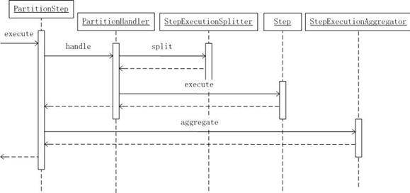

# 使用 Spring Batch 构建企业级批处理应用，第 2 部分
Spring Batch 的 Step Flow 以及并发处理两项重要特性

**标签:** Java

[原文链接](https://developer.ibm.com/zh/articles/j-lo-springbatch2/)

刘光瑞

发布: 2012-08-02

* * *

## 前言

在本系列文章的第 1 部分，我们搭建了一个用户缴费通知的批处理任务。尽管这个简单的应用展现了 Spring Batch 的基本功能，但是它与真实的应用相去甚远。在实际应用中，我们的 Job 可能必须要包含多个 Step，为了提高性能，我们可能需要考虑 Job 的并发问题。Spring Batch 在这些方面又提供了哪些好的特性呢？让我们继续。

## Step Flow

通过前文我们已经知道，Step 是一个独立的、顺序的处理步骤，包含完整的输入、处理以及输出。但是在企业应用中，我们面对的更多情况是多个步骤按照一定的顺序进行处理。因此如何维护步骤之间的执行顺序是我们需要考虑的。Spring Batch 提供了 Step Flow 来解决这个问题。

### 示例改进

让我们回到用户缴费通知的 Job。客户提出了进一步的需求：计费、扣费、缴费通知要确保顺序执行。首先，为每个用户生成账单，然后从用户余额上进行扣除，对于余额不足的用户，发送缴费通知。下面看一下如何使用 Step Flow 实现该需求。

在讲解 Step Flow 之前，我们先对第 1 部分的示例进行改进，将其由文件操作迁移到数据库上，这样便于我们后续的讲解。数据库初始化脚本见 init\_db\_mysql.sql（位于示例代码包 batch\_sample 根目录下），具体配置如清单 1 所示：

##### 清单 1\. billing\_job.xml

```
<beans:bean id="jobRepository"
class="org.springframework.batch.core.repository.support.JobRepositoryFactoryBean">
<beans:property name="dataSource" ref="dataSource" />
<beans:property name="transactionManager" ref="transactionManager" />
</beans:bean>
<beans:bean id="userDbReader"
    class="org.springframework.batch.item.database.JdbcPagingItemReader">
    <beans:property name="dataSource" ref="dataSource" />
    <beans:property name="rowMapper" ref="userDbMapper" />
    <beans:property name="queryProvider" ref="userQueryProvider" />
</beans:bean>
<beans:bean id="userDbMapper"
    class="org.springframework.batch.sample.UserDbMapper" />
<beans:bean id="userQueryProvider"
    class="org.springframework.batch.item.database.support.MySqlPagingQueryProvider">
    <beans:property name="selectClause" value="u.id,u.name,u.age,u.balance" />
    <beans:property name="fromClause" value="users u" />
    <beans:property name="sortKey" value="u.id" />
</beans:bean>
<beans:bean id="messageDbWriter"
    class="org.springframework.batch.item.database.JdbcBatchItemWriter">
    <beans:property name="dataSource" ref="dataSource" />
    <beans:property name="sql"
    value="insert into messages(id,user_id,content) values(:id,:user.id,:content)" />
    <beans:property name="itemSqlParameterSourceProvider"
        ref="itemSqlParameterSourceProvider" />
</beans:bean>
<beans:bean id="itemSqlParameterSourceProvider"
class="org.springframework.batch.item.database.BeanPropertyItemSqlParameterSourceProvider"
/>

```

Show moreShow more icon

我们分别使用 Spring Batch 提供的 JdbcPagingItemReader 和 JdbcBatchItemWriter 进行读写。同时，我将 jobRepository 修改为 JobRepositoryFactoryBean，因此，运行示例前，您还需要执行 Spring Batch 提供的 schema-mysql.sql（位于 core 包 org\\springframework\\batch\\core 目录下）。相关内容将在第 3 部分详细讲解，此处不再赘述。

### 第一个流程

在配置 Step 时，我们可以指定其 next 属性，该属性指向另一个 Step。通过配置 Step 的 next 属性，我们便可以轻易实现上述流程。具体如清单 2 所示

##### 清单 2\. billing\_job.xml

```
<job id="billingJob" restartable="true">
    <step id="billingStep" next="payStep">
        <tasklet>
            <chunk reader="userDbReader" processor="billingProcessor"
             writer="billDbWriter" commit-interval="5" chunk-completion-policy="">
            </chunk>
        </tasklet>
    </step>
    <step id="payStep" next="messageStep">
        <tasklet>
          <chunk reader="billDbReader" processor="payProcessor" writer="payDbWriter"
            commit-interval="5" chunk-completion-policy=""  skip-limit="100" >
<skippable-exception-classes>
      <include class="org.springframework.batch.sample.MoneyNotEnoughException" />
                </skippable-exception-classes>
            </chunk>
        </tasklet>
    </step>
    <step id="messageStep">
        <tasklet>
            <chunk reader="billArrearsDbReader" processor="messageProcessor"
                    writer="messageDbWriter" commit-interval="5"
                    chunk-completion-policy="">
            </chunk>
        </tasklet>
    </step>
</job>

```

Show moreShow more icon

我们将 billStep 的 next 设置为 payStep，将 payStep 的 next 设置为 messageStep，同时分别指定了读、处理、写接口。Spring Batch 在运行 billingJob 时，首先执行 billingStep，查找用户信息生成账单费用，然后执行 payStep，查找账单信息生成扣费记录，如果用户余额不足则跳过。最后，查找欠费账单，生成缴费通知。只有当上一步执行成功后，才会执行下一步。

billStep 和 payStep 的 ItemProcessor 实现分别如清单 3 和清单 4 所示：

##### 清单 3.BillingItemProcessor 类

```
public class BillingItemProcessor implements ItemProcessor#<User, Bill> {

    public Bill process(User item) throws Exception {
        Bill b = new Bill();
        b.setUser(item);
        b.setFees(70.00);
        b.setPaidFees(0.0);
        b.setUnpaidFees(70.00);
        b.setPayStatus(0);/*unpaid*/
        return b;
    }

}

```

Show moreShow more icon

##### 清单 4.PaymentItemProcessor 类

```
public class PaymentItemProcessor implements ItemProcessor<Bill, PayRecord> {
public PayRecord process(Bill item) throws Exception {
        if (item.getUser().getBalance() <= 0) {
            return null;
        }
        if (item.getUser().getBalance() >= item.getUnpaidFees()) {
            // create payrecord
            PayRecord pr = new PayRecord();
            pr.setBill(item);
            pr.setPaidFees(item.getUnpaidFees());
            // update balance
            item.getUser().setBalance(item.getUser().getBalance() -
                 item.getUnpaidFees());
            // update bill
            item.setPaidFees(item.getUnpaidFees());
            item.setUnpaidFees(0.0);
            item.setPayStatus(1);/* paid */
            return pr;
        } else {
            throw new MoneyNotEnoughException();
        }
    }
}

```

Show moreShow more icon

在清单 3 中，我们为每个用户生成一条 70 元的账单，已缴费用为 0，未缴费用为 70。在清单 4 中，将账单金额从用户余额中扣除，并更新账单已缴和未缴费用，如果余额不足，提示异常（通过清单 2 可知，我们对于此类异常进行了跳过处理）。

此外，我们现在的缴费通知需要基于欠费账单生成，因此，我们需要新提供一个缴费通知的 ItemProcessor，具体如清单 5 所示：

##### 清单 5.ArrearsMessagesItemProcessor 类

```
public class ArrearsMessagesItemProcessor implements
        ItemProcessor<Bill, Message> {

    public Message process(Bill item) throws Exception {
        if (item.getPayStatus() == 0) {/*unpaid*/
            Message m = new Message();
            m.setUser(item.getUser());
            m.setContent("Hello " + item.getUser().getName()
                    + ",please pay promptly at end of this month.");
            return m;
        }
        return null;
    }

}

```

Show moreShow more icon

每个 Step 的读写接口可参照 billing\_job.xml，均使用 Spring Batch 提供的实现类，此处不再赘述（此处需要特别注意 payDbWriter，由于扣费时，我们需要同时生成扣费记录，并更新用户和账单，因此我们使用了 CompositeItemWriter）。至此，我们已经完成了第一步，实现了基本的多步骤顺序处理，您可以运行 Main2，并通过数据库查看运行结果（bills、payrecords、messages）。

### 条件流程和流程决策

通过上面的 Step Flow，我们已经满足了客户的初步需求，但是客户又提出进一步要求：能否当所有用户费用均足够的情况下，不再执行缴费通知处理。因为查询一遍欠费账单在一定程度上还是降低了处理性能。Spring Batch 提供了条件流程和流程决策来支持类似应用场景。

首先，让我们看一下如何使用条件流程来实现该需求。Step 通过在 next 元素上设置 on 属性来支持条件流程，on 属性取值为 Step 的结束状态，如 COMPLETED、FAILED 等，同时还支持 \* 以及 ? 通配符，具体可阅读 参考手册 。

由于我们希望当存在余额不足的情况时，也就是 payStep 的跳过条数大于 0 时，再执行缴费通知 Step，因此，我们需要特殊指定一种结束状态。此处，我们可以为 Step 添加一个监听器，以返回指定的结束状态。

修改后的 payStep 如清单 6 所示，监听器实现如清单 7 所示：

##### 清单 6\. billing\_job.xml

```
<step id="payStep">
    <tasklet>
        <chunk reader="billDbReader" processor="payProcessor" writer="payDbWriter"
            commit-interval="5" chunk-completion-policy="" skip-limit="100">
            <skippable-exception-classes>
                <include
        class="org.springframework.batch.sample.MoneyNotEnoughException" />
            </skippable-exception-classes>
        </chunk>
    </tasklet>
<next on="COMPLETED WITH SKIPS" to="messageStep"/>
    <listeners>
        <listener ref="payStepCheckingListener"></listener>
    </listeners>
</step>

```

Show moreShow more icon

##### 清单 7\. PayStepCheckingListener 类

```
public class PayStepCheckingListener extends StepExecutionListenerSupport {

    @Override
    public ExitStatus afterStep(StepExecution stepExecution) {
        String exitCode = stepExecution.getExitStatus().getExitCode();
        if (!exitCode.equals(ExitStatus.FAILED.getExitCode())
                && stepExecution.getSkipCount() > 0) {
            return new ExitStatus("COMPLETED WITH SKIPS");
        } else {
            return null;
        }
    }

}

```

Show moreShow more icon

接下来，再让我们看一下如何使用流程决策来实现该功能。多数情况下，Step 的结束状态并不能够满足较为复杂的条件流程，此时便用到了流程决策器。通过它，我们可以根据 Job 和 Step 的各种执行情况返回相应的执行状态来控制流程。

首先，我们需要定义一个流程决策器，代码如清单 8 所示：

##### 清单 8\. MessagesDecider 类

```
public class MessagesDecider implements JobExecutionDecider {

    public FlowExecutionStatus decide(JobExecution jobExecution,
            StepExecution stepExecution) {
        String exitCode = stepExecution.getExitStatus().getExitCode();
        if (!exitCode.equals(ExitStatus.FAILED.getExitCode())
                && stepExecution.getSkipCount() > 0) {
            return new FlowExecutionStatus("COMPLETED WITH SKIPS");
        } else {
            return FlowExecutionStatus.COMPLETED;
        }
    }

}

```

Show moreShow more icon

与 StepExecutionListener 不同，该类的 decide 方法返回一个 FlowExecutionStatus 对象。与之对应，Job 配置修改为如清单 9 所示：

##### 清单 9\. billing\_job2.xml

```
<job id="billingJob" restartable="true">
    <step id="billingStep" next="payStep">
    </step>
    <step id="payStep" next="decider">
    </step>
    <decision id="decider" decider="messagesDecider">
        <next on="COMPLETED WITH SKIPS" to="messageStep" />
        <end on="COMPLETED" />
    </decision>
    <step id="messageStep">
    </step>
</job>

```

Show moreShow more icon

可以看到 payStep 的 next 变成了 decider，在 decider 中根据返回结果确定执行路径：如果存在跳过的情况，执行 messageStep，否则直接结束 Job（注意：此处我们用到了 end 元素）。

通过上面的讲述，我们大体了解了 Spring Batch 对于条件流程的支持（此外，我们可以通过设置 Step 的 next 属性为先前执行的 Step，从而实现支持循环的 Job，但是笔者并不认为这是实现循环任务的一个好方案，故在此处不做详细讲解），接下来再让我们看一下批处理中另一项重要特征——并发。

## 并发处理

如果我们的批处理任务足够简单，硬件配置及网络环境也足够好，那么我们完全可以将批处理任务设计为单线程，但现实是企业应用对于硬件的要求要比硬件自身发展快的多，更何况还有那么多的企业要在较差的硬件环境中运行自己的企业应用并希望拥有一个可以接受的性能。因此在企业应用中，尤其是涉及到大批量数据处理，并发是不可避免的。那么，Spring Batch 在并发方面又提供了哪些功能支持呢？

首先，Spring Batch 提供了 Step 内的并发，这也是最简单的一种并发处理支持。通过为 Step 设置 task-executor 属性，我们便可以使当前 Step 以并发方式执行。同时，还可以通过 throttle-limit 设置并发线程数（默认为 4）。也就是说您不必修改任何业务处理逻辑，仅仅通过修改配置即可以实现同步到异步的切换。

如果我们希望示例中的 billingStep 以并发方式执行，且并发任务数为 5，那么只需要做如下配置即可，见清单 10：

##### 清单 10\. billing\_job3.xml

```
<step id="billingStep" next="payStep">
    <tasklet task-executor="taskExecutor" throttle-limit="5">
        <chunk reader="userDbReader" processor="billingProcessor"
        writer="billDbWriter" commit-interval="5" chunk-completion-policy="">
        </chunk>
    </tasklet>
</step>
<beans:bean id="taskExecutor"
    class="org.springframework.core.task.SimpleAsyncTaskExecutor">
</beans:bean>

```

Show moreShow more icon

从清单可以看出，我们为 billingStep 指定了一个异步任务执行器 SimpleAsyncTaskExecutor，该执行器将会按照配置创建指定数目的线程来进行数据处理。通过这种方式，避免了我们手动创建并管理线程的工作，使我们只需要关注业务处理本身。

需要补充说明的是，Spring Core 为我们提供了多种执行器实现（包括多种异步执行器），我们可以根据实际情况灵活选择使用。当然，像我们此处需要并发处理时，必须使用异步执行器。几种主要实现如表 1 所示：

##### 表 1\. 任务执行器列表

类名描述是否异步SyncTaskExecutor简单同步执行器否ThrottledTaskExecutor该执行器为其他任意执行器的装饰类，并完成提供执行次数限制的功能视被装饰的执行器而定SimpleAsyncTaskExecutor简单异步执行器，提供了一种最基本的异步执行实现是WorkManagerTaskExecutor该类作为通过 JCA 规范进行任务执行的实现，其包含 JBossWorkManagerTaskExecutor 和 GlassFishWorkManagerTaskExecutor 两个子类是ThreadPoolTaskExecutor线程池任务执行器是

其次，Spring Batch 还支持 Step 间的并发，这是通过 Split Flow 实现的。让我们看看 Split Flow 是如何使用的。在此之前，让我们设想一下，假如客户基于上面的示例提出进一步需求：每月为用户生成扣费通知，并生成账单、扣费、缴费通知（对于费用不足的情况）。

当然，要实现上述需求有很多种方式，比如，按照生成账单、扣费通知、扣费、缴费通知的顺序串行执行，然而，此种处理方式势必会降低性能，即使我们可以使用 Step 多线程处理来提高性能，可仍不是最优方式。那么我们该如何改进呢？显然，我们可以将生成扣费通知和扣费并行执行，因为这两步是完全独立的。修改后的 billing\_job 如清单 11 所示：

##### 清单 11\. billing\_job3.xml

```
<job id="billingJob" restartable="true">
    <step id="billingStep" next="splitStep">
        <tasklet task-executor="taskExecutor" throttle-limit="5">
            <chunk reader="userDbReader" processor="billingProcessor"
        writer="billDbWriter" commit-interval="5" chunk-completion-policy="">
            </chunk>
        </tasklet>
    </step>
    <split id="splitStep" task-executor="taskExecutor"  next="decider">
        <flow>
            <step id="billingMessageStep">
                <tasklet>
                  <chunk reader="billDbReader" processor="billMessageItemProcessor"
                    writer="messageDbWriter" commit-interval="5"
                            chunk-completion-policy="">
                    </chunk>
                </tasklet>
            </step>
        </flow>
        <flow>
            <step id="payStep">
                <tasklet>
                   <chunk reader="billDbReader" processor="payProcessor"
                   writer="payDbWriter" commit-interval="5" chunk-completion-policy=""
                   skip-limit="100">
                    <skippable-exception-classes>
                      <include
                  class="org.springframework.batch.sample.MoneyNotEnoughException" />
                      </skippable-exception-classes>
                    </chunk>
                </tasklet>
            </step>
        </flow>
    </split>
    <decision id="decider" decider="messagesDecider">
        <next on="COMPLETED WITH SKIPS" to="paymentMessageStep" />
        <end on="COMPLETED" />
    </decision>
    <step id="paymentMessageStep">
        <tasklet>
            <chunk reader="billArrearsDbReader" processor="messageProcessor"
                    writer="messageDbWriter" commit-interval="5"
                    chunk-completion-policy="">
            </chunk>
        </tasklet>
    </step>
</job>

```

Show moreShow more icon

从清单 10 可以看出，billingStep 的下一步变成了一个 split 元素，该元素下包含两个 flow。”flow”顾名思义包含一系列可执行的 step，示例中两个 flow 分别包含 billingMessageStep（生成扣费通知）和 payStep 两个 step。Spring Batch 执行 split 时，将会并行执行其下所有 flow，而且只有当所有 step 均执行完毕之后，才会执行 split 元素的下一步，当然，前提是您为 split 元素指定的”task-executor”为 SimpleAsyncTaskExecutor，该属性默认为 SyncTaskExecutor，即串行执行。

通过上述两种方式，我们可以实现 Job 的并发处理，但显然该方式有其局限性，即仅限于单机。

让我们设想一下如下场景：在上述缴费任务中，用户生成账单非常慢（也许是因为业务处理过于复杂，也许因为生成账单的过程中同时处理了好多关联信息）。这种场景我们该怎么优化呢？显然，即便我们将该步骤配置为并行，那么它的优化空间也是有限的，因为线程并发到一定数量之后必定受限于系统硬件配置。这个时候，我们自然会想到修改部署方式，将耗时操作分配到多个机器上并行执行。那么基于 Spring Batch 我们该如何实现呢？此处便用到了 PartitionStep。让我们看一下它是如何执行的，其时序图如图 1 所示：

##### 图 1\. PartitionStep 序列图



从图中我们可以看到，PartitionStep 并不负责读、写数据，它只是根据配置的策略（PartitionHandler）将 StepExecution 进行分解，并委派到指定的 Step 上并行执行（该 Step 可能是本地，也可能是远程），执行完毕后，将所有执行结果进行合并（由 StepExecutionAggregator 完成）作为自身的执行结果。利用 PartitionStep，在委派 Step 为远程调用的情况下，我们可以很容易通过增加从机数目的方式来提高任务运行效率，大大提高了系统的可伸缩性。而且此种方式并不会影响 PartitionStep 所在 Job 的执行顺序，因为 PartitionStep 只有当所有委派 Step 完成之后，才会继续往下执行。

不过使用 PartitionStep 需要注意以下几点：

- 由于数据的读写以及处理均在从机上进行，因此需要确保并发的从机之间不会重复读取数据（当然，这个问题是所有批处理应用采用主从和集群架构时所必须考虑的问题，而并非只有 Spring Batch 才会有）。
- 确保分解到各个从机上的 StepExecution 是不同的。在 StepExecutionSplitter 的默认实现 SimpleStepExecutionSplitter 中，首先通过一个 Partitioner 得到分解后的 ExecutionContext，然后针对每个 ExecutionContext，创建 StepExecution（当然，如果 Step 为重复执行，那么将会得到上次运行的 ExecutionContext 和 StepExecution，而非重新创建）。

从第二点可以看出，通过在 ExecutionContext 设置唯一的信息，我们便可以保证每个从机读取的数据是不同的。

主从方式的具体配置如清单 12 所示：

##### 清单 12\. partition.xml

```
<beans:bean name="step"
    class="org.springframework.batch.core.partition.support.PartitionStep">
    <beans:property name="partitionHandler">
        <beans:bean
class="org.springframework.batch.core.partition.support.TaskExecutorPartitionHandler">
            <beans:property name="step" ref="remoteStep" />
            <beans:property name="gridSize" value="10" />
            <beans:property name="taskExecutor" ref="taskExecutor" />
        </beans:bean>
    </beans:property>
    <beans:property name="stepExecutionSplitter">
      <beans:bean
class="org.springframework.batch.core.partition.support.SimpleStepExecutionSplitter">
            <beans:constructor-arg ref="jobRepository" />
            <beans:constructor-arg ref="messageStep" />
            <beans:constructor-arg ref="simplePartitioner" />
        </beans:bean>
    </beans:property>
    <beans:property name="jobRepository" ref="jobRepository" />
</beans:bean>

<step id="messageStep">
    <tasklet task-executor="taskExecutor">
        <chunk reader="messageReader" processor="messageProcessor"
        writer="messageWriter" commit-interval="5" chunk-completion-policy=""
                retry-limit="2">
            <retryable-exception-classes>
                <include class="java.lang.RuntimeException" />
            </retryable-exception-classes>
        </chunk>
    </tasklet>
</step>
<beans:bean id="remoteStep"
    class="org.springframework.remoting.httpinvoker.HttpInvokerProxyFactoryBean">
    <beans:property name="serviceInterface"
        value="org.springframework.batch.core.Step" />
    <beans:property name="serviceUrl"
         value="${batch.remote.base.url}/steps/messageStep" />
</beans:bean>

```

Show moreShow more icon

此处只采用 Spring Batch 的默认实现，将 Step 发送到一台从机上执行，当然，您完全可以基于 Spring Batch 当前接口，轻易扩展出分发到 N 台从机上执行的实现。

此外，在耗时的 Step 比较独立的情况下（如发送扣费通知的 Step，后续 Step 不会依赖扣费通知 Step 的任何输出结果），我们还可以采用另一种主从架构。在主机上配置一个标准的 Step，其 ItemWriter 负责将读取的记录以 Message 的形式发送给消息中间件（当然，该方案并未充分利用 Spring Batch 的特性，而是由消息中间件完成并发处理）。

### 结束语

通过本文的讲解，您已经基本了解了 Spring Batch 中对流程、条件以及并发的支持。利用 Spring Batch 提供的这些特性，我们完全可以构建出高性能、高可扩展性和可维护性的批处理应用。在本系列文章的最后一部分，我将继续给您介绍 Spring Batch 关于批处理监控方面的内容。