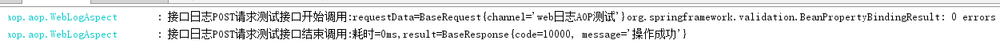
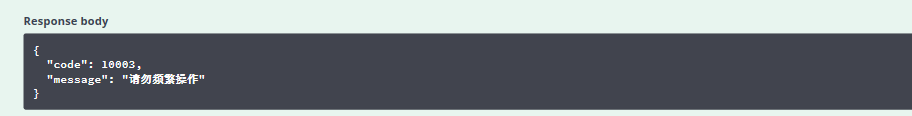

# 使用 Spring Boot AOP 实现 Web 日志处理和分布式锁
通过两个例子来实际地感受 AOP 的强大之处

**标签:** Java,Spring,Web 开发

[原文链接](https://developer.ibm.com/zh/articles/j-spring-boot-aop-web-log-processing-and-distributed-locking/)

甘 朝阳

发布: 2019-06-11

* * *

## AOP

AOP 的全称为 Aspect Oriented Programming，译为面向切面编程。实际上 AOP 就是通过预编译和运行期动态代理实现程序功能的统一维护的一种技术。在不同的技术栈中 AOP 有着不同的实现，但是其作用都相差不远，我们通过 AOP 为既有的程序定义一个切入点，然后在切入点前后插入不同的执行内容，以达到在不修改原有代码业务逻辑的前提下统一处理一些内容（比如日志处理、分布式锁）的目的。

### 为什么要使用 AOP

在实际的开发过程中，我们的应用程序会被分为很多层。通常来讲一个 Java 的 Web 程序会拥有以下几个层次：

- Web 层：主要是暴露一些 Restful API 供前端调用。
- 业务层：主要是处理具体的业务逻辑。
- 数据持久层：主要负责数据库的相关操作（增删改查）。

虽然看起来每一层都做着全然不同的事情，但是实际上总会有一些类似的代码，比如日志打印和安全验证等等相关的代码。如果我们选择在每一层都独立编写这部分代码，那么久而久之代码将变的很难维护。所以我们提供了另外的一种解决方案: AOP。这样可以保证这些通用的代码被聚合在一起维护，而且我们可以灵活的选择何处需要使用这些代码。

### AOP 的核心概念

- **切面（Aspect）** ：通常是一个类，在里面可以定义切入点和通知。
- **连接点（Joint Point）** ：被拦截到的点，因为 Spring 只支持方法类型的连接点，所以在 Spring 中连接点指的就是被拦截的到的方法，实际上连接点还可以是字段或者构造器。
- **切入点（Pointcut）** ：对连接点进行拦截的定义。
- **通知（Advice）** ：拦截到连接点之后所要执行的代码，通知分为前置、后置、异常、最终、环绕通知五类。
- **AOP 代理** ：AOP 框架创建的对象，代理就是目标对象的加强。Spring 中的 AOP 代理可以使 JDK 动态代理，也可以是 CGLIB 代理，前者基于接口，后者基于子类。

## Spring AOP

Spring 中的 AOP 代理还是离不开 Spring 的 IOC 容器，代理的生成，管理及其依赖关系都是由 IOC 容器负责，Spring 默认使用 JDK 动态代理，在需要代理类而不是代理接口的时候，Spring 会自动切换为使用 CGLIB 代理，不过现在的项目都是面向接口编程，所以 JDK 动态代理相对来说用的还是多一些。在本文中，我们将以注解结合 AOP 的方式来分别实现 Web 日志处理和分布式锁。

### Spring AOP 相关注解

- `@Aspect` ： 将一个 java 类定义为切面类。
- `@Pointcut` ：定义一个切入点，可以是一个规则表达式，比如下例中某个 `package` 下的所有函数，也可以是一个注解等。
- `@Before` ：在切入点开始处切入内容。
- `@After` ：在切入点结尾处切入内容。
- `@AfterReturning` ：在切入点 return 内容之后切入内容（可以用来对处理返回值做一些加工处理）。
- `@Around` ：在切入点前后切入内容，并自己控制何时执行切入点自身的内容。
- `@AfterThrowing` ：用来处理当切入内容部分抛出异常之后的处理逻辑。

其中 `@Before` 、 `@After` 、 `@AfterReturning` 、 `@Around` 、 `@AfterThrowing` 都属于通知。

### AOP 顺序问题

在实际情况下，我们对同一个接口做多个切面，比如日志打印、分布式锁、权限校验等等。这时候我们就会面临一个优先级的问题，这么多的切面该如何告知 Spring 执行顺序呢？这就需要我们定义每个切面的优先级，我们可以使用 `@Order(i)` 注解来标识切面的优先级, `i` 的值越小，优先级越高。假设现在我们一共有两个切面，一个 `WebLogAspect` ，我们为其设置 `@Order(100)` ；而另外一个切面 `DistributeLockAspect` 设置为 `@Order(99)` ，所以 `DistributeLockAspect` 有更高的优先级，这个时候执行顺序是这样的：在 `@Before` 中优先执行 `@Order(99)` 的内容，再执行 `@Order(100)` 的内容。而在 `@After` 和 `@AfterReturning` 中则优先执行 `@Order(100)` 的内容，再执行 `@Order(99)` 的内容，可以理解为先进后出的原则。

### 基于注解的 AOP 配置

使用注解一方面可以减少我们的配置，另一方面注解在编译期间就可以验证正确性，查错相对比较容易，而且配置起来也相当方便。相信大家也都有所了解，我们现在的 Spring 项目里面使用了非常多的注解替代了之前的 xml 配置。而将注解与 AOP 配合使用也是我们最常用的方式，在本文中我们将以这种模式实现 Web 日志统一处理和分布式锁两个注解。下面就让我们从准备工作开始吧。

## 准备工作

### 准备一个 Spring Boot 的 Web 项目

你可以通过 [Spring Initializr 页面](https://start.spring.io/) 生成一个空的 Spring Boot 项目，当然也可以下载 [springboot-pom.xml 文件](https://github.com/ganchaoyang/spring-tutorial/blob/master/resources/springboot-pom.xml) ，然后使用 maven 构建一个 Spring Boot 项目。项目创建完成后，为了方便后面代码的编写你可以将其导入到你喜欢的 IDE 中，我这里选择了 Intelli IDEA 打开。

### 添加依赖

我们需要添加 Web 依赖和 AOP 相关依赖，只需要在 pom.xml 中添加如下内容即可：

##### 清单 1\. 添加 web 依赖

```
<dependency>
    <groupId>org.springframework.boot</groupId>
    <artifactId>spring-boot-starter-web</artifactId>
</dependency>

```

Show moreShow more icon

##### 清单 2\. 添加 AOP 相关依赖

```
<dependency>
     <groupId>org.springframework.boot</groupId>
     <artifactId>spring-boot-starter-aop</artifactId>
</dependency>

```

Show moreShow more icon

### 其他准备工作

为了方便测试我还在项目中集成了 Swagger 文档，具体的集成方法可以参照 [在 Spring Boot 项目中使用 Swagger 文档](https://www.ibm.com/developerworks/cn/java/j-using-swagger-in-a-spring-boot-project/index.html) 。另外编写了两个接口以供测试使用，具体可以参考 [本文源码](https://github.com/ganchaoyang/spring-tutorial/tree/master/sb-aop) 。由于本教程所实现的分布式锁是基于 Redis 缓存的，所以需要安装 Redis 或者准备一台 Redis 服务器。

## 利用 AOP 实现 Web 日志处理

### 为什么要实现 Web 日志统一处理

在实际的开发过程中，我们会需要将接口的出请求参数、返回数据甚至接口的消耗时间都以日志的形式打印出来以便排查问题，有些比较重要的接口甚至还需要将这些信息写入到数据库。而这部分代码相对来讲比较相似，为了提高代码的复用率，我们可以以 AOP 的方式将这种类似的代码封装起来。

### Web 日志注解

##### 清单 3\. Web 日志注解代码

```
@Documented
@Retention(RetentionPolicy.RUNTIME)
@Target(ElementType.METHOD)
public @interface ControllerWebLog {
     String name();
     boolean intoDb() default false;

}

```

Show moreShow more icon

其中 `name` 为所调用接口的名称， `intoDb` 则标识该条操作日志是否需要持久化存储，Spring Boot 连接数据库的配置，可以参考 [SpringBoot 项目配置多数据源](https://itweknow.cn/detail?id=76) 这篇文章，具体的数据库结构可以 [点击这里获取](https://github.com/ganchaoyang/spring-tutorial/blob/master/sb-aop/t_log.sql) 。现在注解有了，我们接下来需要编写与该注解配套的 AOP 切面。

### 实现 WebLogAspect 切面

**第 1 步**，我们定义了一个切面类 WebLogAspect 如清单 4 所示。其中@Aspect 注解是告诉 Spring 将该类作为一个切面管理，@Component 注解是说明该类作为一个 Spring 组件。

##### 清单 4\. WebLogAspect

```
@Aspect
@Component
@Order(100)
public class WebLogAspect {
}

```

Show moreShow more icon

**第 2 步**，接下来我们需要定义一个切点。

##### 清单 5\. Web 日志 AOP 切点

```
@Pointcut("execution(* cn.itweknow.sbaop.controller..*.*(..))")
public void webLog() {}

```

Show moreShow more icon

对于 execution 表达式， [官网](https://docs.spring.io/spring/docs/5.1.7.RELEASE/spring-framework-reference/core.html#aop-api-pointcuts-aspectj) 的介绍为（翻译后）：

##### 清单 6\. 官网对 execution 表达式的介绍

```
execution(<修饰符模式>?<返回类型模式><方法名模式>(<参数模式>)<异常模式>?)

```

Show moreShow more icon

其中除了返回类型模式、方法名模式和参数模式外，其它项都是可选的。这个解释可能有点难理解，下面我们通过一个具体的例子来了解一下。在 `WebLogAspect` 中我们定义了一个切点，其 `execution` 表达式为 `* cn.itweknow.sbaop.controller..*.*(..)` ，下表为该表达式比较通俗的解析：

##### 表 1\. `execution()` 表达式解析

**标识符****含义**`execution（）`表达式的主体第一个 `*` 符号表示返回值的类型， `*` 代表所有返回类型`cn.itweknow.sbaop.controller`AOP 所切的服务的包名，即需要进行横切的业务类包名后面的 `..`表示当前包及子包第二个 `*`表示类名， `*` 表示所有类最后的 `.*(..)`第一个 `.` 表示任何方法名，括号内为参数类型， `..` 代表任何类型参数

**第 3 步**，`@Before` 修饰的方法中的内容会在进入切点之前执行，在这个部分我们需要打印一个开始执行的日志，并将请求参数和开始调用的时间存储在 `ThreadLocal` 中，方便在后面结束调用时打印参数和计算接口耗时。

##### 清单 7\. @Before 代码

```
@Before(value = "webLog()& &  @annotation(controllerWebLog)")
       public void doBefore(JoinPoint joinPoint, ControllerWebLog controllerWebLog) {
           // 开始时间。
           long startTime = System.currentTimeMillis();
           Map<String, Object> threadInfo = new HashMap<>();
           threadInfo.put(START_TIME, startTime);
           // 请求参数。
           StringBuilder requestStr = new StringBuilder();
           Object[] args = joinPoint.getArgs();
           if (args != null && args.length > 0) {
               for (Object arg : args) {
                   requestStr.append(arg.toString());
               }
           }
           threadInfo.put(REQUEST_PARAMS, requestStr.toString());
           threadLocal.set(threadInfo);
           logger.info("{}接口开始调用:requestData={}", controllerWebLog.name(), threadInfo.get(REQUEST_PARAMS));
    }

```

Show moreShow more icon

**第 4 步**，`@AfterReturning` ，当程序正常执行有正确的返回时执行，我们在这里打印结束日志，最后不能忘的是清除 `ThreadLocal` 里的内容。

##### 清单 8\. @AfterReturning 代码

```
@AfterReturning(value = "webLog()&& @annotation(controllerWebLog)", returning = "res")
public void doAfterReturning(ControllerWebLog controllerWebLog, Object res) {
           Map<String, Object> threadInfo = threadLocal.get();
           long takeTime = System.currentTimeMillis() - (long) threadInfo.getOrDefault(START_TIME, System.currentTimeMillis());
           if (controllerWebLog.intoDb()) {
               insertResult(controllerWebLog.name(), (String) threadInfo.getOrDefault(REQUEST_PARAMS, ""),
                           JSON.toJSONString(res), takeTime);
           }
           threadLocal.remove();
           logger.info("{}接口结束调用:耗时={}ms,result={}", controllerWebLog.name(),
                   takeTime, res);
}

```

Show moreShow more icon

**第 5 步**，当程序发生异常时，我们也需要将异常日志打印出来：

##### 清单 9\. @AfterThrowing 代码

```
@AfterThrowing(value = "webLog()& &  @annotation(controllerWebLog)", throwing = "throwable")
       public void doAfterThrowing(ControllerWebLog controllerWebLog, Throwable throwable) {
           Map< String, Object> threadInfo = threadLocal.get();
           if (controllerWebLog.intoDb()) {
               insertError(controllerWebLog.name(), (String)threadInfo.getOrDefault(REQUEST_PARAMS, ""),
                       throwable);
           }
           threadLocal.remove();
           logger.error("{}接口调用异常，异常信息{}",controllerWebLog.name(), throwable);
}

```

Show moreShow more icon

**第 6 步**，至此，我们的切面已经编写完成了。下面我们需要将 `ControllerWebLog` 注解使用在我们的测试接口上，接口内部的代码已省略，如有需要的话，请参照 [本文源码](https://github.com/ganchaoyang/spring-tutorial/tree/master/sb-aop) 。

##### 清单 10\. 测试接口代码

```
@PostMapping("/post-test")
@ApiOperation("接口日志 POST 请求测试")
@ControllerWebLog(name = "接口日志 POST 请求测试", intoDb = true)
public BaseResponse postTest(@RequestBody BaseRequest baseRequest) {
}

```

Show moreShow more icon

**第 7 步**，最后，启动项目，然后打开 Swagger 文档进行测试，调用接口后在控制台就会看到类似图 1 这样的日志。

##### 图 1\. 基于 Redis 的分布式锁测试效果



## 利用 AOP 实现分布式锁

### 为什么要使用分布式锁

我们程序中多多少少会有一些共享的资源或者数据，在某些时候我们需要保证同一时间只能有一个线程访问或者操作它们。在传统的单机部署的情况下，我们简单的使用 Java 提供的并发相关的 API 处理即可。但是现在大多数服务都采用分布式的部署方式，我们就需要提供一个跨进程的互斥机制来控制共享资源的访问，这种互斥机制就是我们所说的分布式锁。

### 注意

1. 互斥性。在任时刻，只有一个客户端能持有锁。
2. 不会发生死锁。即使有一个客户端在持有锁的期间崩溃而没有主动解锁，也能保证后续其他客户端能加锁。这个其实只要我们给锁加上超时时间即可。
3. 具有容错性。只要大部分的 Redis 节点正常运行，客户端就可以加锁和解锁。
4. 解铃还须系铃人。加锁和解锁必须是同一个客户端，客户端自己不能把别人加的锁给解了。

### 分布式锁注解

##### 清单 11\. 分布式锁注解

```
@Documented
@Retention(RetentionPolicy.RUNTIME)
@Target(ElementType.METHOD)
public @interface DistributeLock {
    String key();
    long timeout() default 5;
    TimeUnit timeUnit() default TimeUnit.SECONDS;
}

```

Show moreShow more icon

其中， `key` 为分布式所的 `key` 值， `timeout` 为锁的超时时间，默认为 5， `timeUnit` 为超时时间的单位，默认为秒。

### 注解参数解析器

由于注解属性在指定的时候只能为常量，我们无法直接使用方法的参数。而在绝大多数的情况下分布式锁的 key 值是需要包含方法的一个或者多个参数的，这就需要我们将这些参数的位置以某种特殊的字符串表示出来，然后通过参数解析器去动态的解析出来这些参数具体的值，然后拼接到 `key` 上。在本教程中我也编写了一个参数解析器 `AnnotationResolver` 。篇幅原因，其源码就不直接粘在文中，需要的读者可以 [查看源码](https://github.com/ganchaoyang/spring-tutorial/blob/master/sb-aop/src/main/java/cn/itweknow/sbaop/annotation/AnnotationResolver.java) 。

### 获取锁方法

##### 清单 12\. 获取锁

```
private String getLock(String key, long timeout, TimeUnit timeUnit) {
        try {
            String value = UUID.randomUUID().toString();
            Boolean lockStat = stringRedisTemplate.execute((RedisCallback< Boolean>)connection ->
                    connection.set(key.getBytes(Charset.forName("UTF-8")), value.getBytes(Charset.forName("UTF-8")),
                            Expiration.from(timeout, timeUnit), RedisStringCommands.SetOption.SET_IF_ABSENT));
            if (!lockStat) {
                // 获取锁失败。
                return null;
            }
            return value;
        } catch (Exception e) {
            logger.error("获取分布式锁失败，key={}", key, e);
            return null;
        }
}

```

Show moreShow more icon

`RedisStringCommands.SetOption.SET_IF_ABSENT` 实际上是使用了 `setNX` 命令，如果 `key` 已经存在的话则不进行任何操作返回失败，如果 `key` 不存在的话则保存 `key` 并返回成功，该命令在成功的时候返回 1，结束的时候返回 0。我们随机产生了一个 `value` 并且在获取锁成功的时候返回出去，是为了在释放锁的时候对该值进行比较，这样可以做到解铃还须系铃人，由谁创建的锁就由谁释放。同时还指定了超时时间，这样可以保证锁释放失败的情况下不会造成接口永远不能访问。

### 释放锁方法

##### 清单 13\. 释放锁

```
private void unLock(String key, String value) {
        try {
            String script = "if redis.call('get', KEYS[1]) == ARGV[1] then return redis.call('del', KEYS[1]) else return 0 end";
            boolean unLockStat = stringRedisTemplate.execute((RedisCallback< Boolean>)connection ->
                    connection.eval(script.getBytes(), ReturnType.BOOLEAN, 1,
                            key.getBytes(Charset.forName("UTF-8")), value.getBytes(Charset.forName("UTF-8"))));
            if (!unLockStat) {
                logger.error("释放分布式锁失败，key={}，已自动超时，其他线程可能已经重新获取锁", key);
            }
        } catch (Exception e) {
            logger.error("释放分布式锁失败，key={}", key, e);
        }
}

```

Show moreShow more icon

### 切面

切点和 Web 日志处理的切点一样，这里不再赘述。我们在切面中使用的通知类型为 `@Around` ，在切点之前我们先尝试获取锁，若获取锁失败则直接返回错误信息，若获取锁成功则执行方法体，当方法结束后（无论是正常结束还是异常终止）释放锁。

##### 清单 14\. 环绕通知

```
@Around(value = "distribute()&& @annotation(distributeLock)")
public Object doAround(ProceedingJoinPoint joinPoint, DistributeLock distributeLock) throws Exception {
        String key = annotationResolver.resolver(joinPoint, distributeLock.key());
        String keyValue = getLock(key, distributeLock.timeout(), distributeLock.timeUnit());
        if (StringUtil.isNullOrEmpty(keyValue)) {
            // 获取锁失败。
            return BaseResponse.addError(ErrorCodeEnum.OPERATE_FAILED, "请勿频繁操作");
        }
        // 获取锁成功
        try {
            return joinPoint.proceed();
        } catch (Throwable throwable) {
            return BaseResponse.addError(ErrorCodeEnum.SYSTEM_ERROR, "系统异常");
        } finally {
            // 释放锁。
            unLock(key, keyValue);
        }
}

```

Show moreShow more icon

### 测试

##### 清单 15\. 分布式锁测试代码

```
@PostMapping("/post-test")
@ApiOperation("接口日志 POST 请求测试")
@ControllerWebLog(name = "接口日志 POST 请求测试", intoDb = true)
@DistributeLock(key = "post_test_#{baseRequest.channel}", timeout = 10)
public BaseResponse postTest(@RequestBody BaseRequest baseRequest) {
        try {
            Thread.sleep(10000);
        } catch (InterruptedException e) {
            e.printStackTrace();
        }
        return BaseResponse.addResult();
}

```

Show moreShow more icon

在本次测试中我们将锁的超时时间设置为 `10` 秒钟，在接口中让当前线程睡眠 `10` 秒，这样可以保证 `10` 秒钟之内锁不会被释放掉，测试起来更加容易些。启动项目后，我们快速访问两次该接口，注意两次请求的 `channel` 传值需要一致（因为锁的 `key` 中包含该值），会发现第二次访问时返回如下结果：

##### 图 2\. 基于 Redis 的分布式锁测试效果



这就说明我们的分布式锁已经生效。

## 结束语

在本教程中，我们主要了解了 AOP 编程以及为什么要使用 AOP。也介绍了如何在 Spring Boot 项目中利用 AOP 实现 Web 日志统一处理和基于 Redis 的分布式锁。你可以在 Github 上找到本教程的 [完整实现](https://github.com/ganchaoyang/spring-tutorial/tree/master/sb-aop) ，如果你想对本教程做补充的话欢迎发邮件（gancy.programmer@gmail.com）给我或者直接在 Github 上提交 Pull Reqeust。