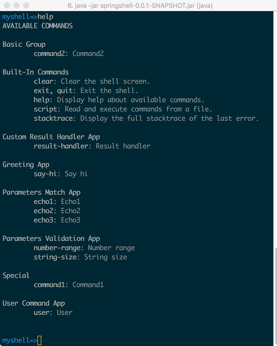

# 使用 Spring Shell 开发 Java 命令行应用
简化常见任务，专注于实现应用的业务逻辑

**标签:** Java,Spring

[原文链接](https://developer.ibm.com/zh/articles/spring-shell-application/)

成富

发布: 2017-11-21

* * *

提到 Java，大家都会想到 Java 在服务器端应用开发中的使用。实际上，Java 在命令行应用的开发中也有一席之地。在很多情况下，相对于图形用户界面来说，命令行界面响应速度快，所占用的系统资源少。在与用户进行交互的场景比较单一时，命令行界面是更好的选择。命令行界面有其固定的交互模式。通常是由用户输入一系列的参数，在执行之后把相应的结果在控制台输出。命令行应用通常需要处理输入参数的传递和验证、输出结果的格式化等任务。Spring Shell 可以帮助简化这些常见的任务，让开发人员专注于实现应用的业务逻辑。本文对 Spring Shell 进行详细的介绍。

## Spring Shell 入门

最简单的创建 Spring Shell 应用的方式是使用 Spring Boot。从 Spring Initializr 网站（`http://start.spring.io/`）上创建一个新的基于 Apache Maven 的 Spring Boot 应用，然后添加 Spring Shell 相关的依赖即可。本文介绍的是 Spring Shell 2.0.0.M2 版本，目前还只是 Milestone 版本，因此需要在 pom.xml 中添加 Spring 提供的包含 Milestone 版本工件的 Maven 仓库，如代码清单 1 所示。否则的话，Maven 会无法找到相应的工件。

##### 清单 1\. 添加 Spring Shell 的 Maven 仓库

```

<repositories>
<repository>
    <id>spring-milestone</id>
    <name>Spring Repository</name>
    <url>https://repo.spring.io/milestone</url>
</repository>
</repositories>

```

Show moreShow more icon

在添加了 Spring Shell 的 Maven 仓库之后，可以在 Spring Boot 项目中添加对于 `spring-shell-starter` 的依赖，如代码清单 2 所示。

##### 清单 2\. 添加 Spring Shell 所需 Maven 依赖

```

<dependency>
<groupId>org.springframework.shell</groupId>
<artifactId>spring-shell-starter</artifactId>
<version>2.0.0.M2</version>
</dependency>

```

Show moreShow more icon

我们接着可以创建第一个基于 Spring Shell 的命令行应用。该应用根据输入的参数来输出相应的问候语，完整的代码如清单 3 所示。从代码清单 3 中可以看到，在 Spring Shell 的帮助下，完整的实现代码非常简单。代码的核心是两个注解：@ShellComponent 声明类 `GreetingApp` 是一个 Spring Shell 的组件；@ShellMethod 表示方法 sayHi 是可以在命令行运行的命令。该方法的参数 name 是命令行的输入参数，而其返回值是命令行执行的结果。

##### 清单 3\. 输出问候语的命令行应用

```

import org.springframework.shell.standard.ShellComponent;
import org.springframework.shell.standard.ShellMethod;

@ShellComponent
public class GreetingApp {

@ShellMethod("Say hi")
public String sayHi(String name) {
    return String.format("Hi %s", name);
}
}

```

Show moreShow more icon

接下来我们运行该应用。运行起来之后，该应用直接进入命令行提示界面，我们可以输入 help 来输出使用帮助。help 是 Spring Shell 提供的众多内置命令之一，在列出的命令中，可以看到我们创建的 say-hi 命令。我们输入”say-hi Alex”来运行该命令，可以看到输出的结果”Hi Alex”。如果我们直接输入”say-hi”，会看到输出的错误信息，告诉我们参数”–name”是必须的。从上面的例子可以看出，在 Spring Shell 的帮助下，创建一个命令行应用是非常简单的。很多实用功能都已经默认提供了。在使用 Spring Initializr 创建的 Spring Boot 项目中，默认提供了一个单元测试用例。这个默认的单元测试用例与 Spring Shell 在使用时存在冲突。在进行代码清单 3 中的项目的 Maven 构建时，该测试用例需要被禁用，否则构建过程会卡住。

## 参数传递与校验

下面我们讨论 Spring Shell 中的参数传递和校验。Spring Shell 支持两种不同类型的参数，分别是命名参数和位置参数。命名参数有名称，可以通过类似–arg 的方式来指定；位置参数则按照其在方法的参数列表中的出现位置来进行匹配。命名参数和位置参数可以混合起来使用，不过命名参数的优先级更高，会首先匹配命名参数。每个参数都有默认的名称，与方法中的对应的参数名称一致。

在代码清单 4 中的方法有 3 个参数 a、b 和 c。在调用该命令时，可以使用”echo1 –a 1 –b 2 –c 3″，也可以使用”echo1 –a 1 2 3″或”echo1 1 3 –b 2″。其效果都是分别把 1，2 和 3 赋值给 a、b 和 c。

##### 清单 4\. 包含多个参数的命令方法

```

@ShellMethod("Echo1")
public String echo1(int a, int b, int c) {
return String.format("a = %d, b = %d, c = %d", a, b, c);
}

```

Show moreShow more icon

如果不希望使用方法的参数名称作为命令对应参数的名称，可以通过@ShellOption 来标注所要使用的一个或多个参数名称。我们可以通过指定多个参数名称来提供不同的别名。在代码清单 5 中，为参数 b 指定了一个名称 boy。可以通过”echo2 1 –boy 2 3″来调用。

##### 清单 5\. 指定参数名称

```

@ShellMethod("Echo2")
public String echo2(int a, @ShellOption("--boy") int b, int c) {
return String.format("a = %d, b = %d, c = %d", a, b, c);
}

```

Show moreShow more icon

对于命名参数，默认使用的是”–“作为前缀，可以通过@ShellMethod 的属性 prefix 来设置不同的前缀。方法对应的命令的名称默认是从方法名称自动得到的，可以通过属性 key 来设置不同的名称，属性 value 表示的是命令的描述信息。如果参数是可选的，可以通过@ShellOption 的属性 defaultValue 来设置默认值。在代码清单 6 中，我们为方法 withDefault 指定了一个命令名称 default，同时为参数 value 指定了默认值”Hello”。如果直接运行命令”default”，输出的结果是”Value: Hello”；如果运行命令”default 123″，则输出的结果是”Value: 123″。

##### 清单 6\. 指定方法名称和参数默认值

```

@ShellComponent
public class NameAndDefaultValueApp {
@ShellMethod(key = "default", value = "With default value")
public void withDefault(@ShellOption(defaultValue = "Hello") final String value) {
    System.out.printf("Value: %s%n", value);
}
}

```

Show moreShow more icon

一个参数可以对应多个值。通过@ShellOption 属性 arity 可以指定一个参数所对应的值的数量。这些参数会被添加到一个数组中，可以在方法中访问。在代码清单 7 中，方法 echo3 的参数 numbers 的 arity 值是 3，因此可以映射 3 个参数。在运行命令”echo3 1 2 3″时，输出的结果是”a = 1, b =2, c = 3″。

##### 清单 7\. 参数对应多个值

```

@ShellMethod("Echo3")
public String echo3(@ShellOption(arity = 3) int[] numbers) {
return String.format("a = %d, b = %d, c = %d", numbers[0], numbers[1], numbers[2]);
}

```

Show moreShow more icon

如果参数的类型是布尔类型 Boolean，在调用的时候不需要给出对应的值。当参数出现时就表示值为 true。

Spring Shell 支持对参数的值使用 Bean Validation API 进行验证。比如我们可以用@Size 来限制字符串的长度，用@Min 和@Max 来限制数值的大小，如代码清单 8 所示。

##### 清单 8\. 校验参数

```

@ShellComponent
public class ParametersValidationApp {
@ShellMethod("String size")
public String stringSize(@Size(min = 3, max = 16) String name) {
    return String.format("Your name is %s", name);
}

@ShellMethod("Number range")
public String numberRange(@Min(10) @Max(100) int number) {
    return String.format("The number is %s", number);
}
}

```

Show moreShow more icon

## 结果处理

Spring Shell 在运行时，内部有一个处理循环。在每个循环的执行过程中，首先读取用户的输入，然后进行相应的处理，最后再把处理的结果输出。这其中的结果处理是由 `org.springframework.shell.ResultHandler` 接口来实现的。Spring Shell 中内置提供了对于不同类型结果的处理实现。命令执行的结果可能有很多种：如果用户输入的参数错误，输出的结果应该是相应的提示信息；如果在命令的执行过程中出现了错误，则需要输出相应的错误信息；用户也可能直接退出命令行。Spring Shell 默认使用的处理实现是类 org.springframework.shell.result.IterableResultHandler。IterableResultHandler 负责处理 Iterable 类型的结果对象。对于 Iterable 中包含的每个对象，把实际的处理请求代理给另外一个 ResultHandler 来完成。IterableResultHandler 默认的代理实现是类 org.springframework.shell.result.TypeHierarchyResultHandler。TypeHierarchyResultHandler 其实是一个复合的处理器，它会把对于不同类型结果的 ResultHandler 接口的实现进行注册，然后根据结果的类型来选择相应的处理器实现。如果找不到类型完全匹配的处理器实现，则会沿着结果类型的层次结构树往上查找，直到找到对应的处理器实现。Spring Shell 提供了对于 Object 类型结果的处理实现类 org.springframework.shell.result.DefaultResultHandler，因此所有的结果类型都可以得到处理。DefaultResultHandler 所做的处理只是把 Object 类型转换成 String，然后输出到控制台。

了解了 Spring Shell 对于结果的处理方式之后，我们可以添加自己所需要的特定结果类型的处理实现。代码清单 9 给了一个作为示例的处理结果类 PrefixedResult。PrefixedResult 中包含一个前缀 prefix 和实际的结果 result。

##### 清单 9\. 带前缀的处理结果

```

public class PrefixedResult {
private final String prefix;
private final String result;

public PrefixedResult(String prefix, String result) {
    this.prefix = prefix;
    this.result = result;
}

public String getPrefix() {
    return prefix;
}

public String getResult() {
    return result;
}
}

```

Show moreShow more icon

在代码清单 10 中，我们为 PrefixedResult 添加了具体的处理器实现。该实现也非常简单，只是把结果按照某个格式进行输出。

##### 清单 10\. PrefixedResult 对应的处理器实现

```

@Component
public class PrefixedResultHandler implements ResultHandler<PrefixedResult> {

@Override
public void handleResult(PrefixedResult result) {
    System.out.printf("%s --> %s%n", result.getPrefix(), result.getResult());
}
}

```

Show moreShow more icon

在代码清单 11 中，命令方法 resultHandler 返回的是一个 PrefixedResult 对象，因此会被代码清单 10 中的处理器来进行处理，输出相应的结果。

##### 清单 11\. 使用 PrefixedResult 的命令

```

@ShellComponent
public class CustomResultHandlerApp {
@ShellMethod("Result handler")
public PrefixedResult resultHandler() {
    return new PrefixedResult("PRE", "Hello!");
}
}

```

Show moreShow more icon

代码清单 12 给出了具体的命令运行结果。

##### 清单 12\. 命令的处理结果

```

myshell=>result-handler
PRE --> Hello!

```

Show moreShow more icon

## 自定义提示符

在启动命令行应用时，会发现该应用使用的是默认提示符”shell:>”。该提示符是可以定制的，只需要提供接口 org.springframework.shell.jline.PromptProvider 的实现即可。接口 PromptProvider 中只有一个方法，用来返回类型为 org.jline.utils.AttributedString 的提示符。在代码清单 13 中，我们定义了一个 PromptProvider 接口的实现类，并使用”myshell=>”作为提示符，而且颜色为蓝色。

##### 清单 13\. 自定义提示符

```

@Bean
public PromptProvider promptProvider() {
return () -> new AttributedString("myshell=>",
      AttributedStyle.DEFAULT.foreground(AttributedStyle.BLUE));
}

```

Show moreShow more icon

## 动态命令可用性

前面所创建的命令都是一直可用的。只要应用启动起来，就可以使用这些命令。不过有些命令的可用性可能取决于应用的内部状态，只有内部状态满足时，才可以使用这些命令。对于这些命令，Spring Shell 提供了类 org.springframework.shell.Availability 来表示命令的可用性。通过类 Availability 的静态方法 available()和 unavailable()来分别创建表示命令可用和不可用的 Availability 对象。

在代码清单 14 中，我们创建了两个命令方法 runOnce()和 runAgain()。变量 run 作为内部状态。在运行 runOnce()之后，变量 run 的值变为 true。命令 runAgain 的可用性由方法 runAgainAvailability()来确定。该方法根据变量 run 的值来决定 runAgain 是否可用。按照命名惯例，检查命令可用性的方法的名称是在命令方法名称之后加上 Availability 后缀。如果需要使用不同的方法名称，或是由一个检查方法控制多个方法，可以在检查方法上添加注解@ShellMethodAvailability 来声明其控制的方法名称。

##### 清单 14\. 动态命令可用性

```

@ShellComponent
public class RunTwiceToEnableApp {
private boolean run = false;

@ShellMethod("Run once")
public void runOnce() {
    this.run = true;
}

@ShellMethod("Run again")
public void runAgain() {
    System.out.println("Run!");
}

public Availability runAgainAvailability() {
    return run
        ? Availability.available()
        : Availability.unavailable("You should run runOnce first!");
}
}

```

Show moreShow more icon

## 输入参数转换

之前的@ShellMethod 标注的方法使用的都是简单类型的参数。Spring Shell 通过 Spring 框架的类型转换系统来进行参数类型的转换。Spring 框架已经内置提供了对常用类型的转换逻辑，包括原始类型、String 类型、数组类型、集合类型、Java 8 的 Optional 类型、以及日期和时间类型等。我们可以通过 Spring 框架提供的扩展机制来添加自定义的转换实现。

代码清单 15 中的 User 类是作为示例的一个领域对象，包含了 id 和 name 两个属性。

##### 清单 15\. User

```

public class User {
private final String id;
private final String name;

public User(String id, String name) {
    this.id = id;
    this.name = name;
}

public String getName() {
    return name;
}
}

```

Show moreShow more icon

代码清单 16 中的 UserService 用来根据 id 来查找对应的 User 对象。作为示例，UserService 只是简单使用一个 HashMap 来保存作为测试的 User 对象。

##### 清单 16\. UserService

```

public class UserService {
private final Map<String, User> users = new HashMap<>();

public UserService() {
    users.put("alex", new User("alex", "Alex"));
    users.put("bob", new User("bob", "Bob"));
}

public User findUser(String id) {
    return users.get(id);
}
}

```

Show moreShow more icon

在代码清单 17 中，UserConverter 实现了 Spring 中的 Converter 接口并添加了从 String 到 User 对象的转换逻辑，即通过 UserService 来进行查找。

##### 清单 17\. 使用类型转换

```

@Component
public class UserConverter implements Converter<String, User> {

private final UserService userService = new UserService();

@Override
public User convert(String source) {
    return userService.findUser(source);
}
}

```

Show moreShow more icon

在代码清单 18 中，命令方法 user 的参数是 User 类型。当运行命令”user alex”时，输入参数 alex 会通过代码清单 17 中的类型转换服务转换成对应的 User 对象，然后输出 User 对象的属性值 name。如果找不到与输入参数值对应的 User 对象，则输出”User not found”。

##### 清单 18\. 使用类型转换的命令

```

@ShellComponent
public class UserCommandApp {
@ShellMethod("User")
public void user(final User user) {
    if (user != null) {
      System.out.println(user.getName());
    } else {
      System.out.println("User not found");
    }
}
}

```

Show moreShow more icon

## 命令组织方式

当创建很多个命令时，需要有一种把这些命令组织起来。Spring Shell 提供了不同的方式来对命令进行分组。处于同一分组的命令会在 help 命令输出的帮助中出现在一起。默认情况下，同一个类中的命令会被添加到同一分组中。默认的分组名称根据对应的 Java 类名来自动生成。除了默认分组之外，还可以显式的设置分组。可以使用@ShellMethod 注解的属性 group 来指定分组名称；还可以为包含命令的类添加注解@ShellCommandGroup，则该类中的所有命令都在由@ShellCommandGroup 指定的分组中；还可以把@ShellCommandGroup 注解添加到包声明中，则该包中的所有命令都在由@ShellCommandGroup 指定的分组中。

在代码清单 19 中，通过@ShellCommandGroup 为命令所在类添加了自定义的分组名称 Special。其中的方法 command2 则通过@ShellMethod 的 group 属性指定了不同的分组名称”Basic Group”。

##### 清单 19\. 组织命令

```

@ShellComponent
@ShellCommandGroup("Special")
public class CommandsGroupApp {
@ShellMethod("Command1")
public void command1() {}

@ShellMethod(value = "Command2", group = "Basic Group")
public void command2() {}
}

```

Show moreShow more icon

图 1 显示了示例应用的 help 命令的输出结果，从中可以看到命令的分组情况。

##### 图 1\. 所有的命令列表



**commands.png**

## 内置命令

Spring Shell 提供了很多内置的命令，如下所示。

- 运行 help 命令可以列出来应用中的所有命令和对应的描述信息。
- 运行 clear 命令可以进行清屏操作。
- 运行 exit 命令可以退出命令行应用。
- 运行 script 命令可以执行一个文件中包含的所有命令。

如果不需要某个内置命令，可以通过把上下文环境中的属性 spring.shell.command..enabled 的值设为 false 来禁用。如果希望禁用全部的内置命令，可以把 spring-shell-standard-commands 从 Maven 依赖中排除，如代码清单 20 所示。

##### 清单 20\. 排除内置命令对应的 Maven 依赖

```

<dependency>
<groupId>org.springframework.shell</groupId>
<artifactId>spring-shell-starter</artifactId>
<version>2.0.0.M2</version>
<exclusions>
    <exclusion>
      <groupId>org.springframework.shell</groupId>
      <artifactId>spring-shell-standard-commands</artifactId>
    </exclusion>
</exclusion>
</dependency>

```

Show moreShow more icon

## 小结

命令行应用以其简单易用，占有资源少，速度快的特点，仍然在 Java 应用开发中占据一席之地。Spring Shell 为开发命令行应用提供了坚实的基础，可以极大的提高开发效率。本文对 Spring Shell 进行了详细的介绍，从基础的入门，到参数的传递和校验，再到结果处理、自定义提示符、动态命令可用性、输入参数转换、命令组织和内置命令等。在阅读本文之后，读者可以了解如何使用 Spring Shell 开发命令行应用。

## 参考资源

- 参考 [Spring Shell 官方网站](https://projects.spring.io/spring-shell/) ，了解更多 Spring Shell 的信息。
- 参考 [Spring Shell 官方指南](https://docs.spring.io/spring-shell/docs/2.0.0.M2/reference/htmlsingle/) ，了解更多使用 Spring Shell 的内容。
- 了解 [JLine](https://github.com/jline/jline3) ，学习如何定制命令行显示。

## Download

[source\_code.zip](/developerworks/cn/java/spring-shell-application/source_code.zip): 本文样例代码