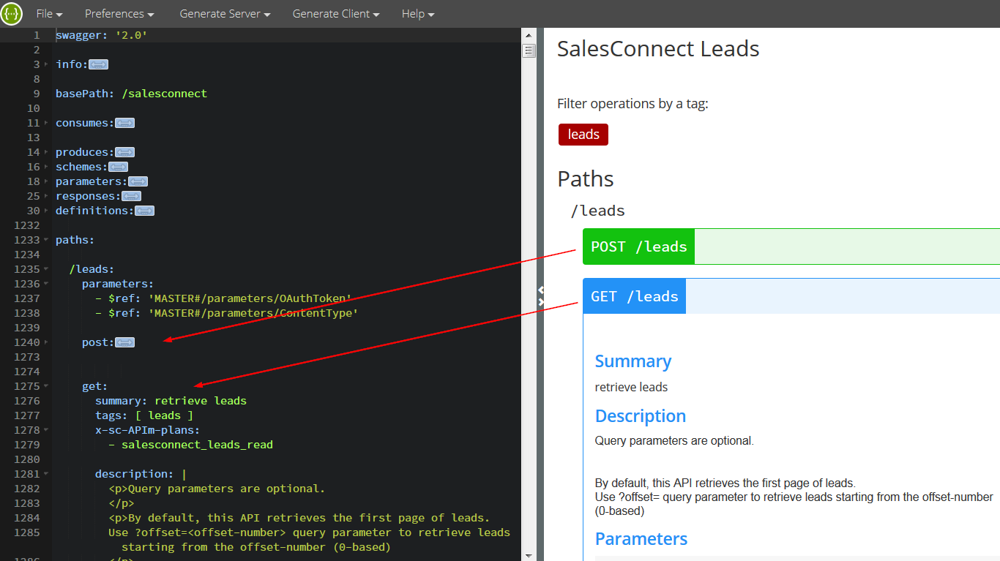
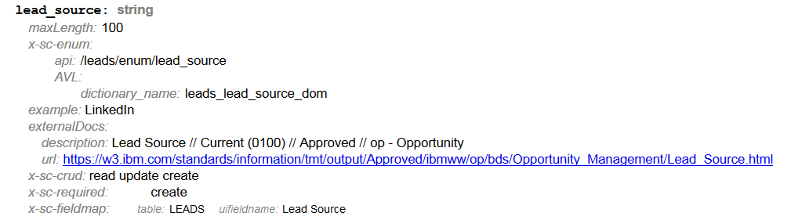
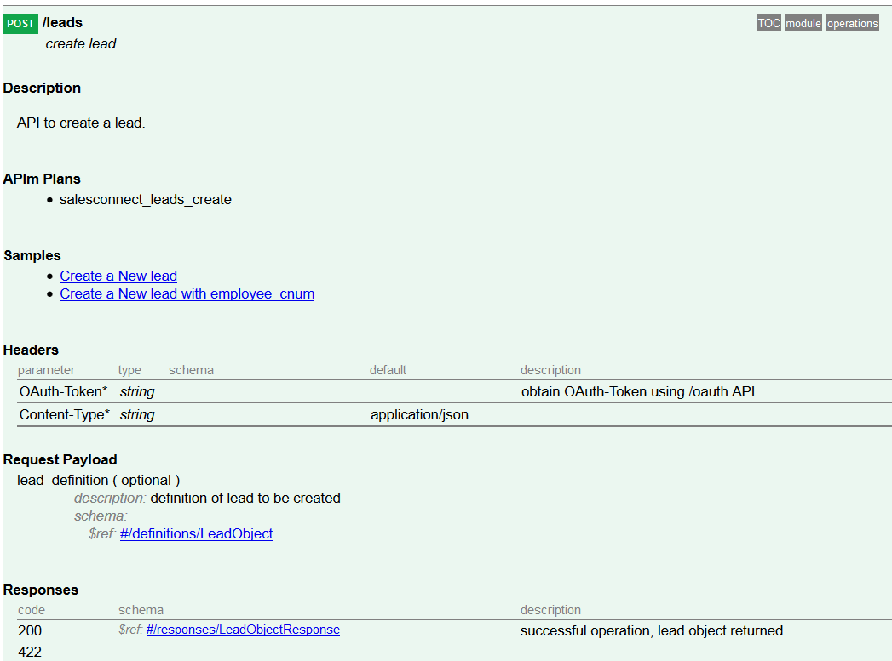

# 使用 Swagger 文档化和定义 RESTful API
通过扩展 Swagger 属性为 REST API 创建自定义文档

**标签:** API 管理,IBM API Connect,Web 开发

[原文链接](https://developer.ibm.com/zh/articles/wa-use-swagger-to-document-and-define-restful-apis/)

Fuyi Li, Mark Vincenzes, Anne Wang

发布: 2016-11-09

* * *

大部分 Web 应用程序都支持 RESTful API，但不同于 SOAP API——REST API 依赖于 HTTP 方法，缺少与 Web 服务描述语言（Web Services Description Language，WSDL）类似的语言来定义使用者与提供者之间的请求和响应结构。由于没有充分的合同服务，许多 REST API 提供者使用 Microsoft Word 文档或维基页面来记录 API 用法。这些格式使协作和文档版本控制变得很困难，尤其对于有许多 API 或资源的应用程序，或者在 API 采用迭代式开发方式时。这些文档类型在集成到自动化测试应用程序中时变得更难。

开源 [Swagger](http://swagger.io/) 框架帮助 API 使用者和开发人员纠正了这些问题。该框架为创建 JSON 或 [YAML](http://www.yaml.org/) （JSON 的一个人性化的超集）格式的 RESTful API 文档提供了 [OpenAPI 规范](http://swagger.io/specification/) （以前称为 Swagger 规范）。Swagger 文档可由各种编程语言处理，可在软件开发周期中签入源代码控制系统中，以便进行版本管理。

但是 Swagger 本身也有不足之处。当我们使用该框架记录自己的 API 时，会发现我们的文档需求与 Swagger 的基本功能之间存在空白。我们将介绍我们在文档化过程中遇到的挑战，并展示如何通过以下方法解决它们：

- 实现 Swagger 扩展
- 简化 Swagger 的功能来聚合文档
- 创建一个输出 Swagger 文档为 HTML 页面的工具

## 使用 Swagger

一些 Swagger 编辑工具可帮助您轻松地创建 API 文档，确保它们遵守 OpenAPI 规范。举例而言，通过使用 [Swagger Editor](http://editor.swagger.io/#/) ，您可以创建或导入 API 文档，并在一个交互式环境中浏览它。右侧的显示窗格显示了格式化的文档，反映了您在左侧窗格中的代码编辑器中执行的更改。代码编辑器指出了所有格式错误。您可以展开和折叠每个窗格。

以下是您导入 leads.yaml 定义后的 Swagger Editor UI 外观：



放在屏幕截图上的红色箭头表示基于 OpenAPI 规范的 leads.yaml 文件中的 `post:` 和 `get:` 定义，与预览文档中 `POST` 和 `GET` API 的文档之间的对应关系。

如果使用 Eclipse 作为 IDE，您可以使用 [YEdit](https://marketplace.eclipse.org/content/yedit) ，它会检查并突出显示 YAML 语法，还会提供编辑和格式化功能。

## 扩展 Swagger

现有的工具使编辑 Swagger API 文档变得很容易，但某些文档场景带来了一些挑战。以下这些是我们在使用 Swagger 记录自己的 API 文档时遇到的一些实际问题：

- API 使用者需要获得特定于我们的 API 的信息，但 OpenAPI 规范不包含该信息的标准。
- API 使用者需要请求和响应示例，但现有的编辑器无法包含它们。
- 我们需要提供一个容易阅读的富文档，其中包含可供 API 使用者使用的示例，最好是采用在线 HTML 文档形式。

为了解决这些问题，我们根据 OpenAPI 规范创建了自己的属性、工具和模板。

### 扩展属性

您可以使用 `x-` 扩展属性来扩展 Swagger。以下是我们为自己的 API 专门定制的一些扩展，以及它们的用法示例：

以下属性用于 API 有效负载或响应字段：

- `x-sc-crud` ：记录一个 API 字段的有效创建、读取、更新和删除（CRUD）操作：


    ```
    x-sc-crud:  [ read, update, create ]

    ```


    Show moreShow more icon

- `x-sc-required` ：指示此字段需要哪些 CRUD 操作：


    ```
    x-sc-required: [ create ]

    ```


    Show moreShow more icon

- `x-sc-fieldmap` ：记录与指定的 API 字段关联的数据库表和 UI 字段：


    ```
    x-sc-fieldmap:
    table: TASKS_RELATED_TO
    uifieldname: Related to

    ```


    Show moreShow more icon

- `x-sc-enum` ：记录 API 字段的有效值。可以不使用静态值列表，而指定一个返回当前的可能值集合的 API。


    ```
    x-sc-enum:
    api: /leads/enum/alt_address_country

    ```


    Show moreShow more icon

- `x-sc-comments` ：为 `description` 属性提供补充，用于捕获给定 API 字段的额外的临时信息：


    ```
    x-sc-comments:
      - readonly in UI, aka Domestic Buying Group or DB

    ```


    Show moreShow more icon


下面的清单是 `Lead` 模块中的 `lead_source` API 字段的 YAML 定义中的 `x-sc` 属性的示例：

```
lead_source:
type: string
maxLength: 100
externalDocs:
    description: Lead Source // Current (0100) // Approved // op - Opportunity
    url: https://w3.ibm.com/standards/information/tmt/output/Approved/
    ibmww/op/bds/Opportunity_Management/Lead_Source.html

#
# lead_source value is returned when retrieving a lead,
# and you can set its value when creating or updating a Lead.
#
x-sc-crud:  [ read, update, create ]

#
# The lead_source is a required field when creating a Lead.
#
x-sc-required: [ create ]

#
# You can retrieve valid lead_source values from the
# /leads/enum/lead_source API.
#
x-sc-enum:
    api: /leads/enum/lead_source
    AVL:
      dictionary_name: leads_lead_source_dom

example: LinkedIn

#
# The value of lead_source is saved in the LEADS table.
# In UI, you can find lead_source under the "Lead Source" label.
#
x-sc-fieldmap:
    table: LEADS
    uifieldname: Lead Source

```

Show moreShow more icon

以下属性扩展了 API 操作的描述：

- `x-sc-samples` ：记录示例。此属性包含对文档的示例小节的 JSON 引用列表：（参见” [包含示例](#包含示例) ”小节了解更多信息）


    ```
    x-sc-samples:
      - $ref: '#/x-sc-samples/leads-post-create-lead'
      - $ref: '#/x-sc-samples/leads-post-create-lead-employeecnum'

    ```


    Show moreShow more icon

- `x-sc-APIm-plans` ：列出包含该操作的 [IBM API Connect](https://www.ibm.com/cn-zh/cloud/api-connect)（以前称为 IBM API Management）计划。我们希望捕获特定于 API Manager 的信息：


    ```
    x-sc-APIm-plans:
      - salesconnect_leads_read

    ```


    Show moreShow more icon


以下是 `/leads` API 端点的 HTTP `POST` 方法的 YAML 资源中的 `x-sc` 属性示例：

```
paths:

/leads:
    parameters:
      - $ref: 'MASTER#/parameters/OAuthToken'
      - $ref: 'MASTER#/parameters/ContentType'

    post:
      summary: create lead
      tags: [ leads ]

#
# Use the x-sc-APIm-plans property to specify that this endpoint
# is in APIm's salesconnect_leads_create plan.
#

      x-sc-APIm-plans:
        - salesconnect_leads_create

      description: |
        <p>API to create a lead.</p>

#
# Use the x-sc-samples property to refer to samples of the usage
# of the /leads API.
#
      x-sc-samples:
        - $ref: '#/x-sc-samples/leads-post-create-lead'
        - $ref: '#/x-sc-samples/leads-post-create-lead-employeecnum'

      parameters:
        - name: lead_definition
          in: body
          description: definition of lead to be created
          schema:
            $ref: '#/definitions/LeadObject'

      responses:
        200:
          $ref: '#/responses/LeadObjectResponse'

        422:
          description: |
         <p>scenarios</p>
         <ul>
         <li>missing required field</li>
         <li>invalid values for optional fields</li>
         <li>et cetera</li>
         </ul>

```

Show moreShow more icon

### 包含示例

尽管 Swagger 是一个定义 RESTful API 的强大工具，但它未提供用于包含 HTTP 请求和响应示例，或者用于为开发人员添加已编写文档的途径。

为了包含请求和响应示例，我们扩展了该规范，并再次使用了 YAML 来记录示例。我们将自己的示例放在一个分离的模式（schema）中，这样就不会让主要 API 文档过于复杂。

下面的 `leads-post-create-lead` 示例告诉使用者如何调用 `/leads` API 的 HTTP `POST` 方法，描述 URL、方法、头文件、URL 参数、输入（示例有效负载）和响应：

```
x-sc-samples:
leads-post-create-lead:
    title: Create a New lead
    description: |
      This sample creates a new lead, and assigns it to a user specified via sugar user id.

    method: POST
    url: https://w3-dev.api.ibm.com/sales/development/salesconnect/leads

    headers: |
      Content-Type: application/json
      Oauth-Token:  111e567a-7624-35f7-ed82-540f5a954312

    Parameters:  ?client_id={client_id}&client_secret={client_secret}

    Input: |
      {
        "created_by": "eve25@tst.ibm.com",
        "assigned_user_id": "51449f9b-a68f-059c-ad06-5039325c53b2",
        "description": "2015-01-27 leads test",
        "first_name": "one",
        "last_name": "smith",
        "phone_mobile": "22-222-2222",
        ...
      }

    Response: |
      {
        "my_favorite": false,
        "following": false,
        "id": "a260acfb-5b3e-3f74-2392-54d92387fb80",
        "name": "one smith"
        ...
        "_module": "Leads"
      }

```

Show moreShow more icon

在 `/leads` API 部分的 HTTP `POST` 方法中，我们使用了扩展的属性 `x-sc-samples` 和对 `x-sc-samples` 模式中的示例代码 `leads-post-create-lead` 的 JSON 引用：

```
paths:

/leads:
    parameters:
      - $ref: 'MASTER#/parameters/OAuthToken'
      - $ref: 'MASTER#/parameters/ContentType'

    post:
      summary: create lead
      tags: [ leads ]
      x-sc-APIm-plans:
        - salesconnect_leads_create

      description: |
        <p>API to create a lead.</p>

#
# Use the x-sc-samples property to refer to samples of the usage
# of the /leads API.
#
      x-sc-samples:
        - $ref: '#/x-sc-samples/leads-post-create-lead'
        - $ref: '#/x-sc-samples/leads-post-create-lead-employeecnum'

      parameters:
        - name: lead_definition
          in: body
          description: definition of lead to be created
          schema:
            $ref: '#/definitions/LeadObject'

      responses:
        200:
          $ref: '#/responses/LeadObjectResponse'

        422:
          description: |
            <p>scenarios</li>
            <ul>
            <li>missing required field</li>
            <li> invalid values for optional fields</li>
            <li> et cetera</li>
            </ul>

```

Show moreShow more icon

## 将定义和示例放在一起

为了将所有模块定义和示例放在一起，我们使用了一个 MASTER.yaml 文件。此文件记录了逻辑信息，包括 Swagger 版本、API 版本、总体信息和提供该 API 的相对基础路径（relative base path）。

```
swagger: '2.0'

info:
version: '3.4'
title:  Sales Connect API

#
#
description: >
    This is the SalesConnect API.
    <p> There are several modules, each with different top level path.
    Most of the modules follow the same general pattern for operations and results,
    varying in the Sales Connect object that is manipulated.</p>
    <p>  The individual module descriptions show
    the particular operations and any module specific details.</p>

#
#
basePath: /sales/test/salesconnect
host: w3-dev.api.ibm.com

```

Show moreShow more icon

此外，MASTER.yaml 还包含包、共享对象和模板的注解。

### 包

通过在 MASTER.yaml 文件中定义 `package` （包）和 `package sets` （包集）属性，可以动态地生成内容。一个 _package_ （包）定义了与给定模块相关的所有 YAML 文件，而 _package set_ （包集）是对最终文档中的内容进行精细控制的包的集合。在我们的示例中， `demo` 和 `default` 包集分别从一组不同的文件中拉取内容。结合使用包和包集，我们可以轻松地将已发布模块与仍在开发中的模块分开。

```
x-sc-master:

packages:
    bulk:
    - modules/bulk

#
# The oauth package contains 2 files:
#   - the modules/oauth.yaml file
#   - the samples/oauth-samples.yaml file
#
    oauth:
    - modules/oauth
    - samples/oauth-samples

    calls:
    - modules/calls
    - samples/calls-samples

    collab:
    - modules/collab

    notes:
    - modules/notes
    - samples/notes-samples

    ...
    leads:
    - modules/leads
    - samples/leads-samples
    - samples/leadsTBD-samples
    ...

package-sets:

#
# When generating a "default" document, our tool pulls
# content from files specified under the "oauth", "bulk",
# "calls", "collab" and "notes" packages.
#
    default:
      - oauth
      - bulk
      - calls
      - collab
      - notes

#
# When generating a "demo" document, our tool pulls
# in a different set of files.
#
    demo:
      - oauth
      - notes
      - leads

```

Show moreShow more icon

### 共享对象

我们注意到，在实现过程中，反复提到了一些对象：多个 API 后端使用了相同的过滤器 URL 参数，多个 API 的 `GET` 方法返回了一组相同的基本字段，而且 API Manager 为不同的调用返回了相同的错误消息格式。为了减少冗余，我们使用 `BasicObject` 属性和 `APImException` 对象将这些元素提取到 MASTER.yaml 文件中，前者定义了所有 HTTP 方法 `GET` API 返回的基本字段，后者描述了从 API Manager 返回的错误结构。

## 使用模板

许多 API 的响应都遵循类似的模式，所以我们设计了模板来减少重复和支持变体。例如，当一个模块链接到另一个模块时，一些 API 的响应将包含来自二者的对象。为了适应这种情形，我们在 MASTER.yaml 文件中设计了一个 `(OBJECT)Link(otherOBJECT)Response` 模板：

```
(OBJECT)Link(otherOBJECT)Response:
    description: |
      Result of creating link from (OBJECT) to (otherOBJECT).
      The record contains the (OBJECT) and the related_record the (otherOBJECT) objects.
    schema:
      properties:
        record:
          $ref: 'MASTER#/definitions/(OBJECT)'

        related_record:
          $ref: 'MASTER#/definitions/(otherOBJECT)'

```

Show moreShow more icon

当记录一个将 `Note` 模块 `(OBJECT=NoteObject)` 链接到 `Account` 模块 `(otherOBJECT=AccountObject)` 的 API 的响应时，可以采用以下格式：

```
post:
summary: Establish an accounts link to note using ccms id.
description: Establish an accounts link to note using ccms id.
responses:
    default:
      $ref: 'MASTER?OBJECT=NoteObject&otherOBJECT=AccountObject#/responses/
(OBJECT)Link(otherOBJECT)Response'

```

Show moreShow more icon

在我们的示例中， `$ref` 告诉该工具访问 MASTER.yaml 文件并在 `responses` 模式下查找 `(OBJECT)Link(otherOBJECT)Response` 对象。实例化 JSON 引用之前，该工具将 `OBJECT` 变量替换为 `NoteObject` ，将 `otherOBJECT` 替换为 `AccountObject` 。最终，该模板被扩展为：

```
NoteObjectLinkAccountObjectResponse:
    description: |
      Result of creating link from NoteObject to AccountObject.
      The record contains the NoteObject and the related_record the AccountObject objects.
    schema:
      properties:
        record:
          $ref: 'MASTER#/definitions/NoteObject'

        related_record:
          $ref: 'MASTER#/definitions/AccountObject'

```

Show moreShow more icon

类似地，您可以通过将 `OBJECT` 和 `otherOBJECT` 设置为不同的值，使用此模板来记录将 `Note` 模块链接到 `Opportunity` 模块的 API 的响应：

```
post:
summary: Link from note to opportunity.
description: Link from note to opportunity.
x-sc-APIm-plans: [ salesconnect_notes_create ]
responses:
    default:
      $ref:
'MASTER?OBJECT=NoteObject&otherOBJECT=OpportunityObject#/responses/
(OBJECT)Link(otherOBJECT)Response'

```

Show moreShow more icon

## 将 YAML 文档转换为 HTML 页面

为了让 API 文档对用户更友好，我们实现了一个工具（swagger-to-html.php）来将 YAML 文档转换为静态 HTML。尽管可以使用现有工具从 Swagger 构建 HTML 文档，但我们决定创建自己的工具，以便可以添加对 `x-sc-*` 扩展的特殊处理功能。

该工具将会读入 MASTER.yaml 文件，合并所有必要的 YAML 文件，解析引用，然后输出一个 HTML 页面。该工具接受许多不同的参数，您可使用它们来自定义 HTML 文件的内容。例如，您可以为特定模块生成 HTML 文件，为特定包集生成 HTML 文件，或者仅为向 IBM API Management 应用程序注册的 API 生成 HTML 文件。

生成的 HTML 是单个文件，它使用 CSS 设置样式，使用 JavaScript 自动化各个部分的折叠、展开和导航功能。HTML 生成器工具会呈现通用 JSON 对象、JSON 模式定义，以及参数、响应、操作等的 Swagger 描述。

这是为 `Lead` 模块中的 `lead_source` 项生成的 HTML 页面（请参阅” [扩展属性](#扩展属性) ”部分的相应 YAML 文档）：



这是来自 `/leads` API 端点的 HTTP `POST` 方法的 HTML 页面（请参阅” [包含示例](#包含示例) ”部分的相应 YAML 文档）：



## 幕后原理

这个 API-swagger.zip 文件演示了我们的 Swagger API 文档子集中针对 `SalesConnect` 系统中的三个模块的部分： `OAuth` 、 `Lead` 和 `Note` 。这些 API 位于 /modules 目录中，相应的示例包含在 /samples 目录中。

要生成 HTML 页面：

1. 安装必备软件（PHP 和 [PHP YAML 扩展](http://pecl.php.net/package/yaml) ）。
2. 使用 `cd` 命令转到 API-Swagger 目录。
3. 要为 MASTER.yaml 文件的演示包集中指定的所有 API 生成 HTML，请输入以下命令（将它输入在一行上）：

    `php tools/swagger-to-html.php salesconnect.swagger/ MASTER.yaml --set demo > c:/swagger/salesconnectAPI.html`

4. 要为模块 `OAuth` 和 `Lead` 生成 HTML，请输入以下命令（将它输入在一行上）：

    `php tools/swagger-to-html.php salesconnect.swagger/MASTER.yaml --modules oauth,leads > c:/swagger/salesconnectAPI.html`


## 结束语

Swagger 是一个为 RESTful API 创建文档的强大工具，而且通过实现自定义扩展、工具和模板，您可以获得对 Swagger 生成的文档的格式和内容的更多选择和控制。通过扩展 Swagger 的功能，您可以包含更多特定于 API 的细节，指定 HTTP 请求和响应，并以 HTML 格式输出文档，以便开发人员和 API 使用者都可以阅读。

本文翻译自： [Use Swagger to document and define RESTful APIs](https://developer.ibm.com/articles/wa-use-swagger-to-document-and-define-restful-apis/)（2016-06-15）