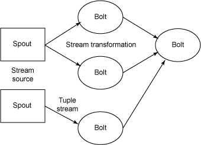
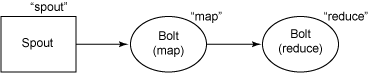

# 使用 Twitter Storm 处理实时的大数据
流式处理大数据简介

**标签:** Linux,分析,数据存储

[原文链接](https://developer.ibm.com/zh/articles/os-twitterstorm/)

M. Jones

发布: 2012-12-05

* * *

Hadoop（大数据分析领域无可争辩的王者）专注于批处理。这种模型对许多情形（比如为网页建立索引）已经足够，但还存在其他一些使用模型，它们需要来自高度动态的来源的实时信息。为了解决这个问题，就得借助 Nathan Marz 推出的 Storm（现在在 Twitter 中称为 BackType）。Storm 不处理静态数据，但它处理预计会连续的流数据。考虑到 Twitter 用户每天生成 1.4 亿条推文 (tweet)，那么就很容易看到此技术的巨大用途。

但 Storm 不只是一个传统的大数据分析系统：它是复杂事件处理 (CEP) 系统的一个示例。CEP 系统通常分类为计算和面向检测，其中每个系统都可通过用户定义的算法在 Storm 中实现。举例而言，CEP 可用于识别事件洪流中有意义的事件，然后实时地处理这些事件。

Nathan Marz 提供了在 Twitter 中使用 Storm 的大量示例。一个最有趣的示例是生成趋势信息。Twitter 从海量的推文中提取所浮现的趋势，并在本地和国家级别维护它们。这意味着当一个案例开始浮现时，Twitter 的趋势主题算法就会实时识别该主题。这种实时算法在 Storm 中实现为 Twitter 数据的一种连续分析。

##### 什么是 “大数据”？

_大数据_ 指的是海量无法通过传统方式管理的数据。互联网范围的数据正在推动能够处理这类新数据的新架构和应用程序的创建。这些架构高度可扩展，且能够跨无限多的服务器并行、高效地处理数据。

## Storm 与传统的大数据

Storm 与其他大数据解决方案的不同之处在于它的处理方式。Hadoop 在本质上是一个批处理系统。数据被引入 Hadoop 文件系统 (HDFS) 并分发到各个节点进行处理。当处理完成时，结果数据返回到 HDFS 供始发者使用。Storm 支持创建拓扑结构来转换没有终点的数据流。不同于 Hadoop 作业，这些转换从不停止，它们会持续处理到达的数据。

## 大数据实现

Hadoop 的核心是使用 Java™ 语言编写的，但支持使用各种语言编写的数据分析应用程序。最新的应用程序的实现采用了更加深奥的路线，以充分利用现代语言和它们的特性。例如，位于伯克利的加利福尼亚大学 (UC) 的 Spark 是使用 Scala 语言实现的，而 Twitter Storm 是使用 Clojure（发音同 _closure_ ）语言实现的。

Clojure 是 Lisp 语言的一种现代方言。类似于 Lisp，Clojure 支持一种功能性编程风格，但 Clojure 还引入了一些特性来简化多线程编程（一种对创建 Storm 很有用的特性）。Clojure 是一种基于虚拟机 (VM) 的语言，在 Java 虚拟机上运行。但是，尽管 Storm 是使用 Clojure 语言开发的，您仍然可以在 Storm 中使用几乎任何语言编写应用程序。所需的只是一个连接到 Storm 的架构的适配器。已存在针对 Scala、JRuby、Perl 和 PHP 的适配器，但是还有支持流式传输到 Storm 拓扑结构中的结构化查询语言适配器。

## Storm 的关键属性

Storm 实现的一些特征决定了它的性能和可靠性的。Storm 使用 ZeroMQ 传送消息，这就消除了中间的排队过程，使得消息能够直接在任务自身之间流动。在消息的背后，是一种用于序列化和反序列化 Storm 的原语类型的自动化且高效的机制。

Storm 的一个最有趣的地方是它注重容错和管理。Storm 实现了有保障的消息处理，所以每个元组都会通过该拓扑结构进行全面处理；如果发现一个元组还未处理，它会自动从喷嘴处重放。Storm 还实现了任务级的故障检测，在一个任务发生故障时，消息会自动重新分配以快速重新开始处理。Storm 包含比 Hadoop 更智能的处理管理，流程会由监管员来进行管理，以确保资源得到充分使用。

## Storm 模型

Storm 实现了一种数据流模型，其中数据持续地流经一个转换实体网络（参见 [图 1](#图-1-一个普通的-storm-拓扑结构的概念性架构) ）。一个数据流的抽象称为一个 _流_ ，这是一个无限的元组序列。元组就像一种使用一些附加的序列化代码来表示标准数据类型（比如整数、浮点和字节数组）或用户定义类型的结构。每个流由一个惟一 ID 定义，这个 ID 可用于构建数据源和接收器 (sink) 的拓扑结构。流起源于 _喷嘴_ ，喷嘴将数据从外部来源流入 Storm 拓扑结构中。

##### 图 1\. 一个普通的 Storm 拓扑结构的概念性架构



_接收器_ （或提供转换的实体）称为 _螺栓_ 。螺栓实现了一个流上的单一转换和一个 Storm 拓扑结构中的所有处理。螺栓既可实现 MapReduce 之类的传统功能，也可实现更复杂的操作（单步功能），比如过滤、聚合或与数据库等外部实体通信。典型的 Storm 拓扑结构会实现多个转换，因此需要多个具有独立元组流的螺栓。喷嘴和螺栓都实现为 Linux® 系统中的一个或多个任务。

可使用 Storm 为词频轻松地实现 MapReduce 功能。如 [图 2](#图-2-mapreduce-功能的简单-storm-拓扑结构) 中所示，喷嘴生成文本数据流，螺栓实现 Map 功能（令牌化一个流的各个单词）。来自 “map” 螺栓的流然后流入一个实现 Reduce 功能的螺栓中（以将单词聚合到总数中）。

##### 图 2\. MapReduce 功能的简单 Storm 拓扑结构



请注意，螺栓可将数据传输到多个螺栓，也可接受来自多个来源的数据。Storm 拥有 _流分组_ 的概念，流分组实现了混排 (shuffling)（随机但均等地将元组分发到螺栓）或字段分组（根据流的字段进行流分区）。还存在其他流分组，包括生成者使用自己的内部逻辑路由元组的能力。

但是，Storm 架构中一个最有趣的特性是 _有保障的消息处理_ 。Storm 可保证一个喷嘴发射出的每个元组都会处理；如果它在超时时间内没有处理，Storm 会从该喷嘴重放该元组。此功能需要一些聪明的技巧来在拓扑结构中跟踪元素，也是 Storm 的重要的附加价值之一。

除了支持可靠的消息传送外，Storm 还使用 ZeroMQ 最大化消息传送性能（删除中间排队，实现消息在任务间的直接传送）。ZeroMQ 合并了拥塞检测并调整了它的通信，以优化可用的带宽。

## Storm 示例演示

现在让我们通过实现一个简单的 MapReduce 拓扑结构的代码（参见 [清单 1](#清单-1-为图-2-中的-storm-构建一个拓扑结构) ），看一下 Storm 示例。这个示例使用了来自 Nathan 的 Storm 入门工具包（可从 GitHub 获取）（参见 参考资料 获取链接）的巧妙设计的字数示例。此示例演示了 [图 2](#图-2-mapreduce-功能的简单-storm-拓扑结构) 中所示的拓扑结构，它实现了一个包含一个螺栓的 map 转换和包含一个螺栓的 reduce 转换。

##### 清单 1\. 为图 2 中的 Storm 构建一个拓扑结构

```
01  TopologyBuilder builder = new TopologyBuilder();
02
03  builder.setSpout("spout", new RandomSentenceSpout(), 5);
04
05  builder.setBolt("map", new SplitSentence(), 4)
06           .shuffleGrouping("spout");
07
08  builder.setBolt("reduce", new WordCount(), 8)
09           .fieldsGrouping("map", new Fields("word"));
10
11  Config conf = new Config();
12  conf.setDebug(true);
13
14  LocalCluster cluster = new LocalCluster();
15  cluster.submitTopology("word-count", conf, builder.createTopology());
16
17  Thread.sleep(10000);
18
19  cluster.shutdown();

```

Show moreShow more icon

[清单 1](#清单-1-为图-2-中的-storm-构建一个拓扑结构) （添加了行号以供引用）首先使用 `TopologyBuilder` 声明一个新拓扑结构。接下来在第 3 行，定义了一个喷嘴（名为 `spout` ），该喷嘴包含一个 `RandomSentenceSpout` 。 `RandomSentenceSpout` 类（也就是 `nextTuple` 方法）发出 5 个随机句子的其中一个作为它的数据。 `setSpout` 方法末尾的 `5` 参数是一个并行性提示（或要为此活动创建的任务数）。

在第 5 和 6 行。我定义了第一个螺栓（或算法转换实体），在本例中为 map（或 split）螺栓。这个螺栓使用 `SplitSentence` 令牌化输入流并将其作为输出的各个单词发出。请注意，第 6 行使用了 `shuffleGrouping` ，它定义了对此螺栓（在本例中为 “spout”）的输入订阅，还将流分组定义为混排。这种混排分组意味着来自喷嘴的输入将 _混排_ 或随机分发给此螺栓中的任务（该螺栓已提示具有 4 任务并行性）。

在第 8 和 9 行，我定义了最后一个螺栓，这个螺栓实际上用于 reduce 元素，使用该元素的输入作为 map 螺栓。 `WordCount` 方法实现了必要的字数统计行为（将相似的单词分组到一起，以维护总数），但不是混排的，所以它的输出是一致的。如果有多个任务在实现 reduce 行为，那么您最终会得到分段的计数，而不是总数。

第 11 和 12 行创建和定义了一个配置对象并启用了 Debug 模式。 `Config` 类包含大量配置可能性（参见 参考资料 ，获取有关 Storm 类树的更多信息的链接）。

第 14 和 15 行创建了本地集群（在本例中，用于定义本地模式的用途）。我定义了我的本地集群、配置对象和拓扑结构的名称（可通过 `builder` 类的 `createTopology` 元素获取）。

最后，在第 17 行，Storm 休眠一段时间，然后在第 19 行关闭集群。请记住，Storm 是一个持续运行的操作系统，所以任务可存在相当长时间，不断处理它们订阅的流上的新元组。

您可在 Storm 入门工具包中了解这个非常简单的实现的更多信息，包括喷嘴和螺栓的细节。

## 使用 Storm

Nathan Marz 编写了一组简单易懂的文档，详细介绍了如何安装 Storm 来执行集群模式和本地模式的操作。本地模式无需一个庞大的节点集群，即可使用 Storm。如果需要在一个集群中使用 Storm 但缺乏节点，也可在 Amazon Elastic Compute Cloud (EC2) 中实现一个 Storm 集群。请参见 参考资料 获取每个 Storm 模式（本地、集群和 Amazon EC2）的参考信息。

## 其他开源的大数据解决方案

自 Google 在 2004 年推出 MapReduce 范式以来，已诞生了多个使用原始 MapReduce 范式（或拥有该范式的质量）的解决方案。Google 对 MapReduce 的最初应用是建立万维网的索引。尽管此应用程序仍然很流行，但这个简单模型解决的问题也正在增多。

[表 1](#表-1-开源大数据解决方案) 提供了一个可用开源大数据解决方案的列表，包括传统的批处理和流式处理应用程序。在将 Storm 引入开源之前将近一年的时间里，Yahoo! 的 S4 分布式流计算平台已向 Apache 开源。S4 于 2010 年 10 月发布，它提供了一个高性能计算 (HPC) 平台，向应用程序开发人员隐藏了并行处理的复杂性。S4 实现了一个可扩展的、分散化的集群架构，并纳入了部分容错功能。

##### 表 1\. 开源大数据解决方案

解决方案开发商类型描述StormTwitter流式处理Twitter 的新流式大数据分析解决方案S4Yahoo!流式处理来自 Yahoo! 的分布式流计算平台HadoopApache批处理MapReduce 范式的第一个开源实现SparkUC Berkeley AMPLab批处理支持内存中数据集和恢复能力的最新分析平台DiscoNokia批处理Nokia 的分布式 MapReduce 框架HPCCLexisNexis批处理HPC 大数据集群

## 更多信息

尽管 Hadoop 仍然是宣传最多的大数据分析解决方案，但仍可能存在许多其他的解决方案，每种解决方案都具有不同的特征。我在过去的文章中探讨了 Spark，它纳入了数据集的内存中处理功能（能够重新构建丢失的数据）。但 Hadoop 和 Spark 都专注于大数据集的批处理。Storm 提供了一个新的大数据分析模型，而且因为它最近被开源，所以也引起广泛的关注。

与 Hadoop 不同，Storm 是一个计算系统，它没有包括任何存储概念。这就使得 Storm 能够用在各种各样的上下文中，无论数据是从一个非传统来源动态传入，还是存储在数据库等存储系统中（或者由一个控制器用于对其他一些设备（比如一个交易系统）进行实时操作）都是如此。

请参见参考资源获取有关 Storm 的更多信息的链接，了解如何让一个集群正常运行，以及其他大数据分析解决方案（包括批处理和流式处理）。