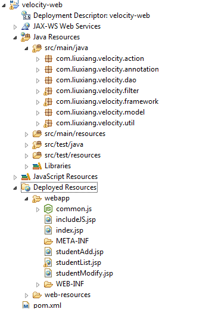

# 使用 Velocity 模板引擎快速生成代码
Velocity 入门

**标签:** Java

[原文链接](https://developer.ibm.com/zh/articles/j-lo-velocity1/)

刘香

发布: 2014-11-03

* * *

## Velocity 模板引擎介绍

在现今的软件开发过程中，软件开发人员将更多的精力投入在了重复的相似劳动中。特别是在如今特别流行的 MVC 架构模式中，软件各个层次的功能更加独立，同时代码的相似度也更加高。所以我们需要寻找一种来减少软件开发人员重复劳动的方法，让程序员将更多的精力放在业务逻辑以及其他更加具有创造力的工作上。Velocity 这个模板引擎就可以在一定程度上解决这个问题。

Velocity 是一个基于 Java 的模板引擎框架，提供的模板语言可以使用在 Java 中定义的对象和变量上。Velocity 是 Apache 基金会的项目，开发的目标是分离 MVC 模式中的持久化层和业务层。但是在实际应用过程中，Velocity 不仅仅被用在了 MVC 的架构中，还可以被用在以下一些场景中。

1. Web 应用：开发者在不使用 JSP 的情况下，可以用 Velocity 让 HTML 具有动态内容的特性。

2. 源代码生成：Velocity 可以被用来生成 Java 代码、SQL 或者 PostScript。有很多开源和商业开发的软件是使用 Velocity 来开发的。

3. 自动 Email：很多软件的用户注册、密码提醒或者报表都是使用 Velocity 来自动生成的。使用 Velocity 可以在文本文件里面生成邮件内容，而不是在 Java 代码中拼接字符串。

4. 转换 xml：Velocity 提供一个叫 Anakia 的 ant 任务，可以读取 XML 文件并让它能够被 Velocity 模板读取。一个比较普遍的应用是将 xdoc 文档转换成带样式的 HTML 文件。


## Hello Velocity

和学习所有新的语言或者框架的顺序一样，我们从 Hello Velocity 开始学习。首先在 Velocity 的官网上 [下载最新的发布包](http://velocity.apache.org/download.cgi) ，之后使用 Eclipse 建立普通的 Java 项目。引入解压包中的 velocity-1.7.jar 和 lib 文件夹下面的 jar 包。这样我们就可以在项目中使用 Velocity 了。

在做完上面的准备工作之后，就可以新建一个叫 HelloVelocity 的类，代码如下：

清单 1\. HelloVelocity.java

```
public class HelloVelocity {
public static void main(String[] args) {
VelocityEngine ve = new VelocityEngine();
ve.setProperty(RuntimeConstants.RESOURCE_LOADER, "classpath");
ve.setProperty("classpath.resource.loader.class", ClasspathResourceLoader.class.getName());

ve.init();

Template t = ve.getTemplate("hellovelocity.vm");
VelocityContext ctx = new VelocityContext();

ctx.put("name", "velocity");
ctx.put("date", (new Date()).toString());

List temp = new ArrayList();
temp.add("1");
temp.add("2");
ctx.put("list", temp);

StringWriter sw = new StringWriter();

t.merge(ctx, sw);

System.out.println(sw.toString());
}
}

```

Show moreShow more icon

在 HelloVelocity 的代码中，首先 new 了一个 VelocityEngine 类，这个类设置了 Velocity 使用的一些配置，在初始化引擎之后就可以读取 hellovelocity.vm 这个模板生成的 Template 这个类。之后的 VelocityContext 类是配置 Velocity 模板读取的内容。这个 context 可以存入任意类型的对象或者变量，让 template 来读取。这个操作就像是在使用 JSP 开发时，往 request 里面放入 key-value，让 JSP 读取一样。

接下来就是写 hellovelocity.vm 文件了，这个文件实际定义了 Velocity 的输出内容和格式。hellovelocity.vm 的内容如下：

清单 2\. Hellovelocity.vm

```
#set( $iAmVariable = "good!" )
Welcome $name to velocity.com
today is $date.
#foreach ($i in $list)
$i
#end
$iAmVariable

```

Show moreShow more icon

输出结果如下：

```
Welcome velocity to velocity.com
today is Sun Mar 23 19:19:04 CST 2014.
1
2
good!

```

Show moreShow more icon

在输出结果中我们可以看到，$name、$date 都被替换成了在 HelloVelocity.java 里面定义的变量，在 foreach 语句里面遍历了 list 的每一个元素，并打印出来。而$iAmVariable 则是在页面中使用 #set 定义的变量。

## 基本模板语言语法使用

在 hellovelocity.vm 里面可以看到很多以 # 和$符开头的内容，这些都是 Velocity 的语法。在 Velocity 中所有的关键字都是以 # 开头的，而所有的变量则是以$开头。Velocity 的语法类似于 JSP 中的 JSTL，甚至可以定义类似于函数的宏，下面来看看具体的语法规则。

一、变量

和我们所熟知的其他编程语言一样，Velocity 也可以在模板文件中有变量的概念。

(1) 变量定义

```
#set($name ="velocity”)

```

Show moreShow more icon

等号后面的字符串 Velocity 引擎将重新解析，例如出现以$开始的字符串时，将做变量的替换。

```
#set($hello ="hello $name”)

```

Show moreShow more icon

上面的这个等式将会给$hello 赋值为 “hello velocity”

(2) 变量的使用

在模板文件中使用$name 或者 ${name} 来使用定义的变量。推荐使用 ${name} 这种格式，因为在模板中同时可能定义了类似 $name 和 $names 的两个变量，如果不选用大括号的话，引擎就没有办法正确识别 $names 这个变量。

对于一个复杂对象类型的变量，例如 $person，可以使用 ${person.name} 来访问 person 的 name 属性。值得注意的是，这里的 ${person.name} 并不是直接访问 person 的 name 属性，而是访问 person 的 getName() 方法，所以 ${person.name} 和 ${person.getName()} 是一样的。

(3) 变量赋值

在第一小点中，定义了一个变量，同时给这个变量赋了值。对于 Velocity 来说，变量是弱数据类型的，可以在赋了一个 String 给变量之后再赋一个数字或者数组给它。可以将以下六种数据类型赋给一个 Velocity 变量：变量引用, 字面字符串, 属性引用, 方法引用, 字面数字, 数组列表。

```
#set($foo = $bar)
#set($foo ="hello”)
#set($foo.name = $bar.name)
#set($foo.name = $bar.getName($arg))
#set($foo = 123)
#set($foo = ["foo”,$bar])

```

Show moreShow more icon

二、循环

在 Velocity 中循环语句的语法结构如下：

```
#foreach($element in $list)
This is $element
$velocityCount
#end

```

Show moreShow more icon

Velocity 引擎会将 list 中的值循环赋给 element 变量，同时会创建一个$velocityCount 的变量作为计数，从 1 开始，每次循环都会加 1。

三、条件语句

条件语句的语法如下

```
#if(condition)
...
#elseif(condition)
...
#else
...
#end

```

Show moreShow more icon

四、关系操作符

Velocity 引擎提供了 AND、OR 和 NOT 操作符，分别对应 &&、\|\| 和 ! 例如：

```
#if($foo && $bar)
#end

```

Show moreShow more icon

五、宏

Velocity 中的宏可以理解为函数定义。定义的语法如下：

```
#macro(macroName arg1 arg2...)
...
#end

```

Show moreShow more icon

调用这个宏的语法是：

```
#macroName(arg1 arg2...)

```

Show moreShow more icon

这里的参数之间使用空格隔开，下面是定义和使用 Velocity 宏的例子：

```
#macro(sayHello $name)
hello $name
#end
#sayHello("velocity”)

```

Show moreShow more icon

输出的结果为 hello velocity

六、#parse 和 #include

这里 #parse 和 #include 指令的功能都是在外部引用文件，而两者的区别是，#parse 会将引用的内容当成类似于源码文件，会将内容在引入的地方进行解析，#include 是将引入文件当成资源文件，会将引入内容原封不动地以文本输出。分别看以下例子：

foo.vm 文件：

```
#set($name ="velocity”)

```

Show moreShow more icon

parse.vm：

```
#parse("foo.vm”)

```

Show moreShow more icon

输出结果为：velocity

include.vm：

```
#include("foo.vm”)

```

Show moreShow more icon

输出结果为：#set($name =”velocity”)

以上内容包含了部分 Velocity 的语法，详细的语法内容可以参考 Velocity 的官方文档。

## 自动生成代码的例子

在上个例子中我们可以生成任意的字符串并且打印出来，那为什么我们不能生成一些按照既定格式定义的代码并且写入文件呢。

在这里我们以一个实际的 demo 来完成这部分内容。相关内容的源码可以参照附件。这个 demo 的功能是要实现一个学生和老师的管理，实际上都是单张表的维护。我们希望能够只定义 model 层，来生成 MVC 的所有代码。在这个 demo 中，只自动生成 action 和 JSP 的内容，因为现在有很多工具都可以帮助我们自动生成这两个包的代码。

首先在 eclipse 中建立一个 Java web 工程，在例子中为了方便管理 jar 包，使用的是 maven 来建立和管理工程。建立好的工程目录结构如下图所示：

##### 图 1\. 项目目录结构



Java Resource 中放的是 Java 源码以及资源文件，Deployed Resources 中放的是 web 相关的文件。在 Java 文件中使用了类似 Spring 的 @Component 和 @Autowired 的注解来实现 IoC，使用 @Action 这样的注解实现 MVC，而在 JSP 中则使用了 JSTL 来输出页面。在上图所示的目录中，annotation、filter、framework 和 util 这四个 package 是作为这个项目框架的，跟业务没有关系，类似于 spring 和 struts 的功能。

在实际的项目中我们当然希望能够一开始就编写一个通用的模板文件，然后一下子生成所有的代码，但是很多时候这样做是不可能的，或者说比较困难。为了解决这个问题，我们可以在编写 Velocity 模板文件之前先按照原本的流程编写代码，暂时先忘掉 Velocity。编写的代码应该能够在一个功能上完整的调通涉及 MVC 中所有层次的内容。在这个例子中，先编写好 StudentAction.java 文件，以及上图中 webapp 目录中所示的文件。在写好以上代码，同时也能顺利运行之后，我们可以参照之前编写的代码来写模板文件。这里我们来分别看一个 Java 文件和 JSP 的例子。

清单 3\. ActionTemplate.vm

```
#parse ("macro.vm")

@Action("${classNameLowCase}Action")
public class ${classNameUpCase}Action extends BaseAction{
@Autowired
public ${classNameUpCase}Dao ${classNameLowCase}Dao;
private List<${classNameUpCase}> ${classNameLowCase}s;
private ${classNameUpCase} ${classNameLowCase};
#foreach ($attr in ${attrs})
private ${attr[0]} ${attr[1]};
#end
public String ${classNameLowCase}List() {
${classNameLowCase}s = ${classNameLowCase}Dao.retrieveAll${classNameUpCase}s();
return "${classNameLowCase}List.jsp";
}

...
}

```

Show moreShow more icon

上面的代码展示了一个 Java 类转换成 vm 模板之后的部分内容，完整内容请参考附件。

macro.vm 文件中定义了一些使用的宏。JSP 的改造相对于 Java 文件来说稍微有点复杂，因为 JSP 中使用 JSTL 取 request 中的值也是使用 ${name} 这样的语法，所以想要输出 ${name} 这样的字符串而不是被模板引擎所替换，则需要使用转义字符，就像这样：\\${name}。

为了能够让这个文件中的 table 得到复用，我们将这个文件中的表格单独拿出来，使用 #parse 命令来包含。下面是 ListJspTemplate.vm 和 ListTableTemplate.vm 的内容：

清单 4\. ListJspTemplate.vm

```
<%@ page language="java" contentType="text/html; charset=UTF-8"
pageEncoding="UTF-8"%>
<%@taglib prefix="c" uri="http://java.sun.com/jsp/jstl/core" %>
<!DOCTYPE html PUBLIC "-//W3C//DTD HTML 4.01 Transitional//EN" "http://www.w3.org/TR/html4/loose.dtd">
<html>
<head>
<%@ include file="includeJS.jsp" %>
<script type="text/javascript">
var pageConfig = {
"list" : {
"action" : "${classNameLowCase}Action!${classNameLowCase}List.action"
}
...
"idName" : "${classNameLowCase}Id"
};
</script>
<script type="text/javascript" src="common.js"></script>
<meta http-equiv="Content-Type" content="text/html; charset=UTF-8">
<title>${classNameUpCase} List</title>
</head>
<body>
<h1>${classNameUpCase} List</h1>
<div><button id="addButton">Add</button></div>
#parse ("ListTableTemplate.vm")
<div id="modifyDiv"></div>
<div id="addDiv"></div>
</body>
</html>

```

Show moreShow more icon

清单 5\. ListTableTemplate.vm

```
#parse ("macro.vm")
#set($plus = "status.index+1")
<table border="1" style="width: 100%">
<thead>
<tr><th>No.</th>#generateTH($attrs)</tr>
</thead>
<tbody>
<c:forEach var="${classNameLowCase}" items="${${classNameLowCase}s }" varStatus="status" >
<tr ${classNameLowCase}Id="${${classNameLowCase}.id }">
<td>${${plus}}</td>#generateTD($classNameLowCase $attrs)<td>
<button class="modifyButton">Modify</button>
<button class="deleteButton">Delete</button></td></tr>
</c:forEach>
</tbody>
</table>

```

Show moreShow more icon

在定义好所有的模板文件之后，需要做的是读取这些文件，然后根据这些文件将 model 的数据类型以及名称设置到 context 中，最后将解析出来的内容写到相应的目录中去。这些工作我们放在了一个叫做 VelocityGenerator 的类中来做，它的源码如下：

清单 6\. TemplateGenerator.java

```
public class VelocityGenerator {

public static void main(String[] args) {
VelocityEngine ve = new VelocityEngine();
ve.setProperty(RuntimeConstants.RESOURCE_LOADER, "classpath");
ve.setProperty("classpath.resource.loader.class", ClasspathResourceLoader.class.getName());

ve.init();
Template actionTpt = ve.getTemplate("ActionTemplate.vm");
Template listJspTpt = ve.getTemplate("ListJspTemplate.vm");
Template addTpt = ve.getTemplate("AddTemplate.vm");
Template modifyTpt = ve.getTemplate("ModifyTemplate.vm");
VelocityContext ctx = new VelocityContext();

ctx.put("classNameLowCase", "teacher");
ctx.put("classNameUpCase", "Teacher");
String[][] attrs = {
{"Integer","id"},
{"String","name"},
{"String","serializeNo"},
{"String","titile"},
{"String","subject"}
};
ctx.put("attrs", attrs);
String rootPath = VelocityGenerator.class.getClassLoader().getResource("").getFile() + "../../src/main";
merge(actionTpt,ctx,rootPath+"/java/com/liuxiang/velocity/action/TeacherAction.java");
merge(listJspTpt,ctx,rootPath+"/webapp/teacherList.jsp");
merge(addTpt,ctx,rootPath+"/webapp/teacherAdd.jsp");
merge(modifyTpt,ctx,rootPath+"/webapp/teacherModify.jsp");
System.out.println("success...");
}

private static void merge(Template template, VelocityContext ctx, String path) {
PrintWriter writer = null;
try {
writer = new PrintWriter(path);
template.merge(ctx, writer);
writer.flush();
} catch (FileNotFoundException e) {
e.printStackTrace();
} finally {
writer.close();
}
}
}

```

Show moreShow more icon

在运行以上代码之后，项目文件夹中将会出现与 Teacher 相关的代码文件。

在实际项目中可能不会出现很多这种单张表维护的情况，而且业务逻辑和系统架构会更加复杂，编写模板文件就更加不容易。但是无论多复杂的系统，不同的业务逻辑之间一定或多或少会有相似的代码，特别是在 JSP 和 JS 显示端文件中，因为我们在一个系统中要求显示风格、操作方式一致的时候就免不了会有相似内容的代码出现。在总结这些相似性之后我们还是可以使用 Velocity 来帮助我们生成部分内容的代码，而且即使有一些非共性的内容，我们也可以在生成的代码中继续修改。使用 Velocity 的另外一个好处是生成出来的代码更好维护，风格更加统一。

## 结束语

Velocity 可以被应用在各种各样的情景下，本文介绍的只是它的一种用途而已，它还可以被用来做 MVC 结构中的 view 层，或者动态内容静态化等。另外，Velocity 并不是唯一的模板框架，同样很优秀的 Freemarker 也获得了非常广泛的应用，有兴趣的读者可以去深入研究更多的功能和用途。

## Download

[velocity-web.rar](http://www.ibm.com/developerWorks/cn/java/j-lo-velocity1/velocity-web.rar): Velocity 模板引擎生成代码示例