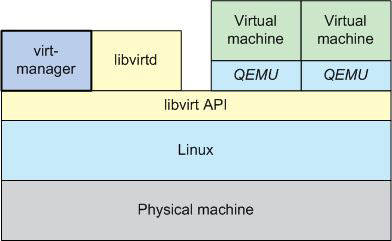
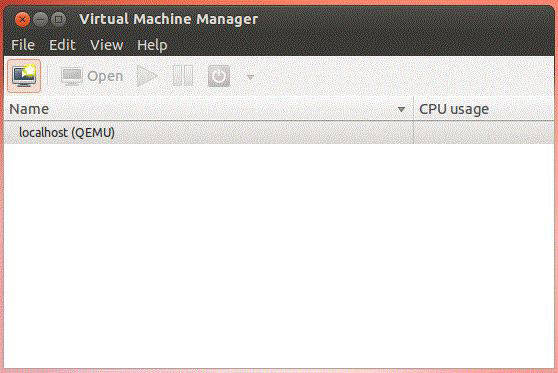
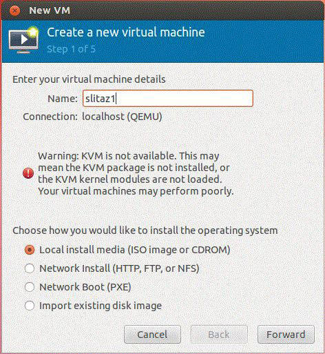
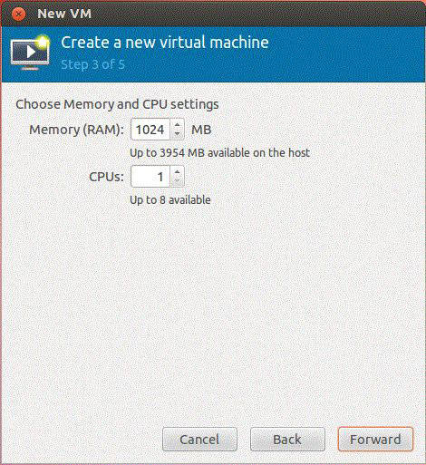
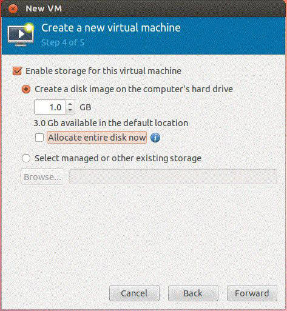
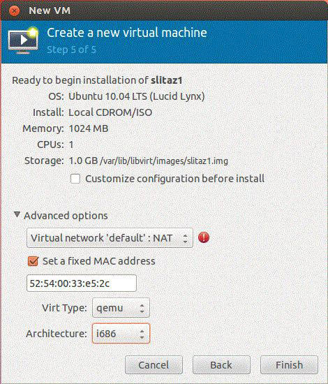
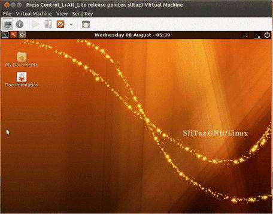
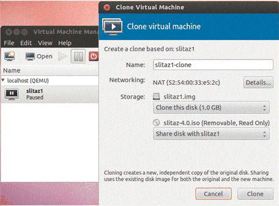
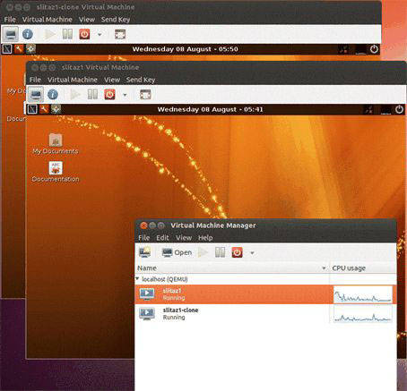

# 使用 Virtual Machine Manager 管理虚拟机
使用 Virt-Manager 创建虚拟机

**标签:** 云计算,数据科学

[原文链接](https://developer.ibm.com/zh/articles/cl-managingvms/)

M. Jones

发布: 2012-12-24

* * *

尽管服务器管理在过去问题重重，但虚拟化管理简化了一些问题，却放大了另一些问题。一个服务器上的单一操作系统的时代已成过去，并由多个位于各自的虚拟机 (VM) 容器中的操作系统所取代。此属性（称为 _虚拟机密度_）很有用，因为随着越来越多的虚拟机占用了更少数量的服务器，所需要的服务器硬件更少了。这带来了更少的硬件、更低的功耗，但却增加了管理复杂性。

所幸，已有解决方案来减轻服务器虚拟化带来的问题，其中以开源解决方案为首。其中一个由 Red Hat 开发的解决方案称为 Virtual Machine Manager，该解决方案显著简化了管理虚拟机（在关键的开源虚拟管理程序上运行）的能力，同时为这些虚拟机提供了度量其性能和监视资源利用率的功能。

## 虚拟机管理程序和虚拟机管理

虚拟化为管理虚拟机、它们的资源和物理主机的基础资源带来了新的挑战。多个操作系统现在以虚拟机的形式共享一个物理主机的资源，操作系统与物理主机之间不再存在一对一的映射关系。每个虚拟机使用一个容器和其他元数据来表示，该容器持有一个或多个虚拟磁盘，而这些元数据用来描述该虚拟机的配置和约束条件。每个虚拟机共享物理主机的资源，主机不仅需要配置，还需要了解这些资源的利用率（以确保虚拟机具有合适的密度，能够最佳地使用主机，既不会给可用资源带来重负，也不会浪费它们）。

## virt-manager 管理虚拟化的方法

Virtual Machine Manager (`virt-manager`) 是一个轻量级应用程序套件，形式为一个管理虚拟机的命令行或图形用户界面 (GUI)。除了提供对虚拟机的管理功能之外，`virt-manager` 还通过一个嵌入式虚拟网络计算 (VNC) 客户端查看器为 Guest 虚拟机提供一个完整图形控制台。

作为一个应用程序套件， `virt-manager` 包括了一组常见的虚拟化管理工具。这些工具已在表 1 中列出，包括虚拟机构造、克隆、映像制作和查看。`virsh` 实用程序不是 `virt-manager` 包的一部分，但它本身就具有很重要的价值。

##### 表 1\. 虚拟化管理应用程序（包括命令行工具）

应用程序描述`virt-manager`虚拟机桌面管理工具`virt-install`虚拟机配给工具`virt-clone`虚拟机映像克隆工具`virt-image`从一个 XML 描述符构造虚拟机`virt-viewer`虚拟机图形控制台`virsh``virsh` Guest 域的交互式终端

`virt-manager` 使用 `libvirt` 虚拟化库来管理可用的虚拟机管理程序。`libvirt` 公开了一个应用程序编程接口 (API)，该接口与大量开源虚拟机管理程序相集成，以实现控制和监视。`libvirt` 提供了一个名为 `libvirtd` 的守护程序，帮助实施控制和监视（如下面的一个简单堆栈中所示）。

**包含 QEMU 的 virt-manager 堆栈的简单表示**



Virtual Machine Manager 由 Red Hat 使用 Python 语言开发，用于控制虚拟机的生命周期，包括配给、虚拟网络管理，统计数据收集和报告，以及提供对虚拟机本身的简单图形访问。

## 安装 virt-manager

要安装 `virt-manager` 包，可使用针对您的具体发行版的包管理器。对于 Ubuntu，使用 `apt`：

```
$ sudo apt-get install virt-manager

```

Show moreShow more icon

`apt` 命令安装的 `virt-manager` 应用程序套件使用大约 22MB 的磁盘空间。作为安装的一部分， `libvirt` 守护程序应在运行。要进行验证，使用以下命令：

```
$ ps ax | grep libvirtd

```

Show moreShow more icon

该命令应显示 `libvirtd` 进程正在运行，使用 `-d` 选项告诉 `libvirtd` 以守护程序形式运行。回想一下，`libvirtd` 就是这个守护程序，它允许从 `virt-manager` 应用程序连接到虚拟机管理程序并通过它们连接到它们托管的虚拟机。

要确认 `virt-manager` 包是否已经安装，以及了解 `virt-manager` 文件的位置，可使用 `which` 命令：

```
$ which virt-manager

```

Show moreShow more icon

`virt-manager` 的位置也是套件中其他应用程序 (`virt-install`,`virt-image` 等）的主目录。

作为最后一步，使用 QEMU 作为虚拟机管理程序，这是因为 QEMU 可在任何硬件上运行。作为一个模拟器，QEMU 运行得有点慢，但不需要新硬件的虚拟化扩展。

```
$ sudo apt-get install qemu

```

Show moreShow more icon

现在，使用 `virt-manager` 创建两个虚拟机并进行监视。

## 使用 virt-manager 创建和管理虚拟机

本节中的步骤创建两个虚拟机。

1. 安装一个基于 Linux® 的操作系统 _SliTaz_，这是一个由社区开发的 Linux 操作系统发行版。该系统也是轻量级的，在运行 QEMU 和模拟硬件环境时具有优势。可使用以下命令下载此虚拟机：


    ```
    $ wget http://mirror.slitaz.org/iso/4.0/slitaz-4.0.iso

    ```


    Show moreShow more icon

2. 要开始虚拟机创建过程，使用 `sudo` 以 root 用户启动 `virt-manager`：


    ```
    $ sudo virt-manager

    ```


    Show moreShow more icon

    打开 `virt-manager` 窗口，可通过该窗口连接到本地 QEMU 虚拟机管理程序（通过右键单击 **localhost (QEMU)**，然后单击 **Connect** 来完成）。如果有更多虚拟机管理程序可用，那么它们应在这里列出，并可通过 `libvirt` API 连接。

    _Virtual Machine Manager 窗口_

    

3. 当连接到本地 QEMU 虚拟机管理程序时，单击 **Create Virtual Machine** 图标，这将启动 VM Construction Wizard。

4. 将此虚拟机命名为 `slitaz1`，并从一个本地 ISO（已在上面下载）发起您的操作系统安装。

    **创建一个虚拟机**

    

5. 单击 **Forward** 后，定义您的虚拟机的安装文件并为操作系统选择一个类型。在本例中，指定您的 ISO 文件，从操作系统类型列表中选择 **Linux**，然后从版本列表中选择 **Ubuntu 10.04 LTS (Lucid Linux)**。

    **定义安装媒体**

    

6. 定义虚拟机的执行环境。为此虚拟机分配 1GB 内存和一个单一 CPU。这些选择需要一些技巧，因为内存大小应适合您的虚拟机（对于这个特定实例，1GB 有点大材小用）。CPU 可帮助（而且有时候会损害）操作系统。如果操作系统有效利用了多个核心，那么这些核心可分发给虚拟机。

    **定义执行环境**

    

7. 定义虚拟机的存储环境。在本例中，请求 `virt-manager` 创建您的虚拟磁盘（而不是由您自行提供），并动态调整它的大小（最高 1 GB）。请注意，该磁盘选项可能影响安装和执行速度。如果将磁盘指定为动态，它最开始是一个较小的主机文件，然后随着虚拟机对它的使用而扩展。此动态过程需要比较少时间来管理。备用选择是 _raw_，这是一个具有主机操作系统（虚拟机管理程序）的完整大小的磁盘映像。这里的代价是需要更多主机磁盘空间，但虚拟机的运行速度应该会更快，这是因为不需要动态调整过程。

    **定义存储环境**

    

8. 作为最后一步，`virt-manager` 提供了该虚拟机目前为止的摘要信息，从而允许您定义网络化选项（选择默认值：网络地址转换 [NAT]）。请注意，它还提供了额外的选项和信息，比如虚拟磁盘的物理位置。您也可以定义自己想要的基础处理器的类型。在本例中，选择 AMD i686 作为架构，但也可选择 x86-64。

    **虚拟机的最后检查**

    

9. 当单击 **Finish** 时，启动虚拟机的过程就会开始。它首先引导一个 CD-ROM（您在其中提供了安装映像），这使得虚拟机能够安装该 Linux。当安装完成时，重新启动（这会自动断开 CD-ROM）之后就会得到一个正常运行的虚拟机。请注意，此窗口只提供了虚拟机的视图，并允许您与它交互。您可关闭此窗口，但虚拟机会继续在后台运行（并且可在 `virt-manager` root 窗口中看见它）。

    **运行轻量级 SliTaz Linux 发行版的虚拟机**

    

10. 要创建一个新虚拟机，只需克隆您现有的、已安装的虚拟机。指定您希望将虚拟机克隆到的 `virt-manager`，然后克隆整个磁盘（这样它们就不是共享的）。请注意，您可调整克隆的虚拟机的一些细节，比如网络配置。

    **在 virt-manager 中克隆一个虚拟机**

    

11. 单击 **Clone** 后，将基于第一个虚拟机创建一个新虚拟机，并且这个虚拟机可在它自己的 QEMU 环境中同时运行。如果要及时抓取操作系统和应用程序环境的快照，或者要在为机器配置了一个给定应用程序（比如 Apache Hadoop）后为它们创建一个本地虚拟化集群，那么克隆虚拟机就是一种不错的方式。在下图中，可以看到两个虚拟机都在执行，还能在 `virt-manager` root 窗口中看到它们的 CPU 使用情况。

    **克隆的虚拟机通过 virt-manager 同时运行**

    


本例阐述了虚拟机的创建、配置和执行的简单方法，无需详细了解基础虚拟机管理程序及其公开的众多选项（比如针对存储和网络管理）。尽管本例使用了 QEMU 提供的模拟，但 Linux 内核虚拟机 (KVM) 虚拟机管理程序可用于获取接近裸机的性能（使用硬件支持，比如 Intel® Virtual Technology [VT]）。除了克隆虚拟机，这种功能还可通过 `virt-manager` 应用程序创建、暂停和重新启动虚拟机。

## 支持工具

尽管 `virt-manager` 是 `libvirt` 虚拟化 API 的一个首要用户，但有一个越来越庞大的工具生态系统在使用此接口进行虚拟化管理。`virt-manager` 包提供了一个便捷的 GUI，用来在多个虚拟机管理程序和主机上创建和管理虚拟机。如果更喜欢命令行，那么会由许多工具为您提供只有命令行才能提供的能力和控制力。

`virt-install` 工具提供了配给新虚拟机的能力。`virt-manager` 提供了少量针对虚拟机创建的配置选项，而 `virt-install` 提供了丰富的配置选项，包括安装方法、存储配置、网络配置、图形配置、虚拟化选项，以及一个庞大的虚拟化设备选项列表。

`virt-image` 工具类似于 `virt-install` 工具，但支持您在 XML 中定义虚拟机创建过程的细节。该 XML 描述符文件指定了虚拟机的一般元数据、域属性（CPU、内存等），以及存储配置。

`virt-clone` 工具提供了一种克隆现有的虚拟机映像的方式。提到 _克隆_，我指的是复制现有的虚拟机，该虚拟机具有更新的参数，可确保新虚拟机是唯一的，从而避免发生冲突（比如 MAC 地址冲突）。

`virt-viewer` 工具为一个使用 VNC 协议的给定虚拟机提供了一个图形控制台。`virt-viewer` 可附加到在本地主机或远程主机上运行的虚拟机。

最后，管理 Guest 域的最强大的工具是虚拟化 shell，或者称为 `virsh`。`virsh` 可用于列出、启动和停止虚拟机，以及创建虚拟机。简言之，您可使用 `virsh` 跨虚拟机管理程序执行全面地管理公开在其他工具中未提供的虚拟化特性。

## 其他虚拟化管理解决方案

尽管 `virt-manager` 和其关联的工具为在桌面环境中管理虚拟机提供了一个有用的环境，但在一些情况下，您可能喜欢功能更加丰富的平台虚拟化解决方案。Red Hat 还提供了一个名为 `oVirt` 的解决方案，该解决方案类似于 `virt-manager` 使用 `libvirt` 来管理虚拟机和后端虚拟机管理程序。`oVirt` 解决方案支持多个后端虚拟机管理程序，甚至可管理企业级存储协议，比如 Fibre Channel、iSCSI 和网络文件系统 (NFS)。`oVirt` 解决方案还公开了一些企业级功能，比如在一个同构基础架构中的高可用性和实时迁移。

## 更多信息

`virt-manager` 并不是简单的另一个工具：它朝着具有开放 API 和开放云堆栈（桌面、服务器、数据中心）的开放云方向发展。`virt-manager` 和相关的工具为在桌面上管理虚拟化提供了一个既简单又强大的环境。无论您喜欢命令行的强大和脚本编写能力，还是喜欢 GUI 的简单性，`virt-manager` 和它的相关工具都已为您提供。

本文翻译自： [Managing VMs with the Virtual Machine Manager](https://developer.ibm.com/articles/cl-managingvms/)（2012-11-01）