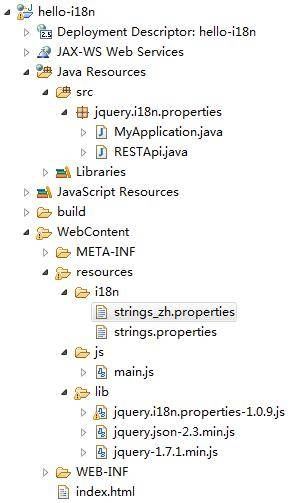
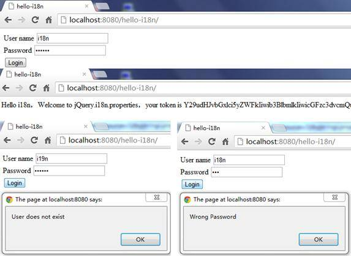
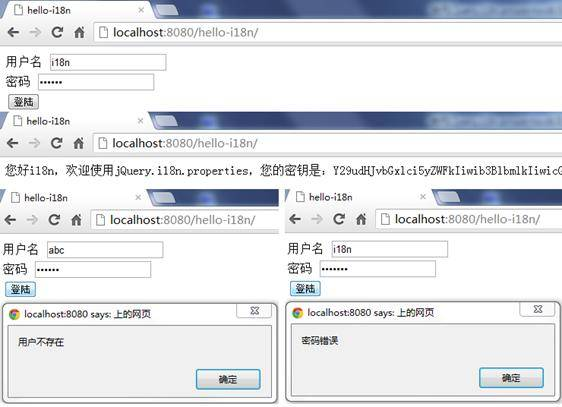
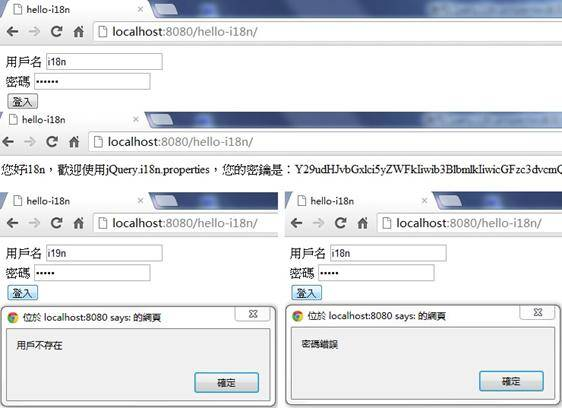

# 使用 jQuery.i18n.properties 实现 Web 前端的国际化
jQuery.i18n.properties 实战

**标签:** Web 开发

[原文链接](https://developer.ibm.com/zh/articles/1305-hezj-jqueryi18n/)

何志军

发布: 2013-05-30

* * *

## jQuery.i18n.properties 简介

在介绍 jQuery.i18n.properties 之前，我们先来看一下什么是国际化。国际化英文单词为：Internationalization，又称 i18n，”i”为单词的第一个字母，”18”为”i”和”n”之间单词的个数，而”n”代表这个单词的最后一个字母。在计算机领域，国际化是指设计能够适应各种区域和语言环境的软件的过程。

jQuery.i18n.properties 是一款轻量级的 jQuery 国际化插件。与 Java 里的资源文件类似，jQuery.i18n.properties 采用 .properties 文件对 JavaScript 进行国际化。jQuery.i18n.properties 插件根据用户指定的（或浏览器提供的 ）语言和国家编码（符合 ISO-639 和 ISO-3166 标准）来解析对应的以”.properties”为后缀的资源文件。

利用资源文件实现国际化是一种比较流行的方式，例如 Android 应用就可以采用以语言和国家编码命名的资源文件来实现国际化。jQuery.i18n.properties 插件中的资源文件以”.properties”为后缀，包含了区域相关的键值对。我们知道，Java 程序也可以使用以 .properties 为后缀的资源文件来实现国际化，因此，当我们要在 Java 程序和前端 JavaScript 程序中共享资源文件时，这种方式就显得特别有用。jQuery.i18n.properties 插件首先加载默认的资源文件（例如：strings.properties），然后加载针对特定语言环境的资源文件（例如：strings\_zh.properties），这就保证了在未提供某种语言的翻译时，默认值始终有效。开发人员可以以 JavaScript 变量（或函数）或 Map 的方式使用资源文件中的 key。

总的来说，jQuery.i18n.properties 有一下一些特点：

1. 使用 Java 标准的 .properties 文件作为资源文件，资源文件命名有以下三种格式：


    ```
    basename_properties
    basename_language.properties
    basename_language_country.properties

    ```


    Show moreShow more icon

2. 使用 ISO-639 作为语言编码标准，ISO-3166 作为国家名称编码标准
3. 按顺序加载默认资源文件和指定语言环境的资源文件，保证默认值始终可用
4. 未指定语言环境时使用浏览器提供的语言
5. 可以在资源字符串中使用占位符（例如：hello= 你好 {0}! 今天是 {1}。）
6. 资源文件中的 Key 支持命名空间（例如：com.company.msgs.hello = Hello!）
7. 支持跨行的值
8. 可以以 JavaScript 变量（或函数）或 Map 的方式使用资源文件中的 Key

## jQuery.i18n.properties API

jQuery.i18n.properties 的 API 非常简单，只有少数几个 API，即 jQuery.i18n.properties()、jQuery.i18n.prop()、jQuery.i18n.browserLang()。当然，和其他 jQuery 插件一样，我们也可以采用 $.i18n.properties()、$.i18n.prop() 和 $.i18n.browserLang() 的形式使用这用这些 API。

### jQuery.i18n.properties(settings)

该方法加载资源文件，其中 settings 是配置加载选项的一系列键值对，各配置项的具体描述如表 1 所示。

##### 表 1\. settings

**选项****描述****类型****可选？**name资源文件的名称，例如 strings 或 [strings1,strings2]，前者代表一个资源文件，后者代表资源文件数组。String 或 String[]否path资源文件所在目录的路径String是mode加载模式：”vars”表示以 JavaScript 变量或函数的形式使用资源文件中的 Key，”map”表示以 Map 的方式使用资源文件中的 Key，”both”表示可以同时使用两种方式。如果资源文件中的 Key 包含 JavaScript 的关键字，则只能采用”map”。默认值是”vars”。String是languageISO-639 指定的语言编码（如：”en”表示英文、”zh”表示中文），或同时使用 ISO-639 指定的语言编码和 ISO-3166 指定的国家编码（如：”en\_US”，”zh\_CN”等）。如果不指定，则采用浏览器报告的语言编码。String是cache指定浏览器是否对资源文件进行缓存，默认为 false。boolean是encoding加载资源文件时使用的编码。默认为 UTF-8。String是callback代码执行完成时运行的回调函数function是

jQuery.i18n.properties() 的使用方法如清单 1 所示。

##### 清单 1\. jQuery.i18n.properties() 用法

```
jQuery.i18n.properties({
    name:'strings',// 资源文件名称
    path:'bundle/',// 资源文件所在目录路径
    mode:'both',// 模式：变量或 Map
    language:'pt_PT',// 对应的语言
    cache:false,
    encoding: 'UTF-8',
    callback: function() {// 回调方法
    }
});

```

Show moreShow more icon

### jQuery.i18n.prop(key)

该方法以 map 的方式使用资源文件中的值，其中 key 指的是资源文件中的 key。当 key 指定的值含有占位符时，可以使用 jQuery.i18n.prop(key,var1,var2… ) 的形式，其中 var1,var2…对各占位符依次进行替换。例如资源文件中有”msg\_hello= 您好 {0}，今天是 {1}。”的键值对，则我们可以采用”jQuery.i18n.prop( ‘ msg\_hello ‘ , ‘小明’ , ‘星期一’ );”的形式使用 msg\_hello。

jQuery.i18n.browserLang() 用于获取浏览浏览器的语言信息，这里不再单独介绍。

## 示例

下面我们以一个具体的示例来介绍如何通过 jQuery.i18n.properties 插件来实现 Web 前端的国际化。我们建立一个名为 hello-i18n 的 Java Web 应用，该应用根据浏览器的语言决定以英文或中文显示登录界面，登录成功后以相应的语言显示欢迎信息，登录失败则以相应的语言显示错误信息。

为了达到松耦合的目的，前端采用纯 JavaScript+HTML 来实现（我们的目的是介绍如何实现国际化，而不是如何美化界面，因此暂不使用 CSS），服务器端采用 RESTFul Web 服务。前端通过 jQuery Ajax 的方式与服务器端进行交互，避免 JSP 等传统 Java Web 应用中前后端代码冗杂在一起的现象。

### 开发测试环境

- 操作系统：Windows7 64 位专业版。
- IDE：Eclipse-JEE-Juno。
- Libs：jQuery 1.7.1，jQuery.i18n.properties 1.0.9，Apache Wink 1.1.3。
- 测试浏览器：Google Chrome 21.0.1180.83 m，FireFox 15.0.1。

### 服务器端的 RESTFul Web 服务

我们采用 Apache Wink 来实现服务器端 RESTFul Web 服务（关于如何使用 Apache Wink 来实现 RESTFul Web 服务，请参考”参考资料”一节中关于 Wink 的参考资料），这个 Web 服务实现用户验证功能。由于我们的重点不在服务器端，因此我们不真正验证用户，而是模拟验证功能，并生成一个假的密钥（在真实的环境中，密钥会被用来对其他 REST 请求进行验证）。REST API 如表 2 所示，代码如清单 2 所示。

##### 表 2\. REST API

**属性****描述**描述验证用户信息，并生成密钥URI 示例`http://localhost:8080/rest/users/{id}/tokens`HTTP 请求类型POSTRequest Boy{password:”…”}Response HeadersContent-type: application/jsonResponse Code200：OK – 验证成功 401：Unauthorized – 密码不正确 403：Forbidden – 用户不存在Response Body{token:” Y29udHJvbGxlci5yZWFkIiwib3BlbmlkIiwicGFzc dvcQd3Jp dGUiXSwiZW…”}

##### 清单 2\. REST 代码

```
@Path("/users")
public class RESTApi {

@Path("/{id}/tokens")
@POST
@Produces({ MediaType.APPLICATION_JSON })
@Consumes({ MediaType.APPLICATION_JSON })
public Response authenticate(@PathParam("id") String id,
Map<String, Object> payload) {
        // 模拟验证功能，仅当用户名为"i18n", 密码为"123456"时验证成功
if (id.equals("i18n")) {
String pwd = (String) payload.get("password");
    if (pwd.equals("123456")) {
        // 生成模拟密钥
        Map<String, String> token = new HashMap<String, String>();
        token.put("token",
            "Y29udHJvbGxlci5yZWFkIiwib3BlbmlkIiwicGFzc3dvcmQud3JpdGUiXSwiZW...");
return Response.status(Status.OK).entity(token).build();
    } else {
        return Response.status(Status.UNAUTHORIZED).build();
    }
}
    return Response.status(Status.FORBIDDEN).build();
}

}

```

Show moreShow more icon

### 建立资源文件

在 Eclipse 中，对 hello-i18n 项目建立如图 1 所示的目录结构。

##### 图 1\. 项目组织结构



在 i18n 目录下创建 strings.properties 和，stirngs\_zh.properties 两个资源文件，其中 strings.properties 对应默认翻译，如清单 3 所示；string\_zh.properties 对应中文翻译，如清单 4 所示。

##### 清单 3\. stirngs.properties

```
string_username=User name
string_password=Password
string_login=Login
string_hello=Hello {0}，Welcome to jQuery.i18n.properties，your token is {1}。
string_usernotexist=User does not exist
string_wrongpassword=Wrong Password

```

Show moreShow more icon

##### 清单 4\. strings\_zh.properties

```
string_username= 用户名
string_password= 密码
string_login= 登陆
string_hello= 您好 {0}，欢迎使用 jQuery.i18n.properties，您的密钥是：{1}。
string_usernotexist= 用户不存在
string_wrongpassword= 密码错误

```

Show moreShow more icon

### 引用 jQuery.i18n.properties 插件

和其他 jQuery 插件一样，jQuery.i18n.properties 插件依赖于 jQuery，因此我们首先需要引用 jQuery。jQuery.i18n.properties 对 jQuery 的版本没有明确要求，这里我们使用 jQuery-1.7.1。我们使用清单 5 所示的方式在 index.html 中引用 jQuery 和 jQuery.i18n.properties 插件。

##### 清单 5\. 引用 jQuery.i18n.properties

```
<script type="text/javascript" src="resources/lib/jquery-1.7.1.min.js">
</script>
<script type="text/javascript" src="resources/lib/jquery.i18n.properties-1.0.9.js">
</script>

```

Show moreShow more icon

index .html 中还定义了界面元素，如清单 6 所示。

##### 清单 6\. 界面元素

```
<div id="content">
<div>
<label id="label_username"></label>
<input type="text" id="username"></input>
</div>
<div>
<label id="label_password"></label>
<input type="password" id="password"></input>
</div>
<input type="button" id="button_login"/>
</div>

```

Show moreShow more icon

### 使用 jQuery.i18n.properties 插件

在 main.js，使用清单 7 所示的方法加载资源文件，清单 7 中未指定”language”参数选项，表示使用浏览器语言。除了在 jQuery.i18n.properties() 定义的回调函数中使用资源文件中的定义的值外，成功加载资源文件后，我们也可以在其它地方使用这些值。

##### 清单 7\. 加载资源文件

```
function loadProperties(){
jQuery.i18n.properties({// 加载资浏览器语言对应的资源文件
name:'strings', // 资源文件名称
path:'resources/i18n/', // 资源文件路径
mode:'map', // 用 Map 的方式使用资源文件中的值
callback: function() {// 加载成功后设置显示内容
// 显示"用户名”
$('#label_username').html($.i18n.prop('string_username'));
            // 显示"密码”
$('#label_password').html($.i18n.prop('string_password'));
            // 显示"登录”
$('#button_login').val($.i18n.prop('string_login'));
}
});
}

```

Show moreShow more icon

当用户点击登录按钮后，我们使用 REST 请求将用户信息发送到前文定义的 RESTFul Web 服务，若用户信息验证成功，则显示欢迎信息和 Web 服务返回的密钥，若验证失败则显示错误信息，代码如清单 8 所示。

##### 清单 8\. 前端登录逻辑

```
$('#button_login').click(function(){// 点击登录按钮后验证用户信息
var id = $('#username').val();// 用户名
var payload = {};
payload['password']=$('#password').val();
payload = $.toJSON(payload);
$.ajax({
url : 'rest/users/' + id + '/tokens',//REST URI
type : 'POST',
data: payload, // Request body
contentType : 'application/json',
dataType:'json',
success : function(data) {
// 验证成功则显示欢迎信息和密钥
// 使用含占位符的值
$('#content').html($.i18n.prop('string_hello',id,data.token));
},
error : function(jqXHR, textStatus, errorThrown) {
if(jqXHR.status == 403){
// 用户不存在
alert($.i18n.prop('string_usernotexist'));
}else if(jqXHR.status == 401){
       // 密码错误
       alert($.i18n.prop('string_wrongpassword'));
}else{
       // 其他异常信息
       alert(errorThrown);
}
}
});
});

```

Show moreShow more icon

### 运行效果

将 hello-i18n 项目部署到本地的 Tomcat 上，打开 Chrome 浏览器，将语言设置为英文，在地址栏中输入 `http://localhost:8080/hello-i18n`，运行效果如图 2 所示。

##### 图 2\. 英文环境下的运行效果



将语言更改为简体中文，重启 Chrome，运行效果如图 3 所示。

##### 图 3\. 中文环境下的运行效果



## 问题与改进

### 资源文件命名问题

在上面的示例中，我们的程序只自动识别中文和英文两种翻译，而不能进一步区分简体中文与繁体中文。为了使上面的示例能够根据浏览器语言设置自动区分简体中文和繁体中文，我们将简体中文对应的资源文件 strings\_zh.properties 重命名为 strings\_zh\_CN.properties，并添加如清单 9 所示的繁体中文资源文件 strings\_zh\_TW.properties。

##### 清单 9\. strings\_zh\_TW.properties

```
string_username= 用戶名
string_password= 密碼
string_login= 登入
string_hello= 您好 {0}，歡迎使用 jQuery.i18n.properties，您的密鑰是：{1}。
string_usernotexist= 用戶不存在
string_wrongpassword= 密碼錯誤

```

Show moreShow more icon

运行程序，分别将浏览器语言设置为”中文（简体中文）”和”中文（繁體中文）”进行测试，发现程序并不能如我们预期显示简体中文和繁体中文，而是都以英文显示。分析后发现，造成这种现象的原因，是 jQuery.i18n.properties 插件默认的资源文件命名方式与浏览器上报的语言区域编码不一致，从而导致插件加载资源文件失败。以简体中文为例，jQuery.i18n.properties 默认的资源文件命名方式为”zh\_CN”的形式，而浏览器上报的语言区域编码为 zh-CN”的形式，此时 jQuery.i18n.properties 插件加载资源文件的步骤如下：

1. 加载默认资源文件即 strings.properties，成功。
2. 加载名称为 strings\_zh.properties 的资源文件，失败。
3. 加载名称为 stirngs\_zh-CN.properties 的资源文件，失败。

由于第 2 步和第 3 步都失败，所以 jQuery.i18n.properties 使用默认资源文件 strings.properties 中的翻译，也就是英文翻译。同理，繁体中文也不能正常显示。解决该问题有 3 种方法：

1. 采用 strings\_zh-CN.properties 的方式命名资源文件。这是最简单的方法，但这种命名方式和 Java 标准的资源文件命名方式不一致；
2. 使用默认的资源文件命名方式，并在调用 jQuery.i18n.properties() 方法之前使用 var lang = jQuery.i18n.browserLang() `的方式` 显式获取浏览器的语言，然后将 lang 中的”-”替换为”\_”，并在使用 jQuery.i18n.properties() 方法时将 lang 作为参数。
3. 更改 jQuery.i18n.properties 的源码。

这里我们采用最简单的第一种方式，将简体中文对应的资源文件 string\_zh\_CN.properties 重命名为 stirngs\_zh-CN.properties，并将繁体中文对应的资源文件 strings\_zh\_TW.properties 重命名为 strings\_zh-TW.properties。现在，程序就可以根据浏览器语言设置自动区分简体中文和繁体中文了，繁体中文的运行效果如图 4 所示。

##### 图 4\. 繁体中文环境下的运行效果



## 结束语

本文对 jQuery 国际化插件 jQuery.i18n.properties 进行了介绍，并用实际例子介绍了如何使用 jQuery.i18n.properties 插件实现 Web 前端的国际化。总结起来，jQuery.i18n.properties 具有轻量级（压缩后仅 4kb）、简单易用等特点，但是作为一个普及度不高的轻量级插件，不一定适用于大型的或对效率要求极高的场景。

希望本文能为正在寻找小型 Web 应用前端国际化解决方案的读者提供一定的参考。

## 下载示例代码

[hello-i18n.zip](http://www.ibm.com/developerworks/cn/web/1305_hezj_jqueryi18n/hello-i18n.zip)