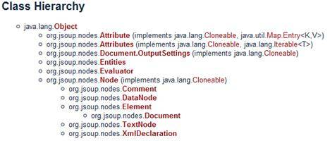

# 使用 jsoup 对 HTML 文档进行解析和操作
jsoup 使用入门

**标签:** Java

[原文链接](https://developer.ibm.com/zh/articles/j-lo-jsouphtml/)

刘柄成

发布: 2011-03-02

* * *

## jsoup 简介

jsoup 是一款 Java 的 HTML 解析器，可直接解析某个 URL 地址、HTML 文本内容。它提供了一套非常省力的 API，可通过 DOM，CSS 以及类似于 jQuery 的操作方法来取出和操作数据。

jsoup 的主要功能如下：

1. 从一个 URL，文件或字符串中解析 HTML；

2. 使用 DOM 或 CSS 选择器来查找、取出数据；

3. 可操作 HTML 元素、属性、文本；


jsoup 是基于 MIT 协议发布的，可放心使用于商业项目。

jsoup 的主要类层次结构如图 1 所示：

##### 图 1\. jsoup 的类层次结构



接下来我们专门针对几种常见的应用场景举例说明 jsoup 是如何优雅的进行 HTML 文档处理的。

## 文档输入

jsoup 可以从包括字符串、URL 地址以及本地文件来加载 HTML 文档，并生成 Document 对象实例。

下面是相关代码：

##### 清单 1

```
// 直接从字符串中输入 HTML 文档
String html = "<html><head><title> 开源中国社区 </title></head>"
+ "<body><p> 这里是 jsoup 项目的相关文章 </p></body></html>";
Document doc = Jsoup.parse(html);

// 从 URL 直接加载 HTML 文档
Document doc = Jsoup.connect("http://www.oschina.net/").get();
String title = doc.title();

Document doc = Jsoup.connect("http://www.oschina.net/")
.data("query", "Java")   // 请求参数
.userAgent("I ' m jsoup") // 设置 User-Agent
.cookie("auth", "token") // 设置 cookie
.timeout(3000)           // 设置连接超时时间
.post();                 // 使用 POST 方法访问 URL

// 从文件中加载 HTML 文档
File input = new File("D:/test.html");
Document doc = Jsoup.parse(input,"UTF-8","http://www.oschina.net/");

```

Show moreShow more icon

请大家注意最后一种 HTML 文档输入方式中的 parse 的第三个参数，为什么需要在这里指定一个网址呢（虽然可以不指定，如第一种方法）？因为 HTML 文档中会有很多例如链接、图片以及所引用的外部脚本、css 文件等，而第三个名为 baseURL 的参数的意思就是当 HTML 文档使用相对路径方式引用外部文件时，jsoup 会自动为这些 URL 加上一个前缀，也就是这个 baseURL。

例如 `<a href=/project> 开源软件 </a>` 会被转换成 `<a href=http://www.oschina.net/project> 开源软件 </a>`。

## 解析并提取 HTML 元素

这部分涉及一个 HTML 解析器最基本的功能，但 jsoup 使用一种有别于其他开源项目的方式——选择器，我们将在最后一部分详细介绍 jsoup 选择器，本节中你将看到 jsoup 是如何用最简单的代码实现。

不过 jsoup 也提供了传统的 DOM 方式的元素解析，看看下面的代码：

##### 清单 2.

```
File input = new File("D:/test.html");
Document doc = Jsoup.parse(input, "UTF-8", "http://www.oschina.net/");

Element content = doc.getElementById("content");
Elements links = content.getElementsByTag("a");
for (Element link : links) {
String linkHref = link.attr("href");
String linkText = link.text();
}

```

Show moreShow more icon

你可能会觉得 jsoup 的方法似曾相识，没错，像 getElementById 和 getElementsByTag 方法跟 JavaScript 的方法名称是一样的，功能也完全一致。你可以根据节点名称或者是 HTML 元素的 id 来获取对应的元素或者元素列表。

与 htmlparser 项目不同的是，jsoup 并没有为 HTML 元素定义一个对应的类，一般一个 HTML 元素的组成部分包括：节点名、属性和文本，jsoup 提供简单的方法供你自己检索这些数据，这也是 jsoup 保持瘦身的原因。

而在元素检索方面，jsoup 的选择器简直无所不能，

##### 清单 3.

```
File input = new File("D:\test.html");
Document doc = Jsoup.parse(input,"UTF-8","http://www.oschina.net/");

Elements links = doc.select("a[href]"); // 具有 href 属性的链接
Elements pngs = doc.select("img[src$=.png]");// 所有引用 png 图片的元素

Element masthead = doc.select("div.masthead").first();
// 找出定义了 class=masthead 的元素

Elements resultLinks = doc.select("h3.r > a"); // direct a after h3

```

Show moreShow more icon

这是 jsoup 真正让我折服的地方，jsoup 使用跟 jQuery 一模一样的选择器对元素进行检索，以上的检索方法如果换成是其他的 HTML 解释器，至少都需要很多行代码，而 jsoup 只需要一行代码即可完成。

jsoup 的选择器还支持表达式功能，我们将在最后一节介绍这个超强的选择器。

## 修改数据

在解析文档的同时，我们可能会需要对文档中的某些元素进行修改，例如我们可以为文档中的所有图片增加可点击链接、修改链接地址或者是修改文本等。

下面是一些简单的例子：

##### 清单 4.

```
doc.select("div.comments a").attr("rel", "nofollow");
// 为所有链接增加 rel=nofollow 属性
doc.select("div.comments a").addClass("mylinkclass");
// 为所有链接增加 class=mylinkclass 属性
doc.select("img").removeAttr("onclick"); // 删除所有图片的 onclick 属性
doc.select("input[type=text]").val(""); // 清空所有文本输入框中的文本

```

Show moreShow more icon

道理很简单，你只需要利用 jsoup 的选择器找出元素，然后就可以通过以上的方法来进行修改，除了无法修改标签名外（可以删除后再插入新的元素），包括元素的属性和文本都可以修改。

修改完直接调用 Element(s) 的 html() 方法就可以获取修改完的 HTML 文档。

## HTML 文档清理

jsoup 在提供强大的 API 同时，人性化方面也做得非常好。在做网站的时候，经常会提供用户评论的功能。有些用户比较淘气，会搞一些脚本到评论内容中，而这些脚本可能会破坏整个页面的行为，更严重的是获取一些机要信息，例如 XSS 跨站点攻击之类的。

jsoup 对这方面的支持非常强大，使用非常简单。看看下面这段代码：

##### 清单 5.

```
String unsafe = "<p><a href='http://www.oschina.net/' onclick='stealCookies()'>
开源中国社区 </a></p>";
String safe = Jsoup.clean(unsafe, Whitelist.basic());
// 输出 :
// <p><a href="http://www.oschina.net/" rel="nofollow"> 开源中国社区 </a></p>

```

Show moreShow more icon

jsoup 使用一个 Whitelist 类用来对 HTML 文档进行过滤，该类提供几个常用方法：

##### 表 1\. 常用方法：

**方法名****简介**none()只允许包含文本信息basic()允许的标签包括：a, b, blockquote, br, cite, code, dd, dl, dt, em, i, li, ol, p, pre, q, small, strike, strong, sub, sup, u, ul, 以及合适的属性simpleText()只允许 b, em, i, strong, u 这些标签basicWithImages()在 basic() 的基础上增加了图片relaxed()这个过滤器允许的标签最多，包括：a, b, blockquote, br, caption, cite, code, col, colgroup, dd, dl, dt, em, h1, h2, h3, h4, h5, h6, i, img, li, ol, p, pre, q, small, strike, strong, sub, sup, table, tbody, td, tfoot, th, thead, tr, u, ul

如果这五个过滤器都无法满足你的要求呢，例如你允许用户插入 flash 动画，没关系，Whitelist 提供扩展功能，例如 whitelist.addTags(“embed”,”object”,”param”,”span”,”div”); 也可调用 addAttributes 为某些元素增加属性。

## jsoup 的过人之处——选择器

前面我们已经简单的介绍了 jsoup 是如何使用选择器来对元素进行检索的。本节我们把重点放在选择器本身强大的语法上。下表是 jsoup 选择器的所有语法详细列表。

##### 表 2\. 基本用法：

tagname使用标签名来定位，例如 a\*\*nstag\*\*使用命名空间的标签定位，例如 fb:name 来查找  元素**#id**使用元素 id 定位，例如 #logo**.class**使用元素的 class 属性定位，例如 .head**[attribute]**使用元素的属性进行定位，例如 [href] 表示检索具有 href 属性的所有元素**[^attr]**使用元素的属性名前缀进行定位，例如 [^data-] 用来查找 HTML5 的 dataset 属性**[attr=value]**使用属性值进行定位，例如 [width=500] 定位所有 width 属性值为 500 的元素**[attr^=value], [attr$=value], [attr\*=value]**这三个语法分别代表，属性以 value 开头、结尾以及包含**[attr~=regex]**使用正则表达式进行属性值的过滤，例如 img[src~=(?i).(pngjpe?g)]**\***定位所有元素

以上是最基本的选择器语法，这些语法也可以组合起来使用，下面是 jsoup 支持的组合用法：

##### 表 3：组合用法：

el#id定位 id 值某个元素，例如 a#logo -> **el.class**定位 class 为指定值的元素，例如 div.head ->

xxxx

**el[attr]**定位所有定义了某属性的元素，例如 a[href]**以上三个任意组合**例如 a[href]#logo 、a[name].outerlink**ancestor child**这五种都是元素之间组合关系的选择器语法，其中包括父子关系、合并关系和层次关系。**parent > child****siblingA + siblingB****siblingA ~ siblingX****el, el, el**

除了一些基本的语法以及这些语法进行组合外，jsoup 还支持使用表达式进行元素过滤选择。下面是 jsoup 支持的所有表达式一览表：

##### 表 4\. 表达式：

:lt(n)例如 td:lt(3) 表示 小于三列**:gt(n)**div p:gt(2) 表示 div 中包含 2 个以上的 p**:eq(n)**form input:eq(1) 表示只包含一个 input 的表单**:has(seletor)**div:has(p) 表示包含了 p 元素的 div**:not(selector)**div:not(.logo) 表示不包含 class=logo 元素的所有 div 列表**:contains(text)**包含某文本的元素，不区分大小写，例如 p:contains(oschina)**:containsOwn(text)**文本信息完全等于指定条件的过滤**:matches(regex)**使用正则表达式进行文本过滤：div:matches((?i)login)**:matchesOwn(regex)**使用正则表达式找到自身的文本

## 结束语

jsoup 的基本功能到这里就介绍完毕，但由于 jsoup 良好的可扩展性 API 设计，你可以通过选择器的定义来开发出非常强大的 HTML 解析功能。再加上 jsoup 项目本身的开发也非常活跃，因此如果你正在使用 Java ，需要对 HTML 进行处理，不妨试试。