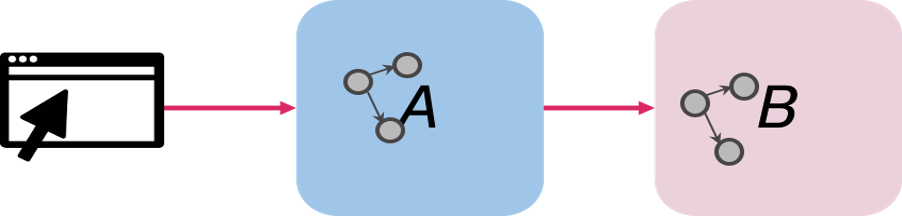

# 使用反应式消息传递开发反应式微服务
从同步到异步，再到采用 Eclipse MicroProfile Reactive Messaging 的反应式方法

**标签:** Eclipse MicroProfile,Java,反应式系统

[原文链接](https://developer.ibm.com/zh/articles/develop-reactive-microservices-with-microprofile/)

[Emily Jiang](https://developer.ibm.com/zh/profiles/emijiang), [Grace Jansen](https://developer.ibm.com/zh/profiles/grace.jansen1)

发布: 2020-08-25

* * *

## 简介

许多基于微服务的应用程序都是采用流行的 RESTful 方法开发的，用于这些微服务之间的通信，这些微服务通常被称为命令式微服务。但是，随着反应式编程的日益普及，许多开发者正在改造其应用程序，从先前使用的命令式逻辑转向异步的非阻塞功能样式。

但是，人们很难知道该从何着手实现这种转变，并通过应用程序提高响应能力和反应速度。本文将引导您完成从命令式到反应式的旅程，并解释何时需要考虑编写反应式微服务。

## 为何要采用反应式方法？

为了探究反应式方法在开发者中日益普及的原因，以及为何如此众多的应用程序转向反应式方法，我们来看一个简单的演示应用程序。

该演示应用程序包含两个微服务：service-a 和 service-b。最初，它们通过 RESTful 调用连接在一起，从而使一个 service-a 端点公开给应用程序的客户端，如下图所示。



从目前来看，没有什么问题。但是，有一天，service-b 停止响应，阻塞了 service-a。这导致您的应用程序被阻塞并且无反应。为了解决此问题，可以将 service-a 和 service-b 之间的调用从同步更改为异步，从而允许 service-a 在等待 service-b 重新联机的过程中执行其他任务。

### 从同步调用到异步调用

“ [采用 JAX-RS 和 MicroProfile 的异步 REST](https://openliberty.io/blog/2019/01/24/async-rest-jaxrs-microprofile.html)“（Open Liberty 博客，2019 年 1 月）：

了解如何进行 JAX-RS 异步调用。

从同步调用更改为异步调用可谓轻而易举。您可以在 Java 8 中使用 [CompletionStages](https://docs.oracle.com/javase/8/docs/api/java/util/concurrent/CompletionStage.html)。但是，一旦进入异步世界，就会出现新的难题。例如，现在需要管理 Java EE 上下文。线程池中的任何新线程都不会从其父级继承任何上下文。这是个问题，因为安全上下文、JNDI（Java 命名和目录接口）和 CDI（上下文和依赖注入）通常需要与分配给您的方法调用的任何新线程相关联。那如何实现呢？幸运的是，Eclipse MicroProfile 对此也有一个答案：MicroProfile Context Propagation。

### MicroProfile Context Propagation

“ [Open Liberty 中的 MicroProfile Context Propagation](https://openliberty.io/blog/2019/08/16/microprofile-context-propagation.html)“（Open Liberty 博客，2019 年 8 月）：

深入了解 MicroProfile Context Propagation，以及如何从父线程捕获上下文，然后与新线程关联。

[MicroProfile Context Propagation](https://microprofile.io/project/eclipse/microprofile-context-propagation) 引入了 [ManagedExecutor](https://openliberty.io/docs/modules/reference/microprofile-3.0-javadoc/org/eclipse/microprofile/context/ManagedExecutor.html) 和 [ThreadContext](https://openliberty.io/docs/modules/reference/microprofile-3.0-javadoc/org/eclipse/microprofile/context/ThreadContext.html) API，用于管理由线程池分派并由应用程序运行时管理的线程的上下文。MicroProfile Context Propagation 中的托管执行程序使您可以使用完成阶段，这些阶段在可预测的线程上下文中运行，而不论操作最终在哪个线程上运行。使用 MicroProfile Context Propagation，线程上下文是完全确定的，因为始终从创建完成阶段的线程中捕获上下文，并在运行操作时应用该上下文。以下代码清单显示了使用 MicroProfile Context Propagation 来传播安全性和应用程序上下文的示例。

```lang-java
@Qualifier
@Retention(RetentionPolicy.RUNTIME)
@Target({ ElementType.FIELD, ElementType.METHOD, ElementType.PARAMETER })
public @interface SecurityAndAppContext {}

@Produces @ApplicationScoped @SecurityAndAppContext
ManagedExecutor createExecutor(
    @ConfigProperty(name="exec1.maxAsync", defaultValue="5") Integer a,
    @ConfigProperty(name="exec1.maxQueued", defaultValue="20") Integer q) {
    return ManagedExecutor.builder()
                          .maxAsync(a)
                          .maxQueued(q)
                          .propagated(ThreadContext.SECURITY, ThreadContext.APPLICATION)
                          .cleared(ThreadContext.ALL_REMAINING)
                          .build();
}

```

Show moreShow more icon

但是，只有在后端可靠的情况下，将应用程序转换为仅使用异步调用才有用。如果后端不可靠，并且微服务经常失败，那么异步线程将变得无反应，保持挂起状态，并等待后端。为了确保应用程序通信的异步性有效，就需要改善所涉及微服务的灾备能力。为此，可以利用 MicroProfile Fault Tolerance。

### MicroProfile Fault Tolerance

[MicroProfile Fault Tolerance](https://microprofile.io/project/eclipse/microprofile-fault-tolerance) 提供以下功能，帮助确保微服务具有灾备能力：

–`@Retry`：处理临时网络故障
–`@CircuitBreaker`：在可重复的失败下快速失败
–`@Bulkhead`：防止一项微服务使整个系统瘫痪
–`@Timeout`：为业务关键型任务设置时间限制
–`@Fallback`：提供备份计划

以下代码清单演示了如何使用 `@Retry` 和 `@Fallback` 来构建安全永续的微服务：

```
    @Retry(maxRetries = 2)
    @Fallback (applyOn={ExceptionA.class, ExceptionB.class}, skipOn=ExceptionBSub.class, fallbackMethod="fallbackForServiceB")
    publicString serviceB() {
       return nameService();
    }

    Private String fallbackForServiceB() {
        return "myFallback";
    }

```

Show moreShow more icon

“ [通过 MicroProfile Fault Tolerance 实现安全永续的异步编程：第 1 部分](https://openliberty.io/blog/2020/06/04/asynchronous-programming-microprofile-fault-tolerance.html)“（Open Liberty 博客，2020 年 6 月）：

进一步了解 Fault Tolerance 如何帮助执行异步调用。

很多开发者认为，通过实现异步编程，他们的应用程序现在具备了非阻塞特征。但不幸的是，大多数情况都没这么简单。单凭异步编程并不能解决阻塞执行线程的问题。如果应用程序中的微服务需要很长时间才能响应，则正在执行该进程的线程将被阻塞，并等待响应。被阻塞的线程越多，应用程序的响应能力就越差。尝试解决此问题的一种方法是分配更多的线程，以便能够处理更多进程，但是线程并不是无限的。当所有可用线程都用完时，结果会怎样？应用程序会停止运行，并且不会对用户作出任何反应。

随着开源的兴起，许多应用程序还利用了第三方代码，而应用程序开发者可能并不熟悉此代码，或者不知道此代码是否为非阻塞。这也可能导致应用程序进程流中的潜在阻塞。

那么，如何真正使我们的应用程序实现无阻塞呢？为此，我们需要转向反应式方法。如果不确定“反应式”一词的真正含义，可查看“ [定义“反应式”一词](/zh/articles/defining-the-term-reactive/)”一文（IBM Developer，2020 年 8 月）。

## 创建反应式微服务

如 [反应式宣言](https://www.reactivemanifesto.org/) 所述，响应迅速、安全永续的弹性应用程序由消息驱动的异步主干提供支持。MicroProfile Reactive Messaging 可以在应用程序组件之间实现基于消息的异步通信，从而提供了一种创建反应式微服务的简便方法。它让微服务能够异步发送、接收和处理作为连续事件流接收的消息。

### MicroProfile Reactive Messaging

[MiroProfile Reactive Messaging](https://microprofile.io/project/eclipse/microprofile-reactive-messaging) 还使用另外两个规范并与之互操作：

- [反应式流](http://www.reactive-streams.org/)，用于通过背压进行异步流处理。它定义了一组最小的接口，允许将执行此类流处理的组件连接在一起。
- [MicroProfile Reactive Streams Operators](https://microprofile.io/project/eclipse/microprofile-reactive-streams)，它基于反应式流提供一组基本操作符，以将不同的反应式组件链接在一起，并对它们之间传递的数据进行处理。

通过 MicroProfile Reactive Messaging，您可以使用提供的 `@Incoming` 和 `@Outgoing` 注解来注解应用程序 bean 的方法。带有 `@Incoming` 注解的方法将使用来自通道的消息。带有 `@Outgoing` 注解的方法则将消息发布到通道。同时带有 `@Incoming` 和 `@Outgoing` 注解的方法是消息处理器，它使用来自通道的消息，对消息进行一些转换，然后将消息发布到另一个通道。

以下代码清单是一个 `@incoming` 注解的示例，其中 `my-channel` 代表通道，并且为发送到 `my-channel` 的每条消息调用该方法。

```
@Incoming("my-channel")
public CompletionStage<Void> consume(Message<String> message) {
return message.ack();
}

```

Show moreShow more icon

以下代码清单是一个 `@Outgoing` 注解的示例，其中 `my-channel` 是目标通道，并且为每个使用者请求调用该方法。

```
@Outgoing("my-channel")
public Message<String> publish() {
    return Message.of("hello");
}

```

Show moreShow more icon

可以使用 `org.eclipse.microprofile.reactive.messaging.Message#of(T)` 来创建简单的 org.eclipse.microprofile.reactive.messaging.Message。

然后将这些带注解的方法转换为与反应式流兼容的发布者、订阅者和处理者，并使用通道将它们连接在一起。通道是一个名称，指示使用消息的哪个源或目标。通道是不透明的字符串。

下图显示了分配给方法 A、B 和 C 的注解 `@Outgoing` 和 `@Incoming`，以及它们如何使用通道（在这种情况下为“order”和“status”）连接在一起。


通道的类型有两种：

- _内部通道_ 在应用程序本地。它们支持多步骤处理，此时来自同一应用程序的多个 bean 构成了一个处理链（如上图所示）。
- _外部通道_ 连接到远程代理或消息传输层，例如 Apache Kafka。外部通道由连接器使用 Connector API 来管理。

连接器作为扩展，可管理与特定传输技术的通信。MicroProfile Reactive Messaging 的大多数实现都将包括为某些最流行和常用的远程代理（例如 Apache Kafka）预先配置的连接器。不过，您也可以创建自己的连接器，因为反应式消息传递规范提供了一个 SPI 来实现连接器。这样的话，MicroProfile Reactive Messaging 就不会限制您使用哪种消息代理。Open Liberty 就支持基于 Kafka 的消息传输。

“ [将配置与微服务中的代码分离](https://www.openliberty.io/guides/microprofile-config-intro.html)“（Open Liberty 指南）：

详细了解 MicroProfile Config 及其功能。

通过应用程序配置，将特定通道映射到远程接收器或消息源。注意，实现可能会提供各种方法来配置映射，但是必须支持将 [MicroProfile Config](https://microprofile.io/project/eclipse/microprofile-config) 作为配置源。在 Open Liberty 中，可以在 MicroProfile Config 读取的任何位置设置配置属性。例如，作为 Open Liberty 的 `bootstrap.properties` 文件中的系统属性，或者 Open Liberty 的 `server.env` 文件中的环境变量，以及其他自定义配置源。

### 在应用程序中实现 MicroProfile Reactive Messaging

为了帮助展示真实的 MicroProfile Reactive Messaging 使用示例，我们创建了一个包含两个微服务的小型演示应用程序： [reactive-service-a](https://github.com/Emily-Jiang/reactive-service-a) 和 [reactive-service-b](https://github.com/Emily-Jiang/reactive-service-b)，使用 Kafka 连接这两个微服务。

在此示例应用程序中，reactive-service-a 充当发布者，将消息发布到通道 `initial-prices`。以下代码清单来自 reactive-service-a 中的 `ProducerBean.java` 类，其中显示了 `@outgoing` 注解，该服务发布到的通道 (`initial-prices`) 以及每个方法中的内容。

```
@ApplicationScoped
public class ProducerBean{

Random random= new Random();
@Outgoing("initial-prices")
publicFlowable<Integer> generatePrices() {
      System.out.println("Calling generatePrice()");
      return Flowable.interval(5, TimeUnit.SECONDS)
          .map(tick ->
              {
                int price = random.nextInt(1000);
                System.out.println("Generating price: " + price);
                return price;

              });
}

}

```

Show moreShow more icon

通道 `initial-prices` 已在 `microprofile-config.properties` 文件中实例化，如以下代码清单所示。该通道已映射到 Kafka 主题 `topic1`。

```
mp.messaging.outgoing.initial-prices.connector=liberty-kafka
mp-messaging.outgoing.initial-prices.topic=topic1

```

Show moreShow more icon

Reactive-service-b 是使用者，它使用由 reactive-service-a 产生的消息。在下面的代码清单中，您可以看到通过 `@Incoming` 注解使用 `prices` 通道的消息。

```
@ApplicationScoped
public class KafkaConsumer {

    @Incoming ("prices")
    public void consume(int price) {
        System.out.println("Consumer recieved: " + price + " @" + System.currentTimeMillis());
    }

}

```

Show moreShow more icon

但是要注意，在 reactive-service-b 的 KafkaConsumer.java 类中，通道名称现在为 `prices`，而不是在 reactive-service-a 中使用的 `initial-prices`。这是因为在 reactive-service-b 的 `microprofile-config.properties` 文件中，相同的 Kafka 主题 (`topic1`) 现在已映射到名为 `prices` 的通道。这有助于演示这两个微服务如何松散解耦，如何使用完全不同的通道名称映射到相同的 Kafka 主题，因为它们只是不透明的字符串。这样的话，如果不同的团队设计、构建和管理两个微服务，就不必使用相同的通道名称。

## 致谢

本文基于 [Emily Jiang](https://github.com/Emily-Jiang) 和 [Clement Escoffier](https://github.com/cescoffier) 题为“反应式微服务实战”的会议演讲。您可以从会议网站上 [下载](https://events.rainfocus.com/widget/oracle/oow19/catalogcodeone19?search=reactive%2Bmicroservices%2Bin%2Baction) 演示幻灯片。

## 后续步骤

- 详细了解反应式系统。下载免费电子书 _[反应式系统解析](https://ibm.biz/oreilly-reactive)_ (O’Reilly)，或者查看“ [反应式系统入门](https://developer.ibm.com/articles/reactive-systems-getting-started)“（IBM Developer，2020 年 4 月）。

- “ [创建反应式 Java 微服务](https://openliberty.io/guides/microprofile-reactive-messaging.html)“（Open Liberty 指南）：动手实践，探索如何提高应用程序的反应能力。本指南详细介绍了如何使用 MicroProfile Reactive Messaging 创建反应式微服务。

- 开始使用企业应用程序支持的运行时来构建反应式系统。这里有多种选择，包括来自 [OpenLiberty](https://openliberty.io/) 和 [MicroProfile](https://microprofile.io/) 的反应式 API，以及通过 [Red Hat Runtimes](https://ibm.biz/oreilly-reactive) 实现的 [Vert.x](https://vertx.io/) 和 [Quarkus](https://quarkus.io/) 它们都已纳入 [IBM Cloud Pak for Applications](https://www.ibm.com/cloud/cloud-pak-for-applications)。

- 使用 [IBM Event Streams](https://www.ibm.com/cloud/event-streams) 打造事件驱动的应用程序，这是一个完全受支持的事件流平台，基于开源 [Apache Kafka](https://kafka.apache.org/) 而构建，旨在简化业务关键型工作负载的自动化流程。使用 IBM Event Streams，组织可以快速部署企业级事件流技术。


本文翻译自： [Develop reactive microservices with Reactive Messaging](https://developer.ibm.com/articles/develop-reactive-microservices-with-microprofile/)（2020-07-22）