# 使用平衡生成更相关的数据模型和数据结果
在数据挖掘中使用 SPSS Modeler 来平衡数据的方法和目的

**标签:** 分析

[原文链接](https://developer.ibm.com/zh/articles/ba-1608balancing-spss-modeler-trs/)

Kenneth Jensen

发布: 2016-12-15

* * *

要实现可靠的数据结果，在训练预测模型之前，首先需要根据特定业务目标来正确地平衡数据。一旦确定了数据的初始平衡，必须定期监视传入数据的平衡，因为随着时间的推移，最初的平衡可能发生改变。您可能需要进行调节，以保持数据平衡的准确性。

本文将介绍如何评估和实现不同业务目标的不同方法和平衡水平，以及如何使用 IBM SPSS Modeler 实现平衡。

## 理解平衡与加权之间的区别

数据挖掘中的 “平衡数据” 类似于传统统计学中加权数据的概念，但有许多重要区别。

> 在数据挖掘中，我们可以处理所有数据，而不只是处理一个代表性子集。

传统统计学主要是为了将来自某个群体样本的结论外推到整个群体而设计的。例如，政治民意调查者可对 1,024 个将参与总统选举投票的人进行提问，然后利用获得的回复来预测总统选举的获胜者。在数据挖掘中，我们通常拥有的优势是，能使用涵盖整个关注群体的数据。例如，数据可包含所有购买了给定产品的客户，所有执行了给定任务的机器，某个学区的所有学生，等等。所以，在数据挖掘中，我们可以处理所有数据，而不只是一个代表性子集。

> 在数据挖掘中，通常不需要执行调节来适应某个群体的分布系数。

在传统统计学中，会使用加权来确保用于分析的样本拥有与被预测群体相同的组成。例如，如果样本的男女比例为 100:80，则设计的应用于样本的加权将该比例调节为与该群体中相同的 49:51。这类场景的加权模式可能非常复杂，而且根据样本和要执行的分析，需要考虑数十个不同维度。对于政治投票，比如上面的示例，需要校正性别、年龄、收入、地区、政治背景、房屋所有权、职业和其他许多因素的权重。这是一项高度复杂且专业的任务，需要您知道群体的真实分布才能完成。在数据挖掘中，我们很少需要执行这样的更正，因为我们通常会处理整个群体。

> 对于涉及子集的数据挖掘项目，群体调节系数与传统统计学不同。

如果数据挖掘项目中使用的数据来自一个样本，而该样本不是来自整个关注群体的随机样本，您可能需要考虑执行与加权类似的调节。在数据挖掘上下文中平衡数据，通常是为了 _扭曲_ 数据中的相对比例来更好地帮助建立模型，训练出更能解决基础业务问题的模型。从技术上讲，平衡的执行方式与加权非常相似（但不相同），但执行平衡的目的和原因完全不同，选择平衡因素的方式也完全不同。

## 了解何时使用平衡

平衡通常用于帮助数据科学家创建一种能更好地解决业务问题的模型，这也是项目的目标，请注意，从技术角度讲，此目标可能与构建更准确的模型的目标不同。这些情形有许多示例，在许多示例所包含的数据集中，目标变量的分布已失真，或者至少有一个类别与其他类别相比没有足够的代表名额。

### 示例 1：保险欺诈

尽管欺诈性保险索赔被视为财产保险公司的大问题，但与任何个人保险公司处理的索赔总数相比，识别出的欺诈性索赔数量非常小。在需要执行数据挖掘项目来识别潜在的欺诈性索赔，以进行进一步调查时，这会带来挑战。

考虑一个每年处理 800,000 件汽车保险索赔的虚构保险公司的情况。所有汽车保险索赔中高达 20% 的保险索赔可能包含欺诈元素，但这仅是实际被证明存在欺诈的索赔的很小一部分 — 通常仅占这些索赔的 2%（16,000 次索赔）。其他被怀疑存在欺诈的索赔要么被索赔人撤销，要么以比最初索赔金额更低的金额结算。

如果您想原封不动地使用该数据集来建立预测模型，用该模型来识别欺诈性索赔，很可能会得到一个具有 98% 的准确度的模型。只有在预测所有索赔不存在欺诈时才能实现此目标，而且尽管此技术是一个非常准确的模型，但它无法解决识别潜在的欺诈性索赔的基础业务问题。可能有一些算法（比如 “决策列表”）能更好地处理这类业务问题，但它们的作用仅此而已。

平衡数据可能是解决方案。在这种情况下，可使用平衡来增加欺诈性索赔的比例，方法是复制数据集中的 16,000 个已知欺诈性索赔，使算法能够创建一种能将适当数量索赔预测为欺诈性索赔的模型。

也可以使用平衡来额外强调某个数据子集，比如在怀疑模式可能随时间缓慢改变时，可以强调最近的观察结果。在这种情况下，平衡可能是 _仅_ 使用最近的观察结果的替代方案。

## 在 IBM SPSS Modeler 中部署平衡

根据准确的用例，可通过多种方法在 IBM SPSS Modeler 中部署平衡。本文将介绍一个包含最常用方法的子集，但它们都可以根据需要来扩展或组合。

##### 获取 SPSS Modeler

如果您还没有 SPSS Modeler，可以 [在此处获取它](https://www.ibm.com/marketplace/cloud/spss-modeler/resources/us/en-us)，包括一个免费的 30 天试用帐户（一些国家可能有相关限制）。

平衡数据集的最简单方法就是使用内置的 _平衡_ 节点。在大部分情况下，此方法就足够了。

平衡节点根据节点中指定的平衡指令来复制或丢弃数据集中的记录。如果系数大于 1，则会导致将记录复制到数据集中，如果系数小于 1，则会导致丢弃记录。对于任何非整数系数，会随机选择要复制和丢弃的记录。不能选择设置随机种子，这意味着每次执行的结果可能都稍微不同。

##### 使用训练分区

除了在特殊情况下，应该仅对数据的训练分区应用平衡，而不应该对测试分区或验证分区应用平衡。否则，最后会获得不真实的分布结果。

该节点有一个 _Only balance training data_ 选项，该选项默认已选择且应保留，除非平衡测试和验证数据具有有说服力的理由。

考虑一个包含 6 个观察结果的数据集，其中仅包含每个人的性别和他们查看的唯一网页数量。该数据集包含 4 位男性和 2 位女性。我们将在创建一个在两个性别间具有均匀分布的数据集时，检查平衡结果的效果。

### 使用平衡节点的 boosting

当平衡中使用的系数导致来自一个不常见的类别的观察结果被复制时，就称为 _boosting_ 。示例 2 展示了 boosting。

#### 示例 2：boosting

[下载本示例中使用的流](http://public.dhe.ibm.com/software/dw/analytics/ba-1608balancing-spss-modeler-trs/simple-boosting-example.zip) 。

##### 应用了 boosting 的平衡示例流

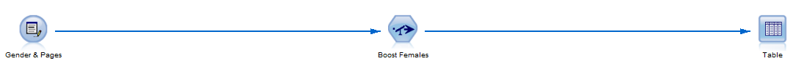

原始数据集有 4 位男性和 2 位女性。

**ID****GENDER****NUM\_PAGES**AMale181BMale191CMale142DMale164EFemale175FFemale188

该数据中的男女比例为 2:1，但我们希望男女分布均匀。将平衡节点配置为在 GENDER = “Female” 时使用系数 2.0。

##### 具有 boosting 女性数量的指令的平衡节点

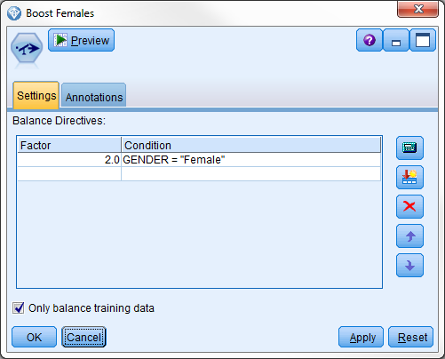

不满足条件的任何记录始终按原样传递。

在平衡的数据集中，具有 ID E 和 F 的记录分别在数据集中出现两次。

**ID****GENDER****NUM\_PAGES**AMale181BMale191CMale142DMale164EFemale175EFemale175FFemale188FFemale188

数据集现在拥有均匀的男女分布，有 4 位男性和 4 位女性。

### 使用平衡节点的 Reducing

Reduction 是 boosting 的替代方案，在平衡中使用的系数导致更常见类别中的观察结果被丢弃时，就会使用该术语。

#### 示例 3：Reduction

本例中使用的 [可下载的流](http://public.dhe.ibm.com/software/dw/analytics/ba-1608balancing-spss-modeler-trs/simple-boosting-example.zip) 是示例 2 中使用的相同流。

##### 应用 reduction 的简单的平衡示例流

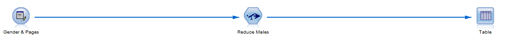

原始数据集同样有 4 位男性和 2 位女性。

**ID****GENDER****NUM\_PAGES**AMale181BMale191CMale142DMale164EFemale175FFemale188

数据中的男女比例仍为 2:1。我们仍想要均匀的男女比例。这一次，平衡节点配置为在 GENDER = “Male” 时使用系数 0.5。

##### 具有减少男性数量的指令的平衡节点

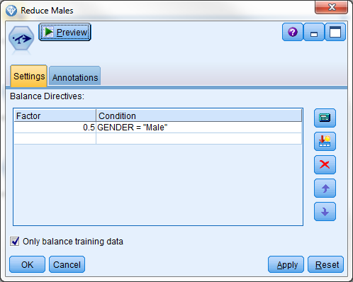

在平衡的数据集中，具有 ID B 和 D 的记录被从数据集丢弃。

**ID****GENDER****NUM\_PAGES**AMale181CMale142EFemale175FFemale188

该数据集现在具有均匀的分布，包含 2 位男性和 2 位女性。

因为该系数不是整数，所以每次执行时丢弃的记录会发生更改。

### 组合使用 boosting 和 reduction

也可以组合两种方法来创建一个平衡的数据集，其中包含 3 位男性和 3 位女性。将系数设置为丢弃 4 位男性中的 1 位，复制 2 位女性中的 1 位。

### 从图形生成平衡节点

可从一个针对类别字段的 [分布图](http://www.ibm.com/support/knowledgecenter/SS3RA7_18.0.0/modeler_mainhelp_client_ddita/clementine/distribution_output_plottab.html) 或从针对连续字段的 [直方图](http://www.ibm.com/support/knowledgecenter/SS3RA7_18.0.0/modeler_mainhelp_client_ddita/clementine/histogram_output_plottab.html) ，生成在两个或更多类别之间建立均匀分布的简单平衡节点。这是通过生成一个图形来显示数据集中的相关字段的真实分布，然后单击工具栏上的 **Generate** 来完成的。

##### 从图形创建平衡节点

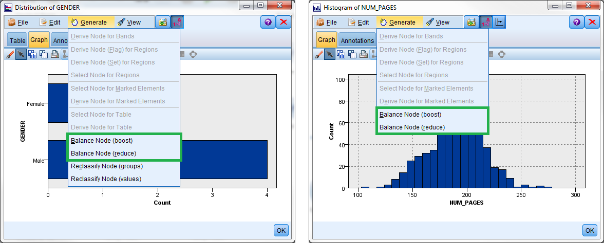

来自示例 2 的 [可下载流](http://public.dhe.ibm.com/software/dw/analytics/ba-1608balancing-spss-modeler-trs/simple-boosting-example.zip) 包含一个分布图和一个直方图，可以使用它们按这种方式生成平衡节点。

在 IBM SPSS Modeler 中，可通过多种不同方式 [从图形生成节点](http://www.ibm.com/support/knowledgecenter/SS3RA7_18.0.0/modeler_mainhelp_client_ddita/clementine/graphboard_exploring_generating_nodes.html) 。

这些选项仅在存在于使用分布图和直方图节点创建的图形中，使用 [图形板节点](http://www.ibm.com/support/knowledgecenter/SS3RA7_18.0.0/modeler_mainhelp_client_ddita/clementine/graphboardnode_general.html) 创建的图形中不存在这些选项。

### 处理可重复的分配

请记住，在使用非整数系数时，这种记录复制或丢弃是随机的，在数据 _每次_ 经过该节点时完成。这意味着，每次执行一个节点时，结果数据集都会不同。

一些节点包含 IBM SPSS Modeler 中的随机分配元素，比如 [样本节点](http://www.ibm.com/support/knowledgecenter/SS3RA7_18.0.0/modeler_mainhelp_client_ddita/clementine/sample_overview.html) 和 [分区节点](http://www.ibm.com/support/knowledgecenter/SS3RA7_18.0.0/modeler_mainhelp_client_ddita/clementine/partition_overview.html) ，这些节点可以选择执行可重复的分区分配。平衡节点没有这样的选项。如果每次需要以完全相同的方式执行平衡，可使用缓存或导出。

#### 使用缓存

在平衡节点上启用 [缓存](http://www.ibm.com/support/knowledgecenter/SS3RA7_18.0.0/modeler_mainhelp_client_ddita/clementine/cache_options.html) 是最简单的选项。这可以确保平衡节点连同数据集的剩余部分一起存储在一个临时文件或数据库表中，这个临时文件或数据库表将在填充后用于会话的剩余部分。填充缓存后，一个小图标（添加到节点的右上角）变为绿色。

但是该分配不会在会话之间持久化，而且每次关闭流并重新打开时，或者在出于其他某种原因而擦除缓存时，都会重新分配记录。对于包含大量字段的数据集，这可能还会导致一个不必要的大型临时文件，因为它实质上会创建整个数据集的副本。可以在 [节点的缓存选项](http://www.ibm.com/support/knowledgecenter/SS3RA7_18.0.0/modeler_mainhelp_client_ddita/clementine/cache_options.html) 文章中找到更多的细节。

#### 使用导出

另一个可重复分配选项是，创建平衡数据集一次，然后将它连同一个或多个唯一标识每个记录的字段导出到一个文件或数据库表。然后，可以将导出的平衡结果与原始源数据合并，实现一种将在会话间持久化的平衡。

但是，如果平衡的细微变化导致估算模型的巨大变化，这应该解释为一种表明该模型不稳定的迹象，该问题可能比数据集不平衡更重大。

### 动态平衡

##### 在 SPSS Modeler 中编写脚本

要了解如何自动化 SPSS Modeler 中的任务，请先阅读以下文章：

- Julian Clinton 撰写的 _[IBM SPSS Modeler 中的 Python 脚本简介](http://www.ibm.com/developerworks/library/ba-pp-spss-page680/index.html)_

平衡节点允许数据科学家输入条件和用于平衡的系数，但这些系数通常依赖于被分析的数据集中的平衡。因此，在会定期更改数据集和重新训练模型的环境中，用于平衡的系数也会发生更改。如果手动重新训练模型，或者基础数据中的平衡没有显著变化，那么在检查数据后和重新训练模型前，数据科学家不需要做太多额外工作来更改这些系数。但是，如果以自动化方式构建和重新训练模型，使用同一个流为不同的客户细分类别或产品构建模型，则将需要动态平衡来适应具有不同比例的数据集。

可使用流脚本来操作平衡节点，重设系数，以及甚至重设节点的条件。

#### 示例 4：使用脚本的动态平衡

[下载本示例中使用的流](http://public.dhe.ibm.com/software/dw/analytics/ba-1608balancing-spss-modeler-trs/dynamic-boosting-example.zip) 和流脚本。

示例 4 展示了如何动态创建必要的系数和条件，以平衡之前的示例中使用的数据集，通过减少数据集中的男性数量来实现均匀的男女分布。

##### 通过流脚本来执行动态平衡的流

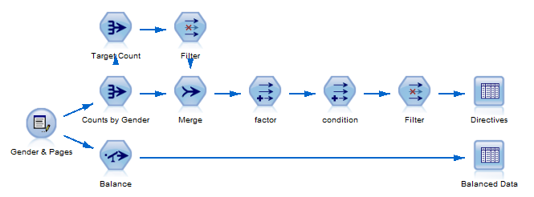

流的最长分支计算系数和条件。count\_by\_gender 汇总节点仅创建一个分别包含规定数量的男性和女性的数据集。

**GENDER****Count\_by\_gender**Male4Female2

名为 Target Count 的 [汇总节点](http://www.ibm.com/support/knowledgecenter/SS3RA7_18.0.0/modeler_mainhelp_client_ddita/clementine/aggregate_overview.html) 通过获取性别计数的最小值来确定平衡方法（在本例中为 reduction）。这是每个类别的目标案例数量，而且可以轻松地将它从 Min（reducing）更改为 Max（boosting）或 Mean（reducing 和 boosting 的组合）。也可使用一个或多个节点代替该节点，以不同方式创建想要的目标数量。

[合并节点](http://www.ibm.com/support/knowledgecenter/SS3RA7_18.0.0/modeler_mainhelp_client_ddita/clementine/merge_overview.html) 将两个汇总节点合并到一个数据集中，每个性别对应一条记录。

**GENDER****Count\_by\_gender**Target\_countMale42Female22

系数节点是一个 [导出节点](http://www.ibm.com/support/knowledgecenter/SS3RA7_18.0.0/modeler_mainhelp_client_ddita/clementine/derive_overview.html) ，它使用公式 _target\_count/count\_by\_gender_ 导出系数供平衡中的每种性别使用。该公式计算每个类别的目标案例数量与该类别的实际案例数量的比率。

条件节点使用公式 _“GENDER = \\”” >< GENDER >< “\\””_ 导出要用于平衡节点中的每个性别的条件。

名为 Directives 的 [表节点](http://www.ibm.com/support/knowledgecenter/SS3RA7_18.0.0/modeler_mainhelp_client_ddita/clementine/tablenode_general.html) 显示在一个表中显示系数和条件，使表中的值可供脚本使用。

**系数****条件**0.500GENDER = “Male”1.000GENDER = “Female”

可在指令节点之前添加 [选择节点](http://www.ibm.com/support/knowledgecenter/SS3RA7_18.0.0/modeler_mainhelp_client_ddita/clementine/select_settingstab.html) ，以便丢弃该系数等于 1 的所有记录，因为这些记录在平衡节点中没有任何用处。

下面的代码展示了执行指令表节点来在表中显示计算出的指令的流脚本。

```
# Execute the "Directives" table node to compute the directives
directivesResults = []
diagram.findByType('tablenode', "Directives:).run(directivesResults)
directivesRowSet = directivesResults[0].getRowSet()
directivesRowCount = directivesRowSet.getRowCount()

```

Show moreShow more icon

该代码还捕获指令总数作为表中的行数。

_directivesAll = [ ]_ 变量声明为持有从表输出捕获的列表中的每个指令。

随着脚本迭代表输出的每一行，下面的代码将系数和条件组装到一个指令中，该指令存储为一个包含两个元素的列表。

```
# Iterate through the table output to read each directive
for ii in range(directivesRowCount):
directiveCurrent = []
# Get the factor
directiveFactor = directivesRowSet.getValueAt(ii, 0)
directiveCurrent.append(directiveFactor)
# Get the condition
directiveCondition = directivesRowSet.getValueAt(ii, 1)
directiveCurrent.append(directiveCondition)
# Append the directive into a list of lists
directivesAll.append(directiveCurrent)

```

Show moreShow more icon

使用下面的代码组装指令后，就可以将它们用作平衡节点中的指令。

```
# Set the directives in the Balance node
balanceNode = diagram.findByType('balancenode', "Balance")
balanceNode.setPropertyValue('directives', directivesAll)

```

Show moreShow more icon

无论在执行脚本前平衡节点中的设置是什么，这些设置都会反映出执行脚本后的指令表节点输出的内容，如 [脚本化的平衡节点指令](#figure-7-脚本化的平衡节点指令) 所示。

##### 脚本化的平衡节点指令

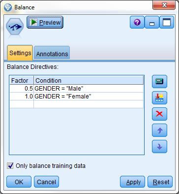

该数据集现在拥有均匀的男女分布，而且它将始终拥有均衡的分布，甚至在源数据中的基础分布发生改变时也是如此。

**ID****GENDER**NUM\_PAGESAMale181DMale164EFemale175FFemale188

无论您喜欢 boost 不常见的类别还是 reduce 更常见的类别，此方法都适用，因为这取决于您对 Target\_count 字段的计算结果。

也可以仅使用画布上的节点，按动态分配的系数来复制平衡节点的输出，而无需编写脚本。如果流脚本已很复杂，或者需要在多个属性间进行更复杂的平衡，您可能更喜欢此选项。

最好在减少更常见类别中的案例数量时使用动态平衡，因为这使您能够使用许多相同的基础节点来获得 [示例 4：使用脚本的动态平衡](#示例-4：使用脚本的动态平衡) 中演示的相同结果，而无需执行脚本。

#### 示例 5：使用复杂采样的动态平衡

[下载](http://public.dhe.ibm.com/software/dw/analytics/ba-1608balancing-spss-modeler-trs/dynamic-boosting-example.zip) 本示例中使用的流。

示例 5 的目的与示例 4 相同：创建一个具有均匀的男女分布的数据集。

##### 通过采样执行动态平衡的流

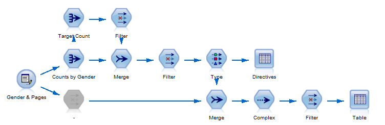

该流的上分支几乎总是与示例 4 中使用的流相同，除非不再需要名为 Factor and Condition 的导出节点并已省略它。

第二个合并节点将源数据与上分支中计算的指令相合并，包括每个类别的目标数量和将用于采样更常见类别的系数。

**GENDER****ID****NUM\_PAGES****Target\_count**FemaleF1884FemaleE1754MaleD1644MaleC1424MaleB1914MaleA1814

名为 Complex 的 [样本节点](http://www.ibm.com/support/knowledgecenter/SS3RA7_18.0.0/modeler_mainhelp_client_ddita/clementine/sample_overview.html) 将代替平衡节点来执行平衡。

将采样方法设置为 Complex，如 [样本节点的设置](#figure-9-样本节点的设置) 所示。选择 GENDER 字段作为用于对采样分层的字段。

##### 样本节点的设置

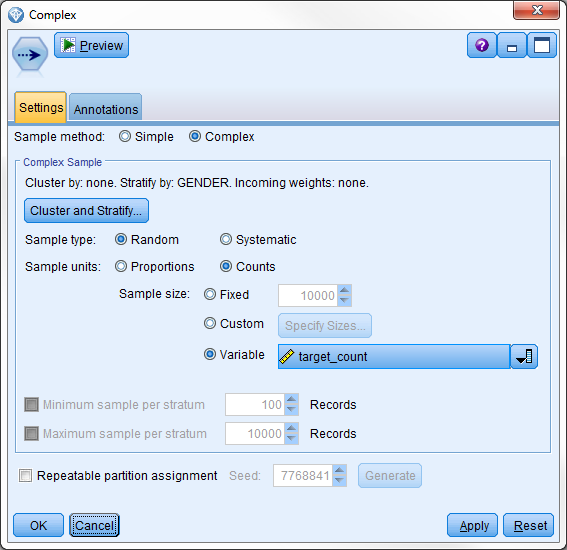

然后选择计算的字段 Factor 作为按比例随机采样的变量。

**ID****GENDER****NUM\_PAGES**AMale181DMale164EFemale175FFemale188

同样地，结果数据集具有均匀的男女分布。

动态平衡方法的一个优势是，样本节点包含将随机种子设置为常量值的选项，这使得随机采样在每次执行时返回完全相同的记录。常规的平衡节点没有此功能，如 [处理可重复的分配](#处理可重复的分配) 中所述。

## 选择最佳的平衡系数

确定平衡是否值得或是否对建模有利，这通常取决于项目的业务目标。首先检查模型的 [融合矩阵](https://en.wikipedia.org/wiki/Confusion_matrix) ，查看模型是否符合业务目标。在 [示例 1：保险欺诈](#示例-1：保险欺诈) 中列出的情形中，融合矩阵可能表明，基于一个不平衡数据集的模型能够正确识别几乎所有非欺诈性保险索赔，但无法识别所有（或仅能识别极少数）欺诈性索赔。换言之，该模型拥有：

- 大量的错误否定
- 很高的 II 型错误比率
- 接近 1.0 的特异性

如果目标是避免调查有效的索赔，这可能是不错的模型。但是如果目标是检测和阻止欺诈（更常属于这种情况），则此模型无法满足目标，而且平衡数据可能是一种改进模型的方式。

选择使用 boosting、reduction 还是二者的组合，具体情况取决于数据集的相对比例和业务目标。找到合适的平衡水平的最佳方式是，构建包含不同方法和系数的模型，并评估它们来确定哪些模型能最有效地满足业务目标。

有一些经验规则和指导原则：

- 当平衡一个数据集时， _不_ 需要实现均匀分布。
- 避免对更常见类别过度采样，因为这可能导致丢弃不常见类别中的许多数据，一些重要的关联或模式需要从这些类别的整个数据集中采样。
- 避免过多地复制单条记录，因为这可能导致随机模式和很少出现的模式被建模算法识别为有意义的模式。

在保险欺诈示例中，您不想通过复制欺诈性索赔来实现均匀分布。这么做可能让建模算法将来自每个原始欺诈性索赔的属性组合识别为一种欺诈模式。您可能也不希望通过 reduce 非欺诈性索赔来实现均匀分布。这样会丢弃很大一部分相关数据，这些数据中的模式表明了非欺诈性索赔的特征，会使得识别这些索赔变得更难。解决方案介于这两个极端（复制欺诈性索赔和减少非欺诈性索赔）之间，建立一种合理且使模型能满足业务目标的平衡。

对过度平衡数据集的最重要防御措施是，确保数据集划分为训练分区和测试分区（可能还有验证分区），其中测试分区和验证分区是不平衡的，而且保留了原始比例。然后基于测试分区或验证分区来评估模型性能，确定模型的真实有效性。

#### 示例 6：信用卡优惠信息

[下载本示例中使用的流和示例数据集](http://public.dhe.ibm.com/software/dw/analytics/ba-1608balancing-spss-modeler-trs/credit-card-offer.zip) 。

在示例 6 中，一家信用卡公司希望在客户联系它时，向现有持卡人提供不同的优惠信息和开展营销活动。一条优惠信息是，持卡人为同一个帐户注册一张补充信用卡，以提供给配偶或其他家庭成员使用。

在拨入呼叫中心的 5,904 通电话中，此优惠信息仅提供给了不到 2,000 位持卡人，而且该优惠信息的接受率为 13.8%。

首先，基于数据集的真实、不平衡的分布来训练模型。

##### 用于训练信用卡优惠信息模型的基本流

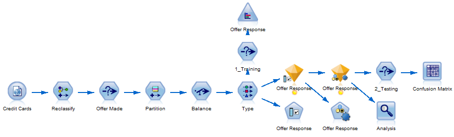

在上图中，流程为信用卡 > 再分类 > 提供的优惠信息 > 分区 > 平衡 \> 类型，然后分支到训练、优惠信息响应或经历额外的测试和分析来获得融合矩阵的优惠信息响应。

该模型对 87.5% 的响应者进行了正确分类，但融合矩阵预测，94.9% 的响应者会拒绝该优惠信息。该模型还识别出只有 23.9% 的持卡人接受了该优惠信息。这带来了 76.1% 的错误否定率。

##### Table 1. 在不平衡数据集上的模型的混淆矩阵的一个训练

Actual response  Accepted  Rejected  Total **Predicted response****Accepted** 23.9%  1.9%  5.1% **Rejected** 76.1%  98.1%  94.9% **Total** 100.0%  100.0%  100.0%

然后训练一个模型，在这个模型中，使用 boost 实现了接受和拒绝报价的均匀分布。 这是通过为接受报价的记录添加一个因子为 6.2409 的 balance 节点来实现的。该数据集包括 274 名接受该提议的受访者和 1710 名拒绝该提议的受访者。 通过将较大组(1,710人)的受访者人数除以较小组(274人)的受访者人数，可以找到在两组之间创建均匀分布的因素。因此因子为 1,710/274=6.2409。

结果模型对训练分区中95.1%的响应进行了正确分类，而对测试分区中仅81.4%的响应进行了正确分类，说明模型训练过度;提振水平过高，需要调整。

##### Table 2. 在均匀分布的平衡数据集上训练模型的混淆矩阵

Actual response  Accepted  Rejected  Total **Predicted response****Accepted** 56.3%  14.4%  20.4% **Rejected** 43.7%  85.6%  79.6% **Total** 100.0%  100.0%  100.0%

另一方面，您成功地将假阴性率降低到43.7%，这是对原始模型的显著改进。

构建具有不同平衡水平的模型将产生略有不同的结果。下表显示了在相同数据集上训练的相同模型，但是使用了不同级别的平衡。假阴性和假阳性率是基于测试划分的。

##### Table 3. 根据不同程度的平衡数据集训练模型的总体精度

Method  Directives  False negative rate  False positive rate  Accuracy training  Accuracy testing  Accuracy difference  None  N/A  76.1%  32.0%  87.5%  87.5%  0.0% points  Boosting (25/75)  2.1070: Accepted  71.8%  44.4%  85.9%  86.4%  -0.5% points  Boosting (33/67)  3.1200: Accepted  43.7%  53.5%  91.6%  84.4%  7.2% points  Boosting (40/60)  4.2000: Accepted  39.4%  57.4%  91.7%  82.6%  9.1% points  Boosting (50/50)  6.2409: Accepted  45.1%  60.2%  95.3%  81.6%  13.7% points  Combined (50/50)  3.6204: Accepted 0.5801: Rejected  33.8%  60.5%  90.3%  80.6%  9.7% points

上表的结果显示在示例 6 中，以便更好地说明在使用不同级别的平衡时，两个错误率之间的权衡。虚线显示了一个高度主观的边界，即人们可能期望其他水平的平衡落在同一空间的何处。

##### 基于具有不同平衡水平的数据集的模型的错误否定率和错误肯定率之间的关系图

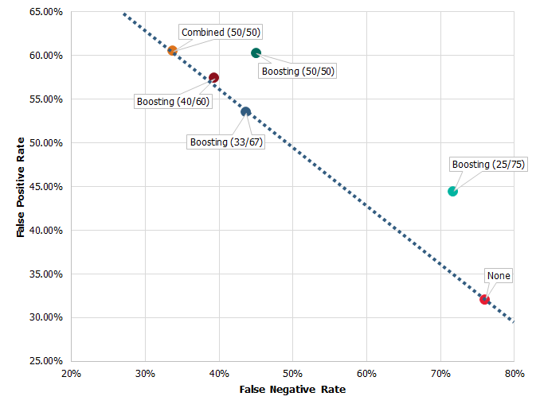

可通过许多方式评估这些模型，但出于平衡的目的，我们又回到了确定什么是正确的平衡的业务案例。如果您通过低成本渠道提供高收入产品，那么您可能愿意接受较高的错误肯定率，如果您通过高成本渠道销售低收入产品，则情况可能相反。

示例 6 中的优惠信息是针对现有帐户的补充性信用卡。向帐户中添加一张卡，意味着有另外一个人使用该信用卡帐户，进而在每次刷卡时为信用卡提供者创造收入。每个帐户的预计收入取决于许多不同因素，很可能需要我们建立一个模型来评估每年的预期收入和预期寿命。对于此示例，我们假设添加一张补充性信用卡带来的预期收入为 10 美元。

提供此优惠信息的成本也由多个组件组成，包括呼叫中心代理花费的时间，向可能已接受另一项优惠信息的帐户持有人提供此优惠信息所损失的收入，但为了简便起见，我们将成本设置为 2 美元。这将意味着，公司可以接受高达 80% 的错误肯定率，且仍能实现收支平衡。

确定要在任何用例中使用的正确的平衡指令很难，并且必须依靠一些反复试验来确定最适合业务目标的平衡水平。关键在于良好地理解业务目标，理解如何实现和使用预测模型。

## 结束语

本文介绍了如何评估不同的方法和平衡水平，以及如何在 IBM SPSS Modeler 中部署平衡。使用所提供的测试数据集，您可以使用平衡节点，根据需要 boost 或 reduce 模型来得到期望的结果。通过实现动态平衡，平衡节点可随着分析的数据变化而变化。例如，当使用预测模型来选择应提供补充性信用卡的客户时，接受优惠信息的客户的比率将增加，从而改变数据中的平衡。数据通常是动态的，平衡系数可能也需要定期手动调节。您可以根据自己的业务目标，使用 IBM SPSS Modeler 确定您的数据的平衡系数应该是多少。

## 参考资料

- 了解我如何在 [Infinity Property & Casualty Corp.](https://sites.google.com/site/kennethagregaardjensen/customer-projects/infinity-property-casualty) 中使用预测分析来识别潜在的欺诈性索赔并缩短索赔周期。
- 了解如何在 IBM SPSS Modeler 中实现 [K 折交叉验证](https://developer.ibm.com/predictiveanalytics/2016/03/02/k-fold-cross-validation-ibm-spss-modeler/) 。
- 查阅 [我的所有博客和文章](https://sites.google.com/site/kennethagregaardjensen/publications) 。
- [开始免费使用 SPSS Modeler 30 天](https://www.ibm.com/marketplace/cloud/spss-modeler/resources/us/en-us) （一些国家可能有相关限制）。

## Download

[simple-boosting-example.zip](http://public.dhe.ibm.com/software/dw/analytics/ba-1608balancing-spss-modeler-trs/simple-boosting-example.zip): 应用了 boosting 的简单流的示例

本文翻译自： [Use balancing to produce more relevant models and data results](https://developer.ibm.com/articles/ba-1608balancing-spss-modeler-trs/)（2016-12-15）