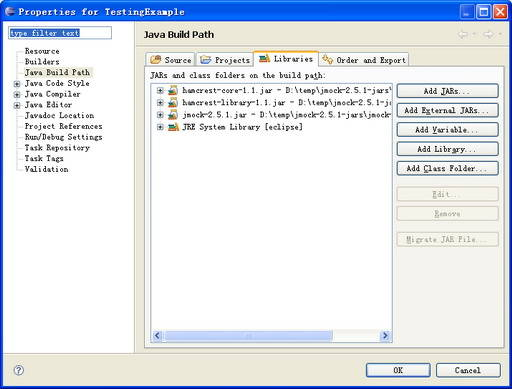

# 使用模拟对象（Mock Object）技术进行测试驱动开发
探讨敏捷开发和测试驱动开发的重要性

**标签:** DevOps,Java

[原文链接](https://developer.ibm.com/zh/articles/j-lo-mockobject/)

方世明

发布: 2008-12-12

* * *

## 敏捷开发

敏捷软件开发又称敏捷开发，是一种从上世纪 90 年代开始引起开发人员注意的新型软件开发方法。和传统瀑布式开发方法对比，敏捷开发强调的是在几周或者几个月很短的时间周期，完成相对较小功能，并交付使用。在项目周期内不断改善和增强。

2001 年初，在美国犹他州雪鸟滑雪胜地，17 名编程大师分别代表极限编程、Scrum、特征驱动开发、动态系统开发方法、自适应软件开发、水晶方法、实用编程等开发流派，发表”敏捷软件开发”宣言。其内容主要包括：

- 人和交互重于过程和工具；
- 可以工作的软件重于求全责备的文档；
- 客户协作重于合同谈判；
- 随时应对变化重于循规蹈矩；

可见在敏捷软件开发中，交付高质量的软件是非常重要的。只有交付可以工作的软件，开发人员才能不断地完成更多功能，而不是将大部分时间投入在修复软件产品缺陷 (Bug) 。所以如何提高交付软件的质量，在敏捷开发实施过程非常重要。

## 测试驱动开发

测试驱动开发，它是敏捷开发的最重要的部分。方法主要是先根据客户的需求编写测试程序，然后再编码使其通过测试。在敏捷开发实施中，开发人员主要从两个方面去理解测试驱动开发。

- 在测试的辅助下，快速实现客户需求的功能。通过编写测试用例，对客户需求的功能进行分解，并进行系统设计。我们发现从使用角度对代码的设计通常更符合后期开发的需求。可测试的要求，对代码的内聚性的提高和复用都非常有益。
- 在测试的保护下，不断重构代码，提高代码的重用性，从而提高软件产品的质量。可见测试驱动开发实施的好坏确实极大的影响软件产品的质量，贯穿了软件开发的始终。

在测试驱动开发中，为了保证测试的稳定性，被测代码接口的稳定性是非常重要的。否则，变化的成本就会急剧的上升。所以，自动化测试将会要求您的设计依赖于接口，而不是具体的类。进而推动设计人员重视接口的设计，体现系统的可扩展性和抗变性。

## 利用伪对象 (Mock Obect) 实现接口测试

在实施测试驱动开发过程中，我们可能会发现需要和系统内的某个模块或系统外某个实体交互，而这些模块或实体在您做单元测试的时候可能并不存在，比如您遇到了数据库，遇到了驱动程序等。这时开发人员就需要使用 MO 技术来完成单元测试。

最开始，Mock Object 是完全由测试者自己手工撰写的。在这里我们可以举个简单的例子。

我们有一个移动数字电视卡的接口程序。

##### 清单 1\. VideoCardInterface 代码

```
public interface VideoCardInterface {

     public void open();

     public void changeChannel(int i);

     public void close();

     public Byte[] read();

     public boolean fault();
}

```

Show moreShow more icon

下面是每个方法的功能说明：

- open 打开移动数字电视卡。
- changeChannel 切换移动数字电视频道。必须在打开之后才可以正常工作，否则就提示错误信息。
- close 关闭移动移动电视卡。必须在打开之后才可以正常工作，否则就提示错误信息。
- read 读取字节流。必须在打开之后才可以正常工作，否则就提示错误信息。
- fault 显示当前工作状态。

由于相对应的硬件开发工作还没有完成，我们无法基于这样的接口程序进行实际的测试。所以开发人员基于接口，实现了部分移动电视卡的逻辑。

##### 清单 2\. MockVCHandler 代码

```
public class MockVCHandler implements VideoCardInterface {

     private boolean initialized = false;
     private boolean error = false;
     private int channel;
     private static final int DEFAULTCHANNEL = 1;

     public void open() {
         initialized = true;
         channel = DEFAULTCHANNEL;
     }

     public void changeChannel(int i) {
         if (!initialized) {
             Assert.fail("Trying to change channel before open");
         }
         if (i <= 0) {
             Assert.fail("Specified channale is out-of-range");
         }
         this.channel = i;
     }

     public void close() {
         if (!initialized) {
             Assert.fail("Trying to close before open");
         }
     }

     public Byte[] read() {
         if (!initialized) {
             Assert.fail("Trying to read before open");
             return null;
         }
         if (channel > 256) {
             error = true;
             Assert.fail("Channel is out-of-range");
         }
         return new Byte[] { '0', '1' };
     }

     public boolean fault() {
         return error;
     }
}

```

Show moreShow more icon

通过以上的实现，我们可以测试每个动作之间的先后逻辑关系，同时可以测试数据流读取出错的逻辑。如果测试人员进一步对数据流进行测试。还可以自我生成一段二进制字节流并进行测试。通过以上的实现，我们可以大大加快开发进度。在传统开发流程中，软件开发和测试不得不等大部分硬件都已经可以使用的条件下才可以开发测试。使用 MO 技术，使得硬件和软件在一定程度上可以同步开发和测试。

但是测试人员完全依靠自己实现这些类，不可避免的会带来测试用例编写效率低下和测试用例编写困难的弊病，甚至可能会影响 XP 实践者”测试先行”的激情。此时，各种各样帮助创建 Mock Object 的工具就应运而生了。目前，在 Java 阵营中主要的 Mock 测试工具有 jMock，MockCreator，MockRunner，EasyMock，MockMaker 等，在微软的 .Net 阵营中主要是 NMock，.NetMock，Rhino Mocks 和 Moq 等。

## jMock 框架介绍

总体上来说，jMock 是一个轻量级的模拟对象技术的实现。它具有以下特点：

- 可以用简单易行的方法定义模拟对象，无需破坏本来的代码结构表；
- 可以定义对象之间的交互，从而增强测试的稳定性；
- 可以集成到测试框架；
- 易扩充；

与大多数 MOCK 框架一样，我们可以在 IDE 中使用并进行开发。本文以最常用的 Eclipse 为例。

### 下载 jMock

在 jMock 官方网站，我们可以下载当前稳定版本 jMock2.5.1 。

### 配置类路径

为了使用 jMock 2.5.1，您需要加入下面的 JAR 文件到当前的类路径。

- jmock-2.5.1.jar
- hamcrest-core-1.1.jar
- hamcrest-library-1.1.jar

##### 图 1\. 已添加到 TestingExample 项目中 jMock 的 JAR 文件



### 使用 jMock 模拟接口

我们首先必须引入 jMock 的类，定义我们的测试类，创建一个 Mockery 的对象用来代表上下文。上下文可以模拟出对象和对象的输出，并且还可以检测应用是否合法。

```
import org.jmock.Mockery;
import org.jmock.Expectations;

public class AJmockTestCase {

     Mockery context = new Mockery();

}

```

Show moreShow more icon

然后我们创建一个 calcService 去模拟 ICalculatorService 接口。在这里我们以 add() 方法为例，我们针对 add() 方法定义预期值 assumedResult 。之后我们去调用 add(1,1) 时，就可以得到预期值。

```
// set up
     final ICalculatorService calcService = context.mock(ICalculatorService.class);

     final int assumedResult = 2;

        // expectations
        context.checking(new Expectations() {{
             oneOf (calcService).add(1, 1); will(returnValue(assumedResult));
}});

```

Show moreShow more icon

清单 3 和 4 分别显示了 ICalculatorService 和 AJmockTestCase 的代码。

##### 清单 3\. ICalculatorService 代码

```
public interface ICalculatorService {

     public int add(int a, int b);

}

```

Show moreShow more icon

##### 清单 4\. AJmockTestCase 代码

```
import org.jmock.Mockery;
import org.jmock.Expectations;

public class AJmockTestCase {

     Mockery context = new Mockery();

     public void testCalcService() {

         // set up
         final ICalculatorService calcService = context
                 .mock(ICalculatorService.class);

         final int assumedResult = 2;

         // expectations
         context.checking(new Expectations() {
             {
                 oneOf(calcService).add(1, 1);
                 will(returnValue(assumedResult));
             }
         });

         System.out.println(calcService.add(1, 1));

     }

}

```

Show moreShow more icon

在 jMock 中，开发人员可以按照下面的语法定义预期值，从而实现更复杂的应用。例如我们可以模拟底层驱动程序的输出，在上层应用程序中使用这些模拟数据。具体可以参考 jMock 的官方网站。

```
invocation-count (mock-object).method(argument-constraints);
    inSequence(sequence-name);
    when(state-machine.is(state-name));
    will(action);
then(state-machine.is(new-state-name));

```

Show moreShow more icon

## EasyMock 框架介绍

在实际开发中，不少开发人员也使用 EasyMock 来进行测试驱动开发。 EasyMock 具有以下的特点

- 在运行时 (runtime) 改变方法名或参数顺序，测试代码不会破坏；
- 支持返回值和异常；
- 对于一个或多个虚拟对象，支持检查方法调用次序；
- 只支持 Java 5.0 及以上版本；

与大多数 MOCK 框架一样，我们可以在 IDE 中使用并进行开发。本文以最常用的 Eclipse 为例。

### 下载 EasyMock

在 EasyMock 官方网站，我们可以下载当前稳定版本 EasyMock2.4 。

### 配置类路径

为了使用 EasyMock 2.4，您需要加入下面的 JAR 文件到当前的类路径。

- easymock.jar

##### 图 2\. 已添加到 TestEasyMock 项目中 EasyMock 的 JAR 文件


### 使用 EasyMock 模拟接口

##### 清单 5\. ILEDCard 代码

```
public interface ILEDCard {
     String getMessage();

     void setMessage(String message);
}

```

Show moreShow more icon

##### 清单 6\. LED 代码

```
public class LED {
     private ILEDCard ledCard;

     public LED(ILEDCard ledCard) {
         this.ledCard = ledCard;
     }

     public String ShowMesage() {
         return this.ledCard.getMessage();
     }

     public void setMessage(String message) {
         this.ledCard.setMessage(message);
     }
}

```

Show moreShow more icon

我们首先创建一个 Mock 的对象 mockLEDCard 来代表 LED 卡的行为，并初始化 LED 对象。

```
protected void setUp() throws Exception {
         super.setUp();
         mockLEDCard = createMock(ILEDCard.class);
         led = new LED(mockLEDCard);
}

```

Show moreShow more icon

之后我们对 ShowMessage 方法进行测试。

```
public void testGetWord() {
        expect(mockLEDCard.getMessage()).andReturn("This is a EasyMock Test!");
        replay(mockLEDCard);

        led.ShowMesage();
        verify(mockLEDCard);
}

```

Show moreShow more icon

清单 7 显示了完整的代码。

##### 清单 7\. AEasyMockTestCase 代码

```
import static org.easymock.EasyMock.*;
import junit.framework.TestCase;

public class AEasyMockTestCase extends TestCase {

     private LED led;
     private ILEDCard mockLEDCard;

     protected void setUp() throws Exception {
         super.setUp();
         mockLEDCard = createMock(ILEDCard.class);
         led = new LED(mockLEDCard);
     }

     protected void tearDown() throws Exception {
         super.tearDown();
     }

     public void testGetWord() {
         expect(mockLEDCard.getMessage()).andReturn("This is a EasyMock Test!");
         replay(mockLEDCard);

         led.ShowMesage();
         verify(mockLEDCard);
     }

     public void testSetWord() {
         mockLEDCard.setMessage("Another test");
         replay(mockLEDCard);

         led.setMessage("Another test");
         verify(mockLEDCard);
     }
}

```

Show moreShow more icon

通过上文对 jMock 和 EasyMock 的介绍，我们可以发现 jMock 可以灵活的定义对象的行为。例如 mock.expects(once()).method(“method2”).with( same(b1), ANYTHING ).will(returnValue(method2Result)); 这点在 EasyMock 里比较难于实现。

## Rmock 及其它

目前比较流行的 mock 工具，还有 RMock, 目前的版本的是 2.0，当使用 jUnit 开发测试用例时，它支持设置－修改－运行－验证这样的工作流。它加强了基于交互和基于状态的测试，同时有更好的测试工作流定义。 Rmock 还可以使用 DynamicSuite 来解决维护 TestSuites 的问题。

市场上还有支持各种语言的 Mock object 的框架，如 pMock(Python)，NMockLib(C#)，Mocha(Ruby)，JSMock(JavaScript)，mockpp(C++) 。

## 结束语

在软件开发过程中，开发人员需要注重测试驱动开发，并利用模拟对象的技术来帮助进行测试。许多开发人员不习惯于频繁编写测试。即使需要编写测试，通常都是简单的进行主要功能测试。如果要测试代码的某些难以到达的部分，选择各种 Mock object 的框架可以降低开发测试的复杂度。

同时在硬件相关的程序开发中尤其是驱动开发，应用 Mock 技术将极大地提高软件开发的进度，并且减少代码中的缺陷，大大提高硬件软件兼容性和可靠性。