# 使用深度学习方法应对 COVID-19 病毒
创建模型以对未见过的新数据进行准确预测

**标签:** 人工智能,机器学习,深度学习

[原文链接](https://developer.ibm.com/zh/articles/using-deep-learning-to-take-on-covid-19/)

Casper Hansen

发布: 2020-05-11

* * *

_免责声明：我并不是医学、放射学或流行病学专业人士。准确地说，本文是从工程师和数据研究员角度开展的一个实验。_

要对 COVID-19 应用深度学习方法，您需要一个合适的数据集，其中包含大量样本、边缘案例、元数据和不同的图像。您希望模型能够对数据进行概括，以便对未见过的新数据进行准确预测。但遗憾的是，目前还没有足够的数据可供使用。在 LinkedIn 和 Medium 等网站上，有些帖子声称检测 COVID-19 病例的准确性超过 90%，在某些情况下甚至达到 100%。但是，这些帖子通常包含一些错误，而这些错误不一定会得到承认。本文尝试通过找出以下问题的解决方案来消除其中一些常见错误：

- 使用与训练模型时相同的数据来测试模型性能。机器学习的第一条规则是，永远不要使用与训练模型时相同的数据来测试模型性能。未使用测试数据集，而是根据训练数据集来测试和度量模型的准确性，但这无法准确表示模型对未见过的新数据的概括程度。您可能认为这不是问题，但对于刚接触机器学习和数据科学的人来说，这是典型的谬论。

- 未使用计算机视觉技术来实现更好的概括。扩充是绝对必要的，尤其是在模型可学习的样本非常少的情况下。

- 未考虑模型学到的知识，即，模型是实际学习 COVID-19 在 X 射线图像上的表现模式，还是有可能学习数据集中的另一种噪声模式？早期机器学习的一个有趣故事是 [检测箱](https://www.jefftk.com/p/detecting-tanks)。在这个故事中，伪装的坦克的照片是在阴天拍摄的，而平原森林的照片是在晴天拍摄的。

- 未使用正确的指标。如果您在严重失衡的数据集上使用准确性指标，那么即使模型在 COVID-19 病例中表现欠佳，但是在常规病例中可能表现良好。如果在 COVID-19 病例中的准确性只有 30%，那么 95% 的准确性也显得毫无说服力。


本文使用的所有数据都可在 [GitHub](https://github.com/casperbh96/COVID-19-Detection) 中找到。

## 获取数据

下面列出了我在新冠病毒传播期间积累的各种数据源。这些是我目前可从因特网上获得的最佳信息，因为在许多国家或地区以及医院中收集的数据都属于保密信息。即使不是保密信息，也必须征得每位患者的同意。

- GitHub： [COVID-19 胸部 X 射线和 CT 图像](https://github.com/ieee8023/covid-chestxray-dataset)。随着病例不断增多，该数据集将会不断更新。
- [Kaggle 1](https://www.kaggle.com/c/rsna-pneumonia-detection-challenge)：阳性和阴性的肺炎病例的胸部 X 射线图像。
- [Kaggle 2](https://www.kaggle.com/paultimothymooney/chest-xray-pneumonia)：阳性和阴性的肺炎病例的胸部 X 射线图像。

### 混合数据源存在的问题

因特网上的所有可用数据都没有经过相同的预处理，并且所有图像（如下所述）的黑条数量明显不同。在大部分的 COVID-19 阳性病例数据中，整个 X 射线会占据大部分屏幕，而侧面几乎没有黑条（少数情况除外）。但是，在含有 COVID-19 阴性病例的数据集中，每张图像的侧面几乎都有黑条。

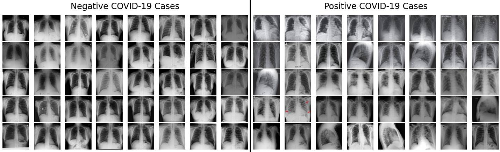

这一点就是问题所在，因为该模型以后可能会认为它只需要查看图像侧面的黑条，即可判断新样本是 COVID-19 阳性还是阴性病例。

在人工检查数据集后，显而易见，几乎所有阴性病例都有这些黑条，而只有约 10% 至 20% 的阳性病例有黑条。如果以后预测病例（阳性或阴性）的准确性约为 80-90%，这是不是一个巧合呢？

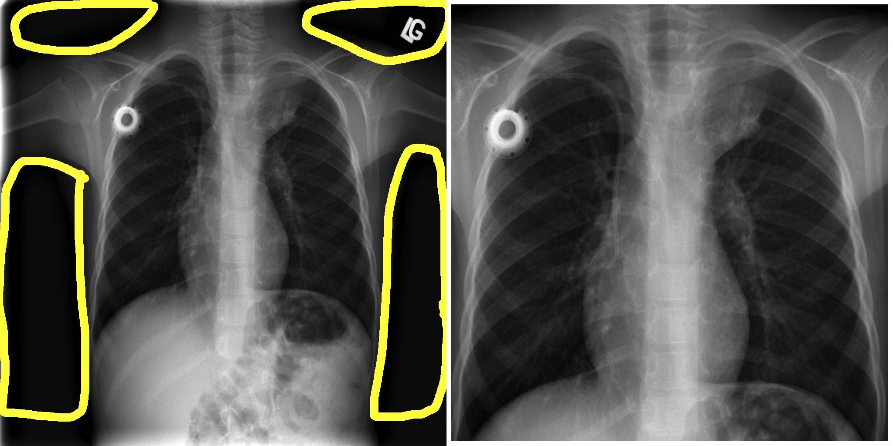

在上一张图像中，左侧显示的是 COVID-19 阴性病例的图像（侧边和顶部有黑条）。右侧显示的是相同的图像，只是朝中心进行了裁剪并放大到原始大小。

## 预处理 – 改进数据

显然，我们 _需要_ 解决上述数据问题。能否用某种方式来检测顶部、底部或侧边何时会出现黑条？而且，能否用某种方式自动纠正这个问题？

以下步骤是解决此问题的关键：

1. 一个简单指标：给定行或列中是否出现了 _x_ 个或更多个黑色像素？
2. 需要的话，那下面来讲一讲。移除该行或列。对所有行和列重复此步骤。
3. 检查完黑色像素了吗？然后，裁剪该图像。
4. 对下一张图像重复相同的操作。

好吧，没有那么快。这里遇到了一个新问题：我们需要保持相同的宽高比。如果宽高比不一样，那么就无法放大或缩小图像。这是因为现有架构要求输入大小为 224×224，即宽高比为 1×1。

换句话说，就是检查要移除的列数与要移除的行数是否一样多。如果包含黑色像素的列过多但包含黑色像素的行很少（甚至没有），那我们是否可以通过移除特定行来进行过度补偿？

### 移除黑条并固定宽高比

下图演示了要移除黑条的输入和输出，其中一个示例特别成功。虽然它的功能很强大，但它仍未遵循 1×1 的宽高比。

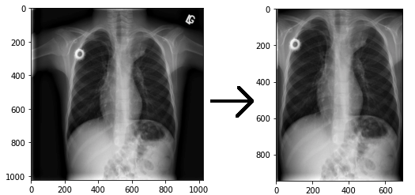

我发现固定宽高比的最有效且最简单的解决方案是计算要移除的行数与要移除的列数之差。将差值除以 2，然后从顶部和底部移除行，或者从左侧和右侧移除列。

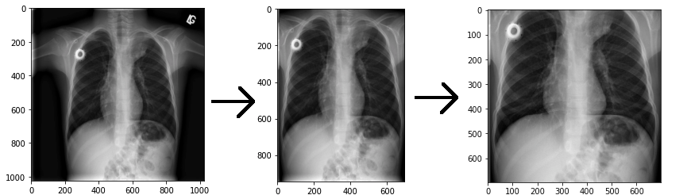

最后一张图像另存为 224×224 图像，因为我们现在可以将其缩小，使宽高比为 1×1。在另一个脚本中再次加载该图像时，就可以节省空间和时间了。

#### 运行脚本

每张图像大约需要 14 秒才能找到要移除的行和列。我采用了一种很简单的方法，虽然效率不高，但却适用于本次实验。我在 Kaggle 1 数据集中存放了 8851 张图像，事实证明，它需要 39 个小时来完成预处理。本文使用的所有数据都是 [GitHub 存储库](https://github.com/casperbh96/COVID-19-Detection) 中发布并提供的数据。

我对 Kaggle 1 和 GitHub 数据集都运行了该代码，结果是以 224×224 图像格式保存了所有这些图像。以下代码仅适合在 Kaggle 1 数据集上运行，但是您可以替换此代码的第一部分以便加载任何图像数据集。

```lang-python
import pandas as pd
import matplotlib.pyplot as plt
import cv2, time, os
import numpy as np

df = pd.read_csv('kaggle-pneumonia-jpg/stage_2_detailed_class_info.csv')
image_folder = 'kaggle-pneumonia-jpg/stage_2_train_images_jpg/'

df = df.loc[df['class'] == 'Normal']

```

Show moreShow more icon

以下代码显示了如何加载 COVID-19 数据集。请注意，代码的其余部分是相同的。下面是仅加载另一个数据集。

```lang-python
columns = ['finding', 'modality', 'filename', 'view']

# only use COVID-19 samples done with X-ray and PA view
df = pd.read_csv('metadata.csv', usecols=columns)
df = df.loc[df['finding'] == 'COVID-19']
df = df.loc[df['modality'] == 'X-ray']
df = df.loc[df['view'] == 'PA']

```

Show moreShow more icon

在加载数据框架后，我将图像、标签和文件名加载到数组中。

```lang-python
images = []
labels = []
filenames = []

for index, row in df.iterrows():
    image = cv2.imread(image_folder + row.patientId + '.jpg')
    image = cv2.cvtColor(image, cv2.COLOR_BGR2RGB)
    images.append(image)

    label = row['class']
    labels.append(label)

    filename = row.patientId
    filenames.append(filename)

images = np.array(images)

```

Show moreShow more icon

接下来，我将使用 `get_black_pixel_indices()` 函数来循环遍历像素的行和列。您可以将图像想象成一个表格，其中包括像素行和列并提供像素值。

我将计算黑色像素的数量（这是由小于 40 的像素值的数量来定义的）。像素值由每个颜色通道的一个值组成，即，红色、绿色或蓝色 (RGB)。我可以创建一个数组 `[39, 67, 45]`，平均像素值就是这些数字的平均值，即 50.33。

计算出给定行和列的黑色像素数量后，我将检查黑色像素是否比非黑色像素多。如果是这样，那么我将选择移除该行或列。

```lang-python
def get_black_pixel_indices(img):
    rows_remove = []
    cols_remove = []

    for j, counter in enumerate(range(img.shape[0])):
        row = img[counter]
        # shift column dim to first dim, row dim to second dim
        # acts like a 90 degree counterclock-wise rotation of image
        col = img.transpose(1, 0, 2)[counter]

        row_black_pixel_count = 0
        col_black_pixel_count = 0
        for selector in range(img.shape[1]):
            row_pixel = row[selector]
            col_pixel = col[selector]

            if np.average(row_pixel) < 40:
                row_black_pixel_count += 1
            if np.average(col_pixel) < 40:
                col_black_pixel_count += 1

        if row_black_pixel_count > len(row)/2:
            rows_remove.append(j)
        if col_black_pixel_count > len(col)/2:
            cols_remove.append(j)

    return rows_remove, cols_remove

```

Show moreShow more icon

在移除黑色像素多于非黑色像素的行和列之前，必须查找被移除后会遮挡图像的行和列。我发现最简单的方法是，不要移除第 200 列和第 800 列以及第 200 行和第 800 行之间的任何行和列。在过滤了这些遮挡元素下标后，我移除了这些行和列。

```lang-python
def remove_obstructing_indices(rows_remove, cols_remove):
    for i, value in enumerate(rows_remove):
        if 200 <= value <= 800:
            del rows_remove[i]
    for i, value in enumerate(cols_remove):
        if 200 <= value <= 800:
            del cols_remove[i]

    return rows_remove, cols_remove

def remove_black_pixels(img, rows_remove, cols_remove):
    img = np.delete(img, rows_remove, axis=0)
    img = np.delete(img, cols_remove, axis=1)

    return img

```

Show moreShow more icon

预处理的最后一步是调整宽高比。据我所知，在大多数情况下，人体躯干的高度要大于宽度，因此我选择从顶部和底部任意剪去图像的一部分。虽然在有些情况下躯干更宽，但在检查数据集时，我发现这种情况很少见。

我首先计算出列与行之差以及行与列之差，然后基于这些差值，确定需要移除多少行或列才能固定宽高比。我发现可以将差值除以 2，然后从顶部和底部或从左侧和右侧移除差值的一半。之后，如果差值是奇数，那么可能会余下一行或一列，因此，我通过从底部移除一行或从右侧移除一列来进行补偿。

```lang-python
def adjust_aspect_ratio(img, rows_remove, cols_remove):
    col_row_diff = len(cols_remove) - len(rows_remove)
    row_col_diff = len(rows_remove) - len(cols_remove)

    if col_row_diff > 0:
        slice_size = int(col_row_diff/2)

        img = img[:-slice_size]
        img = img[slice_size:]

        if img.shape[0] != img.shape[1]:
            img = img[:-1]

    elif row_col_diff > 0:
        slice_size = int(row_col_diff/2)

        img = img[:,:-slice_size,:]
        img = img[:,slice_size:,:]

        if img.shape[0] != img.shape[1]:
            img = img[:,:-1,:]

    if img.shape[0] == img.shape[1]:
        return img, True
    else:
        return img, False

```

Show moreShow more icon

最后，我运行一个循环来调用上述四个函数。这将生成从左侧、右侧、顶部和底部移除了黑条的图像。我将该图像缩小为 224×224 图像，然后将该图像与标签和文件名一起保存在 .csv 文件中，该文件累积了所有预处理图像的所有路径和文件名。

```lang-python
save_folder = 'normal_dataset/'

start = time.time()
for i, img in enumerate(images):
    rows_remove, cols_remove = get_black_pixel_indices(img)
    rows_remove, cols_remove = remove_obstructing_indices(rows_remove, cols_remove)

    new_img = remove_black_pixels(img, rows_remove, cols_remove)
    adj_img, shape_match = adjust_aspect_ratio(new_img, rows_remove, cols_remove)

    if shape_match:
        resized_image = cv2.resize(adj_img, (224, 224))

        label = labels[i]
        name = filenames[i] + '.jpg'

        cv2.imwrite(save_folder + name, resized_image)
        new_df = pd.DataFrame({'filename': [name], 'finding': [label]})

        if i == 0:
            new_df.to_csv('normal_xray_dataset.csv')
        else:
            new_df.to_csv('normal_xray_dataset.csv', mode='a', header=False)

    print('image number {0}, time spent {1:2f}s'.format(i+1, time.time() - start))

```

Show moreShow more icon

对另外 40 张阴性和阳性病例图像进行最终总结后，我明显发现预处理方法是有用的。

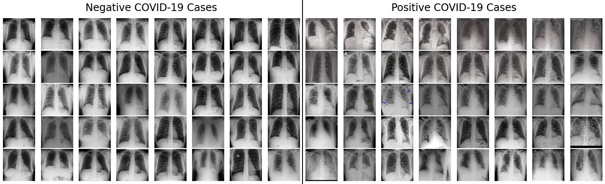

### 扩充 COVID-19 样本

为了充分利用我现有的样本（99 张图像），我需要使用训练数据扩充操作。扩充是对图像执行的一种操作，也是 CNN 新引入的一项操作。扩充的一些常见示例是图像的旋转、剪切和翻转。

请记住，我使用扩充是为了更好地实现模型概括并防止过度拟合。实际上，每次使用一种扩充形式后，都会向训练数据集添加另一张相似但略有不同的图像。请注意，这也演示了如何扩充图像，但不是演示我们稍后要使用的扩充。

#### 已调整对比度

我将使用 TensorFlow 的 `image.adjust_contrast()` 函数来调整所有图像的对比度。

```lang-python
X_train_contrast = []

for x in X_train:
    contrast = tf.image.adjust_contrast( x, 2 )
    X_train_contrast.append(contrast.numpy())

plot_images(X_train_contrast, 'Adjusted Contrast')

```

Show moreShow more icon

这将生成以下已更新的图像。

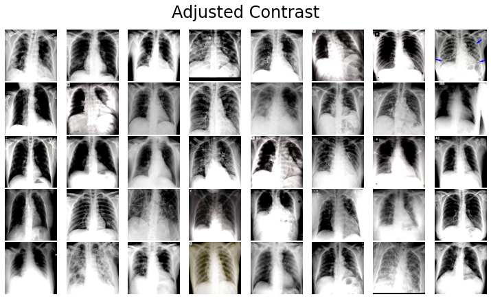

#### 已调整饱和度

我将使用 TensorFlow 的 `image.adjust_saturation()` 函数来调整所有图像的饱和度。

```lang-python
X_train_saturation = []

for x in X_train:
    saturation = tf.image.adjust_saturation( x, 3 )
    X_train_saturation.append(saturation.numpy())

plot_images(X_train_saturation, 'Adjusted Saturation')

```

Show moreShow more icon

这将生成以下已更新的图像。

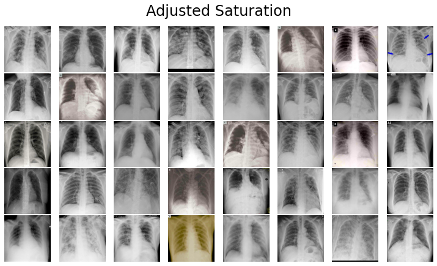

#### 左右翻转

我将使用 TensorFlow 的 `image.flip_left_right()` 函数从左向右翻转所有图像。

```lang-python
X_train_flipped = []

for x in X_train:
    flipped = tf.image.flip_left_right(x)
    X_train_flipped.append(flipped.numpy())

plot_images(X_train_flipped, 'Flipped Left Right')

```

Show moreShow more icon

这将生成以下已更新的图像。

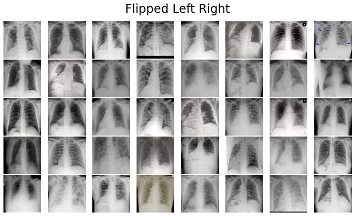

#### 上下翻转

我将使用 TensorFlow 的 `image.flip_up_down` 函数从上向下翻转所有图像。

```lang-python
X_train_flipped_up_down = []

for x in X_train:
    flipped = tf.image.flip_up_down(x)
    X_train_flipped_up_down.append(flipped.numpy())

plot_images(X_train_flipped_up_down, 'Flipped Up Down')

```

Show moreShow more icon

这将生成以下已更新的图像。

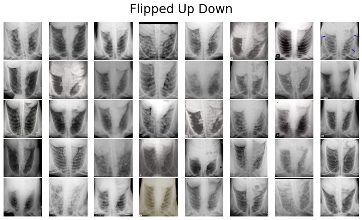

#### 上下左右翻转

我将使用 TensorFlow 的 `image.flip_left_right()` 函数来翻转所有已经从上向下翻转的图像，使得图像先从上向下翻转，然后从左向右翻转。

```lang-python
X_train_flipped_up_down_left_right = []

for x in X_train_flipped_up_down:
    flipped = tf.image.flip_left_right(x)
    X_train_flipped_up_down_left_right.append(flipped.numpy())

plot_images(X_train_flipped_up_down_left_right, 'Flipped Up Down Left Right')

```

Show moreShow more icon

这将生成以下已更新的图像。

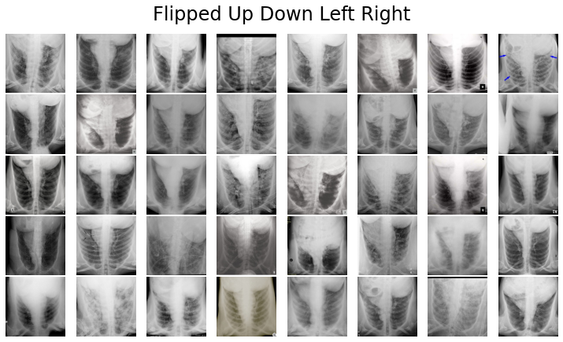

#### 旋转

TensorFlow 提供了一个名为 TensorFlow Addons 的扩展，可通过 `pip install tensorflow-addons` pip 命令来安装此扩展。该程序包中包含 `image.rotate()` 函数，用于将任何图像旋转任意角度。该函数以弧度作为输入，因此我使用 Python 数学导入中的 `radians()` 函数。

```lang-python
import tensorflow_addons as tfa
from math import radians

X_train_rot_45_deg = []
X_train_rot_135_deg = []
X_train_rot_225_deg = []
X_train_rot_315_deg = []

for x in X_train:
    deg_45 = tfa.image.rotate(image, radians(45))
    deg_135 = tfa.image.rotate(image, radians(135))
    deg_225 = tfa.image.rotate(image, radians(225))
    deg_315 = tfa.image.rotate(image, radians(315))

    X_train_rot_45_deg.append(deg_45)
    X_train_rot_135_deg.append(deg_135)
    X_train_rot_225_deg.append(deg_225)
    X_train_rot_315_deg.append(deg_315)

plot_images(X_train_rot_45_deg, 'Rotated 45 Degrees')
plot_images(X_train_rot_135_deg, 'Rotated 135 Degrees')
plot_images(X_train_rot_225_deg, 'Rotated 225 Degrees')
plot_images(X_train_rot_315_deg, 'Rotated 315 Degrees')

```

Show moreShow more icon

这将生成以下已更新的图像。

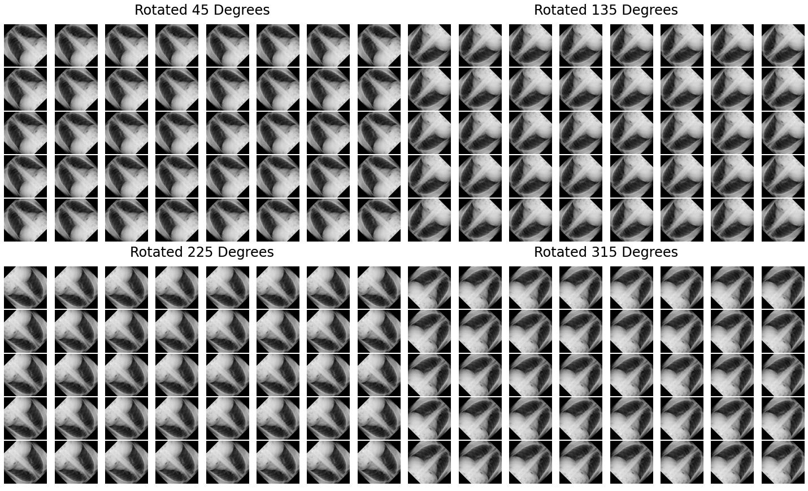

## 架构概述

据目前已发布的一些 COVID-19 论文显示，VGG 和 ResNet 模型目前因其表现最佳而非常受欢迎。

1. Hemdan, E.、Shouman M. 和 Karar M. (2020)。COVIDX-Net：A Framework of Deep Learning Classifiers to Diagnose COVID-19 in X-Ray Images. [arXiv:2003.11055](https://arxiv.org/abs/2003.11055)。
2. Wang, L. 和 Wong, A. (2020)。COVID-Net：A Tailored Deep Convolutional Neural Network Design for Detection of COVID-19 Cases from Chest Radiography Images. [arXiv:2003.09871](https://arxiv.org/abs/2003.09871)。

我通过 [这篇文章](https://towardsdatascience.com/illustrated-10-cnn-architectures-95d78ace614d) 中改编的样式指南来概述了 VGG19 和 ResNet50 这两种架构。黄色 R 代表 ReLU，而黄色 S 代表 Softmax。括号表示重复的图层块。请注意，我以抽象的方式解释了批处理规范化。

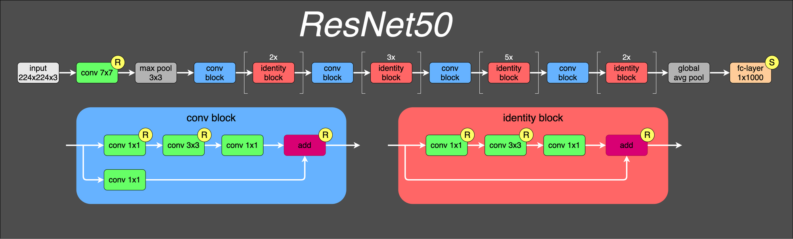

## 运行深度学习模型

我将使用迁移学习，而迁移学习将需要使用 VGG19 模型，此模型将权重初始化为 ImageNet（这是一个完全不同的数据集）的权重。ImageNet 是由随机对象的图像组成，而我的数据集只包含 X 射线图像。我准备转移隐藏图层，这些隐藏图层会从以前看过的对象或它们在另一个数据集中的不同几何形式中找到彩色图案。

我进行了一个小实验，尝试不使用迁移学习，此时得到的准确性和 F1 大约为 0.5-0.6。正如您稍后所见，我选择继续采用效果更好的方法。如果要进行实验，则必须使用 `weights=None` 来定义 VGG19 模型。

### 导入、加载数据和拆分数据

对于用于加载数据和建模的所有导入，我将使用多个程序包：pandas、PyPlot、NumPy、cv2、TensorFlow 和 scikit-learn。

```lang-python
import pandas as pd
import matplotlib.pyplot as plt
%matplotlib inline
import numpy as np
import cv2, time
import tensorflow as tf

from sklearn.model_selection import train_test_split
from sklearn.preprocessing import LabelBinarizer
from tensorflow.keras.utils import to_categorical

from tensorflow.keras.preprocessing.image import ImageDataGenerator
from tensorflow.keras.applications import VGG19
from tensorflow.keras.models import Model
from tensorflow.keras.layers import Input
from tensorflow.keras.layers import Flatten
from tensorflow.keras.layers import Dropout
from tensorflow.keras.layers import Dense

```

Show moreShow more icon

我首先加载两个数据集（请注意，路径变量中的 `dataset/` 是 GitHub 存储库的文件夹的名称）。我限制了用于建模的正常病例的数量，因为使用所有图像（甚至是 20% 的正常图像）都会导致对这些样本进行过度拟合。

```lang-python
covid_path = 'dataset/covid_dataset.csv'
covid_image_path = 'dataset/covid_adjusted/'

normal_path = 'dataset/normal_xray_dataset.csv'
normal_image_path = 'dataset/normal_dataset/'

covid_df = pd.read_csv(covid_path, usecols=['filename', 'finding'])
normal_df = pd.read_csv(normal_path, usecols=['filename', 'finding'])

normal_df = normal_df.head(99)

covid_df.head()

```

Show moreShow more icon

以下代码将图像加载到 Python 数组中。最后，我将图像加载到 NumPy 数组中并对图像进行规范化，使所有像素值都在 0 到 1 之间。

```lang-python
covid_images = []
covid_labels = []

for index, row in covid_df.iterrows():
    filename = row['filename']
    label = row['finding']
    path = covid_image_path + filename

    image = cv2.imread(path)
    image = cv2.cvtColor(image, cv2.COLOR_BGR2RGB)

    covid_images.append(image)
    covid_labels.append(label)

normal_images = []
normal_labels = []

for index, row in normal_df.iterrows():
    filename = row['filename']
    label = row['finding']
    path = normal_image_path + filename

    image = cv2.imread(path)
    image = cv2.cvtColor(image, cv2.COLOR_BGR2RGB)

    normal_images.append(image)
    normal_labels.append(label)

# normalize to interval of [0,1]
covid_images = np.array(covid_images) / 255

# normalize to interval of [0,1]
normal_images = np.array(normal_images) / 255

```

Show moreShow more icon

我想确保正常病例和感染病例都得到正确拆分，由于它们是单独加载，因此也会单独拆分。如果我以后选择加载比感染病例更多的正常病例，而这会导致加载不平衡的数据集，那么仍然会根据感染病例数，对训练和测试数据集进行正确拆分。

在拆分数据集后，我将它们与输入 _X_ 和输出 _y_ 以及用于训练和测试数据的标签串联在一起。我还使用 `LabelBinarizer()` 和 `to_categorical()` 函数将标签 _COVID-19_ 和 _Normal_ 转换为数字。

```lang-python
# split into training and testing
covid_x_train, covid_x_test, covid_y_train, covid_y_test = train_test_split(
    covid_images, covid_labels, test_size=0.2)

normal_x_train, normal_x_test, normal_y_train, normal_y_test = train_test_split(
    normal_images, normal_labels, test_size=0.2)

X_train = np.concatenate((normal_x_train, covid_x_train), axis=0)
X_test = np.concatenate((normal_x_test, covid_x_test), axis=0)
y_train = np.concatenate((normal_y_train, covid_y_train), axis=0)
y_test = np.concatenate((normal_y_test, covid_y_test), axis=0)

# make labels into categories - either 0 or 1
y_train = LabelBinarizer().fit_transform(y_train)
y_train = to_categorical(y_train)

y_test = LabelBinarizer().fit_transform(y_test)
y_test = to_categorical(y_test)

```

Show moreShow more icon

### 定义模型

我使用了预训练的 VGG19 模型。我设置了 `include_top=False`，这意味着在 VGG19 架构的末尾存在没有完全连接的图层。这样，我可以从卷积中获得输出，将其展平，然后将其解析为我自己的输出图层。

我还使用 Dropout 层添加了正则化，因为我对训练数据进行了强过度拟合。我仍会对训练数据进行过度拟合，但不会这么强烈。我将准确性从大约 0.97 下调到 0.88。

```lang-python
vggModel = VGG19(weights="imagenet", include_top=False,
    input_tensor=Input(shape=(224, 224, 3)))

outputs = vggModel.output
outputs = Flatten(name="flatten")(outputs)
outputs = Dropout(0.5)(outputs)
outputs = Dense(2, activation="softmax")(outputs)

model = Model(inputs=vggModel.input, outputs=outputs)

for layer in vggModel.layers:
    layer.trainable = False

model.compile(
        loss='categorical_crossentropy',
        optimizer='adam',
        metrics=['accuracy']
)

```

Show moreShow more icon

### 定义训练数据扩充

我选择扩充数据的方法是针对每个样本生成一批扩充样本。对于每个样本，我通过以下代码中定义的 `ImageDataGenerator` 来生成了一批新样本。所有这些新扩充样本将用于训练，以取代原始样本。

```lang-python
train_aug = ImageDataGenerator(
    rotation_range=20,
    width_shift_range=0.2,
    height_shift_range=0.2,
    horizontal_flip=True
)

```

Show moreShow more icon

我选择设置了 `rotation_range=20`，这表示原始图像随机旋转的度数范围。这意味着 Keras 将随机选择范围 1 – 20 内的一个度数，然后将图像顺时针或逆时针旋转该度数。

同时，我还使用了 `width_shift_range=0.2` 和 `height_shift_range=0.2`，按指定的宽度（即左右方向）和高度（即上下方向）来随机移动图像。

最后，我设置了 `horizontal_flip=True`，如您在前面所见，它可以水平地随机翻转图像（即从左向右翻转图像）。

可以在此 [博客](https://fairyonice.github.io/Learn-about-ImageDataGenerator.html) 中找到 `ImageDataGenerator` 函数的正确可视化。

### 拟合、预测和评分

我已经定义了模型、扩充和数据。现在，我要做的是开始训练 VGG19 模型。我使用 `train_aug.flow()` 函数，通过扩充来提供一批样本，从而使用扩充数据来训练模型。

```lang-python
history = model.fit(train_aug.flow(X_train, y_train, batch_size=32),
                    steps_per_epoch=len(X_train) / 32,
                    epochs=500)

```

Show moreShow more icon

由于我想了解模型在不同的现有类别上的性能，因此我使用正确的指标来衡量模型的性能（即 I F1，而不是准确性）。 [David Ernst](https://stats.stackexchange.com/a/260237/246891) 解释了我同时使用 AUC 和 F1 的原因。

> “ROC AUC [或 F1] 对类别失衡很敏感，因为当只存在少数类别时，通常将这些类别定义为阳性类别，这会对 AUC [或 F1] 值产生重大影响。这种行为非常可取。例如，准确性就不是那样敏感。即使对少数类别的预测根本不准确，准确性也可能很高。”

在训练模型后，我可以使用它对未见过的新数据进行预测。我使用 `argmax` 来找到最高的预测概率，然后使用 scikit-learn 来生成分类报告。

```lang-python
from sklearn.metrics import classification_report

y_pred = model.predict(X_test, batch_size=32)
print(classification_report(np.argmax(y_test, axis=1), np.argmax(y_pred, axis=1)))

```

Show moreShow more icon

早期版本中的 `LabelBinarizer` 设定如下：“0”表示 COVID-19 类别，“1”表示正常类别。我可以清楚地看到准确率是 82%，而 COVID-19 的 f1 得分是 0.84。因为数据有限，所以这个结果还不错。这或许表明，图像中存在没有过滤掉或校正的其他噪点。

```
              precision    recall  f1-score   support

           0       0.75      0.95      0.84        19
           1       0.93      0.70      0.80        20

    accuracy                           0.82        39
macro avg       0.84      0.82      0.82        39
weighted avg       0.84      0.82      0.82        39

```

Show moreShow more icon

现在，我可以使用 PyPlot 来绘制训练准确性和训练损耗。

```lang-python
plt.figure(figsize=(10,10))
plt.style.use('dark_background')

plt.plot(history.history['accuracy'])
plt.plot(history.history['loss'])

plt.title('Model Accuracy & Loss')
plt.ylabel('Value')
plt.xlabel('Epoch')

plt.legend(['Accuracy', 'Loss'])

plt.show()

```

Show moreShow more icon

这将生成一个简单的图，该图显示模型在训练数据集上的准确性如何随时间提高以及训练数据集的损耗。

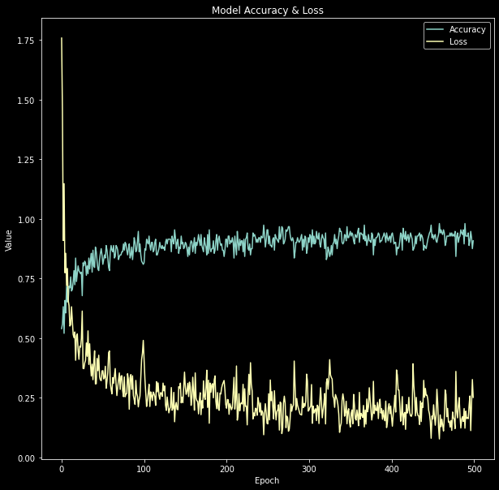

## 结束语

虽然我尝试设法消除了其他方法中的一些错误，但我相信还有很大的改进空间。从 f1 分数可以看出，我很可能还会遇到一些无法立即显现的数据问题。

可使用下列方法来获得更好的模型和更可靠的结果。

1. 使用 SARS、MERS、ARDS 和其他类型感染的 X 射线图像，而不仅仅是正常类别。这样，我就可以区分不同的感染。
2. 通过后前位 (PA) 视图提供的 COVID-19 病例的更高质量数据。
3. COVID-19 不同阶段的数据：感染，无症状；感染，轻症；感染，重症。
4. 更高级类型的成像数据，即包含更多信息的 CT 图像。
5. 交叉验证或嵌套交叉验证，可更好地估计模型的真实概括误差。

本文中得出的结果 _不能_ 被认为可用于现实场景。必须在工程师、医生和其他专业人员进行严格测试，再进行临床研究之后，您才可以考虑使用深度学习 COVID-19 方法。

本文翻译自： [Using deep learning to take on the COVID-19 virus](https://developer.ibm.com/articles/using-deep-learning-to-take-on-covid-19/)（2020-04-21）