# 使用线性回归检测水泥质量
机器学习代码实战

**标签:** 机器学习

[原文链接](https://developer.ibm.com/zh/articles/ba-lo-machine-learning-cement-quality/)

杜可

发布: 2018-10-16

* * *

## 概述

线性回归是机器学习的最基本算法，本文向读者介绍了线性回归的原理和使用，以及如何通过Java语言编写线性回归的模型代码。并且以水泥质量预测为例构造出一个水泥质量预测模型。还通过线性回归介绍了机器学习的基本概念，如回归、最小二乘法和梯度下降等。本文可以作为机器学习甚至是深度学习的入门文章。

## 要解决的问题

本文将使用一批水泥成分的样本数据（附件中的 ConcreteTable.csv 文件），让程序学习这些样本数据，来得到一个较好的水泥质量预测模型。下面的表 1 中 摘取了一小部分这些水泥样本数据：

表1\. 部分水泥样本数据

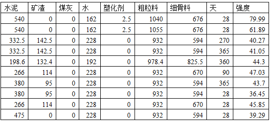

表 1 中 ，每行是一个样本，1-7 列是每立方米混合物中各个成分的重量（单位：千克），第 8 列是已使用天数，第 9 列 是该行水泥样本的强度（单位：MPa）。前 8 列 是水泥的输入属性，最后 1 列是输出，我们要让机器学习这些样本后得到一个模型，这个模型可以输入样本表格之外的数据，预测出水泥的强度。一般这个模型会对应一个公式，可以通过机器学习中很多算法实现，如线性回归，神经网络等，由于这个问题相对较为简单，所以我们通过最基本的线性回归算法来实现，后续文章中会介绍通过神经网络等算法来解决稍微复杂的问题。

## 线性回归模型

### 线性回归简介

首先我们简单介绍下线性回归（Linear Regression），线性回归是假设特证属性之间满足线性关系，利用数理统计中回归分析，即根据给定的样本数据训练，来确定两种或两种以上特征属性与输出属性之间的相互依赖关系并得出一个线性模型的分析方法。

如图 1 所示，以平面点为例，如果有 N 个样本点，线性回归算法就是求一条曲线 y =h(x)。使得各点到这个曲线的距离的绝对值之和最小。

##### 图 1\. 平面线性回归

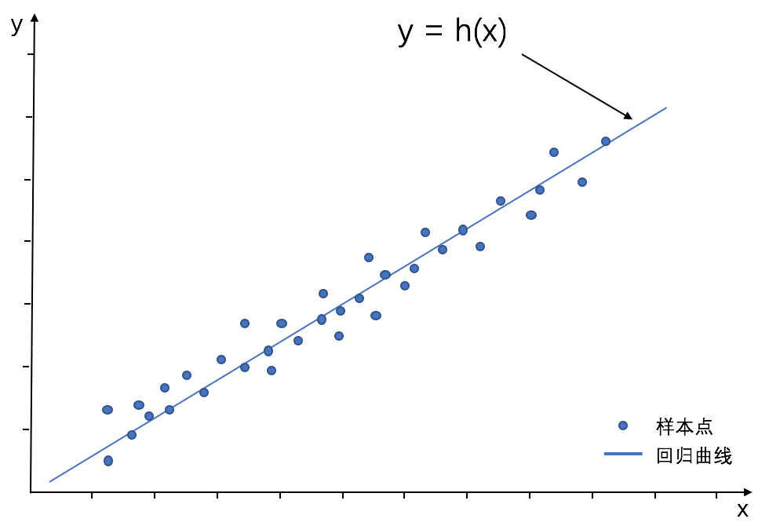

具体方法可以用迭代实现，设曲线为 y=ax+b，即一条直线， a 和 b 是我们要求得参数，则步骤如下：

先分别给 a 和 b一 个初始的参数（比如 1 ）对所有样本进行计算得到 N 个 计算出的 y 值 ，计算出的 y 值 与样本中真实 y 值 之差的绝对值就得到误差（也称为损失）。然后想办法重新调整 a 和 b 参数，再循环上面步骤，得到一个新的更小一些的误差，如此循环使误差越来越小，直到误差收敛为一个基本固定的值为止，这时候得到最终的 a 和 b 的 参数，带入模型公式 y =ax+b，这个公式就可以近似的模拟输入样本之外的新数据，得到近似的结果。如下面图 2 所 示就是这个迭代的过程，随着迭代的进行，生成的曲线与样本点的距离越来越近:

##### 图 2\. 线性回归迭代过程

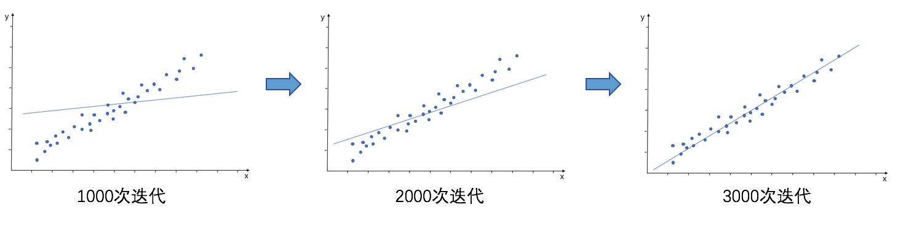

在平面例子中只有一个自变量 x ，更普遍的情况是有多个自变量即多个特征，假设有 n 个 特征，则线性回归的公式可表示为：

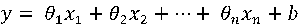

这里包括多个自变量 x 和 一个因变量 y ，b 是偏移量，也称为 0 参数，且因变量和自变量之间是线性关系，这种多个自变量和因变量的关系的分析称为多元线性回归分析。现实中有很多这样的分析例子，如房屋的面积，房间数等自变量和房价的关系等，都是线性回归的例子。

公式中如果设定 n 等于 8 ，则 8 个自变量 x 就对应水泥混合物表 1 中 的 8 个水泥特征值，如水泥含量，矿渣含量，煤灰含和凝固时间量等，水泥强度就是因变量 y ，θ 是每个特征值的权重参数，即每个特征对水泥强度质量的重要程度。我们的目标就是要求所有 θ 参数和 b 参 数的值，然后代入到线性回归公式中，来预测样本之外的水泥配料数据对应的水泥强度。

接下来，将线性回归的公式稍微整理一下，将偏移量 b 合 并到参数 θ 中用

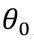表示，并且多加一个对应的因变量 >

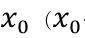恒等于 1 ），将自变量 x 与参数 θ 用向量来表示，即：

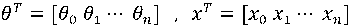

则线性回归公式可用向量表示为：

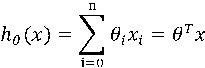

通常将

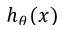称为假设函数 (Hypothetical Function)，那么我们现在就是要求解一组 θ ,求解的过程也称为寻找最优参数 θ ，如何求解呢？方法有很多，这里我们使用最常用也是最经典的最小二乘法。

### 最小二乘法

前面提到过，通过迭代，计算所有样本数据的 y 值再与真实 y 值求差，最后取其绝对值，得到的就是误差，要让这个误差尽量最小，最小二乘法（Least Squares）就是基于这个思想的方法，先看其公式：

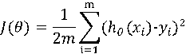

上式中 m 是样本总数量，

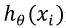是计算出的 y 值 ，

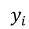是真实 y 值 。取平方的效果类似于取绝对值，

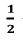会在后面的计算中被消去，对参数求解不产生实际影响。

通过这个函数对所有样本进行计算，得到一个误差 J (θ) ，这个误差也称为损失。如前文所说，我们要让这个误差尽量最小才能得到模型公式最好的一组参数，也就是求 min J(θ)。

### 梯度下降

我们要求最小值，如果把自变量和因变量的关系想象为一个曲面，则就是求这个曲面的最低点，可以从某一点出发，沿梯度下降的方向往前走，走的时候我们选择最陡峭的方向，这样能下降的最快，直到走到最低点（最小值），这种解最小值的方法就是梯度下降（Gradient Descent）。

具体方法，就是对上面公式 J (θ) 中的参数求偏导数，得到这个参数对应维度最陡峭的方向，在乘以一个步长 a ，就求出每次参数移动的大小：


完成上述公式的求导，最终得到每次迭代的参数更新公式：

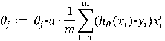

公式中的 a 称为 **步 长** 或者 **学 习 率** ，要注意几点：

- 每次迭代只对参数有比较小的更新，要经过多次迭代才能得到最终理想的参数。
- 如果步长太大，可能会在最低点附近徘徊，所以训练模型的时候要注意调整步长。
- 这个方法让你走到的不一定是整个曲面的最低点，可能只是局部最小，所以往往要考虑起点。

至此，我们介绍了构建水泥质量预测模型的相关理论基础，总结起来，就是以线性回归为基础，对水泥配料的样本数据通过上面的公式迭代计算，得到一组满意的参数，带入到线性回归的公式中，得到最终的模型。

### 向量化计算

我们的迭代公式每次只求出一个参数的更新值，向量化计算是为了使计算更加快捷，使用向量运算的方式计算梯度与新的参数，每一次迭代，可以求出所有新参数值。

对于向量化计算，最小二乘法核心公式不变，只是换成向量的形式计算。如果训练数据共 m 行 ，则特征和输出值可以用矩阵 x 和 y 表 示为：


待求的参数矩阵为

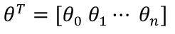，记

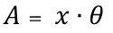，为一列向量：

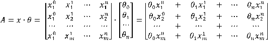

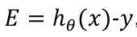，为一列向量：

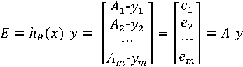

则θ更新过程可转化为：

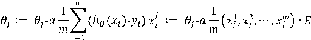

a 与

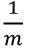简化合并后就是：

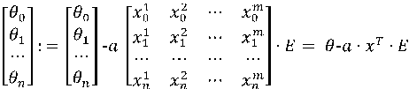

即：

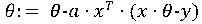

这个公式 θ 的更新过程中输入都是向量，所以向量化后 θ 更新的步骤如下：

1. 求

    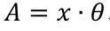

2. 求

    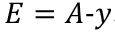

3. 求

    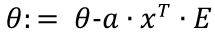


后面我们的代码就用这个步骤来实现参数的更新。

### 特征缩放

我们来看如下表 2 中的一部分水泥样本数据：

表 2 . 部分水泥样本数据

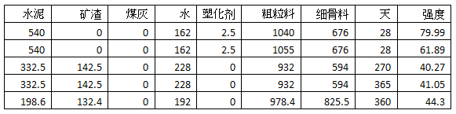

我们会发现不同维度的数值范围差异会很大，就比如上表中水泥量、粗粒料和塑化剂等含量数值差异很大，塑化剂维度和粗粒料的维度值范围分别是 10 左右和 1000 多 ，如此大的差异如果用梯度下降，会使得不同方向的下降速度差异很大，迭代算法可能收敛得很慢甚至不收敛。如果直接将该样本送入训练，会使目标函数的形状太”扁”，在找到最优解前，梯度下降的过程不仅是曲折的，也是非常耗时的，如下面图 3 所示，如果特征差异太大，就会像左图一样，在求最优解时，会得到一个窄长的椭圆形，导致在梯度下降时，梯度的方向为垂直等高线的方向而走之字形路线，这样会使迭代很慢；而如果特征差异不大，如右图会形成一个近似的圆形，则迭代就会很快。

##### 图 3\. 不同特征值范围的梯度下降对比

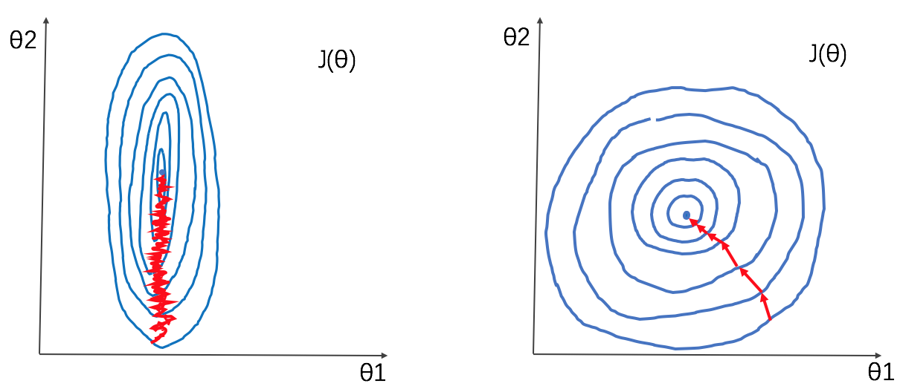

所以如果求解使用迭代算法，需要在计算前把不同的特征缩放到同一个范围内，比如控制在 [-1 1] 内。这个特征数据缩放的过程就是数据归一化。本例中我们把输入数据都转换到 [-1 1] 的范围，公式如下：

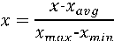

## 模型的代码实现

模型的实现有很多方法，比如很多的机器学习框架如 H2O，Caffe 以及 TensorFlow 等 ，可以直接拿来使用，框架内部已经实现了各种模型如线性回归算法，使用者不用自己编写代码，只需要输入数据和参数。本文暂时不介绍这些框架，而是通过教读者自己编写代码实现一个线性回归模型，使读者能够更好理解机器学习中一些关键点，如参数选择的重要性，以及为什么一个简单的线性回归模型也要经过大量迭代计算。本文代码使用大家最常用的 Java 语言来实现。

### 矩阵运算

我们通过向量化计算每一次迭代可以求出所有新参数值，首先要实现矩阵运算，用 Java 的 二维数组 float[][]来表示一个矩阵，数组的第一维是矩阵的行，数组的第二维是矩阵的列。如下面代码清单 1 中 ，定义了一个 2 行 3 列的矩阵：

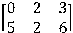

##### 清单 1 . 定义矩阵

```
float[][] matrix = new float[2][3];
matrix[0][0] = 0;
matrix[0][1] = 2;
matrix[0][2] = 3;
matrix[1][0] = 5;
matrix[1][1] = 2;
matrix[1][2] = 6;

```

Show moreShow more icon

根据矩阵定义，还要继续实现一些基本的矩阵运算，在附件中代码 Matrix 类 简单实现了如下矩阵运算。注意，这些矩阵计算函数只是为了方便本文的演示，虽然尽量考虑了性能，但并未追求完美的性能。比如计算行列式的值，本例使用消元法计算，如果使用公式法参数稍多就会非常缓慢，但如果考虑使用 GPU、并行计算或者云计算等技术，性能应该会更好。

##### 清单 2 . 定义矩阵运算函数

```
// 矩阵乘积: 左矩阵 * 右矩阵
public static float[][] times(float[][] left, float[][] right)

// 常数a 与 矩阵乘积: a * 矩阵
public static float[][] times(float a, float[][] matrix)

// 矩阵相加: 左矩阵 + 乘数 * 右矩阵
public static float[][] add(float[][] left, float multiplier, float[][] right)

// 转置矩阵
public static float[][] transpose(float[][] matrix)

// 计算数量积
public static float dotProduct(float[] left, float[] right)

// 计算行列式的值
public static float detValue(float[][] det)

// 提取矩阵的余子式
public static float[][] cofactor(float[][] matrix, int row, int col, float[][] result)

// 提取伴随矩阵 adjointMatrix
public static float[][] adjointMatrix(float[][] matrix)

```

Show moreShow more icon

具体代码请下载本文的代码包附件中的 Matrix 类 。

### 准备数据

数据准备的过程要提取、加工数据，从而将数据处理成模型可以使用的格式。我们的水泥配料数据表存储在名为 ConcreteTable.csv 的文件中，每个属性值之间以逗号分隔，最后一个值为水泥强度值，也就是 y 值 。如下清单 3 中所示为文件的一小部分：

##### 清单 3 . 数据文件部分内容

```
167,75.4,167,164,7.9,1007.3,770.1,100,56.81
173.8,93.4,159.9,172.3,9.7,1007.2,746.6,100,50.94
190.3,0,125.2,166.6,9.9,1079,798.9,100,33.56

```

Show moreShow more icon

要处理这个文本文件中的数据，再送入模型进行训练。首先实现一个 MatrixDataFile 类 ，用来将文本数据转化为二维数组，即矩阵形式，并且进行特征缩放。准备数据的过程由以下几部分的代码实现：

（1）将文本数据读入内存，将数据放入一个类型为 ArrayList 的实例中作为 Java 处理的原始数据，如下代码清单 4 所 示：

##### 清单 4 . 读取数据文件

```
ArrayList<String>  data= new ArrayList<String> ();
File file = new File(fileName);
BufferedReader reader = null;
reader = new BufferedReader(new FileReader(file));
String tempString = null;
while ((tempString = reader.readLine()) != null) {
    data.add(tempString);
}
reader.close();

```

Show moreShow more icon

（2）接着，将这个 ArrayList实例中的数据转化为矩阵形式，我们需要输出 2 个矩阵，分别是对应特征值的矩阵 x 和实际值的矩阵 y ，这样对我们后续计算比较方便，如下面代码清单 5 所 示：

##### 清单 5 . 数据转换为矩阵形式

```
// 设置x 与 y矩 阵行数
final int rows = data.size() ;

// 设置x 矩 阵列数
String line = data.get(0);
features = line.split(",");
final int featureCount = features.length-1 ;
final int cols = featureCount+1;  // 增加常数列,即 (wx+b) 中的参数 b

// 初始化原始数据矩阵
x = new float[rows][cols];
y = new float[rows][1];

// x(0)数据，常数列，所以设置x (0)值始终为1
for(i=0;i<rows;i++) x[i][0] = 1 ;

//填充特征与标签数据
for(i=0;i<rows;i++){
    line = data.get(i);
    features = line.split(",");
    // 设置特征值
    for(int j=0;j<features.length-1;j++){
        // 将特征值放入特征矩阵x ， 第一列是常数列，所以要 j+1
        x[row][j+1] = Float.parseFloat(features[j].trim());
    }
    // 设置y 值 ：y值 位于一行数据最后，将y 值 放入值矩阵y
    y[row][0] = Float.parseFloat(features[features.length-1]) ;
    row++;
}

```

Show moreShow more icon

（3）特征缩放，将数据大小范围归一化，使得所有数据在相同的范围内。

使用的公式是：

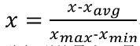

所以要先求出矩阵每列的最大、最小和平均值，通过 Matrix.colStatistic 方法实现计算列的这些统计值，然后按照公式计算新的特征值。

##### 清单 6 . 将特征缩放为一致的范围

```
float min,max,avg,range;
int rows = Matrix.rows(x);
int cols = Matrix.cols(x);

for(int col=0;col<cols;col++) {
    HashMap<String, Float> statistic = Matrix.colStatistic(x, col);
    min = statistic.get("min");
    max = statistic.get("max");
    avg = statistic.get("avg");
    range = max - min ;
    if(max==min) continue;  // 常数列略过
    if(min>=-1 & &  max<=1) continue;  // 特征合适则略过
    colStatistics.put(col, statistic);
    // 缩放该列
    for(int row=0;row<rows;row++) {
        x[row][col] = (x[row][col] - avg ) / range ;
    }
}

```

Show moreShow more icon

（4）封装后的过程

以上数据处理的步骤，经过类封装后，过程步骤代码简写成如下形式：

##### 清单 7 . 封装数据处理过程

```
// 数据文件
MatrixDataFile dataSource = new MatrixDataFile("/ai/data/Concrete_Data.csv");
// 数据缩放
dataSource.featureScaling();
// 得到训练与测试数据集矩阵
ArrayList< float[][]> trainData = dataSource.get(830,950);
ArrayList< float[][]> testData  = dataSource.getLast(80);

```

Show moreShow more icon

注意：训练数据与测试数据选取的行不要重叠，否则会影响训练的效果。

### 模型训练

输入数据以及初始参数，让模型不停的通过最小二乘法计算出新的参数，使得误差越来越小，直至误差收敛到一个趋于固定的值后，得出最终一组参数，根据得到的参数带入模型，然后用测试数据验证模型，如果得到的误差不满意，则需要调整初始参数或者数据，继续上面的过程，直到得到满意的参数和测试数据误差为止。这个过程如果训练数据量很大，参数很多，则时间有可能会比较长，所以对于有非常多参数的数据或者复杂的模型如神经网络可能需要用到多台机器并行以及 GPU 卡加速等手段，加快训练速度。本例的参数数量和训练数据量不是很大，所以单机就可以比较快速的完成。以下代码清单 8 中 ，是根据上面提到的向量化计算步骤的实现代码，代码中每次 for 循环，会输出一组误差比上次循环更小的参数值变量 parameters。

##### 清单8 . 模型训练代码

```
// 中间矩阵 a * xT
a_times_xT = Matrix.times(this.step, xT);

// 迭代
for(int times= 0; times< iterationTimes; times++){
    // (1) 求 A = x * parameters;
    Matrix.times(x, parametersT, A);

    // (2) 求 E = A - y
    Matrix.add(A, -1, y, E);

    // (3) 求 parametersT := parametersT - a * xT * E
    Matrix.times(a_times_xT, E, a_times_xT_times_E);
    Matrix.add(parametersT, -1, a_times_xT_times_E, parametersT);

    // 新的参数
    parameters = Matrix.transpose(parametersT);
}

```

Show moreShow more icon

### 训练监控

每一次循环输出新的误差值、本次误差相比上次循环中误差缩小程度的百分比（即误差的收敛程度）等相关数据。我们将这些数据记录下来，可以输出为表格或者图形从而在训练的过程中进行分析。下面所示的代码清单9 中 ，将迭代过程中的输出记录在一个 ArrayList 实例中。

##### 清单9 . 记录训练过程中的数据

```
// 监控输出记录
distAll = 0 ;
params = Matrix.matrixToColVector(parametersT);
for(int i=0;i< x.length;i++){
    hx = Matrix.dotProduct(x[i], params);
    yValue = y[i][0];
    dist = (hx - yValue)*(hx - yValue);
    distAll += dist;
}
distAvg = distAll / (x.length * 2);  // j(θ)
if(distAvgBefore>0){
    percent = ((distAvgBefore - distAvg) / distAvgBefore ) * 100 ;
}
distAvgBefore = distAvg;

// 监控数据
moitorDiv = times%moitorStep ;
if(times< 10 || times>iterationTimes-10 || (moitorDiv==0.0)){
    HashMap monitorItem = new HashMap();
    monitorItem.put("times", times);
    monitorItem.put("distAvg", distAvg);
    monitorItem.put("distAvgPercent", percent);
    monitorItem.put("parameters", Matrix.copy(parameters));  // 记录本次参数
    moitorTraining.add(monitorItem);
}
}

```

Show moreShow more icon

### 测试模型

得到一组最终的参数 parameters 后，将参数带入模型公式，再用测试数据计算误差，误差越小则得出的参数越趋近于最优。下面所示的代码清单 10 中 ，test 函数使用已经计算出的最终参数组 parameters 计算预测值 hy，再减去实际的 y 值后取绝对值，就是一条样本的误差。

##### 清单 10\. 用测试数据测试模型

```
moitorTesting = new ArrayList< HashMap>();
int testCount = testX.length;
totalErrorAvg = 0 ;
totalErrorAvgPercent = 0 ;
for(int i=0;i< testX.length;i++){
    float[] x = testX[i];
    float y = testY[i][0];
    float hy = test(method,x,y,parameters);
    float error = Math.abs(hy-y);        //误差
    float errorPercent = error / y ;
    totalErrorAvg += error / testCount ;
    totalErrorAvgPercent += (error / y) / testCount ;
......
}

```

Show moreShow more icon

## 开始训练

代码介绍完了，下面，让我们看看如何开始训练我们的水泥配料数据，得出一个模型来预测水泥的质量。

### 调参数

训练一个模型，当程序都已经写好后，很大一部分时间都是要进行参数调整。本例中模型训练主要有 3 个参数：特征值参数，步长和迭代次数。

- 特征值参数：每个特征值的参数，初始全部设置为1 。
- 步长 :每次梯度下降移动的距离。步长太小，训练过程比较长，步长太大则可能会出现在一个凹点来回跨越的情况。
- 迭代次数：本例中手动设置迭代次数，次数过少，会拟合不充分，次数过多，则时间会比较长。

通过封装的 LinearRegression 类建立一个线性回归模型，train 方法输入上面 3 个参数并且开始训练，如下面代码清单 11：

##### 清单 11\. 输入参数开始训练

```
// 建立模型开始训练
LinearRegression LR = new LinearRegression();
LR.setXY(trainData.get(0),trainData.get(1));
LR.train(new float[]{1,1,1, 1,1,1, 1,1,1}, 0.0003f, 60000);

```

Show moreShow more icon

### 步长的影响

如果步长过大，就会导致最小值在一个点附近来回跨越的情况，比如上面的代码清单 11 中 ，步长设置为 0.0003，迭代 60000 次 ，就会出现最小值来回跳跃的情况，如下图 4 所 示：

##### 图 4\. 步长过大的输出

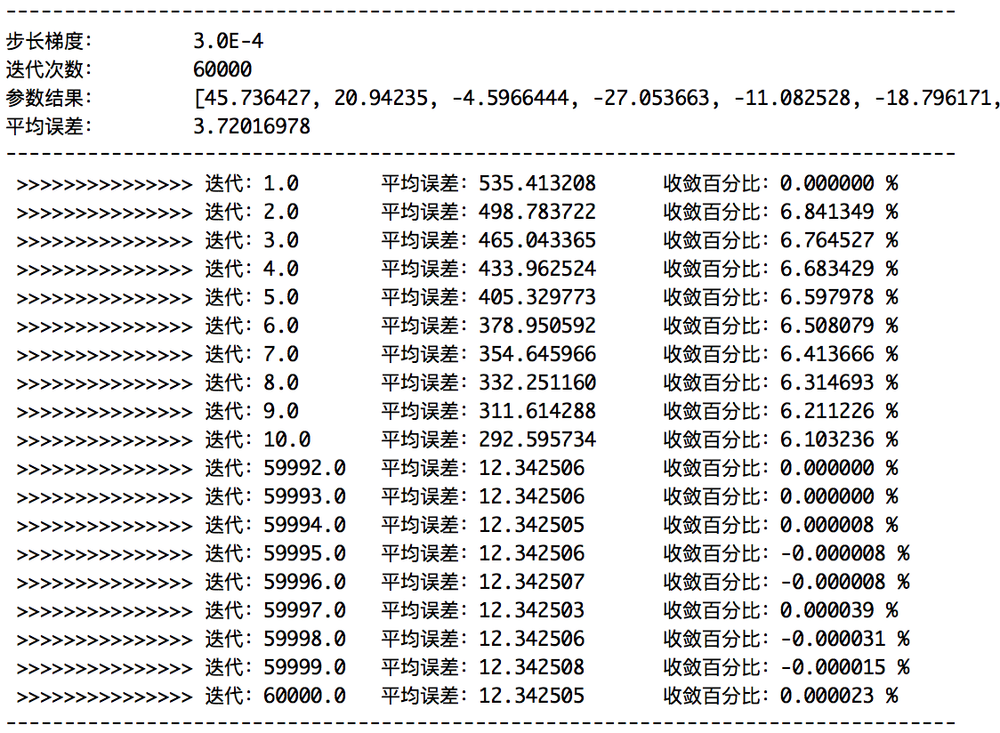

从图 4 中的监控输出可以看到，在迭代的后期，收敛百分比在正负值之间来回跳跃，这就出现了在一个点来回跨越，无法收敛的情况。要避免这种情况，就需要减小步长。

### 测试与监控

经过多次训练与调整，将超参数设置为如下代码清单 12 中所示值，得到一个比较满意的解：

##### 清单 12\. 合适的训练参数

```
LR.train(new float[]{1,1,1, 1,1,1, 1,1,1}, 0.00003f, 130000);

```

Show moreShow more icon

训练后的监控输出如下图 5 所示：

##### 图 5\. 监控输出

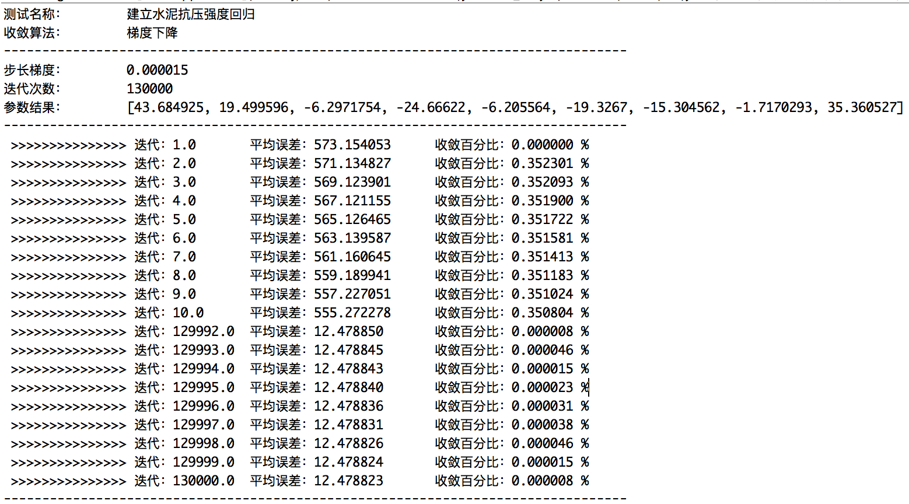

从图 5 的输出中可以看出，随着迭代的不断进行，误差值在逐渐收敛并且趋近于一个固定的值，收敛的过程如下图 6 的 收敛曲线所示，迭代到最后误差值逐渐成为一条水平线，不再下降：

##### 图 6\. 收敛曲线

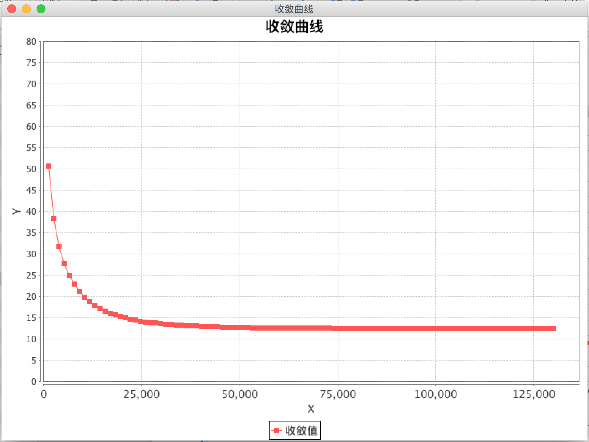

最终得到了一组比较满意的模型的参数：

[43.684925, 19.499596, -6.2971754, -24.66622, -6.205564, -19.3267, -15.304562, -1.7170293, 35.360527]

其中第一列是 0 参数 b ，接下来是水泥配料中的每个特征的参数，对应到我们的线性回归公式，则预测水泥质量的线性回归模型公式可写为：

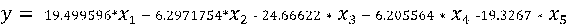

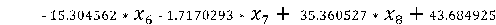

下面的图 7 显示了使用测试数据的预测值与实际值对比效果：

##### 图 7\. 预测值与实际值对比曲线

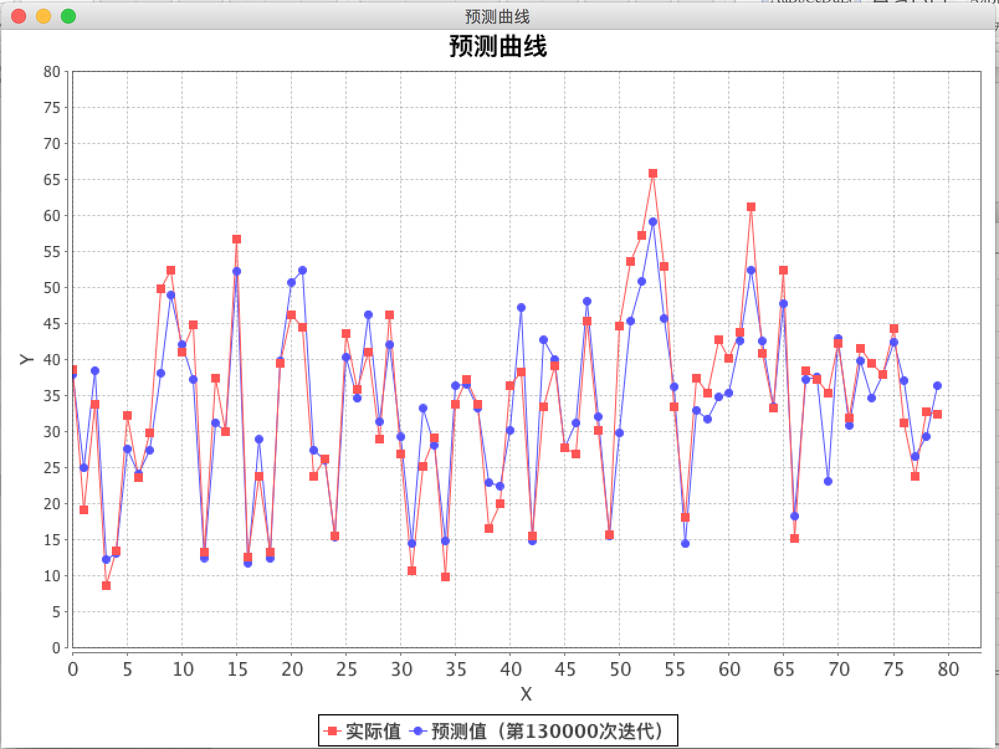

红色点为测试数据的实际值，蓝色点为用测试数据带入公式后算出的值，可以看到两种颜色连成的点的曲线距离基本在一定的误差范围内，能够近似模拟和预测水泥的质量。

## 结束语

模型不是一成不变的，模型与数据所对应的实际产生环境有密切关系，如水泥配料的增加更改，或者地理环境的变化等，这个时候就需要考虑将这些因素考虑到模型中，或者考虑通过正则化处理一些不重要的属性，本文就不再敖述。

本文通过机器学习中的最基本算法线性回归得到了一个水泥质量预测模型，其中还有一些不足和可以改进的地方，比如算法代码实现与精度、自动结束迭代得到最优结果和测试数据的选择等很多地方都不足。欢迎读者批评指正，谢谢。本文仅代表作者个人观点。

数据来源：

I-Cheng Yeh, “Modeling of strength of high performance concrete using artificial neural networks,” Cement and Concrete Research, Vol.28, No.12, pp.1797-1808 (1998).

## 参考资源

- 参考 [斯坦福大学机器学习课程](https://www.coursera.org/learn/machine-learning) ，查看更多线性回归以及机器学习的内容。
- 参考 [水泥研究数据](http://archive.ics.uci.edu/ml/datasets/Concrete+Compressive+Strength) ，了解更多关数据的内容。

## 下载

[linear\_regression\_demo.zip](/developerworks/cn/analytics/library/ba-lo-machine-learning-cement-quality/linear_regression_demo.zip): 样例代码