# 使用逻辑回归帮助诊断心脏病
机器学习代码实战

**标签:** 机器学习

[原文链接](https://developer.ibm.com/zh/articles/ba-lo-ml-use-logistic-regression/)

杜 可

发布: 2018-12-13

* * *

## 概述

本文向读者介绍逻辑回归的基本概念，以及使用逻辑回归来学习患者病理数据来建立心脏病预测模型。在上一篇文章 [《机器学习代码实战：使用线性回归检测水泥质量》](https://www.ibm.com/developerworks/cn/analytics/library/ba-lo-machine-learning-cement-quality/index.html) 中，已经向读者介绍了算法线性回归和使用实例，以及回归、最小二乘法和梯度下降等概念，本文在上篇文章的基础上，介绍逻辑回归，它是一种广义的线性回归，它能解决很多二分类问题，例如某些疾病的预测中，根据大量现有数据（比如患者的身体检查指标、血液指标和 X 光片等）建立模型，能够根据患者数据来预测患有某种疾病的概率。本文中涉及到与文章 [《机器学习代码实战：使用线性回归检测水泥质量》](https://www.ibm.com/developerworks/cn/analytics/library/ba-lo-machine-learning-cement-quality/index.html) 重复的概念和代码将不再重复阐述。

## 本文应用场景

本文将使用一批患者的心脏检查样本数据（附件中的 StatlogHeart.csv 文件），让程序学习这些样本数据，来得到一个较好的心脏病预测模型。下面的表 1 中摘取了一小部分这些患者心脏检查样本数据：

##### 表 1\. 部分患者心脏检查样本数据

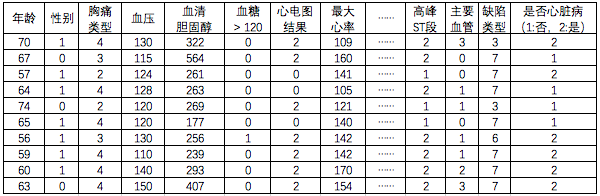

在表 1 中，每行是一个样本，除最后一列外，前面的列都是患者的相关检查数据，最后一列是医生检查结果，1 代表无心脏病，2 代表患有心脏病，我们要让机器学习这些样本后得到一个模型，这个模型可以输入样本表格之外的数据，预测出患者是否会患有心脏病及其概率大小。有很多实现这样的二分类预测的模型算法，如逻辑回归、支持向量机和神经网络等，本文通过比较基本的逻辑回归算法来实现，后续文章中会介绍通过神经网络等算法来解决稍微复杂的问题。

## 逻辑回归简介

首先我们简单介绍下逻辑回归（Logistic Regression），逻辑回归是机器学习中一个非常常见的模型，在实际生产环境中也会经常被使用，常用于数据挖掘、疾病自动诊断和经济预测等领域。例如，探讨引发疾病的危险因素，并根据危险因素预测疾病发生的概率等。逻辑回归最常用于分类，主要用于两分类问题（即输出只有两种，分别代表两个类别）,并且能够指明每个分类事件发生的概率。通过表 1 的数据，我们的目标是建立一个逻辑回归模型，如下图 1 所示：

##### 图 1\. 逻辑回归

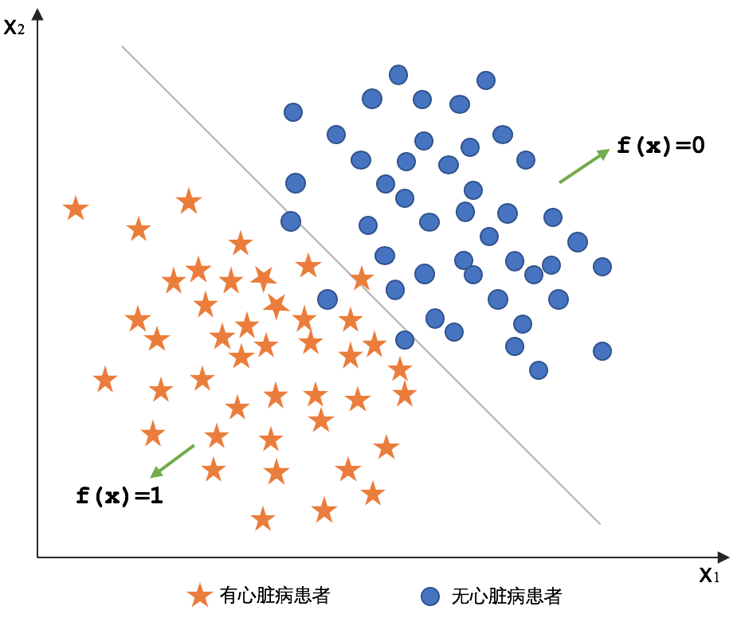

当输入患者的心脏检查数据 x，能够预测其是否患有心脏病及其概率，假设其模型公式为 y = f(x)，则对于逻辑回归，通过函数 f 运算后，y 应该是一个介于 0 和 1 之间的值，越趋于 1，则可能是有心脏病的，并且其对应的 y 值就是发生的概率，反之越趋于 0，则是没有心脏病的事件发生的概率大。

## 建立逻辑回归模型的步骤

我们按照以下三个基本步骤，来分析和建立逻辑回归模型：

1. 构造假设函数（即 H 函数）
2. 构造损失函数（即 J 函数）
3. 通过某种方法使得损失函数最小，并求得此时的参数θ

### 构造假设函数

我们的目标是类似预测心脏病发生的概率这样的二分类模型，即要么发生（发生概率趋于 1），要么不发生（发生概率趋于 0）。Sigmoid 函数就能很好的实现这个目的，Sigmoid 函数形式为：

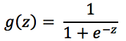

这个函数的图形如下图 2 所示，是一个 S 型曲线，随着自变量 z 的变化，因变量 g 的值在 0 到 1 之间。

##### 图 2\. Sigmoid 函数曲线

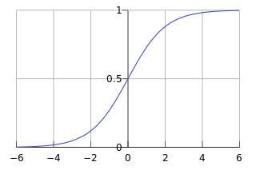

Sigmoid 函数将输入 z 转化为一个 0 到 1 之间的数，正好对应为概率的值，g(z)越趋近于 1，表示结果为 1 的概率越大，且概率值就等于 g(z)，反之，当 g(z)越趋近于 0，表示结果为 0 的概率越大，且概率值等于 1- g(z)。有了 Sigmoid 函数，我们可以构造预测函数了，在上一篇文章 [《机器学习代码实战：使用线性回归检测水泥质量》](https://www.ibm.com/developerworks/cn/analytics/library/ba-lo-machine-learning-cement-quality/index.html) 中，我们介绍了有多个自变量的线性回归的公式可表示为：

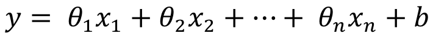

而本文介绍的逻辑回归，同样有多个自变量 x，即患者的各项检查数据，以及一个偏移量 b，但由于要实现二分类，不能像线性回归那样直接将 x 与参数θ的点积作为结果，而是将点积作为自变量带入到 Sigmoid 函数中计算出 y 值，则计算出的结果为 0 到 1 之间的数，即概率的值。将偏移量 b 合并到参数θ中用

[回归](https://developer.ibm.com/developer/default/articles/ba-lo-ml-use-logistic-regression/images/image006.png) 表示，并且多加一个对应的自变量

[回归](https://developer.ibm.com/developer/default/articles/ba-lo-ml-use-logistic-regression/images/image007.png)(

[回归](https://developer.ibm.com/developer/default/articles/ba-lo-ml-use-logistic-regression/images/image007.png) 恒等于 1)，则自变量 x 与参数θ用向量分别表示为：

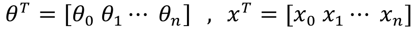

那么，逻辑回归的假设函数为：

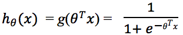

这个假设函数就是我们的模型函数了，我们希望有一组参数θ，带入到这个模型后，使得输入的样本 x 经过计算后，得到的结果尽可能的趋近于实际结果 y 的值（1 或者 0），为了使这个模型预测的概率尽量准确，接下来要构造损失函数来计算模型预测的准确性。

### 构造损失函数

线性回归中我们使用了最小二乘法来构造损失函数，在逻辑回归中道理类似，我们期望通过假设函数计算后的结果与实际结果值（1 或者 0）尽可能的接近，则该假设函数的参数就是我们想要的一组参数。而与实际结果值越接近，就代表值为 1 或者 0 的概率应该尽量最大，所以将问题转化为概率来讨论，上面的假设函数 h 的值即表示结果取 1 的概率，对于结果为 1 和 0 的概率分别为：

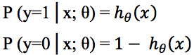

将这两个公式合二为一：

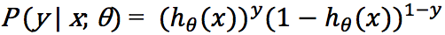

这里将两个公式合二为一非常巧妙，使得原本要求 2 个概率的问题转变为只需求 1 个概率，这样能简化后续的计算。如前所述，我们要求一组参数θ使得概率 P 最大，而 [似然函数](https://baike.baidu.com/item/似然函数/6011241?fr=aladdin) 就用来求参数θ的，所以对上述公式取似然函数就得到一个初始的损失函数：

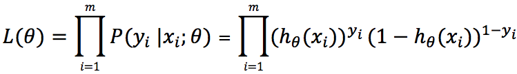

为了在简便后续求导的过程，再对上述公式取对数似然函数，这不会影响计算结果：

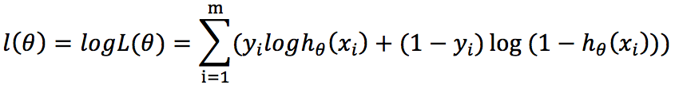

则最终的损失函数为：

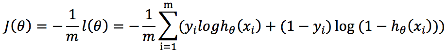

这里的 J(θ)就是最终的损失函数，与线性回归的区别是，这里是要求θ，使得 J(θ)即概率最大。对于曲线的极值，通过求偏导数为 0 解出θ。通过这个函数对所有样本进行计算，得到一个概率 J(θ)，这个概率也称为损失。如前文所说，我们要让这个概率值尽量最大能得到模型公式最好的一组参数，也就是求 max J(θ)。

### 梯度下降求θ

在前篇文章 [《机器学习代码实战：使用线性回归检测水泥质量》](https://www.ibm.com/developerworks/cn/analytics/library/ba-lo-machine-learning-cement-quality/index.html) 中已经介绍了梯度下降（Gradient Descent），在逻辑回归中，我们同样可以使用梯度下降来求解最优的一组θ。具体方法，就是对上面公式 J(θ)中的参数求偏导数，得到这个参数对应维度最陡峭的方向，在乘以一个步长 a，就求出每次参数移动的大小：

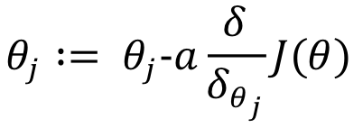

完成上述公式的求导，最终得到每次迭代的参数更新公式：

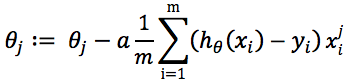

其中，设 m 为样本条数，n 为每条样本的特征数，并且 0≤i≤m, 0≤j≤n。

公式中的 a 称为 **步长** 或者 **学习率** ，要注意几点：

1. 每次迭代只对参数有比较小的更新，要经过多次迭代才能得到最终理想的参数。
2. 如果步长太大，可能会在最低点附近徘徊，所以训练模型的时候要注意调整步长。
3. 这个方法让你走到的不一定是整个曲面的最低点，可能只是局部最小，所以往往要考虑起点。

### 向量化计算

我们的迭代公式每次只求出一个参数的更新值，向量化计算是为了使计算更加快捷，使用向量运算的方式计算梯度与新的参数，每一次迭代，可以求出所有新参数值。逻辑回归的向量化计算与线性回归向量化计算的公式推导非常类似，读者可以参考前篇文章 [《机器学习代码实战：使用线性回归检测水泥质量》](https://www.ibm.com/developerworks/cn/analytics/library/ba-lo-machine-learning-cement-quality/index.html) 中的向量化计算章节了解，本文只给出关键公式。 设列向量 A 和列向量 E 分别为：

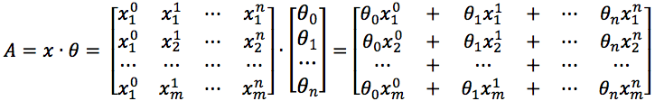


则参数θ的向量化更新步骤为：

1.求

[构造损失函数215](https://developer.ibm.com/developer/default/articles/ba-lo-ml-use-logistic-regression/images/image019.png)

2.求

[构造损失函数216](https://developer.ibm.com/developer/default/articles/ba-lo-ml-use-logistic-regression/images/image020.png)

3.求

[构造损失函数217](https://developer.ibm.com/developer/default/articles/ba-lo-ml-use-logistic-regression/images/image021.png)（

[构造损失函数217](https://developer.ibm.com/developer/default/articles/ba-lo-ml-use-logistic-regression/images/image022.png) 表示矩阵 x 的转置矩阵）

这里的更新步骤和线性回归的参数更新很相似，唯一的区别在第二步中，将 A 带入 Sigmoid 函数 g 中。后面我们的代码就用以上步骤来实现参数的更新。

## 模型的代码实现

本章节通过教读者自己编写代码实现一个逻辑回归模型，使读者能够更好理解机器学习中一些关键点，如参数选择的重要性，以及为什么一个逻辑回归模型也要经过大量迭代计算。代码使用最常用的 Java 语言来实现。和前篇文章 [《机器学习代码实战：使用线性回归检测水泥质量》](https://www.ibm.com/developerworks/cn/analytics/library/ba-lo-machine-learning-cement-quality/index.html) 一样，首先要实现如下矩阵运算，如清单 1 所示：

#### 清单 1\. 定义矩阵运算函数

```
// 矩阵乘积: 左矩阵 * 右矩阵
public static float[][] times(float[][] left, float[][] right)

// 常数 a 与矩阵乘积: a * 矩阵
public static float[][] times(float a, float[][] matrix)

// 矩阵相加: 左矩阵 + 乘数 * 右矩阵
public static float[][] add(float[][] left, float multiplier, float[][] right)

// 转置矩阵
public static float[][] transpose(float[][] matrix)

// 计算数量积
public static float dotProduct(float[] left, float[] right)

// 计算行列式的值
public static float detValue(float[][] det)

// 提取矩阵的余子式
public static float[][] cofactor(float[][] matrix, int row, int col, float[][] result)

// 提取伴随矩阵 adjointMatrix
public static float[][] adjointMatrix(float[][] matrix)

```

Show moreShow more icon

具体代码请下载本文的代码包附件中的 Matrix 类。

### 准备数据

数据准备的过程要提取、加工数据，从而将数据处理成模型可以使用的格式。我们的患者检查数据表存储在名为 StatlogHeart.csv 的文件中，每个属性值之间以逗号分隔，最后一个值为是否有心脏病诊断结果值（1 为正常，2 为患有心脏病）。如下图 3 中所示为该文件的一小部分：

##### 图 3\. 数据文件部分内容

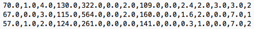

读取文件，并且将数据转化为矩阵格式，并且将特征缩放为一致的范围，关于读取的代码介绍和特征缩放的概念阐述，请详见前篇文章 [《机器学习代码实战：使用线性回归检测水泥质量》](https://www.ibm.com/developerworks/cn/analytics/library/ba-lo-machine-learning-cement-quality/index.html) ，下面的代码清单 2 中，是相关方法经过类的封装后的处理过程：

#### 清单 2.数据处理过程

```
// 数据文件
MatrixDataFile dataSource = new MatrixDataFile("/data/StatlogHeart.csv");
dataSource.featureScaling();

// 处理值数据
float[][] Y = dataSource.getY();
for(int i=0;i<Y.length;i++){
    Y[i][0] = (Y[i][0]==1) ? 0:1 ;
}

// 训练与测试数据集
ArrayList<float[][]> trainData = dataSource.getFirst(200);
ArrayList<float[][]> testData  = dataSource.getLast(100);

```

Show moreShow more icon

上面的代码中，我们看到要将结果值转化为 0 或 1 的值，而且请注意，训练数据与测试数据选取的行尽量不要重叠，否则会影响训练的效果。

### 模型训练

输入数据以及初始参数，让模型不停的通过梯度下降计算出新的参数，使得概率越来越接近真实值，也就是使误差越来越小的过程，直至其收敛到一个趋于固定的值后，得出最终一组参数，根据得到的参数带入模型，然后用测试数据验证模型，如果得到的误差不满意，则需要调整初始参数或者数据，继续上面的过程，直到得到满意的参数和测试数据误差为止。这个过程如果训练数据量很大，参数很多，则时间有可能会比较长，所以对于有非常多参数的数据或者复杂的模型如神经网络可能需要用到多台机器并行以及 GPU 卡加速等手段，加快训练速度。本例的参数数量和训练数据量不是很大，所以单机就可以比较快速的完成。在代码清单 3 中，是根据上面提到的向量化计算步骤的实现代码，代码中每次 for 循环，会输出一组误差比上次循环更小的参数值变量 parameters。

#### 清单 3\. 模型训练代码

```
// 中间矩阵 a * xT
a_times_xT = Matrix.times(this.alpha, xT);

// 迭代
for(int times= 0; times<iterationTimes; times++){
    // (1) 求 A = x * parameters;
    Matrix.times(x, parametersT, A);

    // (2) 求 E = g(A) - y
    Calculate.sigmoid(A, g);
    Matrix.add(g, -1, y, E);

    // (3) 求 parametersT := parametersT - a * xT * E
    Matrix.times(a_times_xT, E, a_times_xT_times_E);
    Matrix.add(parametersT, -1, a_times_xT_times_E, parametersT);
    ...
}

```

Show moreShow more icon

注意在第二步中，使用了 sigmoid 函数，这和线性回归训练的时候是不同的。

### 训练监控

每一次循环输出新的误差值、本次误差相比上次循环中误差缩小程度的百分比（即误差的收敛程度）等相关数据。我们将这些数据记录下来，可以输出为表格或者图形从而在训练的过程中进行分析。下面所示的代码清单 4 中，通过 LogicRegressionMonitor 类来显示监控输出结果通。

#### 清单 4.训练监控代码

```
testData.get(1));LogicRegressionMonitor monitor = new LogicRegressionMonitor();
monitor.showResult(LR,100,1.2);

```

Show moreShow more icon

### 测试模型

经过训练，得到最终一组参数 parameters 后，将参数带入模型公式，再用测试数据计算误差，误差越小则得出的参数越趋近于最优。如果对得到的参数不满意，则需要调整超参数再次进行训练，直到得到满意的一组参数为止。

## 模型训练实例

下面，让我们看看如何开始训练检查数据，得出一个模型来预测心脏病。

### 调超参数

超参数是在开始学习过程之前设置的参数，本例中主要是步长和迭代次数。

- 步长 :每次梯度下降移动的距离。步长太小，训练过程比较长，步长太大则可能会出现在一个凹点来回跨越的情况。
- 迭代次数：本例中手动设置迭代次数，次数过少，会拟合不充分，次数过多，则时间会比较长。

对于超参数，有时候我们可以先用小批量的数据迭代，搜索出比较好的超参数区间范围，然后再带入训练模型进行大批量数据训练，具体搜索方法不在本文讨论范畴，请读者参考相关文章。我们通过封装的 LogicRegression 类建立一个逻辑回归模型，train 方法输入θ的初始值和上面 2 个超参数并且开始训练，如下面代码清单 5。

#### 清单 5\. 输入参数开始训练

```
// 建立模型开始训练
LogicRegression LR = new LogicRegression();
LR.setXY(trainData.get(0),trainData.get(1));
LR.train(new float[]{1,1,1,1,1,  1,1,1,1,1,  1,1,1,  1}, 0.0015f, 2000);

```

Show moreShow more icon

对要通过训练得到的一组参数θ的初始值，我们可以全部设置为 1。

### 测试与监控

经过多次训练与调整后，得到一组比较满意的参数，训练后的监控输出如下图 4 所示。

##### 图 4\. 监控输出

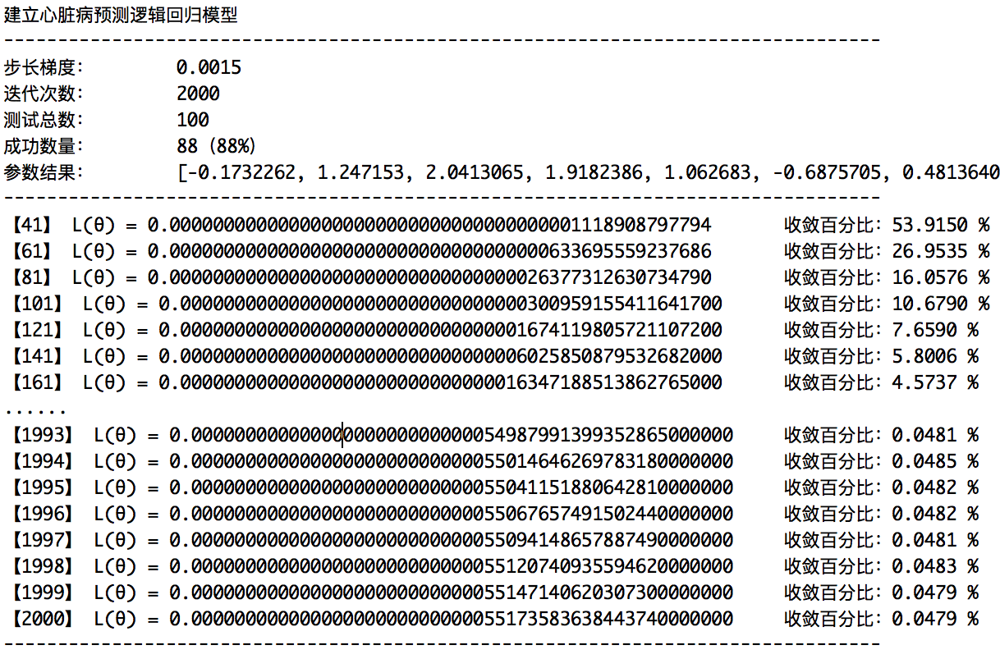

从图 3 的输出中可以看出，随着迭代的不断进行，损失函数 L(θ)的值在逐渐增大，即不断更新的参数带入模型后，预测的概率越来越接近真实值，而且前后两次训练的结果差异逐渐缩小收敛，并且差值百分比趋近于一个固定的值，收敛的过程如下图 5 的收敛曲线所示，迭代到最后误差值逐渐成为一条水平线，不再下降：

##### 图 5\. 收敛曲线

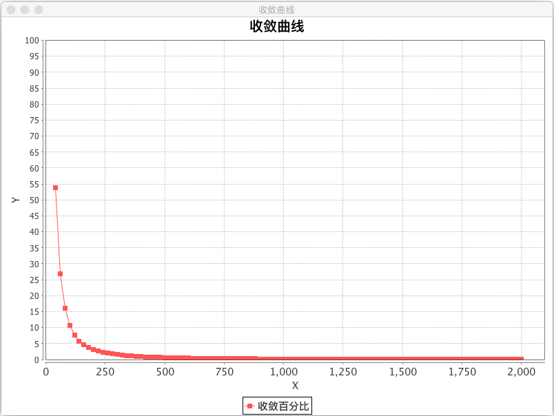

最终得到了一组比较满意的模型的参数： [-0.1732262, 1.247153, 2.0413065, 1.9182386, 1.062683, -0.6875705, 0.48136407, -1.7114192, 0.86453587, 1.7943255, 0.70586383, 3.6919918, 1.4430027, -1.274113]

其中第一列是 0 参数 b，接下来是患者检查数据中的每个特征的参数，对应到我们的逻辑回归公式中的各个θ值，可以通过这组参数，建立出预测心脏病预测得到模型，当预测的结果值高时，则患者患有心脏病的概率就高。下面的图 6 显示了使用这组参数和测试数据的预测值与实际值对比效果。

##### 图 6\. 预测值与实际值对比曲线


红色点为实际患有心脏病的患者数据带入模型后的预测结果，蓝色点为无心脏病的患者数据带入模型后的计算结果，可以看出，患有心脏病的患者的红色点大部分落在了 S 曲线的趋近 1 的一端，而无心脏病的患者的点趋近 0 的一端，由于机器学习误差的存在，只有一小部分红色点在曲线中下端，但总体来讲基本在一定的误差范围内，绝大部分点都正确落在了 S 曲线上相应的位置，能够近似预测心脏病的概率。

## 结束语

本文介绍了如何利用逻辑回归来帮助预测心脏病，逻辑回归适合二分类问题，速度也比较快，总的来讲，逻辑回归模型和训练与线性回归很类似，都是通过梯度下降法，经过多次迭代求得模型的参数，而逻辑回归为了实现二分类的应用了 Sigmoid 函数以及概率论。还有很多多个分类的问题，则需要利用其它模型如决策树、神经网络等，在以后的文章中再做介绍。本文介绍的模型也不是一成不变的，模型与数据所对应的实际产生环境有密切关系，如患者数据的多样化，新技术的应用等，这个时候就需要考虑将这些因素考虑到模型中，或者考虑通过正则化处理一些不重要的属性，本文就不再敖述。

本文还有一些不足和可以改进的地方，比如算法代码实现与精度、自动结束迭代得到最优结果和测试数据的选择等很多地方都不足。欢迎读者批评指正，谢谢。本文仅代表笔者个人观点。

数据来源： [UCI Machine Learning Repository](http://archive.ics.uci.edu/ml). Irvine, CA: University of California, School of Information and Computer Science.

## 参考资源

- 参考 [斯坦福大学机器学习课程](https://www.coursera.org/learn/machine-learning) ，查看更多逻辑回归以及机器学习的内容。
- 参考  《机器学习代码实战：使用线性回归检测水泥质量》，查看关于线性回归的内容。
- 参考 [心脏病研究数据](http://archive.ics.uci.edu/ml/datasets/Statlog+%28Heart%29) ，了解更多关数据的内容。