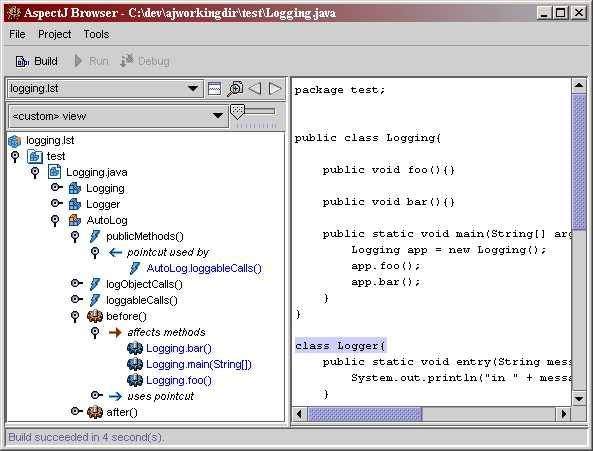

# 使用面向 Aspect 的编程改进模块性
AspectJ 给 Java 语言带来了 AOP

**标签:** Java

[原文链接](https://developer.ibm.com/zh/articles/j-aspectj/)

Nicholas Lesiecki

发布: 2002-01-07

* * *

人们认识到，传统的程序经常表现出一些不能自然地适合单个程序模块或者几个紧密相关的程序模块的行为，因此面向 Aspect 的编程（AOP）应运而生。Aspect 的先驱将这种行为称为 _横切_ ，因为它跨越了给定编程模型中的典型职责界限。例如，在面向对象的编程中，模块性的天然单位是类，横切关系是一种跨越多个类的关系。典型横切关系包括日志记录、对上下文敏感的错误处理、性能优化以及设计模式。

如果使用过用于横切关系的代码，您就会知道缺乏模块性所带来的问题。因为横切行为的实现是分散的，开发人员发现这种行为难以作逻辑思维、实现和更改。例如，用于日志记录的代码和主要用于其它职责的代码缠绕在一起。根据所解决的问题的复杂程度和作用域的不同，所引起的混乱可大可小。更改一个应用程序的日志记录策略可能涉及数百次编辑 ― 即使可行，这也是个令人头疼的任务。与之形成对比的是面向 Aspect 的编程的基本案例之一。在标题为” Aspect-Oriented Programming ”的文章中，一些 AspectJ 作者谈到了性能优化，传统技术可以将程序从 768 行扩充到 35,213 行。用面向 Aspect 技术重写后，代码缩回到 1,039 行，并保持了大多数性能优点。

AOP 通过促进另一种模块性补充了面向对象的编程，该模块性将横切关系广泛分布的实现聚拢到一个单元。这种单元称为 _Aspect，_ 这就是名称面向 Aspect 的编程的来历。通过划分 Aspect 代码，横切关系变得容易处理。可以在编译时更改、插入或除去系统的 Aspect，甚至重用系统的 Aspect。

## 通过示例学习

为了获得对面向 Aspect 的编程更好的感性认识，让我们看一看来自 Xerox PARC 的面向 Aspect 的 Java 编程语言扩展 ― AspectJ。在示例中，将使用 AspectJ 来做日志记录。示例是从开放源码 Cactus 框架中抽取出来的，它简化了服务器端 Java 组件的测试。框架的贡献者决定通过对框架内的所有方法调用进行跟踪来辅助调试。Cactus 的 1.2 版本没有使用 AspectJ 编写，典型方法如下列清单 1 中所示：

##### 清单 1\. 日志调用手工插入到每个方法中

```
public void doGet(JspImplicitObjects theObjects) throws ServletException
{
logger.entry("doGet(...)");
JspTestController controller = new JspTestController();
controller.handleRequest(theObjects);
logger.exit("doGet");
}

```

Show moreShow more icon

作为该项目代码约定的一部分，要求每个开发人员将这几行代码插入到他或她所编写的任何方法中。还要求开发人员记录每个方法的参数。如果没有对部分项目监督进行详尽的代码复查，就很难履行这种约定。在 1.2 版本中，大约有 80 个单独的记录日志调用分布在 15 个类中。在框架的 1.3 版本中，用单一 Aspect 代替了这 80 多个调用，该 Aspect 自动记录参数和返回值以及方法入口和出口。清单 2 包含了这个 Aspect 的一个作了很大简化的版本（例如，我省略了参数和返回值日志记录）。

##### 清单 2\. 自动应用于每个方法的记录日志调用

```
public aspect AutoLog{

pointcut publicMethods() : execution(public * org.apache.cactus..*(..));
pointcut logObjectCalls() :
    execution(* Logger.*(..));

pointcut loggableCalls() : publicMethods() && ! logObjectCalls();

before() : loggableCalls(){
    Logger.entry(thisJoinPoint.getSignature().toString());
}

after() : loggableCalls(){
    Logger.exit(thisJoinPoint.getSignature().toString());
}
}

```

Show moreShow more icon

让我们分解示例并研究 Aspect 做了什么。您将注意到的第一件事是 Aspect 的声明。Aspect 声明类似于类声明，它们都定义 Java 类型，就象类所做的那样。除了其声明以外，该 Aspect 还包含 _Pointcut_ 和 _Advice_ 。

### Pointcut 和 join point

要理解 Pointcut，必需知道 _join point_ 是什么。join point 表示在程序执行中明确定义的点。AspectJ 中典型的 join point 包括方法调用、对类成员的访问以及异常处理程序块的执行。join point 可以包含其它 join point。例如，一个方法调用可能在它返回之前引起其它方法调用。那么，Pointcut 就是一种语言构造，这种构造根据已定义的标准挑选一组 join point。示例中的第一个 Pointcut 称为 `publicMethods` ，选择 `org.apache.cactus` 包中的所有公用（public）方法的执行。 `execution` 是一个原始的 Pointcut（就象 `int` 是一种原始的 Java 类型）。它选择与其括号中定义的方法说明匹配的任何方法的执行。方法说明允许包含通配符；示例中的一个方法说明包含了几个通配符。第二个名为 `logObjectCalls` 的 Pointcut 选择了 `Logger` 类中的所有方法的执行。第三个 Pointcut `loggableCalls` ，通过使用 `&& !` 合并了前两个 Pointcut，这意味着它选择了除 `Logger` 类中的公用方法以外， `org.apache.cactus` 中所有的公用方法。（记录 log 方法将导致无限递归。）

### Advice

既然 Aspect 已经定义了它应该记录的点，它使用 Advice 来完成实际的日志记录。Advice 是在 join point 之前、之后或周围执行的代码。相对于 Pointcut 来定义 Advice，说类似于”在想要记录的每个方法调用之后运行这些代码”这样的话。因此 Advice 如下：

```
before() : loggableCalls(){
    Logger.entry(thisJoinPoint.getSignature().toString());
}

```

Show moreShow more icon

Advice 使用 `Logger` 类，其入口和出口方法类似于下列代码：

```
public static void entry(String message){
System.out.println("entering method " + message);
}

```

Show moreShow more icon

在示例中，传递到记录器的 `String` 是从 `thisJoinPoint` 派生的，这是一个特殊的反射对象，它允许访问 join point 执行所处的运行时上下文。在 Cactus 实际使用的 Aspect 中，Advice 使用这种对象来检索传递到每个记录的方法调用中的方法参数。当日志记录 Aspect 应用于代码时，方法调用的结果如下：

##### 清单 3\. AutoLog Aspect 的输出

```
entering method: void test.Logging.main(String[])
entering method: void test.Logging.foo()
exiting method: void test.Logging.foo()
exiting method: void test.Logging.main(String[])

```

Show moreShow more icon

##### Around Advice

Cactus 示例定义了 `before()`和 `after()`Advice。第三种 Advice 名称是 `around()`，给予 Aspect 的编写者一个机会来影响是否以及何时使用特殊 `proceed()`语法执行 join point。下列（有点一般）Advice 是否执行 `Hello`类中的 `say`方法是随机的：

` void around(): call(public void Hello.say()){  if(Math.random() > .5){  proceed();//go ahead with the method call  }  else{  System.out.println("Fate is not on your side.");  }  } `

## 使用 AspectJ 进行开发

既然您已经对 Aspect 代码的形式特征有了更好的感性认识，让我们暂时把注意力转移到编写 Aspect 的工作上来吧。也就是说，让我们回答这个问题：”如何使上述代码起作用？”

要让 Aspect 影响正常的基于类的代码，必须将 Aspect 加入到它们要修改的代码中去。要使用 AspectJ 完成这个操作，必须使用 ajc 编译器来编译类和 Aspect 代码。ajc 既可以作为编译器也可以作为预编译器操作，生成有效的 .class 或 .java 文件，可以在任何标准 Java 环境（添加一个小的运行时 JAR）中编译和运行这些文件。

要使用 AspectJ 进行编译，将需要显式地指定希望在给定编译中包含的源文件（Aspect 和类）― ajc 不象 javac 那样简单地为相关导入模块搜索类路径。之所以这样做，是因为标准 Java 应用程序中的每个类都是相对分离的组件。为了正确操作，一个类只要求其直接引用的类的存在。Aspect 表示跨越多个类的行为的聚集。因此，需要将 AOP 程序作为一个单元来编译，而不能每次编译一个类。

通过指定包含在给定编译中的文件，您还可以在编译时插入或抽出系统的各种 Aspect。例如，通过在编译中包含或排除先前描述的日志记录 Aspect，应用程序构建器可以在 Cactus 框架中添加或除去方法跟踪。

##### AspectJ 是开放源码的

Xerox 使用”Mozilla 公共许可证”（Mozilla Public License）发布了 AspectJ。对于开放源码爱好者来说，这是个好消息。对于近期将要采用 AspectJ 的人来说，这也是个好消息：产品免费，如果您觉得发现了严重错误，您有权检查源代码。开放的代码库还意味着在上市之前，AspectJ 的源代码将得到有效的社会评审。

AspectJ 当前版本的一个重要限制是其编译器只能将 Aspect 加入到它拥有源代码的代码中。也就是说，不能使用 ajc 将 Advice 添加到预编译类中。AspectJ 团队认为这个限制只是暂时的，AspectJ 网站承诺未来的版本（正式版 2.0）将允许字节码的修改。

### 工具支持

AspectJ 发行版包含了几种开发工具。这预示着 AspectJ 将有美好的前景，因为它表明了那部分作者的一个重要承诺，使 AspectJ 对于开发人员将是友好的。对于面向 Aspect 的系统工具支持尤其重要，因为程序模块可能受到它们所未知的模块所影响。

随 AspectJ 一起发布的一个最重要的工具是图形结构浏览器，它展示了 Aspect 如何与其它系统组件交互。这个结构浏览器既可以作为流行的 IDE 的插件，也可以作为独立的工具。图 1 显示了先前讨论的日志记录示例的视图。

##### 图 1\. 随 AspectJ 一起提供的图形结构浏览器展示了（在其它事物中）AutoLog 建议了哪些方法



除了结构浏览器和核心编译器之外，您还可以从 AspectJ 网站下载一个 Aspect 支持的调试器、一个 javadoc 工具、一个 Ant 任务以及一个 Emacs 插件。

让我们返回到语言特性。

## 影响类结构：引入（Introduction）

Pointcut 和 Advice 允许影响程序的动态执行； _引入（Introduction）_ 允许修改程序的静态结构。使用引入（Introduction），Aspect 可以向类中添加新的方法和变量、声明一个类实现一个接口或将检查异常转换为未检查异常（unchecked exception）。

### 引入（Introduction）示例

假设您有一个表示持久存储的数据缓存的对象。要测量数据的”更新程度”，您可能决定向该对象添加时间戳记字段，以便容易地检测对象是否与后备存储器同步。然而，因为对象表示业务数据，就应该将这种机制性细节从对象中隔离。使用 AspectJ，可以用清单 4 中所显示的语法来向现有的类添加时间戳记：

##### 清单 4\. 向现有的类中添加变量和方法

```
public aspect Timestamp {
private long ValueObject.timestamp;
public long ValueObject.getTimestamp(){
      return timestamp;
}
public void ValueObject.timestamp(){
      //"this" refers to ValueObject class not Timestamp aspect
      this.timestamp = System.currentTimeMillis();
}
}

```

Show moreShow more icon

除了必须限定在哪个类上声明引入的方法和成员变量以外（因此是 `ValueObject.timestamp` ），声明引入的方法和成员变量几乎与声明常规类成员相同。

## 混合样式继承

AspectJ 允许向接口和类添加成员，允许按 C++ 方式中混合样式继承。如果您希望使清单 4 中的 Aspect 通用化（generalize）以便能够对各种对象重用时间戳记代码，可以定义一个称为 `TimestampedObject` 的接口，并使用引入（Introduction）来将相同成员和变量添加到接口而不是添加到具体类中，如清单 5 所示。

##### 清单 5\. 将行为添加到接口

```
public interface TimestampedObject {
    long getTimestamp();

    void timestamp();
}
//and
public aspect Timestamp {
    private long TimestampedObject.timestamp;
    public long TimestampedObject.getTimestamp(){
        return timestamp;
    }

    public void TimestampedObject.timestamp(){
        this.timestamp = System.currentTimeMillis();
    }
}

```

Show moreShow more icon

现在可以使用 `declare parents` 语法来促使 `ValueObject` 实现您的新接口了。 `declare parents` 和其它 AspectJ 类型表达一样，可以同时应用于多个类型：

```
declare parents: ValueObject || BigValueObject implements TimestampedObject;

```

Show moreShow more icon

既然已经定义了 `TimestampedObject` 支持的操作，当出现适当环境时，您可以使用 Pointcut 和 Advice 来自动更新时间戳记。我们将在下一节中涉及它，因为它说明了如何在 Advice 中访问上下文。

## 其它 AspectJ 特性

使用 Pointcut，您可以方便地定义环境，加上时间戳记的对象将在其中更新戳记。清单 6 中显示了 `Timestamp` 的补充，在对写方法的任何调用之后给对象加时间戳记：

##### 清单 6\. 在 Advice 中访问上下文

```
pointcut objectChanged(TimestampedObject object) :
             execution(public void TimestampedObject+.set*(..)) &&
             this(object);
/*TimestampedObject+ means any subclass of TimestampedObject*/
after(TimestampedObject object) :  objectChanged(object){
        object.timestamp();
}

```

Show moreShow more icon

请注意，Pointcut 定义了 `after()` Advice 使用的参数 ― 在本例中，是 `TimestampedObject` ― 在其上有一个写方法调用。 `this()` Pointcut 标识了所有 join point，其中所有当前执行的对象都属于括号中定义的类型。其它几种类型的值可以捆绑到 Advice 的参数中，包括方法参数、方法抛出的异常以及方法调用的目标。

### 定制编译错误

我发现定制编译错误是 AspectJ 最酷的特性之一。假如您希望隔离一个子系统，以使客户机代码必须通过中间媒介来访问工作程序对象（这种情况在 Facade 设计模式中出现）。使用 `declare error` 或 `declare warning` 语法，您可以定制 ajc 编译器对潜在 join point 的响应，如清单 7 所示。

##### 清单 7\. 定义定制错误

```
public aspect FacadeEnforcement {
pointcut notThruFacade() : within(Client) && call(public * Worker.*(..));

declare error : notThruFacade():
    "Clients may not use Worker objects directly.";
}

```

Show moreShow more icon

除了 ajc 在编译时彻底检测 `within` Pointcut 以外（大多数 Pointcut 可以根据运行时信息区别开来）， `within` Pointcut 类似于 `this()` 。

### 错误处理

我承认 Java 语言中检查异常（checked exception）的价值。然而，我经常希望有一个变通方法，类似于”将该异常转换为运行时异常”这样简单的命令。有很多次，我正在编写的方法不对异常作出有意义的响应 ― 并且有时该方法的潜在使用程序也不响应。我不希望废弃异常，但是我也不希望为了找到它而一直跟踪到它的所有调用者。有一些巧妙的方法使用 try/catch 块来完成这个任务，但是没有一种象 AspectJ 中的 `declare soft` 这样棒。清单 8 中所显示的类试图完成一些 SQL 任务。

##### 清单 8\. 一个具有检查异常的类

```
public class SqlAccess {

    private Connection conn;
    private Statement stmt;

    public void doUpdate(){
        conn = DriverManager.getConnection("url for testing purposes");
        stmt = conn.createStatement();
        stmt.execute("UPDATE ACCOUNTS SET BALANCE = 0");
    }

    public static void main(String[] args)throws Exception{
        new SqlAccess().doUpdate();
    }
}

```

Show moreShow more icon

如果我不使用 AspectJ 或在每个方法说明中声明异常，那么我将不得不插入 try/catch 块来处理已检出的 `SQLException` （几乎从 JDBC API 中的每个方法中抛出这个异常）。使用 AspectJ，我可以使用下列内部 Aspect 来将它作为 `org.aspectj.lang.SoftException` 自动重新抛出：

##### 清单 9\. soft 化异常

```
private static aspect exceptionHandling{
declare soft : SQLException : within(SqlAccess);

pointcut methodCall(SqlAccess accessor) : this(accessor)
    && call(* * SqlAccess.*(..));

after(SqlAccess accessor) : methodCall  (accessor){
    System.out.println("Closing connections.");
    if(accessor.stmt != null){
        accessor.stmt.close();
    }
    if(accessor.conn != null){
        accessor.conn.close();
    }
}
}

```

Show moreShow more icon

无论 `SQLAccess` 类中的每个方法是抛出异常还是正常返回，Pointcut 和 Advice 都关闭其后的连接和语句。为每个方法都使用一个错误处理 Aspect 也许有点矫枉过正，但是如果将要添加使用该连接和语句的任何其它方法，错误处理策略也将应用于它们。这种对新代码自动应用 Aspect 的特性是 AOP 关键的主要优势之一：新代码的作者不必为加入横切行为而了解它们。

## 结束语

AspectJ 是否值得使用？ Grady Booch 将面向 Aspect 的编程看作是标志软件设计和编写方法基础性转变的三大运动之一。（请在 参考资料 节中参阅他的”Through the Looking Glass”。）我赞同他的观点。AOP 解决了面向对象和其它过程性语言未能处理的一块问题空间。在最近几周我对 AspectJ 的介绍中，我发现它为那些我原以为是编程的基本极限的问题提供了一流的、可重用的解决方案。可以说 AOP 是从我开始使用对象以来的功能最强大的抽象。

当然，AspectJ 确实有一条学习曲线。和所有语言或语言扩展一样，在能够充分利用它的所有强大功能之前，您必需领会它的一些微妙之处。但是，学习曲线并不太陡峭 ― 在通读开发人员指南以及完成一些示例以后，我发现自己已经能够编写有用的 Aspect。AspectJ 给人的感觉是很自然，就好象它填补了您的编程知识缺陷而不是在一个新方向上的扩展。某些 AspectJ 工具还有些粗糙，但是我还没有遇到任何严重问题。

因为 AspectJ 具有对不可模块化的程序进行模块化的强大功能，我认为它值得立即使用。如果您的项目或公司还没有准备好在生产中使用 AspectJ，可以方便地将 AspectJ 应用于诸如调试和合同履行之类的开发事项。请注意一下这种语言扩展，这将对您有所帮助。