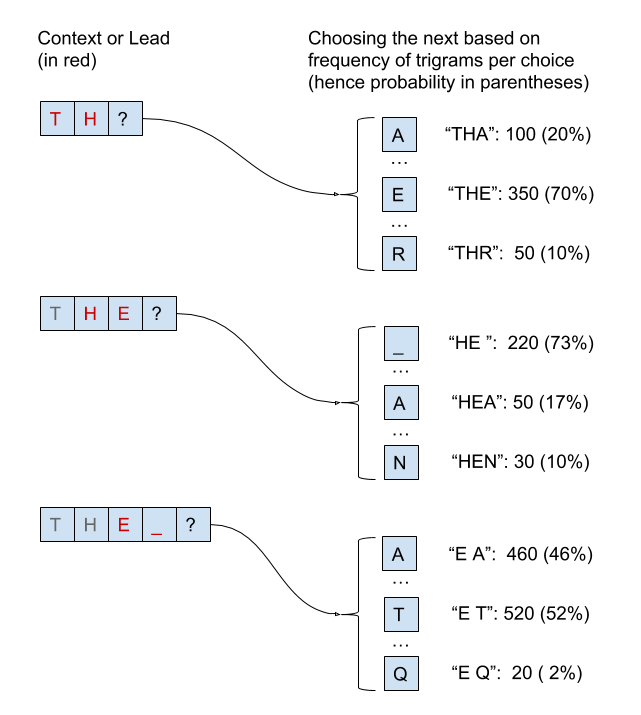
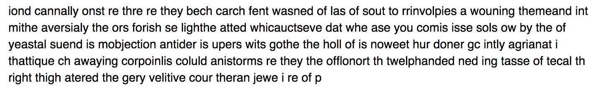
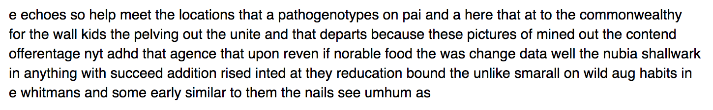
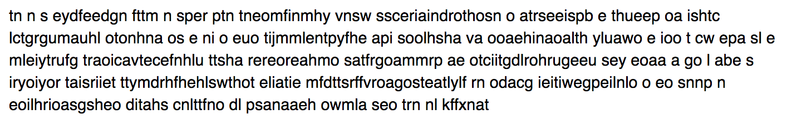
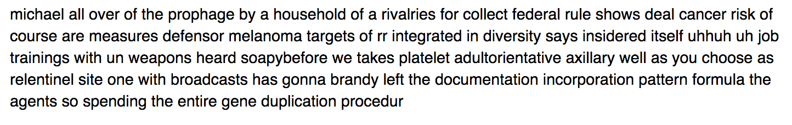
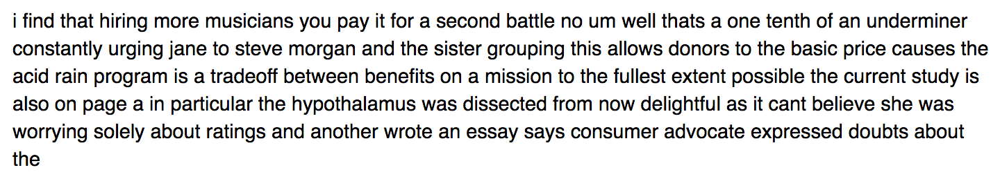
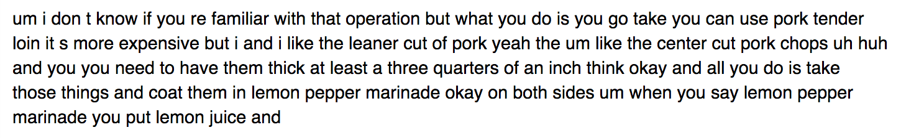

# 使用马尔可夫链通过字母相关矩阵和 N 元词生成语言
在单词级别对自然语言特征进行建模并生成频率图

**标签:** 人工智能

[原文链接](https://developer.ibm.com/zh/articles/cc-patterns-artificial-intelligence-part3/)

Uche Ogbuji

发布: 2018-06-04

* * *

在本系列的前两个教程中，我们研究了如何通过文本编译统计信息，尤其是特定字母或单词序列（即 N 元词）的频率 。在 [第 2 部分](https://www.ibm.com/developerworks/cn/cognitive/library/cc-patterns-artificial-intelligence-part2/index.html)，对于此类应用，我还演示了如何轻松获取丰富而全面的文本语料库。

回到 [第一部分](https://www.ibm.com/developerworks/cn/cognitive/library/cc-patterns-artificial-intelligence-part1/index.html) 中所作的比喻，假设您通过猴子使用打字机来生成文本，且打字机的装配方式是特定的，即猴子敲击特定键的概率与产生的 N 元词的预期频率相关联。例如，若打字机源自英语的三元词频率，猴子打出了 EQ，那接下来它打出 U 的概率应远远高于其他任何字母。

## 捕获 N 元词频率

我们可以借助随机数生成工具（可根据分布情况进行选择），通过代码模拟猴子敲击打字机上特定键的概率。首先，我们需要捕获目前为止生成的 N 元词，将其转变为一种可重用的形式。

以下代码是第 1 部分中代码的变体。它将计算的 N 元词频率写入文件。

##### store\_letter\_ngram\_counts.py

```
import sys
import json
from nltk.probability import FreqDist

from nltk.util import ngrams
from nltk.tokenize import RegexpTokenizer

#Set up a tokenizer that captures only lowercase letters and spaces
#This requires that input has been preprocessed to lowercase all letters
TOKENIZER = RegexpTokenizer("[a-z ]")

def count_ngrams(input_fp, frequencies, order, buffer_size=1024):
    '''Read the text content of a file and keep a running count of how often
    each bigram (sequence of two) characters appears.

    Arguments:
        input_fp -- file pointer with input text
        frequencies -- mapping from each bigram to its counted frequency
        buffer_size -- incremental quantity of text to be read at a time,
            in bytes (1024 if not otherwise specified)
        order -- The N in each N-gram (i.e. number of items)

    Returns:
        nothing
    '''
    #Read the first chunk of text, and set all letters to lowercase
    text = input_fp.read(buffer_size).lower()
    #Loop over the file while there is text to read
    while text:
        #This step is needed to collapse runs of space characters into one
        text = ' '.join(text.split())
        spans = TOKENIZER.span_tokenize(text)
        tokens = (text[begin : end] for (begin, end) in spans)
        for bigram in ngrams(tokens, order):
            #Increment the count for the bigram.Automatically handles any
            #bigram not seen before.The join expression turns 2 separate
            #single-character strings into one 2-character string
            if '  ' not in ''.join(bigram):
                frequencies[''.join(bigram)] += 1
        #Read the next chunk of text, and set all letters to lowercase
        text = input_fp.read(buffer_size).lower()

    return

if __name__ == '__main__':
    #Initialize the mapping
    frequencies = FreqDist()
    #The order of the ngrams is the first command line argument
    ngram_order = int(sys.argv[1])
    #Pull the input data from the console
    count_ngrams(sys.stdin, frequencies, ngram_order)
    outputfp = open(sys.argv[2], 'w')
    json.dump(dict(frequencies), outputfp)
    print('Stored frequencies of {} encountered N-grams.'.format(len(frequencies)))

```

Show moreShow more icon

如下所示运行该程序：

```
python store_letter_ngram_counts.py 3 oanc-trigrams.json < oanc.txt

```

Show moreShow more icon

由此生成 oanc-trigrams.json 文件，包含 JSON 格式的三元词频率。在本例中，它将遇到的不同 N 元词数量打印到控制台：

```
Stored frequencies of 15833 encountered N-grams.

```

Show moreShow more icon

我还生成了五元和七元词数据集，供以后使用。

```
python store_letter_ngram_counts.py 5 oanc-5grams.json < oanc.txt
python store_letter_ngram_counts.py 7 oanc-7grams.json < oanc.txt

```

Show moreShow more icon

## 操作打字机

现在到有趣的部分了。我们需要一个单独的程序从文件中读取 N 元词频率，并使用这些频率生成文本。这需要额外进行一些计算，确定一个字母在其他字母的已知序列之后出现的可能性。举个例子，使用三元词时，需要计算 E 出现在 TH 后面的频率，并与 A、Z 或任何其他字母出现在 TH 后面的频率作对比。牵涉到的逻辑可能有点混乱，所以，我想我应该利用一张图表展示这一过程中的几个简化步骤。



这些就是简化后的内容。首先，我们假设这一过程已经生成前导文本“TH”，只需弄清楚接下来出现的字母。 该图仅在每一步显示三个选项，而不是全部的 27 个选项（字母加空格）。它通过一些模拟频率来加以阐释。如果在训练模型中发现 100 个三元词“THA”的实例、350 个“THE”实例以及 50 个“THR”实例，遵照该模型，选择“E”作为下一个字母来完成“THE”三元词的概率为 70%。

在第二步，它选择了一个空格字符，出现概率为 73%。为清楚起见，本图表中的空格字符均标有下划线。

当然，在每一步中，这都是一个随机选择，并不总是挑选概率最高的项。在第三步中，挑选了出现概率非常低的“Q”来完成三元词“T Q”。假设继续像这样进行下去，就会出现以下句子：“THE QUICK BROWN FOX JUMPS OVER THE LAZY DOG”。

我希望您能了解文本生成的整个过程。

### 马尔可夫过程

这种文本生成方法就是所谓的马尔可夫过程或马尔可夫链的一个例子。在每个点上，上下文或线索（最近生成的两项）构成当前状态。转换到下一状态的方式可能有多种，根据其表示的 N 元词的频率选择其中之一。此时，新状态为线索中的最终项加生成的新项。

这种状态与根据概率的随机转换选择的结合就是马尔可夫过程。它是计算机科学领域一个非常重要的概念，但本教程对理论细节不做深入探讨。如果您有兴趣，我推荐阅读 [Setosa 直观形象的互动式讲解](http://setosa.io/ev/markov-chains/)。

## 动手实践

文本生成的基本过程很容易解释，但仍有许多棘手的方面，它们对于您选择的实现策略非常敏感。其中一个方面就涉及如何启动这一过程。初始状态是什么？在以上解释的三元词示例中，任意选择“TH”作为初始状态。您可以决定始终使用同一初始状态，理想情况下具有多种可能的三元词完成形式，但输出观察者就会注意到一开始的固定模式。

另一种可行策略是根据每个字母的总体频率，随机选择 N-1 个初始字符。以下代码使用该策略来生成文本。我已经添加了大量注释，帮助您完成操作。

##### generate\_letters\_strategy1.py

```
import sys
import json
import string
import random

population = ' ' + string.ascii_lowercase

def preprocess_frequencies(frequencies, order):
    '''Compile simple mapping from N-grams to frequencies into data structures to help compute
    the probability of state transitions to complete an N-gram

    Arguments:
        frequencies -- mapping from N-gram to frequency recorded in the training text
        order -- The N in each N-gram (i.e. number of items)

    Returns:
        sequencer -- Set of mappings from each N-1 sequence to the frequency of possible
            items completing it
        item_freqs -- individual frequency of each item in the training text
    '''
    sequencer = {}
    item_freqs = {}
    for ngram in frequencies:
        #Separate the N-1 lead of each N-gram from its item completions
        freq = frequencies[ngram]
        lead = ngram[:-1]
        final = ngram[-1]
        sequencer.setdefault(lead, {})
        sequencer[lead][final] = freq
        #Accumulate the overall frequency of each item
        for c in ngram:
            item_freqs.setdefault(c, 0)
            item_freqs[c] += freq
    return sequencer, item_freqs

def generate_letters(sequencer, item_freqs, length, order):
    '''Generate text based on probabilities derived from statistics for initializing
    and continuing sequences of letters

    Arguments:
        sequencer -- mapping from each leading sequence to frequencies of the next letter
        item_freqs -- mapping from each item to its overall frequency regardless of sequence
        length -- approximate number of characters to generate before ending the program
        order -- The N in each N-gram (i.e. number of items)

    Returns:
        nothing
    '''
    #The lead is the initial part of the N-Gram to be completed, of length N-1
    #containing the last N-1 items produced
    lead = ''
    #Keep track of how many items have been generated
    generated_count = 0
    #Turn item frequencies into weights for selection probability
    item_weights = [ item_freqs.get(c, 0) for c in population ]
    while generated_count < length:
        #This condition will be true until the initial lead N-gram is constructed
        #It will also be true if we get to a dead end where there are no stats
        #For the next item from the current lead
        if lead not in sequencer:
            #Returns a list, length 1.Extract that one item.
            chosen = random.choices(population, weights=item_weights)[0]
            #end='' prevents a newline from being printed after each letter
            #flush=True forces output to be displayed right away, not buffered
            print(chosen, end='', flush=True)
            #If needed to accommodate the new item, clip the first item from the lead
            if len(lead) == order:
                lead = lead[1:]
            #Tack on the new item
            lead += chosen
            generated_count += 1
        else:
            freq = sequencer[lead]
            weights = [ freq.get(c, 0) for c in population ]
            chosen = random.choices(population, weights=weights)[0]
            print(chosen, end='', flush=True)
            #Clip the first item from the lead and tack on the new item
            lead = lead[1:]+ chosen
            generated_count += 1

    return

if __name__ == '__main__':
    #File with N-gram frequencies is the first argument
    raw_freq_fp = open(sys.argv[1])
    length = int(sys.argv[2])
    raw_freqs = json.load(raw_freq_fp)

    #Figure out the N-gram order.Just pull the first N-gram and check its length
    order = len(next(iter(raw_freqs)))
    sequencer, item_freqs = preprocess_frequencies(raw_freqs, order)
    generate_letters(sequencer, item_freqs, length, order)

```

Show moreShow more icon

如下所示运行该程序：

```
python generate_letters_strategy1.py oanc-trigrams.json 500

```

Show moreShow more icon

第一个命令行参数是 N 元词的 JSON 文件，第二个参数是生成的文本序列长度。当然，每次得到的输出内容也都各不相同。第一次运行时，我得到了以下输出内容。



正如您所看到的，这看起来像是一种奇怪的英语拼凑，只有几个实际的单词，如“by the of”和“right thigh”。

### 策略的局限性

让我们一起来看看如何使用高阶 N 元词来改进结果。首个第五阶：

```
python generate_letters_strategy1.py oanc-5grams.json 500

```

Show moreShow more icon

第一次运行时，我得到了以下输出内容。



这太令人兴奋了。现在的输出毫无疑问是英语，偶尔还会出现华丽的词藻风格，一开始就会出现 “echoes so help meet the locations that a.” 这样的句子。

顺便说一句，您可能会注意到这期间进展缓慢。这是因为 N 元词阶数越高，初始化转换概率需要完成的工作也就越繁杂。这种效应与阶数呈指数关系，所以，利用七元词时，过程就会更加缓慢。幸运的是，最困难的过程只需完成一次，所以如果您的代码用于在长时间运行的会话中生成文本，那么只有在首次启动程序时会延缓进度。

不幸的是，只是偶然会出现类似英语的输出内容。第三次运行时，我得到了以下输出内容。



这次输出内容的连贯性甚至比基于三元词的例子更差。

很明显，这个问题在很大程度上与初始化策略有关。前两个字母“TN”经常用于初始选择中，但这种罕见的组合不能作为进一步发现五元词的线索，而且这一程序从未真正找到可启动的五元词的平衡状态。

## 全新初始化策略

如果没有随机选择单个字母进行初始化，而是保留了一个列表，例如，10000 个最常见的 N 元词，并且一开始总是会随机选择其中之一，情况会怎样？这样每次都会从一开始就有力地推动例程发展。

以下代码使用这一新策略来生成文本。突出显示了从先前列表更改的行。

##### generate\_letters\_strategy2.py

```
import sys
import json
import string
import random

POPULAR_NGRAM_COUNT = 10000

#Population is all the possible items that can be generated
population = ' ' + string.ascii_lowercase

def preprocess_frequencies(frequencies, order):
    '''Compile simple mapping from N-grams to frequencies into data structures to help compute
    the probability of state transitions to complete an N-gram

    Arguments:
        frequencies -- mapping from N-gram to frequency recorded in the training text
        order -- The N in each N-gram (i.e. number of items)

    Returns:
        sequencer -- Set of mappings from each N-1 sequence to the frequency of possible
            items completing it
        popular_ngrams -- list of most common N-grams
    '''
    sequencer = {}
    ngrams_sorted_by_freq = [
        k for k in sorted(frequencies, key=frequencies.get, reverse=True)
    ]
    popular_ngrams = ngrams_sorted_by_freq[:POPULAR_NGRAM_COUNT]
    for ngram in frequencies:
        #Separate the N-1 lead of each N-gram from its item completions
        freq = frequencies[ngram]
        lead = ngram[:-1]
        final = ngram[-1]
        sequencer.setdefault(lead, {})
        sequencer[lead][final] = freq
    return sequencer, popular_ngrams

def generate_letters(sequencer, popular_ngrams, length, order):
    '''Generate text based on probabilities derived from statistics for initializing
    and continuing sequences of letters

    Arguments:
        sequencer -- mapping from each leading sequence to frequencies of the next letter
        popular_ngrams -- list of the highest frequency N-Grams
        length -- approximate number of characters to generate before ending the program
        order -- The N in each N-gram (i.e. number of items)

    Returns:
        nothing
    '''
    #The lead is the initial part of the N-Gram to be completed, of length N-1
    #containing the last N-1 items produced
    lead = ''
    #Keep track of how many items have been generated
    generated_count = 0
    while generated_count < length:
        #This condition will be true until the initial lead N-gram is constructed
        #It will also be true if we get to a dead end where there are no stats
        #For the next item from the current lead
        if lead not in sequencer:
            #Pick an N-gram at random from the most popular
            reset = random.choice(popular_ngrams)
            #Drop the final item so that lead is N-1
            lead = reset[:-1]
            for item in lead:
                print(item, end='', flush=True)
            generated_count += len(lead)
        else:
            freq = sequencer[lead]
            weights = [ freq.get(c, 0) for c in population ]
            chosen = random.choices(population, weights=weights)[0]
            print(chosen, end='', flush=True)
            #Clip the first item from the lead and tack on the new item
            lead = lead[1:]+ chosen
            generated_count += 1

    return

if __name__ == '__main__':
    #File with N-gram frequencies is the first argument
    raw_freq_fp = open(sys.argv[1])
    length = int(sys.argv[2])
    raw_freqs = json.load(raw_freq_fp)

    #Figure out the N-gram order.Just pull the first N-gram and check its length
    order = len(next(iter(raw_freqs)))
    sequencer, popular_ngrams = preprocess_frequencies(raw_freqs, order)
    generate_letters(sequencer, popular_ngrams, length, order)

```

Show moreShow more icon

如下所示运行该程序：

```
python generate_letters_strategy2.py oanc-5grams.json 500

```

Show moreShow more icon

这一次，我运行了几十次程序，输出的结果和英语相差无几。

在这里，让我们一起看下基于七元词的文本生成器产生的具体内容。 以下显示了第一次的运行情况。



现在开始觉得一些内容应该可以看懂，只是不太连贯。结尾处的“left the documentation…”，感觉像是我们不熟悉领域的某种技术文本。

为了解其他许多可调整的内容，您可以考虑引入一个小的随机因素，程序将输出一个字母，而该字母并不基于训练语料库中的任何一个 N 元词。可以采用很多方法巧妙地调整这个基本的文本生成程序，从而改变其行为和特征。

## 准备使用单词

正如您从七元词输出示例中看到的，这一基于字母关联的文本生成具有一定的可懂度，在您开始以单词的粒度工作之前，真的很难发现存在的细小语言障碍。在 [第 2 部分](https://www.ibm.com/developerworks/cn/cognitive/library/cc-patterns-artificial-intelligence-part2/index.html)，我展示了如何收集单词相关统计信息。下面的代码存储统计信息，为单词生成做准备。

##### store\_word\_ngram\_counts.py

```
import sys
import json
from nltk.probability import FreqDist

from nltk.util import ngrams
from nltk.tokenize import RegexpTokenizer

#Set up a tokenizer that only captures words
#Requires that input has been preprocessed to lowercase all letters
TOKENIZER = RegexpTokenizer("[a-z]+")

def count_ngrams(input_fp, frequencies, order, buffer_size=1024):
    '''Read the text content of a file and keep a running count of how often
    each bigram (sequence of two) characters appears.

    Arguments:
        input_fp -- file pointer with input text
        frequencies -- mapping from each bigram to its counted frequency
        order -- The N in each N-gram (i.e. number of items)
        buffer_size -- incremental quantity of text to be read at a time,
            in bytes (1024 if not otherwise specified)

    Returns:
        nothing
    '''
    #Read the first chunk of text, and set all letters to lowercase
    text = input_fp.read(buffer_size).lower()
    #Loop over the file while there is text to read
    while text:
        #This step is needed to collapse runs of space characters into one
        text = ' '.join(text.split())
        spans = TOKENIZER.span_tokenize(text)
        tokens = (text[begin : end] for (begin, end) in spans)
        for ngram in ngrams(tokens, order):
            #Join ngrams into a single space separated string
            ngram_text = ' '.join(ngram)
            #Extra layer to make sure no multiple runs of spaces sneak through
            ngram_text = ' '.join(ngram_text.split())
            frequencies[ngram_text] += 1
        #Read the next chunk of text, and set all letters to lowercase
        text = input_fp.read(buffer_size).lower()

    return

if __name__ == '__main__':
    #Initialize the mapping
    frequencies = FreqDist()
    #The order of the ngrams is the first command-line argument
    ngram_order = int(sys.argv[1])
    #Pull the input data from the console
    count_ngrams(sys.stdin, frequencies, ngram_order)
    outputfp = open(sys.argv[2], 'w')
    json.dump(dict(frequencies), outputfp)
    print('Stored frequencies of {} encountered N-grams.'.format(len(frequencies)))

```

Show moreShow more icon

如下所示运行该程序：

```
python store_word_ngram_counts.py 3 oanc-3word-grams.json < oanc.txt

```

Show moreShow more icon

我还生成了五元和七元词数据集，供以后使用。

```
python store_word_ngram_counts.py 5 oanc-5word-grams.json < oanc.txt
python store_word_ngram_counts.py 7 oanc-7word-grams.json < oanc.txt

```

Show moreShow more icon

当在单词级别工作时，会发现更多不同的 N 元词：8,724,842 个三元词，13,467,874 个五元词和 13,897,093 个七元词。

## 生成单词的 N 元词文本

以下代码程序用于获取存储的统计信息，并使用它们来生成文本。

##### store\_word\_ngram\_counts.py

```
import sys
import json
import string
import random

POPULAR_NGRAM_COUNT = 10000

def preprocess_frequencies(frequencies, order):
    '''Compile simple mapping from N-grams to frequencies into data structures to help compute
    the probability of state transitions to complete an N-gram

    Arguments:
        frequencies -- mapping from N-gram to frequency recorded in the training text
        order -- The N in each N-gram (i.e. number of items)

    Returns:
        sequencer -- Set of mappings from each N-1 sequence to the frequency of possible
            items completing it
        popular_ngrams -- list of most common N-grams
        all_words -- list of all unique words that occur in the training text
    '''
    sequencer = {}
    ngrams_sorted_by_freq = [
        k for k in sorted(frequencies, key=frequencies.get, reverse=True)
    ]
    popular_ngrams = ngrams_sorted_by_freq[:POPULAR_NGRAM_COUNT]
    all_words = set()
    for ngram in frequencies:
        #Separate the N-1 lead of each N-gram from its item completions
        freq = frequencies[ngram]
        words = ngram.split()
        lead = words[:-1]
        final = words[-1]
        #A rule of Python means we must convert a list to a tuple before using it as
        #A mapping key
        sequencer.setdefault(tuple(lead), {})
        sequencer[tuple(lead)][final] = freq
        for word in words:
            all_words.add(word)
    #We used the set data structure to keep the words unique
    #But the way we need to use it, we must convert to list
    all_words = list(all_words)
    return sequencer, popular_ngrams, all_words

def generate_letters(sequencer, popular_ngrams, all_words, length, order):
    '''Generate text based on probabilities derived from statistics for initializing
    and continuing sequences of letters

    Arguments:
        sequencer -- mapping from each leading sequence to frequencies of the next letter
        popular_ngrams -- list of the highest frequency N-Grams
        length -- approximate number of characters to generate before ending the program
        order -- The N in each N-gram (i.e. number of items)

    Returns:
        nothing
    '''
    #The lead is the initial part of the N-Gram to be completed, of length N-1
    #containing the last N-1 items produced
    lead = []
    #Keep track of how many items have been generated
    generated_count = 0
    while generated_count < length:
        #This condition will be true until the initial lead N-gram is constructed
        #It will also be true if we get to a dead end where there are no stats
        #For the next item from the current lead
        if tuple(lead) not in sequencer:
            #Pick an N-gram at random from the most popular
            reset = random.choice(popular_ngrams)
            #Split it up into a list to server as a lead
            reset = reset.split()
            #Drop the final item so that lead is N-1
            lead = reset[:-1]
            for item in lead:
                #Note we now print a space between items, which are words
                print(item, end=' ', flush=True)
            generated_count += len(lead)
        else:
            freq = sequencer[tuple(lead)]
            weights = [ freq.get(w, 0) for w in all_words ]
            chosen = random.choices(all_words, weights=weights)[0]
            print(chosen, end=' ', flush=True)
            #Clip the first item from the lead and tack on the new item
            lead = lead[1:]+ [chosen]
            generated_count += 1

    return

if __name__ == '__main__':
    #File with N-gram frequencies is the first argument
    raw_freq_fp = open(sys.argv[1])
    length = int(sys.argv[2])
    raw_freqs = json.load(raw_freq_fp)

    #Figure out the N-gram order.Just pull the first N-gram and check how many words in it
    order = len(next(iter(raw_freqs)).split())
    sequencer, popular_ngrams, all_words = preprocess_frequencies(raw_freqs, order)
    generate_letters(sequencer, popular_ngrams, all_words, length, order)

```

Show moreShow more icon

如下所示运行该程序：

```
python generate_words.py oanc-trigrams.json 100

```

Show moreShow more icon

第二个命令行参数仍然是要生成的文本序列长度，但这次是以单词而不是字母来计算长度。输出结果当然很有趣。基于三元词：



基于五元词：


基于七元词：



您一定会像我一样，对五元词最后几行生成文本和七元词的所有文本感到十分惊讶。

## 结束语

我必须再次强调，稍微调整这些程序的工作方式就会发生非常有趣的变化。在这个领域中实验和探索代码回报巨大。

您已经了解了如何利用 AI 执行更多操作，而不仅仅是对事物进行分类，这包括生成模式，尤其是根据模型文本生成语言。您可以使用这种 N 元词生成技术来生成图像和声音等各种模式。当您开始熟悉生成式 AI 技术后，就会发现您可以通过各种各样的方式将 AI 工作提升至更高层面。

本文翻译自： [Using Markov Chains to generate language from letter correlation matrices and N-grams](https://developer.ibm.com/articles/cc-patterns-artificial-intelligence-part3/)（2018-05-07）