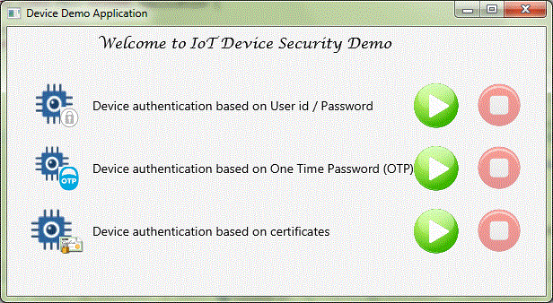
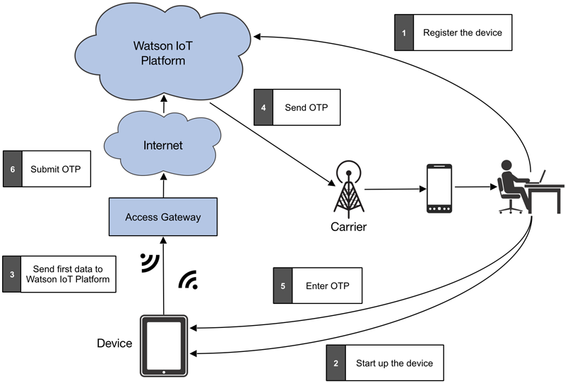
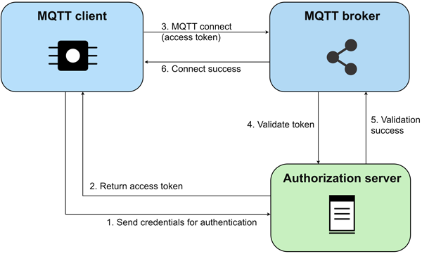
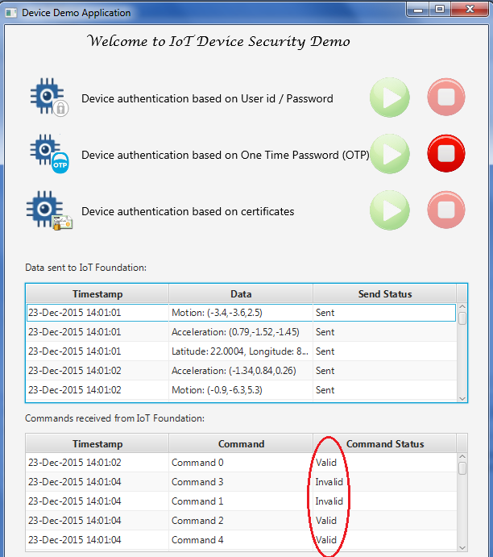

# 保护 IoT 设备和网关
从身份验证（包括基于证书的身份验证）到授权，再到应用程序 ID 验证

**标签:** IoT

[原文链接](https://developer.ibm.com/zh/articles/iot-trs-secure-iot-solutions1/)

Amitranjan Gantait, Joy Patra, Ayan Mukherjee

更新: 2018-03-21 \| 发布: 2016-05-16

* * *

物联网 (Internet of Things, IoT) 给企业和用户带来了巨大的机会，尤其是在医疗保健、仓储、运输和物流领域。伴随这种广泛采用而来的是，开发人员面临着如何确保 IoT 应用程序获得高效安全方面的新挑战，因为这些应用程序处理着大量敏感数据。已经有许多关于 IoT 解决方案遇到了安全破坏的报道，所以在设计和实现这些解决方案时，开发人员必须关注在其 IoT 应用程序中建立安全保护。

本系列文章将重点介绍一种基于 IBM 云平台的 IoT 应用程序的各个架构层。本系列中的文章将介绍一种基于解决方案的方法，该方法使用可在 IBM 云平台中轻松获取的服务来最小化 IoT 应用程序的安全风险。这些文章为保护 IoT 应用程序提供了经过考验的技术。

本系列的第 1 部分将介绍各种保护设备或网关的方法。 [第 2 部分](https://www.ibm.com/developerworks/cn/iot/library/iot-trs-secure-iot-solutions2/index.html?ca=drs-) 将重点介绍网络和传输层的安全性，包括 IBM Watson IoT Platform。 [第 3 部分](https://www.ibm.com/developerworks/cn/iot/library/iot-trs-secure-iot-solutions3/index.html?ca=drs-) 将介绍应用层的安全需求，以及在 IBM Cloud 平台中创建一个分析 IoT 应用程序的实现方法。

## IoT 安全基础

IoT 解决方案涉及一个复杂的智能设备网络，比如车辆、机器、建筑或家用电器，它们之中嵌入了电子器件、软件、传感器和网络连接，这使这些“事物”能够收集和交换数据。物联网中的“事物”使开发人员能够基于这些启用了云、互联的物理设备来提供大量的新服务。随着 IoT 应用程序收集越来越多以前未公开的数据（通常是私有数据），并允许通过互联网访问各种控制功能，安全性成为了一个重大挑战。因此，IoT 应用程序必须：

- **防范系统被破坏或损害**。

    IoT 应用程序的每一层都必须采取有效的预防措施来阻止黑客。例如，您需要 _加固_ 设备，确保设备与云的通信是安全的。

- **支持持续监视**。

    即使是受到最严密保护的系统也留有许多漏洞。另外，当下受到最严密保护的解决方案（包括硬件和软件）可能不足以防范未来的攻击。因此，您必须通过持续监视和不断升级系统来抵御最新的攻击形式，为您的安全措施提供补充。

- **能迅速恢复**。

    最后，如果发生了一次破坏，必须最大限度减少损害，而且必须尽快恢复系统。


### IoT 漏洞

开发人员可以通过许多方法，应用 IoT 技术来创建 IoT 解决方案。他们可创建一个简单的家庭监视系统来向智能电话和智能手表发送警报，或者他们可以创建复杂的医疗系统来收集数据和控制患者设备网络 — 以及获取许多我们无法想象的问题解决机会。

但是将汽车、家庭和机器等事物连接起来会公开许多敏感数据，比如人员在建筑中的位置信息或患者的医疗记录。此数据必须依据关键信息安全原则 [CIA 三元素](http://whatis.techtarget.com/definition/Confidentiality-integrity-and-availability-CIA) 来加以保护： _机密性 (confidentiality)_、 _完整性 (integrity)_ 和 _可用性 (availability)_。

请查阅讲述互联汽车漏洞的文章“ [黑客远程破坏高速公路上的 Jeep 车](http://www.wired.com/2015/07/hackers-remotely-kill-jeep-highway/)。”

任何拥有网络连接的设备都是脆弱的。IoT 设备所收集的个人数据对数据黑客和身份窃贼始终具有价值。另外，对 IoT 解决方案的网络攻击有可能损害物理服务和基础架构。例如，黑客曾攻击一辆在高速公路上行驶的切诺基 Jeep 车。因此，安全的 IoT 应用程序不仅对企业声誉至关重要，对客户和解决方案用户的幸福安康也很重要。

请查阅更详细地描述这些漏洞的文章：“ [医院设备很容易遭受黑客攻破](http://www.wired.com/2014/04/hospital-equipment-vulnerable/)”和“ [9 种婴儿监视器对黑客来说形同虚设](http://arstechnica.com/security/2015/09/9-baby-monitors-wide-open-to-hacks-that-expose-users-most-private-moments/)”。

一项为期两年的研究证实了医院互联设备存在诸多安全漏洞。他们发现一个主要的问题在于，嵌入式 Web 服务允许设备间相互通信并且直接向患者医疗记录输入数字化数据 — 而没有执行适当的身份验证或加密机制！一项类似的研究证实了婴儿监视器同样存在安全漏洞。

### IoT 安全设计挑战

尽管 IoT 安全的重要性已得到广泛认识和认同，但 IoT 安全性的实际设计和实现带来了新的挑战，也同样带来了创新机遇。在几乎所有应用程序的设计中，开发人员都会面临安全性与实用性之间的权衡。对于 IoT 解决方案，此问题更为严重。IoT 设备通常仅具有有限的计算能力和内存容量，这使得使用需要比这些设备所能提供的资源更高要求的复杂加密算法变得很困难。

另一个挑战是如何通过定期的安全修复和更新来更新 IoT 设备。在不可靠、低带宽的设备网络中，很难一次性将安全补丁部署到所有设备，而且许多现有的安全措施（比如 Web 浏览器安全性）可能无法用于 IoT 应用程序。

您可以在 MQTT 和 CoAP 网站上进一步了解这些开放标准： [MQTT](http://mqtt.org/) 或 [CoAP](http://coap.technology/)。

此外，对于专门为物联网而设计的新协议，比如消息队列遥测传输 (Message Queuing Telemetry Transport, MQTT) 和受约束应用程序协议 (Constrained Application Protocol, CoAP)，可能需要开发或增强安全机制。因此，在设计 IoT 应用程序时，需要从一开始就将安全性作为特别重要的考虑因素。

## 开发安全的 IoT 应用程序

大部分 IoT 解决方案都包含三个主要的层。在每层中运行的 IoT 解决方案组件需要包含特定的安全措施，以防范各种漏洞。

- **设备/网关层：** 防范发送恶意命令的“虚假”服务器，或者防范尝试监听从设备发来的私有传感器数据的黑客。这一层的安全考虑因素将在系列的第 1 部分（本文）中讨论。
- **网络/传输层：** 防范发送假的度量数据的“虚假”设备，这些数据可能损坏应用程序中持久保存的数据。这一层的安全考虑因素将在系列的第 2 部分中讨论。
- **应用层：** 防范非法的数据使用，或防范在应用层中运行的分析流程被恶意操纵。这一层的安全考虑因素将在系列的第 3 部分中讨论。

IoT 设备的应用层为黑客提供了最大的攻击面。应用层包含任何连接 IoT 设备的应用程序，这可能包括本地 Web 应用程序、基于云的应用程序和移动应用程序。

应用程序安全性必须是所有 IoT 应用程序的软件开发生命周期 (SDLC) 的内在组成部分，尤其是在设计、开发和测试阶段。在 IoT 应用程序的计划或设计阶段，必须对所计划的应用程序的安全和隐私需求执行一次正式的“自上而下”评估。

下图展示了一个典型的 IoT 应用程序的三层，该应用程序在网络/传输层中使用了 IBM Watson IoT Platform，在应用层中使用了 IBM Cloud 云平台。


下表简要描述了每一层以及在该层中开发人员必须重视的安全考虑因素。

层描述安全考虑因素**应用**IoT 应用程序部署在 IBM Cloud 平台中。_应用程序安全性_ 对 IBM Watson IoT Platform 的受保护的 API 调用 _Node-RED 安全性_ 解密消息 \\* 消息校验和验证**网络/传输层**IBM Watson IoT Platform 为 IoT 应用程序提供了基于 MQTT 的消息平台。_对设备执行身份验证（只有受信任的设备才能发送数据）_ 授权 _API 安全性_ 安全配置 \\* 安全的传输**设备/网关**设备（直接或通过网关）将传感器数据发布到 IBM Watson IoT Platform，并接收执行控制功能的指令。_身份验证_ 消息有效负载加密 _证书配置和验证_ 安全的 MQTT 传输 _安全引导_ 防火墙 \\* 固件更新和补丁

## 保护设备

设备安全性主要关注于确保在解决方案中使用了一组受信任的设备，并且这些设备可信任发送控制命令的代理或应用程序。本文将讨论可用于建立这一信任的各种安全机制。

此外，我们（使用 JavaFX）开发了一个设备模拟器程序来演示这些安全机制：

- 用户 ID/密码身份验证
- 一次性密码 (One Time Password, OTP) 身份验证
- 服务器唯一 ID 身份验证
- 消息有效负载身份验证

请参见下面的设备模拟器屏幕截图。



可以 [下载设备模拟器程序的代码](https://github.com/ayan13s/DeviceSimulatorDemo.git) ，并按照自述文件中的说明在本地构建和运行它。

[获取设备模拟器的代码](https://github.com/ayan13s/DeviceSimulatorDemo.git)

MQTT 是一种用于 IoT 设备和应用程序的最流行的消息协议，它得到了 IoT 领域的许多关键参与者的支持。MQTT 为 IoT 解决方案提供了一种轻量型、容易使用的通信协议。

MQTT 本身指定了一些安全机制，但所有常见的实现都支持最新的安全标准，比如用于传输安全的 SSL/TLS。MQTT 没有强制要求对其应用程序使用某种特定的安全方法，而是将决定权留给了应用程序设计者。因此，IoT 解决方案可以基于应用程序上下文和特定的安全需求。

大部分 MQTT 部署都使用了传输层安全 (Transport Layer Security, TLS)，所以数据已加密并经过了完整性验证。类似地，大部分 MQTT 实现（包括 IBM Watson IoT Platform 中的实现）也在 MQTT 服务器中使用了授权功能来控制访问。

除了设备模拟器程序之外，我们还提供了一个代理应用程序客户端，用于显示从设备收到的 MQTT 消息并向设备发送示例命令。这个代理应用程序客户端示例应用程序生成用于设备身份验证的 OTP 密钥，并发送唯一的应用程序 ID 供设备执行应用程序验证。这个客户端生成命令消息（包括有效和无效的消息）来测试不同场景。

您可以 [下载代理应用程序客户端的代码](https://github.com/ayan13s/BrokerAppDemo.git) ，并按照自述文件中的说明来在本地构建和运行它。

[获取代理应用程序客户端的代码](https://github.com/ayan13s/BrokerAppDemo.git)

## 设备身份验证

身份验证是 MQTT 中的传输和应用程序级安全的一部分。在传输层面上，TLS 可以使用客户端证书向服务器保证客户端的真实性，通过验证服务器证书向客户端保证服务器的真实性。在应用程序层面上，MQTT 协议提供了用户名/密码身份验证。

开发人员可使用多种方法来确保向代理注册了正确的设备。选择正确的方法取决于解决方案所需的安全性，以及在设备上运行所需方法的能力。

以下各节将介绍其中一些方法。在代码样本中使用 [Eclipse Paho](https://eclipse.org/paho/clients/java/) 作为 MQTT 客户端库。

### 使用用户名和密码执行身份验证

MQTT 协议在 CONNECT 消息中提供了 `username` 和 `password` 字段来执行设备身份验证。客户端在连接 MQTT 代理时必须发送用户名和密码。

用户名是一个 UTF-8 编码的字符串，密码是二进制数据。它们最大为 65535 字节。MQTT 协议不会加密用户名和密码，除非使用了传输层加密，否则会以明文格式发送它们。

##### 用户名和密码字段

```
try {
    MqttClient securedClient = new MqttClient(broker, clientId, persistence);
    MqttConnectOptions connOpts = new MqttConnectOptions();
    connOpts.setCleanSession(true);
    connOpts.setUserName(userName);
    connOpts.setPassword(password.toCharArray());
    System.out.println("Connecting to broker: "+broker);
    securedClient.connect(connOpts);
    System.out.println("Connected");
} catch(MqttException me) {
    System.out.println("reason "+me.getReasonCode());
    System.out.println("msg "+me.getMessage());
    System.out.println("loc "+me.getLocalizedMessage());
    System.out.println("cause "+me.getCause());
    System.out.println("excep "+me);
    me.printStackTrace();
}

```

Show moreShow more icon

### 使用访问令牌执行身份验证

如果客户端成功获取了访问令牌，那么可以在 CONNECT 消息中通过使用 `password` 字段将令牌发送给代理。然后，用户名可以是一个用于识别访问令牌的特殊字符串。MQTT 中的密码的大小限制为 65535 字节，所以令牌长度不能超过这个限制。

代理可以使用令牌来执行各种验证，比如：

- 检查来自令牌的签名的有效性
- 检查令牌的有效期是否已过期
- 检查授权服务器来查看令牌是否被撤销

在设备连接到 MQTT 代理时使用的验证与应用程序发布或订阅时使用的验证相同。但是，在发布或订阅时，代理还必须为应用程序授权。此授权可通过两种方式完成：

- 令牌在范围声明中包含客户端的授权。
- 令牌有一个第三方来源，比如数据库或 LDAP，用于查找客户端的授权。

IBM Watson IoT Platform 应用程序可通过应用程序 ID、密钥和令牌来执行身份验证。IoT 应用程序密钥和令牌可在应用程序注册期间生成，可在它连接到 IBM Watson IoT Platform 时使用，如下面的示例所示：

##### 应用程序密钥和令牌

```
App properties

# A unique id you choose it by yourself, maybe, abcdefg123456
appid=<Your_application_id>

# The key field from App Keys info you copied previously
key=<Key>

# The Auth Token field from App Keys info you copied previously
token=<Token>

App code during connection:

strAuthMethod = props.getProperty("key");
strAuthToken = props.getProperty("token");

handler = new AppMqttHandler();
handler.connect(serverHost, clientId, strAuthMethod, strAuthToken, isSSL);

```

Show moreShow more icon

### 使用一次性密码 (One time password, OTP) 执行身份验证

除了 MQTT 提供的身份验证机制之外，IoT 应用程序可能还需要实现额外的安全性来识别合适的设备。本文介绍了一种为这些情形实现基于 OTP 的身份验证的方法。OTP 身份验证是一种保护设备免受不当使用的有用机制，它消除了未授权用户获取访问权的风险。

借助此方法，在设备启动后，只有经过验证的用户才能开始与 IoT 应用程序进行通信。因为不是所有设备都拥有键盘输入能力，所以可实现一个简单的属性开关，根据设备类型来启用或禁用此安全方案。如果启用了 OTP 身份验证，设备会在启动后使用正常的 MQTT 消息向 IoT 代理应用程序发送 OTP 请求。下图展示了详细的流程。



[OTP 请求](#otp-请求) 展示了如何使用设备属性打开和关闭 OTP 身份验证。如果启用了 OTP 身份验证，设备会在启动后使用正常的 MQTT 消息向 IoT 代理应用程序发送 OTP 请求。

##### OTP 请求

```
        // Create the request for OTP
        JSONObject idObj1 = new JSONObject();
        try {
            idObj1.put("event", "server_otp_request");
            idObj1.put("deviceId", deviceIdentifier);
        } catch (JSONException e1) {
            System.out.println("Exception occurred");
            e1.printStackTrace();
        }
        new SendMessageToServer("server_otp_request", idObj1).start();
        System.out.println("otp request sent....");
    }

```

Show moreShow more icon

IoT 应用程序生成一个 OTP，将它单独发送给设备所有者，并向设备发送一个通知，如下面的清单所示。

##### 生成 OTP

```
            otp = IOTSecurityUtil.generateOTP();

            JSONObject jsonObj = new JSONObject();
            try {
                jsonObj.put("cmd", "server_otp_response");
                jsonObj.put("otp", otp);
                jsonObj.put("appid", strAppId);
                jsonObj.put("time",
                new SimpleDateFormat("yyyy-MM-dd HH:mm:ss").format(new Date()));

             // Server starts a timer of 5 mins during which the
             // OTP is valid.
                task = new TimeOutTask();
                t = new Timer();
                t.schedule(task, 30000000L);

            } catch (JSONException e) {
                e.printStackTrace();
            }
            System.out.println("Sending otp  -  " + otp);

            // Publish command to one specific device
            // iot-2/type/<type-id>/id/<device-id>/cmd/<cmd-id>/fmt/<format-id>
            new SendMessageToDevice(strDeviceId, "server_otp_response", jsonObj)
                    .start();

```

Show moreShow more icon

如 [验证 OTP 身份验证](#验证-otp-身份验证) 所示，OTP 进入了设备，设备将它发送给代理应用程序。代理应用程序验证设备发送的 OTP，并向设备发送一条成功/失败（错误的 OTP 或超时）消息。设备可基于来自配置的重试次数来重新尝试 OTP 身份验证。

如果在重试后 OTP 身份验证仍未成功，应用程序就会关闭。如果未启用 OTP 身份验证，设备将在启动后跳过 OTP 身份验证。

##### 验证 OTP 身份验证

```
    if (receivedOTP.equals(otp)) {
        if (task.isTimedOut) {
        // User took more than 100 seconds and hence the OTP is invalid
        System.out.println("Time out!");
        otpValidated = false;
        otpTimeOut = true;
        } else {
        System.out.println("OTP validated..");
        otpValidated = true;
        otpTimeOut = false
        }
    } else {
        System.out.println("Incorrect OTP..");
        otpValidated = false;
        otpTimeOut = false;
    }

    JSONObject otpRespObj = new JSONObject();
    try {
        otpRespObj.put("cmd", "server_otp_validate");
        otpRespObj.put("isOTPValid", String.valueOf(otpValidated));
        otpRespObj.put("isTimeOut", String.valueOf(otpTimeOut));
        otpRespObj.put("appid", strAppId);
        otpRespObj.put("time", new SimpleDateFormat(
                        "yyyy-MM-dd HH:mm:ss").format(new Date()));
    } catch (JSONException e) {
        e.printStackTrace();
    }
    System.out.println("Result of OTP validation -  " + otpValidated);
    // Publish command to one specific device
        new sendMessageToDevice(strDeviceId, "server_otp_validate",
        otpRespObj).start();

}

```

Show moreShow more icon

## 基于证书的身份验证

一些代理（比如 HiveMQ、可用于为企业启用 M2M 和 IoT 功能的 MQTT 代理）支持设备证书，这些证书可由代理在相互身份验证过程中使用。在安全要求非常严格，而且设备可以配置证书的应用程序中，可以考虑采用这种身份验证。

在本文中，我们使用 IBM Watson IoT Platform 和 HiveMQ 来演示基于证书的双向 SSL 身份验证。它们都使用标准 MQTT 作为设备通信协议。

### Watson IoT Platform 中基于证书的身份验证

要在 Watson IoT Platform 中配置基于证书的身份验证，完成以下步骤。

1. **为认证中心 (CA) 证书创建证书扩展文件。** 创建 `ext.cfg` 文件，并将以下代码复制到该文件中：


    ```
    [ req ]
    attributes = req_attributes
    req_extensions = v3_ca
    prompt = no
    [ req_attributes ]
    [ v3_ca ]
          basicConstraints = CA:true

    ```


    Show moreShow more icon

2. **为服务器创建证书扩展文件。** 创建 `srvext.cfg` 文件，并将以下代码复制到该文件中：


    ```
    [ req ]
    req_extensions = v3_req
    [ v3_req  ]
    subjectAltName = DNS:<ORG>.messaging.internetofthings.ibmcloud.com

    ```


    Show moreShow more icon

3. **生成根 CA 密钥和证书。** 在示例中，我们通过 `openssl` 命令使用了自签名证书：


    ```
    openssl genrsa -aes256 -passout pass:<Password> -out rootCA_key.pem 2048
    openssl req -new -sha256 -x509 -days 3560 -subj "/C=IN/ST=WB/L=KOL/O=<ORG>/OU=<ORG> Corporate/CN=<ORG> Root CA" -extensions v3_ca -set_serial 1 -passin pass:<Password> -key rootCA_key.pem -out rootCA_certificate.pem -config openssl.cnf

    ```


    Show moreShow more icon

4. **生成中间密钥、证书、中间 CA，并由根 CA 进行签名。** 同样，我们使用了这些 `openssl` 命令：


    ```
    openssl genrsa -aes256 -passout pass:<Password> -out intermediateCA_key.pem 2048
    openssl req -new -sha256 -days 3650 -subj "/C=IN/ST=WB/L=KOL/O=<ORG>/OU=AIMDEV /CN=<ORG> Intermediate CA" -passin pass:<Password> -key intermediateCA_key.pem -out intermediateCA_crt.csr -config openssl.cnf
    openssl x509 -days 3650 -in intermediateCA_crt.csr -out intermediateCA_crt.pem -req -sha256 -CA rootCA_certificate.pem -passin pass:<Password> -CAkey rootCA_key.pem -set_serial 13 -extensions v3_ca -extfile ext.cfg

    ```


    Show moreShow more icon

5. **将根 CA 和中间 CA 证书上传到 Watson IoT Platform。** 要使用客户端证书启用 TLS，就需要将 CA 上传到 Watson IoT Platform，后者将验证消息传递服务器的签名和客户端证书。有关如何 [在 Watson IoT Platform 中配置证书](https://cloud.ibm.com/docs/services/IoT/reference/security/set_up_certificates.html) 的信息，可参阅相关文档。

6. 通过执行以下步骤来 **设置设备证书身份验证**：

     a. 生成由中间 CA 签名的设备类型密钥和证书。使用以下 `openssl` 命令：


    ```
    openssl genrsa -aes256 -passout pass:<Password> -out SecuredDevice_key.pem 2048
    openssl req -new -sha256 -days 3560 -subj "/C=IN/ST=WB/L=KOL/O=<ORG>/OU=IMATEST /CN=d:<DEVICE TYPE>:"-passin pass:<Password> -key SecuredDevice_key.pem -out SecuredDevice_crt.csr -config openssl.cnf`
    openssl x509 -days 3650 -in SecuredDevice_crt.csr -out SecuredDevice_crt.pem -req -sha256 -CA intermediateCA_crt.pem -passin pass:<Password> -CAkey intermediateCA_key.pem -extensions v3_req -extfile srvext.cfg -set_serial 131

    ```


    Show moreShow more icon

     b. 生成由中间 CA 签名的设备密钥和证书。使用以下 `openssl` 命令：


    ```
    openssl genrsa -aes256 -passout pass:<Password> -out SecuredDevice_0400213_key.pem 2048
    openssl req -new -sha256 -days 3560 -subj "/C=IN/ST=WB/L=KOL/O=<ORG>/OU=IMATEST /CN=d:<DEVICE TYPE>:<DEVICE ID>" -passin pass:<Password> -key SecuredDevice_0400213_key.pem -out SecuredDevice_0400213_crt.csr -config openssl.cnf
    openssl x509 -days 3650 -in SecuredDevice_0400213_crt.csr -out SecuredDevice_0400213_crt.pem -req -sha256 -CA intermediateCA_crt.pem -passin pass:<Password> -CAkey intermediateCA_key.pem -extensions v3_req -extfile srvext.cfg -set_serial 132

    ```


    Show moreShow more icon

     c. 创建将在 MQTT 密钥库中使用的设备证书的 pkcs12 密钥。使用以下 `openssl` 命令：


    ```
    openssl pkcs12 -export -inkey SecuredDevice_0400213_key.pem -in SecuredDevice_0400213_crt.pem -out SecuredDevice_0400213.p12 -password pass:<Password>

    ```


    Show moreShow more icon

     d. 像以前一样将生成的 CA 证书上传到 Watson IoT Platform。

     e. 创建密钥库，并添加为设备生成的设备 pkcs12 密钥。使用以下 keytool 命令：


    ```
    keytool -keystore keystore.jks -genkey -alias keystore -storepass <Password>
    keytool -importkeystore -srckeystore SecuredDevice_0400213.p12 -destkeystore keystore.jks -srcstoretype pkcs12 -deststorepass <Password> -deststoretype jks -srcstorepass <Password>

    ```


    Show moreShow more icon

     f. 在 Java MQTT 客户端中设置密钥库。


    ```
    // SSL Configuration

    // Keystore
         private static final String KEYSTORE_PW = "123456";
         private static final String KEYSTORE_TYPE = "jks";
         sslClientProps.put("com.ibm.ssl.keyStore", "C:\\demo\\new\\keystore.jks");
         sslClientProps.put("com.ibm.ssl.keyStoreType", KEYSTORE_TYPE);
         sslClientProps.put("com.ibm.ssl.keyStorePassword", KEYSTORE_PW);

    ```


    Show moreShow more icon

7. 通过完成以下步骤， **完成为消息代理设置基于证书的身份验证过程**：

     a. 通过使用根 CA 作为颁发者，生成 MQTT 服务器密钥和证书。 使用以下 `openssl` 命令：


    ```
    openssl genrsa -aes256 -passout pass:<Password> -out mqttServer_key.pem 2048
    openssl req -new -sha256 -days 3560 -subj "/C=IN/ST=WB/L=KOL/O=<ORG>/OU=IMATEST /CN=<ORG>.messaging.internetofthings.ibmcloud.com" -passin pass:<Password> -key mqttServer_key.pem -out mqttServer_crt.csr -config openssl.cnf
    openssl x509 -days 3560 -in mqttServer_crt.csr -out mqttServer_crt.pem -req -sha256 -CA rootCA_certificate.pem -passin pass:<Password> -CAkey rootCA_key.pem -extensions v3_req -extfile srvext.cfg -set_serial 11

    ```


    Show moreShow more icon

     b. **将消息传递服务证书上传到 Watson IoT Platform。** 在上传消息传递服务证书之前，确保已在 CA 证书部分中上传了根 CA 证书。

     c. **使用 java keytool 创建信任库，并添加 MQTT 服务器证书**（先前上传到信任库中的证书）。


    ```
    keytool -keystore truststore.jks -genkey -alias truststore -storepass <Password>
    keytool -import -trustcacerts -file mqttServer_crt.pem -keystore truststore.jks -storepass <Password> -noprompt

    ```


    Show moreShow more icon

     d. **在 MQTT 客户端中设置信任库。**


    ```

    // SSL Configuration

    // Truststore

         private static final String TRUSTSTORE_PW = "123456";
         private static final String TRUSTSTORE_TYPE = "jks";
         sslClientProps.put("com.ibm.ssl.trustStore", "C:\\demo\\new\\truststore.jks");
         sslClientProps.put("com.ibm.ssl.trustStoreType", TRUSTSTORE_TYPE);
         sslClientProps.put("com.ibm.ssl.trustStorePassword", TRUSTSTORE_PW);

    ```


    Show moreShow more icon


### HiveMQ 中基于证书的身份验证

如果还没有安装 HiveMQ，并且您希望遵照相关步骤来操作，那么请进行安装。可以按照 [hivemq.com](http://www.hivemq.com/) 上列出的步骤轻松地下载、安装和启动它。可以使用可选插件来从 HiveMQ 获取所保留的消息。MQTT 客户端与 HiveMQ 结合使用的方式与它与 IBM Watson IoT Platform 结合使用的方式相同。

设备模拟器程序和 MQTT 代理应用程序客户端演示了基于证书的身份验证。设备和应用程序都与 HiveMQ 执行相互证书验证。

可以 [下载证书身份验证演示的代码](https://github.com/ayan13s/IOTCertificateAuthDemo.git)，并按照自述文件中的说明在本地构建和运行它。

[获取证书身份验证演示的代码](https://github.com/ayan13s/IOTCertificateAuthDemo.git)

### 生成证书

按照下述步骤生成一个用于身份验证的证书。此过程使用包含在 Java 运行时环境中的 **_keytool_**。

1. **生成设备密钥和密钥库**

    `keytool -genkey -alias iotdevice1 -keyalg RSA -keypass devicepass -storepass devicepass -keystore iot_device_keystore.jks -storetype jks`

2. **从密钥库导出设备证书**

    `keytool -export -alias iotdevice1 -storepass devicepass -file iotdevice1.cer -keystore iot_device_keystore.jks`

3. **将设备证书添加到代理信任库**

    `keytool -import -v -trustcacerts -alias iotdevice1 -file iotdevice1.cer -keystore iot_broker_truststore.jks -keypass devicepass -storepass brokerpass -storetype jks`

4. **生成代理密钥和密钥库**

    `keytool -genkey -alias broker -keyalg RSA -keypass brokerpass -storepass brokerpass -keystore iot_broker_keystore.jks -storetype jks`

5. **导出代理证书**

    `keytool -export -alias broker -storepass brokerpass -file broker.cer -keystore iot_broker_keystore.jks`

6. **将证书添加到设备信任库**

    `keytool -import -v -trustcacerts -alias broker -file broker.cer -keystore iot_device_truststore.jks -keypass brokerpass -storepass brokerpass -storetype jks`


可将同样的方法扩展到多个设备。所有设备证书都必须添加到代理的信任库 (`truststore`) 中，而且代理的证书必须在所有设备的信任库 (`truststore`) 中。

### 配置 HiveMQ 来执行基于证书的身份验证

如 [配置了代理密钥库 (`keystore`) 和信任库 (`truststore`) 的 Hive MQ](#配置了代理密钥库-code-keystore-code-和信任库-code-truststore-code-的-hive-mq) 所示，使用 `config.xml` 文件为 HiveMQ 配置了代理密钥库 (`keystore`) 和代理信任库 (`truststore`)。

##### 配置了代理密钥库 (`keystore`) 和信任库 (`truststore`) 的 Hive MQ

```
<tls-tcp-listener>
            <port>8883</port>
            <bind-address>0.0.0.0</bind-address>
            <tls>
                <keystore>
                    <path><Your path>\iot_broker_keystore.jks</path>
                    <password>brokerpass</password>
                    <private-key-password>brokerpass</private-key-password>
                </keystore>
                <truststore>
                        <path>C:\certificates\iot_broker_truststore.jks</path>
                        <password>brokerpass</password>
                </truststore>
                <client-authentication-mode>REQUIRED</client-authentication-mode>
            </tls>
        </tls-tcp-listener>

```

Show moreShow more icon

然后为 MQTT 处理程序配置设备密钥库 (`keystore`) 和信任库 (`truststore`)，如下面的清单所示：

##### 配置了设备密钥库 (`keystore`) 和信任库 (`truststore`) 的 MQTT 处理程序

```
if (isSSL) {
        java.util.Properties sslClientProps = new java.util.Properties();

            // Set the SSL properties
        sslClientProps.setProperty("com.ibm.ssl.protocol", "TLSv1.2");
        sslClientProps.setProperty("com.ibm.ssl.contextProvider", "SunJSSE");

            // Set the keystore properties
        sslClientProps.setProperty("com.ibm.ssl.keyStore", "<Your_path>/iot_device_keystore.jks");
            sslClientProps.setProperty("com.ibm.ssl.keyStorePassword", "devicepass");
        sslClientProps.setProperty("com.ibm.ssl.keyStoreType", "JKS");
        sslClientProps.setProperty("com.ibm.ssl.keyManager", "SunX509");

            // Set the trust store properties
        sslClientProps.setProperty("com.ibm.ssl.trustStore", "<Your_path>/iot_device_truststore.jks");
        sslClientProps.setProperty("com.ibm.ssl.trustStorePassword", "brokerpass");
        sslClientProps.setProperty("com.ibm.ssl.trustStoreType", "JKS");
        sslClientProps.setProperty("com.ibm.ssl.trustManager", "SunX509");

            // 'options' is an instance of MqttConnectOptions
        options.setSSLProperties(sslClientProps);
    }

```

Show moreShow more icon

### 使用客户端证书执行身份验证

尽管基于证书的身份验证为一些应用程序提供了一种高级安全保护，但实现此方法不太容易，而且管理大量设备的证书生命周期可能需要很高的成本。但是如果企业已有类似的基础架构并管理着所有 MQTT 组件（设备和代理），那么可以考虑采用这种方法。

IBM Watson IoT Platform 不支持基于客户端证书的身份验证。但是，它可使用其他代理来实现身份验证，比如 HiveMQ。

MQTT 可以使用 TLS 执行传输加密。要使用 TLS，服务器必须有一个公钥/私钥对。发生 TLS 握手时，客户端需要验证服务器的 X509 证书（其中还包含服务器的公钥），然后才能建立安全连接。

除了服务器证书之外，客户端还可以提供一个唯一的公钥/私钥对来实现 TLS 握手协议。在验证服务器证书后，客户端在 TLS 握手过程中发送它的证书（其中包含客户端的公钥）。然后，服务器能够验证客户端的身份，如果对客户端证书的验证失败，则可以取消握手。此做法允许在建立安全连接之前对客户端执行身份验证。

实现客户端证书具有以下优势：

- 验证 MQTT 客户端的身份
- 在传输层面对 MQTT 客户端执行身份验证
- 在发送 MQTT CONNECT 消息之前将无效的 MQTT 客户端拒之门外

如果使用客户端证书，那么只有受信任的客户端才能建立安全的连接。此配置可节省代理端的资源，尤其是在代理端使用了高成本的 MQTT 身份验证机制（比如数据库查找或 Web 服务调用）时。因为身份验证是在 TLS 握手过程中执行的，所以身份验证会在建立连接之前完成。

尽管 X509 客户端证书提供了一个额外的安全层，但这种身份验证仍有一定成本。MQTT 客户端的客户端证书配置更复杂，而且需要证书撤销机制。

- **部署客户端证书：** 要使用客户端证书，必须定义一个配置流程。此流程在企业拥有其设备的控制权且拥有明确定义的固件更新流程时进行定义。客户端证书可在固件更新期间配置。管理设备中的证书的生命周期（包括有效期）还需要其他考虑因素。

- **证书撤销：** 如果客户端证书不再受信任（例如它被泄露了），那么让客户端证书失效就很重要。如果证书泄露了且恶意客户端正在使用该证书，服务器需要一种途径来识别无效的证书，并禁止客户端使用该证书连接。


### Watson IoT Platform 中的高级安全策略

IBM Watson IoT Platform 现在支持几种新的安全策略，可以启用和配置这些策略以满足 IoT 解决方案的各种安全需求。

#### 连接安全性

现在可以使用不同的方法来保护设备与 Watson IoT Platform 之间的连接。通过使用连接安全策略，您可以设置应用于所有设备的默认安全级别。您还可以自定义连接安全性，将不同的安全级别应用于特定设备。您可以为默认或自定义连接安全性配置这些安全级别：

- 可选的 TLS
- 带有令牌身份验证的 TLS
- 带有客户机证书身份验证的 TLS
- 带有客户机证书和令牌身份验证的 TLS
- 带有客户机证书或令牌身份验证的 TLS

#### 配置设备访问规则

在 Watson IoT Platform 中，除了配置通用或特定于设备的连接策略之外，您还可以配置一些规则，用来启用或阻止对某个国家/地区中特定设备的访问。

- 黑名单可阻止从特定 IP 地址和国家/地区进行访问。激活黑名单会禁用生效的白名单。
- 白名单可允许从特定 IP 地址和国家/地区进行访问。激活白名单会禁用生效的黑名单。

参阅 [关于在 Watson IoT Platform 中设置安全策略的 IBM Cloud 文档](https://cloud.ibm.com/docs/services/IoT/reference/security/set_up_policies.html#set_up_policies.md)，其中包括配置黑名单和白名单。

## 设备授权

授权机制可确保两个设备之间没有数据泄露。

MQTT 是一种基于主题的发布/订阅协议。每条消息都在一个指定的主题上发布，而且每个订阅都有一个可包含通配符的主题过滤器。所以，授权基于发布/订阅和主题名称。大部分 MQTT 服务器都有某种途径来授予发布和订阅主题的权限。

在 IBM Watson IoT Platform 中，这种授权是通过实现安全的消息模式来执行的。在设备经过验证后，它们只有权发布和定义一个受限制的主题空间，例如：

- `/iot-2/evt/+/fmt/+`
- `/iot-2/cmd/+`

所有设备都使用同一个主题空间。连接的客户端所提供的身份验证凭证规定了 IBM Watson IoT Platform 将哪些设备包含在此主题空间中。此配置可预防设备仿冒另一个设备。仿冒另一个设备的唯一方法是获取该设备的受损的安全凭证。

## 使用 OAuth 2.0 的应用程序授权

如果企业希望对 MQTT 设备使用其集中化的授权机制，可以使用基于 OAuth 的框架。OAuth 2.0 实现了授权服务器与资源服务器（比如 MQTT 服务器）的分离。使用 OAuth 2.0 时，客户端将其凭证提供给授权服务器，然后，后者执行身份验证检查，并返回一个允许访问某个资源的访问令牌。

随后，使用该访问令牌连接到 MQTT 服务器。MQTT 服务器验证访问令牌（通常通过与授权服务器通信），然后授予资源的访问权。下图描述了该流程：



## 应用程序 ID 验证

应用程序 ID 验证是 IoT 应用程序与设备之间一个额外的安全层，用于确保任何虚假应用程序都无法向设备发送命令。此机制可用作启动安全机制和通信安全机制。通过使用此方案，设备会存储 IoT 应用程序的唯一 ID，并在处理从 IoT 应用程序传入的命令时验证它。

如果 IoT 应用程序通过一个命令发送无效的唯一 ID，该命令会被设备忽略。如果设备拥有存储能力，那么可以加密和存储 IoT 应用程序的唯一 ID。在这种情况下，不必在每次重新启动后都发送唯一 ID 请求。

下图给出了详细的流程：


上图描绘了该流程的以下方面：

- 可根据设备能力来开启和关闭应用程序 ID 验证。
- 在重新启动期间，如果启用了应用程序 ID 验证和唯一应用程序 ID 存储，那么设备会尝试从一个加密的文件还原 IoT 应用程序唯一 ID。
- 如果设备无法加载唯一应用程序 ID，它会发起一个请求来获取该应用程序 ID。
- 收到请求后，IoT 应用程序会将唯一 ID 发送给设备。
- 设备将唯一 ID 存储在内存和一个文件中（如果它有存储能力）。
- 在这之后，设备要求每个从 IoT 应用程序传入的命令中都包含的是同一个应用程序 ID。
- 如果存在错误匹配，设备会忽略该命令。

下面这个来自设备模拟器样本应用程序的屏幕截图展示了应用程序 ID 的用法。在每个实例中，都会针对存储的应用程序 ID 来验证命令中所提供的应用程序唯一 ID，并相应地执行或忽略该命令。



## 保护设备免受其他安全问题

除了我们目前讨论的身份验证、授权和通信问题之外，IoT 设备还需要使用以下类型的安全措施抵御各种其他形式的攻击。

- **安全引导**。

    安全引导对保护启动代码免受攻击很重要。在初始引导过程中必须验证设备的真实性和完整性。附加到设备软件的数字签名可用于验证设备的真实性。

- **设备固件升级**。

    设备必须防御所有已知和未知的恶意攻击。必须开发一种安装定期安全补丁的机制，确保所有设备都获得了定期升级。

- **事故日志和监视**。

    所有可能的安全事故都需要记录和持续监视。设备中的所有恶意活动都应立即触发代理对设备的取消注册。


### 安全的传输

IBM Watson IoT Platform 支持 TLS 1.2，后者可用于保护设备和代理之间的动态消息。如果使用 SSL 保护了底层传输层，则可以消除渠道窃听和对消息的未授权访问的风险。在 IBM Watson IoT Platform 中，端口 **8883** 用于 SSL 支持的连接，如下面的清单所示。

##### 加密的客户端通信

```
//tcp://<org-id>.messaging.internetofthings.ibmcloud.com:1883
//ssl://<org-id>.messaging.internetofthings.ibmcloud.com:8883
    if (isSSL) {
        connectionUri = "ssl://"+ serverHost + ":"+ DEFAULT_SSL_PORT;
    } else {
        connectionUri = "tcp://"+ serverHost + ":"+ DEFAULT_TCP_PORT;
    }

    //If SSL is used, do not forget to use TLSv1.2
    if (isSSL) {
        java.util.Properties sslClientProps = new java.util.Properties();
        sslClientProps.setProperty("com.ibm.ssl.protocol", "TLSv1.2");
        options.setSSLProperties(sslClientProps);
    }

```

Show moreShow more icon

用于 Android 和 iOS 错误 _Reference source not found_ （未发现的引用源）的 IBM IoT 入门库，使得在应用程序中使用 MQTT 和 SSL 变得很容易。 您可以使用所提供的 `IoTClient` 包装器类，如下面的清单所示：

##### IoTClient 包装器类

```

IoTClient iotClient = IoTClient.getInstance(
        context,
        orgId,
        deviceId,
        deviceType,
        authToken
);

try {
    IMqttToken mqttToken = iotClient.connectDevice(
            new DemoIoTCallbackHandler(),
            new DemoIoTActionListenerHandler(),
            (usingSSL ? createSslSocketFactory(context) : null)
    );

    mqttToken.waitForCompletion(DemoIoTApplication.DEFAULT_MQTT_CONNECT_TIMEOUT);
}
catch(MqttException e) {
    Log.e("Error connecting to IBM Watson IoT Platform: "+e);
}

```

Show moreShow more icon

方法 `createSslSocketFactory` 的定义如下。

##### 方法 `createSslSocketFactory`

```
private SocketFactory createSslSocketFactory(Context context) {
    SocketFactory factory = null;

    try {
        ProviderInstaller.installIfNeeded(context);

        KeyStore ks = KeyStore.getInstance("bks");
        ks.load(
                context.getResources().openRawResource(R.raw.iot),
                "password".toCharArray());

        TrustManagerFactory tmf = TrustManagerFactory.getInstance("X509");
        tmf.init(ks);

        TrustManager[] tm = tmf.getTrustManagers();

        SSLContext sslContext = SSLContext.getInstance("TLSv1.2");
        sslContext.init(null, tm, null);

        factory = sslContext.getSocketFactory();
    }
    catch (Exception e) {
        Log.e(TAG, "Error creating SSL factory: "+e);
    }

    return factory;
}

```

Show moreShow more icon

### 自定义的加密消息

引入多层安全性和加密的灵活选项，可让用户感到安心，并保护敏感数据免受损害。 用户有时更喜欢基于 SSL 保护的自定义加密，或者它们可能在安全的通信不受支持时被迫使用它。

在此方案中，应用程序会加密消息，然后再将其发送给 MQTT 代理。密码 (cipher) 在设备和 IoT 应用程序之间交换，并用于加密或解密消息。IBM Watson IoT Platform 目前不支持自定义加密，但其他一些 MQTT 代理支持自定义加密，比如 HiveMQ。

基于自定义加密的通信的细节将在本系列第 2 部分进行介绍。

## 结束语

正确的设备身份验证方法取决于您设计的解决方案，以及该解决方案将要处理的数据种类。要记住的一些关键点包括：

- 如果 IoT 数据是敏感的，则使用安全的连接。身份验证和受保护（加密）的通信都非常重要。
- 在需要额外的安全级别时，在物理设备安全水平不够高（比如任何人都可以访问物理设备）时，使用一次性密码 (OTP)。
- 基于代理的能力，使用 OAuth 等机制来支持外部授权提供商。
- 或许通过使用固定主题字符串，严格控制订阅授权，这样可以防范恶意客户端进行大量订阅。
- 限制消息大小，确保所有客户端或设备都无法自行阻塞代理。
- 如果可以执行证书管理，可以考虑签发客户端证书，并只接受来自具有证书的客户端的连接。

本文翻译自： [Securing IoT devices and gateways](https://developer.ibm.com/articles/iot-trs-secure-iot-solutions1/)（2018-02-28）