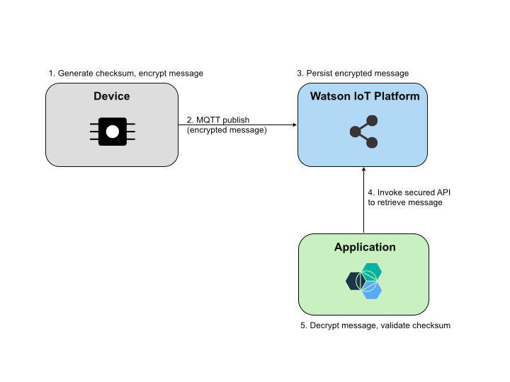

# 保护在网络上传输的 IoT 数据
IBM Watson IoT Platform API 中的数据加密和 API 安全性

**标签:** IoT

[原文链接](https://developer.ibm.com/zh/articles/iot-trs-secure-iot-solutions2/)

Ayan Mukherjee, Amitranjan Gantait, Joy Patra

更新: 2018-02-28 \| 发布: 2016-12-13

* * *

物联网（Internet of Things，IoT）解决方案是设备和传感器的复杂网络，这些设备和传感器通过网络和云来收集和交换数据。随着越来越多的数据向越来越多的应用程序公开，安全性成为了 IoT 开发人员的主要挑战。

本系列文章将重点介绍 IoT 应用程序在三个架构层上的安全性：设备、数据和应用程序。本系列的 [第 1 部分](http://www.ibm.com/developerworks/cn/iot/library/iot-trs-secure-iot-solutions1/index.html) 介绍了 IoT 安全性基础，然后描述了保护设备或网关的各种方法。第 2 部分（本文）将重点介绍网络和传输层的安全性，包括 IBM Watson IoT Platform。 [第 3 部分](http://www.ibm.com/developerworks/cn/iot/library/iot-trs-secure-iot-solutions3/index.html) 将介绍应用层的安全要求，以及在 IBM Cloud 平台中创建一个分析 IoT 应用程序的实现方法。

## 保护在网络上传输的数据

您可以在 [规范标准](https://tools.ietf.org/html/rfc5246) 中进一步了解传输层安全（Transport Layer Security，TLS）协议。

传输层安全（Transport Layer Security，TLS）为在网络上传输数据提供了安全保护。数据被加密，以预防任何人监听和了解其内容。TLS（也被称为 Secure Sockets Layer， SSL）被广泛用于对许多网站提供安全的访问。TLS 确保在数据传输执行之前，在服务器和客户端之间建立了信任。它使用客户端必须验证的服务器证书来实现此目的。在某些情况下，服务器还会验证特定于客户端的证书。

MQTT 采用 TCP 作为传输协议，并且在默认情况下，不会使用加密的通信建立连接。尽管实现 TLS 会影响数据传输的性能和服务器上的负载，但大部分 MQTT 代理（包括 IBM Watson IoT Platform）都支持使用 TLS 让应用程序能够保护敏感数据的交换。

当然，您可以通过让 IoT 应用程序加密它发送和接收的数据来添加额外的安全保护。例如，IoT 应用程序可以使用 MQTT PUBLISH 来加密它们发送的数据。此实现对不受信任的环境或设备与代理之间的不安全网络连接尤为重要。

如果使用 MQTT CONNECT 包的 `username` 和 `password` 字段来执行身份验证和授权，那么应该认真考虑使用 TLS。端口 8883 是用于安全的 MQTT 连接的标准端口。

## 数据加密

大部分 MQTT 部署都使用传输层安全（TLS），所以数据已加密并经过了完整性验证。IBM Watson IoT Platform 支持使用 TLS 1.2 来保护通过网络传输的数据。在本文中，我们将介绍应用程序如何提供额外的安全机制，甚至在底层网络可能不支持 TLS 时也能为加密消息的交换提供支持。

只有消息的有效负载数据（隐私传感器信息）需要加密。MQTT PUBLISH 消息的消息字段没有改变。有效负载信息是二进制值，所以在传输消息时不需要特殊的加密机制。同样，代理端不需要特定的更改，因为 MQTT 消息格式保持不变。只有解析消息有效负载的应用程序需要解密消息来理解其内容。

TLS 在网络层上提供了安全性，而 MQTT 有效负载加密在应用层上提供了安全性，所以它们可以毫无冲突地结合使用。MQTT 有效负载加密只解决了保护应用程序消息免受偷听者或不受信任的 MQTT 客户端（如果没有身份验证机制）访问的问题。如果没有基于 TLS 的安全通信通道，攻击者仍然可以重放消息或修改消息某些部分，比如主题。

在即使无法使用 TLS，但仍然不想以明文形式发送应用程序数据时，MQTT 有效负载加密很有用。此实现提供了一个额外的安全层，因为所有应用程序数据都受到了保护。尽管有效负载加密可能很适合于无法使用 TLS 的受限制设备，但加密和解密可能会使用大量的处理能力，所以请使用一种提供了高安全性而不会消耗大量资源的算法。

##### 有效负载加密的优缺点

**优点****缺点**_完整的端到端消息安全性_ 为传输高度敏感数据的应用程序添加了另一个安全层

\\* 适合无法使用 TLS 的情形_可能无法在只有非常少的资源的设备中实现。_ 如果未使用安全的通信通道，攻击者仍然可以修改消息。

\\* 如果有效负载是加密的，IBM Watson IoT Platform 无法确定消息中的数据点。因此，Real-Time Insights 服务无法以平常的方式显示仪表板。

前面已经提到过，如果使用基于 TLS 的 MQTT，由于需要更多的 CPU 资源和通信，性能会受到影响。尽管此性能成本对代理而言并不明显，但它可能对仅具有有限资源的设备是一种挑战。以下是一些改进 TLS 性能的经过考验的技术：

- **避免短期连接**

    为每次数据传输建立新 TLS 连接可能带来不必要的带宽增加。而应使用长期连接。

- **包含会话恢复**

    在已协商的 TLS 会话重新连接到服务器时，TLS 会话恢复技术允许重用该会话，以便客户端和服务器不需要再次执行完整的 TLS 握手。

- **使用最高的 TLS 版本**

    已发生过一些针对 TLS 1.0 和 1.1 的著名攻击事件。尽可能使用 TLS 1.2。


### 加密消息有效负载

下面的代码示例描述了消息有效负载加密。

您可以从 [GitHub 中的 DeviceSimulatorDemo 项目](https://github.com/ayan13s/DeviceSimulatorDemo.git) 下载此示例代码。

[下载代码](https://github.com/ayan13s/DeviceSimulatorDemo.git)

[发布加密的消息](#发布加密的消息) 展示了如何在将 MQTT 消息发布到主题之前对其进行加密，而 [基于 AES 的加密方法](#基于-aes-的加密方法) 提供了一种基于 AES 方法并使用机密密钥的示例加密方法。

##### 发布加密的消息

```
handler.publishBytes("iot-2/evt/" + MqttUtil.DEFAULT_EVENT_ID
        + "/fmt/json", IOTSecurityUtil.encryptString(objtd.toString(), strKey, uniqueParam), false, 0);

public void publishBytes(String topic, byte[] message, boolean retained, int qos) {
        // Check if client is connected
        if (isMqttConnected()) {
            // Create a new MqttMessage from the message string
            MqttMessage mqttMsg = new MqttMessage(message);
            // Set retained flag
            mqttMsg.setRetained(retained);
            // Set quality of service
            mqttMsg.setQos(qos);
            try {
                client.publish(topic, mqttMsg);
            } catch (MqttPersistenceException e) {
                e.printStackTrace();
            } catch (MqttException e) {
                e.printStackTrace();
            }
        } else {
            connectionLost(null);
        }
    }

```

Show moreShow more icon

##### 基于 AES 的加密方法

```
    public static byte[] encryptString(String strMsg, String strKey, String iv) {
        byte[] encrypted = null;
        IvParameterSpec ivspec = null;
        SecretKeySpec keyspec;
        try {
            // Create key and cipher
            ivspec = new IvParameterSpec(iv.getBytes());
            keyspec = new SecretKeySpec(strKey.getBytes(), "AES");
            Cipher cipher = Cipher.getInstance("AES/CBC/PKCS5Padding");

            // encrypt the text
            cipher.init(Cipher.ENCRYPT_MODE, keyspec, ivspec);
            encrypted = cipher.doFinal(strMsg.getBytes("UTF-8"));

        } catch (Exception e) {
            e.printStackTrace();
        }
        return encrypted;
    }

```

Show moreShow more icon

### 解密消息有效负载

下面的代码示例描述了消息有效负载的解密。

[接收和解密消息](#接收和解密消息) 展示了在实现消息加密方法时，如何从可被应用程序解密的主题中读取原始字节，而 [基于 AES 的解密方法](#基于-aes-的解密方法) 提供了基于 AES 方法的示例解密实现。

##### 接收和解密消息

```
    @Override
public void messageArrived(String topic, MqttMessage mqttMessage)
                throws Exception {

    super.messageArrived(topic, mqttMessage);

    System.out.println("topic " + topic);

    Matcher matcher = pattern.matcher(topic);
    if (matcher.matches()) {
        String deviceid = matcher.group(1);
        byte[] rawPayload = mqttMessage.getPayload();
        String payload = IOTSecurityUtil.decryptString(
                        rawPayload, strKey, uniqueParam);
             // Further processing of decrypted message as per your need
       }
}

```

Show moreShow more icon

##### 基于 AES 的解密方法

```
public static String decryptString(byte[] byteMsg, String strKey, String iv) {
        String strReturn = null;
        IvParameterSpec ivspec = null;
        SecretKeySpec keyspec;
        try {
            // Create key and cipher
            ivspec = new IvParameterSpec(iv.getBytes());
            keyspec = new SecretKeySpec(strKey.getBytes(), "AES");
            Cipher cipher = Cipher.getInstance("AES/CBC/PKCS5Padding");
            // Decrypt the payload
            cipher.init(Cipher.DECRYPT_MODE, keyspec, ivspec);
            strReturn = new String(cipher.doFinal(byteMsg));
        } catch (Exception e) {
            e.printStackTrace();
        }
        return strReturn;
}

```

Show moreShow more icon

### 检查消息的完整性

消息完整性检查可确保 MQTT 消息未被攻击者修改。对设备和代理之间采用不受信任的通信使用消息完整性检查。

考虑以下消息完整性检查方法：

- **校验和（Checksum）**

    密码校验和是一种基于 MQTT 消息的内容而计算的数学值。校验和由一系列计算来创建，这些计算将消息有效负载转换为哈希值的固定数字串。校验和或哈希算法的例子包括 MD5、循环冗余校验（CRC）及安全哈希算法（SHA）1/2。此校验和值可添加到 MQTT 消息有效负载的开头处。收到消息的应用程序将重新计算校验和，以验证消息的完整性。

- **消息身份验证码（Message Authentication Code，MAC）**

    消息身份验证码（MAC）是一种信息，用于确认消息来自受信任的发送方，而且在传输期间未被任何人或任何设备修改。MAC 算法获取机密密钥及要验证的 MQTT 消息有效负载作为输入，并输出一个 MAC。这个 MAC 需要在 MQTT 消息中发送。应用程序还需要能访问用于生成 MAC 的相同机密密钥。

- **数字签名（Digital Signature）**

    数字签名是一个数字代码（通过公钥加密来生成及验证），可附加到 MQTT 消息来验证它的内容及发送方的身份。


数字签名提供了验证消息完整性最全面的方法，但它们会影响性能且需要额外的资源。尽管简单的校验和很容易实现及验证，但 MAC 或数字签名需要更多的计算，应在合适的场景中使用，比如在底层网络不可靠或传输的消息需要额外的安全措施时。

## Watson IoT Platform REST API 中的 API 安全性

Watson IoT Platform REST API 提供了各种安全措施来访问这些 REST API，读取加密的数据，并验证消息身份。

### 访问这些 REST API

IBM Watson IoT Platform 提供了一个类似 REST 的 API 来支持某些功能，包括管理设备和访问来自设备的数据。结合使用基本身份验证和 HTTPS 来保护对 API 的访问：

- 使用 HTTPS（端口 443）而不是 HTTP（端口 80）
- 使用应用程序的 API 密钥作为用户名
- 使用相应的授权令牌作为密码

要验证 API 调用，必须在 Watson IoT Platform 中创建一个 API 密钥。按照 [Watson IoT Platform 文档](https://docs.internetofthings.ibmcloud.com/getting_started/register/index.html) 中创建 API 密钥的详细指南进行操作。

然后，就可以使用 API 密钥调用 API 客户端 `com.ibm.iotf.client.api.APIClient`，后者可调用 IBM Watson IoT Platform API。 [实例化 APIClient](#实例化-apiclient) 展示了如何创建 APIClient 实例。它从一个属性文件读取实例化 API 客户端所需的属性。

##### 实例化 APIClient

```
public void doApp() {
        // Read properties from the conf file
        Properties props = MqttUtil.readProperties("MyData/application.prop");

        try {
            //Instantiate the class by passing the properties file
            this.apiClient = new APIClient(props);

            System.out.println("Adding a new device..");
            addDevice();
            System.out.println("Get all devices..");
            getAllDevices();
            System.out.println("Delete a device..");
            deleteDevice();
            System.out.println("Success..Exiting..");

        } catch (Exception e) {
            e.printStackTrace();
            System.exit(-1);
        }

    }

```

Show moreShow more icon

包含实例化 APIClient 的示例值的属性文件如 [`application.prop` 文件的内容](#code-application-prop-code-文件的内容) 所示。您需要将示例占位符值替换为您的 App ID、Org ID、创建的 API 密钥和授权令牌。

##### `application.prop` 文件的内容

```
id=<App_ID>
Organization-ID=<Your_org_ID>
Authentication-Method=apikey
API-Key=<API key>
Authentication-Token=<Auth_token>
Enable-Shared-Subscription=true
Sample API call getAllDevices() method:

```

Show moreShow more icon

[使用 Java Client Library 获取组织中的所有设备](#使用-java-client-library-获取组织中的所有设备) 中的代码示例演示了如何使用 Java Client Library 获取组织中的所有设备。

##### 使用 Java Client Library 获取组织中的所有设备

```
/**
* This sample showcases how to retrieve all the devices in an organization using the Java Client Library.
* @throws IoTFCReSTException
*/

private void getAllDevices() throws IoTFCReSTException {
        // Get all the devices of type SampleDT
        try {
            /**
             * The Java ibmiotf client library provides an one argument constructor
             * which can be used to control the output, for example, lets try to retrieve
             * the devices in a sorted order based on device ID.
             */

            ArrayList<NameValuePair> parameters = new ArrayList<NameValuePair>();
            parameters.add(new BasicNameValuePair("_sort","deviceId"));

            JsonObject response = this.apiClient.retrieveDevices(DEVICE_TYPE, parameters);

            // The response will contain more parameters that will be used to issue
            // the next request. The result element will contain the current list of devices
            JsonArray devices = response.get("results").getAsJsonArray();
            for(Iterator<JsonElement> iterator = devices.iterator(); iterator.hasNext(); ) {
                JsonElement deviceElement = iterator.next();
                JsonObject responseJson = deviceElement.getAsJsonObject();
                System.out.println(responseJson);
            }
        } catch(IoTFCReSTException e) {
            System.out.println("HttpCode :" + e.getHttpCode() +" ErrorMessage :: "+ e.getMessage());
            // Print if there is a partial response
            System.out.println(e.getResponse());
        }
    }

```

Show moreShow more icon

### 使用用于 IBM Watson IoT Platform 的 REST API 读取加密的消息

还可以使用 IBM Watson IoT Platform API 从 Watson IoT Platform 消息存储中读取历史数据。设备可以加密有效负载及添加其他校验和字段（checksum field）来保护数据。 [IBM Watson IoT Platform API 流程](#ibm-watson-iot-platform-api-流程) 描述了此场景的流程。

##### IBM Watson IoT Platform API 流程



如上图所示，设备加密有效负载的数据部分并将它作为一个 JSON 元素发送。它另外生成数据部分的校验和（在加密及编码之前），并将此作为另一个 JSON 元素发送。应用程序使用 IBM Watson IoT Platform API 从 Watson IoT Platform 拉取消息，解密及解码数据部分，然后通过比较所生成的校验和以及消息中所存储的校验和来最终执行校验和的验证。

以下各节将介绍如何实现此场景。

#### 设备代码：加密有效负载并在消息中添加校验和字段

下面的代码将会加密有效负载并在消息中添加校验和字段：

```
    JSONObject message = new JSONObject();
    JSONObject innerObj = new JSONObject();
    try {
        innerObj.put("evt", "Test");
        innerObj.put("fld", "This is a sensitive data");
        String checkSum = IOTSecurityUtil.getMD5(innerObj.toString());
        message.put("chksum", checkSum);
        message.put("ts", new SimpleDateFormat("yyyy-MM-dd HH:mm:ss")
                    .format(new Date()));
        message.put("d", IOTSecurityUtil.encryptEncodeString(innerObj.toString(), strKey, uniqueParam));
    } catch (JSONException e1) {
        e1.printStackTrace();
    }
    handler.publish("iot-2/evt/" + "eid"
                + "/fmt/json", message.toString(), true, 1);

```

Show moreShow more icon

[示例校验和的生成代码](#示例校验和的生成代码) 显示了一些示例校验和的生成代码。

##### 示例校验和的生成代码

```
public static String getMD5(String input) {
    try {
        MessageDigest md = MessageDigest.getInstance("MD5");
        byte[] messageDigest = md.digest(input.getBytes());
        BigInteger number = new BigInteger(1, messageDigest);
        String hashtext = number.toString(16);
        return hashtext;
    }
    catch (NoSuchAlgorithmException e) {
        throw new RuntimeException(e);
    }
}

```

Show moreShow more icon

#### 应用程序代码：读取消息，解密消息，并验证校验和

下面的应用程序代码使用 Watson IoT Platform API 从持久存储中读取消息，解密消息，然后验证校验和来确保消息完整性。

```
    /**
     * Method to get the latest historical event and process it
     */
    private void getAllHistoricalEventsByDeviceID() {
        // Get the historical events
        try {
            //Get the list of historical events by device type and device id
            JsonElement response = this.apiClient.getHistoricalEvents(
                    DEVICE_TYPE, DEVICE_ID_TEST);
            JsonObject events = response.getAsJsonObject();
            JsonArray eventArray = events.getAsJsonArray("events");
            //Get the latest event
            JsonElement currentEvent = eventArray.get(0);
            JsonObject responseJson = currentEvent.getAsJsonObject();
            System.out.println("Most recent event - " + responseJson.toString());

            JsonObject evtObject = responseJson.getAsJsonObject("evt");
            System.out.println("Complete raw payload -" + evtObject.toString());

            String dString = evtObject.get("d").getAsString();
            System.out.println("Encrypted data part -" + dString);

            String processedData = IOTSecurityUtil.decryptDecodeString(dString.getBytes(), strKey, uniqueParam);
            System.out.println("Data part after decryption and decoding - " + processedData);

            String generatedChkSum = IOTSecurityUtil.getMD5(processedData);
            System.out.println("Generated checksum - " + generatedChkSum);

            String chkSum = evtObject.get("chksum").getAsString();
            if(generatedChkSum.equals(chkSum))
                System.out.println("Checksum validation successful");
            else
                System.out.println("Checksum validation failed");
        } catch (Exception e) {
            e.printStackTrace();
        }
    }

```

Show moreShow more icon

IBM Watson IoT Platform REST API 要求消息中具有 JSON 结构并将它持久保存到 Cloudant 数据库中。它不会分析（及进而存储）已完全加密的非 JSON 格式的消息。因此，有效负载的二进制已加密数据必须经过编码，因为 Watson IoT Platform 将尝试解析该 JSON。如果它没有被编码，则不是有效的 JSON 字符串。

一种不错的做法是加密有效负载并将其放在 JSON 结构中。在这种情况下，JSON 消息的其他字段可包含校验和以及时间戳。

## 结束语

本文（一个由三部分组成的文章系列的第 2 部分）重点介绍了如何保护 IoT 设备和代理之间交换的数据。文中还介绍了 IBM Watson IoT Platform REST API 如何通过保护用于管理设备和访问设备数据的 API，以支持在应用层和代理之间增加更多的安全级别。

作者推荐对处理个人和敏感数据（比如患者记录或车辆数据）的应用程序使用 TLS。如果底层网络不支持 TLS，或者需要额外的安全水平，可以考虑采用有效负载加密来确保设备数据不会在没有任何安全保护的情况下被传输。但是，您需要牢记，在实现类似加密以及校验和的安全机制时，性能会降低。

本文翻译自： [Securing IoT data over the network](https://developer.ibm.com/articles/iot-trs-secure-iot-solutions2/)（2018-02-28）