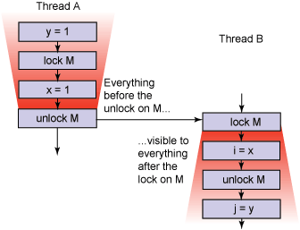

# 修复 Java 内存模型，第 2 部分
在 JSR 133 中 JMM 会有什么改变？

**标签:** Java

[原文链接](https://developer.ibm.com/zh/articles/j-jtp03304/)

Brian Goetz

发布: 2004-04-01

* * *

开始编写并发代码是一件困难的事情，语言不应当增加它的难度。虽然 Java 平台从一开始就包括了对线程的支持，包括一个计划为正确同步的程序提供”一次编写，到处运行”保证的、跨平台的内存模型，但是原来的内存模型有一些漏洞。虽然许多 Java 平台提供了比 JMM 所要求的更强的保证，但是 JMM 中的漏洞使得无法容易地编写可以在任何平台上运行的并发 Java 程序。所以在 2001 年 5 月，成立了以修复 Java 内存模型为目的的 JSR 133。 [上个月](https://www.ibm.com/developerworks/cn/java/j-jtp02244/) ，我讨论了其中一些漏洞，这个月，我们将讨论如何堵住它们。

## 修复后的可见性

理解 JMM 所需要的一个关键概念是 _可见性（visibility）_ ——如何知道当线程 A 执行 `someVariable?=?3` 时，其他线程是否可以看到线程 A 所写的值 3？有一些原因使其他线程不能立即看到 `someVariable` 的值 3：可能是因为编译器为了执行效率更高而重新排序了指令，也可能是 `someVariable` 缓存在寄存器中，或者它的值写到写处理器的缓存中、但是还没有刷新到主存中，或者在读处理器的缓存中有一个老的（或者无效的）值。内存模型决定什么时候一个线程可以可靠地”看到”由其他线程对变量的写入。特别是，内存模型定义了保证内存操作跨线程的可见性的 `volatile` 、 `synchronized` 和 `final` 的语义。

##### 不要错过本系列的其他内容

第 1 部分” [什么是 Java 内存模型，最初它是怎样被破坏的？](https://www.ibm.com/developerworks/cn/java/j-jtp02244/)”（2004 年 2 月）

当线程为释放相关监视器而退出一个同步块时，JMM 要求本地处理器缓冲刷新到主存中。（实际上，内存模型不涉及缓存——它涉及一个抽象（ _本地内存_ ）, 它包围了缓存、注册表和其他硬件和编译优化。）与此类似，作为获得监视的一部分，当进入一个同步块时，本地缓存失效，使之后的读操作直接进入主内存而不是本地缓存。这一过程保证当变量是由一个线程在由给定监视器保护的同步块中写入，并由另一个线程在由同一监视器保护的同步块中读取时，对变量的写可被读线程看到。如果没有同步，则 JMM 不提供这种保证——这就是为什么在多个线程访问同一个变量时，必须使用同步（或者它的更年轻的同胞 `volatile` ）。

## 对 volatile 的新保证

`volatile` 原来的语义只保证 `volatile` 字段的读写直接在主存而不是寄存器或者本地处理器缓存中进行，并且代表线程对 volatile 变量进行的这些操作是按线程要求的顺序进行的。换句话说，这意味着老的内存模型只保证正在读或写的变量的可见性，不保证写入其他变量的可见性。虽然可以容易实现它，但是它没有像最初设想的那么有用。

虽然对 volatile 变量的读和写不能与对其他 volatile 变量的读和写一起重新排序，但是它们仍然可以与对 nonvolatile 变量的读写一起重新排序。在 [第 1 部分](https://www.ibm.com/developerworks/cn/java/j-jtp02244/) 中，介绍了清单 1 的代码（在旧的内存模型中）是如何不足以保证线程 B 看到 `configOptions` 及通过 `configOptions` 间接可及的所有变量（如 `Map` 元素）的正确值，因为 `configOptions` 的初始化可能已经随 volatile `initialized` 变量进行重新排序。

<h5 id=”清单-1-用一个-volatile-变量作为” 守护”>清单 1. 用一个 volatile 变量作为”守护”

```
Map configOptions;
char[] configText;
volatile boolean initialized = false;
// In Thread A
configOptions = new HashMap();
configText = readConfigFile(fileName);
processConfigOptions(configText, configOptions);
initialized = true;
// In Thread B
while (!initialized)
sleep();
// use configOptions

```

Show moreShow more icon

不幸地，这是 volatile 常见用例——用一个 volatile 字段作为”守护”表明已经初始化了一组共享变量。JSR 133 Expert Group 决定让 volatile 读写不能与其他内存操作一起重新排序是有意义的——可以准确地支持这种和其他类似的用例。在新的内存模型下，如果当线程 A 写入 volatile 变量 V 而线程 B 读取 V 时，那么在写入 V 时，A 可见的所有变量值现在都可以保证对 B 是可见的。结果就是作用更大的 `volatile` 语义，代价是访问 volatile 字段时会对性能产生更大的影响。

## 在这之前发生了什么？

像对变量的读写这样的操作，在线程中是根据所谓的”程序顺序”——程序的语义声明它们应当发生的顺序——排序的。（编译器实际上对在线程中使用程序顺序是可以有一些自由的——只要保留了 as-if-serial 语义。）在不同线程中的操作完全不一定要彼此排序——如果启动两个线程并且它们对任何公共监视器都不用同步执行、或者涉及任何公共 volatile 变量，则完全 _无法_ 准确地预言一个线程中的操作（或者对第三个线程可见）相对于另一个线程中操作的顺序。

此外，排序保证是在线程启动、一个线程参与另一个线程、一个线程获得或者释放一个监视器（进入或者退出一个同步块）、或者一个线程访问一个 volatile 变量时创建的。JMM 描述了程序使用同步或者 volatile 变量以协调多个线程中的活动时所进行的的顺序保证。新的 JMM 非正式地定义了一个名为 _happens-before_ 的排序，它是程序中所有操作的部分顺序，如下所示：

- 线程中的每一个操作 _happens-before_ 这个线程中在程序顺序中后面出现的每一个操作
- 对监视器的解锁 _happens-before_ 同一监视器上的所有后续锁定
- 对 volatile 字段的写 _happens-before_ 同一 volatile 的每一个后续读
- 对一个线程的 `Thread.start()` 调用 _happens-before_ 在启动的线程中的所有操作
- 线程中的所有操作 _happens-before_ 从这个线程的 `Thread.join()` 成功返回的所有其他线程

这些规则中的第三个——控制对 volatile 变量的读写，是新的并且修正了清单 1 中的例子的问题。因为对 volatile 变量 `initialized` 的写是在初始化 `configOptions` 之后发生的， `configOptions` 的使用是在 `initialized` 的读后发生的，而对 `initialized` 的读是在对 `initialized` 的写后发生的，因此可以得出结论，线程 A 对 `configOptions` 的初始化是在线程 B 使用 `configOptions` 之前发生的。因而 `configOptions` 和通过它可及的变量对于线程 B 是可见的。

##### 图 1\. 用同步保证跨线程的内存写的可见性



### 数据争用

当有一个变量被多个线程读、被至少一个线程写、并且读和写不是按 hanppens-before 关系排序的时，程序就称为有 _数据争取（data race）_ ，因而不是一个”正确同步”的程序。

### 这是否修改了双重检查锁定的问题？

对双重检查锁定问题提出的一种修复是使包含迟缓初始化的实例的字段为一个 volatile 字段。（有关双重检查锁定的问题和对为什么所建议的算法修复不能解决问题的说明请参阅 参考资料 。）在旧的内存模型中，这不能使双重检查锁定成为线程安全的，因为对 volatile 字段的写仍然会与对其他 nonvolatile 字段的写（如新构造的对象的字段）一起重新排序，因而 volatile 实例引用仍然可能包含对一个未构造完的对象的引用。

在新的内存模型中，对双重检查锁定的这个”修复”使 idiom 线程安全。但是仍然不意味着应当使用这个 idiom！双重检查锁定的要点是，它假定是性能优化的，设计用于消除公共代码路径的同步，很大程度上因为对于早期的 JDK 来说，同步是相对昂贵的。不仅非竞争的同步已经便宜 _多_ 了，而且对 `volatile` 语义的新改变也使它在某些平台上比旧的语义昂贵得多。（实际上，对 volatile 字段的每一次读或者写都像是”半个”同步——对 volatile 的读有与监视器所获得的同样的内存语义，对 volatile 的写有与监视器所释放的同样的语义。）所以如果双重检查锁定的目标是提供比更直观的同步方式更好的性能，那么这个”修复的”版本也没有多大帮助。

不使用双重检查锁定，而使用 Initialize-on-demand Holder Class idiom，它提供了迟缓初始化，是线程安全的，而且比双重检查锁定更快且没那么混乱：

**清单 2\. Initialize-On-Demand Holder Class idiom**

```
private static class LazySomethingHolder {
public static Something something = new Something();
}
...
public static Something getInstance() {
return LazySomethingHolder.something;
}

```

Show moreShow more icon

这个 idiom 由属于类初始化的操作（如静态初始化器）保证对使用这个类的所有线程都是可见的这一事实衍生其线程安全性，内部类直到有线程引用其字段或者方法时才装载这一事实衍生出迟缓初始化。

## 初始化安全性

新的 JMM 还寻求提供一种新的 _初始化安全性_ 保证——只要对象是正确构造的（意即不会在构造函数完成之前发布对这个对象的引用），然后所有线程都会看到在构造函数中设置的 final 字段的值，不管是否使用同步在线程之间传递这个引用。而且，所有可以通过正确构造的对象的 final 字段可及的变量，如用一个 final 字段引用的对象的 final 字段，也保证对其他线程是可见的。这意味着如果 final 字段包含，比如说对一个 `LinkedList` 的引用，除了引用的正确的值对于其他线程是可见的外，这个 `LinkedList` 在构造时的内容在不同步的情况下，对于其他线程也是可见的。结果是显著增强了 `final` 的意义——可以不用同步安全地访问这个 final 字段，编译器可以假定 final 字段将不会改变，因而可以优化多次提取。

### Final 意味着最终

在 [第 1 部分](https://www.ibm.com/developerworks/cn/java/j-jtp02244/) 描述了在旧的内存模型中，final 字段的值似乎可以改变的一种机制——在不使用同步时,另一个线程会首先看到 final 字段的默认值，然后看到正确的值。

在新的内存模型中，在构造函数的 final 字段的写与在另一个线程中对这个对象的共享引用的初次装载之间有一个类似于 happens-before 的关系。当构造函数完成任务时，对 final 字段的所有写（以及通过这些 final 字段间接可及的变量）变为”冻结”，所有在冻结之后获得对这个对象的引用的线程都会保证看到所有冻结字段的冻结值。初始化 final 字段的写将不会与构造函数关联的冻结后面的操作一起重新排序。

## 结束语

JSR 133 显著增强了 `volatile` 的语义，这样就可以可靠地使用 volatile 标志表明程序状态被另一个线程改变了。作为使 volatile 更”重量级”的结果，使用 volatile 的性能成本更接近于某些情况下同步的性能成本，但是在大多数平台上性能成本仍然相当低。JSR 133 还显著地增强了 `final` 的语义。如果一个对象的引用在构造阶段不允许逸出（escape），那么一旦构造函数完成，并且线程发布了对另一个对象的引用，那么在不使用同步的条件下，这个对象的 final 字段就保证对所有其他线程是可见的、正确的并且是不变的。

这些改变极大地加强了并发程序中不变对象的效用，不变对象最终成为固有的线程安全（就像它们所要成为的那样），即使使用数据争用在线程之间将引用传递给不变对象。

初始化安全性的一个告诫是对象的引用不许”逸出”其构造函数——构造函数不应直接或者间接发布对正在构造的对象的引用。这包括发布对 nonstatic 内部类的引用，并一般要避免在构造函数中启动线程。有关安全构造的更详细说明，请参阅参考资源。