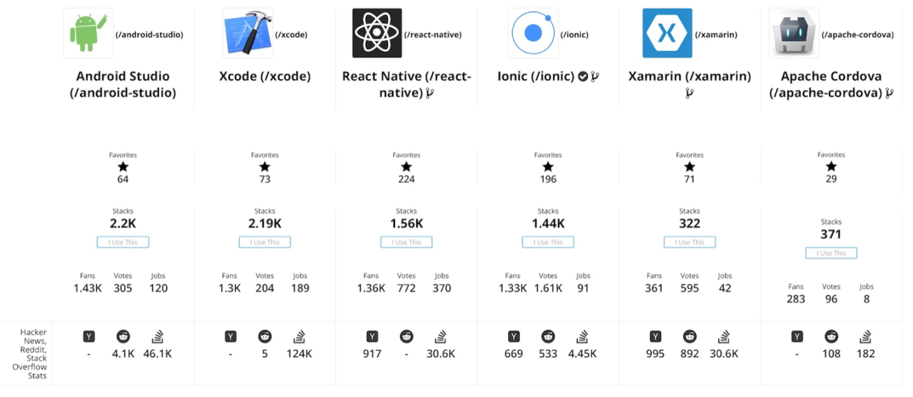

# 全栈移动开发入门
全方位介绍如何使用原生与混合移动框架进行移动应用程序开发

**标签:** 移动开发

[原文链接](https://developer.ibm.com/zh/articles/getting-started-with-full-stack-mobile-development/)

Kevin Ready

发布: 2020-04-02

* * *

本文探讨了全栈移动开发环境的功能，并介绍了若干个核心的原生和混合移动备选方案以及影响每个平台选择的因素。

首先，我们来弄清楚一些概念。看到 _全栈_ 一词时，我们很容易联想到一个人几乎样样精通，既具备系统管理员的技能，也具备数据库工程师的技能。在某些特殊情况下，可能刚好需要全栈开发者。通常全栈开发者既熟悉前端框架、后端数据库和服务的业务逻辑和流程，也能自动创建、编辑和配置应用程序和数据。他们制作和编辑媒体的能力相对较弱，因为媒体需要的是展示和交互。

全栈移动应用程序开发是衔接内容与技术的纽带。现在，全球有数十亿人使用智能手机和平板电脑，这些智能手机和平板电脑便构成了全栈应用程序的客户端。服务器端通常是微服务、认证服务器和 CDN 资产（每次打开应用程序时在运行时进行编译）的分布式集合。这两者是通过流程来衔接的，这些流程包括测试、持续集成和持续部署、扩展和容器化以及专有设备要求。

设备正在决定媒体的展示和使用方式。在许多情况下，与传统电视和广播相比，人们更倾向在手持式设备上观看、阅读或收听新闻与娱乐资讯。电视本身就是开发者的设备目标。

作为技术的纽带，移动设备推动了 Apple、Google、Facebook 和 Microsoft® 等大型跨国公司的竞争范式。这些商业巨头都对抢占设备受众有极大的兴趣。虽然 Apple 和 Google 分别代表 iOS 和 Android 两大品牌阵营，但您可以使用后两者公司的 React Native（Facebook）和 Xamarin（Microsoft®）产品来开发在设计和功能上越来越本土化的应用程序。许多科技公司正在竭尽全力地在这个市场中保持持续增长，并且正在积极寻找最先进且最有前景的技术，帮助实现其提供最佳服务的愿景。

## 全栈移动开发

要成为全栈移动开发者，您需要对应用开发的全局有一个了解。

这包括：

- 设备界面外观
- 可访问来获得内容和进行数据处理的服务器和容器
- 开发流程，如测试和调试
- 在许多备选方案中选择解决方案的理由和权衡因素

如果必须要选择全栈开发者具备的最可取特质，那么将会是领导项目并有效沟通易于理解的流程的能力。全栈开发者必须能够设置代码库、项目管理工具（例如 Jira）、通信应用（例如 Slack），并且必须熟悉各种客户机框架、数据库、API 和微服务。总而言之，他们必须能够支持和影响项目管理决策。全栈开发者除了具备客户机和服务器堆栈能力外，还与应用程序的架构师或项目经理共享许多特质。

### 全栈移动开发的客户端

从广义上讲，客户端可分为原生和混合两座孤岛。通常，当需要更高的性能时，您希望尽可能都是原生客户端。混合开发的优势往往来自使用熟悉的 Web 工具和构造。开发者通常需要选择是从头开始学习并使用一种语言，例如 Swift 或 Kotlin，还是沿用已经熟悉的语言（例如 JavaScript 和 CSS）。混合开发的另一个优势是，可能会对多台设备使用同一组组件和样式。每台设备都有自己特有的外观品质，但与原生应用程序不同，这些品质可能来自同一个来源。

阅读“ [在原生和跨平台移动前端编程框架之间进行选择](/zh/articles/deciding-between-native-and-cross-platform-mobile-frontend-programming-frameworks/)”，以深入了解全栈移动开发的客户端。

### 全栈移动开发的服务器端

服务器端的移动应用开发很大程度上类似于桌面或 Web 服务器应用程序开发。不同之处包括：在设备上安装新应用程序（即 Apple Store 或 Google Play）的方式受限制；服务器端功能都绑定到同一操作系统，以及可使用特定服务（例如 Meteor 或 Ionic）更新设备应用程序的方式有细微差别。相似之处包括：通过 API 调用与数据交互的方式；通过版本控制更新内容，以及确保可扩展性和持久性。在整个项目中，全栈开发者通常会研究如何在构成应用程序服务器端的各个微服务层之间实现处理负载、缓存负载和其他任务负载的最佳平衡。

请阅读“ [使用移动后端技术开发全堆栈移动应用](/zh/articles/develop-full-stack-mobile-apps-by-using-mobile-backend-technologies/)”，以深入了解全栈移动开发的服务器端。

## 全栈移动开发环境的特性

全栈移动应用开发者可能需要确保其生产环境具备以下特性。与后端或前端问题相比，全栈开发者可能更熟悉这些特性。

- **自动化**：我们通常是通过持续集成和持续部署之类的术语来了解“自动化”概念。对于当前的移动应用开发者而言，使更新不会破坏应用程序或使应用程序脱机，这一点至关重要。
- **可扩展性**：从设计角度讲，可扩展性与自动化密切相关，也是处理部署的。这包括容器化（例如 Docker）以及数据库和磁盘冗余，可确保可靠性并防止数据丢失。如果未正确设计可扩展性，那么开发者的前期工作越成功，后期的扩展工作就越困难。CDN、缓存以及在网络中添加和移除区块的能力都会导致这一现象。
- **反馈环**：可以在多个位置提供用户反馈，以便为开发者提供指导。这可以包括测试框架和构建机制，也可以包括通过界面或会话跟踪来获取用户反馈，以了解用户通常使用应用程序的方式或者用户无法使用哪些应用程序功能。
- **辅助功能选项、国际化和本地化**：利用个人增强功能（例如，辅助功能选项、语言和本地化），可以接触到以前被忽视的群体，从而为更广泛的受众提升应用程序的价值。如果使用变量代替文本，那么实现本地化和国际化就毫无意义。辅助功能选项尚未在 Web 内容设计中扎根。例如，与 Internet Explorer 用户数相比，有更多人可以使用辅助功能。当考虑服务难度不大的市场规模时，移动开发者应承担起责任并努力解决这些问题。通过平衡对开发时间的影响，可以实现每一个辅助功能的优势。

## 选择移动开发框架

选择适当的工具组合来构建移动应用取决于多个条件，包括：

- 工具的易用性及其生态系统
- 与设备相符的内容外观，包括字体和图标
- 用户体验和激赞效果
- 与第三方 API 和网络服务的集成
- 社区支持：通过 fork、star、点赞和其他其他评价机制判断
- 文档和当前示例
- 对于先前已知代码和构造的熟悉程度（例如，熟悉 React 或 ReactNative 框架）

竞争需求影响软件选择的程度取决于多种因素，包括时间、预算和人群目标。通常都没有最佳答案，但是出于某些原因，对于特定的应用程序和目标受众来说，某些方法比其他方法更有意义。 表 1 展示移动应用程序开发的六种常用工具。

核心软件iOSAndroidWeb优点缺点XCodeX用于开发 iOS 和 MacOS 应用程序的唯一方法。大型且专有；强制开发者包含它及其 IDE 选项。Android StudioXAndroid Simulator；大型插件社区。JetBrains 工具（非 Eclipse）或其他 IDE（面向熟悉这些 Java™ 工具的用户）。Apache CordovaXXX将 WebView 直接移植到原生实现。在线文章和源码不一定是最新的。XamarinXXVisual Studio 和 C#；为 Microsoft 开发者所熟悉。Microsoft 代码和服务偏差。React NativeXX大型社区和生态系统。混合应用程序的速度不如原生应用程序。IonicXXX区分免费版和专业版；专业版具有包含持续集成和测试的服务器端功能。混合应用程序的速度不如原生应用程序；大小不如社区；Angular 偏差。

乍看起来，您已经可以确定，如果要包含 iOS 目标群体，那么您需要Apple ID 以及关联帐户并安装 XCode。对于 Android，虽然此处不明确，但是通过 Android Studio 可最轻松地访问设备模拟器。这通常表明最快速的应用是采用 Apple 或 Google 支持的软件所编写。其他四种工具的较大优势来自将常用代码集成到原生应用中，这意味着 Web 开发者会由于生产期间的学习曲线损失较少时间。

### IDE、CLI 和包装器

集成开发环境（IDE）的普及时间超过因特网。命令行界面（CLI）虽然早于 IDE，但是通过开源经历了重生，接纳 CLI 作为如今创建应用的最典型方式。移动应用程序引入了包装器技术的概念：类似 Web页面上的某个插件，与其周围的浏览器包装器进行通信。

例如，在 React 中构建应用程序时，在发布该应用程序之前会进行转换。在该过程中，代码按照 Webpack 配置文件中的定义，转换为在所有目标设备和浏览器中都适用的内容。如果在设备的包装技术中融入此过程，那么将涉及类似于将 Babel 或 Typescript 执行的转换应用于客户机应用程序整体的操作。包装器是与其自身（其父代）以及其子代通信的shell（命令解析器）。

几种经过审核的软件包括 IDE、版本控制、部署和 CLI 配套软件；其他软件需要包装技术才能编辑移动应用。例如，Ionic 通常在 Cordova 包装器中进行编写，Xamarin 和 React 也可以如此。在 Mac 上使用 XCode 编写 iOS 非常重要。它是用于为 Apple 设备开发原生应用程序的软件的唯一必备项。Apache Cordova 因为能够导出到浏览器而脱颖而出。对于希望具有单个适用于移动 Web 和设备应用程序的代码库的人员而言，Apache Cordova 由于针对大多数平台而保持位列首选。请参阅表 2 以获取每个移动开发框架的 IDE、CLI、操作系统和语言比较。

核心软件IDECLI操作系统语言[XCode](https://developer.apple.com/xcode/downloads/)XCodexcodebuildOSXSwift、ObjectiveC[Android Studio](https://developer.android.com/studio/)Android StudiogradlewOSX、Linux®、Windows™Java、Kotlin[Apache Cordova](https://cordova.apache.org/)PhoneGap、Builder 等cordovaOSX、Linux、WindowsNode、JavaScript[Xamarin](https://www.xamarin.com/download)Visual Studiomsbuild 等Windows、OSXC#、F#、VisualBasic[React Native](https://facebook.github.io/react-native/)Atom、Sublime 等react-native、expo 等OSX、Linux、WindowsNode、JavaScript[Ionic](https://ionicframework.com/docs/intro/installation/)Visual Studio、Atom 等ionicOSX、Linux、WindowsNode、TypeScript、JavaScript

在编写本文时（2018 年底），Swift 4 是用于编写 XCode iOS 应用程序的最新且最常用的语言。对于 Android Studio，Kotlin 语言逐渐超越了 Java 语言。在其余四种工具中，Xamarin 在 C# 和 .net 环境中独立使用，而其他工具更适合混合开发平台。Ionic 是从 Angular 根构建的，React Native 是从 React 根构建的，而 Apache Cordova 是所有混合内容的开源不可知中心。它最接近于可以将任何 Web 内容转换为特定应用程序的组中的瑞士军刀。

### 依赖项简介

将具有大量依赖项的开源应用程序保持稳定可能令人望而生畏。对于许多应用程序，yarn 已将 `npm` 替换为最常用的软件包管理器来对其进行处理。二者现在均会生成包含依赖项的版本号的 .lock 文件。.lock 文件将特定版本的库与项目关联，在一个或多个库合作伙伴可能不再支持一个或多个依赖项后，使得项目在未来某个时间点能够重新编译。

在线示例通常会混用多种技术，并且很难找到可以精确满足您需求的现有堆栈。通过 [StackShare](https://stackshare.io/) 和其他站点，您可以了解其他人员使用的技术堆栈，比较使用情况，并且寻求与技术堆栈尽可能接近的组合。每次发现与您所查找接近的技术堆栈，就需要检查库的日期，并确保使用尽可能最新的版本。这可能要求您编辑已经存在但可能过期的堆栈。

### 开发者和贡献者社区

选择适当的软件进行移动应用开发时要考虑的因素包括开发者和贡献者社区的规模。技术能捕获多少心智？支持的可用性如何，访问或使用它是否有付费？ 虽然一项技术在特定时刻声称得倒大量支持，但其相对于竞争对手的长期表现如何？

5 年前，最重要的框架是 Angular。如今，Angular 已演变为 Ionic，并且可以包含在 Apache Cordova 包装的应用程序中。对于 Xamarin 提供的所有功能，其核心产品基于Microsoft 语言，这是许多开发者仍在追随而同样数量的开发者正竭力避免的语言。React 和 React Native 是当今最流行的客户端框架，但是这是一个历史悠久的市场，众所周知，它经常会发生变化。

图 1 来自 [stackshare.io](https://stackshare.io/)，这是一个可用于在多条轴线上（多维度）对技术堆栈进行比较的站点，捕获于 2018 年 5 月。您可以使用 stackshare.io 来帮助制定哪种移动开发框架适合您的解决方案的决策。

图 1\. 比较技术堆栈

最后，Microsoft、Google 和 Apple 每年都会召开开发者大会，他们在会上发布新产品并演示产品路线图。2018 年，发布了适用于移动应用的 AI、XR 和 IoT 功能。简而言之，在移动开发中，事物不会一成不变，因此，请通过在开发过程中执行搜索来始终确保信息为最新状态。

## 结束语及后续步骤

本文简要介绍了用于开发全栈移动应用程序的一些最常用的工具（2018 年）。其中只是介绍了一些核心概念、注意事项、依赖项和生态系统，并且将重点内容留在后续文章和教程中进行介绍。

以最有成效和完全受支持的方式混合生态系统和依赖项或工具和技术是一个永无止境的过程。目前有效的内容在不远的将来不一定有效。全栈移动开发者总是能欣然接受各种变化，因为唯一永恒不变的是变化。

本文翻译自： [Getting started with full-stack mobile development](https://developer.ibm.com/articles/getting-started-with-full-stack-mobile-development/)（2019-07-02）