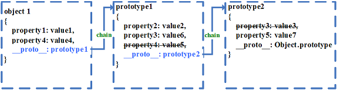
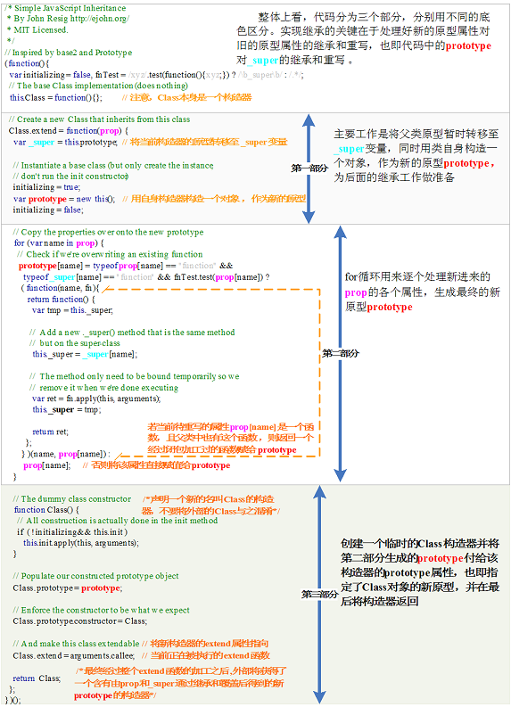

# 全面理解面向对象的 JavaScript
从对语言感悟的角度阐述为什么 JavaScript 是一门彻底的面向对象的语言

**标签:** JavaScript,Web 开发

[原文链接](https://developer.ibm.com/zh/articles/1304-zengyz-jsoo/)

曾滢著

发布: 2013-04-17

* * *

## 前言

当今 JavaScript 大行其道，各种应用对其依赖日深。web 程序员已逐渐习惯使用各种优秀的 JavaScript 框架快速开发 Web 应用，从而忽略了对原生 JavaScript 的学习和深入理解。所以，经常出现的情况是，很多做了多年 JS 开发的程序员对闭包、函数式编程、原型总是说不清道不明，即使使用了框架，其代码组织也非常糟糕。这都是对原生 JavaScript 语言特性理解不够的表现。要掌握好 JavaScript，首先一点是必须摒弃一些其他高级语言如 Java、C# 等类式面向对象思维的干扰，全面地从函数式语言的角度理解 JavaScript 原型式面向对象的特点。把握好这一点之后，才有可能进一步使用好这门语言。本文适合群体：使用过 JS 框架但对 JS 语言本质缺乏理解的程序员，具有 Java、C++ 等语言开发经验，准备学习并使用 JavaScript 的程序员，以及一直对 JavaScript 是否面向对象模棱两可，但希望知道真相的 JS 爱好者。

## 重新认识面向对象

为了说明 JavaScript 是一门彻底的面向对象的语言，首先有必要从面向对象的概念着手 , 探讨一下面向对象中的几个概念：

- 一切事物皆对象
- 对象具有封装和继承特性
- 对象与对象之间使用消息通信，各自存在信息隐藏

以这三点做为依据，C++ 是半面向对象半面向过程语言，因为，虽然他实现了类的封装、继承和多态，但存在非对象性质的全局函数和变量。Java、C# 是完全的面向对象语言，它们通过类的形式组织函数和变量，使之不能脱离对象存在。但这里函数本身是一个过程，只是依附在某个类上。

然而，面向对象仅仅是一个概念或者编程思想而已，它不应该依赖于某个语言存在。比如 Java 采用面向对象思想构造其语言，它实现了类、继承、派生、多态、接口等机制。但是这些机制，只是实现面向对象编程的一种手段，而非必须。换言之，一门语言可以根据其自身特性选择合适的方式来实现面向对象。所以，由于大多数程序员首先学习或者使用的是类似 Java、C++ 等高级编译型语言（Java 虽然是半编译半解释，但一般做为编译型来讲解），因而先入为主地接受了”类”这个面向对象实现方式，从而在学习脚本语言的时候，习惯性地用类式面向对象语言中的概念来判断该语言是否是面向对象语言，或者是否具备面向对象特性。这也是阻碍程序员深入学习并掌握 JavaScript 的重要原因之一。

实际上，JavaScript 语言是通过一种叫做 **原型（ prototype ）** 的方式来实现面向对象编程的。下面就来讨论 **基于类的（ class-based ）面向对象** 和 **基于原型的 ( prototype-based ) 面向对象** 这两种方式在构造客观世界的方式上的差别。

## 基于类的面向对象和基于原型的面向对象方式比较

在基于类的面向对象方式中， **对象（ object ）** 依靠 **类（ class ）** 来产生。而在基于原型的面向对象方式中， **对象（ object ）** 则是依靠 **构造器（ constructor ）** 利用 **原型（ prototype ）** 构造出来的。举个客观世界的例子来说明二种方式认知的差异。例如工厂造一辆车，一方面，工人必须参照一张工程图纸，设计规定这辆车应该如何制造。这里的工程图纸就好比是语言中的 **类 ( class )** ，而车就是按照这个 **类（ class ）** 制造出来的；另一方面，工人和机器 ( 相当于 constructor) 利用各种零部件如发动机，轮胎，方向盘 ( 相当于 prototype 的各个属性 ) 将汽车构造出来。

事实上关于这两种方式谁更为彻底地表达了面向对象的思想，目前尚有争论。但笔者认为原型式面向对象是一种更为彻底的面向对象方式，理由如下：

首先，客观世界中的对象的产生都是其它实物对象构造的结果，而抽象的”图纸”是不能产生”汽车”的，也就是说，类是一个抽象概念而并非实体，而对象的产生是一个实体的产生；

其次，按照一切事物皆对象这个最基本的面向对象的法则来看，类 (class) 本身并不是一个对象，然而原型方式中的构造器 (constructor) 和原型 (prototype) 本身也是其他对象通过原型方式构造出来的对象。

再次，在类式面向对象语言中，对象的状态 (state) 由对象实例 (instance) 所持有，对象的行为方法 (method) 则由声明该对象的类所持有，并且只有对象的结构和方法能够被继承；而在原型式面向对象语言中，对象的行为、状态都属于对象本身，并且能够一起被继承（ 参考资源 ），这也更贴近客观实际。

最后，类式面向对象语言比如 Java，为了弥补无法使用面向过程语言中全局函数和变量的不便，允许在类中声明静态 (static) 属性和静态方法。而实际上，客观世界不存在所谓静态概念，因为一切事物皆对象！而在原型式面向对象语言中，除内建对象 (build-in object) 外，不允许全局对象、方法或者属性的存在，也没有静态概念。所有语言元素 (primitive) 必须依赖对象存在。但由于函数式语言的特点，语言元素所依赖的对象是随着运行时 (runtime) 上下文 (context) 变化而变化的，具体体现在 this 指针的变化。正是这种特点更贴近 “万物皆有所属，宇宙乃万物生存之根本”的自然观点。在 清单 1 中 **window** 便类似与宇宙的概念。

##### 清单 1\. 对象的上下文依赖

```
<script> var str = "我是一个 String 对象 , 我声明在这里 , 但我不是独立存在的！" var obj
        = { des: "我是一个 Object 对象 , 我声明在这里，我也不是独立存在的。" }; var fun = function() { console.log( "我是一个
        Function 对象！谁调用我，我属于谁：", this ); }; obj.fun = fun; console.log( this === window ); // 打印
        true console.log( window.str === str ); // 打印 true console.log( window.obj === obj ); // 打印
        true console.log( window.fun === fun ); // 打印 true fun(); // 打印 我是一个 Function
        对象！谁调用我，我属于谁：window obj.fun(); // 打印 我是一个 Function 对象！谁调用我，我属于谁：obj fun.apply(str); // 打印
        我是一个 Function 对象！谁调用我，我属于谁：str </script>

```

Show moreShow more icon

在接受了面向对象存在一种叫做基于原型实现的方式的事实之后，下面我们就可以来深入探讨 ECMAScript 是如何依据这一方式构造自己的语言的。

## 最基本的面向对象

_ECMAScript_ 是一门彻底的面向对象的编程语言（ 参考资源 ），JavaScript 是其中的一个变种 (variant)。它提供了 6 种基本数据类型，即 Boolean、Number、String、Null、Undefined、Object。为了实现面向对象， _ECMAScript_ 设计出了一种非常成功的数据结构 – JSON(JavaScript Object Notation), 这一经典结构已经可以脱离语言而成为一种广泛应用的数据交互格式 （ 参考资源 ）。

应该说，具有基本数据类型和 JSON 构造语法的 ECMAScript 已经基本可以实现面向对象的编程了。开发者可以随意地用 **字面式声明（ literal notation ）** 方式来构造一个对象，并对其不存在的属性直接赋值，或者用 delete 将属性删除 ( 注：JS 中的 delete 关键字用于删除对象属性，经常被误作为 C++ 中的 delete，而后者是用于释放不再使用的对象 )，如清单 2。

##### 清单 2\. 字面式 (literal notation) 对象声明

```
var person = { name: "张三”, age: 26, gender: "男”, eat: function(
        stuff ) { alert( "我在吃” + stuff ); } }; person.height = 176; delete person[ "age” ];

```

Show moreShow more icon

在实际开发过程中，大部分初学者或者对 JS 应用没有太高要求的开发者也基本上只用到 ECMAScript 定义的这一部分内容，就能满足基本的开发需求。然而，这样的代码复用性非常弱，与其他实现了继承、派生、多态等等的类式面向对象的强类型语言比较起来显得有些干瘪，不能满足复杂的 JS 应用开发。所以 ECMAScript 引入原型来解决对象继承问题。

## 使用函数构造器构造对象

除了 **字面式声明（ literal notation ）** 方式之外，ECMAScript 允许通过 **构造器（constructor）** 创建对象。每个构造器实际上是一个 **函数（ function ） 对象**, 该函数对象含有一个”prototype”属性用于实现 **基于原型的继承 （ prototype-based inheritance ）** 和 **共享属性（ shared properties ） _。_** 对象可以由”new 关键字 + 构造器调用”的方式来创建，如清单 3：

##### 清单 3\. 使用构造器 (constructor) 创建对象

```
// 构造器 Person 本身是一个函数对象 function Person() { // 此处可做一些初始化工作 }
        // 它有一个名叫 prototype 的属性 Person.prototype = { name: "张三”, age: 26, gender: "男”, eat:
        function( stuff ) { alert( "我在吃” + stuff ); } } // 使用 new 关键字构造对象 var p = new Person();

```

Show moreShow more icon

由于早期 JavaScript 的发明者为了使这门语言与大名鼎鼎的 Java 拉上关系 ( 虽然现在大家知道二者是雷锋和雷锋塔的关系 )，使用了 **new** 关键字来限定构造器调用并创建对象，以使其在语法上跟 Java 创建对象的方式看上去类似。但需要指出的是，这两门语言的 **new** 含义毫无关系，因为其对象构造的机理完全不同。也正是因为这里语法上的类似，众多习惯了类式面向对象语言中对象创建方式的程序员，难以透彻理解 JS 对象原型构造的方式，因为他们总是不明白在 JS 语言中，为什么”函数名可以作为类名”的现象。而实质上，JS 这里仅仅是借用了关键字 new，仅此而已；换句话说，ECMAScript 完全可以用其它 **非 new** 表达式来用调用构造器创建对象。

## 彻底理解原型链 (prototype chain)

在 ECMAScript 中，每个由构造器创建的对象拥有一个指向构造器 prototype 属性值的 **隐式引用（ implicit reference ）** ，这个引用称之为 **原型（ prototype ）** 。进一步，每个原型可以拥有指向自己原型的 **隐式引用** （即该原型的原型），如此下去，这就是所谓的 **原型链（ prototype chain ）** （ 参考资源 ）。在具体的语言实现中，每个对象都有一个 **proto 属性** 来实现对原型的 **隐式引用** 。清单 4说明了这一点。

##### 清单 4\. 对象的 **proto** 属性和隐式引用

```
function Person( name ) { this.name = name; } var p = new Person(); //
        对象的隐式引用指向了构造器的 prototype 属性，所以此处打印 true console.log( p.__proto__ === Person.prototype ); //
        原型本身是一个 Object 对象，所以他的隐式引用指向了 // Object 构造器的 prototype 属性 , 故而打印 true console.log(
        Person.prototype.__proto__ === Object.prototype ); // 构造器 Person 本身是一个函数对象，所以此处打印 true
        console.log( Person.__proto__ === Function.prototype );

```

Show moreShow more icon

有了 **原型链** ，便可以定义一种所谓的 **属性隐藏机制** ，并通过这种机制实现继承。ECMAScript 规定，当要给某个对象的属性赋值时，解释器会查找该对象原型链中第一个含有该属性的对象（注：原型本身就是一个对象，那么原型链即为一组对象的链。对象的原型链中的第一个对象是该对象本身）进行赋值。反之，如果要获取某个对象属性的值，解释器自然是返回该对象原型链中首先具有该属性的对象属性值。图 1 说名了这中隐藏机制：

##### 图 1\. 原型链中的属性隐藏机制



在图 1 中，object1->prototype1->prototype2 构成了 对象 object1 的原型链，根据上述属性隐藏机制，可以清楚地看到 prototype1 对象中的 property4 属性和 prototype2 对象中的 property3 属性皆被隐藏。理解了原型链，那么将非常容易理解 JS 中基于原型的继承实现原理，清单 5 是利用原型链实现继承的简单例子。

##### 清单 5\. 利用原型链 Horse->Mammal->Animal 实现继承

```
// 声明 Animal 对象构造器 function Animal() { } // 将
        Animal 的 prototype 属性指向一个对象， // 亦可直接理解为指定 Animal 对象的原型 Animal.prototype = { name: animal",
        weight: 0, eat: function() { alert( "Animal is eating!" ); } } // 声明 Mammal 对象构造器 function
        Mammal() { this.name = "mammal"; } // 指定 Mammal 对象的原型为一个 Animal 对象。 // 实际上此处便是在创建 Mammal 对象和
        Animal 对象之间的原型链 Mammal.prototype = new Animal(); // 声明 Horse 对象构造器 function Horse( height,
        weight ) { this.name = "horse"; this.height = height; this.weight = weight; } // 将 Horse
        对象的原型指定为一个 Mamal 对象，继续构建 Horse 与 Mammal 之间的原型链 Horse.prototype = new Mammal(); // 重新指定 eat
        方法 , 此方法将覆盖从 Animal 原型继承过来的 eat 方法 Horse.prototype.eat = function() { alert( "Horse is
        eating grass!" ); } // 验证并理解原型链 var horse = new Horse( 100, 300 ); console.log(
        horse.__proto__ === Horse.prototype ); console.log( Horse.prototype.__proto__ ===
        Mammal.prototype ); console.log( Mammal.prototype.__proto__ === Animal.prototype );

```

Show moreShow more icon

清单 5 中对象原型继承逻辑实现的关键在于 Horse.prototype = new Mammal() 和 Mammal.prototype = new Animal() 这两句代码。首先，等式右边的结果是构造出一个临时对象，然后将这个对象赋值给等式左边对象的 prototype 属性。也就是说将右边新建的对象作为左边对象的原型。读者可以将这两个等式替换到相应的程序清单 5 代码最后两行的等式中自行领悟。

## JavaScript 类式继承的实现方法

从代码清单 5 可以看出，基于原型的继承方式，虽然实现了代码复用，但其行文松散且不够流畅，可阅读性差，不利于实现扩展和对源代码进行有效地组织管理。不得不承认，类式继承方式在语言实现上更具健壮性，且在构建可复用代码和组织架构程序方面具有明显的优势。这使得程序员们希望寻找到一种能够在 JavaScript 中以类式继承风格进行编码的方法途径。从抽象的角度来讲，既然类式继承和原型继承都是为实现面向对象而设计的，并且他们各自实现的载体语言在计算能力上是等价的 ( 因为图灵机的计算能力与 Lambda 演算的计算能力是等价的 )，那么能不能找到一种变换，使得原型式继承语言通过该变换实现具有类式继承编码的风格呢？

目前一些主流的 JS 框架都提供了这种转换机制，也即类式声明方法，比如 Dojo.declare()、Ext.entend() 等等。用户使用这些框架，可以轻易而友好地组织自己的 JS 代码。其实，在众多框架出现之前，JavaScript 大师 _Douglas Crockford_ 最早利用三个函数对 Function 对象进行扩展，实现了这种变换，关于它的实现细节可以（ 参考资源 ）。此外还有由 _Dean Edwards_ 实现的著名的 Base.js（ 参考资源 ）。值得一提的是，jQuery 之父 _John Resig_ 在搏众家之长之后，用不到 30 行代码便实现了自己的 **Simple Inheritance** 。使用其提供的 extend 方法声明类非常简单。清单 6 是使用了 **Simple Inheritance** 库实现类的声明的例子。其中最后一句打印输出语句是对 **Simple Inheritance** 实现类式继承的最好说明。

##### 清单 6\. 使用 Simple Inheritance 实现类式继承

```
// 声明 Person 类 var Person = Class.extend( { _issleeping:
        true, init: function( name ) { this._name = name; }, isSleeping: function() { return
        this._issleeping; } } ); // 声明 Programmer 类，并继承 Person var Programmer = Person.extend( {
        init: function( name, issleeping ) { // 调用父类构造函数 this._super( name ); // 设置自己的状态
        this._issleeping = issleeping; } } ); var person = new Person( "张三" ); var diors = new
        Programmer( "张江男", false ); // 打印 true console.log( person.isSleeping() ); // 打印 false
        console.log( diors.isSleeping() ); // 此处全为 true，故打印 true console.log( person instanceof
        Person && person instanceof Class && diors instanceof Programmer &&
        diors instanceof Person && diors instanceof Class );

```

Show moreShow more icon

如果您已对原型、函数构造器、闭包和基于上下文的 this 有了充分的理解，那么理解 Simple Inheritance 的实现原理也并非相当困难。从本质上讲， _var Person = Class.extend(…)_ 该语句中，左边的 Person 实际上是获得了由 Class 调用 extend 方法返回的一个构造器，也即一个 function 对象的引用。顺着这个思路，我们继续介绍 Simple Inheritance 是如何做到这一点，进而实现了由原型继承方式到类式继承方式的转换的。图 2 是 Simple Inheritance 的源码及其附带注释。为了方便理解，用中文对代码逐行补充说明。

##### 图 2.Simple Inheritance 源码解析



抛开代码第二部分，整体连贯地考察第一和第三部分会发现，extend 函数的根本目的就是要构造一个具有新原型属性的新构造器。我们不禁感叹 _John Resig_ 的大师手笔及其对 JS 语言本质把握的细腻程度。至于 _John Resig_ 是如何想到这样精妙的实现方法，感兴趣的读者可以阅读本文 （ 参考资源 ），其中有详细介绍关于最初设计 Simple Inheritance 的思维过程。

## JavaScript 私有成员实现

到此为止，如果您任然对 JavaScript 面向对象持怀疑态度，那么这个怀疑一定是，JavaScript 没有实现面向对象中的信息隐藏，即私有和公有。与其他类式面向对象那样显式地声明私有公有成员的方式不同，JavaScript 的信息隐藏就是靠闭包实现的。见清单 7:

##### 清单 7\. 使用闭包实现信息隐藏

```
// 声明 User 构造器 function User( pwd ) { // 定义私有属性 var password = pwd;
        // 定义私有方法 function getPassword() { // 返回了闭包中的 password return password; } //
        特权函数声明，用于该对象其他公有方法能通过该特权方法访问到私有成员 this.passwordService = function() { return getPassword();
        } } // 公有成员声明 User.prototype.checkPassword = function( pwd ) { return this.passwordService()
        === pwd; }; // 验证隐藏性 var u = new User( "123456" ); // 打印 true console.log( u.checkPassword(
        "123456" ) ); // 打印 undefined console.log( u.password ); // 打印 true console.log( typeof
        u.getPassword === "undefined" );

```

Show moreShow more icon

JavaScript 必须依赖闭包实现信息隐藏，是由其函数式语言特性所决定的。本文不会对函数式语言和闭包这两个话题展开讨论，正如上文默认您理解 JavaScript 中基于上下文的 this 一样。关于 JavaScript 中实现信息隐藏， _Douglas Crockford_ 在 _Private members in JavaScript_（ 参考资源 ）一文中有更权威和详细的介绍。

## 结束语

JavaScript 被认为是世界上最受误解的编程语言，因为它身披 c 语言家族的外衣，表现的却是 LISP 风格的函数式语言特性；没有类，却实也彻底实现了面向对象。要对这门语言有透彻的理解，就必须扒开其 c 语言的外衣，从新回到函数式编程的角度，同时摒弃原有类的面向对象概念去学习领悟它。随着近些年来 Web 应用的普及和 JS 语言自身的长足发展，特别是后台 JS 引擎的出现 ( 如基于 V8 的 NodeJS 等 )，可以预见，原来只是作为玩具编写页面效果的 JS 将获得更广阔发展天地。这样的发展趋势，也对 JS 程序员提出了更高要求。只有彻底领悟了这门语言，才有可能在大型的 JS 项目中发挥她的威力。