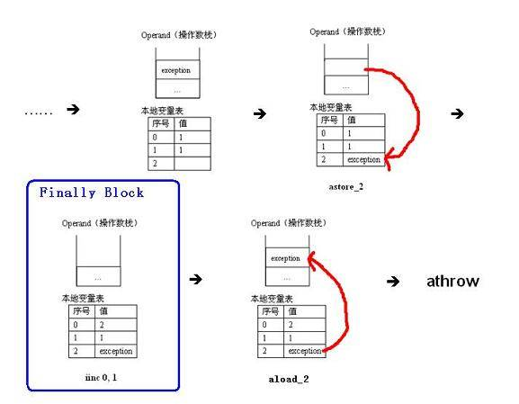

# 关于 Java 中 finally 语句块的深度辨析
以生动形象的案例来带您由浅入深地了解 finally

**标签:** Java

[原文链接](https://developer.ibm.com/zh/articles/j-lo-finally/)

魏成利

发布: 2011-07-13

* * *

可不能小看这个简单的 finally，看似简单的问题背后，却隐藏了无数的玄机。接下来我就带您一步一步的揭开这个 finally 的神秘面纱。

## 问题分析

首先来问大家一个问题：finally 语句块一定会执行吗？

很多人都认为 finally 语句块是肯定要执行的，其中也包括一些很有经验的 Java 程序员。可惜并不像大多人所认为的那样，对于这个问题，答案当然是否定的，我们先来看下面这个例子。

##### 清单 1.

```
public class Test {
public static void main(String[] args) {
System.out.println("return value of test(): " + test());
     }

public static int test() {
int i = 1;

//          if(i == 1)
//              return 0;
System.out.println("the previous statement of try block");
i = i / 0;

try {
    System.out.println("try block");
      return i;
     }finally {
     System.out.println("finally block");
         }
     }
}

```

Show moreShow more icon

清单 1 的执行结果如下：

```
the previous statement of try block
Exception in thread "main" java.lang.ArithmeticException: / by zero
at com.bj.charlie.Test.test(Test.java:15)
at com.bj.charlie.Test.main(Test.java:6)

```

Show moreShow more icon

另外，如果去掉上例中被注释的两条语句前的注释符，执行结果则是：

```
return value of test(): 0

```

Show moreShow more icon

在以上两种情况下，finally 语句块都没有执行，说明什么问题呢？只有与 finally 相对应的 try 语句块得到执行的情况下，finally 语句块才会执行。以上两种情况，都是在 try 语句块之前返回（return）或者抛出异常，所以 try 对应的 finally 语句块没有执行。

那好，即使与 finally 相对应的 try 语句块得到执行的情况下，finally 语句块一定会执行吗？不好意思，这次可能又让大家失望了，答案仍然是否定的。请看下面这个例子（清单 2）。

##### 清单 2.

```
public class Test {
public static void main(String[] args) {
System.out.println("return value of test(): " + test());
     }

public static int test() {
int i = 1;

try {
System.out.println("try block");
System.exit(0);
return i;
}finally {
System.out.println("finally block");
         }
     }
}

```

Show moreShow more icon

清单 2 的执行结果如下：

```
try block

```

Show moreShow more icon

finally 语句块还是没有执行，为什么呢？因为我们在 try 语句块中执行了 System.exit (0) 语句，终止了 Java 虚拟机的运行。那有人说了，在一般的 Java 应用中基本上是不会调用这个 System.exit(0) 方法的。OK ！没有问题，我们不调用 System.exit(0) 这个方法，那么 finally 语句块就一定会执行吗？

再一次让大家失望了，答案还是否定的。当一个线程在执行 try 语句块或者 catch 语句块时被打断（interrupted）或者被终止（killed），与其相对应的 finally 语句块可能不会执行。还有更极端的情况，就是在线程运行 try 语句块或者 catch 语句块时，突然死机或者断电，finally 语句块肯定不会执行了。可能有人认为死机、断电这些理由有些强词夺理，没有关系，我们只是为了说明这个问题。

## finally 语句剖析

说了这么多，还是让我们拿出些有说服力的证据吧！还有什么证据比官方的文档更具说服力呢？让我们来看看官方网站上的《The Java Tutorials》中是怎样来描述 finally 语句块的吧！

以下位于 _\*\*_ 之间的内容原封不动的摘自于《 The Java Tutorials 》文档。

* * *

The finally Block

_The finally block always executes when the try block exits. This ensures that the finally block is executed even if an unexpected exception occurs. But finally is useful for more than just exception handling — it allows the programmer to avoid having cleanup code accidentally bypassed by a return, continue, or break. Putting cleanup code in a finally block is always a good practice, even when no exceptions are anticipated._

_Note: If the JVM exits while the try or catch code is being executed, then the finally block may not execute. Likewise, if the thread executing the try or catch code is interrupted or killed, the finally block may not execute even though the application as a whole continues._

* * *

请仔细阅读并认真体会一下以上两段英文，当你真正的理解了这两段英文的确切含义，你就可以非常自信的来回答”finally 语句块是否一定会执行？”这样的问题。看来，大多时候，并不是 Java 语言本身有多么高深，而是我们忽略了对基础知识的深入理解。

接下来，我们看一下 finally 语句块是怎样执行的。在排除了以上 finally 语句块不执行的情况后，finally 语句块就得保证要执行，既然 finally 语句块一定要执行，那么它和 try 语句块与 catch 语句块的执行顺序又是怎样的呢？还有，如果 try 语句块中有 return 语句，那么 finally 语句块是在 return 之前执行，还是在 return 之后执行呢？带着这样一些问题，我们还是以具体的案例来讲解。

关于 try、catch、finally 的执行顺序问题，我们还是来看看权威的论述吧！以下 _\*\*_ 之间的内容摘自 Java 语言规范第四版（ _《 The Java™ Programming Language, Fourth Edition 》_ ）中对于 try，catch，和 finally 的描述。

* * *

12.4. Try, catch, and finally

_You catch exceptions by enclosing code in Try blocks. The basic syntax for a Try block is:_

_try {_

_statements_

_} catch (exception\_type1 identifier1) {_

_statements_

_} catch (exception\_type2 identifier2) {_

_statements_

_…_

_} finally {_

_statements_

_}_

_where either at least one catch clause, or the finally clause, must be present. The body of the try statement is executed until either an exception is thrown or the body finishes successfully. If an exception is thrown, each catch clause is examined in turn, from first to last, to see whether the type of the exception object is assignable to the type declared in the catch. When an assignable catch clause is found, its block is executed with its identifier set to reference the exception object. No other catch clause will be executed. Any number of catch clauses, including zero, can be associated with a particular TRy as long as each clause catches a different type of exception. If no appropriate catch is found, the exception percolates out of the try statement into any outer try that might have a catch clause to handle it._

_If a finally clause is present with a try, its code is executed after all other processing in the try is complete. This happens no matter how completion was achieved, whether normally, through an exception, or through a control flow statement such as return or break ._

* * *

上面这段文字的大体意思是说，不管 try 语句块正常结束还是异常结束，finally 语句块是保证要执行的。如果 try 语句块正常结束，那么在 try 语句块中的语句都执行完之后，再执行 finally 语句块。如果 try 中有控制转移语句（return、break、continue）呢？那 finally 语句块是在控制转移语句之前执行，还是之后执行呢？似乎从上面的描述中我们还看不出任何端倪，不要着急，后面的讲解中我们会分析这个问题。如果 try 语句块异常结束，应该先去相应的 catch 块做异常处理，然后执行 finally 语句块。同样的问题，如果 catch 语句块中包含控制转移语句呢？ finally 语句块是在这些控制转移语句之前，还是之后执行呢？我们也会在后续讨论中提到。

其实，关于 try，catch，finally 的执行流程远非这么简单，有兴趣的读者可以参考 Java 语言规范第三版（ _《 The Java™ Language Specification, Third Edition 》_ ）中对于 Execution of try-catch-finally 的描述，非常复杂的一个流程。限于篇幅的原因，本文不做摘录，请感兴趣的读者自行阅读。

## finally 语句示例说明

下面，我们先来看一个简单的例子（清单 3）。

##### 清单 3.

```
public class Test {
public static void main(String[] args) {
try {
System.out.println("try block");

return ;
} finally {
System.out.println("finally block");
         }
     }
}

```

Show moreShow more icon

清单 3 的执行结果为：

```
try block
finally block

```

Show moreShow more icon

清单 3 说明 finally 语句块在 try 语句块中的 return 语句之前执行。我们再来看另一个例子（清单 4）。

##### 清单 4.

```
public class Test {
public static void main(String[] args) {
System.out.println("reture value of test() : " + test());
     }

public static int test(){
int i = 1;

try {
System.out.println("try block");
             i = 1 / 0;
return 1;
}catch (Exception e){
System.out.println("exception block");
return 2;
}finally {
System.out.println("finally block");
         }
     }
}

```

Show moreShow more icon

清单 4 的执行结果为：

```
try block
exception block
finally block
reture value of test() : 2

```

Show moreShow more icon

清单 4 说明了 finally 语句块在 catch 语句块中的 return 语句之前执行。

从上面的清单 3 和清单 4，我们可以看出，其实 finally 语句块是在 try 或者 catch 中的 return 语句之前执行的。更加一般的说法是，finally 语句块应该是在控制转移语句之前执行，控制转移语句除了 return 外，还有 break 和 continue。另外，throw 语句也属于控制转移语句。虽然 return、throw、break 和 continue 都是控制转移语句，但是它们之间是有区别的。其中 return 和 throw 把程序控制权转交给它们的调用者（invoker），而 break 和 continue 的控制权是在当前方法内转移。请大家先记住它们的区别，在后续的分析中我们还会谈到。

还是得来点有说服力的证据，下面这段摘自 Java 语言规范第四版（ _《 The Java™ Programming Language, Fourth Edition 》_ ），请读者自己体会一下其含义。

* * *

_A finally clause can also be used to clean up for break , continue , and return , which is one reason you will sometimes see a try clause with no catch clauses. When any control transfer statement is executed, all relevant finally clauses are executed. There is no way to leave a try block without executing its finally clause._

* * *

好了，看到这里，是不是有人认为自己已经掌握了 finally 的用法了？先别忙着下结论，我们再来看两个例子 – 清单 5 和清单 6。

##### 清单 5.

```
public class Test {
public static void main(String[] args) {
        System.out.println("return value of getValue(): " + getValue());
     }

public static int getValue() {
        try {
                 return 0;
        } finally {
                 return 1;
            }
     }
}

```

Show moreShow more icon

清单 5 的执行结果：

```
return value of getValue(): 1

```

Show moreShow more icon

##### 清单 6.

```
public class Test {
public static void main(String[] args) {
        System.out.println("return value of getValue(): " + getValue());
     }

public static int getValue() {
        int i = 1;
        try {
                 return i;
        } finally {
                 i++;
        }
     }
}

```

Show moreShow more icon

清单 6 的执行结果：

```
return value of getValue(): 1

```

Show moreShow more icon

利用我们上面分析得出的结论：finally 语句块是在 try 或者 catch 中的 return 语句之前执行的。 由此，可以轻松的理解清单 5 的执行结果是 1。因为 finally 中的 return 1；语句要在 try 中的 return 0；语句之前执行，那么 finally 中的 return 1；语句执行后，把程序的控制权转交给了它的调用者 main（）函数，并且返回值为 1。那为什么清单 6 的返回值不是 2，而是 1 呢？按照清单 5 的分析逻辑，finally 中的 i++；语句应该在 try 中的 return i；之前执行啊？ i 的初始值为 1，那么执行 i++；之后为 2，再执行 return i；那不就应该是 2 吗？怎么变成 1 了呢？

关于 Java 虚拟机是如何编译 finally 语句块的问题，有兴趣的读者可以参考《 The JavaTM Virtual Machine Specification, Second Edition 》中 7.13 节 Compiling finally。那里详细介绍了 Java 虚拟机是如何编译 finally 语句块。实际上，Java 虚拟机会把 finally 语句块作为 subroutine（对于这个 subroutine 不知该如何翻译为好，干脆就不翻译了，免得产生歧义和误解。）直接插入到 try 语句块或者 catch 语句块的控制转移语句之前。但是，还有另外一个不可忽视的因素，那就是在执行 subroutine（也就是 finally 语句块）之前，try 或者 catch 语句块会保留其返回值到本地变量表（Local Variable Table）中。待 subroutine 执行完毕之后，再恢复保留的返回值到操作数栈中，然后通过 return 或者 throw 语句将其返回给该方法的调用者（invoker）。请注意，前文中我们曾经提到过 return、throw 和 break、continue 的区别，对于这条规则（保留返回值），只适用于 return 和 throw 语句，不适用于 break 和 continue 语句，因为它们根本就没有返回值。

是不是不太好理解，那我们就用具体的例子来做形象的说明吧！

为了能够解释清单 6 的执行结果，我们来分析一下清单 6 的字节码（byte-code）：

```
Compiled from "Test.java"
public class Test extends java.lang.Object{
public Test();
Code:
0:      aload_0
1:invokespecial#1; //Method java/lang/Object."<init>":()V
4:      return

LineNumberTable:
line 1: 0

public static void main(java.lang.String[]);
Code:
0:      getstatic      #2; //Field java/lang/System.out:Ljava/io/PrintStream;
3:      new      #3; //class java/lang/StringBuilder
6:      dup
7:      invokespecial      #4; //Method java/lang/StringBuilder."<init>":()V
10:      ldc      #5; //String return value of getValue():
12:      invokevirtual
#6; //Method java/lang/StringBuilder.append:(
       Ljava/lang/String;)Ljava/lang/StringBuilder;
15:      invokestatic      #7; //Method getValue:()I
18:      invokevirtual
#8; //Method java/lang/StringBuilder.append:(I)Ljava/lang/StringBuilder;
21:      invokevirtual
#9; //Method java/lang/StringBuilder.toString:()Ljava/lang/String;
24:      invokevirtual      #10; //Method java/io/PrintStream.println:(Ljava/lang/String;)V
27:      return

public static int getValue();
Code:
0:      iconst_1
1:      istore_0
2:      iload_0
3:      istore_1
4:      iinc      0, 1
7:      iload_1
8:      ireturn
9:      astore_2
10:      iinc      0, 1
13:      aload_2
14:      athrow
Exception table:
from   to  target type
     2     4     9   any
     9    10     9   any
}

```

Show moreShow more icon

对于 Test（）构造方法与 main（）方法，在这里，我们不做过多解释。让我们来分析一下 getValue（）方法的执行。在这之前，先让我把 getValue（）中用到的虚拟机指令解释一下，以便读者能够正确的理解该函数的执行。

```
1.    iconst_
Description: Push the int constant  (-1, 0, 1, 2, 3, 4 or 5) onto the operand stack.
Forms: iconst_m1 = 2 (0x2)  iconst_0 = 3 (0x3)  iconst_1 = 4 (0x4)
iconst_2 = 5 (0x5) iconst_3 = 6 (0x6)  iconst_4 = 7 (0x7)  iconst_5 = 8 (0x8)

2.    istore_
Description: Store int into local variable. The  must be an index into the
local variable array of the current frame.
Forms: istore_0 = 59 (0x3b)  istore_1 = 60 (0x3c)  istore_2 = 61 (0x3d)
istore_3 = 62 (0x3e)

3.    iload_
Description: Load int from local variable. The  must be an index into the
local variable array of the current frame.
Forms: iload_0 = 26 (0x1a)  iload_1 = 27 (0x1b)  iload_2 = 28 (0x1c)  iload_3 = 29 (0x1d)

4.    iinc index, const
Description: Increment local variable by constant. The index is an unsigned byte that
must be an index into the local variable array of the current frame. The const is an
immediate signed byte. The local variable at index must contain an int. The value
const is first sign-extended to an int, and then the local variable at index is
incremented by that amount.
Forms:  iinc = 132 (0x84)

Format:
iinc
index
const

5.    ireturn
Description: Return int from method.
Forms:  ireturn = 172 (0xac)

6.    astore_
Description: Store reference into local variable. The  must be an index into the
local variable array of the current frame.
Forms: astore_0 = 75 (0x4b) astore_1 = 76 (0x4c) astore_2 =77 (0x4d) astore_3 =78 (0x4e)

7.    aload_
Description: Load reference from local variable. The  must be an index into the
local variable array of the current frame.
Forms: aload_0 = 42 (0x2a) aload_1 = 43 (0x2b) aload_2 = 44 (0x2c) aload_3 = 45 (0x2d)

8.    athrow
Description: Throw exception or error.
Forms: athrow = 191 (0xbf)

```

Show moreShow more icon

有了以上的 Java 虚拟机指令，我们来分析一下其执行顺序：分为正常执行（没有 exception）和异常执行（有 exception）两种情况。我们先来看一下正常执行的情况，如图 1 所示：

##### 图 1\. getValue（）函数正常执行的情况


由上图，我们可以清晰的看出，在 finally 语句块（iinc 0, 1）执行之前，getValue（）方法保存了其返回值（1）到本地表量表中 1 的位置，完成这个任务的指令是 istore\_1；然后执行 finally 语句块（iinc 0, 1），finally 语句块把位于 0 这个位置的本地变量表中的值加 1，变成 2；待 finally 语句块执行完毕之后，把本地表量表中 1 的位置上值恢复到操作数栈（iload\_1），最后执行 ireturn 指令把当前操作数栈中的值（1）返回给其调用者（main）。这就是为什么清单 6 的执行结果是 1，而不是 2 的原因。

再让我们来看看异常执行的情况。是不是有人会问，你的清单 6 中都没有 catch 语句，哪来的异常处理呢？我觉得这是一个好问题，其实，即使没有 catch 语句，Java 编译器编译出的字节码中还是有默认的异常处理的，别忘了，除了需要捕获的异常，还可能有不需捕获的异常（如：RunTimeException 和 Error）。

从 getValue（）方法的字节码中，我们可以看到它的异常处理表（exception table）， 如下：

Exception table:

from to target type

2 4 9 any

它的意思是说：如果从 2 到 4 这段指令出现异常，则由从 9 开始的指令来处理。

##### 图 2\. getValue（）函数异常执行的情况



先说明一点，上图中的 exception 其实应该是 exception 对象的引用，为了方便说明，我直接把它写成 exception 了。

由上图（图 2）可知，当从 2 到 4 这段指令出现异常时，将会产生一个 exception 对象，并且把它压入当前操作数栈的栈顶。接下来是 astore\_2 这条指令，它负责把 exception 对象保存到本地变量表中 2 的位置，然后执行 finally 语句块，待 finally 语句块执行完毕后，再由 aload\_2 这条指令把预先存储的 exception 对象恢复到操作数栈中，最后由 athrow 指令将其返回给该方法的调用者（main）。

通过以上的分析，大家应该已经清楚 try-catch-finally 语句块的执行流程了吧！

为了更具说服力，我们还是来引经据典吧！大家可以不相信我，难道还不相信”高司令”（Gosling）吗？下面这段仍然摘自 Java 语言规范第四版 _《 The Java™ Programming Language, Fourth Edition 》_ ，请读者自己体会吧！

* * *

_a finally clause is always entered with a reason. That reason may be that the try code finished normally, that it executed a control flow statement such as return, or that an exception was thrown in code executed in the Try block. The reason is remembered when the finally clause exits by falling out the bottom. However, if the finally block creates its own reason to leave by executing a control flow statement (such as break or return) or by throwing an exception, that reason supersedes the original one, and the original reason is forgotten. For example, consider the following code: try { //… do something… return 1; } finally { return 2; } When the Try block executes its return, the finally block is entered with the “reason” of returning the value 1. However, inside the finally block the value 2 is returned, so the initial intention is forgotten. In fact, if any of the other code in the try block had thrown an exception, the result would still be to return 2. If the finally block did not return a value but simply fell out the bottom, the “return the value 1 ″ reason would be remembered and carried out._

* * *

好了，有了以上的知识，让我们再来看以下 3 个例子。

##### 清单 7.

```
public class Test {
public static void main(String[] args) {
        System.out.println("return value of getValue(): " + getValue());
     }

@SuppressWarnings("finally")
public static int getValue() {
        int i = 1;
        try {
                 i = 4;
        } finally {
                 i++;
                 return i;
        }
     }
}

```

Show moreShow more icon

清单 7 的执行结果：

```
return value of getValue(): 5

```

Show moreShow more icon

##### 清单 8.

```
public class Test {
public static void main(String[] args) {
        System.out.println("return value of getValue(): " + getValue());
     }

public static int getValue() {
        int i = 1;
        try {
                 i = 4;
        } finally {
                 i++;
        }

        return i;
     }
}

```

Show moreShow more icon

清单 8 的执行结果：

```
return value of getValue(): 5

```

Show moreShow more icon

清单 7 和清单 8 应该还比较简单吧！利用我们上面讲解的知识，很容易分析出其结果。让我们再来看一个稍微复杂一点的例子 – 清单 9。我建议大家最好先不要看执行结果，运用学过的知识来分析一下，看是否能推断出正确的结果。

##### 清单 9.

```
public class Test {
public static void main(String[] args) {
System.out.println(test());
     }

public static String test() {
try {
System.out.println("try block");
return test1();
} finally {
System.out.println("finally block");
         }
     }
public static String test1() {
System.out.println("return statement");
return "after return";
     }
}

```

Show moreShow more icon

清单 9 的结果：

```
try block
return statement
finally block
after return

```

Show moreShow more icon

你分析对了吗？其实这个案例也不算很难， `return test1();` 这条语句等同于 :

```
String tmp = test1();
return tmp;

```

Show moreShow more icon

这样，就应该清楚为什么是上面所示的执行结果了吧！

好了，就写到这吧！希望大家看完这篇文章能够有所收获！

## 总结

没想到吧！一个小小的、看似简单的 finally 语句块背后居然隐藏了这么多玄机。看来，我们平时还是应该认真的阅读 Java 相关的基础文档，比如：Java 语言规范、Java 虚拟机规范等，很多棘手的问题都可以从中得到答案。只有真正的吃透了基础知识，才能达到运用自如的境界！