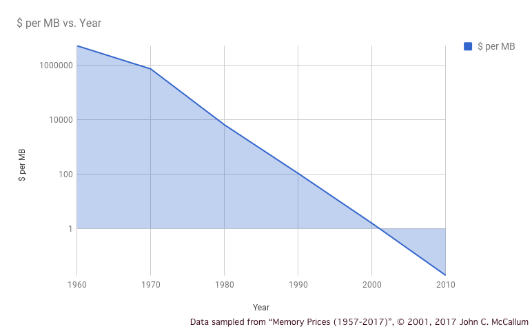
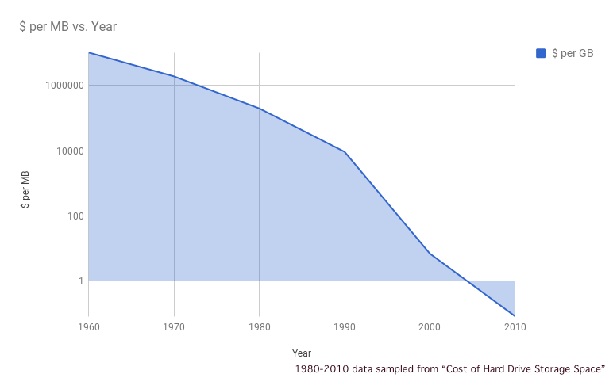
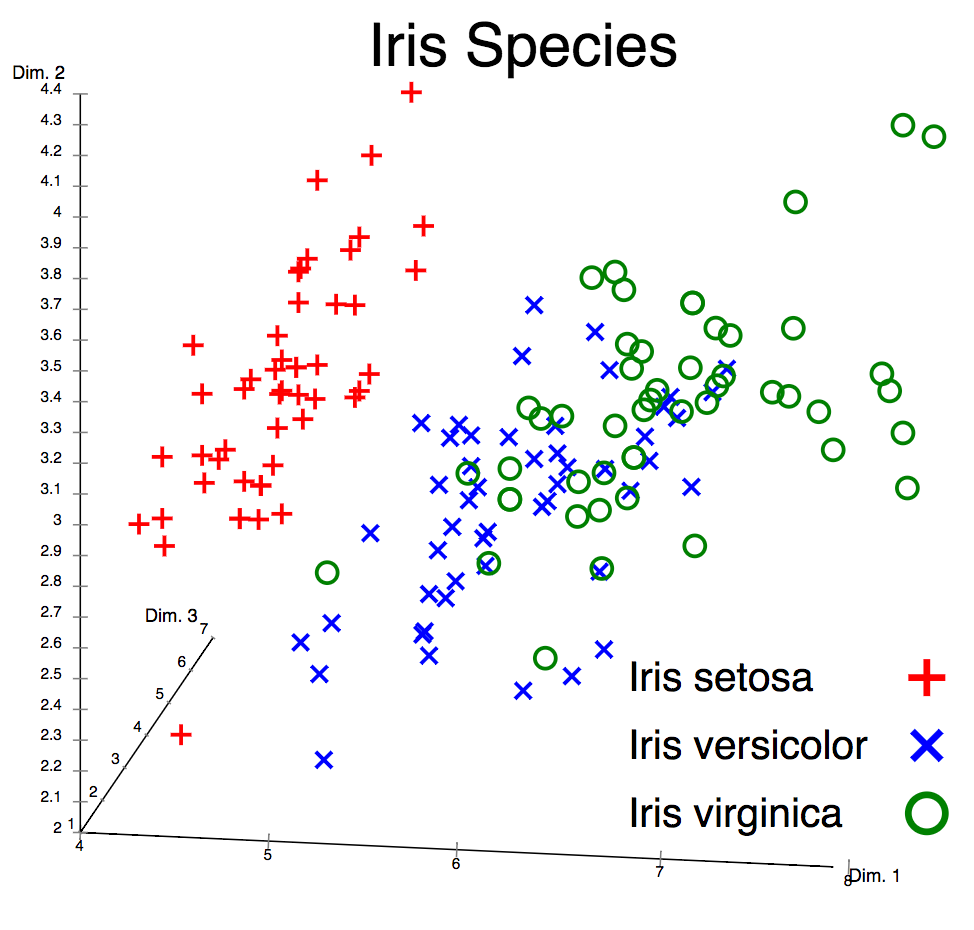
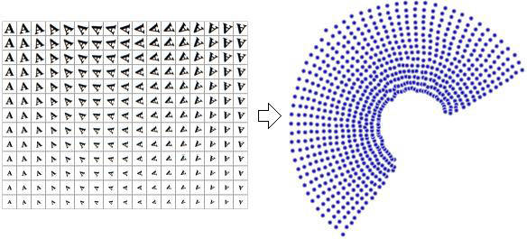
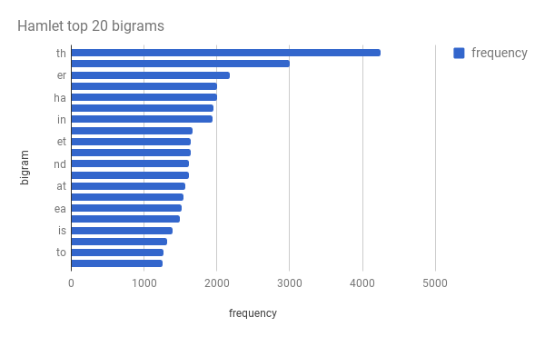

# 关注数据，以便最充分地利用人工智能、机器学习和认知计算
了解数据对创建人工智能和认知应用程序的重要性

**标签:** 人工智能,数据科学,机器学习,深度学习

[原文链接](https://developer.ibm.com/zh/articles/cc-cognitive-big-brained-data-pt1/)

Uche Ogbuji

发布: 2017-12-13

* * *

在思考人工智能 (AI) 时，您会想到什么？您或许会想到各种各样的技术，比如基于规则的专家系统、机器学习和自然语言处理。或许您有足够的背景知识，会想得更深一些，您或许会想到正向或反向链、神经网络、贝叶斯逻辑(bayesian logic)、集群和其他分类器系统。如果您目前完全不了解 AI，推荐您先阅读 M. Tim Jones 撰写的教程“ [人工智能、机器学习和认知计算入门指南](http://www.ibm.com/developerworks/cn/cognitive/library/cc-beginner-guide-machine-learning-ai-cognitive/index.html)”，然后再返回来继续阅读本教程。

如果您想到的 AI 重点与我陈述的一致，那么您并不孤单。从纯粹的计算机爱好者到熟练的开发人员，大部分人在考虑 AI 时都会想到算法和机制。这些方面当然非常重要，但他们遗漏了一个决定 AI 项目成功与否的关键因素：数据。AI 需要数据，通常需要大量数据，而且在理想情况下，会需要大量高质量的数据。AI 开始在主流领域获得更大成功以及我们迈进认知计算时代的一个原因是，网络让查找大量数据变得更容易。

人们最初将 AI 技术看作是将人类感知模式转换为计算机流程的一种途径，这并不令人感到惊讶。想想一个孩子在发展其认知时会吸收多少输入数据。他们在能通过视觉在世界环境中安全地徜徉之前，看到了多少个物体。他们在能讲话之前听到了多少话语。他们在能阅读之前看到了多少文字。他们在成为任何主题的专家之前，需要通过多少节课、多少示例和强化测试来接受多少教育。人类不断吸收的大量信息是形成我们自身智力的关键，人工智能也是如此。

几乎所有我们引以为傲的有关人类智慧的事物，都可归结为模式匹配，这是一种搜索可能的认知来确定与手头的刺激物最相符的认知的过程。它可以归结为我们的一种基于神经元的能力，一种在非常短时间内执行异常复杂的统计分析的能力。一个应该始终牢记的不错观点是，统计方法与 AI 之间其实没有任何特殊的分界线。人类在进化过程中不断调整与生俱来的卓越优化能力，AI 只是一种利用我们从这种优化能力得出的经验，在模式匹配中应用统计方法的途径。

在早期计算时代，人们首先考虑的是计算机应如何执行操作，Alan Turing、John von Neumann 和 John McCarthy 等 AI 先驱主要专注于如何创建能够发展为 AI 的程序。他们提供了一些伟大的概念，其中许多概念如今仍是 AI 的基础，但他们很快发现，人们对很快就能实现强大的 AI 的大胆预测有些夸张。这导致他们研究的可信度出现了严重问题，而且建立起了一种多次重复的模式：一个人提出一些有前景的新技术，当这些技术的表现不如预期时，一个充满怀疑的“AI 冬天”就会到来。为了避免在我们自己的工作中出现这个问题，充分了解数据在 AI 中的作用非常重要。本教程会全面探讨数据的作用。

## 历史限制

回顾过去，我们知道早期的 AI 先驱遇到困难的一个原因是，难以将大量数据注入他们的聪明算法中。计算机随机存取存储器 (RAM) 在很长一段时间里被称为“核心”，而且有时仍会这样称呼，这是因为它起源于通过电路连接的金属环的磁芯。RAM 需要精心的工程设计，甚至在半导体芯片革命发生后，RAM 仍然是奢侈品。仅在大约 30 年前，比尔·盖茨做出了“640K 内存应该对任何人都足够”的著名断言，现在的人对此一定感到很惊讶，我们许多人希望自己的计算机配备不少于 8 GB 内存，该大小是比尔·盖茨断言的大小的 1.3 万多倍。

RAM 的适度可用性最初意味着 AI 必须在很窄的信息切片上处理大部分工作，然后将这些切片重新组合为更广泛的答案。这类方法降低了效率。下一个问题是存储大量表示事物的数据，比如用于机器学习的训练语料库。AI 先驱需要使用一些非常受限的系统，比如打孔卡片，即使在磁盘出现后，存储都始终非常珍贵，直到最近。下图显示了内存和硬盘存储成本几十年来的变化趋势。

随着 RAM 和耐久性存储的成本降到以前无法想象的低位，网络成功建立起来并发展至超大规模。这大大刺激了人们和机构想要对表示人类活动的海量数据实施自动化，而且得益于开放提供数据的运动，开发人员能利用这些资源让 AI 变得越来越实用。

## 从感知器开始

感知器是第一批机器学习算法之一，它是一个用于实现二元分类器的系统。二元分类器是一个函数，它接受一个输入，并确定该输入是否属于某个类别。二元分类器的示例包括接受一个物体的一组特征并确定该物体是否是一艘船，或者接受一个音频文件进行频谱分析并确定它是否是吉他的声音。来自分类的这些答案（“船”、“不是船”、“吉他”和“不是吉他”）称为标签。

第一个感知器是为识别图像而开发的，完全在硬件中实现。通过为感知器提供一组训练图像来训练它，每个图像都有一个预期输出，也就是标签。您可以为感知器提供一些图像和它们的标签，在这种情况下，您的流程就是所称的监督学习。

在另一些机器学习技术中，训练集中没有提供标签，算法必须使用复杂的统计技术来识别表明结果标签的集群。这种学习方法称为无监督学习，是一个更高级的主题。每种情况下的数据考虑因素都是类似的，所以为了简便起见，本教程中的机器学习讨论将专注于监督学习。事实上，尽管本教程中的大部分讨论都使用监督学习作为例子，但其他众多 AI 算法的许多考虑因素都是类似的。

对于感知器，棘手的地方在于：训练集中的所有图像都是数据。您可能不会立即这么看待它们，因为它们最初是以模拟方式来管理的。例如，图像可能是一堆要分类为“船”或“不是船”的物体的打印照片，每个照片都仔细标注了预期的感知器标签。这些图像在当时不会占用 RAM 或磁盘存储，但是它们是数据，因此它们不占用存储的事实影响了该情形的实用性。

## 现代机器学习和训练数据

如今，RAM 和存储变得很便宜，而且网络上有数以亿计的图像可用作视觉感知神经网络的训练集。海量数据的更低成本提高了海量数据的可用性，而且在大部分现代 AI 应用程序中，您会使用以一种或另一种形式从网上获得的数据。

难点在于认识到即使您刚获得了 10 亿张船和非船物体的 JPG 图像，最终也未必能获得合适的训练集。控制和质量至关重要。您是否需要清除图像中的噪音？您是否需要更改缩放比例或提高清晰度？如果有许多不是船的图片，但在提供给神经网络时将它们标注为船，那么最终获得的神经网络将是一个差强人意的分类器。

拥有正确的算法对神经网络很重要，但准备好训练集更加重要，而且在许多方面更加困难。您可以获得一个受信任且训练有素的专家小组来分析您的 10 亿张 JPG，标记它们以用于训练，但这样做显然代价高昂且非常耗时。您可以众包形式将工作外包，让许多不那么熟练的人以某种方式对图像进行分类，这样就可以通过更低成本获得更多的训练数据，但您可能对质量不那么确定。您可能将更高比例的非船物体标注为船。

在您对某个 AI 算法的信任度高过某个程度后，就可以使用它为另一个程序准备训练语料库。例如，如果您确信神经网络 A 擅长对船进行分类，您可以对它运行原始的图像集合，然后使用它的分类作为标注，将图像集合转换为神经网络 B 的合适训练集。这样似乎可以为您提供一种有吸引力的数量和质量组合。这里的主要问题是自展问题和错误前馈函数。

自展问题源于神经网络倾向于严格适用于狭窄范围这一事实。您不能使用一个优秀的飞机分类器为优秀的船分类器开发训练集，所以您总是需要从头准备新的训练语料库。

前馈问题指的是，神经网络 A 可能在对船进行分类时没有您想象的那么优秀。或许它的弱点就隐藏在它能执行的大量工作中。如果是这样，它可能会将其弱点传播到神经网络 B。这种错误前馈实际上是 AI 应用中的最大问题之一。从更广泛意义上讲，只要多个自动化系统按任何协调方式工作，该弱点可能就会暴露出来，而且认知弱点往往可能被放大。我稍后会讨论到，这些弱点可能带来重大的社会和经济成本。

## 鸢尾花数据集

直接识别图像是一种机器学习方法，但在输入是大量特性描述时，往往更容易发现机器学习的实际用途。无需提供算法就可以直接处理面部图像的像素来识别一个人，它可以处理一组表示各种特性（比如眼睛的大小和颜色、鼻子、嘴巴和面部轮廓）的数字或数字矢量。

1935 年，植物学家 Edgar Anderson 做了一项野外研究，发表了一篇名为“The irises of the Gaspé Peninsula”的论文。在这篇文章中，包含对来自 3 个不同种类（山鸢尾、维吉尼亚鸢尾和杂色鸢尾）的鸢尾花样本特征的 150 个测量结果。具体来讲，他测量了花瓣和花萼的长度和宽度。1936 年，统计学家兼生物学家 Ronald Fisher 使用 Anderson 的数据集演示了后来用于计算机机器学习中的统计分类器技术。

鸢尾花数据集已成为 AI 圈子中的标志，在向入门开发人员介绍机器学习时经常使用该数据集作为训练集。它支持监督学习，因为 Anderson 提供了鸢尾花种类（标签）和特征测量结果（样本）。

鸢尾花数据集之所以广为人知，不仅是因为它在机器学习中扮演的早期历史角色，还由于它开始演示的问题的复杂性。例如，山鸢尾可以与其他两个种类进行线性分离，但其他两个种类混杂在一起，无法线性分离。这是一个技术细节，但它引出了对不同类型分类器的限制的非常重要的理解。感知器是严格的线性分类器，所以它们适用于鸢尾花数据集的某些方面，而不适用于其他方面。

得益于这种科学上合理且统计上容易理解的样本数据，机器学习技术取得了许多进步。例如，人们发现，添加多层神经网络是解决在应用认知时（甚至使用鸢尾花数据这样的高质量训练集）遇到的许多限制的一种好方法。很少有计算算法对关注和提供的数据像机器学习那么敏感，这一事实仍在延续，所以即使是目前的专家，也需要如此高质量的数据来充分利用他们的机器。

## 从鸢尾花到眼球

自感知器时代以来，神经网络和训练它们的数据集无疑变得更复杂，但 AI 技术越来越流行的重要原因之一是，更多的人将其真实神经元的活动传播到互联网上。

您每次执行 Web 搜索时，每次发表社交媒体帖子或进行社交媒体交流时，每次单击网站的一部分而不是另一部分时，您都在向算法贡献关于您的习惯、兴趣和偏好的有效数据。这些算法中的大多数算法都不在 AI 复杂结构的顶层（对于那些通过在线交流挖掘市场的人，贝叶斯方法等简单统计模型非常受欢迎），但它们不需要非常复杂。经验表明，算法能访问的可靠数据越多，需要的复杂性就越低。

为操作建立上下文是为提供给这些算法的数据确立价值的关键部分。一个人在某个时尚网站上点击某个广告，而另一个人位于体育网站上，这些事实成为了整合到语料库中的信号。在考虑提供给 AI 的其他数据类型时，上下文的这种应用非常重要（尽管是以不同方式体现出来）。例如，如果您能将鸢尾花的地理位置信息添加到它的花瓣和花萼测量结果中，就可能训练出更准确的分类器。

但是，此方法存在一些限制。如果提供每个数据项的太多细节，每个细节在技术上称为一个维度，您可能会成为所谓的维度灾难的受害者。这是一个涵盖大量问题的一般性术语，但普遍的观点是：当您有太多维度，您预计的相似示例可能在该算法搜索的领域中相去甚远，以至于该算法从未将这些示例有效地组织到集群中。这种情况的一个后果可以总结为这样一个观点：随着维度的增加，所需的训练样本数量将呈指数级增长。

为 AI 准备数据的一个常见步骤是通过寻找一个拓扑流形来减少搜索空间中的维数，拓扑流形是一个更容易形成集群的维度子集中的一种数学模式。执行此工作的最常见技术称为主成份分析 (PCA)。

左侧是用于可视识别的字母 A 的图像。如果每幅图为 32 x 32 像素，而且为严格的黑白色，那么它可以简单地表示为一个 1024 像素的矢量，在数学上，这是一个 1024 维空间。当然，人们查看该图时，会立即认识到这些是同一图像旋转和缩放后的结果。您可以采用旋转度数和比例作为两个不同的维度，最终将维数从 1024 减少到 2，如右侧所示。在您的脑海里，您可以将维数从完整的逐像素细节减少为旋转和比例两个内在变量。

当然，这是一个非常简单的例子，但事实上，数学复杂性取决于对数据本身的理解深度。

## 打字机上的猴子

我们能直观地或从科学和技术角度最好地理解上下文的一个地方，就是在自然语言中。让计算机理解语言，生成语言，甚至执行语言翻译，这是 AI 长期以来的一个主要目标。事实上，当计算机能与人进行令人信服的对话（即理解语言并生成语言作为响应）时，是通过图灵测试来实现的，该测试是对 AI 成功与否的第一个也是最著名的测试。

在自然语言处理（AI 的相关分支）的大部分历史中，该方法都专注于算法、语法的编程系统和词汇表管理，所有这些都很少取得成功。同样在最近，随着网络上开始提供有关人类语言甚至音频演讲的海量数据，有关技术已做出相应的调整以批量吸收此数据，而且取得了成功。我们都已看到机器人的改进速度有多快，机器翻译和手机上的移动代理也在快速发展。这些系统使用庞大的文本和语音数据进行训练，并标注了尽可能多的上下文。

为了让您了解此概念，NLP 中最古老的传统之一是使用统计字母关联指标来生成看似自然文本的结果。该想法源于一种古老的哲学理念：如果有足够多的猴子来敲击打字机，最终或许能够生成莎士比亚的作品。当然，发生这一场景的概率非常低，以至于我们预计它在宇宙的整个已知生命中都不会发生。但是，如果我们按照从语言中观察到的统计模型来堆叠猴子的打字机，即使猴子的操作仍被认为是随机的，猴子有可能会生成有吸引力的讯息。

正如您可能预料到的，重点在于构建这些统计模型需要数据，例如某些字母或单词出现的相对频率。一种应对这种情况的常见模型称为 n-gram，在该模型中，有一个频率矩阵来显示训练数据中每个字母序列出现的频率。例如，来自一段典型英文文本的 3-gram 显示，序列“ING”的值非常高，序列“HMF”的值非常低。

下图是莎士比亚的《哈姆雷特》中出现最多的 20 个双字母组（2 维 n-gram），统计中忽略了标点和空格，而且将所有字母视为小写。

训练数据的来源和性质至关重要。如果您从但丁的原创作品中获取统计模型，可以预料最终结果会很意大利化，而在确定的某段时间内生成莎士比亚作品的概率要小得多。如果您获取印度的史诗和宗教书籍中的统计数据，或者莎士比亚的作品本身的统计数据，就会获得类似的效果。

如果您错误地利用前面提到的所有 3 种传统文献来创造统计模型，在实际执行统计后，可能最终会得到一个令人费解的猴子或机器人，它花更长的时间才能生成值得传达的信息。因此，在这种情况下，仅为算法提供越来越多的盲数据并不够。您必须关注数据的来源，理解输入对输出有何影响。

## 偏见的风险

尝试大规模收集这类具有明确上下文的数据的问题在于，很难衡量意外的后果。在一些著名案例中，基于算法进行投放的在线广告可能被人们解读为具有性别歧视、种族歧视或其他禁止的偏见，让广告的所有者在公共关系上陷入困境。

出现这种结果的原因有很多。在某些情况下，这种偏见可能隐藏在训练算法的数据内部。这是一个更广泛、更常见的问题，甚至是在科学和决策制定方面也是如此。战胜这些偏见和质疑来收集数据的人或系统的所有假设非常重要，但也非常困难。始终保持警惕是唯一的解决方案。

一个更棘手的问题是，当数据的上下文中忽略了某些人的方面时，就会造成完全无意识的偏见。在一类人群经常访问的网站上展示广告的某个方面，可能导致广告取得更大成功，然后这个方面会变成相关数据，并以一种似乎歧视性的方式编码到算法中。再次提醒，除了保持警惕并审查不断出现的模式以外，没有别的解决方案，因为与算法相比，人仍然是发现社交环境中问题的更优秀侦探。

NLP 中也有一些重要的类似之处。微软在 Twitter 上公开了一个著名的 AI 机器人，尽管它的算法没有公开，但它显然使用了用户与它交互的语料库来开发自己的语言模型。在吸收了用户发表的一系列令人不快的评论后，它很快适应并学会自行发表恶毒的反社会帖子，不久以后，创建者不得不将它下线。

您可能不希望自己成为这样的开发人员：在第一天因为发布了强大的新 AI 应用程序而受到赞美，而在第 6 天，在该应用程序吸收各种数据并表现出足以为您的雇主带来公关灾难的偏见后，您受到严厉指责，甚至丢掉了工作。

## 结束语

您了解了数据对创建人工智能和认知应用程序有多重要，以及这种重要性如何在该学科的整个历史中延续，并与它在历史上的成败紧密相连。您还了解了网上提供的海量数字化数据如何让 AI 从许多个冬天中苏醒，将它的成果应用于主流群体，并对许多生命和业务产生影响。当前的成功和激动伴随着它们自己的风险，因为提供给 AI 的数据中的异常和无法预料的偏见可能导致可怕的社会后果，甚至是法律惩罚。

这可能是很重要且有用的背景，但在实践中，软件开发生命周期 (SDLC) 应该如何应用于 AI 数据？我将在下一篇教程中回答这个问题，详细介绍 SDLC 并演示如何最有效地应用它来解决目前讨论的问题。

本文翻译自： [Pay attention to the data to get the most out of artificial intelligence, machine learning, and cognitive computing](https://developer.ibm.com/articles/cc-cognitive-big-brained-data-pt1/)（2017-09-27）