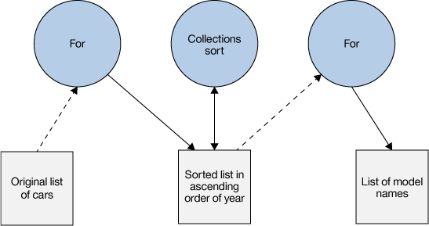
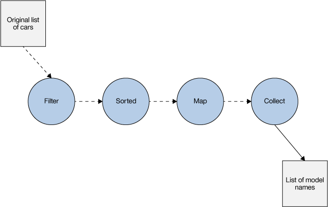

# 函数组合与集合管道模式
迭代 Java 中集合的函数模式

**标签:** Java,Java 平台

[原文链接](https://developer.ibm.com/zh/articles/j-java8idioms2/)

Venkat Subramaniam

发布: 2017-05-31

* * *

在开始采用函数式编程风格时，您的程序中会自然而然地出现一些函数设计模式，但您仍需要努力掌握它们。本文将介绍函数组合和集合管道，您可以结合使用这两种函数式模式来迭代代码中的集合。了解这些模式的结构有助于您搭建自己的 Java™ 程序，从而充分利用高阶函数和拉姆达表达式。

**关于本系列**

Java 8 是自 Java 语言诞生以来进行的一次最重大更新  包含了非常丰富的新功能，您可能想知道从何处开始着手了解它。在 [本系列](/zh/series/java-8-idioms/) 中，作者兼教师 Venkat Subramaniam 提供了一种惯用的 Java 8 编程方法：这些简短的探索会激发您反思您认为理所当然的 Java 约定，同时逐步将新方法和语法集成到您的程序中。

## 语句与表达式

如果在代码库中快速查找 `for`，您可能会惊奇地发现，您的代码中对 `for` 循环的使用非常频繁。我将这种情形称为 `for` 重复(hammer)\_ ：只要我们需要循环，似乎就会用到 `for` 。

在 Java 中，`for` 和 `while` 都是语句。 _语句_ 执行一个操作，但不会生成任何结果。就本质而言，任何执行有用的操作的语句都会导致数据变化。这是语句表达其效果的唯一方式。而 _表达式_ 则相反：它们可以得出结果而不会导致变化。

在代码中使用语句就像是合作处理一部分工作，但无法在团队成员之间直接转交工作结果。分享结果的唯一方法是将它放在桌面上或架子上，让另一位团队成员可以获得它。表达式的工作更像一条链：当某个人完成一项任务时，他将结果转交给链中的下一个人。

表达式帮助实现了集合管道模式，Martin Fowler 将该模式描述为 [运算序列](https://martinfowler.com/articles/collection-pipeline) ，会将从一次运算收集的输出提供给下一次运算。尽管面向对象的编程中使用了集合管道模式（您可能在使用对象构建器的代码中看到过它），但它在函数编程中更常见。

函数组合和集合管道模式是两种可协同工作的模式。下一节将使用熟悉的 `for` 语句解决一个问题。然后将介绍如何使用这两种模式更高效地解决同一个问题。

## 使用语句进行迭代和排序

首先创建一个 `Car` 类，它包含属性 make、model 和 year：

##### 清单 1\. 一个 Car 类

```
package agiledeveloper;

public class Car {
private String make;
private String model;
private int year;

public Car(String theMake, String theModel, int yearOfMake) {
    make = theMake;
    model = theModel;
    year = yearOfMake;
}

public String getMake() { return make; }
public String getModel() { return model; }
public int getYear() { return year; }
}

```

Show moreShow more icon

我们可以添加一个 `Car` 实例集合，比如：

##### 清单 2\. 一个 Car 实例集合

```
package agiledeveloper;

import java.util.Collections;
import java.util.Comparator;
import java.util.Arrays;
import java.util.ArrayList;
import java.util.List;
import static java.util.Comparator.comparing;
import static java.util.stream.Collectors.toList;

public class Iterating {
public static List<Car> createCars() {
    return Arrays.asList(
      new Car("Jeep", "Wrangler", 2011),
      new Car("Jeep", "Comanche", 1990),
      new Car("Dodge", "Avenger", 2010),
      new Car("Buick", "Cascada", 2016),
      new Car("Ford", "Focus", 2012),
      new Car("Chevrolet", "Geo Metro", 1992)
    );
}

```

Show moreShow more icon

在清单 3 中，我们使用命令式编程来迭代该列表，并获取 2000 年后制造的汽车的名称。然后按年份对这些型号进行升序排序。

##### 清单 3\. 使用 ‘for’ 按年份对各种型号进行排序

```
public static List<String> getModelsAfter2000UsingFor(List<Car> cars) {
    List<Car> carsSortedByYear = new ArrayList<>();

    for(Car car : cars) {
      if(car.getYear() > 2000) {
        carsSortedByYear.add(car);
      }
    }

    Collections.sort(carsSortedByYear, new Comparator<Car>() {
      public int compare(Car car1, Car car2) {
        return new Integer(car1.getYear()).compareTo(car2.getYear());
      }
    });

    List<String> models = new ArrayList<>();
    for(Car car : carsSortedByYear) {
      models.add(car.getModel());
    }

    return models;
}

```

Show moreShow more icon

如您所见，此代码中有许多循环。首先， `getModelsAfter2000UsingFor` 方法接受一个汽车列表作为参数。它提取或过滤出 2000 年后制造的汽车，将它们放在一个名为 `carsSortedByYear` 的新列表中。接下来，按照制造年份对该列表进行升序排序。最后，循环处理列表 `carsSortedByYear` ，以获取型号名称，并在一个列表中返回它们。

能否提高这段代码的效率？我们可以通过一次性对所有汽车排序来消除一个 `for` 循环，但随后需要对一个更大的对象列表进行排序。

这是汽车列表示例的输出：

##### 清单 4\. getModelsAfter2000UsingFor 的输出

```
Avenger, Wrangler, Focus, Cascada

```

Show moreShow more icon

这个排序示例演示了我所称的 _语句的效果_ 。尽管函数和方法通常可用作表达式，但 `Collections sort` 方法没有返回结果。因为它被用作语句，所以它改变了作为参数提供的列表。两个 `for` 循环在迭代时都改变了相应的列表。作为语句，这是这些元素的工作方式。因此，该代码包含不必要的垃圾变量，如图 1 所示。

##### 图 1\. 语句的效果



## 使用集合管道进行迭代和排序

在函数编程中，通常会通过一系列更小的模块化函数或运算来对复杂运算进行排序。该系列被称为 _函数组合_ （composition of functions, or a function composition）。当一个数据集合流经一个函数组合时，它就变成一个集合管道。函数组合和集合管道是函数式编程中常用的两种设计模式。

无需使用一个很大的 `for` 重复（ hammer ），依据手头的问题，我们能使用多种专业工具。无需像命令式编程中常见的那样对所有运算都使用语句，函数式编程鼓励使用表达式。表达式没有语句所拥有的改变对象的副作用。像 `filter` 或 `map` 这样的表达式也返回一个结果，我们可以将它传递给另一个函数，我们就是通过这种方式创建集合管道的。考虑清单 5 中的代码。

##### 清单 5\. 集合管道模式中的函数组合

```
public static List<String> getModelsAfter2000UsingPipeline(
List<Car> cars) {
return
     cars.stream()
         .filter(car -> car.getYear() > 2000)
         .sorted(Comparator.comparing(Car::getYear))
         .map(Car::getModel)
         .collect(toList());
}

```

Show moreShow more icon

方法 `getModelsAfter2000UsingPipeline` 生成的结果与 [使用 ‘for’ 按年份对各种型号进行排序](#使用-'for'-按年份对各种型号进行排序) 中的方法 `getModelsAfter2000UsingFor` 相同，但要注意代码中的不同之处：

- 函数式代码比命令式代码更简洁。
- 函数式代码不会表现出明显的易变性，而且使用了更少的垃圾变量。
- 第二个方法中使用的函数/方法都是有返回值的表达式。将此方法与 [使用 ‘for’ 按年份对各种型号进行排序](#使用-'for'-按年份对各种型号进行排序) 中的 `Collections.sort` 方法进行对比。
- `getModelsAfter2000UsingPipeline` 使用了集合管道模式，而且非常富于表达。

只用了短短几行代码，代码的意图就很明显 — 给定一个汽车集合，过滤或提取仅在 2000 年或以后制造的汽车；然后按年份进行排序，将这些对象映射或转换为它们的型号，最后将结果收集到一个列表中。

[集合管道模式中的函数组合](#集合管道模式中的函数组合) 中的代码如此简洁且富于表达，部分原因是使用了方法引用。将一个拉姆达表达式传递给 `filter` 很有用，因为它可以获取给定对象的 year 属性并将其与 year 2000 进行比较。但是，将拉姆达表达式传递给 `map` 就没有这么有效。传递给 `map` 方法的表达式为 `car -> car.getModel()` ，该表达式非常繁琐。该拉姆达表达式仅返回给定对象的某个属性，不执行任何实际计算或运算。我们最好将它替换为一个方法引用。

我们将方法引用 `Car::getModel` 传递给 `map` 方法，而不传递拉姆达表达式。类似地，我们将方法引用 `Car::getYear` 传递给 comparing 方法，而不传递拉姆达表达式 `car -> car.getYear()` 。方法引用简短、简洁且富于表达。最好尽可能地使用它们。

图 2 给出了清单 5 中的集合管道。

##### 图 2\. 集合管道的魅力



查看图 2，可以看到 `getModelsAfter2000UsingPipeline` 函数如何执行集合管道，通过一系列函数转换给定输入。随着数据流经各个函数，Java 8 的惰性计算和函数融合功能（参阅 2014 年的 [_Java 中的函数编程_](https://pragprog.com/book/vsjava8/functional-programming-in-java) ）可帮助避免在某些情况下创建中间对象。数据在管道中传输时，函数不会使中间对象变得可见或可用。

## 结束语

在命令式编程中，对于大部分数据处理，通常都会使用 `for` 和 `while` 循环。在本文中，您了解了一种在函数式编程中非常流行的替代方法。函数组合是一项简单技术，有助于对模块化函数进行排序，从而创建更复杂的运算。按该序列处理数据时，您就有了一个集合管道。结合使用函数组合和集合管道模式，可以创建复杂的程序，让数据从上游流到下游，并经历一系列转换。

本文翻译自： [Function composition and the Collection Pipeline pattern](https://developer.ibm.com/articles/j-java8idioms1/)（2017-03-30）