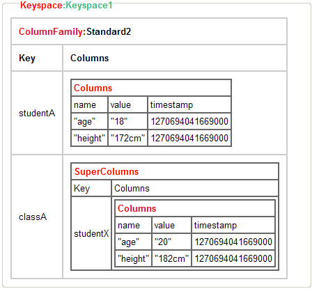

# 分布式 Key-Value 存储系统：Cassandra 入门
快速上手 Cassandra

**标签:** 数据存储,数据库

[原文链接](https://developer.ibm.com/zh/articles/os-cn-cassandra/)

黄俊平

发布: 2010-07-15

* * *

## Cassandra 的数据存储结构

Cassandra 的数据模型是基于列族（Column Family）的四维或五维模型。它借鉴了 Amazon 的 Dynamo 和 Google’s BigTable 的数据结构和功能特点，采用 Memtable 和 SSTable 的方式进行存储。在 Cassandra 写入数据之前，需要先记录日志 (CommitLog)，然后数据开始写入到 Column Family 对应的 Memtable 中，Memtable 是一种按照 key 排序数据的内存结构，在满足一定条件时，再把 Memtable 的数据批量的刷新到磁盘上，存储为 SSTable 。

##### 图 1\. Cassandra 的数据模型图



### Cassandra 的数据模型的基本概念

- Cluster : Cassandra 的节点实例，它可以包含多个 Keyspace
- Keyspace : 用于存放 ColumnFamily 的容器，相当于关系数据库中的 Schema 或 database3. ColumnFamily : 用于存放 Column 的容器，类似关系数据库中的 table 的概念 4. SuperColumn ：它是一个特列殊的 Column, 它的 Value 值可以包函多个 Column5. Columns：Cassandra 的最基本单位。由 name , value , timestamp 组成

下面是关于数据模型实例分析

##### 图 2\. 数据模型实例分析


## Cassandra 节点的安装和配置

### 获取 Cassandra

```
# wget  http://labs.renren.com/apache-mirror/cassandra/0.6.0/apache-
cassandra-0.6.0-rc1-bin.tar.gz
# tar -zxvf apache-cassandra-0.6.0-rc1-bin.tar.gz
# mv  apache-cassandra-0.6.0-rc1 cassandra
# ls Cassandra

```

Show moreShow more icon

##### Cassandra 的目录说明

bin存放与 Cassandra 操作的相关脚本conf存放配置文件的目录interfaceCassandra 的 Thrift 接口定义文件，可以用于生成各种编程语言的接口代码Javadoc源代码的 javadoclibCassandra 运行时所需的 jar 包

### 配制 Cassandra 节点的数据存储目录和日志目录

修改配制文件 storage-conf.xml：

##### 默认的内容

```
<CommitLogDirectory>/var/lib/cassandra/commitlog</CommitLogDirectory>
     <DataFileDirectories>
<DataFileDirectory>/var/lib/cassandra/data</DataFileDirectory>
     </DataFileDirectories>

```

Show moreShow more icon

##### 配置后的内容

```
<CommitLogDirectory>/data3/db/lib/cassandra/commitlog</CommitLogDirectory>
     <DataFileDirectories>
<DataFileDirectory>/data3/db/lib/cassandra/data</DataFileDirectory>
     </DataFileDirectories>

```

Show moreShow more icon

修改日志配制文件 log4j.properties：

##### log4j.properties 配置

```
# 日志路径
#log4j.appender.R.File=/var/log/cassandra/system.log
# 配置后的日志路径 :
log4j.appender.R.File=/data3/db/log/cassandra/system.log

```

Show moreShow more icon

创建文件存放数据和日志的目录

```
# mkdir – p /data3/db/lib/cassandra
# mkdir – p /data3/db/log/Cassandra

```

Show moreShow more icon

### 配制完成后，启动 Cassandra

```
# bin/Cassandra

```

Show moreShow more icon

显示信息

```
INFO 09:29:12,888 Starting up server gossip
INFO 09:29:12,992 Binding thrift service to localhost/127.0.0.1:9160

```

Show moreShow more icon

看到这两行启动回显信息时，说明 Cassandra 已启动成功。

### 连接到 Cassandra 并添加、获取数据

Cassandra 的 bin 目录已自带了命令行连接工具 cassandra-cli，可使用它连接到 Cassandra，并添加、读取数据。

##### 连接到 Cassandra，并添加、读取数据

```
# bin/cassandra-cli --host localhost --port 9160
Connected to: "Test Cluster" on localhost/9160
Welcome to cassandra CLI.
Type 'help' or '?' for help. Type 'quit' or 'exit' to quit.
cassandra>
cassandra> set Keyspace1.Standard2['studentA']['age'] = '18'
Value inserted
cassandra> get Keyspace1.Standard2['studentA']
=> (column=age, value=18, timestamp=1272357045192000)
Returned 1 results

```

Show moreShow more icon

### 停止 Cassandra 服务

##### 查出 Cassandra 的 pid:16328

```
# ps -ef | grep cassandra
# kill 16328

```

Show moreShow more icon

### Cassandra 配制文件 storage-conf.xml 相关配制介绍

##### 清单 1\. storage-conf.xml 节点配制说明清单

```
<!-- 集群时显示的节点名称 -->
<ClusterName>Test Cluster</ClusterName>
<!-- 节点启动时，是否自动加入到集群中，默认为 false -->
<AutoBootstrap>false</AutoBootstrap>
<!-- 集群的节点配制 -->
<Seeds>
<Seed>127.0.0.1</Seed>
</Seeds>
<!-- 节点之间通迅的监听地址 -->
<ListenAddress>localhost</ListenAddress>
<!--
      基于 Thrift 的 cassandra 客户端监听地址，
集群时设为：0.0.0.0 表示侦听所有客户端 , 默认为：localhost
 -->
<ThriftAddress>localhost</ThriftAddress>
<!-- 客户端连接的端口 -->
<ThriftPort>9160</ThriftPort>
<!--
FlushDataBufferSizeInMB   将 memtables 上的数据写入在 Disk 上，
超过设定好的限制大小时 ( 默认 32M)，则将数据写入磁盘，
FlushIndexBufferSizeInMB  超过设定的时长（默认 8 分钟）后，
将 memtables 由的数据写入磁盘中
 -->
<FlushDataBufferSizeInMB>32</FlushDataBufferSizeInMB>
<FlushIndexBufferSizeInMB>8</FlushIndexBufferSizeInMB>
<!--
节点之间的日志记录同步模式。
默认：periodic, 对应配制 CommitLogSyncPeriodInMS
启动 batch 时，则对应的配制 CommitLogSyncBatchWindowInMS
 -->
<CommitLogSync>periodic</CommitLogSync>
<!--     默认为每 10 秒同步一次日志记录 -->
<CommitLogSyncPeriodInMS>10000</CommitLogSyncPeriodInMS>
<!--
<CommitLogSyncBatchWindowInMS>1</CommitLogSyncBatchWindowInMS> -->

```

Show moreShow more icon

## 常用编程语言使用 Cassandra 来存储数据

在使用 Cassandra 时，通常情况下都需要使用第三方插件 Thrift 来生成与 Cassandra 相关的库文件, 您可以在 [http://incubator.apache.org/thrift](http://incubator.apache.org/thrift) 下载此插件，并学习它的使用方法。以下是分别在 Java、PHP、Python、C#、Ruby 五种常用编程语言中使用 Cassandra：

### Java 程序使用 Cassandra

把 libthrift-r917130.jar，apache-cassandra-0.6.0-rc1.jar 加入到 Eclipse 的编译路径中。

建立数据库连接：使用 libthrift-r917130.jar 的 TTransport 的 open 方法建立起与 Cassandra 服务端 (IP:192.168.10.2 端口：9160) 的连接。

数据库操作：使用 Cassandra.Client 创建一个客户端实例。调用 Client 实例的 insert 方法写入数据，通过 get 方法获取数据。

关闭数据库连接：使用 TTransport 的 close 方法断开与 Cassandra 服务端的连接。

##### 清单 2\. Java 连接 Cassandra，写入并读取数据。

```
package com.test.cassandra;|
import java.io.UnsupportedEncodingException;
import org.apache.thrift.transport.TTransport;
import org.apache.thrift.transport.TSocket;
import org.apache.thrift.protocol.TProtocol;
import org.apache.thrift.protocol.TBinaryProtocol;
import org.apache.thrift.TException;
import org.apache.cassandra.thrift.Cassandra;
import org.apache.cassandra.thrift.Column;
import org.apache.cassandra.thrift.ColumnOrSuperColumn;
import org.apache.cassandra.thrift.ColumnPath;
import org.apache.cassandra.thrift.ConsistencyLevel;
import org.apache.cassandra.thrift.InvalidRequestException;
import org.apache.cassandra.thrift.NotFoundException;
import org.apache.cassandra.thrift.TimedOutException;
import org.apache.cassandra.thrift.UnavailableException;
/*
* 使 Java 客户端连接 Cassandra 并进行读写操作
* @author jimmy
* @date 2010-04-10
*/
public class JCassandraClient{
public static void main(String[] args) throws InvalidRequestException,
NotFoundException, UnavailableException, TimedOutException,
TException, UnsupportedEncodingException {

// 建立数据库连接
TTransport tr = new TSocket("192.168.10.2", 9160);
TProtocol proto = new TBinaryProtocol(tr);
Cassandra.Client client = new Cassandra.Client(proto);
tr.open();
String keyspace = "Keyspace1";
String cf = "Standard2";
String key = "studentA";
// 插入数据
long timestamp = System.currentTimeMillis();
ColumnPath path = new ColumnPath(cf);
path.setColumn("age".getBytes("UTF-8"));
client.insert(keyspace,key,path,"18".getBytes("UTF-8"),
timestamp,ConsistencyLevel.ONE);
path.setColumn("height".getBytes("UTF-8"));
client.insert(keyspace,key,path,"172cm".getBytes("UTF-8"),
timestamp,ConsistencyLevel.ONE);
// 读取数据
path.setColumn("height".getBytes("UTF-8"));
ColumnOrSuperColumn cc = client.get(keyspace, key, path, ConsistencyLevel.ONE);
Column c = cc.getColumn();
String v = new String(c.value, "UTF-8");
        // 关闭数据库连接
tr.close();
}
}

```

Show moreShow more icon

### PHP 程序使用 Cassandra

在 PHP 代码中使用 Cassandra，需要借助 Thrift 来生成需要的 PHP 文件，通过使用 thrift –gen php interface/cassandra.thrift 生成所需要的 PHP 文件，生成的 PHP 文件中提供了与 Cassandra 建立连接、读写数据时所需要的函数。

##### 清单 3\. PHP 连接 Cassandra，写入并读取数据。

```
<?php
$GLOBALS['THRIFT_ROOT'] = '/usr/share/php/Thrift';
require_once
$GLOBALS['THRIFT_ROOT'].'/packages/cassandra/Cassandra.php';
require_once
$GLOBALS['THRIFT_ROOT'].'/packages/cassandra/cassandra_types.php';
require_once $GLOBALS['THRIFT_ROOT'].'/transport/TSocket.php';
require_once $GLOBALS['THRIFT_ROOT'].'/protocol/TBinaryProtocol.php';
require_once
$GLOBALS['THRIFT_ROOT'].'/transport/TFramedTransport.php';
require_once
$GLOBALS['THRIFT_ROOT'].'/transport/TBufferedTransport.php';
try {
// 建立 Cassandra 连接
$socket = new TSocket('192.168.10.2', 9160);
$transport = new TBufferedTransport($socket, 1024, 1024);
$protocol = new TBinaryProtocolAccelerated($transport);
$client = new CassandraClient($protocol);
$transport->open();
$keyspace = 'Keyspace1';
$keyUser = "studentA";
$columnPath = new cassandra_ColumnPath();
$columnPath->column_family = 'Standard1';
$columnPath->super_column = null;
$columnPath->column = 'age';
$consistency_level = cassandra_ConsistencyLevel::ZERO;
$timestamp = time();
$value = "18";
// 写入数据
$client->insert($keyspace, $keyUser, $columnPath, $value,
                            $timestamp, $consistency_level);
$columnParent = new cassandra_ColumnParent();
$columnParent->column_family = "Standard1";
$columnParent->super_column = NULL;
$sliceRange = new cassandra_SliceRange();
$sliceRange->start = "";
$sliceRange->finish = "";
$predicate = new cassandra_SlicePredicate();
list() = $predicate->column_names;
$predicate->slice_range = $sliceRange;
$consistency_level = cassandra_ConsistencyLevel::ONE;
$keyUser = studentA;
// 查询数据
$result = $client->get_slice($keyspace, $keyUser, $columnParent,
             $predicate, $consistency_level);
// 关闭连接
$transport->close();
} catch (TException $tx) {
}?>

```

Show moreShow more icon

### Python 程序使用 Cassandra

在 Python 中使用 Cassandra 需要 Thrift 来生成第三方 Python 库，生成方式： thrift –gen py interface/cassandra.thrift, 然后在 Python 代码中引入所需的 Python 库，生成的 Python 库提供了与 Cassandra 建立连接、读写数据时所需要的方法。

##### 清单 4\. Python 连接 Cassandra，写入并读取数据。

```
from thrift import Thrift
from thrift.transport import TTransport
from thrift.transport import TSocket
from thrift.protocol.TBinaryProtocol import
TBinaryProtocolAccelerated
from cassandra import Cassandra
from cassandra.ttypes import *
import time
import pprint
def main():
socket = TSocket.TSocket("192.168.10.2", 9160)
transport = TTransport.TBufferedTransport(socket)
protocol = TBinaryProtocol.TBinaryProtocolAccelerated(transport)
client = Cassandra.Client(protocol)
pp = pprint.PrettyPrinter(indent=2)
keyspace = "Keyspace1"
column_path = ColumnPath(column_family="Standard1", column="age")
key = "studentA"
value = "18 "
timestamp = time.time()
try:
# 打开数据库连接
transport.open()
# 写入数据
client.insert(keyspace,key,column_path,
value,timestamp,ConsistencyLevel.ZERO)
# 查询数据
column_parent = ColumnParent(column_family="Standard1")
slice_range = SliceRange(start="", finish="")
predicate = SlicePredicate(slice_range=slice_range)
result = client.get_slice(keyspace,key,column_parent,
predicate,ConsistencyLevel.ONE)
pp.pprint(result)
except Thrift.TException, tx:
print 'Thrift: %s' % tx.message
finally:
# 关闭连接
transport.close()
if __name__ == '__main__':
main()

```

Show moreShow more icon

### C\# 使用 Cassandra

在 C# 中使用 Cassandra 需要 Thrift.exe 来生成动态链接库，使用 ./thrift.exe –gen csharp interface/cassandra.thrift 生成所需要的 DLL 文件，生成的 DLL 提供了与 Cassandra 建立连接，读写数据等所需的类和方法，在编程环境中引入生成的 DLL，即可使用。

##### 清单 5\. C\# 连接 Cassandra，写入并读取数据。

```
namespace CshareCassandra{
using System;
using System.Collections.Generic;
using System.Diagnostics;
using Apache.Cassandra;
using Thrift.Protocol;
using Thrift.Transport;
class CassandraClient{
static void Main(string[] args){
// 建立数据库连接
TTransport transport = new TSocket("192.168.10.2", 9160);
TProtocol protocol = new TBinaryProtocol(transport);
Cassandra.Client client = new Cassandra.Client(protocol);
transport.Open();
System.Text.Encoding utf8Encoding = System.Text.Encoding.UTF8;
long timeStamp = DateTime.Now.Millisecond;
ColumnPath nameColumnPath = new ColumnPath(){
Column_family = "Standard1",
Column = utf8Encoding.GetBytes("age")};
// 写入数据
client.insert("Keyspace1","studentA",nameColumnPath,
utf8Encoding.GetBytes("18"),timeStamp, ConsistencyLevel.ONE);
// 读取数据
ColumnOrSuperColumn returnedColumn = client.get("Keyspace1",
            "studentA", nameColumnPath, ConsistencyLevel.ONE);
        Console.WriteLine("Keyspace1/Standard1: age: {0}, value: {1}",
                     utf8Encoding.GetString(returnedColumn.Column.Name),
                     utf8Encoding.GetString(returnedColumn.Column.Value));
// 关闭连接
transport.Close();
}
}}

```

Show moreShow more icon

### Ruby 使用 Cassandra

在 Ruby 中使用 Cassandra 需要先安装 gem，安装命令：gem install cassandra

安装完成后，打开 Ruby 的 irb 开始使用 Cassandra。

##### 清单 6\. Ruby 连接 Cassandra，写入并读取数据

```
> require 'rubygems'
> require 'cassandra'
# 建立数据库连接
> cdb = Cassandra.new('Keyspace1',"192.168.10.1:9160", :retries => 3)
# 写入数据
> cdb.insert(:Standard1, 'studentA', {'age' => '18'})
# 读取数据
> cdb.get(:Standard1, :studentA)
# 关闭连接
> cdb.disconnect

```

Show moreShow more icon

## 搭建 Cassandra 集群环境

Cassandra 的集群是没有中心节点的，各个节点的地位完全相同，节点之间是通过 gossip 的协议来维护集群的状态。

##### 以下是两台安装了 Linux 系统的服务器，且初步设置了 Cassandra 环境和启用了端口 7000,9160:

服务器名端口IP 地址ServiceA7000,9160192.168.10.3ServiceB7000,9160192.168.10.2

### 配制服务器 ServiceA、ServiceB 的 storage-conf.xml 文件

##### ServiceA 的配置

```
<Seeds>
<Seed>192.168.10.3</Seed>
</Seeds>
<ListenAddress>192.168.10.2</ListenAddress>
<ThriftAddress>0.0.0.0</ThriftAddress>

```

Show moreShow more icon

##### ServiceB 的配置

```
<Seeds>
<Seed>192.168.10.3</Seed>
<Seed>192.168.10.2</Seed>
</Seeds>
<ListenAddress>192.168.10.2</ListenAddress>
<ThriftAddress>0.0.0.0</ThriftAddress>

```

Show moreShow more icon

配制完成后，分别启动 ServiceA 和 ServiceB 上的 Cassandra 服务。

查看 ServiceA 和 ServiceB 是否集群成功，可使用 Cassandra 自带的客户端命令

```
bin/nodetool --host 192.168.10.2 ring

```

Show moreShow more icon

##### 集群成功则会返回以下类似信息：

```
Address Status Load Range Ring
                                       106218876142754404016344802054916108445
192.168.10.2  Up         2.55 KB       31730917190839729088079827277059909532     |<--|
192.168.10.3  Up         3.26 KB       106218876142754404016344802054916108445    |-->|

```

Show moreShow more icon

### 使用 Cassandra 命令行工具进行集群测试

从 ServiceB 连接到 ServiceA，可使用命令：

```
cassandra-cli -host 192.168.10.3 -port 9160

```

Show moreShow more icon

##### 集群测试一

```
写入集群数据
ServiceA 连接到 ServiceA:

# set Keyspace1.Standard2['studentAA']['A2A'] = 'a2a'

ServiceB 连接到 ServiceA:

# set Keyspace1.Standard2['studentBA']['B2A'] = 'b2a'

ServiceA 连接到 ServiceB:
# set Keyspace1.Standard2['studentAB']['A2B'] = 'a2b'

```

Show moreShow more icon

获取集群数据：

```
ServiceA 连接到 ServiceA :
# get Keyspace1.Standard2['studentAA'],
get Keyspace1.Standard2['studentBA'],
    get Keyspace1.Standard2['studentAB']

ServiceB 连接到 ServiceA :
# get Keyspace1.Standard2['studentAA'],
    get Keyspace1.Standard2['studentBA'],
    get Keyspace1.Standard2['studentAB']

ServiceA 连接到 ServiceB :
# get Keyspace1.Standard2['studentAA'],
get Keyspace1.Standard2['studentBA'],
get Keyspace1.Standard2['studentAB']

```

Show moreShow more icon

##### 集群测试二

ServiceA 停止 Cassandra 服务，ServiceA 连接到 ServiceB 并写入数据

```
# set Keyspace1.Standard2['studentAR']['A2R'] = 'a2R'

```

Show moreShow more icon

启动 ServiceA，并链接到 ServiceA 本身，读取刚才在 ServiceB 写入的数据

```
# bin/cassandra-cli -host 192.168.10.3 -port 9160
# get Keyspace1.Standard2['studentAR']

```

Show moreShow more icon

## 结束语

以上我们介绍了 Cassandra 的数据模型、节点安装和配置、常用编程语言中使用 Cassandra 以及 Cassandra 的集群和测试。Cassandra 是一个高性能的 P2P 去中心化的非关系型数据库，可以分布式进行读写操作。在系统运行时可以随意的添加或删降字段，是 SNS 应用的理想数据库。

## 下载示例代码

[Cassandra-Demo.rar](http://www.ibm.com/developerworks/cn/opensource/os-cn-cassandra/Cassandra-Demo.rar)