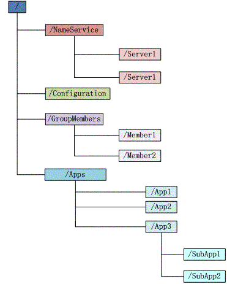
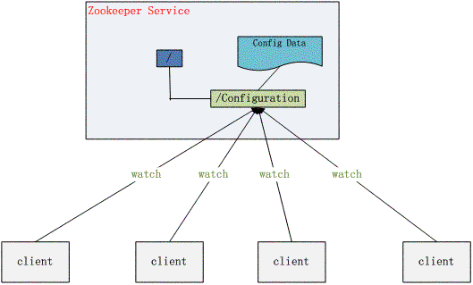
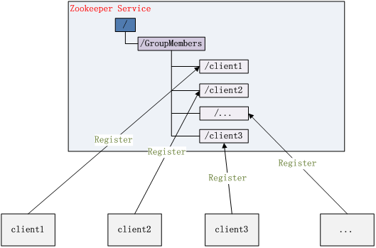
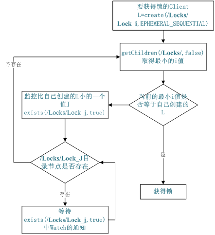
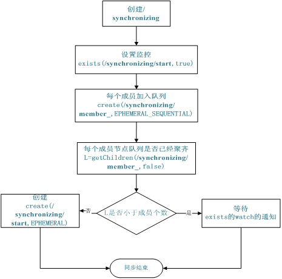

# 分布式服务框架 Zookeeper —— 管理分布式环境中的数据
解决分布式应用中经常遇到的一些数据管理问题

**标签:** Java,分析,消息传递

[原文链接](https://developer.ibm.com/zh/articles/os-cn-zookeeper/)

许令波

发布: 2010-11-18

* * *

## 安装和配置详解

本文介绍的 Zookeeper 是以 3.2.2 这个稳定版本为基础，最新的版本可以通过 [官网](https://zookeeper.apache.org) 来获取，Zookeeper 的安装非常简单，下面将从单机模式和集群模式两个方面介绍 Zookeeper 的安装和配置。

### 单机模式

单机安装非常简单，只要获取到 Zookeeper 的压缩包并解压到某个目录如：/home/zookeeper-3.2.2 下，Zookeeper 的启动脚本在 bin 目录下，Linux 下的启动脚本是 zkServer.sh，在 3.2.2 这个版本 Zookeeper 没有提供 windows 下的启动脚本，所以要想在 windows 下启动 Zookeeper 要自己手工写一个，如清单 1 所示：

##### 清单 1\. Windows 下 Zookeeper 启动脚本

```
setlocal
set ZOOCFGDIR=%~dp0%..\conf
set ZOO_LOG_DIR=%~dp0%..
set ZOO_LOG4J_PROP=INFO,CONSOLE
set CLASSPATH=%ZOOCFGDIR%

set CLASSPATH=%~dp0..\*;%~dp0..\lib\*;%CLASSPATH%
set CLASSPATH=%~dp0..\build\classes;%~dp0..\build\lib\*;%CLASSPATH%
set ZOOCFG=%ZOOCFGDIR%\zoo.cfg
set ZOOMAIN=org.apache.zookeeper.server.ZooKeeperServerMain
java "-Dzookeeper.log.dir=%ZOO_LOG_DIR%" "-Dzookeeper.root.logger=%ZOO_LOG4J_PROP%"
 -cp "%CLASSPATH%" %ZOOMAIN% "%ZOOCFG%" %*
endlocal

```

Show moreShow more icon

在你执行启动脚本之前，还有几个基本的配置项需要配置一下，Zookeeper 的配置文件在 conf 目录下，这个目录下有 zoo\_sample.cfg 和 log4j.properties，你需要做的就是将 zoo\_sample.cfg 改名为 zoo.cfg，因为 Zookeeper 在启动时会找这个文件作为默认配置文件。下面详细介绍一下，这个配置文件中各个配置项的意义。

```
tickTime=2000
dataDir=D:/devtools/zookeeper-3.2.2/build
clientPort=2181

```

Show moreShow more icon

- tickTime：这个时间是作为 Zookeeper 服务器之间或客户端与服务器之间维持心跳的时间间隔，也就是每个 tickTime 时间就会发送一个心跳。
- dataDir：顾名思义就是 Zookeeper 保存数据的目录，默认情况下，Zookeeper 将写数据的日志文件也保存在这个目录里。
- clientPort：这个端口就是客户端连接 Zookeeper 服务器的端口，Zookeeper 会监听这个端口，接受客户端的访问请求。

当这些配置项配置好后，你现在就可以启动 Zookeeper 了，启动后要检查 Zookeeper 是否已经在服务，可以通过 netstat – ano 命令查看是否有你配置的 clientPort 端口号在监听服务。

### 集群模式

Zookeeper 不仅可以单机提供服务，同时也支持多机组成集群来提供服务。实际上 Zookeeper 还支持另外一种伪集群的方式，也就是可以在一台物理机上运行多个 Zookeeper 实例，下面将介绍集群模式的安装和配置。

Zookeeper 的集群模式的安装和配置也不是很复杂，所要做的就是增加几个配置项。集群模式除了上面的三个配置项还要增加下面几个配置项：

```
initLimit=5
syncLimit=2
server.1=192.168.211.1:2888:3888
server.2=192.168.211.2:2888:3888

```

Show moreShow more icon

- initLimit：这个配置项是用来配置 Zookeeper 接受客户端（这里所说的客户端不是用户连接 Zookeeper 服务器的客户端，而是 Zookeeper 服务器集群中连接到 Leader 的 Follower 服务器）初始化连接时最长能忍受多少个心跳时间间隔数。当已经超过 10 个心跳的时间（也就是 tickTime）长度后 Zookeeper 服务器还没有收到客户端的返回信息，那么表明这个客户端连接失败。总的时间长度就是 5\*2000=10 秒
- syncLimit：这个配置项标识 Leader 与 Follower 之间发送消息，请求和应答时间长度，最长不能超过多少个 tickTime 的时间长度，总的时间长度就是 2\*2000=4 秒
- server.A=B：C：D：其中 A 是一个数字，表示这个是第几号服务器；B 是这个服务器的 ip 地址；C 表示的是这个服务器与集群中的 Leader 服务器交换信息的端口；D 表示的是万一集群中的 Leader 服务器挂了，需要一个端口来重新进行选举，选出一个新的 Leader，而这个端口就是用来执行选举时服务器相互通信的端口。如果是伪集群的配置方式，由于 B 都是一样，所以不同的 Zookeeper 实例通信端口号不能一样，所以要给它们分配不同的端口号。

除了修改 zoo.cfg 配置文件，集群模式下还要配置一个文件 myid，这个文件在 dataDir 目录下，这个文件里面就有一个数据就是 A 的值，Zookeeper 启动时会读取这个文件，拿到里面的数据与 zoo.cfg 里面的配置信息比较从而判断到底是那个 server。

### 数据模型

Zookeeper 会维护一个具有层次关系的数据结构，它非常类似于一个标准的文件系统，如图 1 所示：

##### 图 1\. Zookeeper 数据结构



Zookeeper 这种数据结构有如下这些特点：

1. 每个子目录项如 NameService 都被称作为 znode，这个 znode 是被它所在的路径唯一标识，如 Server1 这个 znode 的标识为 /NameService/Server1
2. znode 可以有子节点目录，并且每个 znode 可以存储数据，注意 EPHEMERAL 类型的目录节点不能有子节点目录
3. znode 是有版本的，每个 znode 中存储的数据可以有多个版本，也就是一个访问路径中可以存储多份数据
4. znode 可以是临时节点，一旦创建这个 znode 的客户端与服务器失去联系，这个 znode 也将自动删除，Zookeeper 的客户端和服务器通信采用长连接方式，每个客户端和服务器通过心跳来保持连接，这个连接状态称为 session，如果 znode 是临时节点，这个 session 失效，znode 也就删除了
5. znode 的目录名可以自动编号，如 App1 已经存在，再创建的话，将会自动命名为 App2
6. znode 可以被监控，包括这个目录节点中存储的数据的修改，子节点目录的变化等，一旦变化可以通知设置监控的客户端，这个是 Zookeeper 的核心特性，Zookeeper 的很多功能都是基于这个特性实现的，后面在典型的应用场景中会有实例介绍

## 如何使用

Zookeeper 作为一个分布式的服务框架，主要用来解决分布式集群中应用系统的一致性问题，它能提供基于类似于文件系统的目录节点树方式的数据存储，但是 Zookeeper 并不是用来专门存储数据的，它的作用主要是用来维护和监控你存储的数据的状态变化。通过监控这些数据状态的变化，从而可以达到基于数据的集群管理，后面将会详细介绍 Zookeeper 能够解决的一些典型问题，这里先介绍一下，Zookeeper 的操作接口和简单使用示例。

### 常用接口列表

客户端要连接 Zookeeper 服务器可以通过创建 org.apache.zookeeper. ZooKeeper 的一个实例对象，然后调用这个类提供的接口来和服务器交互。

前面说了 ZooKeeper 主要是用来维护和监控一个目录节点树中存储的数据的状态，所有我们能够操作 ZooKeeper 的也和操作目录节点树大体一样，如创建一个目录节点，给某个目录节点设置数据，获取某个目录节点的所有子目录节点，给某个目录节点设置权限和监控这个目录节点的状态变化。

这些接口如下表所示：

##### 表 1\. org.apache.zookeeper. ZooKeeper 方法列表

**方法名****方法功能描述**`Stringcreate(String path, byte[] data, List<ACL> acl, CreateMode createMode)`创建一个给定的目录节点 path, 并给它设置数据， `CreateMode` 标识有四种形式的目录节点，分别是 `PERSISTENT`：持久化目录节点，这个目录节点存储的数据不会丢失；`PERSISTENT_SEQUENTIAL`：顺序自动编号的目录节点，这种目录节点会根据当前已近存在的节点数自动加 1，然后返回给客户端已经成功创建的目录节点名；`EPHEMERAL`：临时目录节点，一旦创建这个节点的客户端与服务器端口也就是 session 超时，这种节点会被自动删除；`EPHEMERAL_SEQUENTIAL`：临时自动编号节点`Statexists(String path, boolean watch)`判断某个 path 是否存在，并设置是否监控这个目录节点，这里的 watcher 是在创建 ZooKeeper 实例时指定的 watcher，`exists` 方法还有一个重载方法，可以指定特定的 watcher`Statexists(String path, Watcher watcher)`重载方法，这里给某个目录节点设置特定的 watcher，Watcher 在 ZooKeeper 是一个核心功能，Watcher 可以监控目录节点的数据变化以及子目录的变化，一旦这些状态发生变化，服务器就会通知所有设置在这个目录节点上的 Watcher，从而每个客户端都很快知道它所关注的目录节点的状态发生变化，而做出相应的反应`void delete(String path, int version)`删除 path 对应的目录节点，version 为 -1 可以匹配任何版本，也就删除了这个目录节点所有数据`List<String> getChildren(String path, boolean watch)`获取指定 path 下的所有子目录节点，同样 `getChildren` 方法也有一个重载方法可以设置特定的 watcher 监控子节点的状态`StatsetData(String path, byte[] data, int version)`给 path 设置数据，可以指定这个数据的版本号，如果 version 为 -1 怎可以匹配任何版本`byte[] getData(String path, boolean watch, Stat stat)`获取这个 path 对应的目录节点存储的数据，数据的版本等信息可以通过 stat 来指定，同时还可以设置是否监控这个目录节点数据的状态`void addAuthInfo(String scheme, byte[] auth)`客户端将自己的授权信息提交给服务器，服务器将根据这个授权信息验证客户端的访问权限。`StatsetACL(String path, List<ACL> acl, int version)`给某个目录节点重新设置访问权限，需要注意的是 Zookeeper 中的目录节点权限不具有传递性，父目录节点的权限不能传递给子目录节点。目录节点 ACL 由两部分组成：perms 和 id。 Perms 有 ALL、READ、WRITE、CREATE、DELETE、ADMIN 几种 而 id 标识了访问目录节点的身份列表，默认情况下有以下两种： `ANYONE_ID_UNSAFE = new Id("world", "anyone")` 和 `AUTH_IDS = new Id("auth", "")` 分别表示任何人都可以访问和创建者拥有访问权限。`List<ACL> getACL(String path, Stat stat)`获取某个目录节点的访问权限列表

除了以上这些上表中列出的方法之外还有一些重载方法，如都提供了一个回调类的重载方法以及可以设置特定 Watcher 的重载方法，具体的方法可以参考 org.apache.zookeeper. ZooKeeper 类的 API 说明。

### 基本操作

下面给出基本的操作 ZooKeeper 的示例代码，这样你就能对 ZooKeeper 有直观的认识了。下面的清单包括了创建与 ZooKeeper 服务器的连接以及最基本的数据操作：

##### 清单 2\. ZooKeeper 基本的操作示例

```
// 创建一个与服务器的连接
ZooKeeper zk = new ZooKeeper("localhost:" + CLIENT_PORT,
        ClientBase.CONNECTION_TIMEOUT, new Watcher() {
            // 监控所有被触发的事件
            public void process(WatchedEvent event) {
                System.out.println("已经触发了" + event.getType() + "事件！");
            }
        });
// 创建一个目录节点
zk.create("/testRootPath", "testRootData".getBytes(), Ids.OPEN_ACL_UNSAFE,
CreateMode.PERSISTENT);
// 创建一个子目录节点
zk.create("/testRootPath/testChildPathOne", "testChildDataOne".getBytes(),
Ids.OPEN_ACL_UNSAFE,CreateMode.PERSISTENT);
System.out.println(new String(zk.getData("/testRootPath",false,null)));
// 取出子目录节点列表
System.out.println(zk.getChildren("/testRootPath",true));
// 修改子目录节点数据
zk.setData("/testRootPath/testChildPathOne","modifyChildDataOne".getBytes(),-1);
System.out.println("目录节点状态：["+zk.exists("/testRootPath",true)+"]");
// 创建另外一个子目录节点
zk.create("/testRootPath/testChildPathTwo", "testChildDataTwo".getBytes(),
Ids.OPEN_ACL_UNSAFE,CreateMode.PERSISTENT);
System.out.println(new String(zk.getData("/testRootPath/testChildPathTwo",true,null)));
// 删除子目录节点
zk.delete("/testRootPath/testChildPathTwo",-1);
zk.delete("/testRootPath/testChildPathOne",-1);
// 删除父目录节点
zk.delete("/testRootPath",-1);
// 关闭连接
zk.close();

```

Show moreShow more icon

输出的结果如下：

```
已经触发了 None 事件！
testRootData
[testChildPathOne]
目录节点状态：[5,5,1281804532336,1281804532336,0,1,0,0,12,1,6]
已经触发了 NodeChildrenChanged 事件！
testChildDataTwo
已经触发了 NodeDeleted 事件！
已经触发了 NodeDeleted 事件！

```

Show moreShow more icon

当对目录节点监控状态打开时，一旦目录节点的状态发生变化，Watcher 对象的 process 方法就会被调用。

## ZooKeeper 典型的应用场景

Zookeeper 从设计模式角度来看，是一个基于观察者模式设计的分布式服务管理框架，它负责存储和管理大家都关心的数据，然后接受观察者的注册，一旦这些数据的状态发生变化，Zookeeper 就将负责通知已经在 Zookeeper 上注册的那些观察者做出相应的反应，从而实现集群中类似 Master/Slave 管理模式，关于 Zookeeper 的详细架构等内部细节可以阅读 Zookeeper 的源码

下面详细介绍这些典型的应用场景，也就是 Zookeeper 到底能帮我们解决那些问题？下面将给出答案。

### 统一命名服务（Name Service）

分布式应用中，通常需要有一套完整的命名规则，既能够产生唯一的名称又便于人识别和记住，通常情况下用树形的名称结构是一个理想的选择，树形的名称结构是一个有层次的目录结构，既对人友好又不会重复。说到这里你可能想到了 JNDI，没错 Zookeeper 的 Name Service 与 JNDI 能够完成的功能是差不多的，它们都是将有层次的目录结构关联到一定资源上，但是 Zookeeper 的 Name Service 更加是广泛意义上的关联，也许你并不需要将名称关联到特定资源上，你可能只需要一个不会重复名称，就像数据库中产生一个唯一的数字主键一样。

Name Service 已经是 Zookeeper 内置的功能，你只要调用 Zookeeper 的 API 就能实现。如调用 create 接口就可以很容易创建一个目录节点。

### 配置管理（Configuration Management）

配置的管理在分布式应用环境中很常见，例如同一个应用系统需要多台 PC Server 运行，但是它们运行的应用系统的某些配置项是相同的，如果要修改这些相同的配置项，那么就必须同时修改每台运行这个应用系统的 PC Server，这样非常麻烦而且容易出错。

像这样的配置信息完全可以交给 Zookeeper 来管理，将配置信息保存在 Zookeeper 的某个目录节点中，然后将所有需要修改的应用机器监控配置信息的状态，一旦配置信息发生变化，每台应用机器就会收到 Zookeeper 的通知，然后从 Zookeeper 获取新的配置信息应用到系统中。

##### 图 2\. 配置管理结构图



### 集群管理（Group Membership）

Zookeeper 能够很容易的实现集群管理的功能，如有多台 Server 组成一个服务集群，那么必须要一个”总管”知道当前集群中每台机器的服务状态，一旦有机器不能提供服务，集群中其它集群必须知道，从而做出调整重新分配服务策略。同样当增加集群的服务能力时，就会增加一台或多台 Server，同样也必须让”总管”知道。

Zookeeper 不仅能够帮你维护当前的集群中机器的服务状态，而且能够帮你选出一个”总管”，让这个总管来管理集群，这就是 Zookeeper 的另一个功能 Leader Election。

它们的实现方式都是在 Zookeeper 上创建一个 EPHEMERAL 类型的目录节点，然后每个 Server 在它们创建目录节点的父目录节点上调用 `getChildren(String path, boolean watch)` 方法并设置 watch 为 true，由于是 EPHEMERAL 目录节点，当创建它的 Server 死去，这个目录节点也随之被删除，所以 Children 将会变化，这时 `getChildren` 上的 Watch 将会被调用，所以其它 Server 就知道已经有某台 Server 死去了。新增 Server 也是同样的原理。

Zookeeper 如何实现 Leader Election，也就是选出一个 Master Server。和前面的一样每台 Server 创建一个 EPHEMERAL 目录节点，不同的是它还是一个 SEQUENTIAL 目录节点，所以它是个 EPHEMERAL\_SEQUENTIAL 目录节点。之所以它是 EPHEMERAL\_SEQUENTIAL 目录节点，是因为我们可以给每台 Server 编号，我们可以选择当前是最小编号的 Server 为 Master，假如这个最小编号的 Server 死去，由于是 EPHEMERAL 节点，死去的 Server 对应的节点也被删除，所以当前的节点列表中又出现一个最小编号的节点，我们就选择这个节点为当前 Master。这样就实现了动态选择 Master，避免了传统意义上单 Master 容易出现单点故障的问题。

##### 图 3\. 集群管理结构图



这部分的示例代码如下，完整的代码请看附件：

##### 清单 3\. Leader Election 关键代码

```
void findLeader() throws InterruptedException {
        byte[] leader = null;
        try {
            leader = zk.getData(root + "/leader", true, null);
        } catch (Exception e) {
            logger.error(e);
        }
        if (leader != null) {
            following();
        } else {
            String newLeader = null;
            try {
                byte[] localhost = InetAddress.getLocalHost().getAddress();
                newLeader = zk.create(root + "/leader", localhost,
                ZooDefs.Ids.OPEN_ACL_UNSAFE, CreateMode.EPHEMERAL);
            } catch (Exception e) {
                logger.error(e);
            }
            if (newLeader != null) {
                leading();
            } else {
                mutex.wait();
            }
        }
    }

```

Show moreShow more icon

### 共享锁（Locks）

共享锁在同一个进程中很容易实现，但是在跨进程或者在不同 Server 之间就不好实现了。Zookeeper 却很容易实现这个功能，实现方式也是需要获得锁的 Server 创建一个 EPHEMERAL\_SEQUENTIAL 目录节点，然后调用 `getChildren` 方法获取当前的目录节点列表中最小的目录节点是不是就是自己创建的目录节点，如果正是自己创建的，那么它就获得了这个锁，如果不是那么它就调用 `exists(String path, boolean watch)` 方法并监控 Zookeeper 上目录节点列表的变化，一直到自己创建的节点是列表中最小编号的目录节点，从而获得锁，释放锁很简单，只要删除前面它自己所创建的目录节点就行了。

##### 图 4\. Zookeeper 实现 Locks 的流程图



同步锁的实现代码如下，完整的代码请看附件：

##### 清单 4\. 同步锁的关键代码

```
void getLock() throws KeeperException, InterruptedException{
        List<String> list = zk.getChildren(root, false);
        String[] nodes = list.toArray(new String[list.size()]);
        Arrays.sort(nodes);
        if(myZnode.equals(root+"/"+nodes[0])){
            doAction();
        }
        else{
            waitForLock(nodes[0]);
        }
    }
    void waitForLock(String lower) throws InterruptedException, KeeperException {
        Stat stat = zk.exists(root + "/" + lower,true);
        if(stat != null){
            mutex.wait();
        }
        else{
            getLock();
        }
    }

```

Show moreShow more icon

### 队列管理

Zookeeper 可以处理两种类型的队列：

1. 当一个队列的成员都聚齐时，这个队列才可用，否则一直等待所有成员到达，这种是同步队列。
2. 队列按照 FIFO 方式进行入队和出队操作，例如实现生产者和消费者模型。

同步队列用 Zookeeper 实现的实现思路如下：

创建一个父目录 /synchronizing，每个成员都监控标志（Set Watch）位目录 /synchronizing/start 是否存在，然后每个成员都加入这个队列，加入队列的方式就是创建 /synchronizing/member\_i 的临时目录节点，然后每个成员获取 / synchronizing 目录的所有目录节点，也就是 member\_i。判断 i 的值是否已经是成员的个数，如果小于成员个数等待 /synchronizing/start 的出现，如果已经相等就创建 /synchronizing/start。

用下面的流程图更容易理解：

##### 图 5\. 同步队列流程图



同步队列的关键代码如下，完整的代码请看附件：

##### 清单 5\. 同步队列

```
void addQueue() throws KeeperException, InterruptedException{
        zk.exists(root + "/start",true);
        zk.create(root + "/" + name, new byte[0], Ids.OPEN_ACL_UNSAFE,
        CreateMode.EPHEMERAL_SEQUENTIAL);
        synchronized (mutex) {
            List<String> list = zk.getChildren(root, false);
            if (list.size() < size) {
                mutex.wait();
            } else {
                zk.create(root + "/start", new byte[0], Ids.OPEN_ACL_UNSAFE,
                 CreateMode.PERSISTENT);
            }
        }
}

```

Show moreShow more icon

当队列没满是进入 wait()，然后会一直等待 Watch 的通知，Watch 的代码如下：

```
public void process(WatchedEvent event) {
        if(event.getPath().equals(root + "/start") &&
         event.getType() == Event.EventType.NodeCreated){
            System.out.println("得到通知");
            super.process(event);
            doAction();
        }
    }

```

Show moreShow more icon

FIFO 队列用 Zookeeper 实现思路如下：

实现的思路也非常简单，就是在特定的目录下创建 SEQUENTIAL 类型的子目录 /queue\_i，这样就能保证所有成员加入队列时都是有编号的，出队列时通过 getChildren( ) 方法可以返回当前所有的队列中的元素，然后消费其中最小的一个，这样就能保证 FIFO。

下面是生产者和消费者这种队列形式的示例代码，完整的代码请看附件：

##### 清单 6\. 生产者代码

```
boolean produce(int i) throws KeeperException, InterruptedException{
        ByteBuffer b = ByteBuffer.allocate(4);
        byte[] value;
        b.putInt(i);
        value = b.array();
        zk.create(root + "/element", value, ZooDefs.Ids.OPEN_ACL_UNSAFE,
                    CreateMode.PERSISTENT_SEQUENTIAL);
        return true;
    }

```

Show moreShow more icon

##### 清单 7\. 消费者代码

```
int consume() throws KeeperException, InterruptedException{
        int retvalue = -1;
        Stat stat = null;
        while (true) {
            synchronized (mutex) {
                List<String> list = zk.getChildren(root, true);
                if (list.size() == 0) {
                    mutex.wait();
                } else {
                    Integer min = new Integer(list.get(0).substring(7));
                    for(String s : list){
                        Integer tempValue = new Integer(s.substring(7));
                        if(tempValue < min) min = tempValue;
                    }
                    byte[] b = zk.getData(root + "/element" + min,false, stat);
                    zk.delete(root + "/element" + min, 0);
                    ByteBuffer buffer = ByteBuffer.wrap(b);
                    retvalue = buffer.getInt();
                    return retvalue;
                }
            }
        }
}

```

Show moreShow more icon

## 结束语

Zookeeper 作为 Hadoop 项目中的一个子项目，是 Hadoop 集群管理的一个必不可少的模块，它主要用来控制集群中的数据，如它管理 Hadoop 集群中的 NameNode，还有 Hbase 中 Master Election、Server 之间状态同步等。

本文介绍的 Zookeeper 的基本知识，以及介绍了几个典型的应用场景。这些都是 Zookeeper 的基本功能，最重要的是 Zoopkeeper 提供了一套很好的分布式集群管理的机制，就是它这种基于层次型的目录树的数据结构，并对树中的节点进行有效管理，从而可以设计出多种多样的分布式的数据管理模型，而不仅仅局限于上面提到的几个常用应用场景。

## 下载示例代码

[sample.rar](http://www.ibm.com/developerworks/cn/opensource/os-cn-zookeeper/sample.rar)