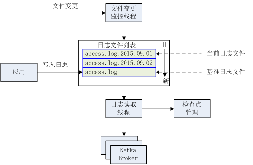
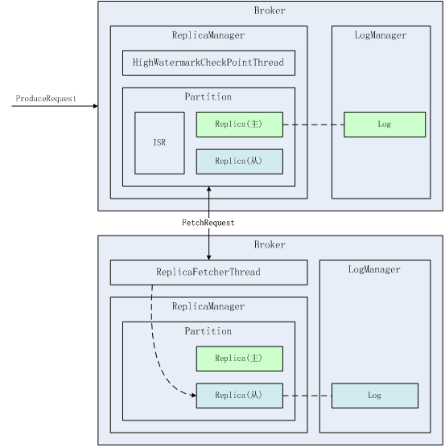
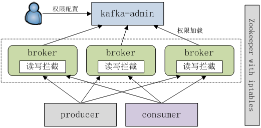
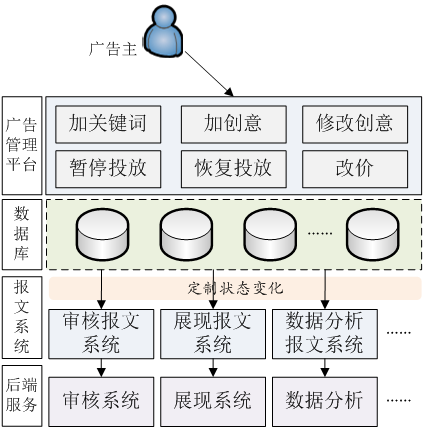
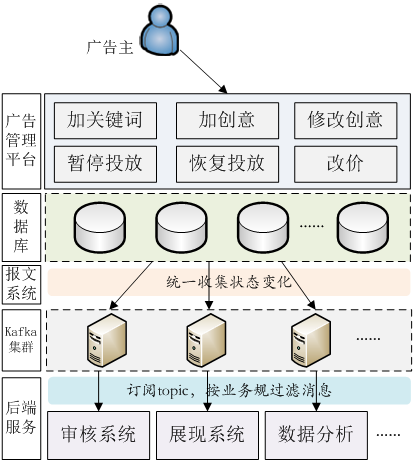

# 分布式消息中间件应用实践
Kafka 的优化及在商业平台中的应用

**标签:** 消息传递

[原文链接](https://developer.ibm.com/zh/articles/os-cn-kafka-distributed/)

刘建, 毛宏

发布: 2015-10-28

* * *

## 背景概述

搜狗商业平台负责搜狗商业广告平台的研发，其广告平台中存在大量的数据，包括广告物料、操作日志、PV 点击、上下线报文等。整个广告平台涉及实时 PV/UV 统计分析、实时安全分析、广告审核、日志汇总等通用功能和操作日志、上下线报文、账户优化等与业务线相关的功能，系统繁多，依赖关系复杂。早期，我们主要通过 rsync、ActiveMQ 等方式在不同系统间进行日志和数据的同步，然而，这些方式存在着时效性、性能、吞吐能力、消息堆积、失效转移时消息丢失等方面的问题，所以我们一直在探索一种有效方案来统一商业平台内部系统间的交互，降低数据处理的成本。Apache Kafka 是 Linkin 开源的高吞吐分布式消息系统，它具备高稳定、高吞吐、低延迟、分布式等方面的特征，同时能够支持消息消费者的自动水平扩展，有效解决消息堆积问题。因此，我们选用 Apache Kafka 作为我们内部统一的消息系统。

事实上，我们对消息系统有更严格的要求。1，对于关键操作（例如，上下线报文，操作日志），我们需要在任何情况下都尽量保证其端到端的消息可靠性。否则对于关键的操作，例如，该下线的广告没有下线，有可能会造成广告投放端资源的浪费；2，由于消息基础设施一般由多个应用共享，因此必须保证其合理的权限，约束其读写端的行为，防止由于越权导致数据方面的问题。

针对上述问题，我们在 Apache Kafka 的基础上进行了一系列的定制和优化，下面将分别阐述。

## 端到端的消息可靠性机制的保证

此处端到端的消息可靠性指生产者生产的消息，一定可以被消费者所消费。在 Kafka 典型的应用场景中，它包含三个层面的意思：1，在绝大部分场景下，生产者产生的消息能够发布到 Kafka Broker 集群上；2，消息在 Kafka Broker 集群上的存储是高可靠的，不会因为机器故障、网络故障而造成消息丢失；3，消费者端从 Kafka Broker 集群中获取并消费消息至少一次。其中，这里主要分析第 1 点和第 2 点。

在生产者端，Kafka 提供了一系列的生产者 API，生产者可直接通过 API 发布消息。然而，由于网络故障、硬件故障以及其它不可预期的原因，严重时可能会导致生产者进程挂掉。因此在生产者必须要对消息进行可靠传输，同时对消息传输的断点进行保存，便于极端场景下通过重试保证消息的可靠性。为此，我们开发了通用组件 Kafka Producer 用于最大程度的保证发送者的消息可靠性。为了保证消息的持久化，生产者会将通过追加写将消息持久化到本地日志文件（本地日志文件一般采用 RAID，具备一定的可靠性），Kafka Producer 是一个单独的进程，它通过监控本地日志文件的变化，并将其中的消息按照给定的主题发送到 Kafka Broker 集群中。其概念架构如图 1 所示。

##### 图 1\. Kafka Producer 概念架构图



例如，如下配置：

```
[topic_dubheapi_access]
request.required.acks=-1
producer.type=sync
log_base_path=/opt/logs/dubhe-api
base_log_fullpath=/opt/logs/dubhe-api/access.log
log_name_regx=/opt/logs/dubhe-api/access.log.*(?<!swp$)
topic=dubheapi_access
client.id=dubhe-api
sender.batch.num.messages=200
sender.waiting.max.ms=50
checkpoint_name=topic_dubheapi_access

```

Show moreShow more icon

上述配置监控的文件目录 _log\_base\_path_ 是/opt/logs/dubhe-api，其日志名称 log\_name\_regx 为/opt/logs/dubhe-api/access.log.\*(?<!swp$)，其基准日志文件 base\_log\_fullpath 为/opt/logs/dubhe-api/access.log，其发送模式 producer.type 是同步发送，其对应的主题是 dubheapi\_access, 其检查点文件为 topic\_dubheapi\_access。因此，该 Kafka Producer 进程对监控文件夹/opt/logs/dubhe-api 下的所有名称类似于 access.log.2015-09-06，access.log 的文件并将其中的消息按行发送到 Kafka Broker 集群的 dubheapi\_access 主题，同时定时将检查点写入 topic\_dubheapi\_access 文件中。

在 Kafka Producer 中，我们主要关注日志的顺序性以及可恢复性。

顺序性能够保证其监控的文件中的消息能够按顺序发送给 Kafka Broker，而顺序性主要受到日志切分影响。Kafka Producer 内部会维护一个按照更新时间正序排列的文件队列，同时也维护了当前处理的文件的位置，一般说来，当前处理的文件一般处于队列的最前面。当发生日志切分时，可能有两种场景。1，切分时当前队列中大于一个文件，此时切分的文件非当前日志文件，文件变更监控线程将其添加到文件队列即可；2，切分时当前队列中仅一个文件，那么一定是此文件发生了切分，在文件发生切分时，当前正在处理的文件的位置需要重置成文件队列最前面的文件，否则就可能造成部分消息丢失，无法保证顺序性。例如，若 access.log 发生切分，切分为 access.log.2015-09-02 和 access.log，若切分前的 access.log 日志文件中的消息未完全发送，则切分后仍处理新的 access.log 日志的话，则切分前的 access.log 日志文件中未处理的消息将丢失。

可恢复性指生产者进程在进程退出后能够尽快的恢复到之前的状态。为了保证这一点，我们通过检查点的机制来保证。检查点持久化到本地硬盘上，在每发送完一批消息（由参数 sender.batch.num.messages 确定）或者等待一定的时间（由参数 sender.waiting.max.ms 确定）就会将当前的文件位置，就会将当前位置和最后修改时间持久化到本地硬盘上，以便在灾难情况下能够迅速恢复到当前状态。当然，从性能方面来考虑，不可能在每条消息发送完之后进行检查点持久化，因此，有部分消息可能会被重发。

最后，在整个 Kafka Broker 集群不可用的情况下，Kafka Producer 将会等待，消息将在生产者端堆积，同时会触发堆积报警监控，便于后续人工介入处理。

当然，该方案仅能满足追加式写日志的需要，如果其监控的源日志文件是通过 rsync 或者可编辑，则不可使用该方案。然而，在我们的实践中，此种方式基本满足我们的绝大部分需求，在实践中被证明是一种有效的日志收集方法。

Broker 端消息可靠性的保证主要依赖于 Kafka Broker 自身的高可用机制。

在 Kafka Broker 中，每个 Topic 分为多个 Partition，每个 Partition 对应于一个主 Replica 和若干从 Replica。每个 Replica 若有对应的数据存储在本地，则对应于 LogManager 所管理的一个日志文件 Log，每个日志文件 Log 对应于当前 Broker 所在物理机文件系统中的一个目录，其概念架构图 2 所示。

##### 图 2\. Kakfa Replica 概念架构图



Broker 上消息的可靠性主要涉及到消息的可靠存储、消息复制以及节点失效处理等。

在消息的可靠存储中，消息是通过追加写写入日志文件中，由于 Linux 文件缓存机制，消息首先被写入缓存，需要通过 flush 将其持久化到硬盘。在数据写入到持久化之间出现故障，则可能导致数据丢失。Kafka 提供了两个参数：log.flush.interval.messages 和 log.flush.interval.ms 来控制其 flush 频率。然而，在系统故障（例如掉电）等的情况下，未 flush 到硬盘上的数据将会丢失。

为了保证高稳定性，Kafka 采用复制机制，主 Replica 提供读写，从 Replica 仅提供备份和灾备功能。在主 Replica 出现故障的情况下会将从 Replica 提升为主 Replica。主从间的数据复制由 ReplicaFetcherThread 完成，ReplicaFetcherThread 通过 FetchRequest 从相应的 Borker 中获取其所负责处理 Partition 的主 Replica 的数据。在 FetchRequest 请求中提供了其所取数据的偏移量，该偏移量有两个作用：1，用于 ReplicaFetcherThread 向主 Replica 指示获取数据的起始位置；2，用于 ReplicaManager 记录每个从 Replica 同步的位置，也称为高水位线。HighWatermarkCheckPointThread 会定期（由 log.flush.offset.checkpoint.interval.ms 参数控制）将其持久化到文件中，以便故障恢复。因此，在 Replica 的复制过程中，在发生故障的情况下，若偏移量没有及时上报，可能会重新获取消息，造成数据的重复。

Partition 中也同时采用了 ISR 来维护处于”同步”状态中的 Replica 列表。此同步指主 Replica 以及从 Replica 间的差距不会太大，此差距可通过参数 replica.lag.max.messages 和 replica.lag.time.max.ms 配置，分别表示消息偏移量差值大小以及从 Replica 通过 ReplicaFetcherThread 获取主 Replica 时的延迟时间。

生产者端可通过配置参数 request.required.acks 来在高吞吐和数据可靠性间获得平衡。其参数值及其说明如表 1 所示。

##### 表 1.request.required.acks 参数值及其说明

参数值说明0Broker 接收到数据后就返回，不关注写入状态。1Broker 写入主 Replica 就返回，会汇报写入状态给生产者。-1Broker 写入所有 ISR 中的 replica 之后才返回

事实上，在 Kafka 0. 8.1.X 以及其前的版本中，即使设置 log.flush.interval.ms=-1，在极端场景下可能发生数据丢失，例如：某个 Topic Partition 有 2 个 Replica, broker1 是 leader，broker2 是 follower，按如下步骤进行处理：

1. 停止 broker2，观察到 broker2 被从该 Partition 的 ISR 之中去掉之后
2. 停止 broker1
3. 启动 broker2
4. 启动 broker1

可以看到启动后此 Topic Partition 的 leader 变成了 broker2，如果在上述过程 1、2 之间持续发送消息的话，就会造成消息丢失。其本质原因是配置项 request.required.acks=-1 并不是指消息写入到所有 Replicas 之后才返回，而是指写入到在 ISR(in-sync replicas) 之中的 replicas 就返回。而 ISR 是会随着系统运行而动态增加或缩减的，极端情况下 ISR 的列表可能为 1 或者 0；当在 ISR 列表大小为 1 时，若该 Broker 由于故障而挂起，则在此期间写入到该 Broker 的数据可能丢失。这实际上是在 CAP 当中是选择 C(Consistency，一致性) 还是选择 A(Availability，可用性) 的问题，是一个设计权衡问题，并没有完美的解决方案。Kafka 0.8.1.x 强制选择可用性，牺牲一致性，用户无法通过配置项来更改。Kafka 最新的 0.8.2 新增了配置项 unclean.leader.election.enable 和 min.insync.replicas，用户可以根据场景的不同，自行决定选择可用性还是选择一致性。

目前的部署是 0.8.1.1 `版本` ，在我们的实践中若需要保证高可靠性，会将 request.required.acks 设置成-1，并其复制集设置为 3，即对每个 Topic Partition 都有 3 个 replica（其中包含一个主 replica）。然而，复制集设置为 3 会对发送者的性能有一定的影响，若需要更高的性能，则可将 Kafka 升级到 0.8.2 以上版本并将其 min.insync.replicas 设置为 2。

## Kafka 权限管理

通过分析 Kafka 的设计架构，可以看到其中存在较多安全方面的隐患，具体体现在以下几方面：

1. 向 Kafka 集群加入 Broker 节点时缺少认证授权，同一网络下任何一台服务器只需要在配置中指定集群的 Zookeeper 配置路径，并启动 Broker 服务，即可加入集群，获取 Producer 写入的数据。存在写入消息被新加入 Broker 恶意篡改的风险，且不易排查。
2. 任何服务器都可以向 Kafka 的任意 Topic 写数据，一方面，存在垃圾数据被恶意写入集群的风险，另一方面，在存在多套集群的情况下，也可能因配置出错导致消息发送者把数据误写入其他集群的风险，从而导致集群间的数据干扰。
3. 任何服务器都可以读任意 Topic 数据，敏感数据存在泄漏风险。
4. Zookeeper 中保存的配置数据没有设置读写权限，若被恶意篡改，会直接影响 Kafka 集群的稳定性。

随着 Kafka 的广泛应用，上述安全问题也日益凸显，截至目前最新的版本，Kafka 都没有提供任何安全机制，在社区对 Kafka 未来的路线图规划中，Kafka 安全是一个重要的方向。我们认为较好的 Kafka 权限设计应该满足以下特点：

1. 实现起来简单，不需要大量修改源码，不依赖第三方服务
2. 提供安全保障的同时不降低 Kafka 读写性能
3. 权限配置简单，操作方便

因此，在 Kafka 的应用实践过程中，为规避可能出现的安全风险，我们根据以上目标设计了一套 Kafka 安全架构，如图 3 所示。

##### 图 3\. Kafka 安全架构



Kafka 以 Topic 组织数据，权限设计也以 Topic 为单位进行管理。我们以当前请求机器的 IP、请求机器提供的 ClientId（对于 Producer）或者 GroupId(对于 Consumer) 以及请求的 Topic 进行权限判断。在 Kafka Broker 中，我们新增了一个权限刷新线程，用于从远程或本地加载权限信息，可通过配置文件配置是否开启权限控制、权限刷新周期、本地备份路径等。Kafka Broker 中处理客户端（包括 Producer 和 Consumer）的请求时，是通过 KafkaApis 的 handle() 方法根据请求类型执行相应的处理。对于写请求，我们在处理写数据的请求 RequestKeys.ProduceKey 前加上权限判断拦截，获取 Producer 的 IP、ClientId 以及请求写入的 Topic 名，判断是否存在写权限列表中，若存在则通过权限校验，否则拒绝写入。对于读请求，我们在处理读数据请求 RequestKeys.FetchKey 前获取 Consumer 的 ClientId，IP 和请求读取的 Topic，判断是否存在读权限列表中，若存在则通过权限校验，否则拒绝读取。默认情况下，Consumer 的 ClientId 等于其 GroupId。

我们也提供了 Kafka Admin 端，可通过 Web 方式针对 Topic 配置其读写权限。

最后，对于 Zookeeper 上数据安全问题，可简单的通过部署私有集群以及 iptables 的方式来解决。其实践较简单，不再赘述。

## 应用实践

Kafka 作为基础服务，在搜狗商业平台广泛应用于各类数据业务，为了便于采集各业务系统的日志数据，我们通过自行开发的 Kafka Producer 收集日志，它支持日志文件切分、故障恢复、断点续传和失败重试，已作为基础组件部署在产生数据的各应用服务器上，各应用只需把数据写入日志文件，即可将数据按需收集并传输至 Kafka 集群。下游的消费系统可进一步对系统日志数据做实时处理。商业平台 Kafka 应用架构如图 4 所示。通过 Kafka，我们将很多统计分析类应用的响应时间提升到了秒级。

##### 图 4\. 商业平台 Kafka 应用架构


在搜狗商业平台，每天会产生上亿级的广告的状态变化数据，包括新增/修改广告的审核、关键词的调价、暂停投放、恢复投放等。这些广告状态变化的数据都需要实时监控获取并传输到后端服务系统，再进行广告的相关处理。

在引入 Kafka 之前，原广告状态变更处理架构如图 5 所示，对每类广告状态变化业务，都需要单独设立一条数据传输通道，如下图所示。

##### 图 5\. 原广告状态变更处理架构



广告主新提交广告后，需要把新增广告的消息传输给广告审核系统进行实时审核；广告主对投放中的广告做改价操作后，需要把该广告的改价消息传输给广告展现系统进行展现策略调整；广告主暂停对某个广告的投放后，需要通知展现系统停止展现该广告；而对于每条广告的各种状态变化，也都需要统一收集并做进一步数据分析。如此一来，每新增一类广告样式或新增一种状态变化，都需要在报文系统层单独定制状态变化的监控，并与后端服务系统进行单对单的数据传输，系统的扩展性和开发维护成本都比较高，并且发给各后端业务系统的数据之间可能还存在交集，比如发给展现系统的数据也需要发给数据分析系统一份，作业也就存在一定的资源浪费。

引入 Kafka 后，广告状态变更处理架构如图 6 所示，我们用 Kafka 来统一收集各种广告状态的变化数据，由下游系统订阅获取，下图所示。

##### 图 6\. 引入 Kafka 后广告状态变更处理架构



引入 Kafka 后，报文系统负责统一收集广告的状态变化消息并写入 Kafka，供下游系统使用。一方面，系统规模可横向扩展，消息传输的吞吐率得以极大提升，能够满足日均亿级消息量的实时传输，另一方面，也满足了各类业务场景的向后兼容性，对于新增类型的广告状态变化，只需数据订阅端按需定制自己关心的数据并对消息进行解析过滤即可。

同时，Kafka 作为商业平台的重要基础服务，我们也根据实际需要，部署了完备的监控。监控分两大类：系统常规监控和特定监控。系统常规监控主要包括三部分：

1. 系统级的监控：如 Kafka Broker 的 CPU 负载、内存使用率、存储空间、I/O 负载。
2. 错误日志监控：主要是 Kafka Broker 的 error 日志。
3. JVM 监控：主要是 Broker 进程的线程信息、JVM 堆、GC 情况等。

特定监控中，主要包括以下几点：

1. Kafka 集群的 QPS 监控

    Kafka 提供了 JMX 监控接口，可通过获取 MBean “Kafka.server”:type=”BrokerTopicMetrics”,name=”AllTopicsMessagesInPerSec”中 OneMinuteRate 属性的值得到。QPS 超出一定阈值时发出报警。

2. Producer 端消息积压监控

    日志收集中间件在发送消息至 Kafka 时会在 checkpoint 文件中记录当前处理的文件的最后修改时间和偏移量，通过计算当前的偏移量和系统中最新的文件的偏移量的差值即可得知消息积压量。

3. Topic 级别的消息写入监控

    正常情况下，系统在一段时间内向一个 Topic 写入的数据量应该有一个大致的范围，写入量过多时，可能是 QPS 过高，写入量过少时，有可能是 producer 端出现写入堵塞，或者业务出现骤降，都属于异常情况，可以发出报警通知相关人员。此类监控可通过 Kafka 提供的工具实现，两次运行$KAFKA\_HOME/bin/Kafka-run-class.sh Kafka.tools.GetOffsetShell –broker-list ${brokerhostname:port} –time -1 –topic${topicName}，如果两次运行获取的 logEndOffset 差值不在既定范围内，说明流量可能异常，发出报警。

4. 消费延迟监控

    当消息写入速率高于 consumer 处理消息速率时，会出现消息在 Kafka 中堆积的情况，为避免大量消息积压在 Kafka 集群内部，可增加消费延迟监控，在出现消息堆积时发出报警，相关人员可据此判断是否可以优化 consumer 处理效率或对 consumer 做扩容。具体的监控方法也可以使用 Kafka 提供的工具实现，运行$KAFKA\_HOME/bin/Kafka-run-class.sh Kafka.tools.ConsumerOffsetChecker –zkconnect ${zkPath} –group ${consumer.groupid} -topic ${topicName}，可得到指定消费组对指定 topic 的每个 partition 的未消费消息量，当该值大于指定阈值时，发出报警。


上述监控主要对端到端的消息积压和延时以及 QPS 进行监控，使得端到端的响应时间是可控的，并且能够在出现异常时及时报警。

## 结束语

搜狗商业平台致力于使用 Kafka 来统一商业平台基础消息设施，目前正支撑着众多线上业务的发展，每天承载着十亿级消息的流入流出。我们接下来会在 Kafka 安全方面做进一步的探索和研究，包括用户级的认证机制、增加客户端配额限制等，此外，我们也会持续完善 Kafka Admin `端` ，在集群易用性方面做更多的优化。