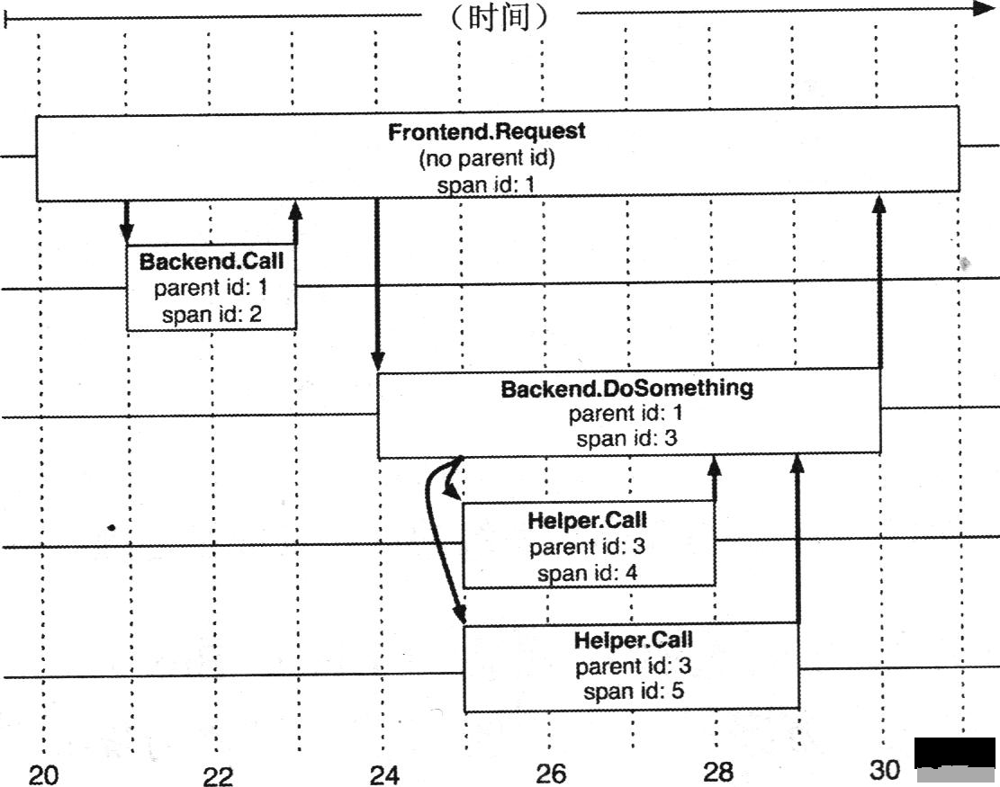
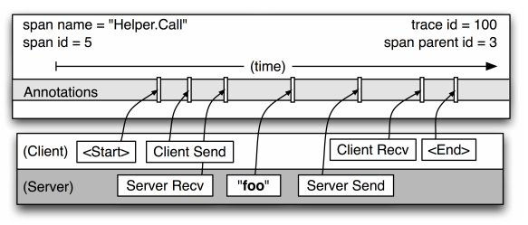
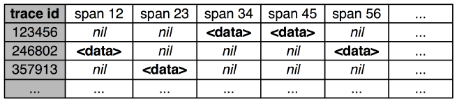
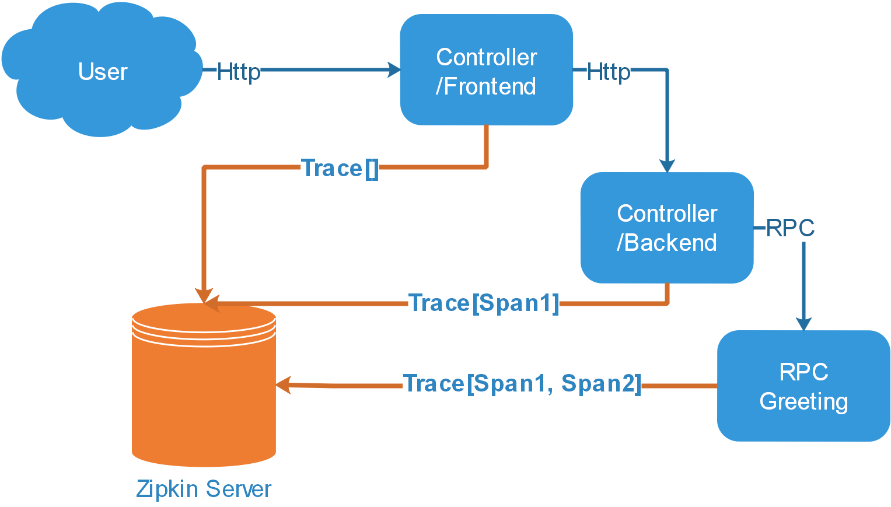
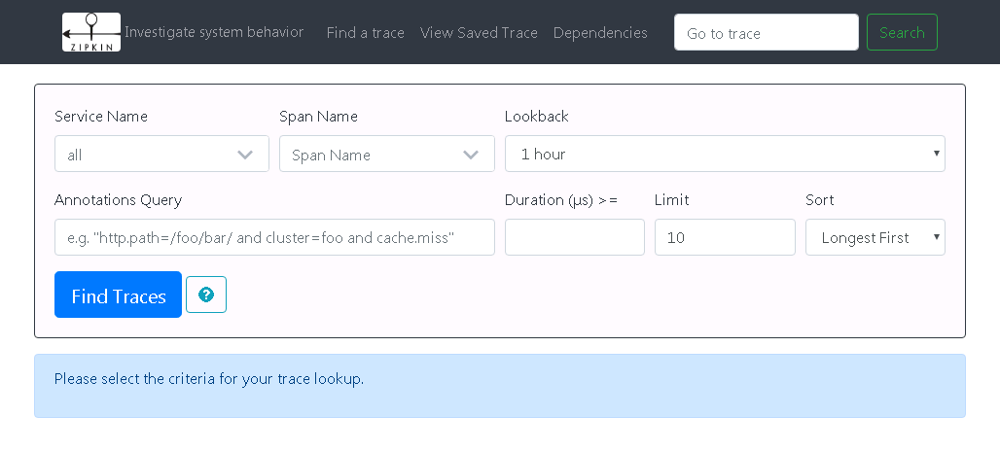
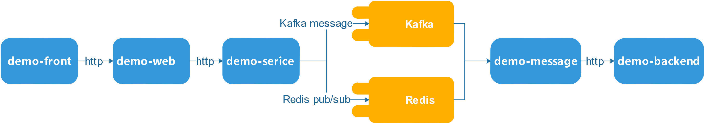
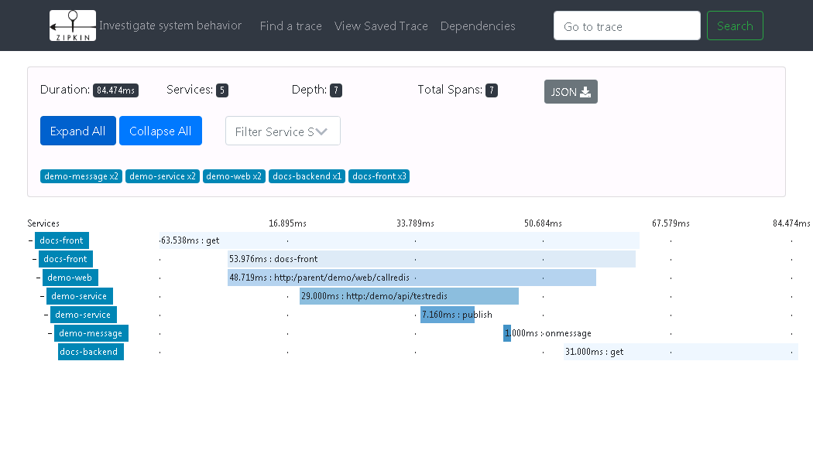

# 分布式集群环境下调用链路追踪
基于 Google Dapper 设计理念的分布式服务跟踪

**标签:** Java,Node.js,Web 开发,微服务

[原文链接](https://developer.ibm.com/zh/articles/wa-distributed-systems-request-tracing/)

李林锋

发布: 2018-11-13

* * *

## 前言

现代微服务系统中，一套复杂的分布式 Web 系统中，客户端的一次请求操作，可能需要经过系统中多个模块、多个中间件、多台机器的相互协作才能完成，并且这一系列调用请求中，有些是串行处理的，有些是并发执行的，那么如何确定客户端的一次操作背后调用了哪些应用、哪些模块，经过了哪些节点，每个模块的调用先后顺序是怎样的，每个模块的性能问题如何？随着业务系统模型的日趋复杂化，分布式系统中急需一套链路追踪（Trace）系统来解决这些痛点。

分布式服务跟踪是整个分布式系统中跟踪一个用户请求的过程，包括数据采集、数据传输、数据存储、数据分析和数据可视化，捕获此类跟踪让我们构建用户交互背后的整个调用链的视图，这是调试和监控微服务的关键工具。

Google Dapper 就是这样需求下的一套应用于大型分布式系统环境下的链路追踪系统。借助 Dapper 理念，系统开发人员只需将 Trace 组件嵌入到基础通用库中，就可以正常运行，而应用层开发者则不需要关心具体 Trace 组件实现、集成方式，达到以应用层透明的方式嵌入各个模块的目的。

## Google Dapper 简介

Google Dapper 这一分布式跟踪系统，最初只是作为一个自给自足的监控工具起步的，但最终进化成一个监控平台，并且促生出多种多样的甚至已经不是由 Dapper 团队开发的监控工具，说明分布式追踪系统在当前的分布式环境下是必不可少的工具。

现代互联网服务通常实现为复杂的大规模系统，比如采用流行的微服务架构模式。应用是由一组服务组合起来的，这些服务可能是由不同的团队开发的，而且可能采用不同的编程语言。像 Google 这种级别的公司，应用会跨越多个基础设施的上千台机器，即便是相对较小的云计算用例，推荐的做法也是使用跨地域的 Availability Zone 和 Region 运行服务的多个版本。在这种复杂的系统环境中，分布式追踪系统能够辅助我们理解系统的行为、帮助调试和排查性能问题。

Google 最初开发 Dapper 为了收集更多的复杂分布式系统的行为信息，然后呈现给 Google 的开发者们。这样的分布式系统因那些大规模的低端服务器作为互联网服务的载体，是一个特殊的经济划算的平台。想要在这个上下文中理解分布式系统的行为，就需要监控那些横跨了不同的应用、不同的服务器之间的关联动作。

从众多的分布式系统应用中得出的经验，对于分布式追踪系统需要满足至少两点要求：涵盖面的广度和持续的监控。涵盖广度的重要性不言而喻，因为在使用追踪系统的进行监控时，如果有一小部分没被监控到，那么人们对这个系统是不是值得信任都会产生巨大的质疑。另外，监控应该是 7×24 小时的，毕竟，系统异常或是那些重要的系统行为有可能出现过一次，就很难甚至不太可能重现。那么，根据这两个明确的需求，可以推出如下几个具体的设计目标：

1. 低性能损耗 (Low overhead)：分布式在线系统对于性能、资源要求都很严格，Trace 组件必须对服务影响足够小。对于一些高度优化过的服务，即使一点点性能损耗也会很容易察觉到，而且有可能迫使在线服务的部署团队不得不将分布式追踪系统关停。
2. 应用级的透明 (Application-level transparency)：应用层开发者不需要对 Trace 组件关心，Trace 嵌入到基础通用库中，提供高稳定性，而如果 Trace 需要应用开发者配合，那可能会引入额外的 bug 导致 Trace 系统更加脆弱。面对当下互联网公司快速迭代的开发环境来说，这一点尤其重要。
3. 扩展性 (Scalability)：Google 的服务在线集群数量可想而知，一次检索就可能跨越上百台甚至成千台机器，因此这个 Trace Infrastructure 的扩展性也很重要。

当然，以上几点设计目标的背后，还有一个额外的设计目标就是追踪数据产生之后，能够快速导出数据，快速进行数据分析，在最短的时间内定位系统异常，理想情况是数据存入跟踪仓库后一分钟内就能统计出来。尽管跟踪系统对一小时前的旧数据进行统计也是相当有价值的，但如果跟踪系统能提供足够快的信息反馈，就可以对生产环境下的异常状况做出快速反应。

另外，要做到真正的应用级别的透明（这应该是当下面临的最挑战性的设计目标），我们需要把核心跟踪代码做的很轻巧，然后把它植入到那些无所不在的公共组件中，比如线程调用、控制流以及 RPC 库。使用自适应的采样率可以使跟踪系统变得可伸缩，并降低性能损耗。结果展示的相关系统也需要包含一些用来收集跟踪数据的代码，用来图形化的工具，以及用来分析大规模跟踪数据的库和 API。虽然单独使用 Dapper 有时就足够让开发人员查明异常的来源，但是 Dapper 的初衷不是要取代所有其他监控的工具。Dapper 的数据往往侧重性能方面的调查，其他监控工具也有他们各自的用处。

## 基于 Google Dapper 的分布式追踪介绍

当我们进行微服务架构开发时，通常会根据业务或功能划分成若干个不同的微服务模块，各模块之间通过 REST/RPC 等协议进行调用。一个用户在前端发起某种操作，可能需要很多微服务的协同才能完成，如果在业务调用链路上任何一个微服务出现问题或者网络超时，将导致功能失效，或出现某些模块在调用链中耗时突然增大等问题。随着业务越来越复杂，微服务架构横向、纵向扩展之后，其规模越来越大，对于微服务之间的调用链路的分析将会越来越复杂。此时你会发现，如果在最初架构设计时，能够将分布式链路追踪这种需求考虑进来，后期微服务集群扩容时候，前期所做的工作将会达到事半功倍的效果。

下面先来看看 Google Dapper 论文里面介绍的一个非常简单、常见的一个场景：


_引用自文章 “ [Dapper, a Large-Scale Distributed Systems Tracing Infrastructure](https://storage.googleapis.com/pub-tools-public-publication-data/pdf/36356.pdf)” 中的 Figure 1_

上图中 A~E 分别表示五个服务，用户发起一次 X 请求到前端系统 A，然后 A 分别发送 RPC 请求到中间层 B 和 C，B 处理请求后返回，C 还要发起两个 RPC 请求到后端系统 D 和 E。

以上完整调用回路中，一次请求需要经过多个系统处理完成，并且追踪系统像是内嵌在 RPC 调用链上的树形结构，然而，我们的核心数据模型不只局限于特定的 RPC 框架，我们还能跟踪其他行为，例如外界的 HTTP 请求，和外部对 Kafka 服务器的调用等。从形式上看，分布式追踪模型使用的 Trace 树形结构来记录请求之间的关系（父子关系、先后顺序等）。

### Trace 和 Span

Google Dapper 中关于 Trace 的介绍中主要有以下三个主要元素构成：

1. Span：基本工作单元，例如，在一个新建的 Span 中发送一个 RPC 等同于发送一个回应请求给 RPC，Span 通过一个 64 位 ID 唯一标识，Trace 以另一个 64 位 ID 表示。Span 还有其他数据信息，比如摘要、时间戳事件、关键值注释 (Tags)、Span 的 ID、以及进度 ID (通常是 IP 地址)。Span 在不断地启动和停止，同时记录了时间信息，当你创建了一个 Span，你必须在未来的某个时刻停止它。
2. Trace 树：一系列 Span 组成的一个树状结构，例如，如果你正在跑一个分布式大数据工程，你可能需要创建一个 Trace 树。
3. Annotation（标注）：用来及时记录一个事件的存在，一些核心 Annotation 用来定义一个请求的开始和结束。

分布式追踪系统要做的就是记录每次发送和接受动作的标识符和时间戳，将一次请求涉及到的所有服务串联起来，只有这样才能清楚记录每次请求的完整调用链。在分布式追踪系统中使用 Trace 表示对一次请求完整调用链的跟踪，将两个服务例如上面图中的服务 A 和服务 B 的请求/响应过程叫做一次 Span。 我们可以看出每一次跟踪 Trace 都是一个树型结构，Span 可以体现出服务之间的具体依赖关系。

对于每个 Trace 树，Trace 都要定义一个全局唯一的 Trace ID，在这个跟踪中的所有 Span 都将获取到这个 Trace ID。 每个 Span 都有一个 Parent Span ID 和它自己的 Span ID。上面图中 A 服务的 Parent Span ID 为空，Span ID 为 1；然后 B 服务的 Parent Span ID 为 1，Span ID 为 2；C 服务的 Parent Span ID 也为 1，Span ID 为 3，依次类推，如下图所示：



_引用自文章 “ [Dapper, a Large-Scale Distributed Systems Tracing Infrastructure](https://storage.googleapis.com/pub-tools-public-publication-data/pdf/36356.pdf)” 中的 Figure 2_

追踪系统中用 Span 来表示一个服务调用的开始和结束时间，也就是时间区间。追踪系统记录了 Span 的名称以及每个 Span ID 的 Parent Span ID，如果一个 Span 没有 Parent Span ID 则被称为 Root Span，当前节点的 Parent Span ID 即为调用链路上游的 Span ID，所有的 Span 都挂在一个特定的追踪上，共用一个 Trace ID。

### Span 内部结构

下面看一下 Span 的内部结构，Span 除了记录 Parent Span ID 和自身的 Span ID 外，还会记录自己请求其他服务的时间和响应时间。但是每个服务器的时间可能不是完全相同，为了解决这个问题需要约定一个前提，即 RPC 客户端必须发出请求后，服务端才能收到，如果服务端的时间戳比客户端发出请求的时间戳还靠前，那么就按请求时间来算，响应时间也是如此。

任何一个 Span 可以包含来自不同 Server 的信息，这些也要记录下来。事实上，每一个 RPC Span 可能包含客户端和服务器两个过程的 Annotation 内容。由于客户端和服务器上的时间戳来自不同的主机，我们必须考虑到 Server 之间的时间偏差。在链路追踪分析中，每一个请求，总是一方先发送一个请求之后，然后另外一方才接收到；这样一来，每个调用请求就有一个时间戳的上限和下限。



_引用自文章 “ [Dapper, a Large-Scale Distributed Systems Tracing Infrastructure](https://storage.googleapis.com/pub-tools-public-publication-data/pdf/36356.pdf)” 中的 Figure 3_

从图 3 可以可以很清楚的看出，这是一次 Span 名为 `Hello.Call` 的调用，Span ID 是 5，Parent Span ID 是 3，Trace ID 是 100。 我们重点看一下 Span 对应的四个状态：

- Client Send（CS）：客户端发送时间，客户端发起一个请求，这个 Annotation 描述了这个 Span 的开始。
- Server Received（SR）：服务端接收时间，服务端获得请求并准备开始处理它，如果将其 SR 减去 CS 时间戳便可得到网络延迟。
- Server Send（SS）：服务端发送时间，Annotation 表明请求处理的完成（当请求返回客户端），如果 SS 减去 SR 时间戳便可得到服务端需要的处理请求时间。
- Client Received（CR）：客户端接收时间，表明 Span 的结束，客户端成功接收到服务端的回复，如果 CR 减去 CS 时间戳便可得到客户端从服务端获取回复的所有所需时间。

通过收集这四个时间戳，就可以在一次请求完成后计算出整个 Trace 的执行耗时和网络耗时，以及 Trace 中每个 Span 过程的执行耗时和网络耗时:

- 服务调用耗时 = CR – CS
- 服务处理耗时 = SS – SR
- 网络耗时 = 服务调用耗时 – 服务处理耗时

### 生成 Span

我们已经初步了解了 Span 的组成，那么怎么生成 Span 呢？Google Dapper 中使用到的是基于标注 (Annotation-based) 的监控方案。此方案会有代码侵入，所以应尽可能少改动代码。

基于标注的方式就是根据请求中的 Trace ID 来获取 Trace 这个实例，各种编程语言有各自的方式。获取到 Trace 实例后就可以调用 Recorder 来记录 Span 了，记录值先直接以日志的形式存在本地，然后跟踪系统会启动一个 Collector Daemon 来收集日志，然后整理日志写入数据库。解析的日志结果建议放在 BigTable (Cassandra 或者 HDFS) 这类稀疏表的数据库里。因为每个 Trace 携带的 Span 可能不一样，最终的记录是每一行代表一个 Trace，这一行的每一列代表一个 Span，如下图所示：



_引用自文章 “ [Dapper, a Large-Scale Distributed Systems Tracing Infrastructure](https://storage.googleapis.com/pub-tools-public-publication-data/pdf/36356.pdf)” 中的 Figure 5_

对于减少代码的侵入性，论文建议将核心跟踪代码做的很轻巧，然后把它植入公共组件中，比如线程调用、控制流以及 RPC 库。

### 采样率

分布式跟踪系统的实现要求性能低损耗，尤其在生产环境中不能影响到核心业务的性能，也不可能每次请求都跟踪，所以要进行采样，每个应用和服务可以自己设置采样率。采样率应该是在每个应用自己的配置里设置的，这样每个应用可以动态调整，特别是刚应用刚上线时可以适当调高采样率。

一般在系统峰值流量很大的情况下，只需要采样其中很小一部分请求，例如 1/1000 的采样率，即分布式跟踪系统只会在 1000 次请求中采样其中的某一次。

### Trace 收集

分布式跟踪系统的追踪记录和收集管道的过程分为三个阶段：

1. Span 数据写入本地日志文件中。
2. Dapper 的守护进程和收集组件把这些数据从生产环境的主机中拉出来。
3. 最终写到 Dapper 的 Bigtable 仓库中。一次跟踪被设计成 Bigtable 中的一行，每一列相当于一个 Span。

Bigtable 的支持稀疏表格布局正适合这种情况，因为每一次追踪请求可能产生多个 Span。写入数据后的 Bigtable，每一条记录集表示一条 Trace 记录。这些监控数据的汇总是单独进行的，而不是伴随系统对用户的应答一起返回的。如此选择主要有如下的两个原因：

- 首先，一个内置的汇总方案 (监控数据随 RPC 应答头返回）会影响网络动态。一般来说，RPC 应答数据规模比较小，通常不超过 10KB。而区间数据往往非常庞大，如果将二者放在一起传输，会使这些 RPC 应答数据相对”矮化”进而影响后期的分析。

- 另一方面，内置的汇总方案需要保证所有的 RPC 都是完全嵌套的，但有许多的中间件系统在其所有的后台返回最终结果之前就对调用者返回结果，这样有些监控信息就无法被收集。


基于这两个考虑，最终选择将监控数据和应答信息分开传输。

## Java 下 Trace 介绍以及实践

### 工具介绍

分布式追踪系统一般主要由两方面构成：即基于 Annotation 的标注和追踪系统框架。对应 Java 中主要有下面两个工具：

- Brave：用来装备 Java 程序的类库，提供了面向 Standard Servlet、Spring MVC、HTTP Client、JAX RS、Jersey、Resteasy 和 MySQL 等接口的装备能力，可以通过编写简单的配置和代码，让基于这些框架构建的应用可以向 Zipkin 报告数据。同时 Brave 也提供了非常简单且标准化的接口，在以上封装无法满足要求的时候可以方便扩展与定制。

- Zipkin：是一款开源的分布式实时数据追踪系统（Distributed Tracking System），基于 Google Dapper 的论文设计而来，由 Twitter 公司开发贡献。其主要功能是聚集来自各个异构系统的实时监控数据，用来追踪微服务架构下的系统延时问题。


两种工具在追踪系统中的用途如下：



由上图可见，一次请求过程中，请求先通过 HTTP 到达前端，然后通过 HTTP 调用后台系统，同时后台系统通过 RPC 调用 Greeting 模块，每一个 Span 对应的 Annotation 信息都会实时的回传至 Zipkin Server，通过这样的链路可以准确的分析出网络、系统性能等问题。

### 工具选择

鉴于目前微服务框架大多都选择 Spring Cloud 来实现，本文主要使用 Spring Cloud Sleuth 和 Zipkin 来进行介绍：

- Sleuth：是 Spring Cloud 在分布式系统中提供链路追踪解决方案。

- Zipkin：是一套基于 Google Dapper 的分布式链路调用的监控系统。


### 搭建 Zipkin Server

1. 新建一个基于 Spring Boot 的 Gradle 项目，项目名称为：zipkin-server。
2. 项目 build.gradle 配置如下：

    **清单 1\. zipkin-server Gradle 脚本**


    ```
    repositories {
    }

    dependencies {
        compile('org.springframework.boot:spring-boot-starter')
        compile('org.springframework.boot:spring-boot-starter-jdbc')
        compile('io.zipkin.java:zipkin-server')
        runtime('io.zipkin.java:zipkin-autoconfigure-ui')
        compile('io.zipkin.java:zipkin-autoconfigure-storage-mysql')
        compile('mysql:mysql-connector-java')
    }

    ```


    Show moreShow more icon

3. 项目 application.yml 配置如下：

    **清单 2\. application.yml 配置**


    ```
    server:
    port: 9411

    docs:
    service:
        name: docs-zipkin

    # Spring Profiles
    spring:
    application:
        name: docs-zipkin-server
    # Http Encoding
    http:
        encoding.charset: UTF-8
        encoding.enable: true
        encoding.force: true
    datasource:
        schema: classpath:/mysql.sql
        url: jdbc:mysql://127.0.0.1:3306/zipkin
        username: root
        password: password
        # Switch this on to create the schema on startup:
        initialize: true
        continueOnError: true

    zipkin:
    storage:
        type: mysql

    spring.profiles.active: dev

    ```


    Show moreShow more icon

4. Spring Boot 启动类参照项目代码： [ZipkinApplication.java](https://github.com/lenvon2012/trace-demo/blob/master/zipkin-server/src/main/java/com/trace/demo/ZipkinApplication.java) 。

5. zipkin-server 配置完成，将其启动之后，访问 `http://localhost:9411` 将看到如下 Zipkin 管理界面：

    


### 创建 demoe-web 工程

1. 新建一个基于 Spring Boot Web 的 Gradle 项目，项目名称为：demo-web。
2. 项目 build.gradle 配置如下：

    **清单 3\. demo-web Gradle 脚本**


    ```
    repositories {
    }

    dependencies {
        compile project(':demo-model')
        compile project(':demo-util')

        compile('org.springframework.boot:spring-boot-starter-web')
        compile('org.springframework.cloud:spring-cloud-starter-sleuth')
        compile('org.springframework.cloud:spring-cloud-sleuth-zipkin')
    }

    ```


    Show moreShow more icon

3. 项目 application.yml 配置如下，由于是 demo 环境，所以采样率设置为 100%。

    **清单 4\. application.yml 配置**


    ```
    spring:
    application:
        name: demo-web
    profiles:
        active: dev
    sleuth:
        sampler:
          percentage: 1
    #   Percentage of logs export to zipkin server
    zipkin:
        # For enabling Zipkin Client for this Microservice
        enabled: true
        # Server Url
        baseUrl: http://localhost:9411

    # Server Information
    server:
    port: 8080

    ```


    Show moreShow more icon

4. Spring Boot 启动类如清单 5 中所示，通过配置 `HttpResponseInjectingTraceFilter` 、 `CustomHttpServletResponseSpanInjector` 类（具体参考 [项目代码](https://github.com/lenvon2012/trace-demo/tree/master/demo-web/src/main/java/com/trace/demo/util) ），将 Trace ID 和 Web 模块的 Span ID 保存在 header 中返回给用户端，通过这种方式也可以显示在 Web 界面。

    **清单 5\. demo-web 启动类**


    ```
    @SpringBootApplication(scanBasePackages = { "com.ibm.demo" })
    public class DemoWebApplication {

           public static void main(String[] args) {
                   SpringApplication.run(DemoWebApplication.class, args);
           }

           @Bean
           public RestTemplate restTemplate() {
                  return new RestTemplate();
           }

           @Bean
           public SpanInjector<HttpServletResponse>
    customHttpServletResponseSpanInjector() {
                   return new CustomHttpServletResponseSpanInjector();
           }

           @Bean
           public HttpResponseInjectingTraceFilter responseInjectingTraceFilter(Tracer
    tracer) {
                   return new HttpResponseInjectingTraceFilter(tracer,
    customHttpServletResponseSpanInjector());
           }

        @Bean
        public Sampler defaultSampler() {
             return new AlwaysSampler();
        }

    }

    ```


    Show moreShow more icon

5. Web Controller 类中包含以下 4 个接口：

6. /demo/web/：demo-web 直接返回。

7. /demo/web/call：demo-web 通过 HTTP 调用 demo-service 接口。
8. /demo/web/callkafka：demo-web 通过 Kafka 发消息给 demo-service。
9. /demo/web/callredis：demo-web 通过 Redis 发消息给 demo-service。

## Node.js 下 Trace 介绍以及实践

Node.js 追踪是通过与 Zipkin 集成来实现的，具体是通过 Express 与 Zipkin 集成来完成，两者的集成非常简单，并且入侵性也小。

### Node.js 追踪集成介绍

- Express Server：Express Server 与 Zipkin 的集成，即 Server 接收到请求时把自身的调用信息发送到 Zipkin。
- Rest Client：服务 A 调用服务 B 时，服务 A 把调用链信息发送到 Zipkin。
- Tracer：根据 context 把记录的 Span 信息通过 Recorder 发送到 Zipkin。
- Recorder：发送信息到 Zipkin，支持两种方式，一种是直接发送到 Zipkin Server，还有一种是控制台输出，控制台输出的方式可以用来调试，本 demo 中我们选择第一种方式。

### 创建 demo-front 工程

限于篇幅问题，将涉及 Node.js 的 demo-frontend、demo-backend 都放在 [demo-front](https://github.com/lenvon2012/trace-demo/tree/master/demo-front) 工程中。

1. 新建一个基于 Node.js 的项目，项目名称为：demo-front。
2. 项目 package.json 配置如下：

    **清单 6\. package.json 配置**


    ```
    {
    "name": "demo-front",
    "version": "0.0.1",
    "description": "Example project that shows how to use zipkin with javascript",
    "repository": "https://github.com/openzipkin/zipkin-js",
    "scripts": {
        "lint": "eslint .",
        "start": "node servers.js",
        "browserify": "browserify browser.js -o bundle.js"
    },
    "dependencies": {
        "browser-process-hrtime": "^0.1.2",
        "express": "^4.14.0",
        "rest": "^1.3.2",
        "zipkin": "^0.11.1",
        "zipkin-context-cls": "^0.11.0",
        "zipkin-instrumentation-cujojs-rest": "^0.11.1",
        "zipkin-instrumentation-express": "^0.11.1",
        "zipkin-instrumentation-fetch": "^0.11.1",
        "zipkin-transport-http": "^0.11.1"
    },
    "devDependencies": {
        "browserify": "^14.1.0",
        "eslint": "^3.4.0",
        "eslint-config-airbnb": "^14.1.0",
        "eslint-plugin-import": "^2.2.0",
        "eslint-plugin-jsx-a11y": "^4.0.0",
        "eslint-plugin-react": "^6.2.0"
    }
    }

    ```


    Show moreShow more icon

3. 创建 frontend.js，后续将使用 frontend.js 作为最前端调用 demo-web，完成 Node.js 端调用 Java Web 模块的 Trace 模拟，如清单 7 所示，完整代码参照项目： [frontend.js](https://github.com/lenvon2012/trace-demo/blob/master/demo-front/frontend.js) 。

    **清单 7\. frontend.js 代码**


    ```
    app.get('/redis', (req, res) => {
    var url_parts = url.parse(req.url, true);
    var query = url_parts.query;
    res.header('X-B3-TraceId', tracer.id.traceId);
    res.header('X-B3-SpanId', tracer.id.spanId);
    tracer.local('docs-front', () =>
        zipkinRest(`http://localhost:8080/docs/web/callredis?msg=${query.msg}`)
          .then(response => res.send(response.entity))
          .catch(err => console.error('Error', err.stack))
    );
    console.log(`tracerId : ${tracer.id.traceId}, spanId : ${tracer.id.spanId}`);
    });
    app.get('/kafka', (req, res) => {
             var url_parts = url.parse(req.url, true);
             var query = url_parts.query;
             res.header('X-B3-TraceId', tracer.id.traceId);
             res.header('X-B3-SpanId', tracer.id.spanId);
             tracer.local('docs-front', () =>
               zipkinRest(`http://localhost:8080/docs/web/callkafka?msg=${query.msg}`)
                   .then(response => res.send(response.entity))
                   .catch(err => console.error('Error', err.stack))
             );
             console.log(`tracerId : ${tracer.id.traceId}, spanId :
    ${tracer.id.spanId}`);
            });

    ```


    Show moreShow more icon

4. 创建 backend.js，如清单 8 所示。后续将使用 backend.js 作为最后端，完成 Node.js 端调用 Java 模块，然后 Java 模块调用 Node.js 模块的一套完整的 Trace 模拟。

    **清单 8\. backend.js 代码**


    ```
    app.get('/api', (req, res) => {
           var url_parts = url.parse(req.url, true);
           var query = url_parts.query;
           console.log(`docs-backend msg : ${query.msg}`);
           console.log(`docs-backend tracerId : ${tracer.id.traceId}, spanId :
    ${tracer.id.spanId}`);
           res.send(new Date().toString())
    });

    ```


    Show moreShow more icon


## 中间件中 Trace 介绍以及实践

本文 demo 中所谈到的中间件是基于 Java 语言环境下，与 Kafka、Redis 中间件的集成，Spring Cloud 中已经包含与 Kafka 的集成工具：spring-cloud-starter-stream-kafka，只需在 dependency 中引用加上配置即可，与 Redis 的集成，由于版本还处于 1.0 并且已经被 deprecated 了，所以只能按照 Stream binder 实现方式自行实现。

### 中间件追踪集成介绍

- spring-cloud-starter-stream-kafka：Spring Cloud 中与 Kafka 集成的工具包，即通过集成之后能够将 Trace 信息通过 Kafka Message 传递到下游系统。
- Redis：与 Redis 集成能够传递 Trace 信息，在上游系统发送 Message 到 Redis 之前在 Message 基础上将 Trace 信息封包进去，通过 Redis 传递到下游系统，下游系统收到消息之后再将封包消息进行解包处理，同时将解包出来的 Trace 信息注册到系统中，解包出来的 Message 信息交由下游系统处理，并且需要做到封包处理和解包处理对于 Redis 上、下游模块都是透明的。
- Pub/Sub：与 Redis 集成 Pub/Sub。

### Redis 集成思路

1. 在上游系统在接收包用户消息之后，将 Trace 信息封装包 Message 中，然后再发送给 Redis。
2. Message 保存到 Redis。
3. 下游系统收到消息之后，对消息进行解包处理，同时将解包出来的 Trace 信息注册到当前系统中，解包出来的 Message 信息交由后续系统处理。

以上方式是通过 Pub/Sub 方式实现，并且需要保持对 Pub/Sub 两端系统都透明；不过本 demo 中 Redis 消息集成仅限于 JSON 消息格式，如清单 9 所示:

**清单 9\. Message 封包示例**

```
{
        contentType = application / json,
        header = {
               spanParentSpanId = 1665384374984194801,
               spanTraceId = 4676089090076077054,
               spanId = -4549244921492974775,
               spanProcessId = null,
               spanName = publish
        },
        message = {
               "id": "24506",
               "name": "abef"
        }
}

```

Show moreShow more icon

### 创建 demoe-service 工程

1. 新建一个基于 Spring Boot Web 的 Gradle 项目，项目名称为：demo-service。
2. 项目 build.gradle 配置如下：

    **清单 10\. demo-service Gradle 脚本**


    ```
    repositories {
    }

    dependencies {
        compile project(':demo-model')
        compile project(':demo-util')

        compile('org.springframework.boot:spring-boot-starter-aop')
        compile('org.springframework.cloud:spring-cloud-starter-sleuth')
        compile('org.springframework.cloud:spring-cloud-sleuth-stream')
        compile('org.springframework.cloud:spring-cloud-starter-stream-kafka')
        compile('org.springframework.boot:spring-boot-starter-data-redis')
        compile('org.springframework.kafka:spring-kafka')
        compile('org.springframework.boot:spring-boot-starter-web')
        compile('org.springframework.cloud:spring-cloud-sleuth-zipkin')
    }

    ```


    Show moreShow more icon

3. 配置 demo-service controller 类（如清单 11 所示），主要处理 demo-web 发送过来的 HTTP 请求，并发送消息到 Kafka、Redis 中间件。

    **清单 11\. demo-service controller 类**


    ```
        @RequestMapping(value = "/testkafka", method = RequestMethod.GET)
        public String testkafka(@RequestParam(value = "msg") String msg) throws
    JsonProcessingException {
            logger.info("Hello Docs Service testkafka Test!");
            KafkaModel kafkaModel = new KafkaModel();
            kafkaModel.setId(String.valueOf(Math.round(Math.random() * 99999)));
            kafkaModel.setName(msg);
            ObjectMapper jsonMapper = new ObjectMapper();
            logger.info("Putting message to kafka topic name : sampletopic");
            MessageBuilder<String> messageBuilder =
    MessageBuilder.withPayload(jsonMapper.writeValueAsString(kafkaModel));
            source.output().send(messageBuilder.build());
            return "Message successfully pushed to kafka";
        }

        @RequestMapping(value = "/testredis", method = RequestMethod.GET)
        public String testredis(@RequestParam(value = "msg") String msg) throws
    JsonProcessingException {
            logger.info("Hello Demo Service testredis Test!");
            KafkaModel kafkaModel = new KafkaModel();
            kafkaModel.setId(String.valueOf(Math.round(Math.random() * 99999)));
            kafkaModel.setName(msg);
            ObjectMapper jsonMapper = new ObjectMapper();
            Object message = jsonMapper.writeValueAsString(kafkaModel);
            customerInfoPublisher.publish(message);
            return "Message successfully pushed to redis";
        }

    ```


    Show moreShow more icon

4. demoe-service Redis 消息封包处理 （如清单 12 所示），基于 Aspect 实现，以此来实现对发送消息进行封包，同时尽可能实现透明注入。

    **清单 12\. demo-service Message 封包处理**


    ```
        @Pointcut("execution(* publish(..)) & &
    target(com.ibm.demo.service.redis.pubsub.CustomerInfoPublisher)")
        public void messageListener() {
            // This func is intentionally empty. Nothing special is needed here.
        }

        @Around("messageListener()")
        public void interceptMessage(ProceedingJoinPoint joinPoint) throws Throwable {
            Object[] joinPointArgs = joinPoint.getArgs();
            Map<String, Object> messageObj = new HashMap<>();
            createSpanIntoTrace(joinPoint);
            Map<String, String> spanObj = SleuthHelper.toMap(tracer.getCurrentSpan());
            messageObj.put("contentType", "application/json");
            messageObj.put("header", spanObj);
            RedisMessage redisMessage = new RedisMessage("application/json", spanObj,
    joinPointArgs[0]);
            ObjectMapper jsonMapper = new ObjectMapper();
            Object mesgObj = jsonMapper.writeValueAsString(redisMessage);
            Object[] message = new Object[] { mesgObj };
            joinPoint.proceed(message);
            logger.info("Putting message into redis with message {}", message);
            afterSendCompletion(mesgObj, joinPoint.getSignature().getName(), null);
        }

        private void createSpanIntoTrace(ProceedingJoinPoint joinPoint) {
            Span span = startSpan(this.tracer.getCurrentSpan(), joinPoint.getSignature().getName());
            SpanBuilder spanBuilder = Span.builder().from(span);
            Span currentSpan = spanBuilder.remote(false).build();
            this.tracer.continueSpan(currentSpan);
        }

        public void afterSendCompletion(Object object, String name, Exception ex) {
            ObjectMapper objectMapper = new ObjectMapper();
            try {
                RedisMessage redisMessage = objectMapper.readValue((String)
    object.toString(), RedisMessage.class);
                Map<String, String> spanMap = redisMessage.getHeader();
                Span currentSpan = this.tracer.isTracing() ?
    this.tracer.getCurrentSpan() : SleuthHelper.fromMap(spanMap);
                if (logger.isDebugEnabled()) {
                    logger.debug("Completed sending and current span is " +
    currentSpan);
                }
                if (containsServerReceived(currentSpan)) {
                    if (logger.isDebugEnabled()) {
                        logger.debug("Marking span with server send");
                    }
                    currentSpan.logEvent(Span.SERVER_SEND);
                } else if (currentSpan != null) {
                    if (logger.isDebugEnabled()) {
                        logger.debug("Marking span with client received");
                    }
                    currentSpan.logEvent(Span.CLIENT_RECV);
                }
                addErrorTag(ex);
                if (logger.isDebugEnabled()) {
                    logger.debug("Closing messaging span " + currentSpan);
                }
                this.tracer.close(currentSpan);
                if (logger.isDebugEnabled()) {
                    logger.debug("Messaging span " + currentSpan + " successfully
    closed");
                }
            } catch (IOException e) {
                logger.error("Parse Messaging span {} with exception {}",
    this.tracer.getCurrentSpan(), e);
            }
        }

        private boolean containsServerReceived(Span span) {
            if (span == null) {
                return false;
            }
            for (Log log : span.logs()) {
                if (Span.SERVER_RECV.equals(log.getEvent())) {
                    return true;
                }
            }
            return false;
        }

        private void addErrorTag(Exception ex) {
            if (ex != null) {
                this.errorParser.parseErrorTags(this.tracer.getCurrentSpan(), ex);
            }
        }

        private Span startSpan(Span span, String name) {
            return startSpan(span, name, null);
        }

        private Span startSpan(Span span, String name, RedisMessage message) {
            if (span != null) {
                return this.tracer.createSpan(name, span);
            }
            if (message != null & &
    Span.SPAN_NOT_SAMPLED.equals(message.getHeader().get(TraceMessageHeaders.SAMPLED_NA
    ME))) {
                return this.tracer.createSpan(name, NeverSampler.INSTANCE);
            }
            return this.tracer.createSpan(name);
        }

    ```


    Show moreShow more icon


### 创建 demoe-message 工程

1. 新建一个基于 Spring Boot Web 的 Gradle 项目，项目名称为：demo-message。
2. 项目 build.gradle 配置如下：

    **清单 13\. demo-message Gradle 脚本**


    ```
    repositories {
    }

    dependencies {
        compile project(':demo-model')
        compile project(':demo-util')

        compile('org.springframework.boot:spring-boot-starter-aop')
        compile('org.springframework.cloud:spring-cloud-starter-sleuth')
        compile('org.springframework.cloud:spring-cloud-sleuth-stream')
        compile('org.springframework.cloud:spring-cloud-starter-stream-kafka')
        compile('org.springframework.boot:spring-boot-starter-data-redis')
        compile('org.springframework.kafka:spring-kafka')
        compile('org.springframework.boot:spring-boot-starter-web')
        compile('org.springframework.cloud:spring-cloud-sleuth-zipkin')
    }

    ```


    Show moreShow more icon

3. demoe-message Redis 消息解包处理， （如清单 14 所示），基于 Aspect 实现，以此来实现对接受到的消息进行解包处理，同时保证代码透明注入，请在 [项目](https://github.com/lenvon2012/trace-demo/blob/master/demo-message/src/main/java/com/trace/demo/message/redis/pubsub/MessageAspect.java) 中查看完整源代码。

    **清单 14\. demo-message Message 封包处理**


    ```
        @Pointcut("execution(* onMessage(..)) & &
    target(org.springframework.data.redis.connection.MessageListener)")
        public void messageListener() {
            // This func is intentionally empty. Nothing special is needed here.
        }

        @Around("messageListener()")
        public void interceptMessage(ProceedingJoinPoint joinPoint) throws Throwable {
            try {
                Object[] joinPointArgs = joinPoint.getArgs();
                Object[] result = new Object[joinPointArgs.length];
                for (int i = 0; i < joinPointArgs.length; i++) {
                    Object object = joinPointArgs[i];
                    ObjectMapper objectMapper = new ObjectMapper();
                    if (object instanceof Message && jsonParse(object)) {
                        Message message = (Message) object;
                        RedisMessage redisMessage = objectMapper.readValue((String)
    object.toString(), RedisMessage.class);
                        logger.debug("Received >> redisMessage {} ", redisMessage);
                        Map<String, String> spanMap = redisMessage.getHeader();
                        String traceIdString =
    Span.idToHex(Long.parseLong(spanMap.get(TraceMessageHeaders.TRACE_ID_NAME)));
                        String spanId =
    Span.idToHex(Long.parseLong(spanMap.get(TraceMessageHeaders.SPAN_ID_NAME)));
                        Span parentSpan = SleuthHelper.fromMap(spanMap);
                        logger.debug("Received >> trace {} span {}", traceIdString,
    spanId);
                        if (sleuthProperties != null &&
    sleuthProperties.isSupportsJoin()) {
                            SleuthHelper.joinSpan(tracer, spanMap);
                            logger.debug("Join trace span {}", spanMap);
                        } else {
                            SleuthHelper.continueSpan(tracer, spanMap);
                            logger.debug("Continue trace span {}", spanMap);
                        }
                        slf4jSpanLogger.logStartedSpan(parentSpan,
    tracer.getCurrentSpan());
                        logger.debug("Received >> trace {} span {}",
    Span.idToHex(tracer.getCurrentSpan().getTraceId()),
                                Span.idToHex(tracer.getCurrentSpan().getSpanId()));
                        byte[] channel = message.getChannel();
                        byte[] body =
    SerializationUtils.serialize(redisMessage.getMessage());
                        logger.debug("Received >> message {}",
    SerializationUtils.deserialize(body));
                        result[i] = new RedisDefaultMessage(channel, body);
                    } else {
                        result[i] = object;
                    }
                }
                SpanBuilder spanBuilder =
    Span.builder().from(this.tracer.getCurrentSpan());
                Span currentSpan =
    spanBuilder.parents(this.tracer.getCurrentSpan().getParents()).name(joinPoint.getSi
    gnature().getName()).remote(false).build();
                currentSpan.logEvent("sr");
                this.tracer.close(currentSpan);
                this.tracer.continueSpan(currentSpan);
                joinPoint.proceed(result);
            } catch (JsonParseException e) {
                logger.error("Join trace span with JsonParseException {} ", e);
            } catch (JsonMappingException e) {
                logger.error("Join trace span with JsonMappingException {} ", e);
            } catch (IOException e) {
                logger.error("Join trace span with IOException {}", e);
            }
        }

        private boolean jsonParse(Object object) {
            boolean falg = true;
            ObjectMapper objectMapper = new ObjectMapper();
            try {
                objectMapper.readValue((String) object.toString(), RedisMessage.class);
                falg = true;
            } catch (Exception e) {
                falg = false;
            }
            return falg;
        }

    ```


    Show moreShow more icon


## 完整 Trace 链路实践

### 链路图

前文介绍和模拟了从 Node.js 前端调用 Java API，Java API 再调用 Java Service API 从而发送 Kafka、Redis 消息到 Java Message 模块，Java Message 模块收到消息之后再调用最后端的 Node.js 系统，从而完成一套完整的 Node.js -> Java -> Kafka/Redis -> Java -> Node.js 的调用链路模拟。具体模拟见下图：



### 模块流图

下图为各个模块之间调用流程图：


### Zipkin 信息图

下图为 Zipkin Server 中查到该次请求中对应各个模块之间调用时序图，可以清晰知道各个模块耗时、网络耗时等信息：



## 结束语

对于分布式集群环境，特别是当前微服务广泛应用，对于每个请求，全链路调用的跟踪就变得越来越重要，通过实现对请求调用的跟踪可以帮助我们快速发现错误根源以及监控分析每条请求链路上的性能瓶颈等。以上只是个人在项目中的一点思考，希望与您交流心得，一同学习进步。