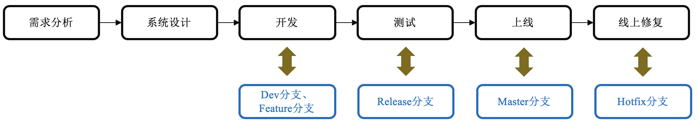
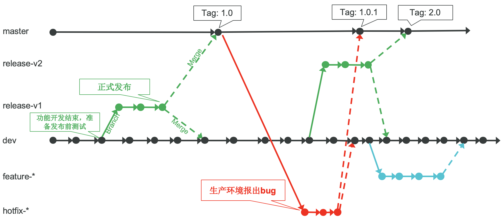
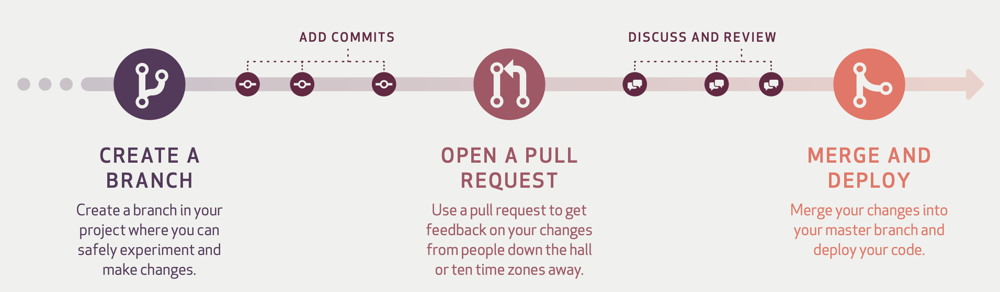

# 分支管理策略介绍
为什么需要分支管理以及如何做分支管理

**标签:** DevOps

[原文链接](https://developer.ibm.com/zh/articles/os-cn-git-and-github-5/)

曹 志, 贾 志鹏, 杨 翔宇

发布: 2019-08-26

* * *

## 前言

在本系列的前面四篇文章中已经介绍了 Git 和 GitHub 的一些特性和常用操作。本篇文章中我将介绍分支管理策略。分支管理在代码管理中可以保证代码版本管理的清晰合理，同时也对生产版本提供有效的保护。良好的分支管理也可以最大化的保证团队协同合作的有效进行。本文将介绍为什么我们需要使用合理的分支策略，以及两种常见的工作流分支管理策略。

2018 年初，我所在的项目组考虑到之前使用的 Perforce 代码管理系统太多笨重且将其集成进 DevOps 工具栈具有诸多不便，经讨论之后，决定将代码库从 Perforce 迁移到 GitHub 上。本人负责整理调研和领导 GitHub 迁移工作。目前已成功将项目代码库迁移并且将其集成进了日常构建。在迁移过程中，我积累诸多宝贵经验，故此借此机会编写一个系列技术文章，来介绍 Git 和 GitHub 基础知识、使用技巧和到最后如何实施的迁移。

本系列将会围绕 Git 和 GitHub 全面涵盖并介绍 Git 原理、Git 和 GitHub 使用、分支管理策略、权限控制策略、代码评审和 pull request、将 GitHub 集成进持续集成，最后会集中介绍代码迁移的整个过程，向有兴趣的读者分享这一过程中所遇到的各种问题和解决办法。

—— 曹志

## 为什么需要分支管理

一个产品的生命周期里往往同时存在多个不同的发行版本，同时也存在着诸如开发版本、预生产版本等多个版本。我们需要设计一个良好的分支管理策略来有效管理同时存在的多个版本，同时，实际项目中往往需要多个开发者协同开发，多名开发者之间的工作又往往互相依赖。如何保证提交的代码的完整性，同时又能让某一功能开发者在不受其他功能开发影响的情况下自己也能独立开发，此时我们需要分支管理策略来更好的保证协同开发和独立开发互不冲突。

**[免费试用 IBM Cloud 上的 Continuous Delivery 服务](https://cloud.ibm.com/catalog/services/continuous-delivery?cm_sp=ibmdev-_-developer-articles-_-cloudreg)**

利用 [IBM Cloud](https://cocl.us/IBM_CLOUD_GCG) 上提供的 Continuous Delivery（持续交付）服务来进行自动化构建、单元测试、部署等。可以通过 [Git Repos and Issue Tracking](https://cloud.ibm.com/docs/services/ContinuousDelivery?topic=ContinuousDelivery-git_working) 和丰富的机遇 Web 的 IDE 来编辑和推送代码。您还可创建工具链（toolchain）来集成您的开发、部署和运维工具。

根据我的实践经验总结下来，分支管理的作用大致包含：代码管理与产品生命周期相结合、分支保护、协同合作与独立开发互不冲突。

### 代码管理与产品生命周期相结合

不同的分支往往代表着产品的不同生命周期阶段。图 1 展示了一个简单的产品新版本发布的生命周期模型和下文 [Git Flow 分支管理策略](#git-flow-分支管理策略) 章节中不同类型分支的对应关系。

##### 图 1\. 产品生命周期模型和分支管理对应关系

只有将不同的分支类型与产品的生命周期对应起来，才能更好的对不同周期的代码进行不同的策略管理。

- 开发阶段：在 Dev 分支或 Feature 分支开发，最大程度的实现协同合作。
- 测试阶段：产品进入预发布阶段，预发布版本的功能都已实现，需要进行完整的系统测试以及测试报出的 bug 修复，此时在 release 分支上进行测试和 bug 修复，既保证了未来新版本发布的质量又不会影响其他 Dev 分支或 Feature 分支的开发。
- 产品上线：产品上线通过 Master 分支管理生产版本，保证产品的发布版本历史和代码历史清晰。
- 线上修复：通过 Master 分支创建出 Hotfix 分支来进行修复再发布到 Master 分支，确保提交的修复不包含任何其它无关代码，最大程度地保护生产版本。

### 分支保护

产品不同生命周期也往往需要不同的保护策略来确保代码的版本管理清晰，各版本之间的代码不会混淆甚至于破坏了生产环境的代码。分支管理的重要意义在于生产版本、预生产版本、开发版本的代码隔离，使得版本的完整性和质量都得到保证。由此我们也可以看到分支管理的保护作用可归纳为：

- 通过严格的提交和合并策略来确保生产分支的稳定及不被破坏。
- 功能分支开发完成之后再提交到主开发分支，确保主开发分支和生产分支不包含未完成功能的不完整代码。
- 通过在预生产分支上进行严格测试，来保证产品发布版本的质量稳定。

### 协同合作与独立开发互不冲突

设想如果我们没有不同类型的分支管理策略，而只使用一个 master 分支来管理代码库，这时当我们需要发布新版本时，为了保证新发布版本不包含多余的代码，我们需要开发者禁止向 master 分支提交代码直到版本发布成功，这样严重影响了开发者对未来版本的功能开发。但是通过不同类型的分支管理，开发者既可以在 dev 分支上进行常规提交，又可以灵活地在功能分支上进行独立开发。团队内成员的各项开发工作也不会受到互相依赖，使得协同合作与独立开发互不冲突的进行下去。

## Git Flow 分支管理策略

Vincent Driessen 在 2010 年提出了一种 Git 工作流的分支管理模型。这种模型考虑了产品生命周期中的多种代码版本形态，能够很好地适用于大部分企业级产品中。本节我将简单介绍该分支管理策略，如果感兴趣，您也可以去阅读 Vincent Driessen 的原文： [A successful Git branching model](https://nvie.com/posts/a-successful-git-branching-model/) 。

##### 图 2\. Git Flow 分支管理

我们从上图 2 可以看到该策略一共有五种不同的分支类型，其中根据他们的生命周期又可以分为两大类：

- 长生命周期分支：项目开始一直存在的分支。

    - master：master 分支是一个生产主分支。它的 HEAD 指针永远指向最新的稳定生产版本。它使用 Tag 来管理历史生产版本。它的代码来源只有 release 预生产分支和 hotfix 修复分支。
    - dev：dev 分支是一个开发主分支。它的 HEAD 指针永远指向的是最新的在开发版本。它的代码来源可以是开发者直接提交，或者是 release 预生产分支、feature 功能分支和 hotfix 修复分支的合并。
- 短生命周期分支：根据不同需求创建的分支，在合并到 master 或 dev 分支之后需要删除的分支。

    - release：release 分支是预生产分支。当项目完成了某一个完整周期的开发，准备对产品发布新版本时，我们可以创建一个预生产分支。创建预生产分支之后，产品进入测试阶段，测试阶段发现的 bug 经修复后直接提交到该预生产分支。当测试完整正式发布新版本时，我们需要将该分支合并到 master 分支，同时删除该预生产分支并在 master 分支上创建相应的 tag。Release 分支根据实际项目情况可以有一个或多个，因此分支命名建议使用 release 为前缀，加上版本号后缀作为分支名，例如 `release-v1` 、 `release-v1.1` 等。
    - feature：feature 分支是功能开发分支。项目中可能会出现比较大的功能需要较长的周期进行开发。此时为了避免开发分支或者生产分支上出现不完整的该功能代码，我们可以单独从 dev 分支创建出一个功能分支。多个开发者可以协同在该分支上进行功能开发。功能代码都先提交到该分支上。当功能开发完成之后再合并回 dev 分支，同时删除该功能分支。Feature 分支根据实际项目情况可以有一个或多个，因此分支命名建议使用 feature 为前缀，加上功能名缩写或者该功能在项目管理工具（JIRA、GitHub Issues 等）中的 `ticket id` 作为后缀，例如 `feature-login` 、 `feature-211` 等。
    - hotfix：hotfix 分支是修复分支。产品上线后仍可能报出 bug。当报出 bug 时，我们可以从 master 的 tag 创建出 hotfix 分支，针对该 bug 的修复直接提交到该 hotfix 分支上。当修复经过测试之后，我们需要将该 hotfix 分支合并到 master 分支和 dev 分支，合并后同时删除该 hotfix 分支。合并到 master 分支之后可以创建 tag 来生成新的生产小版本号。合并回 dev 分支可以保证未来的发布版本不再出现该 bug。Hotfix 分支根据实际项目情况可以有一个或多个，因此分支命名建议使用 hotfix 为前缀，加上功能名缩写或者该功能在项目管理工具（JIRA、GitHub Issues 等）中的 `ticket id` 作为后缀，例如 `feature-login_defect` 、 `feature-311` 等。

**注意** ： _虽然在创建 Git 或 GitHub 仓库时，Git 或 GitHub 为我们创建了一个默认的 master 分支，但是该 master 分支与其它分支并没有任何本质上的区别。在实践中我们可以使用任何的名字来替代 master、dev 分支等。例如使用 stable 表示生产分支、使用 new 表示在开发分支等。_

从不同的分支类型可以看到，该策略覆盖了产品生命周期的各个阶段：开发、测试、版本发布、修复等等。因此该分支策略可以适用于大部分企业产品。下表 1 总结了 5 种分支类型的创建时间、代码来源等特点。

##### 表 1\. 5 种分支类型总结

**类型****从哪个分支创建****什么时候创建****合并到哪个分支****什么时候删除****分支数量**masterNA项目最开始NA永不删除一个devNA项目最开始NA永不删除一个releasedev 分支准备发布新版本dev, master正式发布新版本，代码合并到 dev 和 master 之后数量不定featuredev 分支新功能需要较长时间的协同开发dev新功能开发完成，合并到 dev 之后数量不定hotfixmaster 分支当生产版本报出 bugdev, master修复经过测试，代码合并到 dev 和 master 之后数量不定

实际上我的项目情况相比该策略会更复杂，例如我们的产品会同时存在多个不同的生产版本，针对不同的版本可能会提交不同的修复，因此这要求我们的生产版本需要一直存在，而我们的 release 分支不再是预生产分支而是生产分支，同时也不会随着合并到 master 而消亡，而根据生产版本在线上情况会长时间存在。同时我们的 hotfix 分支是直接提交到生产版本中。当然我们也要认识到，出现这种复杂情况的原因在于我们的产品历史比较长，在采用 GitHub 作为版本控制工具以前，产品的生命周期模型就已经定义下来并被长期采用。因此我们需要尽量设计一种既符合该分支策略同时又能适用于我们产品生命周期的一种策略。

## GitHub Flow 分支管理策略

GitHub Flow 是 GitHub 推出的一种更加简便、敏捷并适合快速持续部署项目的分支管理策略。如图 3 所示。图 3 截取自 GitHub 官网关于 [GitHub Flow](https://guides.github.com/introduction/flow/) 的介绍。

##### 图 3\. GitHub Flow

该工作流只有一个长期分支 master 分支，master 分支的 HEAD 指针同时也指向了最新的生产版本分支。日常开发通过创建不同的功能分支来进行，在开发完成后通过创建 Pull Request 来尝试合并代码到 master 分支。Pull Request 是一种代码评审和代码合并的机制。经过评审通过之后的代码，才真正的合并到 master 分支，随后进行发布。（我将在本系列的第六篇文章中专门讲解代码评审和 Pull Request 的内容。）这种工作流的特点是简单、高效，特别适用于发布十分频繁的项目。

## 两种方法各自适用的场景

两种 Flow 的管理策略各有优缺点，也各自有不同的适用场景。

- Git Flow：分支类型太多，不利于管理。适用于发布周期较长，项目规模较大的产品。
- GitHub Flow：工作流非常简单，管理也很容易。它引入 Pull Request 进行代码评审，一定程度上保证了代码质量。但是它只有一个 master 分支，不适用于多个生产版本并存的项目。GitHub Flow 被广泛用于开源项目中。

在实际项目中，我结合了两种策略进行的分支管理。由于产品特性，我们必须采用 Git Flow 来保证多个生产版本都能够独立的发布，同时在向生产版本和 Dev 版本合并代码时，我们又要求团队成员必须提交 Pull Request 来进行代码评审。

## 结束语

我在本篇文章中介绍了分支管理策略的重要意义，同时介绍了两种业界流行的基于 Git 或 GitHub 工作流的分支管理策略。Git 的分支技术极大的提高了分支管理的效率。但是如何将分支管理能够更好的应用到具体的项目中，是我们从业者们需要认真思考的问题。我认为，分支策略需要服务于产品的生命周期特点。基于产品生命周期特点，选择合适产品的分支管理策略，同时我们还可能需要进行必要的改进以能够达到产品发布和产品质量的要求。