# 分析 JUnit 框架源代码
理解 JUnit 测试框架实现原理和设计模式

**标签:** Java

[原文链接](https://developer.ibm.com/zh/articles/j-lo-junit-src/)

何正华, 徐晔

发布: 2009-05-31

* * *

## 概述

在测试驱动的开发理念深入人心的今天，JUnit 在测试开发领域的核心地位日渐稳定。不仅 Eclipse 将 JUnit 作为默认的 IDE 集成组件，而且基于 JUnit 的各种测试框架也在业内被广泛应用，并获得了一致好评。目前介绍 JUnit 书籍文章虽然较多，但大多数是针对 JUnit 的具体应用实践，而对于 JUnit 本身的机制原理，只是停留在框架模块的较浅层次。

本文内容完全描述 JUnit 的细致代码实现，在展示代码流程 UML 图的基础上，详细分析 JUnit 的内部实现代码的功能与机制，并在涉及相关设计模式的地方结合代码予以说明。另外，分析过程还涉及 Reflection 等 Java 语言的高级特征。

本文的读者应该对 JUnit 的基本原理及各种设计模式有所了解，主要是面向从事 Java 相关技术的设计、开发与测试的人员。对于 C++，C# 程序员也有很好的借鉴作用。

## Junit 简介

### JUnit 的概念及用途

JUnit 是由 Erich Gamma 和 Kent Beck 编写的一个开源的单元测试框架。它属于白盒测试，只要将待测类继承 TestCase 类，就可以利用 JUnit 的一系列机制进行便捷的自动测试了。

JUnit 的设计精简，易学易用，但是功能却非常强大，这归因于它内部完善的代码结构。 Erich Gamma 是著名的 GOF 之一，因此 JUnit 中深深渗透了扩展性优良的设计模式思想。 JUnit 提供的 API 既可以让您写出测试结果明确的可重用单元测试用例，也提供了单元测试用例成批运行的功能。在已经实现的框架中，用户可以选择三种方式来显示测试结果，并且显示的方式本身也是可扩展的。

### JUnit 基本原理

一个 JUnit 测试包含以下元素：

##### 表 1\. 测试用例组成

开发代码部分测试代码部分测试工具部分待测试类 A通过扩展 TestCase 或者构造 TestSuit 方法 编写测试类 B一个测试运行器（TestRunner）R，可以选择图形界面或文本界面

操作步骤：

将 B 通过命令行方式或图形界面选择方式传递给 R，R 自动运行测试，并显示结果。

### JUnit 中的设计模式体现

设计模式（Design pattern）是一套被反复使用的、为众人所知的分类编目的代码设计经验总结。使用设计模式是为了可重用和扩展代码，增加代码的逻辑性和可靠性。设计模式的出现使代码的编制真正工程化，成为软件工程的基石。

GoF 的《设计模式》一书首次将设计模式提升到理论高度，并将之规范化。该书提出了 23 种基本设计模式，其后，在可复用面向对象软件的发展过程中，新的设计模式亦不断出现。

软件框架通常定义了应用体系的整体结构类和对象的关系等等设计参数，以便于具体应用实现者能集中精力于应用本身的特定细节。因此，设计模式有助于对框架结构的理解，成熟的框架通常使用了多种设计模式，JUnit 就是其中的优秀代表。设计模式是 JUnit 代码的精髓，没有设计模式，JUnit 代码无法达到在小代码量下的高扩展性。总体上看，有三种设计模式在 JUnit 设计中得到充分体现，分别为 Composite 模式、Command 模式以及 Observer 模式。

## 一个简单的 JUnit 程序实例

我们首先用一个完整实例来说明 JUnit 的使用。由于本文的分析对象是 JUnit 本身的实现代码，因此测试类实例的简化无妨。本部分引入《 JUnit in Action 》中一个 HelloWorld 级别的测试实例，下文的整个分析会以该例子为基点，剖析 JUnit 源代码的内部流程。

待测试类如下：

##### 图 1\. 待测试代码

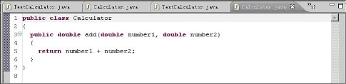

该类只有一个 add 方法，即求两个浮点数之和返回。

下面介绍测试代码部分，本文以 JUnit3.8 为实验对象，JUnit4.0 架构类同。笔者对原书中的测试类做了一些修改，添加了一个必然失败的测试方法 testFail，目的是为了演示测试失败时的 JUnit 代码流程。

完整的测试类代码如下：

##### 图 2\. 测试类代码

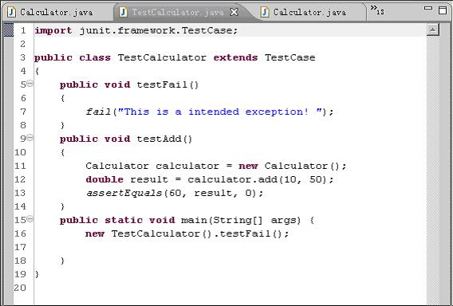

TestCalculator 扩展了 JUnit 的 TestCase 类，其中 testAdd 方法就是对 Calculator.add 方法的测试，它会在测试开始后由 JUnit 框架从类中提取出来运行。在 testAdd 中，Calculator 类被实例化，并输入测试参数 10 和 50，最后用 assertEquals 方法（基类 TestCase 提供）判断测试结果与预期是否相等。无论测试符合预期或不符合都会在测试工具 TestRunner 中体现出来。

实例运行结果：

##### 图 3\. 实例运行结果

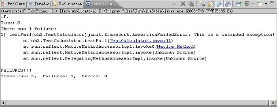

从运行结果中可见：testAdd 测试通过（未显示），而 testFail 测试失败。图形界面结果如下：

##### 图 4\. 测试图形结果

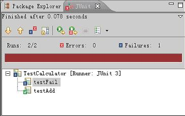

## JUnit 源代码分析

JUnit 的完整生命周期分为 3 个阶段：初始化阶段、运行阶段和结果捕捉阶段。

##### 图 5\. JUnit 的完整生命周期图

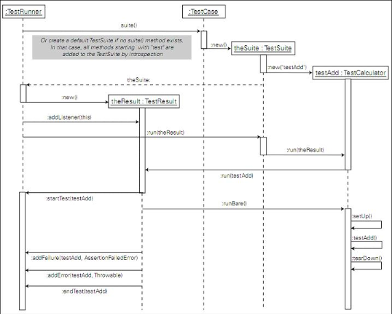

### 初始化阶段（创建 Testcase 及 TestSuite）

##### 图 6\. JUnit 的 main 函数代码

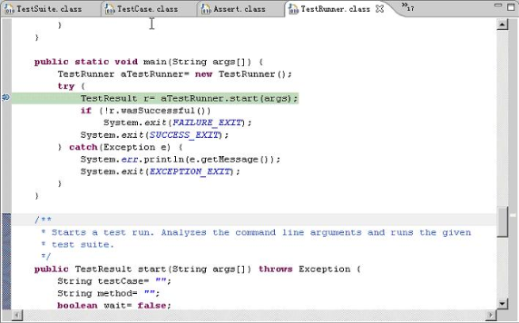

初始化阶段作一些重要的初始化工作，它的入口点在 junit.textui.TestRunner 的 main 方法。该方法首先创建一个 TestRunner 实例 `aTestRunner` 。之后 main 函数中主体工作函数为 `TestResult r = aTestRunner.start(args) 。`

它的函数构造体代码如下 :

##### 图 7\. junit 的 start(String[]) 函数

![图 7. junit 的 start(String[]) 函数](../ibm_articles_img/j-lo-junit-src_images_image007.png)

我们可以看出，Junit 首先对命令行参数进行解析：参数” -wait ”（等待模式，测试完毕用户手动返回）、” -c ”，” -v ”（版本显示）。 -m 参数用于测试单个方法。这是 JUnit 提供给用户的一个非常轻便灵巧的测试功能，但是在一般情况下，用户会像本文前述那样在类名命令行参数，此时通过语句：

```
testCase = args[i];

```

Show moreShow more icon

将测试类的全限定名将传给 String 变量 testcase 。

然后通过：

```
Test suite = getTest(testCase);

```

Show moreShow more icon

将对 testCase 持有的全限定名进行解析，并构造 TestSuite 。

##### 图 8\. getTest() 方法函数源代码


TestSuite 的构造分两种情况 ( 如上图 )：

- A：用户在测试类中通过声明 Suite() 方法自定义 TestSuite 。
- B：JUnit 自动判断并提取测试方法。

JUnit 提供给用户两种构造测试集合的方法，用户既可以自行编码定义结构化的 TestCase 集合，也可以让 JUnit 框架自动创建测试集合，这种设计融合其它功能，让测试的构建、运行、反馈三个过程完全无缝一体化。

**情况 A：**

##### 图 9\. 自定义 TestSuite 流程图

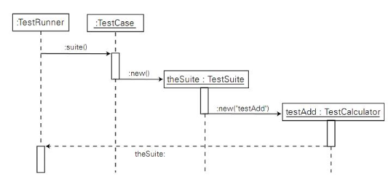

当 suite 方法在 test case 中定义时，JUnit 创建一个显式的 test suite，它 `利用 Java 语言的 Reflection 机制找出名为 _SUITE_METHODNAME_ 的方法，也即 suite 方法：`

```
suiteMethod = testClass.getMethod(SUITE_METHODNAME, new Class[0]);

```

Show moreShow more icon

Reflection 是 Java 的高级特征之一，借助 Reflection 的 API 能直接在代码中动态获取到类的语言编程层面的信息，如类所包含的所有的成员名、成员属性、方法名以及方法属性，而且还可以通过得到的方法对象，直接调用该方法。 JUnit 源代码频繁使用了 Reflection 机制，不仅充分发挥了 Java 语言在系统编程要求下的超凡能力，也使 JUnit 能在用户自行编写的测试类中游刃有余地分析并提取各种属性及代码，而其它测试框架需要付出极大的复杂性才能得到等价功能。

若 JUnit 无法找到 siute 方法，则抛出异常，流程进入情况 B 代码；若找到，则对用户提供的 suite 方法进行外部特征检验，判断是否为类方法。最后，JUnit 自动调用该方法，构造用户指定的 TestSuite：

```
test = (Test)suiteMethod.invoke(null, (Object[]) new Class[0]);

```

Show moreShow more icon

**情况 B：**

##### 图 10\. 自动判断并提取 TestSuite 流程图

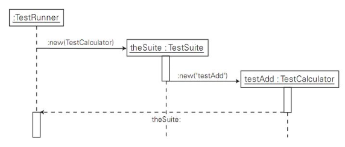

当 suite 方法未在 test case 中定义时，JUnit 自动分析创建一个 test suite 。 `代码由 ：`

```
return new TestSuite(testClass);

```

Show moreShow more icon

处进入 TestSuite(Class theclass) 方法为 TestSuite 类的构造方法，它能自动分析 theclass 所描述的类的内部有哪些方法需要测试，并加入到新构造的 TestSuite 中。代码如下：

##### 图 11\. TestSuite 函数代码


TestSuite 采用了Composite 设计模式。在该模式下，可以将 TestSuite 比作一棵树，树中可以包含子树（其它 TestSuite），也可以包含叶子 (TestCase)，以此向下递归，直到底层全部落实到叶子为止。 JUnit 采用 Composite 模式维护测试集合的内部结构，使得所有分散的 TestCase 能够统一集中到一个或若干个 TestSuite 中，同类的 TestCase 在树中占据同等的位置，便于统一运行处理。另外，采用这种结构使测试集合获得了无限的扩充性，不需要重新构造测试集合，就能使新的 TestCase 不断加入到集合中。

在 TestSuite 类的代码中，可以找到：

```
private Vector fTests = new Vector(10);

```

Show moreShow more icon

此即为内部维护的”子树或树叶”的列表。

红框内的代码完成提取整个类继承体系上的测试方法的提取。循环语句由 Class 类型的实例 theClass 开始，逐级向父类的继承结构追溯，直到顶级 Object 类，并将沿途各级父类中所有合法的 testXXX() 方法都加入到 TestSuite 中。

合法 testXXX 的判断工作由：

```
addTestMethod(methods[i], names, theClass)

```

Show moreShow more icon

完成，实际上该方法还把判断成功的方法转化为 TestCase 对象，并加入到 TestSuite 中。代码如下图 :

##### 图 12\. addTestMethod 函数代码

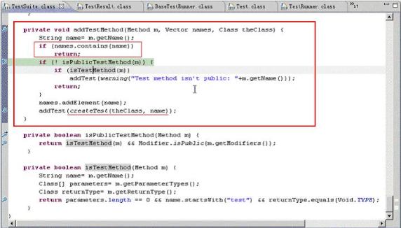

首先通过 String name= m.getName(); 利用 Refection API 获得 Method 对象 m 的方法名，用于特征判断。然后通过方法

```
isTestMethod（Method m）

```

Show moreShow more icon

中的

```
return parameters.length == 0 && name.startsWith("test") && returnType.equals(Void.TYPE);

```

Show moreShow more icon

来判别方法名是不是以字符串” test ”开始。

而代码：

```
if (names.contains(name))
    return;

```

Show moreShow more icon

用于在逐级追溯过程中，防止不同级别父类中的 testXXX() 方法重复加入 TestSuite 。

对于符合条件的 testXXX() 方法，addTestMethod 方法中用语句：

```
addTest(createTest(theClass, name));

```

Show moreShow more icon

将 testXXX 方法转化为 TestCase，并加入到 TestSuite 。其中，addTest 方法接受 Test 接口类型的参数，其内部有 countTestCases 方法和 run 方法，该接口被 TestSuite 和 TestCase 同时实现。这是 Command 设计模式精神的体现，

Command 模式将调用操作的对象与如何实现该操作的对象解耦。在运行时，TestCase 或 TestSuite 被当作 Test 命令对象，可以像一般对象那样进行操作和扩展，也可以在实现 Composite 模式时将多个命令复合成一个命令。另外，增加新的命令十分容易，隔离了现有类的影响，今后，也可以与备忘录模式结合，实现 undo 等高级功能。

加入 TestSuite 的 TestCase 由 createTest(theClass, name) 方法创建，代码如下：

##### 图 13\. CreateTest 函数代码

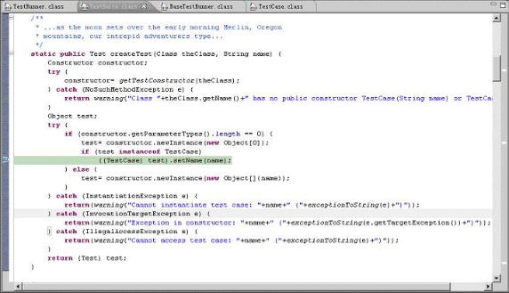

TestSuite 和 TestCase 都有一个 `fName` 实例变量，是在其后的测试运行及结果返回阶段中该 Test 的唯一标识，对 TestCase 来说，一般也是要测试的方法名。在 `createTest` 方法中，测试方法被转化成一个 TestCase 实例，并通过：

```
((TestCase) test).setName(name);

```

Show moreShow more icon

用该方法名标识 TestCase 。其中，test 对象也是通过 Refection 机制，通过 theClass 构建的：

```
test = constructor.newInstance(new Object[0]);

```

Show moreShow more icon

注意：theClass 是图 8 中 getTest 方法的 suiteClassName 字符串所构造的 Class 类实例，而后者其实是命令行参数传入的带测试类 Calculator，它继承了 TestCase 方法。因此，theClass 完全具备转化的条件。

至此整个流程的初始化完成。

### 测试驱动运行阶段（运行所有 TestXXX 型的测试方法）

由图 7 所示 , 我们可以知道初始化完毕，即 testsuit() 创建好后 , 便进入方法 :

```
doRun(suite, wait);

```

Show moreShow more icon

代码如下 :

##### 图 14\. doRun 函数代码

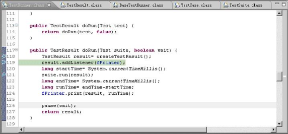

该方法为测试的驱动运行部分，结构如下：

- 创建 TestResult 实例。
- 将 junit.textui.TestRunner 的监听器 fPrinter 加入到 result 的监听器列表中。

其中，fPrinter 是 junit.textui.ResultPrinter 类的实例，该类提供了向控制台输出测试结果的一系列功能接口，输出的格式在类中定义。 ResultPrinter 类实现了 TestListener 接口，具体实现了 addError、addFailure、endTest 和 startTest 四个重要的方法，这种设计是 Observer 设计模式的体现，在 addListener 方法的代码中：

```
public synchronized void addListener(TestListener listener) {
    fListeners.addElement(listener);
}

```

Show moreShow more icon

将 `ResultPrinter` 对象加入到 `TestResult` 对象的监听器列表中，因此实质上 TestResult 对象可以有多个监听器显示测试结果。第三部分分析中将会描述对监听器的消息更新。

- 计时开始。
- run(result) 测试运行。
- 计时结束。
- 统一输出，包括测试结果和所用时间。

其中最为重要的步骤为 run(result) 方法，代码如下。

##### 图 15\. run 函数代码

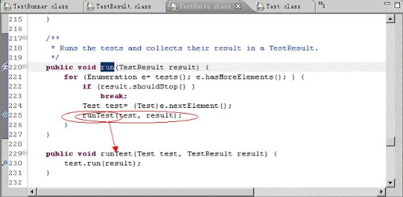

Junit 通过 `for (Enumeration e= tests(); e.hasMoreElements(); ){...... }` 对 TestSuite 中的整个”树结构”递归遍历运行其中的节点和叶子。此处 JUnit 代码颇具说服力地说明了 Composite 模式的效力，run 接口方法的抽象具有重大意义，它实现了客户代码与复杂对象容器结构的解耦，让对象容器自己来实现自身的复杂结构，从而使得客户代码就像处理简单对象一样来处理复杂的对象容器。每次循环得到的节点 test，都同 result 一起传递给 runTest 方法，进行下一步更深入的运行。

##### 图 16\. junit.framework.TestResult.run 函数代码

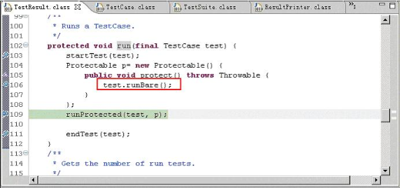

这里变量 P 指向一个实现了 Protectable 接口的匿名类的实例，Protectable 接口只有一个 protect 待实现方法。而 junit.framework.TestResult.runProtected(Test, Protectable) 方法的定义为：

```
public void runProtected(final Test test, Protectable p) {
    try {
        p.protect();
    }
    catch (AssertionFailedError e) {
        addFailure(test, e);
    }
    catch (ThreadDeath e) { // don't catch ThreadDeath by accident
        throw e;
    }
    catch (Throwable e) {
        addError(test, e);
    }
}

```

Show moreShow more icon

可见 runProtected 方法实际上是调用了刚刚实现的 protect 方法，也就是调用了 test.runBare() 方法。另外，这里的 startTest 和 endTest 方法也是 Observer 设计模式中的两个重要的消息更新方法。

以下分析 junit.framework.TestCase.runBare() 方法：

##### 图 17\. junit.framework.TestCase.runBare() 函数代码

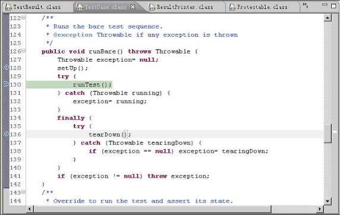

在该方法中，最终的测试会传递给一个 runTest 方法执行，注意此处的 runTest 方法是无参的，注意与之前形似的方法区别。该方法中也出现了经典的 setUp 方法和 tearDown 方法，追溯代码可知它们的定义为空。用户可以覆盖两者，进行一些 fixture 的自定义和搭建。 ( 注意：tearDown 放在了 finally{} 中，在测试异常抛出后仍会被执行到，因此它是被保证运行的。 )

主体工作还是在 junit.framework.TestCase.runTest() 方法中 , 代码如下 :

##### 图 18\. junit.framework.TestCase.runTest() 函数代码

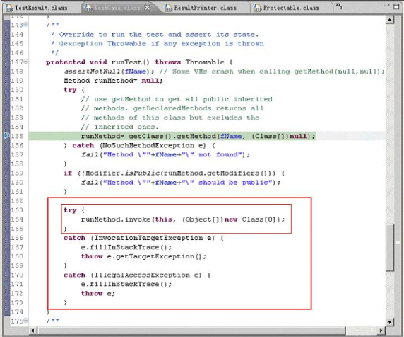

该方法最根本的原理是：利用在图 13 中设定的 fName，借助 Reflection 机制，从 TestCase 中提取测试方法：

```
runMethod = getClass().getMethod(fName, (Class[]) null);

```

Show moreShow more icon

为每一个测试方法，创建一个方法对象 runMethod 并调用：

```
runMethod.invoke(this, (Object[]) new Class[0]);

```

Show moreShow more icon

只有在这里，用户测试方法的代码才开始被运行。

在测试方法运行时，众多的 Assert 方法会根据测试的实际情况，抛出失败异常或者错误。也是在” runMethod.invoke(this, (Object[]) new Class[0]); ”这里，这些异常或错误往上逐层抛出，或者被某一层次处理，或者处理后再次抛出，依次递推，最终显示给用户。

流程图如下 :

##### 图 19\. JUnit 执行测试方法，并在测试结束后将失败和错误信息通知所有 test listener

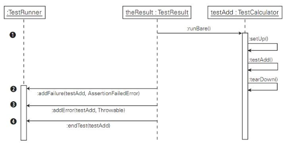

### 测试结果捕捉阶段（返回 Fail 或 Error 并显示）

通过以下代码，我们可以看出失败由第一个 catch 子句捕获，并交由 addFailure 方法处理，而错误由第三个 catch 子句捕获，并交由 addError 方法处理。

##### 图 20\. 失败处理函数代码

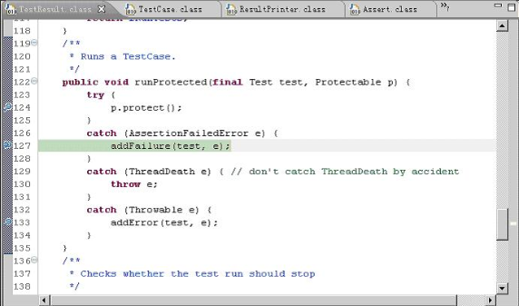

##### 图 21\. 失败处理流程图


JUnit 执行测试方法，并在测试结束后将失败和错误信息通知给所有的 test listener 。其中 addFailure、addError、endTest、startTest 是 TestListener 接口的四大方法，而 TestListener 涉及到 Observer 设计模式。

我们尝试看看 addFailure 方法的代码：

##### 图 22\. addFailure 方法的代码

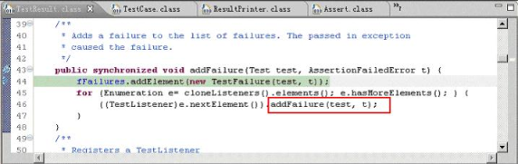

此处代码将产生的失败对象加入到了 fFailures，可联系 图 2，此处的结果在程序退出时作为测试总体成功或失败的判断依据。而在 for 循环中，TestResult 对象循环遍历观察者（监听器）列表，通过调用相应的更新方法，更新所有的观察者信息，这部分代码也是整个 Observer 设计模式架构的重要部分。

根据以上描述，JUnit 采用 Observer 设计模式使得 TestResult 与众多测试结果监听器通过接口 TestListenner 达到松耦合，使 JUnit 可以支持不同的使用方式。目标对象（TestResult）不必关心有多少对象对自身注册，它只是根据列表通知所有观察者。因此，TestResult 不用更改自身代码，而轻易地支持了类似于 ResultPrinter 这种监听器的无限扩充。目前，已有文本界面、图形界面和 Eclipse 集成组件三种监听器，用户完全可以开发符合接口的更强大的监听器。

出于安全考虑，cloneListeners() 使用克隆机制取出监听器列表：

```
private synchronized Vector cloneListeners() {
    return (Vector)fListeners.clone();
}

```

Show moreShow more icon

TestResult 的 addFailure 进一步调用 ResultPrinter 的 addFailure:

##### 图 23\. ResultPrinter 的 addFailure 函数代码

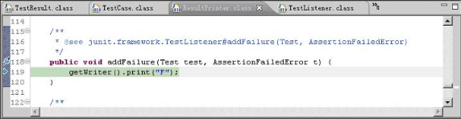

这里并没有将错误信息输出，而只是输出了错误类型：” F “。错误信息由图 14 中的：

```
fPrinter.print(result, runTime);

```

Show moreShow more icon

统一输出。

这些设计细节皆可以由 TestRunner 的实现者自己掌握。

## 结束语

鉴于 JUnit 目前在测试领域的显赫地位，以及 JUnit 实现代码本身编写的简洁与艺术性，本文的详尽分析无论对于测试开发的实践运用、基于 JUnit 的高层框架的编写、以及设计模式与 Java 语言高级特征的学习都具有多面的重要意义。