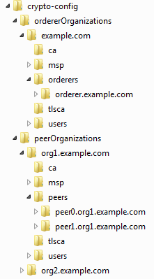
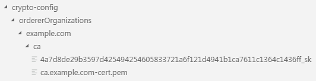
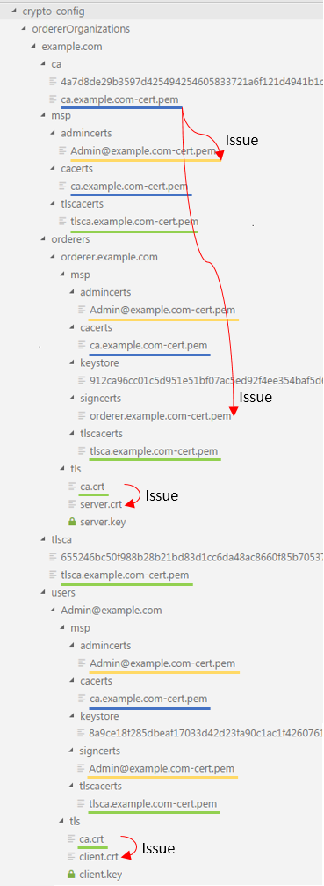
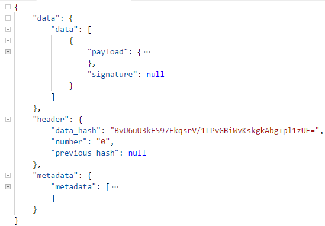

# 分步详解 Fabric 区块链网络的部署
部署一个示例的 Fabric 区块链网络

**标签:** 区块链,金融

[原文链接](https://developer.ibm.com/zh/articles/cl-lo-hyperledger-fabric-practice-analysis/)

徐 春雷

发布: 2018-12-05

* * *

## 前言

区块链（Blockchain）技术正在迅速发展，在银行、保险、物流、新闻出版、食品安全等很多领域都开始了实际应用。可以预见，将来会有越来越多的行业会应用它。

[Hyperledger Fabric](https://www.hyperledger.org/projects/fabric) 是其中一个非常重要的区块链技术平台。它是一个开源的、企业级的、有许可的分布式账本技术平台，它是为用于企业环境而设计的，与一些其他流行的分布式账本技术或区块链平台相比，它提供了一些非常关键的差异化的能力。

本系列文章从 Fabric 实践入手，对之进行学习与研究，进而进行基于 Fabric 的区块链应用开发，再深入研究它的数据结构、源代码与安全机制。期望能通过此系列文章，使读者能快速了解它的全貌。

本文是此系列文章的第一篇。主要内容是分步骤讲解如何部署一个示例的 Fabric 区块链网络，并初步了解 Fabric 中的一些基础内容。本文以 Fabric 1.3 为基础。

## 系统环境

Fabric 可以被部署在 Linux，Unix，Windows，MacOS 等系统上，本文以 Ubuntu 16.04 为基础进行讲解，读者如需了解其他系统上的使用情况，请参考 [Fabric 原始文档](https://hyperledger-fabric.readthedocs.io/en/latest/index.html) 。

我们需要先行安装这些软件：curl，docker，docker-compose，Go lang，Python，Node.js。

有些软件如果在系统中已经存在，且版本合适，则请略过相关步骤。

如无特殊说明，下文中所有命令都以 root 用户执行。如果为非 root 用户，可能有些命令需要加 sudo。

#### 确认 Ubuntu 版本

`cat` / `etc` / `issue`

#### 安装 curl

`apt install curl`

#### 安装 docker 17.06.2-ce 或更高版本

```
curl -fsSL https://download.docker.com/linux/ubuntu/gpg | sudo apt-key add -
add-apt-repository "deb [arch=amd64] https://download.docker.com/linux/ubuntu
$(lsb_release -cs) stable"
apt update
apt install docker-ce
usermod -aG docker $(whoami)
docker --version

```

Show moreShow more icon

#### 安装 docker-compose 1.14.0 或更高版本

```
curl -L "https://github.com/docker/compose/releases/download/1.23.1/docker-compose-$(uname -s)-$(uname -m)" -o /usr/local/bin/docker-compose
chmod +x /usr/local/bin/docker-compose
docker-compose --version

```

Show moreShow more icon

#### 安装 Go 语言 1.11.x 版本

```
curl -O https://dl.google.com/go/go1.11.2.linux-amd64.tar.gz
tar -C /usr/local -xzf go1.11.2.linux-amd64.tar.gz

```

Show moreShow more icon

#### 设置 Go 语言环境变量

`vi ~/.bashrc`

在.bashrc 文件中增加以下内容

`export PATH=$PATH:/usr/local/go/bin`

执行 `.bashrc` 文件，使之生效

`source` ~/. `bashrc`

#### 安装 Node.js 8.9.x 或更高版本

请注意 Fabric 目前不支持 Node.js 9.x 版本。

`curl -sL https://deb.nodesource.com/setup_8.x | sudo -E bash -`

`apt install nodejs`

安装 Node.js 后，npm 应该被同时自动安装，执行以下命令确认。

`npm install npm -g`

#### 安装 Python 2.7

`apt install python`

下载 fabric 可执行文件、示例与 docker 镜像

`cd ~`

`mkdir fabric`

`cd fabric`

`curl -sSL http://bit.ly/2ysbOFE | bash -s 1.3.0`

如果提示错误，请尝试使用 https：

`curl -sSL https://bit.ly/2ysbOFE | bash -s 1.3.0`

下载、安装成功后，当前目录下会增加一个 fabric-samples 目录。 并在 `docker repository` 中会增加一些 `docker` 镜像。可以通过 `docker images` 命令查看。

`docker images`

应该显示类似如下内容。

##### 表 1\. docker images 命令查看显示

**REPOSITORY****TAG****IMAGE ID****CREATED****SIZE**hyperledger/fabric-javaenv1.3.02476cefaf8335 weeks ago1.7GBhyperledger/fabric-javaenvlatest2476cefaf8335 weeks ago1.7GBhyperledger/fabric-ca1.3.05c6b20ba944f5 weeks ago244MBhyperledger/fabric-calatest5c6b20ba944f5 weeks ago244MBhyperledger/fabric-tools1.3.0c056cd9890e75 weeks ago1.5GBhyperledger/fabric-toolslatestc056cd9890e75 weeks ago1.5GBhyperledger/fabric-ccenv1.3.0953124d802375 weeks ago1.38GBhyperledger/fabric-ccenvlatest953124d802375 weeks ago1.38GBhyperledger/fabric-orderer1.3.0f430f581b46b5 weeks ago145MBhyperledger/fabric-ordererlatestf430f581b46b5 weeks ago145MBhyperledger/fabric-peer1.3.0f3ea63abddaa5 weeks ago151MBhyperledger/fabric-peerlatestf3ea63abddaa5 weeks ago151MBhyperledger/fabric-zookeeper0.4.13e62e0af391935 weeks ago1.39GBhyperledger/fabric-zookeeperlateste62e0af391935 weeks ago1.39GBhyperledger/fabric-kafka0.4.134121ea662c475 weeks ago1.4GBhyperledger/fabric-kafkalatest4121ea662c475 weeks ago1.4GBhyperledger/fabric-couchdb0.4.131d3266e01e645 weeks ago1.45GBhyperledger/fabric-couchdblatest1d3266e01e645 weeks ago1.45GBhyperledger/fabric-baseosamd64-0.4.13f0fe49196c405 weeks ago124MB

#### 将 Fabric 可执行文件目录加入系统路径

`vi ~/.bashrc`

在. `bashrc` 文件中增加以下内容：

`export PATH=$PATH:~/fabric/fabric-samples/bin`

执行. `bashrc` 文件，使之生效。

`source ~/.bashrc`

现在，Fabric 必需的系统环境与软件就全部准备好了，我们就要开始下载、部署第一个 Fabric 区块链网络了。

## 区块链网络示例 byfn（Building Your First Network.）

安装的 sample 中有一个示例区块链网络 first-network，位于目录 fabric/fabric-samples/first-network，它提供了 byfn.sh 脚本以启动示例网络，但本文会跳过这个过程，而按详细步骤分解执行这个示例网络启动过程，以讲解 Fabric 中的基础文件、运行过程。

读者如果对 byfn.sh 有兴趣，可以前往 [Fabric 官方文档](https://hyperledger-fabric.readthedocs.io/en/latest/index.html) 查看详细内容。

## byfn 启动过程详解

下面，我们开始按步骤详细解释这个示例的初始化与启动过程。这些详细步骤正是以 byfn.sh 为基础的。

### 准备

为保证一个干净的运行环境，我们需要先清理之间测试遗留下来的 docker 环境。

注意：本文假定当前系统完全为 Fabric 测试部署，没有其他 docker 容器、镜像存在或运行。如果系统中有其他容器、镜像，请不要执行以下命令，并选择执行适当的命令，以避免不当删除。

#### 进入 `first-network`

`cd fabric/fabric-samples/first-network`

#### 清理临时文件、docker 容器、镜像及网络

`./byfn.sh down`

#### 设置环境变量

##### 清单 1\. 环境变量

```
export PATH=${PWD}/../bin:${PWD}:$PATH
export FABRIC_CFG_PATH=${PWD}
export CLI_TIMEOUT=10
export CLI_DELAY=3
export CHANNEL_NAME="mychannel"
export COMPOSE_FILE=docker-compose-cli.yaml
export COMPOSE_FILE_COUCH=docker-compose-couch.yaml
export COMPOSE_FILE_ORG3=docker-compose-org3.yaml
export LANGUAGE=golang
export IMAGETAG="latest"
export VERBOSE=true

```

Show moreShow more icon

CHANNEL\_NAME 是将要建立的 Blockchain Channel 的名字，默认值是 “mychannel”，也可以设置为你所期望的其他值，我们在以后的步骤中，一般会直接引用 $CHANNEL\_NAME。

### 证书

我们利用 cryptogen 命令，生成这个区块链网络所需要的一系列证书及相关文件。证书是基于 PKI 体系的 x509 格式证书，内容包括：自签名 CA 根证书、节点 (Orderer、Peer) 证书、管理员证书、证书对应的私钥、TLS 证书等。

这个操作需要一个配置文件 crypto-config.yaml，示例中已经存在。crypto-config.yaml 中主要定义了：

- 1 个 Orderer 节点：orderer.example.com，
- 4 个 Peer 节点：peer0.org1.example.com， peer1.org1.example.com， peer0.org2.example.com， peer1.org2.example.com。

在此请注意 2 点：

1. 执行前请先确认当前目录下没有 crypto-config 目录，如果已经存在，请先删除。
2. cryptogen 仅用作测试目的，可以方便快速的生成网络所需要的所有节点的证书。但一般情况下，cryptogen 不应被用于生产环境。（我们会在以后讲解如何添加节点，加入 Channel，并处理相关证书问题。）

#### 生成证书

`cryptogen generate --config=./crypto-config.yaml`

#### 证书目录结构

执行成功后，会在当前目录下增加一个新目录 crypto-config，包含有这个网络节点的证书、私钥等加密、签名相关元素。其基本结构如下：

##### 图 1\. 证书目录结构



在这个示例网络中，有一个 CA（Certificate Authority），即证书颁发机构，名字是 example.com。它给自己颁发了一个自签名根证书 ca.example.com-cert.pem，在生成的多个目录中都包含了这个 CA 根证书，而其他节点证书（除了 TLS 证书）都由此 CA 颁发。

我们查看其中的一个目录 crypto-config/ordererOrganizations/example.com/ca，有两个文件：

##### 图 2\. CA 自签名根证书与私钥



其中，ca.example.com-cert.pem 是 CA 自签名根证书。4a7d8de29b3597d425494254605833721a6f121d4941b1ca7611c1364c1436ff\_sk 是根证书对应的私钥。

证书中的私钥文件名是随机产生，每次执行 cryptogen 都会产生不一样的文件名，在后续引用中请注意将之改成实际测试中产生的文件名

#### CA 根证书

**显示证书内容**

`openssl x509 -in ca.example.com-cert.pem -text -noout`

显示证书内容如下：

##### 清单 2\. CA 根证书内容

```
Certificate:
    Data:
        Version: 3 (0x2)
        Serial Number:
            81:0a:27:99:0a:db:06:c0:34:0f:d1:c3:9a:d5:9f:ed
    Signature Algorithm: ecdsa-with-SHA256
        Issuer: C=US, ST=California, L=San Francisco, O=example.com, CN=ca.example.com
        Validity
            Not Before: Oct  7 13:15:00 2018 GMT
            Not After : Oct  4 13:15:00 2028 GMT
        Subject: C=US, ST=California, L=San Francisco, O=example.com, CN=ca.example.com
        Subject Public Key Info:
            Public Key Algorithm: id-ecPublicKey
                Public-Key: (256 bit)
                pub:
                    04:49:52:eb:47:10:b5:ce:cb:8a:9e:d1:96:6e:92:
                    77:6d:f5:1f:53:a6:66:a0:98:be:a9:18:f5:53:e8:
                    fc:dd:1d:fc:58:88:0c:84:2d:40:2f:b6:93:94:54:
                    62:8b:26:df:d6:0f:ac:17:58:70:47:66:5a:14:de:
                    8d:f0:85:c2:11
                ASN1 OID: prime256v1
                NIST CURVE: P-256
        X509v3 extensions:
            X509v3 Key Usage: critical
                Digital Signature, Key Encipherment, Certificate Sign, CRL Sign
            X509v3 Extended Key Usage:
                Any Extended Key Usage
            X509v3 Basic Constraints: critical
                CA:TRUE
            X509v3 Subject Key Identifier:
                4A:7D:8D:E2:9B:35:97:D4:25:49:42:54:60:58:33:72:1A:6F:12:1D:49:41:B1:CA:76:11:C1:36:4C:14:36:FF
    Signature Algorithm: ecdsa-with-SHA256
         30:44:02:20:08:e5:a2:bb:54:bf:37:01:b4:60:c8:38:1f:4f:
         7c:0e:1a:21:45:31:a2:45:1f:35:03:3e:70:c4:6a:75:a0:2e:
         02:20:14:5a:e3:36:33:82:20:88:33:d0:e7:b3:33:e3:8e:07:
         a3:b7:eb:55:83:7c:ce:22:73:5c:c8:84:4b:94:7c:bd

```

Show moreShow more icon

其中第六行：Signature Algorithm: ecdsa-with-SHA256。ECDSA 的全名是 Elliptic Curve DSA，即椭圆曲线 DSA。它是 Digital Signature Algorithm (DSA) 应用了椭圆曲线加密算法的变种。ecdsa-with-SHA256 使用 SHA256 算法对内容先计算摘要，再应用签名算法对摘要进行签名。

查看 Issuer 与 Subject，可以看到这是一个自签名证书。

[PKI](https://baike.baidu.com/item/PKI) 相关内容是区块链技术中的一个重要环节，建议读者对 PKI 并结合 [openssl](https://www.openssl.org/) 进行更详细的学习。这里顺便列举一些常用的 openssl 操作，以进一步理解证书体系。

**从证书中提取公钥：**

`openssl x509 -pubkey -in ca.example.com-cert.pem -noout > pubkey.pem cat pubkey.pem`

输出内容如下：

—– `BEGIN PUBLIC KEY-----`

`MFkwEwYHKoZIzj0CAQYIKoZIzj0DAQcDQgAESVLrRxC1zsuKntGWbpJ3bfUfU6Zm`

`oJi+qRj1U+j83R38WIgMhC1AL7aTlFRiiybf1g+sF1hwR2ZaFN6N8IXCEQ==`

—– `END PUBLIC KEY`—–

**为方便使用，将私钥文件复制一个文件名比较短的：**

`cp 4a7d8de29b3597d425494254605833721a6f121d4941b1ca7611c1364c1436ff_sk key.pem`

**从私钥中输出公钥部分：**

`openssl ec -in key.pem -pubout`

输出内容如下：

`read EC key`

`writing EC key`

`-----BEGIN PUBLIC KEY-----`

`MFkwEwYHKoZIzj0CAQYIKoZIzj0DAQcDQgAESVLrRxC1zsuKntGWbpJ3bfUfU6Zm`

`oJi+qRj1U+j83R38WIgMhC1AL7aTlFRiiybf1g+sF1hwR2ZaFN6N8IXCEQ==`

`-----END PUBLIC KEY-----`

可以看到，这里的内容与之前从证书中提取的公钥内容相同。

**使用私钥对测试文件 origcont 进行签名 ：**

`echo TheContent > origcont`

`openssl dgst -sha256 -hex -c -sign key.pem origcont`

输出内容如下：

`EC-SHA256(origcont)= 30:44:02:20:15:71:15:71:63:d2:0f:15:83:09:86:67:bb:5d:b6:a9:14:8c:ef:02:c1:6e:52:0e:29:ea:f6:5f:d8:66:4f:62:02:20:17:31:ce:d7:ea:c3:f5:d6:11:37:eb:ed:cd:1d:64:4d:34:ed:da:7c:91:0a:bb:a0:89:da:f1:50:3c:8c:1f:d2`

因为有随机数影响，当重复执行命令时，我们可以看到每次输出结果都是不同的。

**使用私钥对文件 origcont 进行签名：**

`openssl pkeyutl -sign -in origcont -inkey key.pem -out origcont.sig`

**使用公钥验证签名：**

`openssl pkeyutl -verify -in origcont -sigfile origcont.sig -inkey pubkey.pem -pubin`

Orderer 节点管理员证书位于 crypto-config/ordererOrganizations/example.com/msp/admincerts。由 CA 颁发给 Admin@example.com。

查看 Admin@example.com 证书：

`openssl x509 -in Admin@example.com-cert.pem -text -noout`

显示证书内容如下：

##### 清单 3\. 管理员证书内容

```
Certificate:
    Data:
        Version: 3 (0x2)
        Serial Number:
            5e:ca:17:c3:99:28:45:2a:65:eb:07:1e:f7:e7:ea:d7
    Signature Algorithm: ecdsa-with-SHA256
        Issuer: C=US, ST=California, L=San Francisco, O=example.com, CN=ca.example.com
        Validity
            Not Before: Oct  7 13:15:00 2018 GMT
            Not After : Oct  4 13:15:00 2028 GMT
        Subject: C=US, ST=California, L=San Francisco, CN=Admin@example.com
        Subject Public Key Info:
            Public Key Algorithm: id-ecPublicKey
                Public-Key: (256 bit)
                pub:
                    04:0a:60:ba:17:9b:54:de:42:7b:82:7e:d5:0b:66:
                    6f:61:8e:de:8d:ab:d2:bc:3c:3f:2c:bb:49:f4:7a:
                    ef:4b:59:e4:74:15:c3:4a:39:db:6c:04:f8:98:64:
                    ef:dd:17:b7:68:9e:a1:f9:4d:a3:6b:66:5f:dc:44:
                    a7:18:db:34:e9
                ASN1 OID: prime256v1
                NIST CURVE: P-256
        X509v3 extensions:
            X509v3 Key Usage: critical
                Digital Signature
            X509v3 Basic Constraints: critical
                CA:FALSE
            X509v3 Authority Key Identifier:
                keyid:4A:7D:8D:E2:9B:35:97:D4:25:49:42:54:60:58:33:72:1A:6F:12:1D:49:41:B1:CA:76:11:C1:36:4C:14:36:FF
    Signature Algorithm: ecdsa-with-SHA256
         30:45:02:21:00:d6:de:4b:37:30:e6:be:b1:3f:b1:4b:11:0d:
         50:21:dd:d8:b4:59:4c:e8:09:a7:65:f4:eb:1c:e6:66:d8:5f:
         d9:02:20:42:1e:18:f0:cf:b6:79:9b:07:9a:3c:77:55:84:8f:
         b2:c4:2e:8a:dd:c9:7e:e2:2d:0d:ea:89:71:eb:b4:81:3f

```

Show moreShow more icon

用根证书验证 A dmin@example.com 证书：

`openssl verify -CAfile ../../ca/ca.example.com-cert.pem Admin@example.com-cert.pem`

#### TLS 证书

TLS 证书是自签名证书，与之前的 CA 证书没有关系。位于 crypto-config/ordererOrganizations/example.com/msp/tlscacerts。 查看 TLS 证书：

`openssl x509 -in tlsca.example.com-cert.pem -text`

##### 清单 4\. TLS 证书内容

```
Certificate:
    Data:
        Version: 3 (0x2)
        Serial Number:
            26:46:ff:f7:80:6a:97:8c:77:b4:0d:e3:8e:b7:de:8f
    Signature Algorithm: ecdsa-with-SHA256
        Issuer: C=US, ST=California, L=San Francisco, O=example.com, CN=tlsca.example.com
        Validity
            Not Before: Oct  7 13:15:00 2018 GMT
            Not After : Oct  4 13:15:00 2028 GMT
        Subject: C=US, ST=California, L=San Francisco, O=example.com, CN=tlsca.example.com

```

Show moreShow more icon

#### TLS 客户端证书

TLS 客户端证书是由 TLS CA 颁发给 Admin@example.com 的用于 TLS 连接的证书。位于 crypto-config/ordererOrganizations/example.com/users/Admin@example.com/tls。 查看 TLS 客户端证书：

`openssl x509 -in client.crt -text -noout`

显示内容如下（部分内容略）：

##### 清单 5\. TLS 客户端证书内容

```
Certificate:
    Data:
        Version: 3 (0x2)
        Serial Number:
            91:e8:d1:66:9e:1a:73:d8:32:0e:b4:84:3c:1f:eb:7a
    Signature Algorithm: ecdsa-with-SHA256
        Issuer: C=US, ST=California, L=San Francisco, O=example.com, CN=tlsca.example.com
        Validity
            Not Before: Oct  7 13:15:00 2018 GMT
            Not After : Oct  4 13:15:00 2028 GMT
        Subject: C=US, ST=California, L=San Francisco, CN=Admin@example.com

```

Show moreShow more icon

#### 证书间的关系

如前文所述，cryptogen 命令一般情况下仅用作测试用途，在生产环境中应通过正式合法 CA 颁发证书。但 cryptogen 命令产生的示例证书及其间的关系仍然值得学习与研究。

下面试着通过图表的方式将 ordererOrganizations 目录下的证书及其部分关系展示出来。

- 颜色相同的线条表示文件内容相同。
- 红色箭头表示 CA 颁发证书给某个组织或个人。

##### 图 3\. 证书间关系



对于 peerOrganizations 目录下证书间的关系这里不再详述，读者可以自行按类似方法进行分析与理解。

### Channel 文件

#### 配置文件

以下操作将使用配置文件 configtx.yaml，其中定义了 TwoOrgsOrdererGenesis profile 与 TwoOrgsChannel profile。读者可以先行查看此文件内容，也可以留待生成 channel 文件后再对比分析。其中部分内容如下：

##### 清单 6\. configtx.yaml

```
Profiles:
    TwoOrgsOrdererGenesis:
        <<: *ChannelDefaults
        Orderer:
            <<: *OrdererDefaults
            Organizations:
                - *OrdererOrg
            Capabilities:
                <<: *OrdererCapabilities
        Consortiums:
            SampleConsortium:
                Organizations:
                    - *Org1
                    - *Org2
    TwoOrgsChannel:
        Consortium: SampleConsortium
        Application:
            <<: *ApplicationDefaults
            Organizations:
                - *Org1
                - *Org2
            Capabilities:
                <<: *ApplicationCapabilities

```

Show moreShow more icon

#### 生成创世区块 Genesis Block

```
configtxgen -profile TwoOrgsOrdererGenesis -outputBlock ./channel-artifacts/genesis.block

```

Show moreShow more icon

生成的文件位于目录 channel-artifacts 下，可以通过以下命令将 Block 详细内容导入到 json 文件方便查看：

`configtxgen -inspectBlock channel-artifacts/genesis.block > genesis.block.json`

其结构大概如下：

##### 图 4\. genesis.block.json



在 genesis.block 中也包含了相关的证书内容，如下面这段内容：

```
"values":
       { "MSP": {
                 "mod_policy": "Admins",
                 "value": {
                         "config": {
                                  "admins": [
                                             "LS0tLS1CRUdJTi<此处省略>RJRklDQVRFLS0tLS0K"
                                           ],

```

Show moreShow more icon

“admins” 对应的字符串即为经过 base64 编码的 Admin@org1.example.com 证书。我们可以通过以下命令查看它：

```
echo LS0tLS1CRUdJTi<此处省略>RJRklDQVRFLS0tLS0K| base64 -d > test.pem
openssl x509 -in test.pem -text -noout

```

Show moreShow more icon

#### 生成其他 Channel 文件

生成 Channel 配置 Transaction：

`configtxgen -profile TwoOrgsChannel -outputCreateChannelTx ./channel-artifacts/channel.tx -channelID $CHANNEL_NAME`

生成锚节点配置 Transaction for Org1：

`configtxgen -profile TwoOrgsChannel -outputAnchorPeersUpdate ./channel-artifacts/Org1MSPanchors.tx -channelID $CHANNEL_NAME -asOrg Org1MSP`

生成锚节点配置 Transaction for Org2：

`configtxgen -profile TwoOrgsChannel -outputAnchorPeersUpdate ./channel-artifacts/Org2MSPanchors.tx -channelID $CHANNEL_NAME -asOrg Org2MSP`

可以通过以下命令将 transaction 导出到 JSON 文件进行查看：

```
configtxgen -inspectChannelCreateTx channel.tx > channel.tx.json
configtxgen -inspectChannelCreateTx Org1MSPanchors.tx > Org1MSPanchors.tx.json
configtxgen -inspectChannelCreateTx Org2MSPanchors.tx > Org2MSPanchors.tx.json

```

Show moreShow more icon

这三个文件的结构类似，但与 genesis.block 的结构很大不同。前者是交易，而后者是 block。

### 部署示例区块链网络

启动网络将使用三个配置文件，且它们有继承、扩展关系如下：

```
COMPOSE_FILE = docker-compose-cli.yaml
               base/docker-compose-base.yaml
               base/peer-base.yaml

```

Show moreShow more icon

**peer-base.yaml**

这个配置文件中定义了将要启动的 container 所使用的镜像 image，并且定义了 container 启动后自动执行的命令。

**docker-compose-base.yaml**

这个配置文件里定义了 5 个 container：orderer.example.com，peer0.org1.example.com，peer1.org1.example.com，peer0.org2.example.com，peer1.org2.example.com。其中，4 个 peer node 的配置继承自 peer-base.yaml， 如：

```
peer0.org1.example.com:
            container_name: peer0.org1.example.com
            extends:
              file: peer-base.yaml
              service: peer-base

```

Show moreShow more icon

而 orderer.example.com 则是单独的定义，并会执行不同的命令 command: orderer。

**docker-compose-cli**

这个配置文件扩展了 docker-compose-base.yaml 中的内容，并指定了 docker container 所加入的网络 networks: – byfn。而且又启动了一个 container cli, 这是一个 fabric 工具集 docker container。后续中，我们会经常登录这个 container 以与 fabric 进行交互、操作。

#### 启动区块链网络

`docker-compose -f $COMPOSE_FILE up -d 2>&1`

启动后，执行 docker ps 可以看到 6 个 docker container。

`docker ps --format "{{.ID}}\t{{.Command}}\t {{.Image}}\t{{.Names}}"`

显示结果类似：

```
109b538211e2 "/bin/bash"       hyperledger/fabric-tools:latest   cli
d6ca0ef10248 "peer node start" hyperledger/fabric-peer:latest    peer0.org2.example.com
b5143e44f87d "orderer"         hyperledger/fabric-orderer:latest orderer.example.com
4618ecb778cf "peer node start" hyperledger/fabric-peer:latest    peer1.org1.example.com
563244de0109 "peer node start" hyperledger/fabric-peer:latest    peer0.org1.example.com
23dc569f214e "peer node start" hyperledger/fabric-peer:latest    peer1.org2.example.com

```

Show moreShow more icon

#### 登录 cli Container

`docker exec -it cli bash`

**登录成功后进入 cli container, 请注意之后的操作如无特别说明， 均 为于 container 内执行命令。**

**如果退出 container， 再 次登入时，下面的”准备环境变量 ” 操作必须再执行一次。**

##### 清单 7\. 准备环境变量

```
export CHANNEL_NAME="mychannel"
export LANGUAGE=golang

export ORDERER_CA=/opt/gopath/src/github.com/hyperledger/fabric/peer/crypto/ordererOrganizations/example.com/orderers/orderer.example.com/msp/tlscacerts/tlsca.example.com-cert.pem

export PEER0_ORG1_CA=/opt/gopath/src/github.com/hyperledger/fabric/peer/crypto/peerOrganizations/org1.example.com/peers/peer0.org1.example.com/tls/ca.crt
export PEER0_ORG2_CA=/opt/gopath/src/github.com/hyperledger/fabric/peer/crypto/peerOrganizations/org2.example.com/peers/peer0.org2.example.com/tls/ca.crt
export ORG1_MSP=/opt/gopath/src/github.com/hyperledger/fabric/peer/crypto/peerOrganizations/org1.example.com/users/Admin@org1.example.com/msp
export ORG2_MSP=/opt/gopath/src/github.com/hyperledger/fabric/peer/crypto/peerOrganizations/org2.example.com/users/Admin@org2.example.com/msp

export CC_SRC_PATH="github.com/chaincode/chaincode_example02/go/"

export CORE_PEER_LOCALMSPID="Org1MSP"
export CORE_PEER_TLS_ROOTCERT_FILE=$PEER0_ORG1_CA
export CORE_PEER_MSPCONFIGPATH=$ORG1_MSP
export CORE_PEER_ADDRESS=peer0.org1.example.com:7051

```

Show moreShow more icon

这些环境变量将在执行 peer 命令时被使用，这些值也可以以参数的形式直接传递给 peer command。具体请查看 Fabric Commands 文档。

#### 创建 Channel

```
peer channel create -o orderer.example.com:7050 -c $CHANNEL_NAME -f
./channel-artifacts/channel.tx --tls $CORE_PEER_TLS_ENABLED --cafile $ORDERER_CA

```

Show moreShow more icon

执行成功后后，会在当前目录增加文件 mychannel.block，即<$CHANNEL\_NAME>.block，可以通过以下命令查看 block 文件内容：

`configtxgen -inspectBlock mychannel.block`

#### 加入 Channel

将之前在配置文件中定义的 4 个节点加入 channel。

##### 清单 8\. 将节点加入 channel

```
# joinChannelWithRetry 0 1
export CORE_PEER_LOCALMSPID="Org1MSP"
export CORE_PEER_TLS_ROOTCERT_FILE=$PEER0_ORG1_CA
export CORE_PEER_MSPCONFIGPATH=$ORG1_MSP
export CORE_PEER_ADDRESS=peer0.org1.example.com:7051
peer channel join -b $CHANNEL_NAME.block

# joinChannelWithRetry 1 1
export CORE_PEER_LOCALMSPID="Org1MSP"
export CORE_PEER_TLS_ROOTCERT_FILE=$PEER0_ORG1_CA
export CORE_PEER_MSPCONFIGPATH=$ORG1_MSP
export CORE_PEER_ADDRESS=peer1.org1.example.com:7051
peer channel join -b $CHANNEL_NAME.block

# joinChannelWithRetry 0 2
export CORE_PEER_LOCALMSPID="Org2MSP"
export CORE_PEER_TLS_ROOTCERT_FILE=$PEER0_ORG2_CA
export CORE_PEER_MSPCONFIGPATH=$ORG2_MSP
export CORE_PEER_ADDRESS=peer0.org2.example.com:7051
peer channel join -b $CHANNEL_NAME.block

# joinChannelWithRetry 1 2
export CORE_PEER_LOCALMSPID="Org2MSP"
export CORE_PEER_TLS_ROOTCERT_FILE=$PEER0_ORG2_CA
export CORE_PEER_MSPCONFIGPATH=$ORG2_MSP
export CORE_PEER_ADDRESS=peer1.org2.example.com:7051
peer channel join -b $CHANNEL_NAME.block

```

Show moreShow more icon

#### 更新 Anchor Peer

##### 清单 9\. 更新 Anchor Peer

```
# updateAnchorPeers 0 1
export CORE_PEER_LOCALMSPID="Org1MSP"
export CORE_PEER_TLS_ROOTCERT_FILE=$PEER0_ORG1_CA
export CORE_PEER_MSPCONFIGPATH=$ORG1_MSP
export CORE_PEER_ADDRESS=peer0.org1.example.com:7051
peer channel update -o orderer.example.com:7050 -c $CHANNEL_NAME -f ./channel-artifacts/${CORE_PEER_LOCALMSPID}anchors.tx --tls $CORE_PEER_TLS_ENABLED --cafile $ORDERER_CA

# updateAnchorPeers 0 2
export CORE_PEER_LOCALMSPID="Org2MSP"
export CORE_PEER_TLS_ROOTCERT_FILE=$PEER0_ORG2_CA
export CORE_PEER_MSPCONFIGPATH=$ORG2_MSP
export CORE_PEER_ADDRESS=peer0.org2.example.com:7051
peer channel update -o orderer.example.com:7050 -c $CHANNEL_NAME -f ./channel-artifacts/${CORE_PEER_LOCALMSPID}anchors.tx --tls $CORE_PEER_TLS_ENABLED --cafile $ORDERER_CA

```

Show moreShow more icon

#### 安装 Chaincode

如果要通过某个 peer node 访问 chaincode，那么，这个节点必须事先安装这个 chaincode。

我们将要安装的 chaincode 位于 container 中的目录 /opt/gopath/src/github.com/chaincode/chaincode\_example02/go （环境变量${CC\_SRC\_PATH}）。 在主机中的位置是 fabric/fabric-samples/chaincode/chaincode\_example02/go。我们可以打开文件 chaincode\_example02.go 查看代码。

它主要实现了 Init 与 Invoke 接口，并通过 Invoke 接口实现了三种操作：invode, delete, query：

##### 清单 10\. chaincode\_example02.go

```
func (t *SimpleChaincode) Init(stub shim.ChaincodeStubInterface) pb.Response {
    ...
}
func (t *SimpleChaincode) Invoke(stub shim.ChaincodeStubInterface) pb.Response {
    ...
}
// Transaction makes payment of X units from A to B
func (t *SimpleChaincode) invoke(stub shim.ChaincodeStubInterface, args []string) pb.Response {
    ...
}
// Deletes an entity from state
func (t *SimpleChaincode) delete(stub shim.ChaincodeStubInterface, args []string) pb.Response {
    ...
}
// query callback representing the query of a chaincode
func (t *SimpleChaincode) query(stub shim.ChaincodeStubInterface, args []string) pb.Response {
    ...
}

```

Show moreShow more icon

**在 cli container 中安装 chaincode：**

##### 清单 11\. 在 cli container 中安装 chaincode

```
# installChaincode in peer 0 1
export CORE_PEER_LOCALMSPID="Org1MSP"
export CORE_PEER_TLS_ROOTCERT_FILE=$PEER0_ORG1_CA
export CORE_PEER_MSPCONFIGPATH=$ORG1_MSP
export CORE_PEER_ADDRESS=peer0.org1.example.com:7051
export VERSION="1.0"
peer chaincode install -n mycc -v ${VERSION} -l ${LANGUAGE} -p ${CC_SRC_PATH}

# installChaincode in peer 0 2
export CORE_PEER_LOCALMSPID="Org2MSP"
export CORE_PEER_TLS_ROOTCERT_FILE=$PEER0_ORG2_CA
export CORE_PEER_MSPCONFIGPATH=$ORG2_MSP
export CORE_PEER_ADDRESS=peer0.org2.example.com:7051
export VERSION="1.0"
peer chaincode install -n mycc -v ${VERSION} -l ${LANGUAGE} -p ${CC_SRC_PATH}

```

Show moreShow more icon

#### 实例化 Chaincode

Chaincode 安装后需要实例化才能使用，在 channel 中，一个 chaincode 只需要进行一次 instantiate 操作即可。这个步骤需要比较长的时间（在当前测试环境里需要 10 秒左右）。

```
export CORE_PEER_LOCALMSPID="Org2MSP"
export CORE_PEER_TLS_ROOTCERT_FILE=$PEER0_ORG2_CA
export CORE_PEER_MSPCONFIGPATH=$ORG2_MSP
export CORE_PEER_ADDRESS=peer0.org2.example.com:7051
export VERSION="1.0"
peer chaincode instantiate -o orderer.example.com:7050 --tls $CORE_PEER_TLS_ENABLED
--cafile $ORDERER_CA -C $CHANNEL_NAME -n mycc -l ${LANGUAGE} -v ${VERSION} -c
'{"Args":["init","a","100","b","200"]}' -P "AND ('Org1MSP.peer','Org2MSP.peer')"

```

Show moreShow more icon

#### Chaincode –Query

`peer chaincode query -C $CHANNEL_NAME -n mycc -c '{"Args":["query","a"]}'`

得到结果为 100，即为这个 channel ledger 中 “a” 所对应的初始的值。

peer chaincode query 命令会获得经背书的 chaincode 执行结果。但它不会产生 transaction。

#### Chaincode –Invoke

```
export PEER_CONN_PARMS="--peerAddresses peer0.org1.example.com:7051 --tlsRootCertFiles
/opt/gopath/src/github.com/hyperledger/fabric/peer/crypto/peerOrganizations/org1.example.com/peers/peer0.org1.example.com/tls/ca.crt --peerAddresses peer0.org2.example.com:7051 --tlsRootCertFiles
/opt/gopath/src/github.com/hyperledger/fabric/peer/crypto/peerOrganizations/org2.example.com/peers/peer0.org2.example.com/tls/ca.crt"
peer chaincode invoke -o orderer.example.com:7050 --tls
$CORE_PEER_TLS_ENABLED --cafile $ORDERER_CA -C $CHANNEL_NAME -n mycc
$PEER_CONN_PARMS -c '{"Args":["invoke","a","b","10"]}'

```

Show moreShow more icon

通过这个命令会产生一个 transaction，将 a 对应的值减 10，同时将 b 的值加 10。

**再次查询：**

`peer chaincode query -C $CHANNEL_NAME -n mycc -c '{"Args":["query","a"]}'`

返回结果为 90。

#### Chaincode – Query（2）

尝试连接 peer1.org1.example.com 进行查询：

```
export CORE_PEER_LOCALMSPID="Org1MSP"
export CORE_PEER_TLS_ROOTCERT_FILE=$PEER0_ORG1_CA
export CORE_PEER_MSPCONFIGPATH=$ORG1_MSP
export CORE_PEER_ADDRESS=peer1.org1.example.com:7051
export VERSION="1.0"
peer chaincode query -C $CHANNEL_NAME -n mycc -c '{"Args":["query","a"]}'

```

Show moreShow more icon

返回错误结果如下：

`Error: endorsement failure during query. response: status:500 message:"cannot retrieve package for chaincode mycc/1.0, error open /var/hyperledger/production/chaincodes/mycc.1.0: no such file or directory"`

因为我们之前并没有在 peer1.org1.example.com 节点上安装 chaincode。我们尝试安装：

`peer chaincode install -n mycc -v ${VERSION} -l ${LANGUAGE} -p ${CC_SRC_PATH}`

再次进行查询：

`peer chaincode query -C $CHANNEL_NAME -n mycc -c '{"Args":["query","a"]}'`

#### Chaincode Container

在节点的 Chaincode 第一次被实例化或使用激活时，会启动一个 container 以运行 chaincode。再次执行 docker ps 可以看到增加了 3 个 container：

```
d1a150be4270 dev-peer1.org1.example.com-mycc-1.0-cd123150154e6bf2df7ce682e0b1bcbea...
9506d7970113 dev-peer0.org1.example.com-mycc-1.0-384f11f484b9302df90b453200cfb2517...
3d710c8dc821 dev-peer0.org2.example.com-mycc-1.0-15b571b3ce849066b7ec74497da3b27e5...

```

Show moreShow more icon

### 其他 Channel、Chaincode 操作

仍然在 cli Container 中执行以下操作。

**列出当前节点所有加入 的 C hannel：**

`peer channel list`

**列出当前节点所 有已经安装的 Chaincode ：**

`peer chaincode list --installed`

**获取特 定 C hanne l 的 区块链信息：**

`peer channel getinfo -c $CHANNEL_NAME`

可得到返回结果类似如下：

`Blockchain info: {"height":7,"currentBlockHash":"OV8dnCVwKhfJlLUsIg+orqpdMnn6cEjWDxq+1njNBZM=","previousBlockHash":"6VjT1rtVhY6jSCz+e5pWQzw7eMOkOewcfT7JkRXkw0c="}`

其中，block height 的值是 7。

我们可以进一步获取特定的 Block 的详细内容：

```
peer channel fetch 6 mychannel_6.block -o orderer.example.com:7050 -c $CHANNEL_NAME --tls
--cafile $ORDERER_CA
configtxgen --inspectBlock mychannel_6.block > mychannel_6.json

```

Show moreShow more icon

## 结束语

我们准备了 Fabric 1.3 所需要的系统环境，下载了 Fabric 示例镜像、文件，部署了第一个 Fabric 区块链示例网络 first-network，并一步一步地分解执行了 byfn.sh 中的内容。在此过程中，对每一步骤的作用进行了讲解，也分析了所用的资源文件，与产生的结果。

希望通过这个初始的比较简单的示例，我们可以对 Fabric 建立起直观印象，了解到它的一些概念、结构与运行方式。

为方便读者，本文中”byfn 启动过程详解”中用到的命令被集中于文件 stepbystep.txt 中，可以下载并分步执行。

在本系列的下一篇文章中，我们将一起学习开发、部署 Chaincode，并学习如何与数据库结合，使用 Private data 等 Fabric 特性，并探讨如何将一个新的节点加入区块链。

## 参考资源

- 参考 [IBM Blockchain Dev Center](https://developer.ibm.com/cn/blockchain/) ，查看 IBM 在区块链领域的最新信息。
- 参考 [Hyperledger Projects](https://www.hyperledger.org/projects) ，了解开源项目 Hyperledger 的主要内容。
- 参考 [Hyperledger Fabric Documentation](http://hyperledger-fabric.readthedocs.io/en/latest/index.html) ，了解开源项目 Fabric 的主要内容。
- 参考 [PKI](https://baike.baidu.com/item/PKI) ，了解 PKI 相关内容。
- 参考 [openssl](https://www.openssl.org/) ，了解证书上、签名、加密的相关操作。