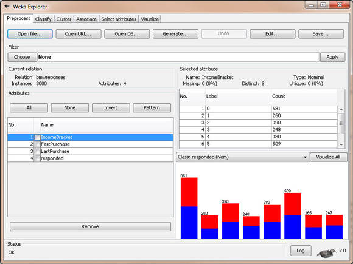
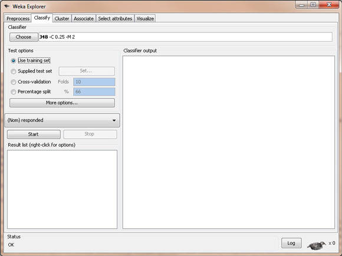
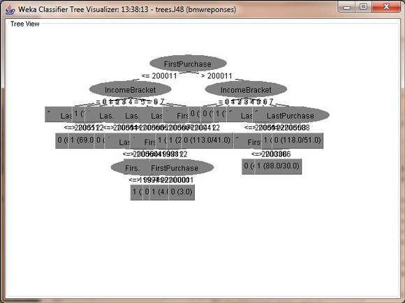
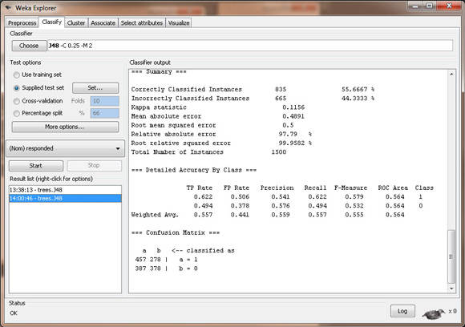
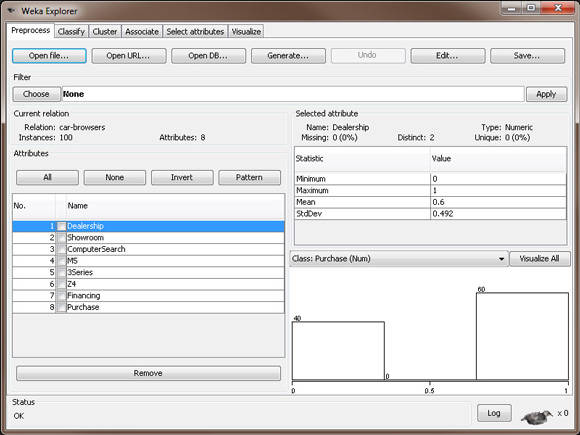
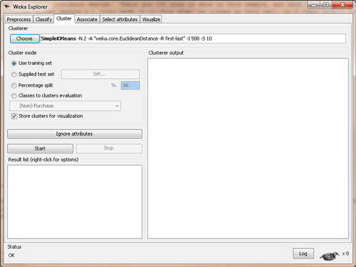
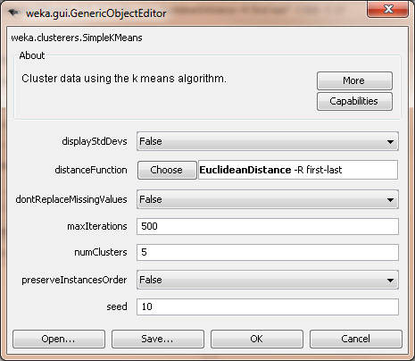
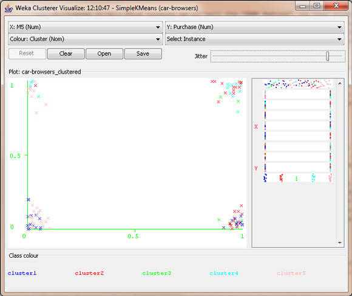

# 分类和群集
用 WEKA 进行数据挖掘，第 2 部分

**标签:** 分析

[原文链接](https://developer.ibm.com/zh/articles/os-weka2/)

Michael Abernethy

发布: 2010-05-31

* * *

## 简介

在 [用 WEKA 进行数据挖掘，第 1 部分：简介和回归](http://www.ibm.com/developerworks/cn/opensource/os-weka1/) ，我介绍了数据挖掘的概念以及免费的开源软件 Waikato Environment for Knowledge Analysis（WEKA），利用它可以挖掘数据来获得趋势和模式。我还谈到了第一种数据挖掘的方法 — 回归 — 使用它可以根据一组给定的输入值预测数字值。这种分析方法非常容易进行，而且也是功能最不强大的一种数据挖掘方法，但是通过它，读者对 WEKA 有了很好的了解，并且它还提供了一个很好的例子，展示了原始数据是如何转换为有意义的信息的。

在本文中，我将带您亲历另外两种数据挖掘的方法，这二者要比回归模型稍微复杂一些，但功能则更为强大。如果回归模型只能为特定输入提供一个数值输出，那么这两种模型则允许您对数据做不同的解析。正如我在第 1 部分中所说的，数据挖掘的核心就是将正确的模型应用于数据。即便有了有关客户的最佳数据（无论这意味着什么），但是如果没有将正确的模型应用于数据，那么这些数据也没有任何意义。不妨从另一个角度考虑这件事情：如果您只使用能生成数值输出的回归模型，那么 Amazon 如何能告知您”购买了 X 产品的客户还购买了 Y 产品”？这里没有数值型的函数能够告诉您这类信息。所以让我们来深入研究可用在数据中的其他两个模型。

在本文中，我会反复提及称为”最近邻”的数据挖掘方法，但我不会过多地对其进行剖析，详细的介绍会在第 3 部分给出。不过，我在本文中的比较和描述部分将它包括进来以使讨论更为完整。

## 分类 vs. 群集 vs. 最近邻

在我深入探讨每种方法的细节并通过 WEKA 使用它们之前，我想我们应该先理解每个模型 — 每个模型适合哪种类型的数据以及每个模型试图实现的目标。我们还会将我们已有的模型 — 回归模型 — 也包括在我们的讨论之中，以便您可以看到这三种新模型与我们已经了解的这个模型的对比。我将通过实际的例子展示每个模型的使用以及各自的不同点。这些实际的例子均围绕着一个本地的 BMW 经销店展开，研究它如何能增加销售。这个经销店已经保存了所有其过去的销售信息及有关购买过 BMW、留意过 BMW 或是来过 BMW 展厅的每个客户的信息。这个经销店想要增加未来的销售并部署了数据挖掘来实现此目标。

### 回归

问题：”对于新的 BMW M5 车型我们该如何定价？” 回归模型只能给出这个问题的一个数值答案。回归模型会使用 BMW 和 M5 的过去销售数据来基于所售汽车的属性和卖点确定人们过去在这个经销店购买车的价格。然后，回归模型允许 BMW 经销店插入新车的属性来确定其价格。

比如： `Selling Price = $25,000 + ($2900 * Liters in Engine) + ($9000 * isSedan) + ($11,000 * isConvertible) + ($100 * inches of car) + ($22,000 * isM)` 。

### 分类

问题：”那么客户 X 有多大的可能会购买最新的 BMW M5 呢？” 创建一个分类树（一个决策树），并借此挖掘数据就可以确定这个人购买一辆新的 M5 的可能性有多大。这个树上的节点可以是年龄、收入水平、目前拥有的车的数量、婚姻状况、有无孩子、房主还是租户。对这个决策树使用此人的这些属性就可以确定他购买 M5 的可能性。

### 群集

问题是：”哪个年龄组最喜欢银色的 BMW M5？”这就需要挖掘数据来对比过去购车者的年龄和过去购买的车的颜色。从这些数据，就能够找到某个年龄组（比如 22-30 岁）具有订购某种颜色的 BMW M5 的更高的倾向性（75% 购买蓝色）。同样地，它也可显示另一个不同的年龄组（比如 55-62）则更倾向于订购银色的 BMW（65 % 购买银色，20 % 购买灰色）。这些数据，当挖掘后，倾向于集中于某些特定年龄组和特定颜色周围，方便用户快速判断该数据内的模式。

### 最近邻

问题：”当人们购买 BMW M5 时，他们倾向于同时购买其他哪些选项？”数据挖掘显示，人们入店并购买一辆 BMW M5 时，他们还会倾向于购买与之配套的行李箱。（这也就是所谓的购物篮分析）。 使用此数据，汽车经销店就会将配套行李箱的促销广告放在店面的显眼处，甚至会在报纸上做促销广告，如果他们购买 M5，配套行李箱将免费/打折，以期增加销售。

## 什么是分类

_分类_ （也即分类树或决策树） 是一种数据挖掘算法，为如何确定一个新的数据实例的输出创建逐步指导。它所创建的这个树上的每个节点都代表一个位置，在这个位置必须基于输入做出决策，并且会从一个节点移到下一个节点直至到达能够得出预测的输出的叶子节点。这虽然听起来有些让人迷惑，但其实它非常直观。让我们看一个例子。

##### 清单 1\. 简单的分类树

```
[ Will You Read This Section? ]
          /              \
        Yes              No
        /                 \
[Will You Understand It?]  [Won't Learn It]
    /         \
Yes          No
/             \
[Will Learn It]  [Won't Learn It]

```

Show moreShow more icon

这个简单的分类树试图回答这个问题：”您理解分类树么？”在每个节点，您都会回答这个问题并继续沿着分支下移，直到您到达一个回答了是或不是的叶子节点。 这个模型可用于任何未知的数据实例，来预测这个未知数据实例是否通过只询问两个简单问题就能理解分类树。这看上去像是分类树的一大优势 — 它无需有关数据的大量信息就能创建一个十分准确且信息丰富的树。

分类树的一个重要概念非常类似于我们在 [用 WEKA 进行数据挖掘，第 1 部分：简介和回归](http://www.ibm.com/developerworks/cn/opensource/os-weka1/) 回归模型中看到的概念：使用一个”训练集”来生成模型。就是拿一组输出值已知的数据集并使用此数据集来创建我们的模型。之后，只要我们有一个输出值未知的新的数据点，我们都可以将其放入这个模型并生成预期的输出。这与我们在回归模型中看到的没有差别。只不过，这个模型更进了一步，通常会把整个训练集分成两个部分：拿数据的约 60-80 % 放入我们的训练集，用来生成模型；然后拿剩下的数据放入一个测试集，在模型生成后，立即用其来测试我们模型的准确性。

那么这个额外的步骤为什么在此模型中如此重要呢？这个问题就是所谓的 _过拟合_ ：如果我们提供 _过多_ 数据用于模型创建，我们的模型虽然会被完美创建，但只针对的是该数据。请记住：我们想使用此模型来预测未来的未知数；我们不是想使用此模型来准确地预测我们已经知道的值。这就是为什么我们要创建一个测试集。在创建了模型后，我们要进行检查以确保我们所创建模型的准确性不会在测试集降低。这就保证了我们的模型会准确地预测出未来的未知值。使用 WEKA 会看到它的实际效果。

这还引出了分类树的另一个重要概念：修剪。 _修剪_ 正如其名字所指，意思是删减分类树的枝条。那么为什么有人会想要将信息从分类树中删除呢？还是因为过拟合的缘故。随着数据集的增大以及属性数量的增长，我们所创建的树就会越来越复杂。理论上讲，一个树可以具有 `leaves = (rows * attributes)` 。但那又有何益处呢？就预测未来的未知数而言，它根本帮不到我们，因它只适于我们现有的训练数据。因此我们需要的是一种平衡。我们想要我们的树尽量简单，节点和枝叶尽量少。同时我们还想要它尽量地准确。这就需要进行权衡，我们不久就会看到。

在使用 WEKA 前，有关分类我还想指出最后一点，那就是假正和假负。假正指的是这样的一个数据实例：我们创建的这个模型预测它应该是正的，但事实相反，实际值却是负的。同样地，假负指的是这样一个数据实例：我们创建的这个模型预测它应该是负的，但事实相反，实际值却是正的。

这些错误表明在我们的模型中出了问题，我们的模型正在错误地分类某些数据。虽然可能会出现不正确的分类，但可接受的错误百分比由模型创建者决定。比如，如果是在医院里测试心脏监视器，很显然，将需要极低的错误百分比。而如果您只是在有关数据挖掘的文章中挖掘一些虚构的数据，那么错误率可以更高一些。为了使之更进一步，还需要决定可以接受的假负与假正的百分比率是多少。我立即想到的一个例子就是垃圾邮件模型：一个假正（一个真邮件被标记为了垃圾邮件）要比假负（一个垃圾消息未被标记为垃圾邮件）更具破坏性。在像这样的例子中，就可以判断假负：假正的比率最低为 100:1 才是可以接受的。

好了，对于分类树的背景和技术方面的介绍已经够多了。让我们现在开始获得一些真正的数据并将其带入 WEKA。

### WEKA 数据集

我们用于分类示例的数据集所围绕的仍然是我们虚构的 BMW 经销店。这个经销店正在启动一个推销计划，试图向其老客户推销两年延保。这个经销店过去曾做过类似的计划并从过去的销售中收集了 4,500 个数据点。数据集中的属性有：

- 收入水平 [0=$0-$30k, 1=$31k-$40k, 2=$41k-$60k, 3=$61k-$75k, 4=$76k-$100k, 5=$101k-$150k, 6=$151k-$500k, 7=$501k+]
- 第一辆 BMW 购买的年/月
- 最近的 BMW 购买的年/月
- 是否过去曾响应过延保计划

让我们来看看在这个例子中使用的 Attribute-Relation File Format (ARFF)。

##### 清单 2\. 分类 WEKA 数据

```
@attribute IncomeBracket {0,1,2,3,4,5,6,7}
@attribute FirstPurchase numeric
@attribute LastPurchase numeric
@attribute responded {1,0}

@data

4,200210,200601,0
5,200301,200601,1
...

```

Show moreShow more icon

### 在 WEKA 内进行分类

使用我们之前使用过的相同步骤来将数据文件 bmw-training.arff （参见示例代码） 载入 WEKA。请注意：这个文件只包含经销店记录内的这 4,500 个记录中的 3,000 个。我们需要分割我们的记录以便某些数据实例被用来创建模型，某些被用来测试模型以确保没有过拟合。在加载了数据后，屏幕应该类似于图 1。

##### 图 1\. WEKA 内的 BMW 分类数据



与我们在 [用 WEKA 进行数据挖掘，第 1 部分：简介和回归](http://www.ibm.com/developerworks/cn/opensource/os-weka1/) 中对回归模型所做的类似，我们选择 **Classify** 选项卡，然后选择 **trees** 节点，然后是 **J48** 叶子（我不知道为何这就是正式的名称，不过还是接受吧）。

##### 图 2\. BMW 分类算法



至此，我们已经准备好可以在 WEKA 内创建我们的模型了。请确保 **Use training set** 被选中以便我们使用刚刚加载的这个数据集来创建模型。单击 **Start** 并让 WEKA 运行。模型的输出应类似于清单 3 内的结果。

##### 清单 3\. WEKA 的分类模型的输出

```
Number of Leaves  :     28

Size of the tree :     43

Time taken to build model: 0.18 seconds

=== Evaluation on training set ===
=== Summary ===

Correctly Classified Instances        1774               59.1333 %
Incorrectly Classified Instances      1226               40.8667 %
Kappa statistic                          0.1807
Mean absolute error                      0.4773
Root mean squared error                  0.4885
Relative absolute error                 95.4768 %
Root relative squared error             97.7122 %
Total Number of Instances             3000

=== Detailed Accuracy By Class ===

               TP Rate   FP Rate   Precision   Recall  F-Measure   ROC Area  Class
                 0.662     0.481      0.587     0.662     0.622      0.616    1
                 0.519     0.338      0.597     0.519     0.555      0.616    0
Weighted Avg.    0.591     0.411      0.592     0.591     0.589      0.616

=== Confusion Matrix ===

    a    b   <-- classified as
1009  516 |    a = 1
710  765 |    b = 0

```

Show moreShow more icon

上述这些数字是什么意思？我们怎么才能知道这是一个好的模型？我们应该寻找的这个所谓的”树”在哪里？这些问题问得很好。让我们逐一回答：

- **这些数字是什么意思？** 这里应该关注的重要数字是”Correctly Classified Instances”（59.1 %）与”Incorrectly Classified Instances”（40.9 %）旁边的这些数字。其他的重要数字还有”ROC Area”列第一行的这个数字（0.616）；我稍候会详细解释这个数字，目前只需记住即可。最后，在”Confusion Matrix”中，显示了假正和假负的数量。在这个矩阵中，假正为 516，假负为 710。
- **我们怎么才能知道这是一个好的模型？** 由于准确率仅为 59.1 %，我不得不承认经初步分析后，这不是一个非常好的模型。
- **这个所谓的”树”在哪里？** 要看到这个树，可右键单击刚刚创建的这个模型。在弹出菜单中，选择 **Visualize tree** 。之后，就会看到我们所创建的这个分类树，虽然在本例中，可视树不能提供任何帮助。我们的树如图 3 所示。看到这个树的另一种方式是在 Classifier Output 内往高处看，其中的文本输出显示了具有节点和叶子的整个树。

##### 图 3\. 分类树可视化



还有最后一个步骤，就是验证我们的分类树，这需要贯穿模型运行我们的测试集并确保我们模型的准确性在测试集时与在训练集时相差不远。为此，在 **Test options** 内，选择 **Supplied test set** 单选按钮并单击 **Set** 。选择文件 bmw-test.arff，内含 1,500 条记录，而这些记录在我们用来创建模型的训练集中是没有的。当我们这次单击 **Start** 时，WEKA 将会贯穿我们已经创建的这个模型运行测试数据集并会让我们知道模型的情况。让我们现在单击 **Start** 。如下是输出。

##### 图 4\. 分类树测试



对比这个测试集的”Correctly Classified Instances”（55.7 %）与训练集的”Correctly Classified Instances”（59.1 %），我们看到此模型的准确性非常接近，这表明此模型不会在应用未知数据或未来数据时，发生故障。

不过，由于模型的准确性很差，只能正确地分类 60 % 的数据记录，因此我们可以后退一步说：”哦，这个模型一点都不好。其准确性勉强超过 50 %，我随便猜猜，也能得到这样的准确性。”这完全正确。这也是我想审慎地告诉大家的一点：有时候，将数据挖掘算法应用到数据集有可能会生成一个糟糕的模型。这一点在这里尤其准确，并且它是故意的。

我本想带您亲历用适合于分类模型的数据生成一个分类树的全过程。然而，我们从 WEKA 获得的结果表明我们错了。我们在这里本应选择的并 _非_ 分类树。我们所创建的这个模型不能告诉我们任何信息，并且如果我们使用它，我们可能会做出错误的决策并浪费钱财。

那么这是不是意味着该数据无法被挖掘呢？当然不是，只不过需要使用另一种数据挖掘方法：最近邻模型，该模型会在本系列的后续文章中讨论，它使用相同的数据集，却能创建一个准确性超过 88 % 的模型。它旨在强调一点：那就是必须为数据选择合适的模型才能得到有意义的信息。

**进一步阅读** ：如果您想更多地了解分类树，有一些关键字可以查找，因篇幅的原因我在这里就不逐一介绍了：ROC curves、AUC、false positives、false negatives、learning curves、Naive Bayes、information gain、overfitting、 pruning、chi-square test。

## 什么是群集

_群集_ 让用户可以通过数据组来从数据确定模式。当数据集已定义并且需要从此数据确定一个通用的模式时，群集的优势就会比较明显。您可以根据自身业务需要创建一定数量的组。与分类相比，群集的一个好处是数据集内的每个属性都被用来分析该数据。（在分类方法中，只有属性的一个子集用在了模型中。）使用群集的一个主要劣势是用户需要提前知道他想要创建的组的数量。若用户对其数据知之甚少，这可能会很困难。是应该创建三个组？五个组？还是十个组？所以在决定要创建的理想组数之前，可能需要进行几个步骤的尝试和出错。

不过，对于一般的用户，群集有可能是最为有用的一种数据挖掘方法。它可以迅速地将整个数据集分成组，供您快速得出结论。此方法背后的算法多少有些复杂和难懂，这也是我们为何要充分利用 WEKA 的原因。

### 算法概览

如下是对群集中所用算法的一个简要的快速概览：

1. 数据集内的每个属性都应该是规格化的，因此，每个值均除以该属性在数据集内的最高值与最低值间的差值。例如，如果属性是年龄，且最高值为 72，最低值为 16，那么年龄 32 将被规格化为 0.5714。
2. 理想的群集数量给定后，就可以随机地从数据集选择该数量的样例来充当我们初始测试群集中心。比如，如果想要有三个群集，那么就可以从数据集中随意选择三行数据。
3. 计算从每个数据样例到群集中心（我们随意选中的数据行）的距离，使用距离计算的最小平方法。
4. 基于到每个群集中心的最短距离将每个数据行分配给一个群集。
5. 计算 _重心_ ，即只使用每个群集的数的每列数据的平均数。
6. 计算每个数据样例与刚刚创建的这些重心之间的距离。如果群集及群集数不变，那么就说明大功告成，群集创建完毕。如果它们变化，那么就需要返回到步骤 3 重新开始并一遍遍重复，直到不再变化为止。

很显然，这看上去不怎么有趣。对于一个具有 10 行和三个群集的数据集，若使用电子数据表，需要花上 30 分钟才能完成。那么想象一下，如果有 100,000 数据行和 10 个群集，若用手工完成那将花费多长时间。所幸的是，计算机在几秒内就可以完成这类计算。

### WEKA 的数据集

我们为群集示例要使用的这个数据集同样也围绕着我们虚构的 BMW 经销店。这个经销店保留了人们如何在经销店以及展厅行走、他们看了哪些车以及他们最终购车的机率的记录。经销店期望通过寻找数据内的模式挖掘这些数据并使用群集来判断其客户是否有某种行为特点。在这个例子中有 100 行数据，并且每个列都描述了顾客在他们各自的 BMW 体验中所到达的步骤，比如列中的 1 表示到达这一步的顾客看过这辆车，0 表示他们不曾到达看过车的这一步。清单 4 显示了我们在 WEKA 中所使用的 ARFF 数据。

##### 清单 4\. 群集 WEKA 数据

```
@attribute Dealership numeric
@attribute Showroom numeric
@attribute ComputerSearch numeric
@attribute M5 numeric
@attribute 3Series numeric
@attribute Z4 numeric
@attribute Financing numeric
@attribute Purchase numeric

@data

1,0,0,0,0,0,0,0
1,1,1,0,0,0,1,0
...

```

Show moreShow more icon

### 在 WEKA 内进行群集

采用与将数据加载到 **Preprocess** 选项卡时的相同步骤来将数据文件 bmw-browsers.arff 加载到 WEKA 内。花上几分钟时间来查看一下这个选项卡内的数据。看看这些列、属性数据以及列的分布等。在加载数据后，屏幕应该类似于图 5。

##### 图 5\. WEKA 内的 BMW 群集数据



有了这个数据集，我们就可以开始创建群集了，所以这次不是单击 **Classify** 选项卡，而是要单击 **Cluster** 选项卡。单击 **Choose** 并从所出现的各种选项中选择 **SimpleKMeans** （这是本文中我们所期望的进行群集的方法）。这时的 WEKA Explorer 窗口应该如图 6 所示。

##### 图 6\. BMW 群集算法



最后，我们想要通过单击 **SimpleKMeans** 调整我们群集算法的属性（虽然不是最佳的 UI 设计，但还是先接受吧）。这里我们想要调整的这个算法的惟一属性是 **numClusters** 字段，它表明我们想要创建多少群集。（在开始之前，需要知道这一点。）让我们将默认值从 2 更改为 5，若将来想要调整所创建群集的数量，就可以采用这些步骤。此时的 WEKA Explorer 应该类似于图 7。单击 **OK** 以接受这些值。

##### 图 7\. 群集属性



至此，我们已经可以运行这个群集算法了。如果使用电子数据表处理 100 行数据和五个数据群集将会花费几个小时的计算时间，但 WEKA 在不到一秒钟的时间内就能给出答案。输出应该类似于清单 5。

##### 清单 5\. 群集输出

```
Cluster#
Attribute            Full Data      0          1          2          3          4
                       (100)       (26)       (27)        (5)       (14)       (28)
==================================================================================
Dealership              0.6     0.9615     0.6667          1     0.8571          0
Showroom               0.72     0.6923     0.6667          0     0.5714          1
ComputerSearch         0.43     0.6538          0          1     0.8571     0.3214
M5                     0.53     0.4615      0.963          1     0.7143          0
3Series                0.55     0.3846     0.4444        0.8     0.0714          1
Z4                     0.45     0.5385          0        0.8     0.5714     0.6786
Financing              0.61     0.4615     0.6296        0.8          1        0.5
Purchase               0.39          0     0.5185        0.4          1     0.3214

Clustered Instances

0       26 ( 26%)
1       27 ( 27%)
2        5 (  5%)
3       14 ( 14%)
4       28 ( 28%)

```

Show moreShow more icon

那么这些结果该如何解析呢？这个输出告诉我们每个群集是如何联系在一起的，其中 “1” 表示该群集中的每个人都有相同的值 1，而 “0” 则表示该群集中的每个人的该属性都有一个值 0。其他的数值是群集内的每个人的平均值。每个群集向我们展示了顾客内的一种行为类型，从中我们可以开始得出如下结论：

- **群集 0** — 这个组我们可以称之为 “Dreamers”，因他们围着经销店徘徊，查看在停车场上停着的车，却不步入店面内，且更糟的是，他们没有购买过任何东西。
- **群集 1** — 我们将这一组称为是 “M5 Lovers”，因为他们常常会径直走到 M5 车型区，对 3-系列的车型和 Z4 均视而不见。不过，他们也没有多高的购买率 — 只有 52 %。这表明存在潜在问题，也是经销店今后改进的重点，比如可以派更多的销售人员到 M5 区。
- **群集 2** — 这个组很小，我们可以称之为 “Throw-Aways”，因为他们没有统计意义上的相关性，我们也不能从其行为得出任何好的结论。（这种情况若在群集上发生，可能表明应该减少所创建的群集的数量。）
- **群集 3** — 这个组，我们称之为 “BMW Babies”，因为他们总是会购买一辆车而且还会支付车款。正是在这里，数据向我们显示了一些有趣的事情：他们一般会在停车场内查看各种车型，然后返回到经销店内的计算机处搜索中意的车型是否有货。他们最终会购买 M5 或 Z4 车型（但从不购买 3-系列的）。这个群集告诉经销店它应该考虑让它的搜索计算机在停车场处就能很容易地被看到（或安置一台室外的搜索计算机），并且让 M5 或 Z4 在搜索结果中更为醒目。一旦顾客决定购买汽车，他总是符合购车款的支付条件并能够圆满完成这次购买。
- **群集 4** — 这个组我们将称之为 “Starting Out With BMW”，因为他们总是看 3-系列的车型，从不看贵很多的 M5。他们会径直步入展厅，而不会在停车场处东看西看，而且也不会使用计算机搜索终端。他们中有 50 % 会到达支付车款的阶段，但只有 32 % 会最终成交。经销店可以得出这样的结论：这些初次购买 BMW 车的顾客知道自己想要的车型是哪种（ 3-系列的入门级车型）而且希望能够符合购车款的支付条件以便买得起。经销店可以通过放松购车款的支付条件或是降低 3- 系列车型的价格来提高这一组的销售。

研究这些群集中数据的一种有趣方式是可视地查看它。为此，应该在 **Cluster** 选项卡上的这个 **Result List** 区域右键单击（同样地，亦不是最佳设计的 UI）。弹出菜单的一个选项是 **Visualize Cluster Assignments** 。弹出的窗口则会让您处理这些结果并可视地查看它们。对于本例，将 X 轴更改为 `M5 (Num)` ，将 Y 轴更改为 `Purchase (Num)` ，将颜色更改为 `Cluster (Nom)` 。结果，有一个图表会向我们显示这些群集是如何按照谁看过 M5 以及谁购买了一辆 M5 分组的。而且，将”Jitter”放大到最高的 3/4 处，这会手动地将这些标绘点分散开以便我们能更容易地看到它们。

那么这些可视结果是否与我们从清单 5 中的结果集中得出的结论相符呢？我们可以从 X=1, Y=1 这一点（即看过 M5 且进行过购买的那些人）看出这里所表示的群集只有是 1 和 3。我们还看到处于点 X=0, Y=0 的群集只有 4 和 0。那么这与我们上述结论是否相符呢？答案是肯定的。群集 1 和 3 是过去购买过 M5 的，而群集 0 则没有购买过任何车型，群集 4 只关注 3-系列。图 8 显示了本例的可视群集布局。您可以随意尝试更改 X 和 Y 轴来辨别出其他的趋势和模式。

##### 图 8\. 群集可视查看



**进一步阅读** ：如果您有兴趣进一步钻研，可以按如下术语搜索相关信息： Euclidean distance、Lloyd’s algorithm、Manhattan Distance、Chebyshev Distance、sum of squared errors、cluster centroids。

## 结束语

本文讨论了两种数据挖掘算法：分类树和群集。这两种算法与 [用 WEKA 进行数据挖掘，第 1 部分：简介和回归](http://www.ibm.com/developerworks/cn/opensource/os-weka1/) 中介绍的回归模型的算法不同之处在于没有从模型只能得到数值输出的限制。这两个模型允许输出更为灵活，是数据挖掘领域的两个功能更为强大的武器。

从字面上理解，分类树就是要创建一个具有分支、节点和枝叶的树，能够让我们拿一个未知的数据点，将此数据点的属性应用到这个树并顺着这个树下移，直到到达一个叶子并且数据点的未知输出可以断定。我们了解了为了创建一个好的分类树模型，我们必须要有一个输出已知的现有数据集，从这个数据集才能构建我们的模型。我们还看到了我们需要将我们的数据集分成两个部分：一个用来创建模型的训练集 ；一个用来验证模型是否正确且没有过拟合的测试集。作为本部分的最后一个要点，我还指出在某些时候，即便是创建了一个您认为正确的数据模型，它也可能不正确，而您必须要摒弃整个模型和算法以寻找更好的解决方案。

群集算法是对一个数据集中的数据进行分组，以便您可以基于在这些组中看到的趋势得出结论。群集与分类及回归的不同之处在于它不生成单个的输出变量（结论容易得出），因而要求您必需观察输出并尝试得出自己的结论。正如在本例中看到的，这个模型生成了五个群集，但对群集内的这些数据的分析以及从这些信息中得出结论则取决于我们。就此而言，非常难以生成准确的群集模型（想象一下如果我们创建了过多或过少的群集，结果将会如何），而另一方面，我们将能够从这个结果集中挖掘出一些有趣的信息 — 这些信息是使用我们之前讨论过的其他任何模型都无法得到的。

[第 3 部分](https://www.ibm.com/developerworks/cn/opensource/os-weka3/index.html) 是 “用 WEKA 进行数据挖掘” 系列的结束篇，会以最近邻模型结束我们对模型的讨论。我们还将会将 WEKA 用作第三方 Java™ 库，而不是作为一个独立的应用程序，这样一来，我们就可以将其直接嵌入到我们的服务器端代码。我们也就能够在我们的服务器上直接挖掘数据，而无须将它处理成一个 ARFF 文件后才能手动运行它。

## 下载示例代码

[os-weka2-Examples.zip](http://public.dhe.ibm.com/software/dw/opensource/os-weka2-Examples.zip)

本文翻译自： [Classification and clustering](https://developer.ibm.com/articles/os-weka2/)（2010-05-12）